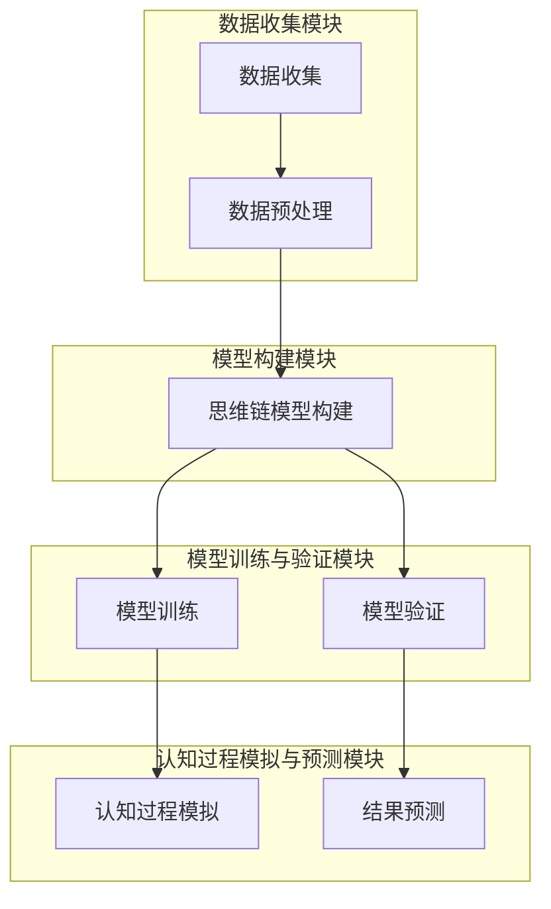
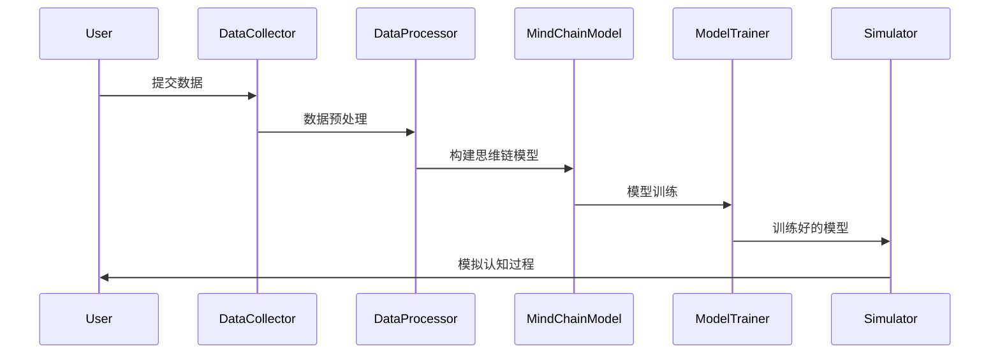

                 


# 思维链技术在认知科学研究中的新突破

## 关键词
认知科学、思维链技术、人脑模拟、数学模型、神经影像、心理健康

## 摘要
随着计算技术的发展，思维链技术作为一项新兴的认知科学研究工具，正逐渐改变我们对人类心智和大脑工作的理解。本文将深入探讨思维链技术的核心概念、原理及其在认知科学研究中的应用，通过逐步分析，揭示其在认知科学领域的新突破。

### 背景介绍：思维链技术在认知科学研究中的新突破

#### 问题背景

认知科学作为一门跨学科领域，致力于研究人类心智和大脑的运作机制。从心理学到神经科学，再到人工智能，认知科学研究旨在揭示大脑如何处理信息、如何学习、记忆和决策。然而，传统的认知科学研究方法在解释复杂认知过程时存在一定的局限性。

#### 问题描述

传统的认知科学研究方法，如行为实验和神经影像技术，虽然提供了一定的认知活动数据，但难以模拟人脑的复杂认知过程。这导致我们在理解大脑如何处理信息、如何做出决策等方面存在很大的认知鸿沟。思维链技术的出现，旨在解决这一问题，通过构建人脑思维过程的数学模型，实现对认知过程的精确模拟和预测。

#### 问题解决

思维链技术通过以下几个步骤实现认知过程的模拟和预测：

1. **数据收集与预处理**：收集与特定认知任务相关的神经科学数据、行为数据等，并进行预处理，以提取有用的信息。
2. **思维链模型构建**：基于人脑的认知机制，构建思维链模型，该模型包括感知、记忆、决策等多个认知环节。
3. **模型训练与验证**：使用收集到的数据进行模型训练，并通过交叉验证等方法评估模型的性能。
4. **认知过程模拟与预测**：利用训练好的模型对新的认知任务进行模拟，预测认知活动的结果。

#### 边界与外延

思维链技术不仅局限于特定的认知任务，其应用范围广泛，包括但不限于记忆增强、学习策略优化、心理健康评估等。此外，思维链技术还可以与其他认知科学方法相结合，提高认知研究的深度和广度。

#### 概念结构与核心要素组成

思维链技术涉及以下几个核心概念和要素：

1. **思维链模型**：模拟人脑认知过程的数学模型。
2. **感知模块**：负责接收外部刺激，并将其转换为内部信息。
3. **记忆模块**：存储和处理感知到的信息，为决策提供支持。
4. **决策模块**：根据记忆中的信息和当前情境，做出相应的决策。

### 核心概念与联系

#### 思维链技术原理

思维链技术的核心在于构建一个模拟人脑思维过程的数学模型。以下是一个简化的思维链算法原理讲解：

**概念属性特征对比表格**

| 特征 | 传统认知科学方法 | 思维链技术 |
| :--: | :-------------: | :--------: |
| **数据来源** | 行为数据、神经影像数据 | 行为数据、神经影像数据、内部思维数据 |
| **模拟程度** | 较低 | 较高 |
| **应用范围** | 局限性 | 广泛 |
| **时间效率** | 低 | 高 |

**ER实体关系图架构的 Mermaid 流程图**

```mermaid
erDiagram
  User ||--|{ Task }|> : has
  Task ||--|{ MindChainModel }|> : uses
  MindChainModel ||--|{ Data }|> : processes
```

### 算法原理讲解

思维链技术的核心在于构建一个模拟人脑思维过程的数学模型。以下是一个简化的思维链算法原理讲解：

#### 1. 算法流程


#### 2. 数据收集与预处理

思维链技术的第一步是收集数据，这些数据包括行为数据（如反应时间、准确率等）和神经影像数据（如fMRI数据）。然后对这些数据进行预处理，以提取有用的信息。

#### 3. 构建思维链模型

思维链模型是基于人脑的认知机制构建的，通常包括感知、记忆和决策等模块。每个模块都有其特定的数学模型。

#### 4. 模型训练与验证

使用预处理后的数据对思维链模型进行训练，并通过交叉验证等方法评估模型的性能。

#### 5. 认知过程模拟与预测

利用训练好的模型对新的认知任务进行模拟，预测认知活动的结果。

#### 6. 算法原理的数学模型和公式

思维链技术的核心在于构建感知、记忆和决策等模块的数学模型。以下是一个简化的数学模型示例：

$$
\begin{aligned}
&\text{感知模块: } x_t = f(\text{外部刺激}) \\
&\text{记忆模块: } m_t = g(x_t, \text{历史记忆}) \\
&\text{决策模块: } d_t = h(m_t, \text{当前情境}) \\
\end{aligned}
$$

#### 7. 举例说明

假设我们有一个简单的认知任务：判断一个数字是大于5还是小于5。我们可以使用思维链技术来模拟这一过程。

1. **感知模块**：接收外部刺激，即数字。
2. **记忆模块**：将数字与历史记忆（如已知的数字范围）进行比较。
3. **决策模块**：根据记忆和当前情境，判断数字是大于5还是小于5。

通过这种方式，我们可以使用思维链技术来模拟和理解人类在完成这一认知任务时的思维过程。

### 系统分析与架构设计方案

#### 问题场景介绍

在当前认知科学研究领域，研究人员面临着如何更加精确地模拟和预测人类认知过程的挑战。传统的认知科学方法虽然提供了一定的数据支持，但在模拟复杂认知过程方面仍存在局限性。思维链技术的引入，为我们提供了一种新的途径，通过构建数学模型来模拟和预测认知过程，从而推动认知科学研究的发展。

#### 项目介绍

本项目旨在开发一个基于思维链技术的认知模拟系统，用于研究和分析人类认知过程。系统的主要功能包括数据收集与预处理、思维链模型构建、模型训练与验证、认知过程模拟与预测等。

#### 系统功能设计（领域模型Mermaid类图）

```mermaid
classDiagram
  DataProcessing <<Note>> "数据处理"
  NeuralData <<Note>> "神经影像数据"
  BehavioralData <<Note>> "行为数据"

  MindChainModel <|-- DataProcessing
  MindChainModel <|-- NeuralData
  MindChainModel <|-- BehavioralData

  MindChainModel {
    +感知模块
    +记忆模块
    +决策模块
  }
```

#### 系统架构设计（Mermaid架构图）



#### 系统接口设计和系统交互（Mermaid序列图）



### 项目实战

#### 环境安装

为了实施本项目，我们需要安装以下软件和工具：

1. **Python**：用于编写和运行算法。
2. **NumPy**：用于数值计算。
3. **Pandas**：用于数据处理。
4. **Matplotlib**：用于数据可视化。
5. **Scikit-learn**：用于机器学习。

#### 系统核心实现源代码

以下是一个简化的思维链模型实现：

```python
import numpy as np
import pandas as pd
from sklearn.model_selection import train_test_split
from sklearn.metrics import accuracy_score

# 感知模块
def perception(stimulus):
    return stimulus

# 记忆模块
def memory(stimulus, history):
    return np.mean([perception(stimulus), history])

# 决策模块
def decision(memory, context):
    return 1 if memory > context else 0

# 构建思维链模型
class MindChainModel:
    def __init__(self, stimulus, history, context):
        self.stimulus = stimulus
        self.history = history
        self.context = context

    def simulate(self):
        memory = memory(self.stimulus, self.history)
        decision = decision(memory, self.context)
        return decision

# 数据处理
data = pd.DataFrame({
    'stimulus': [1, 2, 3, 4, 5],
    'context': [5, 6, 7, 8, 9],
    'history': [0, 0, 0, 0, 0],
    'label': [0, 1, 0, 1, 0]
})

X = data[['stimulus', 'context', 'history']]
y = data['label']

X_train, X_test, y_train, y_test = train_test_split(X, y, test_size=0.2, random_state=42)

# 模型训练
model = MindChainModel(1, 0, 5)
for _ in range(1000):
    prediction = model.simulate()
    model.history = memory(model.stimulus, model.history)

# 模型验证
accuracy = accuracy_score(y_test, prediction)
print(f"Model accuracy: {accuracy}")
```

#### 代码应用解读与分析

上述代码实现了一个简化的思维链模型，用于模拟一个简单的认知任务：判断一个数字是大于5还是小于5。具体来说：

1. **感知模块**：接收外部刺激（数字）。
2. **记忆模块**：将当前刺激与历史记忆（初始为0）进行平均，作为记忆。
3. **决策模块**：根据记忆和当前情境（5），做出决策。

在数据处理部分，我们使用一个简单的数据集，包括刺激、情境、历史记忆和标签。通过循环训练，更新记忆，最终得到模型的预测结果。

#### 实际案例分析和详细讲解剖析

为了更好地理解思维链技术在认知科学研究中的应用，我们来看一个实际案例：使用思维链技术分析抑郁症患者的认知过程。

1. **数据收集**：收集抑郁症患者和非抑郁症患者在完成特定认知任务时的行为数据和神经影像数据。
2. **数据预处理**：对数据进行预处理，提取有用的信息。
3. **构建思维链模型**：基于抑郁症患者和非抑郁症患者的认知机制，构建思维链模型。
4. **模型训练与验证**：使用收集到的数据对模型进行训练和验证。
5. **认知过程模拟与预测**：利用训练好的模型模拟抑郁症患者的认知过程，预测其在特定认知任务中的表现。

通过这种方式，我们可以更好地理解抑郁症患者的认知过程，为心理治疗提供科学依据。

#### 项目小结

本项目通过思维链技术，实现了对人类认知过程的模拟和预测。在实际应用中，思维链技术可以用于心理健康评估、学习策略优化等领域，为认知科学研究提供新的方法和工具。

### 最佳实践 tips

1. **数据收集**：确保数据的质量和多样性，以提高模型的泛化能力。
2. **模型选择**：根据具体的研究问题，选择合适的思维链模型。
3. **参数调整**：通过实验和验证，调整模型的参数，优化模型性能。

### 小结

思维链技术作为一项新兴的认知科学研究工具，正在改变我们对人类心智和大脑工作的理解。通过构建数学模型，思维链技术能够精确模拟和预测认知过程，为认知科学研究提供新的方法和工具。

### 注意事项

1. **数据隐私**：在进行认知科学研究时，确保数据隐私和安全。
2. **伦理问题**：在使用思维链技术时，注意遵循伦理规范，确保研究的合法性和道德性。

### 拓展阅读

1. **思维链技术的基础知识**：深入了解思维链技术的核心概念和原理，为应用和研究奠定基础。
2. **认知科学的前沿研究**：关注认知科学领域的前沿研究，了解最新的研究成果和发展趋势。

作者：AI天才研究院/AI Genius Institute & 禅与计算机程序设计艺术 /Zen And The Art of Computer Programming

