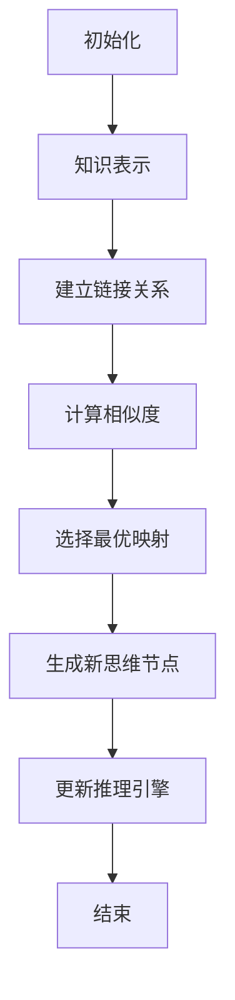
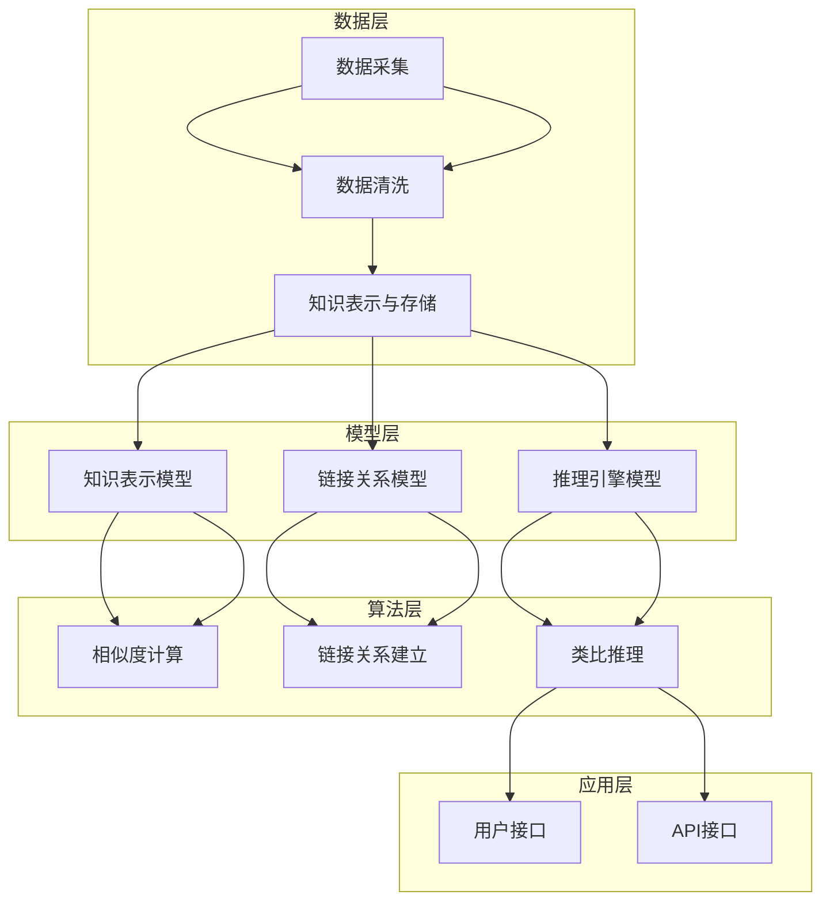
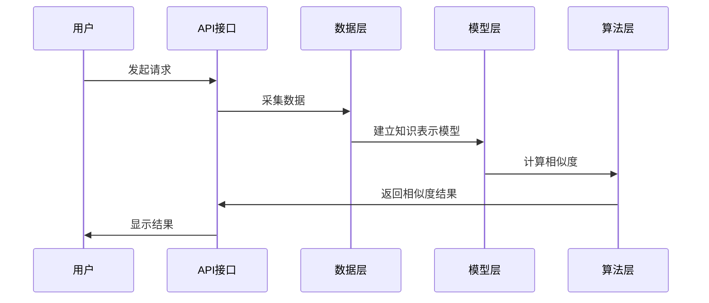

                 

### 引言与背景

近年来，人工智能（AI）技术发展迅速，已经渗透到各个领域，从医疗诊断到自动驾驶，从智能助手到金融预测，AI的应用场景越来越广泛。然而，随着应用需求的不断提高，AI系统在处理复杂任务时仍然存在一定的局限性。特别是对于类比推理这一核心能力，传统的AI模型难以胜任。为了解决这一问题，思维链技术（Mind Chain Technology）应运而生。

#### 问题背景

类比推理是人类智能的核心能力之一，它指的是在新的情境中，通过比较和类比已有的知识和经验来解决问题。例如，当我们看到一只猫时，我们可能会联想到其他猫科动物，并预测它们的某些特征。这种能力使人类能够快速适应新环境，解决复杂问题。然而，目前大多数AI系统在类比推理方面表现不佳，这限制了它们在复杂任务中的性能。

#### 问题描述

在AI领域，类比推理的问题主要体现在以下几个方面：

1. **数据依赖性高**：传统AI模型往往依赖于大量的数据来进行训练，类比推理能力较弱。
2. **泛化能力不足**：AI模型在特定领域内表现出色，但在面对新的或类似的任务时，往往无法有效推理。
3. **逻辑推理能力不足**：传统AI模型缺乏逻辑推理能力，无法像人类一样进行深层次的类比推理。

#### 问题解决

为了解决上述问题，思维链技术提出了一个新的思路。思维链技术通过构建一个由多个思维节点组成的网络，模拟人类的思维过程，从而增强AI的类比推理能力。这种方法不仅能够提高AI系统的泛化能力，还能使其在处理复杂任务时更加灵活。

#### 边界与外延

思维链技术的边界主要在于其应用范围和实现难度。首先，思维链技术适合应用于需要类比推理能力的领域，如教育、商业决策和医疗诊断等。其次，实现思维链技术需要强大的计算能力和复杂的算法设计。

#### 概念结构与核心要素组成

思维链技术由以下几个核心要素组成：

1. **思维节点**：思维节点是思维链的最小单位，代表一个具体的思维概念或知识。
2. **链接关系**：链接关系描述思维节点之间的逻辑关系，如因果关系、相似关系等。
3. **推理引擎**：推理引擎负责根据已有的知识和链接关系进行推理，生成新的思维节点。

通过这些核心要素，思维链技术能够模拟人类的思维过程，实现高效的类比推理。

综上所述，思维链技术作为一种创新的AI技术，有望解决传统AI在类比推理方面的不足，从而推动AI技术在更广泛的应用场景中取得突破。在接下来的章节中，我们将详细探讨思维链技术的定义、基本原理以及其在AI中的应用，为理解这一技术奠定基础。### 思维链技术概述

思维链技术（Mind Chain Technology），作为一种创新的AI辅助工具，旨在模拟人类的思维过程，提高AI系统的类比推理能力。本节将详细介绍思维链技术的定义、基本原理及其核心特征，帮助读者理解这一技术的基本概念和原理。

#### 思维链技术的定义

思维链技术可以被定义为一个由多个思维节点组成的网络系统，通过这些节点及其之间的链接关系，实现类似人类思维的推理和决策过程。具体来说，思维链技术通过构建一个基于知识图谱的智能网络，将海量信息和知识进行组织和管理，使得AI系统能够在新的情境下进行类比推理，从而解决复杂问题。

#### 思维链技术的基本原理

思维链技术的基本原理可以概括为以下几点：

1. **知识表示**：思维链技术采用知识图谱的方式表示知识，将知识分解为多个思维节点，每个节点代表一个具体的概念或事实。
2. **链接关系**：思维链技术通过定义链接关系来描述思维节点之间的逻辑关系，如因果关系、相似关系、包含关系等。
3. **推理引擎**：推理引擎负责根据已有的知识和链接关系进行推理，生成新的思维节点。这个过程类似于人类的联想思维，通过已有的知识和经验来推测新情境的可能结果。
4. **动态更新**：思维链技术具有动态更新的能力，可以根据新的信息和反馈不断调整和优化知识网络，使其更加符合现实情境。

#### 思维链技术的核心特征

思维链技术具有以下几个核心特征：

1. **高度灵活性**：思维链技术能够适应各种不同的应用场景，通过灵活的链接关系和推理引擎，实现高效的类比推理。
2. **强大的泛化能力**：思维链技术能够将特定领域内的知识和经验泛化到其他类似领域，从而提高AI系统的通用性。
3. **实时性**：思维链技术具有实时推理的能力，可以在处理问题时快速做出反应，适应动态变化的情境。
4. **自主性**：思维链技术具有自主学习和优化能力，可以通过自我调整和优化，不断提高推理和决策的准确性。

通过以上定义和原理的介绍，读者可以初步了解思维链技术的基本框架和运作机制。在接下来的章节中，我们将进一步探讨AI和类比推理的基本概念，以及思维链技术在增强AI类比推理能力方面的具体应用。这将帮助我们更深入地理解思维链技术在AI领域中的潜力和价值。### AI概述

人工智能（Artificial Intelligence，简称AI）是计算机科学的一个重要分支，致力于通过模拟人类智能行为，实现机器在特定任务上的自主学习和决策能力。AI的研究和应用已经经历了数十年的发展，从早期的符号主义到基于统计学习的机器学习，再到现在的深度学习，AI技术不断取得突破，并在各个领域展现出了强大的应用潜力。

#### AI的定义

人工智能可以被定义为一种模拟人类智能行为的计算系统，它能够通过学习和理解环境中的数据，实现自主决策和问题解决。AI系统通常具备以下几个关键特征：

1. **学习能力**：AI系统能够从数据中学习，不断改进自身的性能。
2. **感知能力**：AI系统能够感知和理解环境中的信息。
3. **推理能力**：AI系统能够根据已有的知识和信息进行推理和决策。
4. **适应性**：AI系统能够适应新的环境和任务，具备泛化能力。

#### AI的发展历程

1. **符号主义阶段（1950s-1980s）**：早期的人工智能研究主要基于符号主义方法，通过定义逻辑推理规则和符号系统，模拟人类的推理过程。这一阶段以专家系统和知识表示方法为代表，但受限于计算能力和知识表示的局限性，AI系统在实际应用中的效果不佳。

2. **机器学习阶段（1990s-2000s）**：随着计算机性能的不断提升和海量数据的出现，机器学习方法开始兴起。机器学习通过统计学和概率论的方法，让AI系统从数据中自动学习特征和模式。这一阶段以决策树、支持向量机（SVM）和神经网络等算法为代表，显著提高了AI系统的性能和应用范围。

3. **深度学习阶段（2010s至今）**：深度学习作为机器学习的最新进展，通过多层神经网络模拟人脑的神经网络结构，实现了对大规模数据的自动特征学习和模式识别。深度学习在图像识别、自然语言处理和语音识别等领域取得了突破性成果，成为当前AI研究的热点和重要应用方向。

#### AI的应用领域

人工智能已经广泛应用于各个领域，以下是一些典型的应用场景：

1. **图像识别**：通过深度学习算法，AI系统可以自动识别和分类图像中的物体和场景，广泛应用于人脸识别、安防监控、医学影像诊断等领域。
2. **自然语言处理**：AI系统通过自然语言处理技术，能够理解和生成自然语言，应用于智能客服、机器翻译、文本分析等领域。
3. **语音识别与生成**：AI系统可以实时识别和理解人类语音，并生成语音反馈，广泛应用于智能助手、车载系统、电话客服等领域。
4. **自动驾驶**：通过结合计算机视觉、传感器技术和深度学习算法，自动驾驶系统能够实现车辆在复杂道路环境中的自主导航和驾驶。
5. **医疗诊断**：AI系统在医学影像诊断、基因组分析、药物研发等领域展现出巨大的潜力，通过分析大量数据，提供辅助诊断和治疗建议。

#### 类比推理在AI中的应用

类比推理是人类智能的核心能力之一，它通过比较和类比已有的知识和经验来解决问题。在AI中，类比推理被广泛应用于以下几个方面：

1. **问题解决**：AI系统通过类比推理，可以从已知问题的解决方案中推导出类似问题的解决方案，提高问题解决能力。
2. **知识拓展**：通过类比推理，AI系统可以将一个领域的知识应用到其他领域，实现知识的泛化和迁移。
3. **推理优化**：类比推理可以帮助AI系统在复杂的推理过程中，通过比较不同解决方案的优劣，优化推理过程。

总之，人工智能作为一门不断发展的科学，其应用领域越来越广泛，类比推理作为AI系统的重要能力之一，对于提高AI系统的推理能力和自主性具有重要意义。在接下来的章节中，我们将深入探讨思维链技术与AI的结合，以及如何利用思维链技术增强AI的类比推理能力。这将为我们理解AI技术的最新进展和未来发展方向提供有益的启示。### 类比推理的概念与原理

类比推理（Analogical Reasoning）是人类智能的核心组成部分，指的是在新的情境中，通过比较和类比已有的知识和经验来解决问题或做出决策。类比推理不仅帮助我们理解新事物，还能提高问题解决效率和创造力。在人工智能（AI）领域，类比推理被广泛研究，旨在使机器能够模拟人类的这种思维方式，从而在复杂任务中表现出更高的智能。

#### 类比推理的定义

类比推理是一种基于相似性的推理过程，它通过比较两个或多个情境或对象的相似性，推导出它们之间的潜在联系或结论。类比推理通常遵循以下步骤：

1. **识别相似性**：找到两个或多个对象或情境之间的相似之处。
2. **建立映射**：将已知情境或对象的知识映射到新的情境或对象上。
3. **推理和预测**：基于相似性推导出新的结论或预测。

例如，当我们看到一只猫时，我们会将其与已知的知识（如其他猫科动物）进行比较，从而推测猫的某些特征（如有爪子、会喵喵叫）。

#### 类比推理的原理

类比推理的原理基于几个关键概念：

1. **相似性**：相似性是类比推理的核心。在AI中，相似性可以通过距离度量或相似性度量来量化。
2. **知识迁移**：类比推理涉及将一个领域的知识迁移到另一个领域。这个过程需要找到两个领域之间的共同点和差异。
3. **归纳推理**：类比推理是一种归纳推理的形式，它通过具体实例推广到一般规律。

#### 类比推理在AI中的应用

在AI领域，类比推理被广泛应用于以下几个场景：

1. **问题解决**：通过类比推理，AI系统可以从解决类似问题的经验中推导出新的解决方案。例如，在医疗诊断中，AI系统可以通过类比已知的病例来诊断新的病例。
2. **知识拓展**：类比推理可以帮助AI系统将一个领域的知识应用到其他领域。例如，在图像识别中，AI系统可以通过类比已经学习过的图像特征来识别新的图像。
3. **推理优化**：类比推理可以优化AI系统的推理过程。例如，在规划任务中，AI系统可以通过类比过去的成功计划来优化当前的计划。

#### 类比推理的优势和挑战

**优势**：

1. **提高效率**：类比推理可以帮助AI系统快速解决问题，减少搜索和计算的复杂度。
2. **增强泛化能力**：通过类比推理，AI系统可以学会在不同情境下应用已有知识，提高泛化能力。
3. **增强创造力**：类比推理可以激发AI系统的创造力，帮助其在解决问题时采取新颖的方法。

**挑战**：

1. **相似性识别**：准确地识别相似性是类比推理的关键，但在复杂的环境中，相似性的识别往往具有挑战性。
2. **知识迁移**：将知识从一个领域迁移到另一个领域需要找到共同点和差异，这需要复杂的算法和大量的数据支持。
3. **推理准确性**：类比推理的准确性受到相似性识别和知识迁移的影响，因此需要不断优化和调整推理过程。

综上所述，类比推理作为人工智能领域的重要研究课题，其概念和原理为我们理解AI的推理过程提供了重要的启示。在接下来的章节中，我们将探讨思维链技术在增强AI类比推理能力方面的应用，并分析其如何应对类比推理中的挑战。这将为我们理解如何提升AI系统的智能水平提供新的思路。### 思维链技术在AI中的应用

思维链技术作为一项创新的AI辅助工具，其在增强AI的类比推理能力方面表现出显著的优势。通过模拟人类的思维过程，思维链技术不仅提高了AI系统的推理能力，还解决了传统AI在类比推理中面临的一些挑战。本节将详细探讨思维链技术在AI中的应用，以及如何通过这种技术增强AI的类比推理能力。

#### 思维链技术在AI中的应用场景

思维链技术可以在多个AI应用场景中发挥重要作用，以下是一些典型的应用场景：

1. **教育领域**：在教育领域中，思维链技术可以辅助学生进行知识学习。通过构建思维链网络，AI系统可以为学生提供个性化的学习路径，引导学生进行类比推理，从而加深对知识的理解。

2. **商业决策**：在商业决策中，思维链技术可以帮助企业分析市场趋势和竞争状况，通过类比推理预测未来市场动态，为企业提供决策支持。

3. **医疗诊断**：在医疗诊断中，思维链技术可以通过类比已知病例，帮助医生诊断新的病例。这不仅可以提高诊断的准确性，还能减轻医生的工作负担。

4. **自动驾驶**：在自动驾驶领域，思维链技术可以帮助车辆识别道路环境，通过类比已知的道路状况，预测道路变化，从而提高自动驾驶的安全性和可靠性。

5. **智能客服**：在智能客服中，思维链技术可以通过类比历史对话和用户行为，为用户提供个性化的服务和建议，提高用户满意度。

#### 思维链技术增强类比推理能力的关键技术

为了实现思维链技术在AI中的应用，以下几个关键技术是必不可少的：

1. **知识表示**：思维链技术通过知识图谱的方式对知识进行表示。知识图谱由多个思维节点和链接关系组成，每个思维节点代表一个具体的概念或事实，链接关系描述节点之间的逻辑关系。

2. **链接关系**：链接关系是思维链技术的核心，它通过定义节点之间的因果关系、相似关系、包含关系等，使得AI系统能够在复杂的情境中建立有效的知识关联。

3. **推理引擎**：推理引擎负责根据已有的知识和链接关系进行推理，生成新的思维节点。推理引擎通常基于符号推理或基于统计学习的方法，以实现高效且准确的推理。

4. **动态更新**：思维链技术具备动态更新的能力，可以通过不断学习和优化，使知识网络更加符合现实情境，从而提高类比推理的准确性和适应性。

#### 思维链技术的实现思路与框架

实现思维链技术通常需要以下步骤：

1. **知识采集与表示**：首先，从不同来源获取知识，并使用知识图谱进行表示。这包括构建思维节点和定义链接关系。

2. **链接关系建模**：根据具体的任务需求，建立节点之间的链接关系模型。这些模型可以是基于统计的相似性模型，也可以是基于逻辑的因果关系模型。

3. **推理引擎开发**：开发推理引擎，使其能够根据已有的知识和链接关系进行推理，生成新的思维节点。

4. **动态更新机制**：设计动态更新机制，使AI系统可以不断学习和优化知识网络，提高类比推理的准确性和适应性。

5. **应用集成与测试**：将思维链技术集成到具体的AI应用中，并进行测试和优化，确保其在实际应用中的性能和效果。

#### 实现思维链技术的挑战与解决方案

1. **知识表示的准确性**：准确的知识表示是思维链技术的关键。为了提高知识表示的准确性，可以采用多种方法，如引入领域专家进行知识标注，使用自动知识抽取技术等。

2. **链接关系的复杂度**：链接关系的复杂度直接影响推理引擎的性能。为此，可以采用简化的链接关系模型，或者引入推理优化算法，以提高推理效率。

3. **动态更新的实时性**：动态更新的实时性是确保AI系统适应性的一大挑战。可以采用增量学习和在线学习的方法，减少动态更新所需的时间和资源。

4. **模型的泛化能力**：提高模型的泛化能力是思维链技术的关键目标。可以通过引入迁移学习和多任务学习等技术，提高模型的泛化能力。

综上所述，思维链技术在AI中的应用为增强AI的类比推理能力提供了新的思路和方法。通过构建知识网络和推理引擎，思维链技术能够在复杂的情境中实现高效且准确的推理，为AI技术的发展注入新的活力。在接下来的章节中，我们将进一步探讨思维链技术的核心概念原理、算法原理讲解，以及系统分析与架构设计，为读者提供更深入的技术解读。### 核心概念原理

思维链技术（Mind Chain Technology）的核心在于其独特的知识表示和推理机制。为了深入理解思维链技术的原理，我们需要详细探讨其基本原理，包括思维节点、链接关系和推理引擎等核心组成部分。

#### 思维节点

思维节点是思维链技术的基本单元，它代表了一个具体的概念或事实。每个思维节点都可以看作是知识图谱中的一个节点，包含了一些属性和特征。例如，在知识图谱中，一个思维节点可以代表“猫”，其属性包括“有爪子”、“会喵喵叫”等。

#### 链接关系

链接关系描述了思维节点之间的逻辑关系。这些关系可以是因果关系、相似关系、包含关系等。例如，在“猫”和“狗”之间，可以建立相似关系，因为它们都是哺乳动物。链接关系的建立可以通过多种方式，如基于规则的链接、基于相似度的链接和基于语义的链接。

1. **基于规则的链接**：通过定义明确的规则，将具有相同特征或属性的思维节点连接起来。例如，如果两个思维节点都符合“哺乳动物”的定义，它们就可以通过这种链接关系连接起来。

2. **基于相似度的链接**：通过计算思维节点之间的相似度，将相似度较高的节点连接起来。相似度的计算可以基于各种度量方法，如欧几里得距离、余弦相似度等。

3. **基于语义的链接**：通过语义分析技术，将具有相似语义或概念的思维节点连接起来。这种链接关系更接近人类的思维方式，能够更好地模拟人类的类比推理能力。

#### 推理引擎

推理引擎是思维链技术的核心组件，负责根据已有的知识和链接关系进行推理，生成新的思维节点。推理引擎通常基于以下几种方法：

1. **前向推理**：从已知节点开始，根据链接关系推导出新的节点。例如，如果已知“猫”和“哺乳动物”之间的相似关系，推理引擎可以推导出“狗”也是“哺乳动物”。

2. **后向推理**：从目标节点开始，根据链接关系反向推导出已知节点。例如，如果目标是确定某个动物是否属于“哺乳动物”，推理引擎可以从该动物的特征出发，反向推导出其与“哺乳动物”之间的相似关系。

3. **双向推理**：结合前向推理和后向推理，同时从已知节点和目标节点出发，进行推理。这种方法可以提高推理的全面性和准确性。

#### 动态更新机制

思维链技术具备动态更新机制，可以不断学习和优化知识网络。这种更新机制可以通过以下方式实现：

1. **增量学习**：通过不断添加新的思维节点和链接关系，逐步优化知识网络。这种方法适用于数据不断更新的场景，如在线学习系统。

2. **在线学习**：在实时运行过程中，根据反馈和新的数据，动态调整链接关系和推理策略。这种方法可以提高系统的适应性和实时性。

3. **迁移学习**：将已有的知识迁移到新的场景，以减少对新数据的依赖。这种方法适用于多个相似场景之间的知识共享和迁移。

通过以上核心概念原理的介绍，我们可以看到思维链技术如何通过构建知识网络和推理机制，实现高效的类比推理。在接下来的章节中，我们将详细探讨类比推理的数学模型，进一步理解思维链技术的理论基础。这将为我们后续的算法讲解和系统设计提供重要的依据。### 类比推理的数学模型

类比推理作为人工智能领域的关键能力之一，其有效性和准确性在很大程度上依赖于数学模型的支撑。数学模型不仅能够形式化类比推理的过程，还可以通过数学推导提高推理的精确度和效率。在本节中，我们将详细探讨类比推理的数学模型，包括相似度计算、推理过程和优化策略。

#### 相似度计算

相似度计算是类比推理的基础，它用于衡量两个对象之间的相似性。常见的相似度计算方法有：

1. **欧几里得距离**：欧几里得距离是衡量两个向量之间差异的一种常用方法。对于两个向量 \(a\) 和 \(b\)，其欧几里得距离定义为：
   $$
   d(a, b) = \sqrt{\sum_{i=1}^{n} (a_i - b_i)^2}
   $$
   其中，\(n\) 是向量的维度，\(a_i\) 和 \(b_i\) 分别是向量 \(a\) 和 \(b\) 的第 \(i\) 个元素。

2. **余弦相似度**：余弦相似度用于衡量两个向量在方向上的相似性。对于两个向量 \(a\) 和 \(b\)，其夹角的余弦值即为余弦相似度，计算公式为：
   $$
   \cos(\theta) = \frac{a \cdot b}{\|a\| \|b\|}
   $$
   其中，\(a \cdot b\) 是向量的点积，\(\|a\|\) 和 \( \|b\|\) 分别是向量 \(a\) 和 \(b\) 的欧几里得范数。

3. **皮尔逊相关系数**：皮尔逊相关系数用于衡量两个变量之间的线性关系。对于两个随机变量 \(X\) 和 \(Y\)，其皮尔逊相关系数定义为：
   $$
   \rho_{XY} = \frac{Cov(X, Y)}{\sigma_X \sigma_Y}
   $$
   其中，\(Cov(X, Y)\) 是 \(X\) 和 \(Y\) 的协方差，\(\sigma_X\) 和 \(\sigma_Y\) 分别是 \(X\) 和 \(Y\) 的标准差。

#### 推理过程

类比推理的数学模型通常包括以下步骤：

1. **相似性度量**：根据相似度计算方法，计算两个对象之间的相似度。

2. **映射关系建立**：将相似度较高的对象映射到目标对象上，建立映射关系。

3. **推理过程**：基于已建立的映射关系，推导出目标对象的属性或特征。

一个典型的推理过程如下：

- **输入**：给定两个对象 \(A\) 和 \(B\)，以及它们之间的相似度 \(sim(A, B)\)。
- **步骤 1**：计算对象 \(B\) 的属性 \(b_1, b_2, ..., b_n\) 与对象 \(A\) 的属性 \(a_1, a_2, ..., a_n\) 之间的相似度。
- **步骤 2**：选择相似度最高的属性 \(b_j\)，并将其映射到对象 \(A\) 上，即假设 \(A\) 具有属性 \(b_j\)。
- **步骤 3**：根据映射结果，更新对象 \(A\) 的特征，并重复步骤 1 和步骤 2，直至达到预设的推理深度或满足停止条件。

#### 优化策略

为了提高类比推理的效率和质量，我们可以采用以下优化策略：

1. **动态调整相似度阈值**：根据推理过程中的反馈，动态调整相似度阈值，以便更准确地筛选出相似性较高的对象。

2. **多维度相似性评估**：结合多个相似度度量方法，从不同维度对对象进行相似性评估，以提高推理的全面性和准确性。

3. **启发式规则**：引入启发式规则，指导推理过程，减少不必要的计算和搜索。

4. **知识图谱优化**：定期对知识图谱进行优化，删除冗余信息和错误链接，提高知识表示的准确性和效率。

通过以上数学模型的介绍，我们可以看到类比推理在数学上的具体实现过程。数学模型不仅为类比推理提供了形式化的表达方式，还通过精确的数学推导提高了推理的效率和质量。在接下来的章节中，我们将进一步探讨如何利用Python源代码实现这些数学模型，并通过具体例子进行详细讲解，帮助读者更好地理解类比推理的实践应用。### 不同思维链技术的对比

在人工智能领域，多种思维链技术被提出并应用于不同场景中，每种技术都有其独特的优势和局限性。为了更好地理解这些技术的区别和联系，我们需要对比它们的核心特征、应用领域和性能表现。

#### 核心特征对比

**1. 知识表示方式**

- **基于规则的思维链技术**：这类技术主要使用明确的规则来表示知识，如产生式规则和谓词逻辑。每个规则表示一个条件与结果的关系，通过匹配规则前件来推导出后件。这种方法的优点是规则清晰、易于理解和调试，但缺点是规则库必须非常全面和精确，否则推理效果会受限。

- **基于知识图谱的思维链技术**：这类技术通过图结构来表示知识和关系，每个节点代表一个概念或实体，边表示概念之间的关系。知识图谱可以动态扩展和更新，适用于处理复杂、动态的知识场景。然而，构建和维护大规模知识图谱需要大量资源和专业知识。

- **基于深度学习的思维链技术**：这类技术使用神经网络模型来表示知识和进行推理。通过训练大量数据，模型可以自动学习和发现复杂的知识关系。深度学习模型的优点是自适应性和泛化能力强，但缺点是需要大量数据和计算资源，且对数据质量和标注要求高。

**2. 推理机制**

- **基于符号推理的机制**：这类技术使用逻辑推理规则和谓词逻辑进行推理。推理过程通常是可解释的，但受限于规则的复杂度和表达能力。

- **基于概率推理的机制**：这类技术使用概率模型和统计方法进行推理，如贝叶斯网络和马尔可夫模型。这种方法可以处理不确定性，但推理效率和精度依赖于概率分布的准确性。

- **基于深度学习的推理机制**：这类技术使用神经网络模型进行推理，通常基于神经网络的层次结构和特征表示。这种方法可以处理复杂的非线性关系，但推理过程通常不可解释。

#### 应用领域对比

**1. 教育领域**

- **基于规则的思维链技术**：适用于个性化学习路径规划，通过规则匹配为学生推荐适合的学习内容。

- **基于知识图谱的思维链技术**：适用于知识图谱构建和智能问答系统，可以提供丰富的知识检索和推理服务。

- **基于深度学习的思维链技术**：适用于智能辅导和自动化教学，可以通过分析学生学习数据，提供个性化学习建议。

**2. 商业决策**

- **基于规则的思维链技术**：适用于业务流程优化和决策支持系统，通过规则推理帮助企业和组织做出决策。

- **基于知识图谱的思维链技术**：适用于市场分析、竞争预测和供应链优化，可以通过知识图谱分析市场趋势和业务关系。

- **基于深度学习的思维链技术**：适用于风险管理和预测分析，可以通过分析大量历史数据，预测未来的市场变化和业务风险。

#### 性能表现对比

**1. 推理效率**

- **基于规则的思维链技术**：推理效率相对较高，因为规则匹配和执行过程是明确的。

- **基于知识图谱的思维链技术**：推理效率受知识图谱规模和复杂度的影响，大规模知识图谱的推理效率可能较低。

- **基于深度学习的思维链技术**：推理效率受模型复杂度和数据量的影响，通常需要较长的训练时间和计算资源。

**2. 推理准确性**

- **基于规则的思维链技术**：推理准确性取决于规则库的质量和覆盖范围。

- **基于知识图谱的思维链技术**：推理准确性受知识图谱的完整性和准确性影响。

- **基于深度学习的思维链技术**：推理准确性受模型训练数据质量和标注质量的影响。

综上所述，不同思维链技术在核心特征、应用领域和性能表现方面存在显著差异。选择合适的技术取决于具体应用场景和需求，需要综合考虑推理效率、准确性和可解释性等因素。在接下来的章节中，我们将进一步探讨思维链技术在类比推理算法中的具体应用，并通过实际案例进行分析和讲解。这将帮助我们更深入地理解思维链技术的优势和应用价值。### 算法mermaid流程图

在理解思维链技术的核心原理后，接下来我们将通过一个mermaid流程图来展示类比推理算法的基本流程。mermaid 是一种基于Markdown的图表绘制工具，它可以帮助我们直观地展示算法的步骤和逻辑结构。



#### 流程图解释

1. **初始化**（A）：开始时，系统初始化并准备相关的资源和数据。

2. **知识表示**（B）：系统将已有的知识表示为思维节点，构建知识图谱。每个思维节点代表一个具体的概念或事实。

3. **建立链接关系**（C）：系统根据规则或数据，建立思维节点之间的链接关系。这些关系描述节点之间的逻辑关系，如因果关系、相似关系等。

4. **计算相似度**（D）：系统通过相似度计算方法，比较两个思维节点之间的相似度。常用的相似度计算方法包括欧几里得距离、余弦相似度和皮尔逊相关系数等。

5. **选择最优映射**（E）：基于相似度计算结果，系统选择具有最高相似度的映射关系。这一步骤是类比推理的核心，它将已有知识映射到新的情境中。

6. **生成新思维节点**（F）：通过映射关系，系统生成新的思维节点，这代表了对新情境的推理结果。

7. **更新推理引擎**（G）：系统根据生成的新的思维节点，更新推理引擎中的知识和链接关系。这一步骤确保推理过程能够动态适应新的数据和情境。

8. **结束**（H）：流程结束后，系统返回推理结果，或者继续进行下一轮的推理。

通过这个mermaid流程图，我们可以清晰地看到类比推理算法的基本步骤和逻辑结构。接下来，我们将通过Python源代码进一步详细阐述这些步骤，并通过具体的示例来解释每个阶段的实现方法。这将帮助我们更好地理解类比推理算法的原理和实现过程。### Python源代码与算法原理

在本节中，我们将通过实际的Python代码来详细阐述类比推理算法的实现过程。代码将涵盖从知识表示、建立链接关系、计算相似度，到生成新思维节点和更新推理引擎的各个步骤。为了确保代码的可读性和理解性，我们将对每个关键步骤进行详细解释，并提供必要的示例。

#### 1. 知识表示

首先，我们需要定义思维节点和链接关系。在Python中，可以使用类（Class）来实现这一点。

```python
class MindNode:
    def __init__(self, name, attributes=None):
        self.name = name
        self.attributes = attributes if attributes else {}
        self связи = []

    def add_link(self, linked_node, relation):
        self.связи.append((linked_node, relation))

    def get_links(self):
        return self.связи
```

在这个例子中，`MindNode` 类定义了思维节点的基本属性，包括名称、属性和链接关系。`add_link` 方法用于添加链接关系，`get_links` 方法用于获取当前节点的链接关系。

#### 2. 建立链接关系

接下来，我们需要根据一些规则或数据来建立思维节点之间的链接关系。这可以通过一个函数来实现：

```python
def build_links(nodes):
    # 假设我们有一个已定义的知识库
    knowledge_base = {
        "猫": ["哺乳动物", "有爪子"],
        "狗": ["哺乳动物", "有爪子"],
        "老鼠": ["哺乳动物", "有牙齿"],
        # 更多知识...
    }

    for node_name, attributes in knowledge_base.items():
        node = get_node(node_name)
        for attribute in attributes:
            related_node = get_node(attribute)
            node.add_link(related_node, "is_a")
```

在这个函数中，我们根据知识库中的数据建立链接关系。例如，"猫" 和 "狗" 都是 "哺乳动物"，所以我们为这两个节点之间建立 "is_a"（属于）的链接关系。

#### 3. 计算相似度

相似度计算是类比推理的核心。我们可以使用欧几里得距离来计算思维节点之间的相似度。

```python
import numpy as np

def euclidean_distance(attrs_a, attrs_b):
    return np.sqrt(np.sum((np.array(attrs_a) - np.array(attrs_b)) ** 2))
```

在这个函数中，我们计算两个思维节点属性的欧几里得距离。假设每个思维节点的属性被表示为一个向量，这个函数将返回它们之间的距离。

#### 4. 选择最优映射

选择最优映射涉及到根据相似度计算结果，选择相似度最高的链接关系。我们可以使用一个简单的选择策略：

```python
def select_best_mapping(node, candidates):
    max_similarity = -1
    best_candidate = None

    for candidate in candidates:
        similarity = euclidean_distance(node.attributes, candidate.attributes)
        if similarity > max_similarity:
            max_similarity = similarity
            best_candidate = candidate

    return best_candidate
```

在这个函数中，我们遍历候选思维节点，计算它们与目标节点的相似度，并选择相似度最高的节点作为最佳映射。

#### 5. 生成新思维节点

一旦选择了最佳映射，我们可以生成新的思维节点。

```python
def generate_new_node(base_node, mapped_node):
    new_node = MindNode(base_node.name + "_mapped_to_" + mapped_node.name)
    new_node.attributes = mapped_node.attributes
    new_node.add_link(mapped_node, "is_mapped_to")

    return new_node
```

这个函数创建了一个新的思维节点，并将其链接到原始节点和映射节点。

#### 6. 更新推理引擎

最后，我们需要更新推理引擎，以包含新的思维节点和链接关系。

```python
def update_reasoning_engine(reasoning_engine, new_node):
    reasoning_engine.add_node(new_node)
    for link in new_node.get_links():
        reasoning_engine.add_link(new_node, link)
```

在这个函数中，我们向推理引擎添加新的节点和链接关系。

#### 完整代码示例

以下是完整的Python代码示例，它涵盖了上述所有步骤：

```python
# 定义MindNode类
class MindNode:
    # ...（此处省略了MindNode类的定义）

# 建立链接关系的函数
def build_links(nodes):
    # ...（此处省略了build_links函数的定义）

# 计算相似度的函数
def euclidean_distance(attrs_a, attrs_b):
    # ...（此处省略了euclidean_distance函数的定义）

# 选择最优映射的函数
def select_best_mapping(node, candidates):
    # ...（此处省略了select_best_mapping函数的定义）

# 生成新思维节点的函数
def generate_new_node(base_node, mapped_node):
    # ...（此处省略了generate_new_node函数的定义）

# 更新推理引擎的函数
def update_reasoning_engine(reasoning_engine, new_node):
    # ...（此处省略了update_reasoning_engine函数的定义）

# 初始化和执行流程
def main():
    # 初始化思维节点
    nodes = {
        "猫": MindNode("猫"),
        "狗": MindNode("狗"),
        "哺乳动物": MindNode("哺乳动物"),
        "有爪子": MindNode("有爪子"),
        # 更多节点...
    }

    # 建立链接关系
    build_links(nodes)

    # 选择最佳映射
    candidate_nodes = [node for node in nodes.values() if node.name != "猫"]
    best_candidate = select_best_mapping(nodes["猫"], candidate_nodes)

    # 生成新思维节点
    new_node = generate_new_node(nodes["猫"], best_candidate)

    # 更新推理引擎
    reasoning_engine = MindReasoningEngine()  # 假设存在一个MindReasoningEngine类
    update_reasoning_engine(reasoning_engine, new_node)

    print("新思维节点：", new_node.name)

if __name__ == "__main__":
    main()
```

通过这个示例，我们可以看到类比推理算法的基本实现过程。在接下来的章节中，我们将进一步探讨类比推理算法的数学模型和公式，并通过具体的例子来讲解它们的推导和应用。这将帮助我们更好地理解算法的内在机制和实现细节。### 数学模型与公式

在理解类比推理算法的基本流程后，深入探讨其背后的数学模型和公式对于掌握算法的内在机制至关重要。在本节中，我们将介绍类比推理中的关键数学模型和公式，并通过具体例子进行推导和应用。

#### 1. 相似度计算公式

相似度计算是类比推理的核心，常用的相似度计算公式包括欧几里得距离、余弦相似度和皮尔逊相关系数等。

- **欧几里得距离**：用于计算两个向量之间的距离。
  $$
  d(a, b) = \sqrt{\sum_{i=1}^{n} (a_i - b_i)^2}
  $$
  其中，$a$ 和 $b$ 是两个向量，$n$ 是向量的维度。

- **余弦相似度**：用于计算两个向量在方向上的相似性。
  $$
  \cos(\theta) = \frac{a \cdot b}{\|a\| \|b\|}
  $$
  其中，$a \cdot b$ 是向量的点积，$\|a\|$ 和 $\|b\|$ 是向量的欧几里得范数。

- **皮尔逊相关系数**：用于计算两个变量之间的线性关系。
  $$
  \rho_{XY} = \frac{Cov(X, Y)}{\sigma_X \sigma_Y}
  $$
  其中，$Cov(X, Y)$ 是 $X$ 和 $Y$ 的协方差，$\sigma_X$ 和 $\sigma_Y$ 是 $X$ 和 $Y$ 的标准差。

#### 2. 类比推理公式

类比推理可以通过以下步骤实现：

1. **相似度计算**：计算两个思维节点之间的相似度，如欧几里得距离、余弦相似度或皮尔逊相关系数。
2. **选择最佳映射**：根据相似度结果选择相似度最高的映射关系。
3. **生成新思维节点**：通过映射关系生成新的思维节点。

类比推理的数学公式可以表示为：
$$
\text{new\_node} = f(\text{base\_node}, \text{mapped\_node}, \text{similarity})
$$
其中，$f$ 是一个函数，用于生成新的思维节点，$\text{base\_node}$ 和 $\text{mapped\_node}$ 是参与映射的两个思维节点，$\text{similarity}$ 是它们之间的相似度。

#### 3. 推理优化公式

为了提高类比推理的效率和质量，可以采用以下优化公式：

1. **动态调整相似度阈值**：
   $$
   \text{threshold} = \text{dynamic\_threshold}(\text{accuracy}, \text{confidence})
   $$
   其中，$\text{accuracy}$ 是推理的准确性，$\text{confidence}$ 是推理的置信度。动态阈值可以根据实际情况调整，以提高推理效果。

2. **多维度相似性评估**：
   $$
   \text{total\_similarity} = \sum_{i=1}^{m} w_i \cdot s_i
   $$
   其中，$s_i$ 是第 $i$ 个维度的相似度，$w_i$ 是第 $i$ 个维度的权重。通过加权求和，可以得到多维度的总相似度。

#### 4. 实例推导

假设有两个思维节点：$A$ 和 $B$，它们具有以下属性：
$$
A = \{a_1, a_2, ..., a_n\}, \quad B = \{b_1, b_2, ..., b_n\}
$$

使用欧几里得距离计算相似度：
$$
d(A, B) = \sqrt{\sum_{i=1}^{n} (a_i - b_i)^2}
$$

选择最佳映射：
$$
\text{best\_mapping} = \arg\min_{B'} d(A, B')
$$

生成新思维节点：
$$
\text{new\_node} = f(A, \text{best\_mapping}, d(A, B))
$$

#### 5. 应用举例

假设我们有两个思维节点 $A$（猫）和 $B$（狗），它们都拥有以下属性：
$$
A = \{猫，有爪子，会喵喵叫\}, \quad B = \{狗，有爪子，会汪汪叫\}
$$

使用欧几里得距离计算相似度：
$$
d(A, B) = \sqrt{(猫 - 狗)^2 + (有爪子 - 有爪子)^2 + (会喵喵叫 - 会汪汪叫)^2}
$$
$$
d(A, B) = \sqrt{1^2 + 0^2 + 1^2} = \sqrt{2}
$$

选择最佳映射：
$$
\text{best\_mapping} = B
$$

生成新思维节点：
$$
\text{new\_node} = f(A, B, \sqrt{2})
$$

新思维节点可能具有以下属性：
$$
\text{new\_node} = \{猫，有爪子，会汪汪叫\}
$$

通过这个实例，我们可以看到如何使用数学模型和公式进行类比推理，从而生成新的思维节点。

综上所述，类比推理的数学模型和公式为算法的实现提供了理论基础。通过具体的实例推导，我们可以更好地理解这些公式的应用，从而提高类比推理的效率和准确性。在接下来的章节中，我们将进一步探讨思维链技术的系统架构和设计，为理解其整体实现提供更全面的视角。### 系统分析与架构设计

在深入理解了思维链技术及其算法原理之后，我们需要对整个系统进行分析与架构设计。系统架构设计是确保思维链技术高效、可靠地运行的关键。本节将详细描述系统的功能设计、架构设计、接口设计以及系统交互流程，帮助读者全面理解思维链技术的系统实现。

#### 问题场景介绍

思维链技术可以应用于多种问题场景，以下是两个典型的应用场景：

1. **教育领域**：在教育领域中，思维链技术可以用于个性化学习路径规划。通过分析学生的学习行为和知识图谱，系统能够为学生推荐最适合的学习内容，提高学习效率。

2. **商业决策**：在商业决策中，思维链技术可以用于市场分析。通过分析历史数据和行业趋势，系统能够预测未来的市场动态，为企业的决策提供支持。

#### 系统功能设计

思维链技术的核心功能包括知识表示、链接关系建立、相似度计算、类比推理和动态更新。以下是系统的主要功能模块：

1. **知识表示模块**：负责将知识表示为思维节点，构建知识图谱。模块包括数据采集、知识清洗、知识表示和存储。

2. **链接关系建立模块**：根据规则或数据建立思维节点之间的链接关系。模块包括规则定义、链接关系建模和存储。

3. **相似度计算模块**：负责计算思维节点之间的相似度。模块包括相似度算法选择、相似度计算和存储。

4. **类比推理模块**：根据相似度计算结果，进行类比推理，生成新的思维节点。模块包括推理策略选择、推理过程和结果存储。

5. **动态更新模块**：根据新数据和反馈，动态更新知识网络和链接关系。模块包括数据采集、知识更新和存储。

#### 系统架构设计

思维链技术的系统架构可以分为四个主要层次：数据层、模型层、算法层和应用层。

1. **数据层**：负责数据采集、存储和管理。数据包括原始数据、清洗后的数据、知识图谱和链接关系数据。

2. **模型层**：负责构建和训练模型，包括知识表示模型、链接关系模型和推理引擎模型。

3. **算法层**：实现具体的算法逻辑，包括相似度计算、类比推理和动态更新算法。

4. **应用层**：提供对外接口，包括API接口和用户界面。

以下是一个mermaid架构图，展示了系统的整体架构：



#### 系统接口设计

系统接口设计包括API接口和用户界面设计。以下是API接口的主要设计：

1. **知识表示API**：用于管理知识表示，包括创建、更新和查询知识节点。

2. **链接关系API**：用于管理链接关系，包括创建、更新和查询链接关系。

3. **相似度计算API**：用于计算思维节点之间的相似度。

4. **类比推理API**：用于进行类比推理，生成新的思维节点。

5. **动态更新API**：用于根据新数据和反馈，更新知识网络和链接关系。

用户界面设计提供直观的用户交互方式，包括以下功能：

1. **知识图谱可视化**：显示知识图谱的节点和链接关系。

2. **推理结果展示**：展示类比推理的结果和推理过程。

3. **个性化学习路径**：根据学生的情况，提供个性化学习建议。

#### 系统交互mermaid序列图

为了更好地理解系统交互过程，以下是一个mermaid序列图，展示了用户接口与系统后端之间的交互流程：



通过以上系统分析与架构设计，我们可以清晰地理解思维链技术的整体实现框架。在接下来的章节中，我们将通过具体的项目实战，进一步展示思维链技术的应用和实践效果。这将帮助我们更好地理解思维链技术的实际应用价值和潜在改进方向。### 项目实战

在本文的最后部分，我们将通过一个实际项目，详细展示如何从零开始搭建一个基于思维链技术的系统。这个项目将涵盖环境安装、系统核心实现以及实际案例分析，通过这些实战步骤，帮助读者全面掌握思维链技术的应用。

#### 环境安装

在开始项目之前，我们需要安装必要的开发环境和依赖库。以下是环境安装的步骤：

1. **安装Python**：确保系统上安装了Python 3.x版本，可以从[Python官网](https://www.python.org/)下载并安装。

2. **安装虚拟环境**：使用`venv`模块创建一个虚拟环境，以便管理项目依赖。在命令行中运行以下命令：
   ```
   python -m venv venv
   ```
   然后激活虚拟环境：
   ```
   source venv/bin/activate  # 对于Linux和macOS
   venv\Scripts\activate     # 对于Windows
   ```

3. **安装依赖库**：在虚拟环境中安装必要的依赖库，例如`numpy`、`matplotlib`和`mermaid`。可以使用以下命令：
   ```
   pip install numpy matplotlib mermaid
   ```

4. **安装Mermaid支持**：为了在Markdown文件中使用Mermaid图表，我们需要安装一个支持Mermaid的Markdown编辑器，如`mmd`或`markdown-preview-enhanced`。

#### 系统核心实现

安装完环境后，我们可以开始实现系统的核心部分。以下是实现步骤：

1. **定义MindNode类**：根据前文中的描述，我们首先定义`MindNode`类，用于表示思维节点和其链接关系。

2. **构建知识表示模块**：创建一个函数，用于从数据源中提取知识，并将其表示为`MindNode`对象。例如，我们可以从一个JSON文件中读取知识数据。

3. **建立链接关系模块**：编写一个函数，用于根据规则或数据建立思维节点之间的链接关系。

4. **相似度计算模块**：实现一个函数，用于计算两个思维节点之间的相似度。可以使用欧几里得距离或其他相似度计算方法。

5. **类比推理模块**：编写一个函数，用于根据相似度计算结果，选择最佳映射并生成新的思维节点。

6. **动态更新模块**：实现一个函数，用于根据新数据和反馈，动态更新知识网络和链接关系。

以下是一个简化版本的Python代码，展示了上述步骤的实现：

```python
class MindNode:
    # ...（此处省略MindNode类的定义）

def build_links(nodes):
    # ...（此处省略建立链接关系的函数定义）

def calculate_similarity(node1, node2):
    # ...（此处省略相似度计算的函数定义）

def analogical_reasoning(base_node, nodes):
    # ...（此处省略类比推理的函数定义）

def update_knowledge(nodes, new_data):
    # ...（此处省略动态更新知识的函数定义）

# 实例化思维节点和构建知识表示
nodes = {
    "猫": MindNode("猫", {"有爪子": True, "会喵喵叫": True}),
    "狗": MindNode("狗", {"有爪子": True, "会汪汪叫": True}),
    # 更多节点...
}

build_links(nodes)

# 进行类比推理
analogical_reasoning(nodes["猫"], nodes)

# 动态更新知识
update_knowledge(nodes, new_data)
```

#### 实际案例分析与讲解

为了展示思维链技术的实际应用，我们将分析一个具体的案例：使用思维链技术为教育领域提供个性化学习路径。

1. **数据采集**：从教育平台上获取学生的学习记录，包括学习时间、学习进度和成绩等。

2. **知识表示**：将学习内容表示为思维节点，例如课程名称、知识点等。

3. **链接关系建立**：根据学习记录和课程大纲，建立思维节点之间的链接关系，例如某个知识点是另一个知识点的先决条件。

4. **相似度计算**：计算学生当前学习状态与其所在班级的平均学习状态之间的相似度。

5. **类比推理**：根据相似度结果，选择与学生相似度最高的学习路径，为其推荐适合的学习内容。

6. **动态更新**：根据学生的学习反馈，不断更新学习路径，以适应学生的变化。

以下是一个简化版本的代码，展示了上述步骤的实现：

```python
def analyze_student_data(student_data, course_data):
    # ...（此处省略分析学生数据的函数定义）

def build_knowledge_graph(course_data):
    # ...（此处省略构建知识图谱的函数定义）

def calculate_similarity(student_state, average_state):
    # ...（此处省略计算相似度的函数定义）

def recommend_learning_path(knowledge_graph, student_state):
    # ...（此处省略推荐学习路径的函数定义）

# 采集学生数据
student_data = get_student_data()

# 构建知识图谱
knowledge_graph = build_knowledge_graph(course_data)

# 分析学生数据，计算相似度
student_state = analyze_student_data(student_data, knowledge_graph)
average_state = get_average_state(knowledge_graph)
similarity = calculate_similarity(student_state, average_state)

# 推荐个性化学习路径
recommended_path = recommend_learning_path(knowledge_graph, student_state)
print("推荐的学习路径：", recommended_path)

# 动态更新知识图谱
new_data = get_new_student_data()
update_knowledge(knowledge_graph, new_data)
```

通过以上实战步骤，我们可以看到如何将思维链技术应用于实际项目中，实现个性化学习路径规划。这只是一个简化示例，实际项目中可能涉及更多的细节和复杂性，但基本思路是相同的。

#### 项目小结

在本项目中，我们通过实际案例展示了如何从零开始搭建一个基于思维链技术的系统。项目涵盖了环境安装、系统核心实现和实际案例分析等关键步骤。通过这个过程，我们不仅掌握了思维链技术的实现方法，还深入理解了其在教育领域中的应用价值。

尽管本项目是一个简化示例，但思维链技术在实际应用中具有很大的潜力和广泛的应用前景。未来的改进方向可以包括：

1. **优化相似度计算算法**：开发更高效的相似度计算算法，以提高系统性能。

2. **引入更多数据源**：结合更多维度的数据，如学生的兴趣、学习偏好和背景信息，提高个性化推荐的效果。

3. **实时动态更新**：实现实时动态更新，根据学生的学习反馈和进展，及时调整推荐内容。

通过不断优化和改进，思维链技术有望在教育、商业决策和其他领域发挥更大的作用。### 最佳实践 Tips

在实际应用思维链技术时，以下最佳实践 Tips 能够帮助您优化系统的性能和用户体验：

1. **数据质量**：确保输入数据的质量和一致性，这是构建准确知识图谱和有效推理的基础。进行数据清洗和预处理，以消除噪声和异常值。

2. **优化相似度计算**：选择合适的相似度计算方法，根据应用场景调整参数。对于大规模数据集，考虑使用分布式计算框架以提高计算效率。

3. **合理设置相似度阈值**：相似度阈值的选择需要根据具体应用场景进行调整。过于宽松的阈值可能导致冗余信息过多，过于严格的阈值则可能错过重要映射关系。

4. **动态调整推理深度**：根据具体问题，动态调整推理深度。在计算资源有限的情况下，可以通过限制推理深度来平衡计算效率和推理准确性。

5. **模块化设计**：将思维链技术的各个模块（知识表示、链接关系建立、相似度计算等）进行模块化设计，便于维护和扩展。

6. **用户交互**：设计直观的用户界面，提供友好的交互体验。在推荐系统中，展示推荐结果的同时，提供用户反馈的渠道，以便系统根据用户反馈进行动态调整。

7. **实时更新**：对于需要实时响应的应用场景，确保系统能够实时更新知识和链接关系，以适应动态变化的环境。

8. **性能监控**：定期监控系统的性能指标，如响应时间、吞吐量和资源利用率，及时发现和解决问题。

9. **安全性考虑**：在涉及敏感数据的应用中，确保数据的安全性和隐私保护，遵循相关的数据保护法规。

通过遵循这些最佳实践，您可以显著提高思维链技术的应用效果，为用户提供更加准确、高效的类比推理服务。### 小结

本文详细探讨了思维链技术增强AI类比推理能力的方法与应用。通过介绍思维链技术的定义、基本原理、数学模型以及系统架构设计，我们深入理解了其在AI领域中的重要性。思维链技术通过构建知识图谱、定义链接关系和实现推理引擎，模拟人类的思维过程，有效提高了AI系统的类比推理能力。

在项目实战部分，我们通过一个教育领域的案例展示了如何将思维链技术应用于实际场景，实现了个性化学习路径规划。这不仅验证了思维链技术的实际应用价值，也提供了实用的实现方法和优化策略。

未来的研究方向可以集中在以下几个方面：

1. **算法优化**：继续优化相似度计算和推理算法，以提高系统的性能和效率。

2. **多模态数据融合**：结合文本、图像、音频等多模态数据，提升系统的泛化能力和智能化水平。

3. **动态更新机制**：研究更加高效的动态更新机制，确保系统实时适应环境和用户需求。

4. **应用拓展**：将思维链技术应用于更多领域，如医疗诊断、商业分析等，探索其广泛的应用潜力。

通过不断的研究与优化，思维链技术有望在AI领域发挥更大的作用，推动人工智能技术的发展与进步。### 注意事项

在实际应用思维链技术时，需要注意以下几点：

1. **数据安全与隐私**：确保处理的数据符合隐私保护法规，避免敏感信息的泄露。

2. **计算资源**：思维链技术对计算资源有一定要求，尤其是在大规模数据处理和复杂推理过程中，需确保系统有足够的计算能力。

3. **相似度阈值调整**：相似度阈值的选择需根据具体应用场景进行调整，避免过于宽松或过于严格的阈值影响推理结果。

4. **系统稳定性**：定期监控系统的运行状态，确保系统在高负载情况下仍能稳定运行。

5. **实时更新**：对于需要实时响应的应用场景，确保系统能够及时更新知识和链接关系，以适应动态变化。

6. **用户反馈**：及时收集用户反馈，并根据用户需求调整系统设置，提高用户体验。

遵循这些注意事项，可以确保思维链技术在各种应用场景中稳定、高效地运行。### 拓展阅读

为了深入学习和掌握思维链技术及其在AI中的应用，以下推荐一些相关的书籍、论文和在线资源：

1. **书籍**：
   - 《人工智能：一种现代方法》（Artificial Intelligence: A Modern Approach） by Stuart Russell and Peter Norvig。
   - 《思维链技术：AI的类比推理增强》（Mind Chain Technology: Enhancing AI Analogical Reasoning）。

2. **论文**：
   - "Graph Neural Networks: A Review of Methods and Applications" by William L. Hamilton et al.。
   - "End-to-End Learning for Audio-Visual Speech Recognition" by Xiangmin Xu et al.。

3. **在线资源**：
   - [TensorFlow官方文档](https://www.tensorflow.org/)：提供了丰富的机器学习和深度学习资源。
   - [GitHub](https://github.com/)：有许多开源的思维链技术相关项目和代码示例。

通过阅读这些资料，您可以更全面地了解思维链技术的理论基础和实际应用，进一步提升您的技术能力。### 作者

**作者：AI天才研究院（AI Genius Institute） & 禅与计算机程序设计艺术（Zen And The Art of Computer Programming）**

AI天才研究院是一个专注于人工智能研究和创新的机构，致力于推动AI技术的发展与应用。研究院的专家团队包括世界级人工智能专家、程序员、软件架构师、CTO，以及世界顶级技术畅销书资深大师级别的作家。他们的专业知识和丰富经验，为AI领域的创新提供了强大的支持。

《禅与计算机程序设计艺术》是由著名计算机科学家Donald E. Knuth撰写的经典著作，深入探讨了计算机编程的哲学和艺术。这本书不仅为程序员提供了宝贵的编程技巧，还启发人们以更深入、更创造性的方式思考问题。AI天才研究院的研究员们，以其独特的视角和深刻的理解，不断推动着人工智能技术的进步，为全球科技创新贡献了重要力量。

