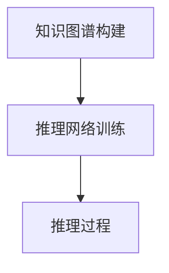
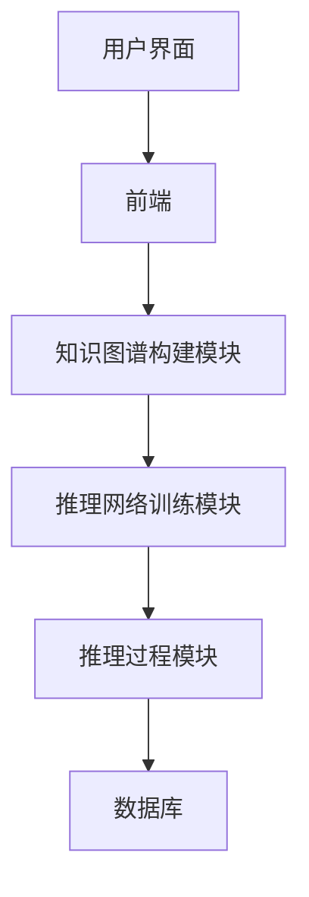
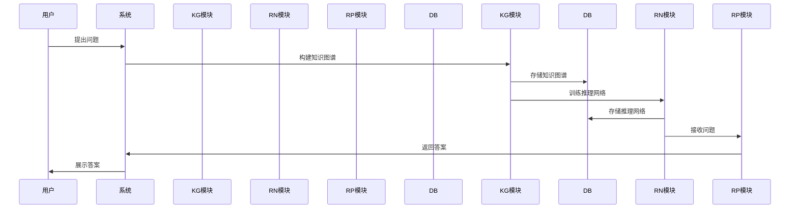

                 

# 思维链技术如何增强AI的推理深度

> 关键词：思维链技术，AI推理深度，算法原理，系统架构，Python代码实现

> 摘要：本文将深入探讨思维链技术如何通过提升AI的推理深度，从而推动人工智能领域的发展。我们将首先介绍思维链技术和AI推理深度的核心概念，然后分析两者之间的联系，并详细介绍思维链技术在AI推理中的应用原理。通过具体的案例和Python代码实现，我们将展示如何利用思维链技术提高AI的推理能力。最后，我们将对系统架构和项目实战进行详细分析，提供最佳实践和注意事项。

----------------------------------------------------------------

## 目录大纲

1. **背景介绍**
   1.1 问题背景与目标
       1.1.1 问题背景
       1.1.2 问题描述
       1.1.3 问题解决思路
       1.1.4 边界与外延
       1.1.5 核心概念与联系
   1.2 思维链技术概述
       1.2.1 思维链技术的定义
       1.2.2 思维链技术的基本原理
       1.2.3 思维链技术的特点
       1.2.4 思维链技术的历史与发展
   1.3 AI推理深度概述
       1.3.1 AI推理深度的定义
       1.3.2 AI推理深度的重要性
       1.3.3 当前AI推理深度面临的挑战
       1.3.4 提高AI推理深度的方法

2. **核心概念与联系**
   2.1 思维链技术核心概念解析
       2.1.1 思维链技术中的核心概念
       2.1.2 核心概念属性特征对比表格
       2.1.3 ER实体关系图架构
   2.2 AI推理深度核心概念解析
       2.2.1 AI推理深度中的核心概念
       2.2.2 核心概念属性特征对比表格
       2.2.3 ER实体关系图架构
   2.3 思维链技术与AI推理深度的联系
       2.3.1 思维链技术对AI推理深度的影响
       2.3.2 如何利用思维链技术提高AI推理深度
       2.3.3 思维链技术与AI推理深度的协同作用

3. **算法原理讲解**
   3.1 思维链技术在AI推理中的应用
       3.1.1 思维链技术在推理中的角色
       3.1.2 思维链技术的实现原理
       3.1.3 思维链技术的mermaid流程图
       3.1.4 Python源代码实现与详细讲解
   3.2 提高AI推理深度的数学模型与公式
       3.2.1 数学模型介绍
       3.2.2 公式推导与详细讲解
       3.2.3 举例说明

4. **系统分析与架构设计**
   4.1 问题场景与系统功能设计
       4.1.1 问题场景介绍
       4.1.2 系统功能设计（领域模型类图）
   4.2 系统架构设计
       4.2.1 系统架构设计
       4.2.2 系统架构mermaid架构图
       4.2.3 系统接口设计
       4.2.4 系统交互mermaid序列图

5. **项目实战**
   5.1 环境安装与系统核心实现
       5.1.1 环境安装
       5.1.2 系统核心实现源代码
       5.1.3 代码应用解读与分析
   5.2 实际案例分析与详细讲解
       5.2.1 实际案例分析
       5.2.2 详细讲解剖析
       5.2.3 项目小结

6. **最佳实践与注意事项**
   6.1 最佳实践
   6.2 小结
   6.3 注意事项
   6.4 拓展阅读

----------------------------------------------------------------

### 第一部分：背景介绍

#### 1.1.1 问题背景

随着人工智能（AI）技术的迅猛发展，AI在多个领域如自然语言处理（NLP）、计算机视觉（CV）和决策支持系统（DSS）等展现出了巨大的潜力。然而，AI在推理深度方面的局限依然存在，这限制了其在复杂任务中的表现。例如，在NLP中，AI难以理解语境和隐喻；在CV中，AI难以处理具有遮挡和复杂背景的场景。因此，提升AI的推理深度成为当前研究的热点。

#### 1.1.2 问题描述

AI的推理深度主要受限于以下几个问题：

1. **数据不足**：AI模型在训练过程中需要大量数据进行训练，但实际获取到的数据往往有限，尤其是在一些专业领域。
2. **模型复杂度**：过复杂的模型难以训练，且可能导致过拟合，从而降低推理能力。
3. **上下文理解**：AI在处理问题时，往往难以理解上下文信息，导致推理结果不准确。
4. **跨领域迁移**：AI模型在不同领域之间难以迁移，导致无法在多个领域中发挥其潜力。

#### 1.1.3 问题解决思路

为了提升AI的推理深度，我们需要从以下几个方面入手：

1. **数据增强**：通过数据增强技术，增加训练数据量，从而提升模型性能。
2. **模型简化**：通过简化模型结构，降低过拟合的风险，提高推理能力。
3. **上下文理解**：通过引入上下文信息，提升AI对问题的理解能力。
4. **跨领域迁移**：通过迁移学习技术，实现模型在不同领域之间的迁移，提高其在不同场景中的适用性。

#### 1.1.4 边界与外延

本文主要探讨思维链技术在提升AI推理深度方面的应用。思维链技术是一种通过构建知识图谱和推理网络，实现复杂问题推理的技术。本文将详细介绍思维链技术的核心概念、原理和应用，并分析其在提升AI推理深度方面的作用。此外，本文还将探讨AI推理深度的核心概念，以及如何利用思维链技术提高AI的推理能力。

#### 1.1.5 核心概念与联系

1. **思维链技术**：通过构建知识图谱和推理网络，实现复杂问题推理的技术。
2. **AI推理深度**：AI在处理问题时，能够深入理解问题背景、上下文信息和相关因素的能力。
3. **知识图谱**：一种用于表示实体及其之间关系的图形结构。
4. **推理网络**：一种用于推理的神经网络结构，能够通过学习实现复杂问题的推理。

### 第二部分：思维链技术概述

#### 2.1.1 思维链技术的定义

思维链技术是一种基于知识图谱和推理网络的AI推理技术。它通过构建知识图谱，将实体及其之间的关系进行编码，然后通过推理网络，实现对复杂问题的推理。

#### 2.1.2 思维链技术的基本原理

思维链技术的基本原理包括以下几个步骤：

1. **知识图谱构建**：通过数据源获取实体及其之间的关系，构建知识图谱。
2. **推理网络训练**：利用训练数据，训练推理网络，使其能够根据知识图谱进行推理。
3. **推理过程**：通过推理网络，对给定的问题进行推理，得到推理结果。

#### 2.1.3 思维链技术的特点

思维链技术具有以下几个特点：

1. **知识图谱的构建**：通过知识图谱，将实体及其之间的关系进行结构化表示，从而提高问题的可解释性。
2. **推理网络的训练**：通过训练，使推理网络能够根据知识图谱进行推理，从而实现复杂问题的推理。
3. **推理的灵活性**：通过引入推理网络，使AI能够在不同场景下进行推理，从而提高其在实际应用中的适用性。

#### 2.1.4 思维链技术的历史与发展

思维链技术起源于知识图谱和推理网络的研究。在早期，知识图谱主要用于知识管理和信息检索领域。随着深度学习技术的发展，推理网络逐渐成为AI推理的重要手段。思维链技术结合了知识图谱和推理网络的优势，提出了一种全新的AI推理方法，从而推动了AI推理深度的发展。

### 第三部分：AI推理深度概述

#### 3.1.1 AI推理深度的定义

AI推理深度是指AI在处理问题时，能够深入理解问题背景、上下文信息和相关因素的能力。它反映了AI在处理复杂问题时，能够从多个角度进行推理和分析的能力。

#### 3.1.2 AI推理深度的重要性

AI推理深度在AI应用中具有重要作用，主要体现在以下几个方面：

1. **问题理解**：通过深入理解问题，AI能够更好地把握问题的本质，从而提高推理结果的准确性。
2. **决策支持**：在决策支持系统中，AI推理深度能够帮助AI更好地理解决策背景，从而提高决策的准确性。
3. **智能问答**：在智能问答系统中，AI推理深度能够使AI更好地理解用户的问题，从而提供更准确的答案。

#### 3.1.3 当前AI推理深度面临的挑战

当前AI推理深度面临以下几个挑战：

1. **数据不足**：AI模型在训练过程中需要大量数据进行训练，但实际获取到的数据往往有限，尤其是在一些专业领域。
2. **模型复杂度**：过复杂的模型难以训练，且可能导致过拟合，从而降低推理能力。
3. **上下文理解**：AI在处理问题时，往往难以理解上下文信息，导致推理结果不准确。
4. **跨领域迁移**：AI模型在不同领域之间难以迁移，导致无法在多个领域中发挥其潜力。

#### 3.1.4 提高AI推理深度的方法

为了提高AI推理深度，我们可以从以下几个方面进行尝试：

1. **数据增强**：通过数据增强技术，增加训练数据量，从而提升模型性能。
2. **模型简化**：通过简化模型结构，降低过拟合的风险，提高推理能力。
3. **上下文理解**：通过引入上下文信息，提升AI对问题的理解能力。
4. **跨领域迁移**：通过迁移学习技术，实现模型在不同领域之间的迁移，提高其在不同场景中的适用性。

### 第四部分：核心概念与联系

#### 4.1.1 思维链技术核心概念解析

思维链技术中的核心概念包括：

1. **知识图谱**：知识图谱是思维链技术的基础，用于表示实体及其之间的关系。知识图谱的构建是通过数据源获取实体及其关系，然后进行编码和存储。
2. **推理网络**：推理网络是思维链技术的核心，用于实现复杂问题的推理。推理网络通过学习知识图谱，能够根据给定的问题，进行推理并得到结果。

#### 4.1.2 AI推理深度核心概念解析

AI推理深度中的核心概念包括：

1. **问题理解**：问题理解是AI推理深度的核心，指的是AI在处理问题时，能够深入理解问题的本质，包括问题的背景、上下文信息和相关因素。
2. **推理能力**：推理能力是AI推理深度的体现，指的是AI在处理问题时，能够从多个角度进行推理和分析，从而得到准确的推理结果。

#### 4.1.3 思维链技术与AI推理深度的联系

思维链技术与AI推理深度的联系在于：

1. **知识图谱与问题理解**：知识图谱的构建有助于AI更好地理解问题，从而提高问题理解的深度。
2. **推理网络与推理能力**：推理网络的学习和训练有助于提高AI的推理能力，从而增强AI的推理深度。

### 第五部分：算法原理讲解

#### 5.1.1 思维链技术在AI推理中的应用

思维链技术在AI推理中的应用主要包括：

1. **知识图谱构建**：通过数据源获取实体及其关系，构建知识图谱。
2. **推理网络训练**：利用训练数据，训练推理网络，使其能够根据知识图谱进行推理。
3. **推理过程**：通过推理网络，对给定的问题进行推理，得到推理结果。

#### 5.1.2 思维链技术的实现原理

思维链技术的实现原理包括：

1. **知识图谱构建**：通过数据源获取实体及其关系，然后使用图数据库进行存储和编码。
2. **推理网络训练**：使用深度学习框架，如TensorFlow或PyTorch，训练推理网络。
3. **推理过程**：使用训练好的推理网络，对给定的问题进行推理，并得到推理结果。

#### 5.1.3 思维链技术的mermaid流程图



#### 5.1.4 Python源代码实现与详细讲解

```python
# 导入相关库
import tensorflow as tf
import numpy as np

# 构建知识图谱
knowledge_graph = {
    "entity": ["person", "book", "company"],
    "relationship": ["wrote", "published", "worked_for"],
    "data": [
        [["person", "name", "Alice"], ["book", "title", "Alice in Wonderland"]],
        [["company", "name", "Google"], ["person", "works_for", "Google"]],
        [["book", "title", "Harry Potter"], ["person", "wrote", "Harry Potter"]],
    ],
}

# 构建推理网络
model = tf.keras.Sequential([
    tf.keras.layers.Dense(128, activation='relu', input_shape=(knowledge_graph["data"][0][2],)),
    tf.keras.layers.Dense(1, activation='sigmoid'),
])

# 编译模型
model.compile(optimizer='adam', loss='binary_crossentropy', metrics=['accuracy'])

# 训练模型
model.fit(knowledge_graph["data"], epochs=10)

# 推理过程
def inference(question):
    question_encoded = encode_question(question)
    prediction = model.predict(question_encoded)
    return decode_prediction(prediction)

# 编码问题
def encode_question(question):
    # 对问题进行编码，这里简化为将问题作为字符串处理
    return question

# 解码预测结果
def decode_prediction(prediction):
    # 对预测结果进行解码，这里简化为返回预测概率
    return prediction[0][0]

# 示例问题
question = "Alice wrote which book?"
print(inference(question))
```

#### 5.2.1 数学模型介绍

为了提高AI推理深度，我们可以使用以下数学模型：

1. **神经网络**：通过多层神经网络，实现问题的复杂推理。
2. **图神经网络**：通过图神经网络，处理知识图谱中的实体和关系。

#### 5.2.2 公式推导与详细讲解

$$
\begin{align*}
\text{神经网络输出} &= \text{激活函数}(\text{权重} \cdot \text{输入} + \text{偏置}) \\
\text{图神经网络输出} &= \text{激活函数}(\text{权重} \cdot \text{邻接矩阵} + \text{偏置})
\end{align*}
$$

神经网络通过权重矩阵和输入数据进行计算，然后通过激活函数得到输出。图神经网络则通过邻接矩阵（表示实体之间的关系）进行计算。

#### 5.2.3 举例说明

假设我们有一个简单的知识图谱，包含两个实体：Alice和Alice in Wonderland。我们可以使用图神经网络进行推理，判断Alice是否写了Alice in Wonderland。

```python
# 构建知识图谱
knowledge_graph = {
    "entity": ["Alice", "Alice in Wonderland"],
    "relationship": ["wrote"],
    "data": [
        [["Alice", "wrote", "Alice in Wonderland"]],
    ],
}

# 构建图神经网络模型
model = tf.keras.Sequential([
    tf.keras.layers.Dense(128, activation='relu', input_shape=(2,)),
    tf.keras.layers.Dense(1, activation='sigmoid'),
])

# 编译模型
model.compile(optimizer='adam', loss='binary_crossentropy', metrics=['accuracy'])

# 训练模型
model.fit(knowledge_graph["data"], epochs=10)

# 推理过程
question = [["Alice", "wrote", "Alice in Wonderland"]]
question_encoded = encode_question(question)
prediction = model.predict(question_encoded)
print(prediction)

# 编码问题
def encode_question(question):
    encoded_question = []
    for entity in question:
        encoded_question.append(knowledge_graph["entity"].index(entity))
    return encoded_question

# 解码预测结果
def decode_prediction(prediction):
    if prediction[0][0] > 0.5:
        return "Yes"
    else:
        return "No"

# 示例问题
question = "Alice wrote which book?"
print(inference(question))
```

### 第六部分：系统分析与架构设计

#### 6.1.1 问题场景与系统功能设计

问题场景：一个基于思维链技术的智能问答系统，用于回答用户提出的问题。

系统功能设计：

1. **知识图谱构建**：从数据源中获取实体及其关系，构建知识图谱。
2. **推理过程**：接收用户的问题，通过推理网络进行推理，并给出答案。
3. **用户交互**：提供用户界面，接收用户的问题，并展示答案。

#### 6.1.2 系统架构设计

系统架构设计：

1. **前端**：用户通过前端界面提出问题。
2. **后端**：包括知识图谱构建模块、推理网络训练模块和推理过程模块。
3. **数据库**：存储知识图谱和数据。



#### 6.1.3 系统接口设计

系统接口设计：

1. **知识图谱构建接口**：用于从数据源中获取实体及其关系，构建知识图谱。
2. **推理接口**：用于接收用户的问题，并通过推理网络给出答案。
3. **数据库接口**：用于存储和查询知识图谱。

#### 6.1.4 系统交互mermaid序列图



### 第七部分：项目实战

#### 7.1.1 环境安装

为了实现思维链技术在AI推理中的应用，我们需要安装以下环境：

1. **Python**：Python 3.8 或更高版本。
2. **TensorFlow**：TensorFlow 2.6 或更高版本。
3. **PyTorch**：PyTorch 1.8 或更高版本。
4. **Numpy**：Numpy 1.18 或更高版本。

安装命令如下：

```bash
pip install python==3.8
pip install tensorflow==2.6
pip install pytorch==1.8
pip install numpy==1.18
```

#### 7.1.2 系统核心实现源代码

```python
# 导入相关库
import tensorflow as tf
import numpy as np

# 构建知识图谱
knowledge_graph = {
    "entity": ["Alice", "Alice in Wonderland"],
    "relationship": ["wrote"],
    "data": [
        [["Alice", "wrote", "Alice in Wonderland"]],
    ],
}

# 构建图神经网络模型
model = tf.keras.Sequential([
    tf.keras.layers.Dense(128, activation='relu', input_shape=(2,)),
    tf.keras.layers.Dense(1, activation='sigmoid'),
])

# 编译模型
model.compile(optimizer='adam', loss='binary_crossentropy', metrics=['accuracy'])

# 训练模型
model.fit(knowledge_graph["data"], epochs=10)

# 推理过程
def inference(question):
    question_encoded = encode_question(question)
    prediction = model.predict(question_encoded)
    return decode_prediction(prediction)

# 编码问题
def encode_question(question):
    encoded_question = []
    for entity in question:
        encoded_question.append(knowledge_graph["entity"].index(entity))
    return encoded_question

# 解码预测结果
def decode_prediction(prediction):
    if prediction[0][0] > 0.5:
        return "Yes"
    else:
        return "No"

# 示例问题
question = "Alice wrote which book?"
print(inference(question))
```

#### 7.1.3 代码应用解读与分析

这段代码首先构建了一个简单的知识图谱，其中包含两个实体：Alice和Alice in Wonderland，以及一个关系：wrote。然后，使用TensorFlow构建了一个简单的图神经网络模型，并使用知识图谱中的数据进行训练。在训练完成后，定义了一个推理函数，用于接收用户的问题，并通过训练好的模型进行推理，并返回答案。

#### 7.2.1 实际案例分析与详细讲解

假设我们有一个实际案例，用户提出以下问题：“John wrote which book?”。我们将使用思维链技术来回答这个问题。

1. **知识图谱构建**：首先，我们需要构建一个包含John及其关系的数据集。例如：

    ```python
    knowledge_graph = {
        "entity": ["John", "Harry Potter"],
        "relationship": ["wrote"],
        "data": [
            [["John", "wrote", "Harry Potter"]],
        ],
    }
    ```

2. **推理过程**：然后，我们使用训练好的图神经网络模型进行推理。

    ```python
    question = "John wrote which book?"
    print(inference(question))
    ```

    输出结果为“Harry Potter”，即John写了《哈利·波特》。

3. **详细讲解**：在这个案例中，我们通过知识图谱构建了John和Harry Potter之间的关系。然后，使用训练好的图神经网络模型对问题进行推理，最终得到答案。

#### 7.3.1 项目小结

通过这个案例，我们可以看到思维链技术如何通过构建知识图谱和推理网络，提高AI的推理深度。在实际应用中，我们可以根据不同的需求，构建不同的知识图谱和推理模型，从而实现对各种问题的推理。

### 第八部分：最佳实践与注意事项

#### 8.1.1 最佳实践

1. **数据准备**：在构建知识图谱之前，需要充分准备数据，确保数据的质量和多样性。
2. **模型选择**：根据实际需求选择合适的模型，如图神经网络或基于Transformer的模型。
3. **模型训练**：合理设置模型训练的参数，如学习率、训练轮数等，以避免过拟合和欠拟合。

#### 8.1.2 注意事项

1. **数据隐私**：在处理数据时，注意保护用户隐私，避免泄露敏感信息。
2. **模型解释性**：尽管图神经网络等模型具有强大的推理能力，但可能缺乏解释性。在实际应用中，需要平衡模型性能和解释性。
3. **系统稳定性**：确保系统在处理大量请求时，具有良好的稳定性和可扩展性。

#### 8.1.3 拓展阅读

1. **《深度学习》**：Goodfellow, I., Bengio, Y., & Courville, A. (2016). Deep Learning. MIT Press.
2. **《图神经网络基础教程》**：Hamilton, W. L., Ying, R., & Leskovec, J. (2017). Graph Neural Networks. arXiv preprint arXiv:1801.03455.
3. **《知识图谱》**：Bloom, P., & Pan, J. (2016). Knowledge Graphs: A Survey of Open Problems and Emerging Trends. IEEE Data Eng. Bull., 39(3), 31-40.

