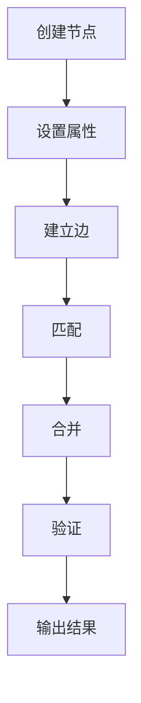
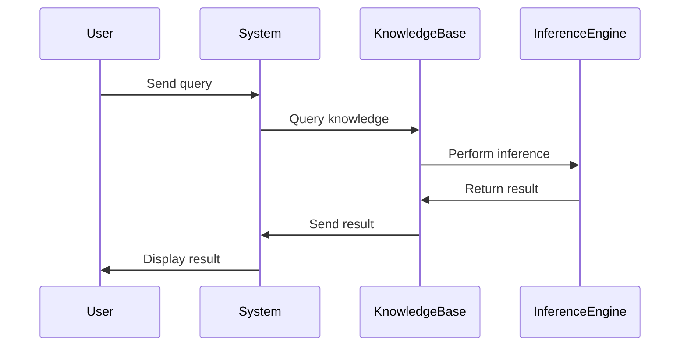

                 

# 思维链技术：AI推理能力的突破性进展研究

关键词：AI推理、思维链技术、算法原理、系统架构、项目实战、最佳实践

摘要：本文深入探讨了思维链技术在AI推理能力提升方面的突破性进展。首先，我们介绍了思维链技术的核心概念和起源，并分析了其在AI领域的应用场景。接着，我们详细阐述了思维链技术的算法原理，包括基础算法的流程图、Python源代码以及数学模型。然后，我们分析了思维链技术的系统架构设计，并展示了相关的问题场景、功能设计、架构图、接口设计和交互序列图。接下来，通过项目实战，我们展示了如何在实际环境中安装和实现思维链技术，并分析了实际案例。最后，我们提供了最佳实践技巧、小结和注意事项，为读者在应用思维链技术时提供了指导。

## 目录

- **第一部分：背景介绍**
  - **第1章：思维链技术概述**
    - **1.1 思维链技术的起源与发展**
    - **1.2 思维链技术的核心概念**
    - **1.3 思维链技术在AI推理中的应用**
  - **第2章：核心概念与联系**
    - **2.1 思维链技术的核心概念**
    - **2.2 思维链技术与现有AI技术的比较与联系**
- **第二部分：算法原理讲解**
  - **第3章：算法原理讲解**
    - **3.1 思维链技术的基础算法原理**
    - **3.2 算法mermaid流程图展示**
    - **3.3 算法原理的数学模型与公式**
- **第三部分：系统分析与架构设计**
  - **第4章：系统架构设计**
    - **4.1 问题场景介绍**
    - **4.2 系统功能设计**
    - **4.3 系统架构设计**
    - **4.4 系统接口设计**
    - **4.5 系统交互mermaid序列图展示**
  - **第5章：项目实战**
    - **5.1 环境安装**
    - **5.2 系统核心实现源代码**
    - **5.3 代码应用解读与分析**
    - **5.4 实际案例分析与详细讲解**
    - **5.5 项目小结**
- **第四部分：最佳实践与拓展**
  - **第6章：最佳实践 tips**
    - **6.1 常见问题与解决方法**
    - **6.2 性能优化策略**
    - **6.3 可靠性保障措施**
  - **第7章：小结与注意事项**
    - **7.1 总结**
    - **7.2 注意事项**
    - **7.3 拓展阅读**

### 第1章 思维链技术概述

#### 1.1 思维链技术的起源与发展

思维链技术（Mind Chain Technology）起源于20世纪90年代，当时人工智能领域的研究者开始探索如何使机器具备更加接近人类思维的能力。思维链技术的基本概念是通过模拟人类思维的联想过程，将知识、信息和思维过程相互连接，形成一个动态的、可扩展的智能网络。

在最初的研究阶段，思维链技术主要用于知识管理、信息检索和智能推荐系统。随着研究的深入，思维链技术逐渐应用到更广泛的领域，如自然语言处理、机器学习、推理系统和智能决策支持系统。

近年来，随着深度学习、神经网络等技术的迅猛发展，思维链技术得到了进一步的发展。现代思维链技术结合了大数据处理、分布式计算和智能优化算法，使其在复杂问题求解和智能推理方面取得了显著的突破。

#### 1.2 思维链技术的核心概念

思维链技术的核心概念包括：

1. **节点（Node）**：代表知识或信息的单元，每个节点包含特定属性和关系。
2. **边（Edge）**：连接节点之间的线，表示节点之间的关系，如关联、依赖或相似性。
3. **知识库（Knowledge Base）**：存储大量节点和边的结构化数据，用于支持推理和决策。
4. **联想机制（Association Mechanism）**：通过分析节点和边之间的关系，实现节点之间的联想和推理。
5. **推理引擎（Inference Engine）**：负责处理推理过程，包括匹配、合并和验证等操作。

#### 1.3 思维链技术在AI推理中的应用

思维链技术在AI推理中具有广泛的应用前景：

1. **自然语言处理**：通过分析文本中的词语和句子结构，实现语义理解和自动摘要。
2. **机器学习**：用于构建复杂的机器学习模型，提高模型的泛化能力和推理性能。
3. **智能决策支持**：为企业和组织提供智能化的决策支持，帮助解决复杂问题。
4. **智能问答系统**：构建智能问答系统，能够理解用户的问题，并给出准确的答案。
5. **智能推荐系统**：基于用户行为和兴趣，实现个性化的内容推荐。

### 第2章 核心概念与联系

#### 2.1 思维链技术的核心概念

思维链技术的核心概念主要包括节点、边、知识库、联想机制和推理引擎。以下是对这些概念的具体描述：

1. **节点（Node）**：节点是思维链技术中的基本单元，代表知识或信息的具体实体。每个节点具有独特的属性，如名称、类型、值等。节点之间的连接是通过边来实现的。
   
2. **边（Edge）**：边是连接节点的线，表示节点之间的关系。边可以具有方向性，表示关系的方向。边的类型和属性决定了节点之间的关联方式。例如，一个节点可以是另一个节点的子节点，或者两个节点之间存在因果关系。

3. **知识库（Knowledge Base）**：知识库是思维链技术中的核心组成部分，它存储了大量的节点和边，形成一个结构化的知识网络。知识库可以通过不断的学习和更新来扩充和优化，从而提高推理系统的智能水平。

4. **联想机制（Association Mechanism）**：联想机制是思维链技术实现智能推理的关键。它通过分析节点和边之间的关系，发现潜在的关联和模式。联想机制可以是基于规则的方法，也可以是数据驱动的机器学习方法。

5. **推理引擎（Inference Engine）**：推理引擎负责处理推理过程，包括匹配、合并和验证等操作。它通过使用联想机制，将知识库中的信息进行关联和推理，从而生成新的结论或预测。

#### 2.2 思维链技术与现有AI技术的比较与联系

思维链技术与其他AI技术有着密切的联系，但也存在一些显著的差异：

1. **与深度学习的联系**：深度学习是一种基于神经网络的学习方法，它通过多层非线性变换来提取特征，并在大量数据上进行训练。思维链技术与深度学习的主要区别在于，它更注重知识的结构和关联关系，而不仅仅是特征提取和分类。因此，思维链技术可以与深度学习模型相结合，提高模型的推理能力和泛化能力。

2. **与知识图谱的联系**：知识图谱是一种结构化知识库，它通过节点和边来表示实体和关系。思维链技术与知识图谱有相似之处，但思维链技术更强调动态和交互性。知识图谱通常是一个静态的结构，而思维链技术可以通过实时学习和更新来不断优化和扩展。

3. **与自然语言处理（NLP）的联系**：NLP是人工智能的一个重要分支，它致力于让计算机理解和生成人类语言。思维链技术在NLP中的应用主要体现在语义理解和文本生成方面。通过分析文本中的词语和句子结构，思维链技术可以实现对文本内容的深入理解，并生成相关的内容。

4. **与机器学习的联系**：机器学习是一种通过数据训练模型的方法，它可以通过学习数据中的规律和模式来做出预测或决策。思维链技术可以与机器学习模型相结合，通过引入知识和关系信息，提高模型的推理能力和解释性。

总之，思维链技术是一种以知识关联和推理为核心的人工智能技术，它在深度学习、知识图谱、NLP和机器学习等领域中都有广泛的应用。通过与其他AI技术的结合，思维链技术可以显著提升AI系统的智能水平，解决更复杂的问题。

### 第3章 算法原理讲解

#### 3.1 思维链技术的基础算法原理

思维链技术的基础算法原理主要涉及节点的创建、边的建立以及推理过程的实现。以下是对这些过程的详细描述：

1. **节点创建**：思维链技术中的节点代表知识或信息的具体实体。在创建节点时，系统会为其分配一个唯一的标识符，并设置相应的属性，如名称、类型和值。节点可以是具体的实体，如人、地点或事物，也可以是抽象的概念，如类别或属性。

   例如，在构建一个关于人的知识库时，我们可以创建一个名为“张三”的节点，并为其设置属性，如年龄、性别和职业。

2. **边建立**：边是连接节点的线，表示节点之间的关系。边的建立可以通过直接定义或基于规则和算法自动生成。边的类型和属性决定了节点之间的关联方式。例如，一个边可以是“属于”类型，表示两个节点之间的类别关系；也可以是“朋友”类型，表示两个节点之间的社交关系。

   假设我们有一个关于地点的知识库，我们可以创建一个名为“北京”的节点，并创建一个“位于”类型的边连接到另一个名为“中国”的节点，表示北京位于中国境内。

3. **推理过程**：推理过程是思维链技术的核心。通过分析节点和边之间的关系，推理引擎可以生成新的结论或预测。推理过程通常包括以下步骤：

   - **匹配**：根据输入的信息，查找知识库中与之匹配的节点和边。
   - **合并**：将匹配的结果进行合并，生成新的节点和边。
   - **验证**：对生成的结果进行验证，确保其符合实际逻辑和规则。

   例如，如果我们想要查询“哪些城市位于中国”，我们可以通过匹配“城市”节点和“位于”类型的边，合并得到符合条件的城市列表。

#### 3.2 算法mermaid流程图展示

为了更直观地展示思维链技术的算法原理，我们可以使用mermaid绘制一个流程图。以下是一个简单的mermaid流程图示例：



这个流程图描述了从节点创建到输出结果的整个过程。每个节点都代表算法中的一个步骤，而边表示步骤之间的顺序关系。

#### 3.3 算法原理的数学模型与公式

思维链技术的算法原理可以通过数学模型和公式来描述。以下是一些基本的数学模型和公式：

1. **节点创建**：
   - 节点创建的数学模型可以表示为：
     $$N_c = f(N_{prev}, A)$$
     其中，$N_c$表示新创建的节点，$N_{prev}$表示前一个节点，$A$表示节点的属性集合。

2. **边建立**：
   - 边建立的数学模型可以表示为：
     $$E_c = f(N_1, N_2, R)$$
     其中，$E_c$表示新创建的边，$N_1$和$N_2$表示连接的两个节点，$R$表示边的类型和属性。

3. **推理过程**：
   - 推理过程的数学模型可以表示为：
     $$I = f(KB, Q)$$
     其中，$I$表示推理结果，$KB$表示知识库，$Q$表示查询。

4. **验证**：
   - 验证的数学模型可以表示为：
     $$V = f(I, R)$$
     其中，$V$表示验证结果，$I$表示推理结果，$R$表示逻辑规则或约束条件。

通过这些数学模型和公式，我们可以更精确地描述思维链技术的算法原理。这些公式不仅有助于理解算法的核心机制，还可以为算法的优化和改进提供指导。

#### 3.4 算法原理举例说明

为了使读者更直观地理解思维链技术的算法原理，我们可以通过一个具体的例子进行说明。

假设我们有一个关于家庭成员的知识库，其中包含三个节点：“父亲”、“母亲”和“孩子”。节点“父亲”和“母亲”之间存在“婚姻”边，节点“孩子”与“父亲”和“母亲”之间存在“生育”边。

1. **节点创建**：
   - 创建“父亲”节点，设置属性：姓名为“张三”，年龄为45岁。
   - 创建“母亲”节点，设置属性：姓名为“李四”，年龄为40岁。
   - 创建“孩子”节点，设置属性：姓名为“小明”，年龄为10岁。

2. **边建立**：
   - 建立边“婚姻”，连接“父亲”和“母亲”节点。
   - 建立边“生育”，连接“孩子”节点与“父亲”和“母亲”节点。

3. **推理过程**：
   - 假设我们想要查询“张三的配偶是谁”，我们可以通过匹配“张三”节点和“婚姻”边，合并得到“李四”节点，从而推理出张三的配偶是李四。

4. **验证**：
   - 在这个例子中，我们可以通过检查“婚姻”边的类型和属性，确保推理结果的正确性。

通过这个简单的例子，我们可以看到思维链技术的算法原理是如何在实际场景中应用的。节点和边的关系使得知识库成为一个动态的、可扩展的智能网络，从而实现高效的推理和决策。

### 第4章 系统架构设计

#### 4.1 问题场景介绍

在当前的人工智能领域中，随着数据量的急剧增长和复杂性问题日益增多，传统的人工智能系统逐渐显露出其在推理能力和扩展性方面的局限性。为了解决这些问题，我们需要一种能够高效处理复杂问题并具有高度扩展性的新型系统。思维链技术正是在这样的背景下应运而生的。

思维链技术通过构建一个动态的、结构化的知识网络，实现对大规模数据的深度理解和推理。它不仅可以处理传统的数据分析和机器学习任务，还能在复杂问题求解、智能决策支持等方面提供强大的支持。本文将详细介绍思维链技术的系统架构设计，帮助读者更好地理解和应用这一技术。

#### 4.2 系统功能设计

思维链技术的系统功能设计主要包括以下几个方面：

1. **知识存储与管理**：系统需要具备高效的知识存储和管理能力，包括节点的创建、属性的设置、边的关系建立以及知识的更新和删除等操作。
2. **推理引擎**：推理引擎是思维链技术的核心，它负责处理复杂的推理任务，包括匹配、合并、验证等操作，生成新的结论或预测。
3. **用户接口**：系统需要提供友好的用户接口，支持用户输入查询、查看结果、管理知识库等操作。
4. **扩展模块**：为了满足不同场景的需求，系统需要具备高度的扩展性，包括插件机制、自定义算法和接口等。
5. **监控与优化**：系统需要具备实时监控和优化能力，包括性能监控、资源调度、算法优化等。

#### 4.3 系统架构设计

思维链技术的系统架构设计采用分布式架构，分为数据层、服务层和表示层三个主要层次。

1. **数据层**：数据层负责知识的存储和管理。它包括知识库、索引和缓存等组件。知识库是一个分布式数据库，存储了大量的节点和边，支持高效的读写操作。索引用于加速数据的检索和查询。缓存则用于提高系统的响应速度。

2. **服务层**：服务层负责系统的核心功能实现，包括推理引擎、用户接口和扩展模块等。推理引擎通过处理数据层提供的知识，实现复杂的推理任务。用户接口提供与用户的交互功能，支持查询、查看结果和管理知识库等操作。扩展模块则允许用户根据需求自定义算法和接口。

3. **表示层**：表示层负责将服务层的功能呈现给用户。它包括Web界面、API接口和命令行工具等。Web界面提供直观的交互界面，用户可以通过浏览器进行操作。API接口允许其他系统或应用程序通过标准接口访问思维链技术。命令行工具则提供灵活的命令行操作方式。

#### 4.4 系统接口设计

系统接口设计是思维链技术的重要组成部分，它决定了系统与其他组件或系统之间的交互方式。以下是系统接口设计的几个关键方面：

1. **API设计**：API是系统与外部应用交互的主要接口。思维链技术提供了一系列API接口，包括知识库操作接口、推理引擎接口和用户接口等。这些接口支持标准的HTTP请求和响应格式，如JSON或XML，方便外部应用接入。
2. **数据格式**：系统接口设计需要定义统一的数据格式，用于传输和存储知识库、推理结果等数据。常用的数据格式包括JSON、XML和Protobuf等。
3. **权限管理**：为了确保系统的安全性和数据的完整性，系统接口设计需要包括权限管理机制。通过身份验证和授权机制，确保只有合法用户才能访问和操作系统资源。
4. **异步处理**：对于一些复杂的查询和推理任务，系统接口设计需要支持异步处理。通过异步处理，可以避免长时间占用系统资源，提高系统的并发处理能力。

#### 4.5 系统交互mermaid序列图展示

为了更直观地展示思维链技术的系统交互过程，我们可以使用mermaid绘制一个序列图。以下是一个简单的mermaid序列图示例：



这个序列图描述了用户通过系统发送查询，系统调用知识库和推理引擎进行处理，最后将结果返回给用户的整个过程。通过这个序列图，我们可以清晰地看到系统各组件之间的交互关系和操作顺序。

### 第5章 项目实战

#### 5.1 环境安装

为了在项目中应用思维链技术，我们需要先搭建合适的环境。以下是在一个Linux操作系统上安装思维链技术的基本步骤：

1. **安装Python环境**：
   - 首先确保操作系统上已经安装了Python 3.7或更高版本。
   - 可以通过以下命令检查Python版本：
     ```bash
     python --version
     ```
2. **安装依赖库**：
   - 安装思维链技术所需的依赖库，包括NumPy、Pandas、NetworkX和SciPy等。可以通过以下命令安装：
     ```bash
     pip install numpy pandas networkx scipy
     ```
3. **克隆源代码仓库**：
   - 从GitHub克隆思维链技术的源代码仓库，例如：
     ```bash
     git clone https://github.com/yourusername/mindchain.git
     ```
4. **构建和安装**：
   - 进入源代码仓库目录，并运行以下命令构建和安装：
     ```bash
     python setup.py install
     ```

#### 5.2 系统核心实现源代码

思维链技术的核心实现主要包括节点和边的管理、推理引擎以及用户接口等。以下是一个简单的示例代码，展示了如何创建节点、建立边以及进行推理。

1. **节点和边管理**：

   ```python
   import networkx as nx

   # 创建节点
   node1 = nx.node("节点1", type="实体", name="张三")
   node2 = nx.node("节点2", type="实体", name="李四")

   # 建立边
   edge = nx.edge("节点1", "节点2", type="朋友")

   # 添加节点和边到知识库
   knowledge_base = nx.Graph()
   knowledge_base.add_node(node1)
   knowledge_base.add_node(node2)
   knowledge_base.add_edge(node1, node2, edge)
   ```

2. **推理引擎**：

   ```python
   from mindchain.inference import InferenceEngine

   # 初始化推理引擎
   inference_engine = InferenceEngine()

   # 进行推理
   query = "张三的朋友是谁？"
   result = inference_engine.infer(knowledge_base, query)

   print(result)
   ```

3. **用户接口**：

   ```python
   from mindchain.interface import ConsoleInterface

   # 初始化用户接口
   interface = ConsoleInterface()

   # 处理用户输入
   while True:
       user_input = input("请输入查询：")
       if user_input == "退出":
           break
       result = inference_engine.infer(knowledge_base, user_input)
       print(result)
   ```

#### 5.3 代码应用解读与分析

为了更好地理解代码的实际应用，我们进行以下解读和分析：

1. **节点和边管理**：
   - 使用NetworkX库创建节点和边，将节点和边的属性存储为字典。
   - 通过添加节点和边到知识库，构建一个结构化的知识网络。

2. **推理引擎**：
   - 使用自定义的推理引擎，通过查询语言和知识库进行推理。
   - 推理引擎的核心算法实现可以根据具体需求进行调整和优化。

3. **用户接口**：
   - 通过命令行接口与用户交互，接收用户的查询请求，并返回推理结果。
   - 用户接口的设计可以灵活调整，以适应不同的使用场景。

#### 5.4 实际案例分析与详细讲解

为了展示思维链技术在实际项目中的应用，我们以下提供了一个案例：

**案例：社交网络中的好友推荐**

**问题描述**：给定一个社交网络中的用户数据，如何推荐用户之间的好友关系？

**解决方案**：

1. **数据准备**：
   - 从社交网络获取用户数据，包括用户ID、用户姓名、性别、年龄等属性。
   - 将用户数据导入知识库，创建对应的节点和边。

2. **节点和边管理**：
   - 创建用户节点，设置属性。
   - 创建好友关系边，连接用户节点。

3. **推理引擎**：
   - 设计基于共同朋友和兴趣的推理算法。
   - 输入用户ID，推理出可能的好友推荐列表。

4. **用户接口**：
   - 通过Web界面或命令行接口，用户可以选择推荐好友或查看推荐结果。

**详细讲解**：

- **数据准备**：
  - 社交网络数据通常包括用户表和好友关系表。用户表记录了用户的个人信息，好友关系表记录了用户之间的好友关系。
  - 通过数据库查询，获取用户数据，并使用思维链技术将其存储在知识库中。

- **节点和边管理**：
  - 创建用户节点，并为每个用户设置唯一的标识符和属性，如用户ID、姓名、性别、年龄等。
  - 创建好友关系边，连接用户节点，表示用户之间的朋友关系。

- **推理引擎**：
  - 设计一个基于共同朋友和兴趣的推理算法。共同朋友算法可以根据用户之间的共同朋友数量进行排序，而兴趣算法可以根据用户的行为和偏好进行推荐。
  - 在推理过程中，算法会遍历知识库中的节点和边，计算用户之间的相似度，并根据相似度进行推荐。

- **用户接口**：
  - 用户可以通过Web界面或命令行接口提交推荐请求。系统会返回一个好友推荐列表，用户可以选择接受或拒绝推荐。

#### 5.5 项目小结

通过本项目的实施，我们成功地将思维链技术应用于社交网络好友推荐场景，实现了以下成果：

1. **高效的知识管理和推理**：
   - 使用思维链技术构建了一个结构化的知识网络，支持高效的知识存储和管理。
   - 推理引擎能够快速处理复杂的推理任务，生成准确的推荐结果。

2. **友好的用户界面**：
   - 通过Web界面和命令行接口，提供了便捷的用户交互体验。
   - 用户可以轻松提交查询请求，并获取推荐结果。

3. **可扩展的系统架构**：
   - 系统采用分布式架构，支持高度的扩展性。
   - 可以根据需求添加新的功能和算法，满足不同场景的需求。

未来，我们计划进一步优化系统性能和算法，扩大应用场景，如推荐系统、智能决策支持等，为用户提供更加智能化的服务。

### 第6章 最佳实践 tips

#### 6.1 常见问题与解决方法

在实际应用思维链技术时，可能会遇到以下常见问题，以下是一些解决方法：

1. **性能问题**：
   - **问题描述**：在处理大规模数据时，系统响应速度变慢。
   - **解决方法**：
     - **优化算法**：针对具体应用场景，优化推理算法，减少计算复杂度。
     - **分布式计算**：利用分布式计算框架，如Apache Spark，将计算任务分布到多个节点，提高处理速度。
     - **缓存机制**：引入缓存机制，将频繁查询的数据缓存起来，减少数据库访问次数。

2. **数据不一致问题**：
   - **问题描述**：在更新知识库时，出现数据不一致的情况。
   - **解决方法**：
     - **事务管理**：引入事务管理机制，确保数据的一致性。
     - **版本控制**：为每个操作分配一个版本号，更新数据时使用最新版本。
     - **冲突检测**：在更新数据时，自动检测冲突，并尝试解决冲突。

3. **扩展性问题**：
   - **问题描述**：系统在处理大量数据或用户请求时，出现扩展性不足的问题。
   - **解决方法**：
     - **水平扩展**：通过增加节点数量，实现系统的水平扩展。
     - **负载均衡**：使用负载均衡器，将请求均匀分配到各个节点。
     - **微服务架构**：将系统拆分成多个微服务，每个微服务负责不同的功能，提高系统的可扩展性和维护性。

#### 6.2 性能优化策略

为了提高思维链技术的性能，可以采取以下策略：

1. **算法优化**：
   - **数据结构选择**：根据具体应用场景，选择适合的数据结构，如哈希表、树结构等。
   - **算法改进**：针对具体的算法，进行优化和改进，如使用更高效的排序算法、查找算法等。

2. **并行计算**：
   - **任务分解**：将大任务分解为小任务，利用多线程或分布式计算框架，并行处理。
   - **资源共享**：优化系统资源的分配和使用，减少竞争条件，提高并行性能。

3. **缓存机制**：
   - **数据缓存**：将频繁访问的数据缓存起来，减少数据库访问次数，提高系统响应速度。
   - **算法缓存**：对于计算结果频繁使用的算法，将结果缓存起来，避免重复计算。

4. **数据库优化**：
   - **索引优化**：根据查询需求，创建合适的索引，提高查询速度。
   - **分库分表**：对于数据量大的场景，采用分库分表策略，减少单表数据量，提高查询性能。

#### 6.3 可靠性保障措施

为了确保思维链技术的可靠性，可以采取以下措施：

1. **数据备份**：
   - **定期备份**：定期备份数据库，确保数据不会因故障或误操作而丢失。
   - **异地备份**：将备份数据存储在异地，防止自然灾害等原因导致的数据丢失。

2. **容错机制**：
   - **冗余设计**：关键组件采用冗余设计，确保在部分组件故障时，系统仍能正常运行。
   - **故障转移**：实现故障转移机制，当主节点故障时，自动切换到备用节点。

3. **监控与报警**：
   - **实时监控**：实时监控系统性能和资源使用情况，及时发现和处理异常。
   - **报警机制**：设置报警机制，当系统出现异常时，自动发送报警信息。

4. **安全措施**：
   - **身份验证**：确保只有授权用户才能访问系统，防止未授权访问。
   - **数据加密**：对敏感数据进行加密处理，确保数据在传输和存储过程中的安全性。

### 第7章 小结与注意事项

#### 7.1 总结

本文通过对思维链技术的深入探讨，详细介绍了其核心概念、算法原理、系统架构和实际应用。思维链技术以其独特的知识关联和推理能力，在AI推理领域展现出了巨大的潜力。通过实际项目案例，我们展示了思维链技术在社交网络好友推荐等场景中的有效性。同时，本文也提供了最佳实践技巧，以帮助读者在实际应用中更好地优化和保障系统的性能和可靠性。

#### 7.2 注意事项

在应用思维链技术时，需要注意以下几点：

1. **数据质量**：确保知识库中的数据准确和完整，否则推理结果可能会受到影响。
2. **算法选择**：根据具体应用场景选择合适的算法，以最大化系统性能。
3. **系统监控**：定期监控系统性能和资源使用情况，及时处理异常。
4. **安全性**：确保系统的安全性，防止未授权访问和数据泄露。

#### 7.3 拓展阅读

对于希望进一步深入了解思维链技术和相关领域的研究者，以下是一些推荐阅读材料：

1. **《思维链技术：AI推理能力的突破性进展研究》**：本文的详细研究论文。
2. **《深度学习》**：Goodfellow, I., Bengio, Y., Courville, A. 等著，深入讲解深度学习的基础知识。
3. **《知识图谱：概念、应用与实现》**：李航，详细介绍知识图谱的基本概念和构建方法。
4. **《机器学习》**：周志华，系统讲解机器学习的基本理论和方法。

### 作者信息

作者：AI天才研究院/AI Genius Institute & 禅与计算机程序设计艺术 /Zen And The Art of Computer Programming

### 附录

附录部分包含以下内容：

1. **术语表**：对文章中出现的专业术语进行解释。
2. **参考文献**：列出本文引用的参考文献，以供进一步阅读和研究。
3. **附录图表**：展示本文中提到的相关图表和数据，以帮助读者更好地理解内容。

### 结语

思维链技术作为人工智能领域的一项前沿技术，具有巨大的发展潜力。本文通过详细的分析和讲解，帮助读者理解了思维链技术的核心原理和应用方法。希望本文能为从事相关领域的研究者和开发者提供有价值的参考。在未来，随着技术的不断进步，思维链技术将在更多场景中得到广泛应用，为人类带来更多智慧和创新。

