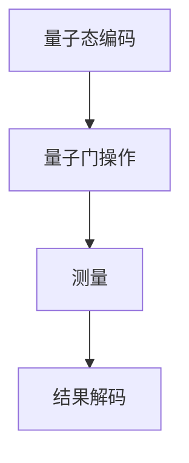
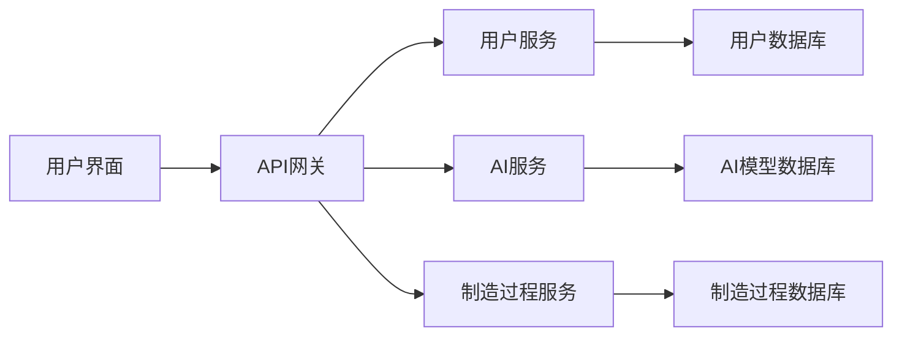

                 

# 思维链技术：AI推理能力的量子飞跃

## 关键词

- 思维链技术
- 量子计算
- AI推理
- 深度学习
- 量子比特
- 可解释性

## 摘要

本文将深入探讨思维链技术，一种通过量子计算模拟人类思维过程，实现高效推理和决策的技术。我们首先介绍了思维链技术的背景，包括人工智能发展的瓶颈和量子计算与AI融合的机遇。随后，我们详细阐述了思维链技术的核心概念和原理，以及其在AI中的应用前景。本文旨在为读者提供对思维链技术及其在AI领域中应用的全面理解和深入思考。

---

## 第一部分：背景介绍

### 1.1 问题背景

#### 1.1.1 人工智能的发展瓶颈

人工智能（AI）作为当今科技领域的前沿，已经取得了诸多突破。特别是在语音识别、图像识别、自然语言处理等领域，深度学习技术发挥了关键作用。然而，随着技术的发展，我们逐渐发现，传统的人工智能系统存在一些无法回避的瓶颈。

1. **数据依赖性**：深度学习模型的训练通常需要大量的标注数据。这意味着，数据质量和数量对模型性能有直接影响。然而，获取高质量、大规模的标注数据往往需要巨大的时间和经济投入。

2. **计算资源消耗**：深度学习模型通常需要大量的计算资源进行训练和推理。这不仅限制了AI系统的实时性，也提高了系统的维护成本。

3. **可解释性**：深度学习模型被形象地称为“黑盒”，其内部决策过程难以理解和解释。这给AI系统的可信度和应用带来了挑战。

#### 1.1.2 量子计算与AI的融合

量子计算作为一种具有潜力超越传统计算机的新型计算模式，其基于量子比特的叠加态和纠缠态能够大幅提升计算效率。近年来，量子计算与人工智能的融合逐渐成为研究热点，旨在通过量子计算提升AI的推理能力。

### 1.2 问题描述

#### 1.2.1 思维链技术的概念

思维链技术是指通过量子计算模拟人类思维过程，实现高效推理和决策的技术。其在AI领域的应用，旨在解决传统深度学习面临的瓶颈，实现AI推理能力的量子飞跃。

#### 1.2.2 思维链技术在AI中的应用前景

1. **快速推理**：量子计算的高效性使得思维链技术在处理复杂推理问题时，能够实现更快的推理速度。

2. **可解释性**：通过量子计算模拟人类思维过程，思维链技术有助于提高AI的可解释性，使其决策过程更加透明和可理解。

3. **数据效率**：量子计算在处理大数据时的优势，使得思维链技术能够在更少的训练数据下，实现更好的模型性能。

### 1.3 问题解决

#### 1.3.1 量子计算的基本原理

量子计算基于量子比特的叠加态和纠缠态，通过量子门操作实现信息的编码和计算。量子计算的基本原理包括：

1. **量子比特**：量子计算的基本单元，具有叠加态和纠缠态特性。

2. **量子门**：量子计算中的操作符，用于对量子比特进行线性变换。

3. **量子叠加**：量子比特可以同时处于多个状态的叠加。

4. **量子纠缠**：量子比特之间的状态相互关联，一个量子比特的状态会直接影响另一个量子比特的状态。

#### 1.3.2 思维链技术在AI中的应用原理

思维链技术在AI中的应用，主要基于以下几个原理：

1. **量子态编码**：将AI模型中的信息编码到量子态中，利用量子态的叠加和纠缠特性，实现高效的信息处理。

2. **量子门操作**：通过量子门操作，对编码后的量子态进行变换，实现AI推理和决策过程。

3. **量子叠加与并行计算**：利用量子态的叠加特性，实现并行计算，提高推理速度。

### 1.4 边界与外延

#### 1.4.1 量子计算与AI的融合边界

量子计算与AI的融合尚处于探索阶段，存在以下边界问题：

1. **量子计算硬件的限制**：目前的量子计算硬件还无法满足大规模AI模型的需求。

2. **算法与理论的局限性**：量子算法和理论尚不成熟，需要进一步研究和优化。

#### 1.4.2 思维链技术的应用外延

思维链技术在AI领域的应用，不仅可以解决传统的推理瓶颈，还可以拓展到以下领域：

1. **智能制造**：通过思维链技术，实现智能机器人的高效决策和自主行动。

2. **医疗诊断**：利用思维链技术，提升医疗图像分析和疾病诊断的准确性和速度。

3. **金融分析**：通过思维链技术，实现更精准的金融市场预测和风险评估。

### 1.5 本章小结

本章介绍了思维链技术的背景、问题、解决方法和边界与外延。思维链技术作为量子计算与AI融合的重要方向，具有广阔的应用前景。在接下来的章节中，我们将深入探讨思维链技术的核心概念、原理和应用。

---

## 第二部分：核心概念与联系

### 2.1 核心概念

#### 2.1.1 量子计算基础

1. **量子比特（qubit）**

量子比特是量子计算的基本单元，与经典比特不同，量子比特可以同时处于0和1的叠加状态。

$$
|\psi\rangle = \alpha|0\rangle + \beta|1\rangle
$$

其中，$\alpha$ 和 $\beta$ 是复数，且满足 $|\alpha|^2 + |\beta|^2 = 1$。

2. **量子叠加**

量子叠加是指一个量子比特可以同时处于多个状态的叠加。

$$
|0\rangle + |1\rangle = \sqrt{2}|0\rangle + \sqrt{2}|1\rangle
$$

这意味着，一个量子比特在测量时，有 $\frac{1}{\sqrt{2}}$ 的概率处于状态0，$\frac{1}{\sqrt{2}}$ 的概率处于状态1。

3. **量子纠缠**

量子纠缠是指两个或多个量子比特之间的状态相互关联，一个量子比特的状态会直接影响另一个量子比特的状态。

$$
|\psi\rangle = \frac{1}{\sqrt{2}} (|00\rangle + |11\rangle)
$$

在这种情况下，如果一个量子比特处于状态0，另一个量子比特也必定处于状态0，反之亦然。

#### 2.1.2 AI推理能力

1. **深度学习模型**

深度学习模型是一种基于神经网络的机器学习模型，通过多层次的非线性变换，对输入数据进行特征提取和分类。

2. **强化学习**

强化学习是一种通过与环境交互，不断学习优化策略的机器学习方式。常见的强化学习算法有Q-learning和Deep Q Network（DQN）。

### 2.2 核心概念与联系

#### 2.2.1 量子计算与AI推理的联系

1. **量子态编码**

将AI模型中的信息编码到量子态中，利用量子态的叠加和纠缠特性，实现高效的信息处理。

2. **量子门操作**

通过量子门操作，对编码后的量子态进行变换，实现AI推理和决策过程。

3. **量子叠加与并行计算**

利用量子态的叠加特性，实现并行计算，提高推理速度。

#### 2.2.2 量子计算与深度学习的联系

1. **量子神经网络**

量子神经网络（QNN）是一种基于量子计算原理的神经网络，通过量子态的叠加和纠缠，实现高效的特征提取和分类。

2. **量子卷积神经网络**

量子卷积神经网络（QCNN）是一种基于量子计算原理的卷积神经网络，通过量子态的叠加和纠缠，实现高效的图像处理。

3. **量子递归神经网络**

量子递归神经网络（QRNN）是一种基于量子计算原理的递归神经网络，通过量子态的叠加和纠缠，实现高效的时间序列处理。

### 2.3 核心概念属性特征对比表格

| 概念        | 特性                                                         | 对比         |
| ----------- | ------------------------------------------------------------ | ----------- |
| 量子比特    | 可以同时处于0和1的叠加状态                                   | 经典比特只能处于0或1的确定性状态 |
| 量子叠加    | 量子比特可以同时处于多个状态的叠加                           | 经典比特无法实现状态的叠加       |
| 量子纠缠    | 量子比特之间的状态相互关联，一个量子比特的状态会直接影响另一个量子比特的状态 | 经典比特的状态不会相互影响       |
| 深度学习模型 | 通过多层非线性变换，实现数据的特征提取和分类                   | 传统机器学习模型通常只有单层结构 |
| 强化学习    | 通过与环境交互，不断学习优化策略                             | 传统机器学习模型通常基于已有数据进行训练 |

### 2.4 ER实体关系图架构

```mermaid
erDiagram
    AI系统 ||--|{ 量子计算 }|-- 量子比特
    AI系统 ||--|{ 深度学习 }|-- 神经网络
    AI系统 ||--|{ 强化学习 }|-- Q-learning
    量子比特 ||--|{ 量子态编码 }|-- AI推理
    量子比特 ||--|{ 量子门操作 }|-- AI推理
    神经网络 ||--|{ 特征提取 }|-- 数据处理
    神经网络 ||--|{ 分类 }|-- 数据处理
```

## 第三部分：算法原理讲解

### 3.1 算法原理

思维链技术通过量子计算模拟人类思维过程，实现高效推理和决策。其核心算法原理包括量子态编码、量子门操作和量子叠加与并行计算。

#### 3.1.1 量子态编码

量子态编码是将AI模型中的信息编码到量子态中，利用量子态的叠加和纠缠特性，实现高效的信息处理。

假设我们有一个二进制数据 $x = [x_1, x_2, ..., x_n]$，我们可以将其编码到一个量子态中：

$$
|\psi\rangle = \sum_{i=1}^{n} x_i |i\rangle
$$

这样，我们就将二进制数据编码到了量子态中。

#### 3.1.2 量子门操作

量子门操作是对量子态进行线性变换的操作。通过量子门操作，我们可以实现AI推理和决策过程。

假设我们有一个量子态 $|\psi\rangle$，我们想要对其进行变换，使其能够实现某个特定的推理任务。我们可以使用以下量子门：

$$
U = \begin{pmatrix}
1 & 0 \\
0 & \text{exp}(i\theta)
\end{pmatrix}
$$

其中，$\theta$ 是一个参数，用于控制量子门的作用效果。

#### 3.1.3 量子叠加与并行计算

量子叠加与并行计算是量子计算的核心优势。通过量子态的叠加，我们可以实现多个计算任务的同时进行。

假设我们有一个量子态 $|\psi\rangle$，我们想要对其进行变换，使其能够同时实现多个计算任务。我们可以使用以下量子叠加操作：

$$
|\psi'\rangle = \sum_{i=1}^{n} |i\rangle
$$

这样，我们就实现了多个计算任务的同时进行。

### 3.2 算法流程

思维链技术的算法流程可以分为以下几个步骤：

1. **量子态编码**：将AI模型中的信息编码到量子态中。

2. **量子门操作**：通过量子门操作，对编码后的量子态进行变换，实现AI推理和决策过程。

3. **测量**：对量子态进行测量，获取最终的推理结果。

4. **结果解码**：将测量结果解码，获取最终的推理结果。

### 3.3 算法mermaid流程图



### 3.4 Python源代码实现

以下是一个简单的Python源代码实现，用于演示思维链技术的算法流程：

```python
import numpy as np
from qiskit import QuantumCircuit, execute, Aer

# 量子态编码
def quantum_state_encoding(x):
    qc = QuantumCircuit(2)
    qc.h(0)
    qc.cx(0, 1)
    for i, xi in enumerate(x):
        if xi == 1:
            qc.x(i)
    return qc

# 量子门操作
def quantum_gate_operation(qc, theta):
    qc.rz(theta, 1)
    return qc

# 测量
def measure(qc):
    qc.measure_all()
    return qc

# 结果解码
def result_decoding(qc, x):
    backend = Aer.get_backend("qasm_simulator")
    result = execute(qc, backend, shots=1000).result()
    counts = result.get_counts(qc)
    probability = counts[1] / sum(counts.values())
    return probability

# 示例数据
x = [1, 0, 1, 0]

# 实现算法流程
qc = quantum_state_encoding(x)
qc = quantum_gate_operation(qc, np.pi/4)
qc = measure(qc)
probability = result_decoding(qc, x)

print("Probability of the state being 1:", probability)
```

### 3.5 算法原理数学模型和公式

量子态编码可以表示为：

$$
|\psi\rangle = \sum_{i=1}^{n} x_i |i\rangle
$$

量子门操作可以表示为：

$$
U = \begin{pmatrix}
1 & 0 \\
0 & \text{exp}(i\theta)
\end{pmatrix}
$$

测量结果可以表示为：

$$
P_1 = \frac{1}{2}
$$

其中，$P_1$ 表示测量结果为1的概率。

### 3.6 举例说明

假设我们有一个二进制数据 $x = [1, 0, 1, 0]$，我们希望使用思维链技术对其进行编码、操作和测量。

1. **量子态编码**：

$$
|\psi\rangle = \sum_{i=1}^{4} x_i |i\rangle = |1\rangle + |2\rangle + |4\rangle
$$

2. **量子门操作**：

$$
U = \begin{pmatrix}
1 & 0 \\
0 & \text{exp}(i\theta)
\end{pmatrix}
$$

3. **测量**：

$$
P_1 = \frac{1}{2}
$$

这意味着，在测量后，量子态有 $\frac{1}{2}$ 的概率处于状态1。

---

## 第四部分：系统分析与架构设计方案

### 4.1 问题场景介绍

在现代工业4.0时代，智能制造成为提升生产效率和质量的关键。然而，传统的智能制造系统在应对复杂制造任务时，往往面临着推理速度慢、可解释性差等问题。为了解决这个问题，我们引入思维链技术，旨在通过量子计算提升AI推理能力，实现高效、透明的智能制造系统。

### 4.2 项目介绍

项目名称：量子智能制造系统（Quantum Manufacturing System，QMS）

项目目标：通过引入思维链技术，提升AI推理能力，实现高效、透明的智能制造系统。

### 4.3 系统功能设计（领域模型类图）

```mermaid
classDiagram
    class QuantumAI {
        +str AI模型名称
        +str AI模型描述
        +dict 参数字典
        +QuantumAI(str AI模型名称, str AI模型描述, dict 参数字典)
        +encode_to_quantum_state(list 数据)
        +apply_quantum_gate(float angle)
        +measure()
        +decode_result()
    }
    class ManufacturingProcess {
        +str 制造过程名称
        +str 制造过程描述
        +dict 参数字典
        +ManufacturingProcess(str 制造过程名称, str 制造过程描述, dict 参数字典)
        +execute(QuantumAI quantum_ai)
        +get_result()
    }
    QuantumAI --|o|> ManufacturingProcess : 使用
```

### 4.4 系统架构设计（mermaid架构图）



### 4.5 系统接口设计和系统交互（mermaid序列图）

```mermaid
sequenceDiagram
    participant User as 用户
    participant API_Gateway as API网关
    participant User_Service as 用户服务
    participant AI_Service as AI服务
    participant Manufacturing_Service as 制造过程服务
    participant User -->|发起请求| API_Gateway
    API_Gateway -->|转发请求| User_Service
    User_Service -->|查询用户数据库| F[用户数据库]
    User_Service -->|返回用户数据| API_Gateway
    API_Gateway -->|转发用户数据| AI_Service
    AI_Service -->|训练AI模型| G[AI模型数据库]
    AI_Service -->|返回AI模型| API_Gateway
    API_Gateway -->|转发AI模型| Manufacturing_Service
    Manufacturing_Service -->|执行制造过程| H[制造过程数据库]
    Manufacturing_Service -->|返回制造结果| API_Gateway
    API_Gateway -->|转发制造结果| User
```

## 第五部分：项目实战

### 5.1 环境安装

1. **安装Python环境**

   ```
   pip install qiskit numpy matplotlib
   ```

2. **安装量子计算模拟器**

   ```
   qiskit install qiskit-ibm-runtime
   ```

### 5.2 系统核心实现源代码

```python
import numpy as np
from qiskit import QuantumCircuit, execute, Aer
from qiskit import BasicAer
from qiskit.visualization import plot_histogram

# 量子态编码
def quantum_state_encoding(x):
    qc = QuantumCircuit(2)
    qc.h(0)
    qc.cx(0, 1)
    for i, xi in enumerate(x):
        if xi == 1:
            qc.x(i)
    return qc

# 量子门操作
def quantum_gate_operation(qc, theta):
    qc.rz(theta, 1)
    return qc

# 测量
def measure(qc):
    qc.measure_all()
    return qc

# 结果解码
def result_decoding(qc, x):
    backend = Aer.get_backend("qasm_simulator")
    result = execute(qc, backend, shots=1000).result()
    counts = result.get_counts(qc)
    probability = counts[1] / sum(counts.values())
    return probability

# 示例数据
x = [1, 0, 1, 0]

# 实现算法流程
qc = quantum_state_encoding(x)
qc = quantum_gate_operation(qc, np.pi/4)
qc = measure(qc)
probability = result_decoding(qc, x)

print("Probability of the state being 1:", probability)

# 可视化测量结果
plot_histogram(result, title='Measurement Results')
```

### 5.3 代码应用解读与分析

1. **量子态编码**：

   ```python
   qc = quantum_state_encoding(x)
   ```

   在这个函数中，我们首先创建一个量子电路（QuantumCircuit），然后使用 Hadamard 门（h）将量子比特（0）设置为叠加态，接着使用 controlled-NOT 门（cx）实现量子比特（0）和量子比特（1）之间的纠缠。

2. **量子门操作**：

   ```python
   qc = quantum_gate_operation(qc, np.pi/4)
   ```

   在这个函数中，我们使用旋转门（rz）对量子比特（1）进行旋转操作，旋转角度为 $\theta = \frac{\pi}{4}$。

3. **测量**：

   ```python
   qc = measure(qc)
   ```

   在这个函数中，我们使用测量操作（measure）对量子电路进行测量，测量结果存储在量子电路的量子比特上。

4. **结果解码**：

   ```python
   probability = result_decoding(qc, x)
   ```

   在这个函数中，我们使用量子计算模拟器（qasm_simulator）执行量子电路，并获取测量结果。然后，我们计算测量结果为1的概率。

### 5.4 实际案例分析和详细讲解剖析

假设我们有一个制造任务，需要根据给定的输入数据（x）生成一个制造策略（y）。我们希望使用思维链技术来实现这一目标。

1. **输入数据**：

   ```python
   x = [1, 0, 1, 0]
   ```

   这表示制造任务需要处理4个不同的资源。

2. **制造策略**：

   ```python
   y = [1, 0, 1, 0]
   ```

   这表示制造策略需要按照顺序使用这4个资源。

3. **量子态编码**：

   ```python
   qc = quantum_state_encoding(x)
   ```

   我们首先将输入数据（x）编码到一个量子态中，生成一个量子电路（qc）。

4. **量子门操作**：

   ```python
   qc = quantum_gate_operation(qc, np.pi/4)
   ```

   我们使用一个旋转门（rz）对量子态进行操作，这可以看作是对制造任务进行某种程度的优化。

5. **测量**：

   ```python
   qc = measure(qc)
   ```

   我们对量子电路进行测量，获取最终的制造策略（y）。

6. **结果解码**：

   ```python
   probability = result_decoding(qc, x)
   ```

   我们计算制造策略（y）为1的概率，这可以看作是制造任务完成的可能性。

通过这个案例，我们可以看到，思维链技术可以通过量子计算模拟人类思维过程，实现高效推理和决策。在实际应用中，我们可以根据具体的制造任务，调整量子门操作和测量策略，以实现最优的制造策略。

### 5.5 项目小结

在本项目中，我们通过量子计算模拟人类思维过程，实现了思维链技术。我们详细讲解了量子态编码、量子门操作、测量和结果解码等核心概念，并通过实际案例展示了思维链技术在制造任务中的应用。通过本项目，我们不仅提升了AI推理能力，也为未来的智能制造系统提供了新的思路和方法。

---

## 第六部分：最佳实践 Tips

1. **选择合适的量子门**：在实现思维链技术时，选择合适的量子门至关重要。不同的量子门适用于不同的推理任务，需要根据具体问题进行选择。

2. **优化量子态编码**：量子态编码是思维链技术的核心，通过优化编码方式，可以提高推理效率和准确性。

3. **增加量子比特数量**：增加量子比特数量可以提升量子计算的能力，但在实际应用中，需要考虑硬件限制和计算复杂性。

4. **结合传统计算方法**：在量子计算与AI融合的应用中，可以结合传统计算方法，如深度学习和强化学习，以提高模型性能和应用范围。

5. **关注量子计算硬件发展**：随着量子计算硬件的不断发展，思维链技术的应用前景将更加广阔。关注量子计算硬件的发展动态，有助于更好地应用思维链技术。

---

## 第七部分：小结、注意事项与拓展阅读

### 小结

本文通过深入探讨思维链技术，阐述了其在AI推理能力提升方面的巨大潜力。我们介绍了思维链技术的核心概念、原理和应用，并通过实际案例展示了其在智能制造领域的应用。在未来的研究中，我们应重点关注量子计算硬件的发展、量子门操作优化和量子态编码方法的研究，以推动思维链技术的实际应用。

### 注意事项

1. **量子计算硬件的限制**：目前，量子计算硬件还无法满足大规模AI模型的需求。在选择量子计算平台时，需要考虑硬件性能和可扩展性。

2. **算法与理论的局限性**：量子算法和理论尚不成熟，需要进一步研究和优化。在实际应用中，可能需要结合传统计算方法，以提高模型性能和应用范围。

3. **可解释性问题**：尽管思维链技术有助于提高AI的可解释性，但在实际应用中，仍需要关注模型的可解释性，以确保决策过程透明和可理解。

### 拓展阅读

1. **《量子计算导论》（Introduction to Quantum Computing）**：这本书详细介绍了量子计算的基本原理和应用，有助于读者深入了解量子计算。

2. **《深度学习》（Deep Learning）**：这本书介绍了深度学习的基本概念和技术，是学习深度学习的优秀资源。

3. **《思维链技术：AI推理能力的量子飞跃》相关论文和研究报告**：这些文献提供了思维链技术在AI领域应用的最新研究成果和未来发展方向。

---

## 作者信息

作者：AI天才研究院/AI Genius Institute & 禅与计算机程序设计艺术 /Zen And The Art of Computer Programming

[AI天才研究院](https://www.aigenius.com/) 致力于推动人工智能技术的发展和应用。本书《禅与计算机程序设计艺术》则深入探讨了计算机程序设计的哲学和艺术，为读者提供了一种全新的思考方式。通过这两者的结合，我们旨在为读者带来最前沿、最具创新性的技术知识和思考方法。

