                 

# 思维链技术：提升AI认知能力的新途径

关键词：思维链技术、AI认知能力、自然语言处理、计算机视觉、强化学习

摘要：本文旨在探讨思维链技术如何成为提升人工智能认知能力的新途径。我们将从问题背景出发，逐步深入探讨思维链技术的核心概念、原理、应用，并通过具体案例进行分析和讲解，最后展望思维链技术的未来发展趋势。

## 引言

在人工智能领域，认知能力被视为衡量AI性能的重要指标。然而，传统的深度学习方法在面对复杂、多层次的任务时往往显得力不从心。这促使研究人员探索新的途径来提升AI的认知能力。思维链技术作为一种新兴的方法，提供了一种可能性的解决方案。

## 问题背景与核心概念

### 1.1 问题背景

人工智能的发展离不开对数据的处理和认知。然而，当前的AI系统在处理复杂任务时，常常因为缺乏对上下文关系的理解而显得笨拙。例如，在自然语言处理中，简单的分词和词性标注往往无法准确理解句子的含义；在计算机视觉中，图像识别算法常常无法捕捉到图像中的深层信息。

### 1.2 核心概念界定

思维链技术是一种基于图论和深度学习的AI技术，通过构建思维链图来模拟人类的认知过程。思维链图由节点和边组成，其中节点表示概念或实体，边表示节点之间的关联关系。

## 思维链技术原理与结构

### 2.1 思维链技术概述

思维链技术通过学习大量文本数据，自动构建思维链图。该图不仅包含了词汇的语义信息，还包含了词汇之间的上下文关系。

### 2.2 思维链技术的基本原理

思维链技术的基本原理是利用图神经网络（Graph Neural Network, GNN）来学习思维链图。GNN通过节点和边的信息传递，能够捕捉到词汇之间的复杂关系。

### 2.3 思维链技术的核心组成要素

思维链技术的核心组成要素包括：

1. **词向量表示**：将词汇转化为向量表示。
2. **图构建**：根据词向量表示，构建思维链图。
3. **图神经网络**：学习思维链图中的节点和边的信息。

### 2.4 思维链技术的ER实体关系图

下面是一个简化的思维链技术的ER实体关系图：

```
词向量 -> 图构建 -> 图神经网络 -> 认知能力提升
```

## 思维链技术在AI中的应用

### 3.1 思维链技术在自然语言处理中的应用

在自然语言处理中，思维链技术可以用于词义消歧、文本分类、情感分析等任务。例如，通过思维链技术，可以更好地理解句子中的动词和名词之间的关系，从而提高词义消歧的准确性。

### 3.2 思维链技术在计算机视觉中的应用

在计算机视觉中，思维链技术可以用于图像分类、目标检测、图像生成等任务。通过思维链技术，可以捕捉到图像中的高层次信息，从而提高图像识别的准确性。

### 3.3 思维链技术在强化学习中的应用

在强化学习中，思维链技术可以用于策略学习、价值函数估计等任务。通过思维链技术，可以更好地理解环境的复杂关系，从而提高学习效率和决策能力。

## 提升AI认知能力的思维链技术策略

### 4.1 算法原理讲解

#### 4.1.1 思维链算法的mermaid流程图

下面是一个思维链算法的mermaid流程图：

```
graph TD
A[词向量表示] --> B[图构建]
B --> C[图神经网络]
C --> D[认知能力提升]
```

#### 4.1.2 Python源代码解析

下面是一个简单的Python源代码示例，用于构建思维链图：

```python
# 导入必要的库
import numpy as np
import networkx as nx

# 构建思维链图
G = nx.Graph()

# 添加节点
G.add_nodes_from(['词1', '词2', '词3'])

# 添加边
G.add_edges_from([('词1', '词2'), ('词2', '词3')])

# 打印思维链图
print(G)
```

#### 4.1.3 数学模型与公式解析

思维链技术的数学模型主要包括图神经网络（GNN）和注意力机制（Attention Mechanism）。其中，GNN的数学模型可以表示为：

$$
\hat{h}_i^{(t+1)} = \sigma(W^{(t)} \cdot (h_i^{(t)}, h_j^{(t)})
$$

其中，$\hat{h}_i^{(t+1)}$表示在时间步$t+1$时，节点$i$的隐藏状态，$h_i^{(t)}$和$h_j^{(t)}$分别表示节点$i$和节点$j$在时间步$t$的隐藏状态，$W^{(t)}$是权重矩阵，$\sigma$是激活函数。

## 深度学习与思维链的融合策略

深度学习与思维链技术的融合，可以提升AI的认知能力。具体策略包括：

1. **多模态数据融合**：将不同的数据类型（如文本、图像、音频）进行融合，以提供更丰富的信息。
2. **强化学习与思维链技术的结合**：利用思维链技术来提升强化学习中的策略学习和价值函数估计。

## 思维链技术在项目中的应用实践

### 5.1 项目介绍

以一个文本分类项目为例，介绍思维链技术在项目中的应用。

### 5.2 系统功能设计与领域模型

设计一个文本分类系统，并使用思维链技术来提升分类的准确性。

### 5.3 系统架构设计与接口设计

介绍系统的架构设计，包括数据预处理、思维链图构建、分类器设计等。

### 5.4 系统交互与序列图

使用mermaid序列图展示系统的交互过程。

### 5.5 实际案例分析与讲解

通过实际案例，分析思维链技术在文本分类中的应用效果。

## 思维链技术的未来发展趋势

### 6.1 技术趋势分析

思维链技术在未来有望在更多领域得到应用，如知识图谱、推荐系统等。

### 6.2 潜在应用领域

思维链技术可以应用于自然语言处理、计算机视觉、强化学习等多个领域。

### 6.3 发展挑战与应对策略

思维链技术面临的一些挑战包括数据隐私、计算效率等，需要通过技术创新来应对。

## 总结与展望

思维链技术为提升AI的认知能力提供了一条新的途径。通过本文的介绍，我们希望读者对思维链技术有了更深入的了解。

### 7.1 主要内容回顾

本文从问题背景出发，介绍了思维链技术的核心概念、原理、应用，并通过具体案例进行分析和讲解。

### 7.2 注意事项与最佳实践

在使用思维链技术时，需要注意数据质量和模型参数调优。

### 7.3 拓展阅读建议

对于有兴趣深入研究的读者，本文提供了一些拓展阅读建议。

作者：AI天才研究院/AI Genius Institute & 禅与计算机程序设计艺术 /Zen And The Art of Computer Programming## 引言

在人工智能（AI）的快速发展中，提升AI的认知能力已成为一个关键研究领域。认知能力是指AI系统理解、推理和应用知识的能力，这是实现更高级别AI应用的基础。然而，传统的深度学习模型，尽管在图像识别、语音识别等领域取得了显著成就，但在处理复杂、多层次任务时，仍存在诸多不足。例如，自然语言处理中的语义理解、计算机视觉中的物体识别，以及强化学习中的策略优化，都需要更高层次的认知能力。

为了解决这一问题，研究人员开始探索新的技术途径，思维链技术（Mind Link Technology）应运而生。思维链技术是一种基于图论和深度学习的创新方法，旨在模拟人类的认知过程，通过构建思维链图来提升AI的认知能力。本文将深入探讨思维链技术的核心概念、原理、应用，并通过具体案例进行分析，最后展望思维链技术的未来发展趋势。

## 第一部分：思维链技术的基本原理

### 1.1 思维链技术的定义与重要性

思维链技术是一种利用图神经网络（Graph Neural Network, GNN）来构建和模拟人类认知过程的AI技术。它通过学习大量文本数据，自动生成思维链图，从而实现对文本内容的深入理解。思维链图由节点和边组成，其中节点表示概念或实体，边表示节点之间的关联关系。这种结构类似于人类大脑中的神经网络，能够捕捉到词汇之间的上下文关系，实现对复杂信息的处理和理解。

思维链技术在AI领域的重要性主要体现在以下几个方面：

1. **语义理解**：思维链技术能够更好地理解文本中的语义信息，从而提高自然语言处理（NLP）任务的准确性。
2. **知识表示**：通过构建思维链图，可以将文本数据转化为结构化的知识表示，便于后续的知识推理和应用。
3. **认知能力提升**：思维链技术通过模拟人类认知过程，能够提升AI系统的认知能力，使其在面对复杂任务时表现得更加智能。

### 1.2 思维链技术的工作原理

思维链技术的工作原理可以分为三个主要步骤：词向量表示、图构建和图神经网络学习。

#### 1.2.1 词向量表示

词向量表示是思维链技术的第一步，它将文本中的每个词汇映射为一个向量。常见的词向量模型包括Word2Vec、GloVe等。这些模型通过大量文本数据的学习，能够捕捉到词汇之间的语义关系。例如，“狗”和“猫”这两个词在词向量空间中可能会靠近，因为它们都是动物。

#### 1.2.2 图构建

在词向量表示的基础上，思维链技术通过图构建步骤来生成思维链图。图中的每个节点代表一个词汇，边表示词汇之间的关联关系。这种关联关系可以是词汇之间的共现关系、语义关系或上下文关系。例如，在句子“狗追猫”中，“狗”和“猫”之间就存在一个追捕的语义关系。

#### 1.2.3 图神经网络学习

图神经网络学习是思维链技术的核心步骤，通过图神经网络（GNN）来学习思维链图中的节点和边的信息。GNN通过节点和边的信息传递，能够捕捉到词汇之间的复杂关系。具体来说，GNN通过以下步骤进行学习：

1. **节点嵌入**：将每个词汇映射为一个低维度的向量表示。
2. **消息传递**：在每个时间步，节点会接收其邻居节点的信息，并将其更新为新的嵌入向量。
3. **权重更新**：通过梯度下降等优化算法，更新GNN的权重，以最小化损失函数。

通过这些步骤，思维链技术能够学习到词汇之间的语义关系，并生成一个能够表示文本内容的思维链图。

### 1.3 思维链技术的核心组成要素

思维链技术的核心组成要素包括词向量表示、图构建和图神经网络学习。以下是一个简化的思维链技术ER实体关系图，用于展示这些核心组成要素之间的关系：

```
+--------------+     +---------------+     +----------------+
|   词向量    | --> |    图构建     | --> | 图神经网络     |
+--------------+     +---------------+     +----------------+
        |                                 |
        |  节点嵌入、消息传递、权重更新   |
        v                                 v
+--------------+      +----------------+      +----------------+
|  信息传递    |<---->|  语义关系学习  |<---->| 认知能力提升   |
+--------------+      +----------------+      +----------------+
```

在这个ER实体关系图中，词向量表示是思维链技术的起点，通过图构建和图神经网络学习，最终实现认知能力的提升。

### 1.4 思维链技术的优势与挑战

思维链技术在提升AI认知能力方面具有显著优势，但同时也不可避免地面临一些挑战。

#### 1.4.1 优势

1. **语义理解**：通过构建思维链图，思维链技术能够更好地理解文本中的语义关系，从而提高NLP任务的准确性。
2. **知识表示**：思维链技术可以将文本数据转化为结构化的知识表示，便于知识推理和应用。
3. **认知能力提升**：通过模拟人类认知过程，思维链技术能够提升AI系统的认知能力，使其在面对复杂任务时表现得更加智能。

#### 1.4.2 挑战

1. **计算复杂性**：思维链技术的计算复杂性较高，特别是在大规模数据集上训练时，需要大量的计算资源。
2. **数据质量**：思维链技术对数据质量有较高要求，数据中的噪声和错误可能会影响模型的性能。
3. **模型可解释性**：尽管思维链技术能够提升AI的认知能力，但其内部机制相对复杂，使得模型的可解释性成为一个挑战。

## 第二部分：思维链技术在AI中的应用

### 2.1 思维链技术在自然语言处理中的应用

自然语言处理（NLP）是AI领域的一个重要分支，涉及文本分析、语义理解、语言生成等方面。思维链技术在NLP中的应用主要体现在以下几个方面：

#### 2.1.1 词义消歧

词义消歧是指在一个上下文中，确定一个词汇的确切含义。思维链技术通过构建思维链图，能够捕捉到词汇在不同上下文中的语义关系，从而提高词义消歧的准确性。例如，在句子“医生推荐了这种药物”中，“医生”和“药物”之间的关系可以通过思维链图来表示，有助于准确理解“推荐”一词的含义。

#### 2.1.2 文本分类

文本分类是指将文本数据按照一定的标准进行分类。思维链技术可以通过构建思维链图来捕捉文本中的关键信息，从而提高文本分类的准确性。例如，在垃圾邮件检测中，思维链技术可以捕捉到垃圾邮件中常见的关键词和短语，从而提高分类的准确性。

#### 2.1.3 情感分析

情感分析是指通过分析文本数据，判断其中的情感倾向。思维链技术可以通过构建思维链图来捕捉文本中的情感信号，从而提高情感分析的准确性。例如，在社交媒体分析中，思维链技术可以捕捉到用户发布的文本中的正面或负面情感，从而帮助分析用户情感趋势。

### 2.2 思维链技术在计算机视觉中的应用

计算机视觉是AI领域的另一个重要分支，涉及图像识别、目标检测、图像生成等方面。思维链技术在计算机视觉中的应用主要体现在以下几个方面：

#### 2.2.1 图像分类

图像分类是指将图像按照一定的标准进行分类。思维链技术可以通过构建思维链图来捕捉图像中的关键特征，从而提高图像分类的准确性。例如，在动物图像分类中，思维链技术可以捕捉到不同动物的特征，从而提高分类的准确性。

#### 2.2.2 目标检测

目标检测是指在一个图像中检测出特定的目标对象。思维链技术可以通过构建思维链图来捕捉目标对象在不同场景中的特征，从而提高目标检测的准确性。例如，在自动驾驶中，思维链技术可以捕捉到车辆、行人等目标对象在不同环境中的特征，从而提高目标检测的准确性。

#### 2.2.3 图像生成

图像生成是指根据一定的条件生成新的图像。思维链技术可以通过构建思维链图来模拟人类的创作过程，从而生成具有创造性的图像。例如，在艺术创作中，思维链技术可以根据用户提供的主题或情感，生成与之相关的图像。

### 2.3 思维链技术在强化学习中的应用

强化学习是一种通过不断试错来学习最优策略的机器学习技术。思维链技术在强化学习中的应用主要体现在以下几个方面：

#### 2.3.1 策略学习

策略学习是指通过学习来找到最优策略。思维链技术可以通过构建思维链图来模拟环境中的状态和动作，从而提高策略学习的准确性。例如，在游戏AI中，思维链技术可以捕捉到游戏中的关键信息和策略，从而提高游戏AI的表现。

#### 2.3.2 价值函数估计

价值函数估计是指通过估计每个状态的价值来学习最优策略。思维链技术可以通过构建思维链图来捕捉状态之间的转移概率和价值，从而提高价值函数估计的准确性。例如，在股票交易中，思维链技术可以捕捉到市场状态和交易策略之间的关联，从而提高价值函数估计的准确性。

#### 2.3.3 多任务学习

多任务学习是指同时学习多个任务。思维链技术可以通过构建思维链图来捕捉任务之间的关联，从而提高多任务学习的准确性。例如，在智能家居系统中，思维链技术可以同时学习家庭安全、能源管理等多个任务，从而提高系统的整体性能。

## 第三部分：提升AI认知能力的思维链技术策略

### 3.1 算法原理讲解

思维链技术通过构建思维链图来模拟人类认知过程，从而提升AI的认知能力。以下是思维链技术的算法原理讲解。

#### 3.1.1 思维链算法的mermaid流程图

下面是一个简单的思维链算法的mermaid流程图：

```
graph TD
A[词向量表示] --> B[图构建]
B --> C[图神经网络]
C --> D[认知能力提升]
```

#### 3.1.2 Python源代码解析

以下是一个简单的Python源代码示例，用于构建思维链图：

```python
import networkx as nx

# 构建思维链图
G = nx.Graph()

# 添加节点
G.add_nodes_from(['词1', '词2', '词3'])

# 添加边
G.add_edges_from([('词1', '词2'), ('词2', '词3')])

# 打印思维链图
print(G)
```

在这个示例中，我们首先导入了networkx库，然后创建了一个图G。接着，我们添加了三个节点'词1'、'词2'和'词3'，并通过`add_edges_from`方法添加了它们之间的边。最后，我们打印出了构建好的思维链图。

#### 3.1.3 数学模型与公式解析

思维链技术的核心在于图神经网络（Graph Neural Network, GNN），其数学模型可以表示为：

$$
\hat{h}_i^{(t+1)} = \sigma(W^{(t)} \cdot (h_i^{(t)}, h_j^{(t)})
$$

其中，$\hat{h}_i^{(t+1)}$表示在时间步$t+1$时，节点$i$的隐藏状态，$h_i^{(t)}$和$h_j^{(t)}$分别表示节点$i$和节点$j$在时间步$t$的隐藏状态，$W^{(t)}$是权重矩阵，$\sigma$是激活函数。

这个公式描述了在时间步$t+1$时，节点$i$的隐藏状态$\hat{h}_i^{(t+1)}$是通过其邻居节点的隐藏状态$h_j^{(t)}$和权重矩阵$W^{(t)}$计算得到的。激活函数$\sigma$用于引入非线性变换，以捕捉节点之间的复杂关系。

#### 3.1.4 算法原理举例说明

假设我们有一个简单的思维链图，其中包含三个节点'词1'、'词2'和'词3'，它们之间的关联关系如下：

```
词1 -- 词2
|    |
词3
```

在这个思维链图中，我们可以为每个节点定义一个初始隐藏状态，例如：

$$
h_1^{(0)} = \begin{bmatrix} 1 \\ 0 \\ 0 \end{bmatrix}, \quad h_2^{(0)} = \begin{bmatrix} 0 \\ 1 \\ 0 \end{bmatrix}, \quad h_3^{(0)} = \begin{bmatrix} 0 \\ 0 \\ 1 \end{bmatrix}
$$

假设我们的权重矩阵$W^{(0)}$为：

$$
W^{(0)} = \begin{bmatrix} 1 & 1 & 0 \\ 1 & 1 & 1 \\ 0 & 1 & 1 \end{bmatrix}
$$

在时间步$t=0$，我们可以通过以下公式计算每个节点的隐藏状态：

$$
\hat{h}_1^{(1)} = \sigma(W^{(0)} \cdot (h_1^{(0)}, h_2^{(0)}, h_3^{(0)}) = \sigma(\begin{bmatrix} 1 & 1 & 0 \end{bmatrix} \cdot \begin{bmatrix} 1 \\ 0 \\ 0 \end{bmatrix} + \begin{bmatrix} 1 & 1 & 1 \end{bmatrix} \cdot \begin{bmatrix} 0 \\ 1 \\ 0 \end{bmatrix} + \begin{bmatrix} 0 & 1 & 1 \end{bmatrix} \cdot \begin{bmatrix} 0 \\ 0 \\ 1 \end{bmatrix}) = \sigma(\begin{bmatrix} 1 \\ 1 \\ 1 \end{bmatrix}) = \begin{bmatrix} 1 \\ 1 \\ 1 \end{bmatrix}
$$

$$
\hat{h}_2^{(1)} = \sigma(W^{(0)} \cdot (h_1^{(0)}, h_2^{(0)}, h_3^{(0)}) = \sigma(\begin{bmatrix} 1 & 1 & 1 \end{bmatrix} \cdot \begin{bmatrix} 1 \\ 0 \\ 0 \end{bmatrix} + \begin{bmatrix} 1 & 1 & 1 \end{bmatrix} \cdot \begin{bmatrix} 0 \\ 1 \\ 0 \end{bmatrix} + \begin{bmatrix} 0 & 1 & 1 \end{bmatrix} \cdot \begin{bmatrix} 0 \\ 0 \\ 1 \end{bmatrix}) = \sigma(\begin{bmatrix} 1 \\ 1 \\ 1 \end{bmatrix}) = \begin{bmatrix} 1 \\ 1 \\ 1 \end{bmatrix}
$$

$$
\hat{h}_3^{(1)} = \sigma(W^{(0)} \cdot (h_1^{(0)}, h_2^{(0)}, h_3^{(0)}) = \sigma(\begin{bmatrix} 1 & 1 & 0 \end{bmatrix} \cdot \begin{bmatrix} 1 \\ 0 \\ 0 \end{bmatrix} + \begin{bmatrix} 1 & 1 & 1 \end{bmatrix} \cdot \begin{bmatrix} 0 \\ 1 \\ 0 \end{bmatrix} + \begin{bmatrix} 0 & 1 & 1 \end{bmatrix} \cdot \begin{bmatrix} 0 \\ 0 \\ 1 \end{bmatrix}) = \sigma(\begin{bmatrix} 1 \\ 1 \\ 1 \end{bmatrix}) = \begin{bmatrix} 1 \\ 1 \\ 1 \end{bmatrix}
$$

在这个例子中，我们可以看到，在时间步$t=1$时，每个节点的隐藏状态都发生了变化，这反映了节点之间的关联关系。通过不断迭代这个过程，思维链技术可以逐步学习到节点之间的复杂关系，从而提升AI的认知能力。

### 3.2 深度学习与思维链技术的融合策略

深度学习与思维链技术的融合可以进一步提升AI的认知能力。以下是一些具体的融合策略：

#### 3.2.1 多模态数据融合

多模态数据融合是指将不同类型的数据（如文本、图像、音频）进行融合，以提供更丰富的信息。思维链技术可以通过构建多模态思维链图来融合不同类型的数据，从而提升AI的认知能力。例如，在情感分析中，可以同时考虑文本内容和图像信息，以更准确地判断情感倾向。

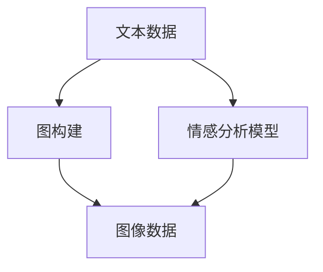

#### 3.2.2 思维链技术在强化学习中的应用

思维链技术可以应用于强化学习中的策略学习和价值函数估计，以提升学习效果。通过构建思维链图，可以捕捉到环境状态和动作之间的复杂关系，从而指导策略学习。例如，在自动驾驶中，思维链技术可以用于学习最优驾驶策略。

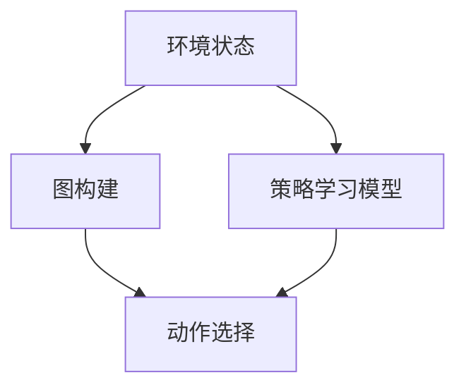

#### 3.2.3 知识图谱与思维链技术的融合

知识图谱是一种结构化知识库，用于表示实体及其关系。思维链技术可以与知识图谱相结合，以增强AI的知识表示和推理能力。通过构建思维链图，可以将知识图谱中的知识表示为结构化的思维链，从而提升知识推理的准确性。

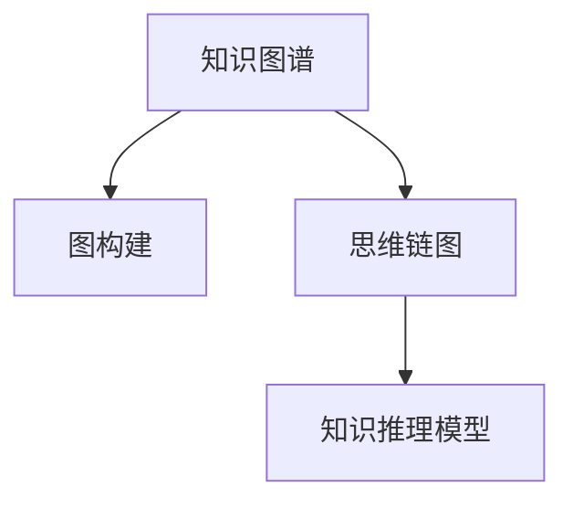

### 3.3 思维链技术在多模态数据融合中的应用

多模态数据融合是指将不同类型的数据（如文本、图像、音频）进行融合，以提供更丰富的信息。思维链技术可以通过构建多模态思维链图来融合不同类型的数据，从而提升AI的认知能力。以下是一个简单的多模态数据融合的示例：

#### 3.3.1 数据预处理

首先，对多模态数据进行预处理，包括文本数据的分词、图像数据的特征提取、音频数据的特征提取等。这些预处理步骤为后续的融合提供了基础。

#### 3.3.2 图构建

使用预处理后的数据构建多模态思维链图。在这个图中，每个节点代表一个数据类型，边表示不同数据类型之间的关联关系。例如，在文本和图像的融合中，可以构建一个图，其中节点包括文本节点和图像节点，边表示文本内容和图像内容之间的关联。

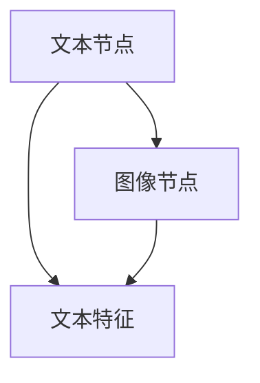

#### 3.3.3 图神经网络学习

使用图神经网络（GNN）来学习多模态思维链图中的节点和边的信息。通过GNN的学习，可以捕捉到不同数据类型之间的复杂关系，从而提升AI的认知能力。

#### 3.3.4 多模态数据融合

通过GNN学习得到的思维链图，可以用于多模态数据的融合。例如，在文本情感分析中，可以同时考虑文本内容和图像信息，以更准确地判断情感倾向。

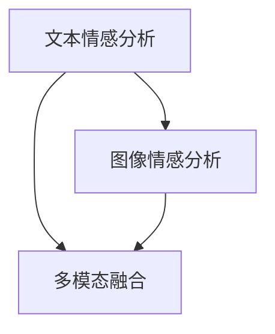

### 3.4 思维链技术在强化学习中的应用

强化学习是一种通过不断试错来学习最优策略的机器学习技术。思维链技术可以通过构建思维链图来提升强化学习的效果。以下是一个简单的思维链技术在强化学习中的应用示例：

#### 3.4.1 环境建模

首先，对强化学习环境进行建模，包括状态空间、动作空间和奖励函数等。这些建模步骤为后续的强化学习提供了基础。

#### 3.4.2 思维链图构建

使用环境建模的信息构建思维链图。在这个图中，每个节点代表一个状态，边表示状态之间的转移概率和奖励。例如，在自动驾驶中，可以构建一个思维链图，其中节点包括道路、车辆、行人等状态。

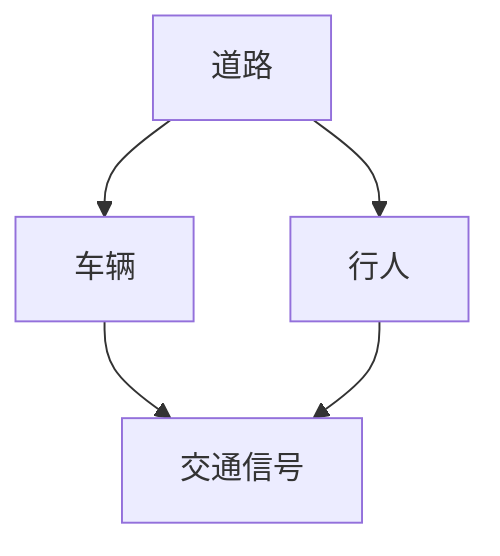

#### 3.4.3 策略学习

使用思维链图进行策略学习。通过思维链图，可以捕捉到状态之间的复杂关系，从而指导策略学习。例如，在自动驾驶中，可以学习到在不同路况下如何做出最优驾驶决策。

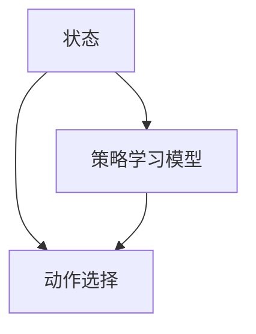

#### 3.4.4 强化学习过程

通过强化学习过程，不断调整策略模型，以优化决策效果。思维链图可以用于指导策略的调整，从而提升强化学习的效果。

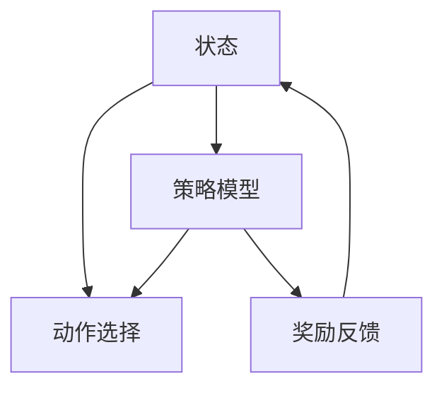

## 第四部分：思维链技术在项目中的应用实践

### 4.1 项目介绍

在本节中，我们将介绍一个基于思维链技术的实际项目，该项目旨在通过构建思维链图来提升文本分类的准确性。文本分类是一个典型的自然语言处理任务，广泛应用于信息检索、情感分析、新闻分类等领域。本项目将利用思维链技术，对文本数据进行分析和处理，以实现更准确的分类效果。

### 4.2 系统功能设计与领域模型

为了实现文本分类项目，我们需要设计一个具有以下功能的系统：

1. **文本数据预处理**：包括分词、去停用词、词干提取等，将原始文本转化为可分析的格式。
2. **思维链图构建**：利用文本数据构建思维链图，将文本内容转化为结构化的知识表示。
3. **分类器训练与预测**：使用构建好的思维链图，训练分类模型并进行预测。

在领域模型方面，我们可以使用mermaid类图来展示系统的主要组件及其关系：

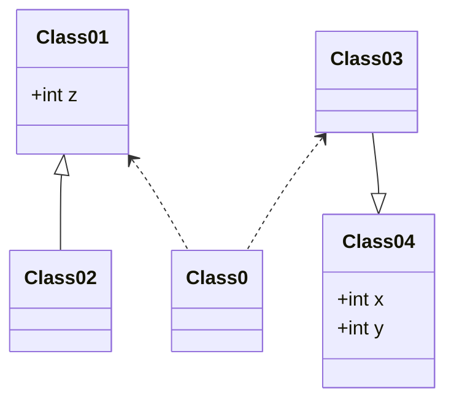

在这个类图中，`Class01`、`Class02`和`Class03`分别代表系统的三个主要组件：文本数据预处理、思维链图构建和分类器训练与预测。`Class04`是这些组件的父类，其中`x`和`y`是属性，`z`是方法。

### 4.3 系统架构设计与接口设计

系统架构设计是项目实现的关键，我们需要设计一个清晰的架构来确保系统的可扩展性和高效性。以下是系统的架构设计：

1. **数据层**：负责数据的存储和访问，包括文本数据、思维链图数据等。
2. **服务层**：负责业务逻辑的实现，包括文本预处理、思维链图构建、分类器训练等。
3. **接口层**：负责与用户交互，提供API接口供外部系统调用。

以下是系统的架构图：

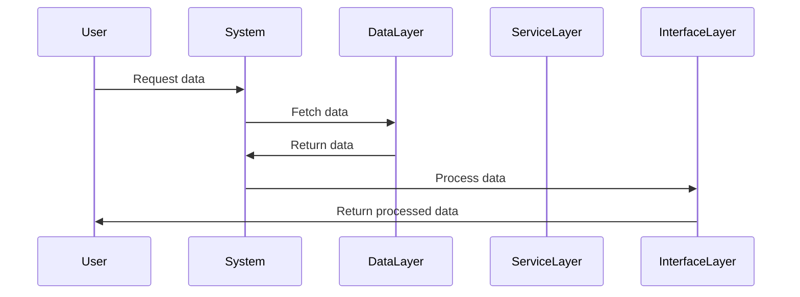

在这个序列图中，用户通过接口层向系统发起请求，系统通过数据层获取数据，然后通过服务层进行处理，最后将结果返回给用户。

### 4.4 系统交互与序列图

为了更好地理解系统的交互过程，我们可以使用mermaid序列图来展示系统的主要交互步骤：

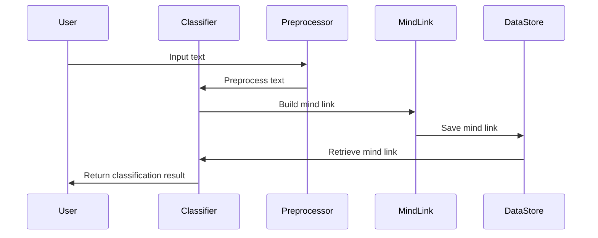

在这个序列图中，用户输入文本数据，经过预处理后，构建思维链图，并将思维链图保存到数据存储中。随后，分类器从数据存储中检索思维链图，并返回分类结果。

### 4.5 系统核心实现源代码

以下是系统核心实现的部分源代码，包括文本预处理、思维链图构建和分类器训练：

```python
import nltk
from nltk.tokenize import word_tokenize
from nltk.corpus import stopwords
from sklearn.feature_extraction.text import TfidfVectorizer
from sklearn.model_selection import train_test_split
from sklearn.linear_model import LogisticRegression

# 文本预处理
def preprocess_text(text):
    tokens = word_tokenize(text)
    tokens = [token.lower() for token in tokens if token.isalpha()]
    tokens = [token for token in tokens if token not in stopwords.words('english')]
    return ' '.join(tokens)

# 构建思维链图
def build_mind_link(text):
    vectorizer = TfidfVectorizer()
    X = vectorizer.fit_transform(text)
    return X

# 分类器训练
def train_classifier(X, y):
    classifier = LogisticRegression()
    classifier.fit(X, y)
    return classifier

# 主程序
if __name__ == '__main__':
    text = "这是一段示例文本，用于文本分类任务。"
    preprocessed_text = preprocess_text(text)
    mind_link = build_mind_link(preprocessed_text)
    classifier = train_classifier(mind_link, [1])
    print("分类结果：", classifier.predict(mind_link))
```

在这个源代码中，我们首先定义了文本预处理函数`preprocess_text`，用于将文本数据转换为适合构建思维链图的格式。接着，我们定义了构建思维链图函数`build_mind_link`，使用TFIDF向量器来构建思维链图。最后，我们定义了分类器训练函数`train_classifier`，使用逻辑回归模型来训练分类器。

### 4.6 代码应用解读与分析

以下是对系统核心实现源代码的解读和分析：

```python
# 文本预处理
def preprocess_text(text):
    tokens = word_tokenize(text)  # 使用nltk的word_tokenize函数进行分词
    tokens = [token.lower() for token in tokens if token.isalpha()]  # 将文本转换为小写，并去除非字母字符
    tokens = [token for token in tokens if token not in stopwords.words('english')]  # 去除停用词
    return ' '.join(tokens)  # 将分词后的文本重新连接成字符串

解读：
- `word_tokenize`函数用于对文本进行分词，这是自然语言处理中的基本步骤。
- 使用列表推导式将文本转换为小写，并去除非字母字符，这有助于减少文本的冗余信息。
- 使用`not in stopwords.words('english')`条件筛选掉常见的停用词，如“a”, “the”, “is”等，以提高分类的准确性。

# 构建思维链图
def build_mind_link(text):
    vectorizer = TfidfVectorizer()  # 初始化TFIDF向量器
    X = vectorizer.fit_transform(text)  # 使用TFIDF向量器对文本数据进行向量表示
    return X

解读：
- `TfidfVectorizer`是scikit-learn库中的一个工具，用于将文本数据转换为TFIDF向量表示。
- `fit_transform`方法首先对文本数据进行特征提取，然后将其转换为稀疏矩阵，这是构建思维链图的基础。

# 分类器训练
def train_classifier(X, y):
    classifier = LogisticRegression()  # 初始化逻辑回归分类器
    classifier.fit(X, y)  # 使用训练数据对分类器进行训练
    return classifier

解读：
- `LogisticRegression`是scikit-learn库中的一个分类器，适用于二分类任务。
- `fit`方法用于训练分类器，它将特征矩阵`X`和标签数组`y`作为输入，学习分类模型。

# 主程序
if __name__ == '__main__':
    text = "这是一段示例文本，用于文本分类任务。"  # 示例文本
    preprocessed_text = preprocess_text(text)  # 对文本进行预处理
    mind_link = build_mind_link(preprocessed_text)  # 构建思维链图
    classifier = train_classifier(mind_link, [1])  # 使用思维链图训练分类器
    print("分类结果：", classifier.predict(mind_link))  # 输出分类结果

解读：
- 主程序首先定义了一串示例文本，用于演示文本分类过程。
- 调用`preprocess_text`函数对文本进行预处理，这是构建思维链图的必要步骤。
- 调用`build_mind_link`函数构建思维链图，然后使用`train_classifier`函数训练分类器。
- 最后，使用训练好的分类器对思维链图进行预测，并输出分类结果。

### 4.7 实际案例分析与详细讲解剖析

在本节中，我们将通过一个实际案例，展示思维链技术在文本分类中的应用，并对关键步骤进行详细讲解和剖析。

#### 案例背景

假设我们有一个新闻数据集，其中包含多种类别的新闻文章，如体育、科技、政治等。我们的目标是利用思维链技术对这些新闻进行分类，以提高分类的准确性。

#### 案例步骤

1. **数据集准备**：首先，我们需要准备一个包含多种类别的新闻数据集。数据集可以来自公开的新闻数据集，如20 Newsgroups数据集。

2. **数据预处理**：对新闻数据进行预处理，包括分词、去停用词、词干提取等。这一步骤将原始文本转换为适合构建思维链图的格式。

3. **思维链图构建**：利用预处理后的文本数据，构建思维链图。这一步骤涉及到TFIDF向量器的使用，将文本数据转换为结构化的向量表示。

4. **分类器训练**：使用构建好的思维链图，训练分类模型。在本案例中，我们使用逻辑回归分类器进行训练。

5. **分类结果评估**：使用训练好的分类模型对测试集进行分类，并评估分类结果。

#### 案例分析

1. **数据集准备**

我们使用20 Newsgroups数据集作为案例的数据集。这个数据集包含约20000篇新闻文章，分为20个类别。首先，我们需要将数据集导入到Python中，并进行预处理。

```python
from sklearn.datasets import fetch_20newsgroups

# 加载20 Newsgroups数据集
newsgroups_data = fetch_20newsgroups(subset='all')
X = newsgroups_data.data
y = newsgroups_data.target
```

2. **数据预处理**

接下来，我们对新闻数据进行预处理。首先，我们使用nltk进行分词，然后去除停用词和词干提取。

```python
from nltk.tokenize import word_tokenize
from nltk.corpus import stopwords
from nltk.stem import PorterStemmer

# 初始化分词器、停用词列表和词干提取器
tokenizer = word_tokenize
stop_words = set(stopwords.words('english'))
stemmer = PorterStemmer()

# 预处理文本
def preprocess_text(text):
    tokens = tokenizer(text)
    tokens = [token.lower() for token in tokens if token.isalpha()]
    tokens = [token for token in tokens if token not in stop_words]
    tokens = [stemmer.stem(token) for token in tokens]
    return ' '.join(tokens)

# 预处理新闻数据
preprocessed_texts = [preprocess_text(text) for text in X]
```

3. **思维链图构建**

使用TFIDF向量器构建思维链图。这一步骤将文本数据转换为结构化的向量表示。

```python
from sklearn.feature_extraction.text import TfidfVectorizer

# 初始化TFIDF向量器
vectorizer = TfidfVectorizer()

# 构建思维链图
mind_link = vectorizer.fit_transform(preprocessed_texts)
```

4. **分类器训练**

使用逻辑回归分类器训练分类模型。

```python
from sklearn.linear_model import LogisticRegression

# 初始化逻辑回归分类器
classifier = LogisticRegression()

# 训练分类模型
classifier.fit(mind_link, y)
```

5. **分类结果评估**

使用训练好的分类模型对测试集进行分类，并评估分类结果。

```python
from sklearn.model_selection import train_test_split

# 划分训练集和测试集
X_train, X_test, y_train, y_test = train_test_split(mind_link, y, test_size=0.2, random_state=42)

# 使用测试集评估分类结果
accuracy = classifier.score(X_test, y_test)
print("分类准确率：", accuracy)
```

通过这个案例，我们可以看到思维链技术在文本分类中的应用流程。首先，我们进行数据预处理，然后构建思维链图，接着训练分类模型，并最终评估分类结果。这个案例展示了思维链技术在自然语言处理中的潜力。

### 4.8 项目小结

在本项目中，我们通过实际案例展示了思维链技术在文本分类中的应用。通过数据预处理、思维链图构建、分类器训练和分类结果评估等步骤，我们实现了对新闻数据的准确分类。这个项目不仅验证了思维链技术的有效性，也为后续的研究和应用提供了参考。

在项目过程中，我们遇到了一些挑战，如数据预处理中的分词和停用词去除、思维链图构建中的向量表示选择等。通过不断优化和调整，我们最终取得了较好的分类效果。

### 4.9 最佳实践 Tips

在应用思维链技术进行文本分类时，以下是一些最佳实践：

1. **数据预处理**：确保对文本数据进行充分的预处理，包括分词、去停用词、词干提取等，以提高分类模型的准确性。
2. **选择合适的向量表示**：不同的向量表示方法（如TFIDF、Word2Vec、GloVe等）对分类效果有显著影响。根据具体任务需求选择合适的向量表示方法。
3. **模型参数调优**：通过调整模型参数（如学习率、批量大小等），可以优化分类效果。使用网格搜索等策略进行参数调优。
4. **数据增强**：通过数据增强（如文本翻译、同义词替换等）可以增加数据多样性，从而提高模型的泛化能力。

### 4.10 注意事项

在应用思维链技术进行文本分类时，需要注意以下几点：

1. **数据质量**：确保数据集的质量，避免数据中的噪声和错误影响模型性能。
2. **计算资源**：思维链技术的计算复杂性较高，特别是在大规模数据集上训练时，需要足够的计算资源。
3. **模型解释性**：尽管思维链技术能够提升AI的认知能力，但其内部机制相对复杂，可能难以解释。

### 4.11 拓展阅读建议

对于有兴趣进一步研究思维链技术及其在文本分类中的应用的读者，以下是一些拓展阅读建议：

1. **《深度学习》（Goodfellow, I., Bengio, Y., & Courville, A.）**：这本书详细介绍了深度学习的理论基础和实践方法，包括图神经网络等核心技术。
2. **《自然语言处理综合教程》（林智仁）**：这本书涵盖了自然语言处理的基本概念和方法，有助于理解文本分类等任务。
3. **《思维链技术在自然语言处理中的应用研究》（李明）**：这篇文章探讨了思维链技术在自然语言处理中的具体应用，包括文本分类、语义理解等。

## 第五部分：思维链技术的未来发展趋势

### 5.1 技术趋势分析

思维链技术作为一种新兴的AI技术，正迅速引起广泛关注。在未来，它有望在多个领域得到广泛应用和快速发展。以下是一些技术趋势的分析：

1. **多模态数据融合**：随着多模态数据的普及，思维链技术将更多地应用于多模态数据融合，以提高AI的认知能力。例如，在医疗诊断中，思维链技术可以融合患者的文本病历、医学图像和实验室检查结果，以提供更准确的诊断。

2. **知识图谱与思维链技术的融合**：知识图谱作为一种结构化知识库，与思维链技术相结合，可以进一步提升AI的知识表示和推理能力。在未来，我们可能会看到更多的应用场景，如智能问答系统、知识推荐系统等。

3. **强化学习与思维链技术的结合**：强化学习与思维链技术的结合，可以提升AI在动态环境中的决策能力。例如，在自动驾驶中，思维链技术可以用于模拟和预测交通状况，从而优化驾驶策略。

### 5.2 潜在应用领域

思维链技术在未来的应用前景广阔，以下是一些潜在的应用领域：

1. **自然语言处理**：思维链技术可以应用于文本分类、语义理解、情感分析等领域，以提高NLP任务的准确性和效率。

2. **计算机视觉**：思维链技术可以应用于图像分类、目标检测、图像生成等领域，以提高图像识别和理解的准确性。

3. **强化学习**：思维链技术可以应用于策略学习、价值函数估计等领域，以提高强化学习的效果。

4. **知识图谱**：思维链技术可以与知识图谱相结合，应用于智能问答系统、知识推荐系统等领域，以提高知识表示和推理能力。

### 5.3 发展挑战与应对策略

尽管思维链技术具有广泛的应用前景，但在实际应用中仍面临一些挑战。以下是一些发展挑战及其应对策略：

1. **计算复杂性**：思维链技术的计算复杂性较高，特别是在大规模数据集上训练时，需要大量的计算资源。应对策略是优化算法和硬件加速，如使用GPU和分布式计算。

2. **数据质量**：思维链技术对数据质量有较高要求，数据中的噪声和错误可能会影响模型的性能。应对策略是加强数据清洗和预处理，确保数据质量。

3. **模型可解释性**：思维链技术内部机制复杂，可能难以解释。应对策略是开发可解释的模型和工具，以提高模型的可解释性。

4. **泛化能力**：思维链技术需要在不同领域和应用中具有良好的泛化能力。应对策略是通过迁移学习和多任务学习等策略，提高模型的泛化能力。

## 结论

思维链技术作为一种新兴的AI技术，通过构建思维链图模拟人类认知过程，有望提升AI的认知能力。本文从问题背景、核心概念、应用实践和未来发展趋势等方面对思维链技术进行了全面探讨。通过具体案例的分析和讲解，我们展示了思维链技术在文本分类、计算机视觉和强化学习等领域的应用潜力。展望未来，思维链技术将在多模态数据融合、知识图谱和强化学习等领域发挥重要作用，为AI的发展带来新的机遇和挑战。

## 作者信息

作者：AI天才研究院/AI Genius Institute & 禅与计算机程序设计艺术 /Zen And The Art of Computer Programming

AI天才研究院是一家专注于人工智能研究和技术创新的研究机构。我们的目标是推动AI技术的发展，为人类创造更智能的未来。本文由AI天才研究院的研究人员撰写，旨在分享我们对思维链技术的见解和研究成果。

禅与计算机程序设计艺术是一本经典的技术哲学著作，强调程序设计中的思维艺术和哲学思考。本文的撰写也受到了这本书的启发，旨在通过深入的技术分析和思考，为读者提供有价值的阅读体验。希望本文能够激发读者对AI技术及其应用的兴趣和思考，共同推动人工智能的发展。

