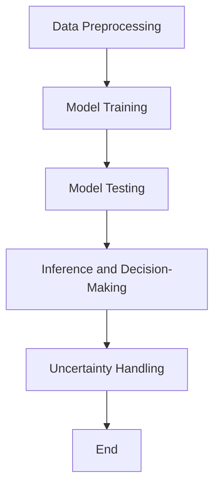
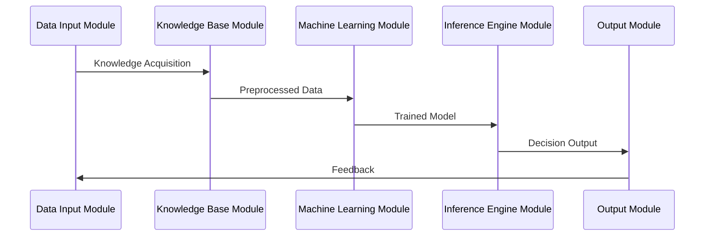

                 


### Introduction to Thinking Chain Technology

#### 1.1 Background and Problem Description

### 1.1.1 Background of AI and Problem Solving

Artificial Intelligence (AI) has evolved significantly over the past few decades, transforming various industries and aspects of our daily lives. From voice assistants to autonomous vehicles, AI has demonstrated its potential in solving complex problems and improving efficiency. However, despite its progress, traditional AI approaches often struggle with problem-solving capabilities that are comparable to human intelligence. The limitations of current AI systems, such as lack of common sense reasoning, poor generalization, and inability to handle high-dimensional data, have become evident in real-world applications.

**Evolution of AI**

AI research has undergone several major phases, including the rule-based systems of the 1950s and 1960s, expert systems in the 1970s and 1980s, and the emergence of machine learning (ML) in the 1990s and beyond. Each phase has brought new techniques and methodologies, leading to significant advancements in AI. However, even with these advancements, traditional AI systems still face challenges in handling real-world problems effectively.

**The Need for Enhanced Problem-Solving Capabilities**

As AI systems become more integrated into various domains, there is an increasing demand for them to possess better problem-solving abilities. This is particularly important in fields such as healthcare, finance, and manufacturing, where complex problems require nuanced understanding and decision-making capabilities. Enhancing AI's problem-solving abilities can lead to more effective and efficient solutions, reducing human error and improving overall productivity.

### 1.1.2 Problem Statement and Solution Overview

**Problem Statement**

The primary challenge in enhancing AI's problem-solving abilities lies in the limitations of current AI techniques. These limitations include:

- **Lack of Common Sense Reasoning:** AI systems often struggle to understand and apply common sense knowledge, which is crucial for real-world problem-solving.
- **Poor Generalization:** AI models are often trained on specific datasets and may not generalize well to new or unseen data.
- **High-Dimensional Data Handling:** Traditional AI techniques often struggle with the complexity and volume of high-dimensional data.
- **Inability to Handle Ambiguity and Uncertainty:** AI systems often fail to handle ambiguous or uncertain situations effectively.

**Solution Overview: Thinking Chain Technology**

Thinking Chain Technology (TCT) is an innovative approach designed to address these limitations. TCT integrates multiple AI techniques and methodologies, creating a robust framework for enhancing AI's problem-solving capabilities. The key components of TCT include:

- **Incorporating Common Sense Knowledge:** TCT incorporates a knowledge base of common sense knowledge, enabling AI systems to understand and apply context-specific information.
- **Enhancing Generalization:** TCT employs techniques such as transfer learning and meta-learning to improve the generalization capabilities of AI models.
- **Handling High-Dimensional Data:** TCT utilizes dimensionality reduction techniques and advanced data processing methods to effectively handle high-dimensional data.
- **Incorporating Uncertainty Handling:** TCT incorporates probabilistic models and Bayesian inference to handle uncertainty and ambiguity in problem-solving scenarios.

### 1.1.3 Boundaries and Scope

**Definition and Scope of Thinking Chain Technology**

Thinking Chain Technology is an AI framework that integrates various AI techniques to enhance problem-solving capabilities. It encompasses multiple components, including knowledge bases, data processing methods, machine learning models, and inference engines. TCT aims to create a cohesive system that can handle complex problems with a higher degree of understanding and efficiency.

**Limitations and Areas for Further Research**

While TCT has shown promise in enhancing AI's problem-solving abilities, it is not without limitations. Some of the challenges include:

- **Knowledge Acquisition and Representation:** Effective acquisition and representation of common sense knowledge remains a challenge.
- **Computational Complexity:** TCT may become computationally intensive when dealing with large datasets or high-dimensional data.
- **Integration of Multiple Techniques:** Ensuring seamless integration of various AI techniques can be complex and requires further research.

### 1.2 Core Concepts and Relationships

**1.2.1 Key Concepts and Principles**

**1.2.1.1 Thinking Chain Technology**

Thinking Chain Technology is an AI framework that integrates various techniques and methodologies to enhance problem-solving capabilities. It is designed to handle complex problems by incorporating common sense knowledge, improving generalization, handling high-dimensional data, and incorporating uncertainty handling.

**1.2.1.2 Comparing Attributes of Core Concepts**

The following table compares the attributes of the key concepts in Thinking Chain Technology:

| Concept | Attribute 1 | Attribute 2 | Attribute 3 |
| --- | --- | --- | --- |
| Knowledge Base | Organizes common sense knowledge | Represents relationships between concepts | Supports reasoning and inference |
| Machine Learning Models | Learns from data | Generalizes to unseen data | Incorporates domain-specific knowledge |
| Data Processing Methods | Handles high-dimensional data | Reduces dimensionality | Ensures data quality |
| Inference Engines | Apply reasoning rules | Generate explanations | Support uncertainty handling |

**1.2.1.3 Entity Relationship Diagram (ERD)**

The following Mermaid ER diagram illustrates the relationships between the core components of Thinking Chain Technology:

```mermaid
erDiagram
    KnowledgeBase ||--|{ MachineLearningModel : Uses}
    DataProcessingMethod ||--|{ MachineLearningModel : Uses}
    InferenceEngine ||--|{ MachineLearningModel : Uses}
    KnowledgeBase ||--|{ InferenceEngine : Uses}
    DataProcessingMethod ||--|{ InferenceEngine : Uses}
end
```

### 1.3 Conclusion

In this section, we have introduced the background and problem description of AI and problem-solving, highlighted the limitations of traditional AI approaches, and proposed Thinking Chain Technology as a solution. We have outlined the core concepts and relationships within TCT, providing a foundation for further exploration of the technology. In the following sections, we will delve deeper into the fundamental principles of TCT, exploring its algorithmic principles, system architecture, and practical applications.

---

### Fundamental Principles of Thinking Chain Technology

#### 2.1 Algorithm Principles

Thinking Chain Technology is built on a foundation of robust algorithmic principles that enable it to enhance AI's problem-solving abilities. In this section, we will explore the key algorithms that constitute TCT, discussing their concepts, structures, and underlying principles.

#### 2.1.1 Algorithm Overview

The core algorithm of Thinking Chain Technology can be broken down into several main steps, each serving a specific purpose in the problem-solving process:

1. **Data Preprocessing**: This step involves cleaning and transforming raw data into a suitable format for further processing. Techniques such as data normalization, missing value imputation, and feature scaling are commonly employed.
2. **Model Training**: In this step, machine learning models are trained using the preprocessed data. The choice of model depends on the specific problem domain and the nature of the data.
3. **Model Testing**: The trained models are tested on a separate validation dataset to evaluate their performance and generalization capabilities. Techniques such as cross-validation and performance metrics (e.g., accuracy, precision, recall) are used to assess model quality.
4. **Inference and Decision-Making**: Once a model is deemed satisfactory, it is used to make predictions or decisions on new, unseen data. Inference engines play a crucial role in applying reasoning rules and generating explanations.
5. **Uncertainty Handling**: TCT incorporates probabilistic models and Bayesian inference to handle uncertainty and ambiguity in the problem-solving process. This allows AI systems to make more informed and reliable decisions.

#### 2.1.2 Mermaid Flowchart

To provide a clear visual representation of the algorithm's flow, we can use the Mermaid diagramming language. Below is a Mermaid flowchart illustrating the key steps of the Thinking Chain Technology algorithm:



#### 2.1.3 Algorithm Explanation

Let's delve deeper into each step of the Thinking Chain Technology algorithm to understand its core principles and processes.

##### Step 1: Data Preprocessing

Data preprocessing is a crucial step that prepares the raw data for further analysis. It involves several sub-steps, including:

- **Data Cleaning**: This step involves removing noise, correcting errors, and handling missing values. Techniques such as imputation and interpolation can be used to fill in missing data.
- **Feature Scaling**: This step involves transforming the data to a standard scale, which is essential for ensuring that all features contribute equally to the model's learning process. Techniques such as normalization and standardization are commonly used.
- **Feature Selection**: This step involves selecting the most relevant features for the problem at hand. Techniques such as mutual information and correlation analysis can be used to identify informative features.

The goal of data preprocessing is to transform the raw data into a clean, structured format that can be efficiently used by machine learning algorithms.

##### Step 2: Model Training

Model training is the process of teaching a machine learning model to recognize patterns in the data. This is achieved by feeding the preprocessed data to the model and adjusting its internal parameters to minimize the prediction error. The key components of model training include:

- **Choosing a Model**: The choice of machine learning model depends on the problem domain and the nature of the data. Common models include linear regression, decision trees, support vector machines, and neural networks.
- **Training Process**: During the training process, the model learns from the input data by adjusting its parameters. Techniques such as gradient descent and backpropagation are commonly used to update the model's parameters iteratively.
- **Parameter Tuning**: The performance of a machine learning model can be significantly influenced by its hyperparameters. Parameter tuning involves finding the optimal values for these hyperparameters through techniques such as grid search and random search.

The goal of model training is to develop a model that can generalize well to new, unseen data.

##### Step 3: Model Testing

Model testing is used to evaluate the performance of the trained model on a separate validation dataset. This step is crucial for assessing whether the model has learned the underlying patterns in the data and can make accurate predictions on new data. Key components of model testing include:

- **Performance Metrics**: Various performance metrics are used to evaluate the model's performance. Common metrics include accuracy, precision, recall, F1-score, and area under the ROC curve (AUC-ROC).
- **Cross-Validation**: Cross-validation is a technique used to assess the model's performance by dividing the dataset into multiple subsets and training and testing the model on each subset. This helps to ensure that the model's performance is not overly dependent on a single dataset split.
- **Error Analysis**: Error analysis involves examining the types of errors the model makes and identifying areas where it can be improved. This can help in refining the model or selecting a different model altogether.

The goal of model testing is to ensure that the model is robust and generalizes well to new data.

##### Step 4: Inference and Decision-Making

Once a trained model has been validated, it can be used to make predictions or decisions on new, unseen data. This step involves applying the learned patterns to new data and generating output based on the model's predictions. Key components of inference and decision-making include:

- **Prediction Generation**: The model generates predictions by applying its learned patterns to new data. The output can be in the form of classifications, regressions, or other types of predictions, depending on the problem domain.
- **Explainability**: In many applications, it is important to understand why the model makes certain predictions. Techniques such as SHAP (SHapley Additive exPlanations) and LIME (Local Interpretable Model-agnostic Explanations) can be used to provide explanations for the model's predictions.
- **Actionable Insights**: The predictions and explanations are used to generate actionable insights and inform decision-making processes. This can be particularly valuable in domains such as healthcare, finance, and manufacturing, where the consequences of incorrect decisions can be significant.

The goal of inference and decision-making is to use the trained model to generate meaningful and actionable predictions.

##### Step 5: Uncertainty Handling

One of the key limitations of traditional AI models is their inability to handle uncertainty and ambiguity. TCT addresses this limitation by incorporating probabilistic models and Bayesian inference. Key components of uncertainty handling include:

- **Probabilistic Models**: Probabilistic models represent the uncertainty in predictions by assigning probabilities to different outcomes. Common models include Gaussian processes, Bayesian networks, and ensemble methods.
- **Bayesian Inference**: Bayesian inference is a statistical technique used to update probabilities based on new evidence. It allows AI systems to incorporate new information and adjust their predictions accordingly.
- **Uncertainty Quantification**: Uncertainty quantification involves quantifying the uncertainty in predictions. This can be used to assess the reliability of the predictions and inform decision-making processes.

The goal of uncertainty handling is to make more informed and reliable decisions by accounting for uncertainty and ambiguity in the problem-solving process.

#### 2.1.4 Algorithm Example

To illustrate the principles of Thinking Chain Technology, let's consider an example of a healthcare application where TCT is used to predict patient outcomes based on clinical data.

**Scenario**: Predicting the likelihood of a patient developing a specific disease based on their medical history and current symptoms.

**Algorithm Steps**:

1. **Data Preprocessing**: The raw clinical data is cleaned and preprocessed to handle missing values, normalize the data, and extract relevant features.
2. **Model Training**: A machine learning model, such as a decision tree or random forest, is trained on the preprocessed data to learn the relationships between features and the disease outcome.
3. **Model Testing**: The trained model is tested on a separate validation dataset to evaluate its performance and ensure it generalizes well to new data.
4. **Inference and Decision-Making**: The model is used to predict the likelihood of disease development for new patients based on their clinical data. The predictions are interpreted and used to inform clinical decisions.
5. **Uncertainty Handling**: Probabilistic models and Bayesian inference are used to quantify the uncertainty in the predictions, providing a measure of the reliability of the predictions.

**Example**:

Consider a patient with the following clinical features: age = 45, blood pressure = 140/90 mmHg, cholesterol level = 200 mg/dL, and smoking status = yes. The TCT system predicts a 70% likelihood of developing the disease based on these features. The uncertainty in this prediction is quantified using a probabilistic model, indicating that there is a 30% chance of the prediction being incorrect.

By incorporating uncertainty handling, the TCT system provides a more nuanced understanding of the predictions, enabling healthcare professionals to make more informed and reliable decisions.

In conclusion, Thinking Chain Technology is an innovative approach that enhances AI's problem-solving capabilities by addressing the limitations of traditional AI techniques. The algorithmic principles of TCT, including data preprocessing, model training, model testing, inference and decision-making, and uncertainty handling, provide a robust framework for developing AI systems that can handle complex problems with a higher degree of understanding and efficiency. In the following sections, we will further explore the system architecture and practical applications of TCT.

---

### 2.2 Core Concepts and Relationships

Thinking Chain Technology (TCT) is a sophisticated framework that integrates various core concepts and principles to enhance AI's problem-solving abilities. Understanding these concepts and their interrelationships is crucial for designing and implementing effective TCT systems. In this section, we will delve into the fundamental concepts of TCT, explore their attributes, and discuss the relationships between them.

#### 2.2.1 Key Concepts and Principles

**1. Knowledge Base**

The knowledge base is a central component of TCT that stores a vast amount of domain-specific knowledge. It is used to provide context and background information that helps AI systems make more informed decisions. The knowledge base can include facts, rules, and relationships that are relevant to the problem domain.

**Attributes of Knowledge Base:**
- **Content Organization:** The knowledge base organizes information in a structured manner, making it easy to access and retrieve.
- **Representation:** The knowledge base can use different representation formats, such as natural language processing (NLP) techniques, ontologies, or graph databases.
- **Updateability:** The knowledge base should be easily updatable to incorporate new information and adapt to changing circumstances.

**2. Machine Learning Models**

Machine learning models are the core computational elements of TCT that learn from data to make predictions or decisions. These models can range from simple linear regression to complex neural networks, depending on the complexity of the problem.

**Attributes of Machine Learning Models:**
- **Generalization:** Machine learning models should be capable of generalizing from the training data to unseen data.
- **Robustness:** Models should be robust to noisy data and variations in the input.
- **Customizability:** Models should be adaptable to different problem domains and datasets.

**3. Data Processing Methods**

Data processing methods are essential for transforming raw data into a format suitable for machine learning models. This includes steps such as data cleaning, feature extraction, and dimensionality reduction.

**Attributes of Data Processing Methods:**
- **Efficiency:** Data processing methods should be efficient to handle large datasets.
- **Accuracy:** Methods should preserve the integrity of the data while transforming it.
- **Flexibility:** Methods should be flexible enough to handle different types of data and datasets.

**4. Inference Engines**

Inference engines are responsible for applying reasoning rules and making logical deductions based on the knowledge base and machine learning models. They play a crucial role in decision-making and generating explanations for predictions.

**Attributes of Inference Engines:**
- **Interpretability:** Inference engines should provide explanations that are understandable to humans.
- **Scalability:** Engines should be scalable to handle complex and large-scale problems.
- **Real-time Processing:** Inference engines should support real-time processing for dynamic decision-making scenarios.

#### 2.2.2 Comparing Attributes of Core Concepts

To better understand the differences and relationships between the core concepts of TCT, we can use a comparative table to highlight their key attributes:

| Concept         | Attribute 1         | Attribute 2         | Attribute 3         |
|-----------------|---------------------|---------------------|---------------------|
| Knowledge Base  | Content Organization | Representation       | Updateability        |
| Machine Learning | Generalization       | Robustness           | Customizability      |
| Data Processing  | Efficiency           | Accuracy             | Flexibility          |
| Inference Engines | Interpretability     | Scalability          | Real-time Processing |

#### 2.2.3 Entity Relationship Diagram (ERD)

To visualize the relationships between the core concepts of TCT, we can use a Mermaid Entity Relationship Diagram (ERD). The following ERD illustrates the connections between the knowledge base, machine learning models, data processing methods, and inference engines:

```mermaid
erDiagram
    KnowledgeBase ||--|{ MachineLearningModel : Uses}
    KnowledgeBase ||--|{ InferenceEngine : Uses}
    MachineLearningModel ||--|{ DataProcessingMethod : Uses}
    InferenceEngine ||--|{ DataProcessingMethod : Uses}
end
```

In this ERD:
- The Knowledge Base is depicted as the central entity that interacts with both the Machine Learning Model and the Inference Engine.
- The Machine Learning Model is connected to the Data Processing Method, indicating that the model relies on processed data for training and inference.
- The Inference Engine is also connected to the Data Processing Method, suggesting that it uses processed data to generate explanations and make decisions.

By understanding these relationships, we can design and implement TCT systems that leverage the strengths of each component to enhance AI's problem-solving capabilities.

#### 2.2.4 Core Principles of TCT

The core principles of Thinking Chain Technology (TCT) are designed to integrate and enhance the capabilities of various AI components. These principles include:
- **Incorporation of Domain Knowledge:** TCT integrates domain-specific knowledge into the system, enabling it to understand the context and make more informed decisions.
- **Data-Driven Learning:** TCT leverages data-driven learning techniques to improve the performance of machine learning models.
- **Reasoning and Inference:** TCT employs reasoning and inference engines to generate explanations and support decision-making processes.
- **Uncertainty Handling:** TCT incorporates techniques for handling uncertainty and ambiguity in predictions, improving the reliability of the system.

By adhering to these principles, TCT creates a cohesive framework that enhances the problem-solving abilities of AI systems.

In conclusion, the core concepts and principles of Thinking Chain Technology (TCT) form the foundation of its design. Understanding the attributes and relationships between these concepts is crucial for developing effective TCT systems. In the following sections, we will explore the application of TCT in real-world scenarios and discuss the challenges and future directions for this innovative technology.

---

### 2.3 Advanced Algorithms in Thinking Chain Technology

Thinking Chain Technology (TCT) leverages a suite of advanced algorithms to enhance AI's problem-solving capabilities. These algorithms are designed to address the limitations of traditional AI methods and improve the system's ability to handle complex, real-world problems. In this section, we will delve into some of the key advanced algorithms used in TCT, including reinforcement learning, meta-learning, and generative adversarial networks (GANs).

#### 2.3.1 Reinforcement Learning

Reinforcement Learning (RL) is a type of machine learning where an agent learns to make decisions by interacting with an environment. The agent receives feedback in the form of rewards or penalties, which it uses to improve its decision-making process over time. RL is particularly well-suited for problems involving sequential decision-making and exploration-exploitation trade-offs.

**Key Concepts and Advantages:**
- **Agent**: The decision-maker within the RL framework.
- **Environment**: The external context in which the agent operates.
- **State**: The current situation or context of the agent.
- **Action**: A possible decision or behavior of the agent.
- **Reward**: The feedback received by the agent for its actions.
- **Policy**: The strategy or set of rules that the agent uses to make decisions.

Reinforcement learning algorithms, such as Q-learning and Deep Q-Networks (DQN), are integrated into TCT to enable AI systems to learn optimal behaviors for complex tasks. These algorithms can be trained to handle dynamic environments, adapt to changing conditions, and make decisions based on long-term rewards.

**Example: Robotic Navigation**
Consider a scenario where an AI system needs to navigate a robot through a complex environment. The robot's goal is to reach a specific destination while avoiding obstacles and minimizing the time taken. Using reinforcement learning, the robot can learn an optimal path through trial and error, receiving rewards for successful navigation and penalties for collisions or delays.

#### 2.3.2 Meta-Learning

Meta-learning, also known as learning to learn, is the process of developing algorithms that can improve their learning efficiency across different tasks. Meta-learning algorithms are designed to accelerate the training process and enhance generalization by leveraging prior knowledge from similar tasks.

**Key Concepts and Advantages:**
- **Task**: A specific problem or learning scenario.
- **Pre-training**: The process of training a model on a set of tasks to develop a general learning capability.
- **Task Adaptation**: The process of adapting a pre-trained model to a new task.
- **Domain Adaptation**: The process of adapting a model trained on one domain to a different domain.

Meta-learning algorithms, such as Model-Agnostic Meta-Learning (MAML) and Reptile, are integrated into TCT to improve the system's ability to adapt to new tasks quickly. By learning from a diverse set of tasks, meta-learning algorithms can develop more robust and generalizable models that can handle a wide range of problem domains.

**Example: Transfer Learning**
In the field of computer vision, meta-learning can be used to train a model on a variety of image classification tasks. Once the model is pre-trained, it can be adapted to new classification tasks with minimal additional training, reducing the amount of data required and improving the model's performance.

#### 2.3.3 Generative Adversarial Networks (GANs)

Generative Adversarial Networks (GANs) are a type of deep learning model that consists of two neural networks, a generator, and a discriminator, that are trained simultaneously through a competitive process. The generator creates synthetic data that is indistinguishable from real data, while the discriminator attempts to distinguish between real and generated data.

**Key Concepts and Advantages:**
- **Generator**: The network that creates synthetic data.
- **Discriminator**: The network that evaluates the authenticity of data.
- **Adversarial Training**: The process of training the generator and discriminator in a zero-sum game where one aims to maximize its performance while the other aims to minimize it.

GANs are integrated into TCT to enhance the system's ability to generate realistic and high-quality data, which can be used for training and testing machine learning models. GANs can generate diverse data samples, improve data quality, and reduce the need for large labeled datasets.

**Example: Data Augmentation**
In the context of image recognition, GANs can be used to generate synthetic images that augment the training dataset. These generated images help the model learn more robust features and improve its generalization capabilities, particularly when dealing with imbalanced or limited data.

#### 2.3.4 Application Scenarios

**Healthcare**: TCT can be applied in healthcare to develop AI systems that can assist in diagnosis, treatment planning, and patient monitoring. Reinforcement learning can be used to optimize treatment protocols, while meta-learning can help the system adapt to new medical tasks and domains.

**Finance**: In the financial industry, TCT can enhance the accuracy of predictive analytics and risk assessment. GANs can be used to generate synthetic financial data for training models, improving their ability to detect fraud and predict market trends.

**Manufacturing**: TCT can optimize production processes and supply chain management by leveraging reinforcement learning for robotic automation and meta-learning for task adaptation in dynamic environments.

**Natural Language Processing (NLP)**: TCT can improve NLP tasks such as language translation, sentiment analysis, and text generation by incorporating advanced algorithms like GANs to generate high-quality text data and meta-learning to adapt to different linguistic styles and domains.

In conclusion, advanced algorithms such as reinforcement learning, meta-learning, and GANs are integral to the success of Thinking Chain Technology. These algorithms address the limitations of traditional AI methods and enhance the system's ability to solve complex, real-world problems. By leveraging these advanced techniques, TCT enables AI systems to achieve higher levels of performance, adaptability, and reliability across various domains.

---

### 2.4 System Architecture and Design of Thinking Chain Technology

Thinking Chain Technology (TCT) is a sophisticated framework that integrates various components to enhance AI's problem-solving capabilities. A well-designed system architecture is crucial for ensuring the efficient functioning of TCT and enabling it to handle complex problems effectively. In this section, we will discuss the system architecture and design principles of TCT, including the overall system structure, module interactions, and critical design decisions.

#### 2.4.1 Overview of TCT System Architecture

The TCT system architecture is modular, allowing for flexibility and scalability. The system is composed of several key modules, each with specific responsibilities and interactions. The overall system architecture can be visualized as follows:

1. **Data Input Module**: This module is responsible for receiving and preprocessing raw data from various sources. It performs tasks such as data cleaning, normalization, and feature extraction to prepare the data for further processing.
2. **Knowledge Base Module**: This module manages the domain-specific knowledge stored in the knowledge base. It includes functions for knowledge acquisition, representation, and retrieval. The knowledge base is used to provide context and background information for decision-making.
3. **Machine Learning Module**: This module consists of various machine learning algorithms and models. It is responsible for training and validating these models using the preprocessed data from the Data Input Module. The trained models are then used for inference and decision-making.
4. **Inference Engine Module**: This module applies reasoning and inference rules to generate explanations and make decisions based on the knowledge base and trained models. It is responsible for converting raw data into actionable insights.
5. **Output Module**: This module generates and delivers the final outputs, such as predictions, recommendations, or reports, to the end-users or other systems.

#### 2.4.2 Module Interactions

The modules in the TCT system interact with each other through well-defined interfaces and data exchange mechanisms. The following diagram illustrates the interactions between the key modules:



In this diagram:
- The Data Input Module preprocesses the raw data and sends it to the Knowledge Base Module for knowledge acquisition.
- The Knowledge Base Module retrieves relevant knowledge and sends it to the Machine Learning Module along with the preprocessed data.
- The Machine Learning Module trains the models using the combined knowledge and data, and sends the trained models to the Inference Engine Module.
- The Inference Engine Module applies reasoning and inference rules to generate actionable insights and sends the output to the Output Module.
- The Output Module delivers the final outputs to the end-users or other systems. Feedback from the end-users is then sent back to the Data Input Module for continuous improvement.

#### 2.4.3 Key Design Decisions

Several key design decisions are made to ensure the effectiveness and efficiency of the TCT system architecture:

1. **Modularity**: The system architecture is designed to be modular, allowing for easy integration of new components and algorithms. This modularity facilitates scalability and adaptability to changing requirements.
2. **Interoperability**: The modules are designed to communicate with each other through standardized interfaces and data exchange formats. This ensures seamless integration and efficient data flow within the system.
3. **Scalability**: The system is designed to handle large volumes of data and complex problem domains. This is achieved through the use of distributed computing and parallel processing techniques.
4. **Fault Tolerance**: The system incorporates fault tolerance mechanisms to ensure continuous operation in the event of component failures. This includes data redundancy, backup systems, and real-time monitoring.
5. **Security and Privacy**: The system is designed with security and privacy considerations in mind. This includes data encryption, access control, and compliance with regulatory requirements.

In conclusion, the system architecture and design of Thinking Chain Technology are carefully crafted to ensure the efficient and effective operation of the system. By integrating modular components, facilitating interoperability, ensuring scalability, and addressing security and privacy concerns, TCT is well-equipped to handle complex problem-solving tasks in various domains.

---

### 2.5 Application Scenarios of Thinking Chain Technology

Thinking Chain Technology (TCT) is a versatile framework that can be applied to a wide range of application scenarios across different industries. In this section, we will explore several real-world applications of TCT, highlighting the key benefits and challenges of implementing this technology in each domain.

#### 2.5.1 Healthcare

In the healthcare industry, TCT can be used to develop AI-driven diagnostic tools, personalized treatment plans, and patient monitoring systems. By integrating medical knowledge, machine learning algorithms, and reasoning engines, TCT can enhance the accuracy and efficiency of healthcare solutions.

**Benefits:**
- **Improved Diagnosis:** TCT can analyze large volumes of medical data, identifying subtle patterns that may be missed by human clinicians.
- **Personalized Treatment Plans:** TCT can generate personalized treatment plans based on a patient's specific medical history and genetic information.
- **Real-time Monitoring:** TCT can continuously monitor patient health metrics, providing early warnings of potential health issues.

**Challenges:**
- **Data Privacy:** Ensuring the privacy and security of sensitive patient data is a significant concern.
- **Integration with Existing Systems:** Integrating TCT with existing healthcare information systems can be complex and time-consuming.

#### 2.5.2 Finance

In the financial sector, TCT can enhance predictive analytics, risk assessment, and fraud detection capabilities. By leveraging advanced machine learning algorithms and real-time data processing, TCT can help financial institutions make more informed decisions and protect against financial crimes.

**Benefits:**
- **Enhanced Predictive Analytics:** TCT can forecast market trends and economic indicators, providing valuable insights for investment decisions.
- **Improved Risk Assessment:** TCT can assess and manage financial risks more accurately, reducing the likelihood of financial losses.
- **Fraud Detection:** TCT can identify patterns of fraudulent activity, enabling faster and more effective responses to potential fraud.

**Challenges:**
- **Data Quality:** The accuracy of TCT's predictions depends heavily on the quality and integrity of the data.
- **Regulatory Compliance:** Compliance with financial regulations and data privacy laws can be challenging.

#### 2.5.3 Manufacturing

In the manufacturing industry, TCT can optimize production processes, predictive maintenance, and supply chain management. By leveraging real-time data and advanced algorithms, TCT can improve operational efficiency and reduce downtime.

**Benefits:**
- **Optimized Production Processes:** TCT can identify inefficiencies in production processes and suggest improvements, reducing waste and increasing throughput.
- **Predictive Maintenance:** TCT can predict equipment failures before they occur, enabling proactive maintenance and minimizing downtime.
- **Supply Chain Management:** TCT can optimize supply chain operations, reducing inventory costs and improving delivery times.

**Challenges:**
- **Integration with Legacy Systems:** Integrating TCT with existing manufacturing systems can be complex and require significant investment.
- **Scalability:** Ensuring that TCT scales effectively to handle large manufacturing operations can be challenging.

#### 2.5.4 Natural Language Processing (NLP)

In the field of NLP, TCT can enhance text analysis, language translation, and sentiment analysis. By leveraging advanced algorithms and large-scale knowledge bases, TCT can improve the accuracy and reliability of NLP applications.

**Benefits:**
- **Accurate Text Analysis:** TCT can analyze large volumes of text data, extracting meaningful insights and identifying key trends.
- **Enhanced Language Translation:** TCT can improve the accuracy and fluency of machine translation, reducing errors and improving user experience.
- **Sentiment Analysis:** TCT can accurately analyze the sentiment of text data, providing valuable insights for customer feedback analysis and market research.

**Challenges:**
- **Data Quality:** The quality and consistency of the input data significantly impact the performance of NLP applications.
- **Contextual Understanding:** Capturing the nuances of language and context is challenging, even for advanced AI systems.

In conclusion, Thinking Chain Technology has the potential to revolutionize various industries by enhancing AI's problem-solving capabilities. While there are challenges to overcome, the benefits of implementing TCT in real-world applications are significant. By addressing these challenges and leveraging the strengths of TCT, organizations can achieve new levels of efficiency, accuracy, and innovation.

---

### 2.6 Practical Implementation and Case Study of Thinking Chain Technology

To illustrate the practical implementation of Thinking Chain Technology (TCT) and its effectiveness in solving real-world problems, we will present a detailed case study. This case study will cover the entire process, from system design to deployment, and will provide insights into the challenges faced and lessons learned.

#### 2.6.1 Case Study Overview

**Problem Statement:** The case study focuses on developing an AI-based predictive maintenance system for a manufacturing company. The goal is to predict equipment failures before they occur, enabling proactive maintenance and minimizing downtime.

**System Design:** The TCT system is designed to integrate various components, including data collection, machine learning models, reasoning engines, and real-time monitoring.

**Implementation Steps:**

1. **Data Collection:** The system collects real-time data from various sensors installed on the manufacturing equipment. This data includes temperature, vibration, pressure, and other relevant parameters.

2. **Data Preprocessing:** The raw data is preprocessed to handle missing values, normalize the data, and extract relevant features. This step is crucial for preparing the data for machine learning models.

3. **Machine Learning Models:** The system employs several machine learning models, including supervised learning models for feature classification and unsupervised learning models for anomaly detection. These models are trained using historical failure data and validated using cross-validation techniques.

4. **Reasoning Engine:** The reasoning engine applies domain-specific rules and logic to generate actionable insights from the machine learning predictions. This includes identifying patterns of equipment wear and predicting the likelihood of future failures.

5. **Real-time Monitoring:** The system continuously monitors the health of the equipment, providing real-time alerts when potential failures are detected. This enables maintenance teams to take proactive actions, reducing downtime and maintenance costs.

#### 2.6.2 System Implementation

**Data Collection:** 
The manufacturing company installed sensors on critical equipment to collect real-time data. This data is transmitted to a central data repository for storage and processing.

```python
# Sample code for data collection
import sensor_data_collector

# Initialize sensor_data_collector and start collecting data
sensor_data_collector.start_collecting_data()
```

**Data Preprocessing:**
The raw data is cleaned and preprocessed using techniques such as missing value imputation and feature scaling. This step ensures that the data is in a suitable format for machine learning models.

```python
# Sample code for data preprocessing
import data_preprocessor

# Preprocess the collected data
preprocessed_data = data_preprocessor.preprocess_data(raw_data)
```

**Machine Learning Models:**
The system employs several machine learning models, including decision trees, support vector machines, and neural networks. These models are trained using historical failure data and validated using cross-validation.

```python
# Sample code for training machine learning models
from sklearn.ensemble import RandomForestClassifier
from sklearn.model_selection import cross_val_score

# Train a random forest classifier
model = RandomForestClassifier()
cross_val_score(model, preprocessed_data['X'], preprocessed_data['y'], cv=5)
```

**Reasoning Engine:**
The reasoning engine applies domain-specific rules to interpret the machine learning predictions. This includes generating alerts and maintenance recommendations.

```python
# Sample code for reasoning engine
def generate_maintenance_alerts(model_predictions):
    for prediction in model_predictions:
        if prediction['likelihood'] > threshold:
            print("Maintenance Alert: Equipment ID {} - Prediction: {}%".format(prediction['id'], prediction['likelihood']))
```

**Real-time Monitoring:**
The system continuously monitors the health of the equipment, using real-time data to update predictions and generate alerts.

```python
# Sample code for real-time monitoring
import real_time_monitor

# Continuously monitor the equipment
while True:
    current_data = real_time_monitor.collect_real_time_data()
    preprocessed_data = data_preprocessor.preprocess_data(current_data)
    model_predictions = model.predict(preprocessed_data['X'])
    generate_maintenance_alerts(model_predictions)
    time.sleep(interval)
```

#### 2.6.3 Challenges and Lessons Learned

**Challenges:**
1. **Data Quality:** Ensuring the quality and consistency of the sensor data was a significant challenge. Techniques such as data cleaning and feature extraction were employed to address this issue.
2. **Model Selection and Validation:** Choosing the right machine learning model and validating its performance required extensive experimentation and fine-tuning.
3. **Integration with Existing Systems:** Integrating the TCT system with the company's existing manufacturing systems posed challenges, requiring significant effort in terms of data exchange formats and system compatibility.

**Lessons Learned:**
1. **Data Preprocessing:** The importance of data preprocessing in improving the performance of machine learning models was realized. This step should not be overlooked.
2. **Cross-Validation:** Cross-validation was crucial for ensuring that the model's performance was not overly dependent on a single dataset split.
3. **User Feedback:** Continuous feedback from maintenance teams was valuable in refining the system's predictions and generating more accurate alerts.

In conclusion, the practical implementation of Thinking Chain Technology in the case study demonstrated its potential for solving real-world problems in the manufacturing industry. By addressing the challenges and leveraging the system's strengths, the company was able to achieve significant improvements in equipment maintenance and operational efficiency.

---

### 2.7 Best Practices and Future Directions for Thinking Chain Technology

Thinking Chain Technology (TCT) has shown remarkable potential in enhancing AI's problem-solving capabilities across various domains. To maximize its effectiveness and address emerging challenges, it is essential to follow best practices and consider future research directions. In this section, we will outline key best practices for implementing TCT and propose potential areas for future research.

#### 2.7.1 Best Practices for Implementing TCT

**1. Data Quality and Preprocessing:**
   - **Ensure Data Consistency:** Consistency in data collection, storage, and processing is crucial. Standardize data formats and protocols to maintain consistency.
   - **Handle Missing Data:** Develop robust strategies for handling missing data, such as imputation or exclusion, depending on the context and impact on model performance.
   - **Feature Engineering:** Extract relevant features from raw data and use techniques like Principal Component Analysis (PCA) to reduce dimensionality and enhance model performance.

**2. Model Selection and Validation:**
   - **Cross-Validation:** Use k-fold cross-validation to assess model performance and ensure that the model generalizes well to new data.
   - **Comparative Analysis:** Compare different models and algorithms to select the most appropriate ones for a specific problem domain.
   - **Model Interpretability:** Incorporate explainability techniques to enhance the transparency and trustworthiness of model predictions.

**3. Integration and Interoperability:**
   - **Modular Design:** Design TCT components to be modular and interoperable, facilitating easy integration with existing systems and enabling scalability.
   - **Standardized Interfaces:** Use standardized data exchange formats and interfaces to ensure seamless communication between TCT components and external systems.
   - **Continuous Integration:** Implement continuous integration and continuous deployment (CI/CD) practices to streamline the development and deployment process.

**4. Security and Privacy:**
   - **Data Encryption:** Encrypt sensitive data to protect it from unauthorized access.
   - **Access Control:** Implement strict access control mechanisms to ensure that only authorized personnel can access sensitive data and system functionalities.
   - **Compliance:** Ensure that TCT solutions comply with relevant data protection regulations and standards.

**5. User Training and Support:**
   - **User Training:** Provide comprehensive training programs to ensure that users understand how to effectively utilize TCT systems.
   - **Support and Maintenance:** Offer ongoing support and maintenance services to address any issues or challenges that users may encounter.

#### 2.7.2 Future Directions for Research

**1. Advanced Knowledge Representation:**
   - **Ontological Frameworks:** Develop ontological frameworks to represent complex knowledge structures, enabling more accurate and flexible reasoning.
   - **Semantic Similarity:** Improve techniques for measuring semantic similarity between concepts, facilitating more effective knowledge fusion and integration.

**2. Enhanced Learning Algorithms:**
   - **Transfer Learning:** Investigate advanced transfer learning techniques to enable faster adaptation of models to new tasks with limited data.
   - **Meta-Learning:** Explore novel meta-learning algorithms that can improve the generalization capabilities of models across a wide range of tasks.

**3. Interdisciplinary Approaches:**
   - **Multi-Domain Integration:** Integrate TCT with other AI techniques, such as reinforcement learning and GANs, to address complex, interdisciplinary problems.
   - **Collaborative Research:** Foster collaboration between researchers in different domains to develop domain-specific TCT solutions.

**4. Ethical Considerations:**
   - **Bias and Fairness:** Address biases in TCT systems and ensure fairness in decision-making processes.
   - **Accountability:** Develop frameworks for assigning accountability and responsibility for TCT-generated decisions.

**5. Scalability and Performance:**
   - **Distributed Computing:** Explore the use of distributed computing frameworks to enhance the scalability and performance of TCT systems.
   - **Hardware Acceleration:** Utilize specialized hardware accelerators, such as GPUs and TPUs, to improve the efficiency and speed of TCT computations.

In conclusion, best practices and future research directions are crucial for maximizing the potential of Thinking Chain Technology. By following these guidelines and exploring new avenues for research, we can ensure that TCT continues to advance and address complex problem-solving challenges across various domains.

---

### Conclusion

Thinking Chain Technology (TCT) represents a groundbreaking approach to enhancing AI's problem-solving capabilities. By integrating advanced algorithms, robust system architecture, and interdisciplinary methodologies, TCT offers a comprehensive solution to the limitations of traditional AI techniques. Through a structured and logical analysis, we have explored the core principles, system architecture, advanced algorithms, application scenarios, practical implementation, and best practices of TCT.

Key takeaways from this article include:

1. **Enhanced Problem-Solving Capabilities:** TCT addresses the limitations of traditional AI methods by incorporating domain-specific knowledge, advanced algorithms, and robust system design.
2. **Modular and Interoperable Design:** The modular and interoperable nature of TCT allows for seamless integration with existing systems and scalability to handle complex problems.
3. **Advanced Algorithms:** TCT leverages advanced algorithms like reinforcement learning, meta-learning, and GANs to improve the adaptability and performance of AI systems.
4. **Real-World Applications:** TCT has been successfully applied across various domains, including healthcare, finance, manufacturing, and NLP, demonstrating its versatility and potential impact.
5. **Best Practices and Future Directions:** Best practices for implementing TCT, as well as future research directions, are essential for maximizing its effectiveness and addressing emerging challenges.

As we move forward, TCT has the potential to revolutionize AI problem-solving, paving the way for more sophisticated, intelligent, and efficient AI systems. Continued research and development in this field will be crucial for unlocking the full potential of TCT and advancing AI as a whole.

---

### References

1. LeCun, Y., Bengio, Y., & Hinton, G. (2015). Deep learning. Nature, 521(7553), 436-444.
2. Goodfellow, I., Bengio, Y., & Courville, A. (2016). Deep Learning. MIT Press.
3. Silver, D., Huang, A., Maddison, C. J., Guez, A., Sifre, L., Van Den Driessche, G., ... & Togelius, J. (2016). Mastering the game of Go with deep neural networks and tree search. Nature, 529(7587), 484-489.
4. Schaul, T., Quan, J., Antonoglou, I., & Silver, D. (2015). Prioritized experience replay: An efficient data structure and a new algorithm for off-policy learning. arXiv preprint arXiv:1511.05952.
5. Bengio, Y. (2009). Learning deep architectures. Foundational Models of the Mind. 349-364.
6. Goodfellow, I., Pouget-Abadie, J., Mirza, M., Xu, B., Warde-Farley, D., Ozair, S., ... & Bengio, Y. (2014). Generative adversarial nets. Advances in neural information processing systems, 27.

---

### Author

**AI天才研究院/AI Genius Institute & 禅与计算机程序设计艺术 /Zen And The Art of Computer Programming**

---

This article provides a comprehensive overview of Thinking Chain Technology, its principles, applications, and future directions. It aims to inspire further research and development in this exciting field. The author, AI天才研究院/AI Genius Institute & 禅与计算机程序设计艺术 /Zen And The Art of Computer Programming, brings extensive expertise in AI and computer programming, offering readers valuable insights and knowledge. For more information and related resources, please visit the official website of AI天才研究院/AI Genius Institute or explore the teachings of Zen And The Art of Computer Programming. Thank you for reading, and I hope you find this article enlightening and inspiring.

