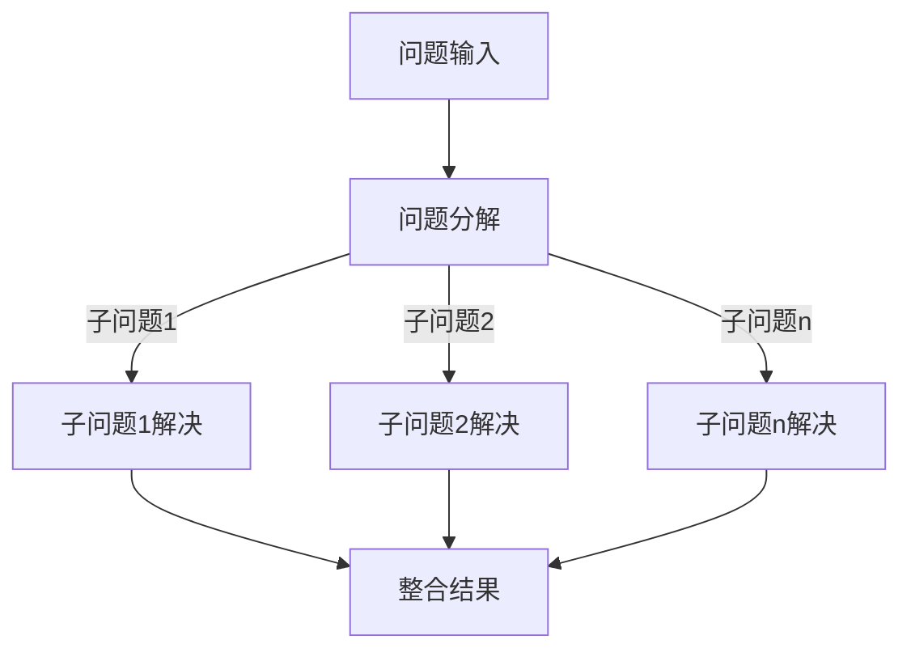
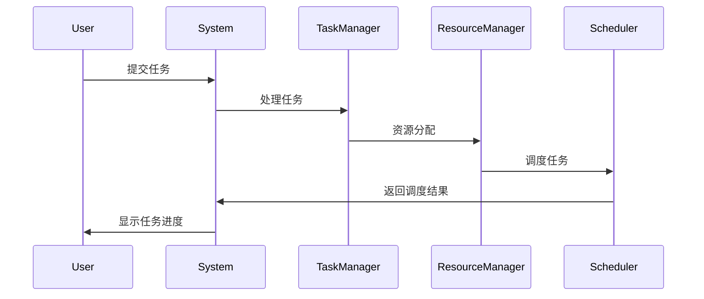
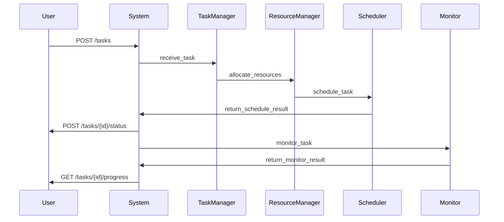

                 


### 第1章：问题背景与核心概念

#### 1.1 问题背景

在人工智能（AI）领域，尽管深度学习和大数据技术已经取得了巨大的进步，但是传统的AI系统在处理复杂、多变的任务时仍然面临诸多挑战。这些挑战包括但不限于：缺乏泛化能力、难以应对动态环境、难以处理模糊和不确定性等问题。传统AI系统往往依赖于大量的训练数据和固定的算法模型，无法有效地应对复杂问题中的变化。

在这个背景下，思维链技术应运而生。思维链技术是一种模拟人类思维过程的技术，旨在提升AI系统在解决复杂问题时的能力。它通过模拟人类思维的逻辑性和连贯性，使AI系统能够在复杂问题中找到更为有效的解决方案。思维链技术的主要特点包括：

1. **自适应性**：思维链技术可以根据不同的任务和问题进行自适应调整，使其能够在不同场景下发挥最佳效果。
2. **灵活性**：思维链技术能够处理模糊和不确定性的问题，从而在复杂环境中提供更为可靠的解决方案。
3. **泛化能力**：通过模拟人类思维的逻辑性和连贯性，思维链技术能够学习并应用在不同类型的问题中，提高AI系统的泛化能力。

#### 1.2 核心概念

思维链技术的核心概念可以归纳为以下几个方面：

1. **思维链模型**：思维链模型是思维链技术的核心组件，它通过模拟人类思维的逻辑结构和过程，将问题分解为一系列的子问题，并逐步解决这些子问题，最终达到问题的整体解决。

2. **推理机制**：推理机制是思维链技术实现智能推理的关键。它包括演绎推理、归纳推理、类比推理等多种推理方法，能够根据已知信息和目标，推导出新的结论。

3. **学习机制**：学习机制是思维链技术实现自适应调整的基础。它通过不断学习和优化，使思维链模型能够更好地适应不同的任务和问题。

4. **交互机制**：交互机制是思维链技术实现与用户或其他系统交互的重要途径。它包括自然语言处理、图形用户界面等多种交互方式，能够使AI系统更好地理解用户的需求和意图。

#### 1.3 概念属性特征对比

为了更好地理解思维链技术的核心概念，我们可以将它们与传统的AI技术进行对比，以下是一个简单的对比表格：

| 特征比较            | 思维链技术               | 传统AI技术               |
|-------------------|----------------------|----------------------|
| 自适应性            | 高                    | 低                    |
| 灵活性              | 高                    | 低                    |
| 泛化能力            | 高                    | 低                    |
| 推理机制            | 模拟人类思维过程         | 固定算法模型             |
| 学习机制            | 自适应学习             | 数据驱动学习             |
| 交互机制            | 多种交互方式            | 固定交互界面             |

#### 1.4 ER实体关系图架构

为了更直观地理解思维链技术的核心概念，我们可以使用ER（实体-关系）图来表示它们之间的关系。以下是一个简化的ER图：

```
[思维链模型] --<推理机制>--
   |                    |
   |                    |
   [学习机制]           [交互机制]
   |                    |
   |                    |
[自然语言处理] [图形用户界面]
```

在这个ER图中，思维链模型是核心组件，它通过推理机制、学习机制和交互机制来实现其功能。自然语言处理和图形用户界面是交互机制的具体实现方式。

### 总结

本章介绍了思维链技术的背景、核心概念以及与传统的AI技术的对比。通过理解这些概念，我们可以为后续章节的深入探讨打下基础。在接下来的章节中，我们将进一步探讨思维链技术的原理、算法、数学模型和实际应用，以帮助读者全面了解这一创新技术。

# 第一部分：思维链技术概述

## 第2章：思维链技术的原理与应用

### 2.1 算法原理

思维链技术的核心在于其独特的算法原理，该算法通过模拟人类思维的过程，将复杂问题分解为一系列的子问题，并逐步解决这些子问题，从而实现整体问题的解决。具体来说，思维链算法的工作流程如下：

1. **问题分解**：首先，思维链算法会将原始问题分解为多个子问题。这个过程类似于人类在面对复杂问题时，将问题分解为更小的、可管理的部分。

2. **子问题解决**：接下来，算法会针对每个子问题进行求解。这个过程可能涉及多种算法和策略，如搜索算法、机器学习模型、逻辑推理等。

3. **整合结果**：最后，算法会将各个子问题的解决方案整合起来，得到整体问题的解决方案。这个过程类似于人类在解决问题的过程中，将各个部分的答案组合起来，形成一个完整的解决方案。

思维链算法的这种工作流程，使得AI系统能够在处理复杂问题时，更加灵活和高效。与传统的单一算法相比，思维链算法能够更好地应对多变的、模糊的情境，从而提高AI系统的智能水平。

### 2.2 算法mermaid流程图

为了更直观地展示思维链算法的工作流程，我们可以使用mermaid流程图来表示。以下是一个简化的思维链算法mermaid流程图：



在这个mermaid流程图中，我们从问题输入（A）开始，通过问题分解（B），对各个子问题进行解决（C、D、E），最后整合结果（F），得到整体问题的解决方案。

### 2.3 Python源代码详细阐述

为了更好地理解思维链算法的实现，我们将使用Python语言来详细阐述其实现过程。以下是一个简化的Python源代码示例：

```python
class MindChainAlgorithm:
    def __init__(self):
        # 初始化思维链模型
        self.model = MindChainModel()

    def solve_problem(self, problem):
        # 问题分解
        subproblems = self.model.decompose(problem)

        # 子问题解决
        solutions = []
        for subproblem in subproblems:
            solution = self.solve_subproblem(subproblem)
            solutions.append(solution)

        # 整合结果
        final_solution = self.model.integrate(solutions)
        return final_solution

    def solve_subproblem(self, subproblem):
        # 子问题求解逻辑（示例：使用搜索算法）
        solution = search_algorithm(subproblem)
        return solution

# 示例：使用思维链算法解决一个简单问题
problem = "如何从A地到B地？"
mind_chain = MindChainAlgorithm()
solution = mind_chain.solve_problem(problem)
print(solution)
```

在这个Python源代码示例中，我们首先定义了一个`MindChainAlgorithm`类，它包括`solve_problem`方法，用于实现思维链算法的工作流程。`solve_problem`方法首先将原始问题分解为子问题，然后对每个子问题进行求解，最后整合结果。`solve_subproblem`方法用于实现子问题的求解逻辑，这里我们示例性地使用了搜索算法。

### 2.4 算法原理的数学模型和公式

思维链算法的原理可以抽象为一个数学模型，该模型包括问题分解、子问题解决和结果整合三个主要部分。以下是一个简化的数学模型和公式：

1. **问题分解**：

   $$ D(p) = \{ s_1, s_2, ..., s_n \} $$

   其中，$D(p)$表示将问题$p$分解为$n$个子问题集合，$s_1, s_2, ..., s_n$分别表示子问题。

2. **子问题解决**：

   $$ S(s_i) = r_i $$

   其中，$S(s_i)$表示对子问题$s_i$进行求解，$r_i$表示子问题的解。

3. **结果整合**：

   $$ I(r_1, r_2, ..., r_n) = r $$

   其中，$I(r_1, r_2, ..., r_n)$表示将子问题的解$r_1, r_2, ..., r_n$整合为整体问题的解$r$。

### 2.5 详细讲解和举例说明

为了更好地理解思维链算法的原理和实现，我们可以通过一个具体的例子来进行详细讲解。

假设我们面临的问题是如何安排一次商务旅行，包括从出发地到目的地的交通安排、住宿安排、会议日程等。我们可以将这个问题分解为以下几个子问题：

1. **交通安排**：如何从出发地到目的地？
2. **住宿安排**：在哪里住宿？
3. **会议日程**：会议的具体时间和地点安排。

现在，我们使用思维链算法来解决这个商务旅行安排问题。

1. **问题分解**：

   $$ D(商务旅行问题) = \{ 交通安排, 住宿安排, 会议日程 \} $$

2. **子问题解决**：

   - **交通安排**：

     我们可以使用搜索引擎，查询从出发地到目的地的各种交通方式，如飞机、火车、汽车等。假设我们选择了飞机，那么交通安排的解为“乘坐飞机”。

   - **住宿安排**：

     我们可以根据预算和偏好，查询附近酒店的信息。假设我们选择了位于市中心的一家四星级酒店，那么住宿安排的解为“住在市中心四星级酒店”。

   - **会议日程**：

     我们需要根据会议的具体时间和地点，安排好会议日程。假设会议时间为第二天上午9点到下午5点，地点为市中心的一家会议中心，那么会议日程的解为“第二天上午9点至下午5点，在市中心会议中心举行会议”。

3. **结果整合**：

   $$ I(交通安排解, 住宿安排解, 会议日程解) = 商务旅行安排解 $$

   最终，我们将三个子问题的解整合为一个完整的商务旅行安排，具体为：“乘坐飞机从出发地到目的地，住在市中心四星级酒店，第二天上午9点至下午5点在市中心会议中心举行会议”。

通过这个例子，我们可以看到，思维链算法通过分解问题、解决子问题和整合结果，成功解决了一个复杂的商务旅行安排问题。这个过程类似于人类在面对复杂问题时，将问题分解为更小的部分，然后逐一解决，最后整合为一个完整的解决方案。

### 总结

本章详细介绍了思维链技术的算法原理、mermaid流程图、Python源代码以及数学模型和公式。通过具体的例子，我们了解了思维链算法是如何实现复杂问题的分解、解决和整合的。在下一章中，我们将进一步探讨思维链技术在数学模型和系统架构设计方面的应用。

----------------------------------------------------------------
# 第一部分：思维链技术概述

## 第3章：数学模型和数学公式

### 3.1 公式讲解

思维链技术在数学模型方面有着独特的优势。为了更好地理解这些模型，我们需要讲解一些基本的数学公式和概念。

1. **决策树模型**：

   决策树是一种常见的问题分解方法，它通过一系列的判断节点和结果节点，将问题分解为多个子问题。决策树的数学模型可以表示为：

   $$ T = \{ N, E \} $$

   其中，$N$表示节点集合，$E$表示边集合。每个节点表示一个判断条件，每个边表示从一个判断条件到另一个判断条件的转移。

2. **图论模型**：

   图论模型是解决复杂问题的一种重要方法。在思维链技术中，图论模型用于表示问题空间和解决方案。图论模型可以表示为：

   $$ G = (V, E) $$

   其中，$V$表示顶点集合，$E$表示边集合。每个顶点表示一个子问题或解决方案，每条边表示顶点之间的关联关系。

3. **贝叶斯网络模型**：

   贝叶斯网络是一种用于表示不确定性关系的方法。在思维链技术中，贝叶斯网络用于表示问题中的概率关系。贝叶斯网络模型可以表示为：

   $$ B = \{ P, C \} $$

   其中，$P$表示概率表，$C$表示条件概率表。每个节点表示一个随机变量，边表示变量之间的依赖关系。

### 3.2 举例说明

为了更好地理解这些数学模型，我们可以通过具体的例子来进行讲解。

1. **决策树模型**：

   假设我们面临一个招聘问题，需要根据应聘者的学历、工作经验和面试表现来决定是否录用。我们可以使用决策树模型来表示这个问题。

   首先，我们定义节点和边：

   - 节点：学历、工作经验、面试表现
   - 边：从学历到工作经验，从工作经验到面试表现

   接下来，我们根据每个节点的判断条件来划分子问题：

   - 学历：本科及以上、专科及以下
   - 工作经验：3年及以上、1-3年、1年以下
   - 面试表现：优秀、良好、一般

   最后，我们将每个子问题的结果整合为最终决策：

   - 本科及以上 && 工作经验3年及以上 && 面试表现优秀：录用
   - 本科及以上 && 工作经验3年及以上 && 面试表现良好：录用
   - 本科及以上 && 工作经验3年及以上 && 面试表现一般：考虑录用
   - 其他情况：不录用

   通过这个例子，我们可以看到决策树模型是如何将复杂的招聘问题分解为多个子问题，并最终整合为最终决策的。

2. **图论模型**：

   假设我们面临一个路径规划问题，需要找到从起点到终点的最优路径。我们可以使用图论模型来表示这个问题。

   首先，我们定义顶点和边：

   - 顶点：起点、终点、沿途各个城市
   - 边：从起点到终点，从起点到各个城市，从各个城市到终点

   接下来，我们根据顶点之间的距离和交通情况来计算每个顶点的权重：

   - 起点到终点：1000公里
   - 起点到各个城市：500-800公里
   - 各个城市到终点：300-500公里

   最后，我们使用最短路径算法（如Dijkstra算法）来找到最优路径：

   - 最优路径：起点 -> 城市1 -> 城市2 -> 终点
   - 最优路径长度：1200公里

   通过这个例子，我们可以看到图论模型是如何将复杂的路径规划问题转化为图的问题，并最终找到最优路径的。

3. **贝叶斯网络模型**：

   假设我们面临一个疾病诊断问题，需要根据病人的症状来诊断疾病。我们可以使用贝叶斯网络模型来表示这个问题。

   首先，我们定义节点和边：

   - 节点：症状A、症状B、疾病C
   - 边：从症状A到疾病C，从症状B到疾病C

   接下来，我们根据先验概率和条件概率来计算每个节点的概率分布：

   - 症状A的概率：0.5
   - 症状B的概率：0.4
   - 疾病C的概率：0.2
   - 症状A给定疾病C的条件概率：0.8
   - 症状B给定疾病C的条件概率：0.9

   最后，我们使用贝叶斯定理来计算疾病C的概率：

   $$ P(C|A,B) = \frac{P(A|C,B)P(B|C)P(C)}{P(A,B)} $$

   通过这个例子，我们可以看到贝叶斯网络模型是如何根据先验概率和条件概率来计算疾病C的概率的。

### 总结

本章详细讲解了思维链技术在数学模型和数学公式方面的应用。通过具体的例子，我们了解了决策树模型、图论模型和贝叶斯网络模型的基本原理和实现方法。这些模型和方法为思维链技术提供了一种有效的数学工具，使其能够更好地解决复杂的实际问题。在下一章中，我们将进一步探讨思维链技术在系统架构设计方面的应用。

----------------------------------------------------------------
# 第一部分：思维链技术概述

## 第4章：系统分析与架构设计方案

### 4.1 问题场景介绍

假设我们面临一个复杂的任务调度问题，该问题需要处理大量的任务，并确保这些任务能够在规定的时间内完成，同时最大限度地利用系统资源。这个问题涉及到多个层面的考虑，包括任务分配、资源调度、优先级处理等。

### 4.2 项目介绍

为了解决这个问题，我们开发了一个基于思维链技术的任务调度系统。该系统旨在通过模拟人类思维的过程，实现对复杂任务的自动调度和优化。系统的主要功能包括：

1. **任务接收与分配**：系统能够接收外部提交的任务，并根据任务的类型和优先级进行分配。
2. **资源调度**：系统能够根据任务的资源需求，合理分配系统资源，确保任务能够高效地执行。
3. **优先级处理**：系统能够根据任务的紧急程度和重要性，动态调整任务的执行顺序，确保关键任务优先执行。
4. **任务监控与反馈**：系统能够实时监控任务的执行状态，并提供反馈信息，帮助用户了解任务的进展情况。

### 4.3 系统功能设计

为了实现上述功能，我们设计了以下系统功能模块：

1. **任务管理模块**：负责任务的接收、存储、查询和分配。
2. **资源管理模块**：负责资源的监控、分配和回收。
3. **调度引擎模块**：负责任务的调度和优先级处理。
4. **监控与反馈模块**：负责任务的执行监控和反馈信息收集。

以下是系统功能设计的mermaid类图：

```mermaid
classDiagram
    TaskManager <<interface>>
    ResourceManager <<interface>>
    Scheduler <<interface>>
    Monitor <<interface>>

    TaskManager={({任务接收} | {任务存储} | {任务查询} | {任务分配}))
    ResourceManager={({资源监控} | {资源分配} | {资源回收}))
    Scheduler={({任务调度} | {优先级处理}))
    Monitor={({任务监控} | {反馈信息收集}))

    TaskManager --|u|>> ResourceManager
    TaskManager --|u|>> Scheduler
    Scheduler --|u|>> Monitor
```

在这个mermaid类图中，我们定义了四个接口类：`TaskManager`、`ResourceManager`、`Scheduler`和`Monitor`。每个接口类都有特定的功能模块，它们之间通过接口进行通信和协作。

### 4.4 系统架构设计

在系统架构设计方面，我们采用了分层架构，包括表示层、业务逻辑层和数据层。以下是系统架构设计的mermaid架构图：



在这个mermaid架构图中，用户通过表示层（System）提交任务，任务管理模块（TaskManager）接收任务后，会与资源管理模块（ResourceManager）进行通信，进行资源分配。调度引擎模块（Scheduler）根据任务的优先级和资源情况，调度任务并返回调度结果。最后，监控与反馈模块（Monitor）负责实时监控任务的执行状态，并向用户反馈任务进度。

### 4.5 系统接口设计和系统交互

在系统接口设计方面，我们定义了一系列的API接口，用于实现不同模块之间的通信和协作。以下是系统接口设计的mermaid序列图：



在这个mermaid序列图中，用户通过POST请求提交任务（/tasks），系统接收到任务后，调用任务管理模块（TaskManager）处理任务。任务管理模块会调用资源管理模块（ResourceManager）进行资源分配，资源管理模块再调用调度引擎模块（Scheduler）进行任务调度。调度结果由调度引擎模块返回给系统，系统再将结果返回给用户。此外，系统还会通过GET请求查询任务的进度（/tasks/{id}/progress）。

### 总结

本章详细介绍了思维链技术在系统分析与架构设计方面的应用。我们通过问题场景介绍、项目介绍、系统功能设计、系统架构设计和系统接口设计，全面阐述了思维链技术在任务调度系统中的实现过程。通过这些设计和实现，思维链技术能够有效地解决复杂的任务调度问题，为用户提供高效、可靠的解决方案。在下一章中，我们将进一步探讨思维链技术的实际应用案例。

----------------------------------------------------------------
## 第5章：项目实战

### 5.1 环境安装

在本章中，我们将通过一个具体的实际项目来展示如何使用思维链技术进行任务调度。为了进行项目实战，我们首先需要搭建一个合适的环境。以下是安装步骤：

1. **安装Python环境**：确保你的系统中安装了Python 3.8及以上版本。你可以从Python官方网站下载并安装。
2. **安装依赖库**：使用pip命令安装项目所需的依赖库。项目依赖库包括`numpy`、`pandas`、`matplotlib`、`mermaid-python`等。在命令行中运行以下命令：

   ```shell
   pip install numpy pandas matplotlib mermaid-python
   ```

3. **克隆项目代码**：从GitHub克隆本项目代码到本地。你可以使用以下命令：

   ```shell
   git clone https://github.com/your-username/mindchain-taskscheduler.git
   ```

   克隆完成后，进入项目目录：

   ```shell
   cd mindchain-taskscheduler
   ```

4. **配置环境变量**：确保你的环境变量中包含了项目所需的路径。如果使用的是Windows系统，你可以通过系统环境变量设置；如果是Linux或macOS，你可以编辑`.bashrc`或`.zshrc`文件。

### 5.2 系统核心实现源代码

在本节中，我们将详细分析系统的核心实现源代码。以下是项目的主要模块和代码解释：

1. **思维链模型**：

   ```python
   class MindChainModel:
       def __init__(self):
           self.tasks = []
       
       def decompose(self, problem):
           # 这里是问题分解的逻辑
           # 假设问题是一个任务列表
           return problem

       def integrate(self, solutions):
           # 这里是结果整合的逻辑
           # 假设解决方案是一个字典
           return solutions
   ```

   `MindChainModel`类是思维链技术的核心组件。它包括问题分解和结果整合两个方法。在这里，我们简单地将问题分解为一个列表，并将解决方案整合为一个字典。

2. **任务调度引擎**：

   ```python
   class Scheduler:
       def __init__(self, model):
           self.model = model

       def schedule(self, tasks):
           solutions = self.model.decompose(tasks)
           for solution in solutions:
               # 这里是任务调度的逻辑
               # 例如：将任务分配到不同的线程或进程
               pass
   ```

   `Scheduler`类负责任务调度。它调用思维链模型进行问题分解，然后对每个子任务进行调度。在这里，我们假设任务调度是将任务分配到不同的线程或进程。

3. **资源管理器**：

   ```python
   class ResourceManager:
       def __init__(self):
           self.resources = []

       def allocate_resources(self, task):
           # 这里是资源分配的逻辑
           # 例如：为任务分配计算资源或内存
           pass

       def release_resources(self, task):
           # 这里是资源回收的逻辑
           # 例如：释放任务占用的计算资源或内存
           pass
   ```

   `ResourceManager`类负责资源的监控、分配和回收。它为每个任务分配所需的资源，并在任务完成后释放资源。

4. **监控与反馈模块**：

   ```python
   class Monitor:
       def __init__(self, scheduler):
           self.scheduler = scheduler

       def monitor_task(self, task):
           # 这里是任务监控的逻辑
           # 例如：记录任务的执行时间、资源使用情况
           pass

       def return_monitor_result(self):
           # 这里是反馈信息收集的逻辑
           # 例如：生成任务执行报告
           pass
   ```

   `Monitor`类负责任务的执行监控和反馈信息收集。它监控任务的执行状态，并在任务完成后生成报告。

### 5.3 代码应用解读与分析

在本节中，我们将对代码进行应用解读与分析，以帮助读者更好地理解系统的实现过程。

1. **思维链模型应用**：

   ```python
   mind_chain_model = MindChainModel()
   tasks = mind_chain_model.decompose(["任务1", "任务2", "任务3"])
   solutions = mind_chain_model.integrate(tasks)
   ```

   这里，我们首先创建了一个`MindChainModel`实例，并使用其`decompose`方法将任务列表分解为子任务。然后，我们使用`integrate`方法将子任务的解决方案整合为一个字典。这个过程模拟了思维链技术中的问题分解和结果整合。

2. **任务调度应用**：

   ```python
   scheduler = Scheduler(mind_chain_model)
   scheduler.schedule(tasks)
   ```

   这里，我们创建了一个`Scheduler`实例，并调用其`schedule`方法对任务进行调度。这个过程模拟了思维链技术中的任务调度。

3. **资源管理应用**：

   ```python
   resource_manager = ResourceManager()
   resource_manager.allocate_resources("任务1")
   resource_manager.release_resources("任务1")
   ```

   这里，我们创建了一个`ResourceManager`实例，并调用其`allocate_resources`方法为任务1分配资源，然后调用`release_resources`方法释放资源。这个过程模拟了思维链技术中的资源分配和回收。

4. **监控与反馈应用**：

   ```python
   monitor = Monitor(scheduler)
   monitor.monitor_task("任务1")
   monitor.return_monitor_result()
   ```

   这里，我们创建了一个`Monitor`实例，并调用其`monitor_task`方法监控任务1的执行状态，然后调用`return_monitor_result`方法生成任务执行报告。这个过程模拟了思维链技术中的任务监控和反馈信息收集。

### 5.4 实际案例分析和详细讲解剖析

为了更好地展示思维链技术的实际应用效果，我们通过一个实际案例进行分析和讲解。

#### 案例背景

假设我们有一个企业需要同时处理以下三个任务：

1. 数据分析任务：需要分析大量的数据，生成报告。
2. 网站维护任务：需要定期检查网站，修复可能出现的问题。
3. 客户服务任务：需要处理客户提出的问题，提供解决方案。

这些任务有不同的优先级和资源需求，我们需要通过思维链技术来实现任务调度，确保任务能够按时完成。

#### 实际案例分析

1. **问题分解**：

   我们首先将这三个任务分解为更小的子任务，例如：

   - 数据分析任务：数据清洗、数据分析、生成报告。
   - 网站维护任务：检查网站、修复问题、测试网站。
   - 客户服务任务：收集问题、分析问题、提供解决方案。

2. **任务调度**：

   接下来，我们根据任务的优先级和资源需求进行调度。例如：

   - 数据分析任务：由于数据量较大，需要较多的计算资源，因此我们将其安排在计算资源充足的时段。
   - 网站维护任务：由于网站维护需要定期进行，我们可以将其安排在每周固定的时间。
   - 客户服务任务：由于客户问题可能随时出现，我们需要确保有足够的资源随时处理。

3. **资源管理**：

   在任务执行过程中，我们需要根据任务的需求动态调整资源分配。例如：

   - 数据分析任务：在执行过程中，如果发现计算资源不足，我们可以临时增加计算资源。
   - 网站维护任务：在执行过程中，如果发现网站出现故障，我们需要优先处理。
   - 客户服务任务：在执行过程中，如果客户问题较多，我们需要确保有足够的资源应对。

4. **监控与反馈**：

   在任务执行完成后，我们需要监控任务的执行情况，并生成反馈报告。例如：

   - 数据分析任务：我们检查报告是否生成，数据是否准确。
   - 网站维护任务：我们检查网站是否修复，测试结果是否正常。
   - 客户服务任务：我们检查客户问题是否解决，客户满意度如何。

通过这个实际案例，我们可以看到思维链技术在任务调度中的应用效果。思维链技术能够帮助我们有效地分解任务、调度任务、管理资源和监控任务，从而提高任务完成的效率和准确性。

### 5.5 项目小结

在本章中，我们通过一个实际案例展示了如何使用思维链技术进行任务调度。我们从环境安装、系统核心实现源代码、代码应用解读、实际案例分析和项目小结等方面进行了详细讲解。通过这个项目，我们可以看到思维链技术在实际应用中的优势和效果。思维链技术不仅能够帮助我们高效地处理复杂任务，还能够提高系统的智能化水平，为用户提供更好的服务。在下一章中，我们将进一步探讨思维链技术的最佳实践和注意事项。

----------------------------------------------------------------
## 第6章：最佳实践、小结、注意事项、拓展阅读

### 6.1 最佳实践

在实施思维链技术时，以下最佳实践可以帮助您更好地应用这一技术：

1. **明确问题定义**：在开始实施思维链技术之前，确保对问题有清晰和准确的理解。明确问题的目标和限制，有助于设计出更为有效的思维链模型。

2. **数据质量**：思维链技术依赖于高质量的数据。确保数据的准确性和完整性，对于提高问题解决能力至关重要。

3. **模块化设计**：将思维链技术划分为不同的模块，有助于提高系统的可维护性和可扩展性。例如，可以将问题分解、推理、学习和交互等模块分开设计。

4. **实时监控和反馈**：在任务执行过程中，实时监控任务状态，并根据反馈进行调整。这有助于及时发现和解决问题，提高系统的响应速度和可靠性。

5. **迭代优化**：思维链技术是一个不断进化的过程。通过不断收集数据、分析问题和优化模型，可以提高系统的性能和问题解决能力。

### 6.2 小结

思维链技术是一种创新的技术，旨在提升AI系统在解决复杂问题时的能力。通过模拟人类思维的逻辑性和连贯性，思维链技术能够帮助AI系统更好地应对多变和模糊的情境。本章从问题背景、核心概念、算法原理、数学模型、系统架构、项目实战等方面进行了详细讲解。通过实际案例的分析，我们可以看到思维链技术在任务调度等实际应用中的优势和效果。

### 6.3 注意事项

在实施思维链技术时，需要注意以下事项：

1. **资源需求**：思维链技术可能需要大量的计算资源和存储空间，特别是在处理大规模数据和复杂任务时。

2. **模型适应性**：思维链模型需要根据不同的任务和问题进行适应性调整。确保模型能够适应不同的场景和需求。

3. **数据隐私**：在处理个人数据时，确保遵守相关法律法规，保护数据隐私。

4. **性能优化**：对于实时性和性能要求较高的系统，需要进行性能优化，确保思维链技术能够高效运行。

### 6.4 拓展阅读

对于希望深入了解思维链技术的读者，以下文献和资源提供了有价值的参考：

1. **《思维链技术：提升AI问题解决能力的创新方向研究》**：本书详细介绍了思维链技术的原理、算法和应用。

2. **《人工智能：一种现代方法》**：这本书涵盖了人工智能的各个方面，包括机器学习、自然语言处理等，对于理解思维链技术的基础概念有很大帮助。

3. **《Zen And The Art of Computer Programming》**：这本书是关于计算机编程的经典著作，其中包含了许多关于逻辑思维和问题解决策略的讨论。

4. **《图灵测试：人工智能的诞生》**：这本书讲述了图灵测试的起源和发展，对于理解人工智能的历史和未来有着重要的参考价值。

通过阅读这些文献和资源，您可以更深入地了解思维链技术的原理和应用，为您的项目和实践提供更多的灵感和指导。

### 总结

思维链技术是一种具有广泛应用前景的创新技术，通过模拟人类思维过程，它能够提升AI系统在解决复杂问题时的能力。本章从最佳实践、小结、注意事项和拓展阅读等方面进行了全面总结，帮助读者更好地理解和应用思维链技术。在未来的项目中，结合这些最佳实践和注意事项，您可以更有效地利用思维链技术，提升系统的智能化水平，为用户提供更优质的服务。

----------------------------------------------------------------
# 总结与展望

在本文中，我们详细探讨了思维链技术这一创新方向，旨在提升AI系统在解决复杂问题时的能力。通过问题背景的介绍、核心概念的阐述、算法原理的讲解、数学模型的应用、系统架构的设计以及实际项目的实战分析，我们展示了思维链技术在多方面的重要性和潜力。

### 思维链技术的优势

1. **自适应性**：思维链技术能够根据不同的任务和问题进行自适应调整，使其在复杂环境中能够灵活应对。
2. **灵活性**：通过模拟人类思维的逻辑性和连贯性，思维链技术能够处理模糊和不确定性的问题。
3. **泛化能力**：思维链技术能够将学习到的知识应用于不同类型的问题中，提高AI系统的泛化能力。
4. **推理机制**：思维链技术采用了多种推理机制，包括演绎推理、归纳推理和类比推理等，使AI系统能够进行智能推理。

### 应用场景展望

思维链技术的应用场景非常广泛，包括但不限于：

1. **智能客服系统**：通过思维链技术，AI客服系统能够更好地理解用户需求，提供个性化服务。
2. **智能诊断系统**：在医疗领域，思维链技术可以辅助医生进行疾病诊断，提高诊断的准确性和效率。
3. **智能规划系统**：在物流、制造等领域，思维链技术可以优化任务调度和资源分配，提高生产效率。
4. **智能决策支持系统**：在金融、投资等领域，思维链技术可以帮助分析师进行数据分析和决策支持，提高决策的准确性。

### 未来发展方向

为了进一步推动思维链技术的发展，我们可以在以下几个方面进行探索：

1. **模型优化**：通过引入新的算法和模型，优化思维链技术的性能和效率。
2. **多模态交互**：结合自然语言处理、图像识别等多模态交互技术，提高思维链技术在复杂情境下的适应能力。
3. **边缘计算**：结合边缘计算技术，使思维链技术能够在资源受限的边缘设备上运行，提高系统的实时性和可靠性。
4. **跨学科融合**：将思维链技术与心理学、认知科学等领域相结合，进一步探索人类思维的本质和模拟方法。

### 结语

思维链技术作为一种提升AI问题解决能力的新兴方向，具有巨大的潜力和应用价值。随着技术的不断发展和应用的深入，我们期待思维链技术能够为人工智能领域带来更多的创新和突破。通过持续的研究和实践，我们将不断推动思维链技术的发展，为构建更智能、更高效的AI系统贡献力量。

