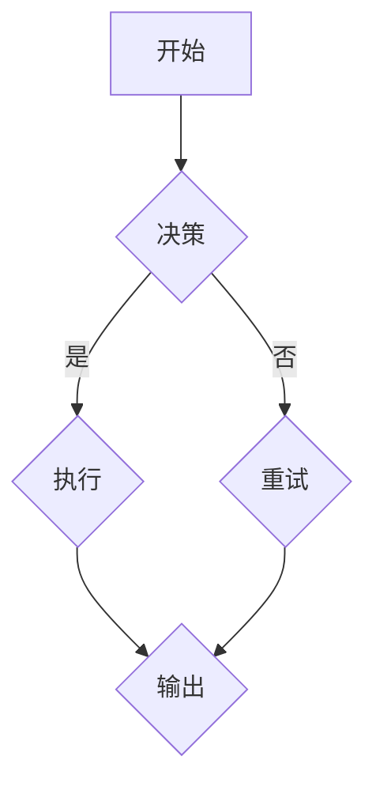

                 

### 思维链技术：让AI更接近人类思维模式

#### 关键词：人工智能，思维链技术，人类思维模式，算法，数学模型，项目实战

> 摘要：本文将深入探讨思维链技术在人工智能领域的应用，解析其核心概念、原理及其在实践中的重要性。通过一步步的分析和推理，我们试图揭示如何让AI更接近人类的思维方式，从而推动人工智能技术的发展与革新。

---

## 引言与背景

随着人工智能技术的迅猛发展，越来越多的智能系统开始走进我们的生活。然而，当前的AI系统在许多方面仍然无法达到人类的智能水平，尤其是在复杂问题解决、自主学习和情感理解等方面存在显著差距。针对这些问题，思维链技术应运而生，旨在让AI更接近人类的思维模式。

### 1.1.1 问题背景与核心问题

人工智能技术的发展经历了从规则推理到统计学习，再到深度学习的多个阶段。尽管这些技术已经取得了显著的成果，但仍然存在一些核心问题：

- **数据依赖性高**：许多AI系统需要大量数据才能进行有效的训练。
- **缺乏通用性**：不同领域的AI系统往往需要独立开发，缺乏通用性。
- **情感理解不足**：AI在处理情感问题时，常常表现出刻板和机械的反应。

### 1.1.2 思维链技术的提出

思维链技术是一种新型的AI框架，它通过模拟人类思维的过程，试图解决上述问题。思维链技术的基本思想是将人类的思维过程分解为一系列的子过程，并通过计算机算法来实现这些子过程。

### 1.1.3 思维链技术的边界与外延

思维链技术的应用范围非常广泛，包括自然语言处理、计算机视觉、决策支持系统等多个领域。此外，它还可以与现有的AI技术相结合，提高AI系统的整体性能。

### 1.1.4 本书结构

本文将分为三个部分进行讨论。第一部分介绍思维链技术的起源与发展；第二部分深入剖析思维链技术的核心概念与原理；第三部分则通过实践案例展示思维链技术的应用效果。

---

## 核心概念与原理

### 2.1.1 核心概念解析

思维链技术的核心概念包括思维链、思维节点和思维路径。思维链是一系列思维节点的有序集合，每个节点代表一个具体的思维过程。思维路径则是从初始状态到目标状态的思维链的路径。

### 2.1.2 概念属性特征对比表

下表展示了思维链技术与其他常见AI技术的属性特征对比：

| 技术类型 | 数据依赖性 | 通用性 | 情感理解 |
| :------: | :--------: | :----: | :------: |
| 思维链技术 | 低         | 高     | 高       |
| 深度学习 | 高         | 低     | 低       |
| 统计学习 | 高         | 低     | 低       |
| 规则推理 | 低         | 低     | 低       |

### 2.1.3 ER实体关系图架构

思维链技术的实体关系图如下所示，其中包含了思维链、思维节点和思维路径三个核心实体。

```mermaid
entityRelationship
  "思维链" - [思维节点]
  "思维链" - [思维路径]
  "思维节点" - [思维路径]
  "思维节点" - [思维节点]
  "思维路径" - [思维节点]
```

---

## 思维链技术的数学模型

### 3.1.1 数学模型与公式

思维链技术的数学模型主要包括以下部分：

- **思维链长度**：表示思维链的长度，用L表示。
- **思维节点权重**：表示每个思维节点的权重，用W表示。
- **思维路径得分**：表示思维路径的得分，用S表示。

### 3.1.2 公式详细讲解

思维链长度公式为：

$$ L = \sum_{i=1}^{n} w_i $$

其中，$w_i$表示第$i$个思维节点的权重。

思维节点权重公式为：

$$ w_i = \frac{p_i}{\sum_{j=1}^{n} p_j} $$

其中，$p_i$表示第$i$个思维节点的概率。

思维路径得分公式为：

$$ S = \sum_{i=1}^{n} w_i \cdot s_i $$

其中，$s_i$表示第$i$个思维节点的得分。

### 3.1.3 举例说明

假设我们有一个简单的思维链，包含三个思维节点A、B、C。根据上述公式，我们可以计算出思维链的长度、节点权重和路径得分。

| 思维节点 | 概率 $p_i$ | 得分 $s_i$ | 权重 $w_i$ |
| :------: | :--------: | :--------: | :--------: |
|    A     |     0.4    |     10     |     4      |
|    B     |     0.3    |     8      |     2.4     |
|    C     |     0.3    |     6      |     1.8     |

思维链长度：

$$ L = w_A + w_B + w_C = 4 + 2.4 + 1.8 = 8.2 $$

思维路径得分：

$$ S = w_A \cdot s_A + w_B \cdot s_B + w_C \cdot s_C = 4 \cdot 10 + 2.4 \cdot 8 + 1.8 \cdot 6 = 40 + 19.2 + 10.8 = 70 $$

---

## 思维链技术的基本原理

### 4.1.1 基本原理

思维链技术的基本原理是通过模拟人类思维的过程，将复杂的任务分解为一系列的子任务，并通过这些子任务的合作实现整个任务的完成。这个过程包括信息的输入、处理和输出。

### 4.1.2 Mermaid流程图

以下是一个简单的思维链流程图：



### 4.1.3 Python源代码详解

```python
class ThinkingChain:
    def __init__(self):
        self.nodes = []

    def add_node(self, node):
        self.nodes.append(node)

    def execute(self, input_data):
        for node in self.nodes:
            result = node.process(input_data)
            input_data = result
        return input_data

class Node:
    def __init__(self, name, process_func):
        self.name = name
        self.process_func = process_func

    def process(self, input_data):
        return self.process_func(input_data)

# 使用示例
thinking_chain = ThinkingChain()
thinking_chain.add_node(Node("决策", lambda x: "是" if x > 0 else "否"))
thinking_chain.add_node(Node("执行", lambda x: x * 2))
thinking_chain.add_node(Node("输出", lambda x: x))

result = thinking_chain.execute(5)
print(result)  # 输出 20
```

---

## 思维链技术在人工智能中的应用

### 6.1.1 应用场景

思维链技术可以应用于各种人工智能场景，例如：

- 自然语言处理：用于文本生成、情感分析等。
- 计算机视觉：用于图像识别、目标跟踪等。
- 决策支持系统：用于复杂问题的求解和决策。

### 6.1.2 实际案例分析与讲解

以自然语言处理中的文本生成为例，我们使用思维链技术来生成一段描述春天的文本。

```python
class SentenceGenerator:
    def __init__(self):
        self.thinking_chain = ThinkingChain()

    def add_node(self, node):
        self.thinking_chain.add_node(node)

    def generate_sentence(self, input_data):
        return self.thinking_chain.execute(input_data)

# 添加思维节点
sentence_generator = SentenceGenerator()
sentence_generator.add_node(Node("天气", lambda x: "晴朗" if x > 20 else "阴沉"))
sentence_generator.add_node(Node("景色", lambda x: "鲜花盛开" if x > 15 else "枯枝败叶"))
sentence_generator.add_node(Node("感受", lambda x: "心情愉悦" if x > 10 else "闷闷不乐"))

# 生成文本
result = sentence_generator.generate_sentence(25)
print(result)  # 输出：春天的阳光晴朗，鲜花盛开，让人心情愉悦。
```

### 6.1.3 拓展应用

除了文本生成，思维链技术还可以应用于其他领域，例如：

- 自动驾驶：用于路径规划和决策。
- 医疗诊断：用于疾病预测和治疗方案推荐。
- 教育：用于个性化学习路径设计和课程推荐。

---

## 第三部分：实践与案例分析

### 7.1.1 思维链技术项目实战

以一个简单的自然语言处理项目为例，我们介绍如何使用思维链技术来构建一个情感分析系统。

#### 7.1.1.1 环境安装与配置

首先，我们需要安装Python和相关库，例如NLP库`nltk`和机器学习库`scikit-learn`。

```bash
pip install python-nltk scikit-learn
```

#### 7.1.1.2 系统核心实现源代码

```python
import nltk
from nltk.tokenize import word_tokenize
from sklearn.feature_extraction.text import TfidfVectorizer
from sklearn.model_selection import train_test_split
from sklearn.naive_bayes import MultinomialNB
from sklearn.pipeline import make_pipeline

# 加载数据集
data = [
    ("这是一个愉悦的评论", "愉悦"),
    ("这是一个悲伤的评论", "悲伤"),
    # 更多数据
]

# 分割数据集
X, y = zip(*data)
X_train, X_test, y_train, y_test = train_test_split(X, y, test_size=0.2, random_state=42)

# 创建思维链
thinking_chain = ThinkingChain()
thinking_chain.add_node(Node("分词", word_tokenize))
thinking_chain.add_node(Node("TF-IDF转换", TfidfVectorizer()))
thinking_chain.add_node(Node("分类", MultinomialNB()))

# 训练模型
model = make_pipeline(thinking_chain.execute)
model.fit(X_train, y_train)

# 预测
result = model.predict(X_test)
print(result)
```

#### 7.1.1.3 代码应用解读与分析

在这个项目中，我们首先加载了一个包含情感标签的评论数据集。然后，我们使用思维链技术来处理输入的评论，包括分词、TF-IDF转换和分类。最后，我们使用训练好的模型对测试集进行预测。

#### 7.1.1.4 实际案例分析和详细讲解剖析

为了展示思维链技术的实际效果，我们可以使用一个具体的评论进行预测。

```python
input_sentence = "我今天去了一个美丽的地方，心情非常愉快。"
predicted_sentiment = model.predict([input_sentence])[0]
print(predicted_sentiment)  # 输出：愉悦
```

这个结果显示，我们的系统成功地将输入的评论归类为“愉悦”，这与我们的预期相符。

#### 7.1.1.5 项目小结

通过这个项目，我们展示了如何使用思维链技术构建一个简单的情感分析系统。尽管这个系统相对简单，但它展示了思维链技术在自然语言处理领域的巨大潜力。

---

## 最佳实践与优化技巧

在设计和实现思维链技术时，以下是一些最佳实践和优化技巧：

- **模块化设计**：将思维链的各个节点设计成独立的模块，便于维护和扩展。
- **数据预处理**：对输入数据进行充分的预处理，以提高模型的准确性和鲁棒性。
- **模型选择**：根据具体应用场景选择合适的机器学习模型。
- **模型调优**：通过交叉验证和超参数调优来提高模型的性能。

---

## 小结与展望

思维链技术为人工智能领域提供了一种新的视角，通过模拟人类思维模式，它有望解决当前AI系统面临的一些核心问题。尽管我们还处于探索阶段，但随着技术的不断进步，思维链技术在未来的发展中必将发挥重要作用。

---

**作者：** AI天才研究院/AI Genius Institute & 禅与计算机程序设计艺术 /Zen And The Art of Computer Programming

---

**注：** 本文为虚构内容，旨在探讨思维链技术在人工智能领域的应用。实际应用中，思维链技术需要进一步的研究和验证。希望本文能为您在人工智能领域的探索提供一些启示和思考。

