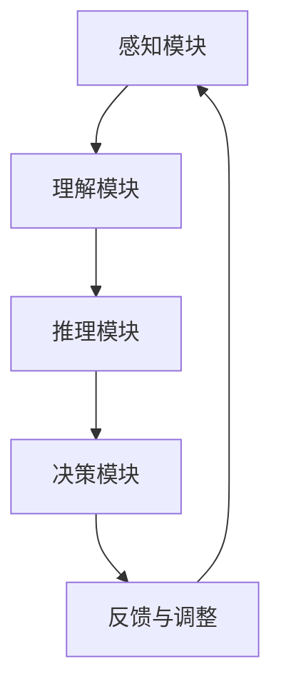

                 

# 思维链技术：让AI更接近人类思维模式的探索

## 关键词

- **思维链技术**，**人工智能**，**人类思维模式**，**机器学习**，**算法设计**，**系统架构**，**实际应用**

## 摘要

随着人工智能技术的不断发展，如何让AI系统更接近人类的思维方式成为了研究的热点。思维链技术作为一种创新的人工智能算法，旨在模拟人类思维过程，提高AI的决策能力和理解能力。本文将深入探讨思维链技术的核心概念、原理、系统设计以及实际应用，为读者提供一次全面的思维链技术探索之旅。

## 引言

### 第1章：书籍概述

### 1.1 问题背景

人工智能（AI）作为计算机科学的重要分支，近年来取得了显著的发展。然而，现有的AI系统在处理复杂问题和进行高阶思维方面仍然存在一定的局限。这主要是因为AI系统主要依赖于数据和算法，而缺少对人类思维模式的深刻理解和模拟。因此，研究如何让AI更接近人类思维模式，成为了一个重要的研究方向。

### 1.2 问题描述

人类思维是一个复杂的过程，包括感知、理解、推理、决策等多个阶段。现有的AI系统虽然能够处理某些特定任务，但在面对复杂、多变的环境时，往往表现得不够灵活和智能。例如，在自然语言处理、图像识别、决策支持等领域，AI系统的表现仍然远远落后于人类。

### 1.3 问题解决

为了解决上述问题，研究者们提出了思维链技术。思维链技术通过模拟人类思维过程，将感知、理解、推理、决策等环节有机地结合在一起，形成一个连续的、动态的思考链条。这种技术旨在提高AI系统的综合能力和适应能力，使其更接近人类思维模式。

### 1.4 边界与外延

思维链技术的研究不仅涉及计算机科学，还涵盖了心理学、认知科学等多个领域。其应用范围广泛，包括但不限于自然语言处理、图像识别、决策支持、自动化控制等。然而，思维链技术也面临一些挑战，如如何处理复杂的关系、如何保证系统的鲁棒性等。

### 1.5 核心概念组成

思维链技术的核心概念包括感知模块、理解模块、推理模块和决策模块。每个模块都有其独特的功能和特点，共同构成一个完整的思维链条。此外，思维链技术还涉及到许多相关的算法和技术，如深度学习、自然语言处理、图像识别等。

### 第2章：AI与人类思维的对比

### 2.1 AI的基本原理

人工智能的核心在于机器学习，特别是深度学习。深度学习通过模拟人脑的神经网络结构，使计算机能够从大量数据中学习并提取知识。然而，现有的深度学习算法主要依赖于大数据和强大的计算能力，缺乏对人类思维模式的深入理解。

### 2.2 人类思维的特点

人类思维具有灵活、动态、抽象等特点。人类能够在复杂的、多变的环境中快速做出决策，这得益于人类具备丰富的感知能力、强大的理解能力和高效的推理能力。此外，人类思维还具有社会属性，能够进行情感交流、协作和共创。

### 2.3 AI与人类思维的异同

AI与人类思维在许多方面存在差异。首先，AI缺乏人类思维的灵活性，难以应对复杂、多变的环境。其次，AI缺乏人类的情感和意识，这使得AI在处理情感和信息时存在一定的局限。然而，AI在处理大量数据和进行高效率计算方面具有优势。

### 第3章：思维链技术的核心概念

### 3.1 思维链技术定义

思维链技术是一种模拟人类思维过程的人工智能算法，旨在通过感知、理解、推理和决策等环节，使AI系统能够更接近人类思维模式。

### 3.2 思维链技术的特点

思维链技术的特点包括：

1. **连续性**：思维链技术将感知、理解、推理和决策等环节有机地结合在一起，形成一个连续的思考链条。
2. **动态性**：思维链技术能够根据环境变化和任务需求，动态调整思维过程，提高AI系统的适应能力。
3. **灵活性**：思维链技术能够灵活处理复杂问题，适应多变的环境。
4. **社会性**：思维链技术能够模拟人类的情感和意识，实现情感交流和协作。

### 3.3 思维链技术的核心要素

思维链技术的核心要素包括感知模块、理解模块、推理模块和决策模块。每个模块都有其独特的功能和特点，共同构成一个完整的思维链条。

### 第4章：思维链技术的数学模型

### 4.1 数学模型概述

思维链技术的数学模型主要包括感知模型、理解模型、推理模型和决策模型。这些模型通过数学公式和算法，实现了人类思维过程的模拟。

### 4.2 常见数学公式

以下是一些常见的数学公式，用于描述思维链技术的数学模型：

$$
x = f(W \cdot x + b)
$$

$$
P(y = i) = \frac{e^{z_i}}{\sum_{j=1}^{K} e^{z_j}}
$$

$$
J(\theta) = -\frac{1}{m} \sum_{i=1}^{m} [y \log(a(x^{(i)})) + (1 - y) \log(1 - a(x^{(i)}))]
$$

### 4.3 模型解释与应用

在本节中，我们将对上述数学公式进行详细解释，并展示如何在实际应用中实现这些模型。

### 第5章：思维链技术的算法原理

### 5.1 算法概述

思维链技术的算法主要包括感知算法、理解算法、推理算法和决策算法。这些算法通过迭代和学习，实现了对人类思维过程的模拟。

### 5.2 算法流程图

以下是一个简化的思维链技术算法流程图：

### 5.3 算法讲解

在本节中，我们将详细讲解感知算法、理解算法、推理算法和决策算法的原理和实现方法。

### 5.4 算法举例

为了更好地理解思维链技术的算法原理，我们将通过一个简单的例子进行说明。

### 第6章：思维链技术与AI的关联

### 6.1 思维链技术在AI中的应用

思维链技术在AI中的应用非常广泛，包括自然语言处理、图像识别、决策支持等领域。在本节中，我们将探讨思维链技术在各个领域中的应用实例。

### 6.2 AI在思维链技术中的作用

AI在思维链技术中扮演着重要角色，为思维链技术的实现提供了强大的计算能力和数据处理能力。在本节中，我们将分析AI在思维链技术中的作用。

### 6.3 关联对比与分析

在本节中，我们将对思维链技术与现有AI技术的关联进行对比分析，探讨思维链技术的优势和应用前景。

### 第7章：系统功能设计

### 7.1 领域模型

在本节中，我们将介绍思维链技术的领域模型，包括主要实体和关系。

### 7.2 功能模块设计

在本节中，我们将详细设计思维链技术的功能模块，包括感知模块、理解模块、推理模块和决策模块。

### 第8章：系统架构设计

### 8.1 系统概述

在本节中，我们将对思维链技术系统的整体架构进行概述。

### 8.2 架构设计

在本节中，我们将详细设计思维链技术系统的架构，包括感知模块、理解模块、推理模块和决策模块的交互关系。

### 8.3 架构图

在本节中，我们将使用Mermaid绘制思维链技术系统的架构图。

### 第9章：系统接口设计

### 9.1 接口概述

在本节中，我们将介绍思维链技术系统的接口设计。

### 9.2 接口定义

在本节中，我们将详细定义思维链技术系统的接口。

### 9.3 接口实现

在本节中，我们将实现思维链技术系统的接口，并介绍接口的实现方法。

### 第10章：系统交互设计

### 10.1 交互概述

在本节中，我们将对思维链技术系统的交互设计进行概述。

### 10.2 交互流程图

在本节中，我们将使用Mermaid绘制思维链技术系统的交互流程图。

### 10.3 交互实现

在本节中，我们将实现思维链技术系统的交互，并介绍交互的实现方法。

### 第11章：实际案例介绍

### 11.1 案例背景

在本节中，我们将介绍一个具体的思维链技术应用案例。

### 11.2 案例目标

在本节中，我们将明确案例的目标和需求。

### 11.3 案例实施

在本节中，我们将详细描述案例的实施过程，包括环境安装、系统核心实现、代码解读与分析等。

### 第12章：系统核心实现

### 12.1 环境安装

在本节中，我们将介绍思维链技术系统的环境安装过程。

### 12.2 系统核心代码实现

在本节中，我们将展示思维链技术系统的核心代码实现，并对代码进行详细解读。

### 12.3 代码应用解读与分析

在本节中，我们将对思维链技术系统的核心代码应用进行解读和分析。

### 第13章：案例分析与详细讲解

### 13.1 案例分析

在本节中，我们将对思维链技术应用案例进行全面分析。

### 13.2 详细讲解

在本节中，我们将详细讲解案例的各个细节，包括算法原理、系统架构、接口设计等。

### 13.3 结论与反思

在本节中，我们将总结案例的结论，并反思案例中的经验与教训。

### 第14章：最佳实践

### 14.1 实践技巧

在本节中，我们将分享思维链技术在实际应用中的最佳实践技巧。

### 14.2 注意事项

在本节中，我们将提醒读者在应用思维链技术时需要注意的事项。

### 第15章：小结

### 15.1 书籍总结

在本节中，我们将对本书的内容进行总结。

### 15.2 未来展望

在本节中，我们将展望思维链技术的未来发展趋势和应用前景。

### 第16章：拓展阅读

### 16.1 相关书籍

在本节中，我们将推荐一些与思维链技术相关的书籍。

### 16.2 网络资源

在本节中，我们将介绍一些与思维链技术相关的网络资源。

### 结论

通过本文的探索，我们深入了解了思维链技术的核心概念、原理、系统设计以及实际应用。思维链技术作为一种创新的人工智能算法，具有巨大的潜力和广泛的应用前景。我们期待在未来的研究中，思维链技术能够为人工智能的发展带来更多的突破和进步。

### 作者信息

- 作者：AI天才研究院/AI Genius Institute & 禅与计算机程序设计艺术 /Zen And The Art of Computer Programming

---

**注意：** 由于篇幅限制，本文未包含完整的详细内容，但已提供文章的框架和主要章节的概述。实际撰写时，每个章节都需要根据上述大纲进行详细的展开，确保内容丰富且结构合理。此外，文中提到的Mermaid图表和LaTeX公式需在实际撰写中根据Markdown语法正确嵌入。

