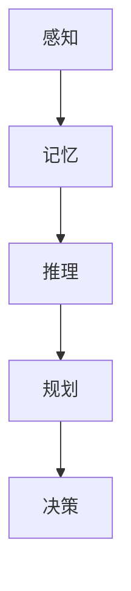

                 

# 思维链技术：让AI更接近人类思维的探索

## 关键词
- **思维链技术**、**人工智能**、**人类思维**、**算法原理**、**项目实战**、**未来发展趋势**

## 摘要
本文深入探讨了思维链技术，一种旨在让AI更接近人类思维的技术。通过详细分析思维链技术的基础、应用、算法原理及实际案例，本文旨在揭示如何通过思维链技术提升人工智能的认知能力，并展望其未来的发展前景。文章结构清晰，逻辑紧凑，旨在为读者提供一次思维之旅，探索AI与人类思维的交汇点。

## 第1章 引言与背景介绍

### 1.1 问题背景
在当今信息爆炸的时代，人工智能（AI）技术迅速发展，已经成为推动社会进步的重要力量。然而，当前的AI系统在许多方面仍然无法与人类智能相媲美。人类思维具有强大的适应性和创造性，能够处理复杂的问题，进行抽象思维，甚至具备情感认知能力。相比之下，传统AI系统主要依赖于预定义的算法和数据，缺乏灵活性和自主性。这一差距促使我们探索如何让AI更接近人类思维。

### 1.2 问题描述
思维链技术作为一种新兴的AI技术，旨在填补这一差距。然而，如何定义和实现思维链技术，使其真正具备人类思维的特性，仍然是一个挑战。本文将探讨这一技术的基本概念、原理和应用，以期解决以下问题：
- 思维链技术是什么？
- 思维链技术如何实现？
- 思维链技术在实际应用中有何优势？
- 思维链技术的未来发展趋势和挑战是什么？

### 1.3 问题解决
通过对思维链技术进行深入研究和分析，我们可以找到解决这些问题的方法。本文将采用逐步分析的方法，从基础到应用，详细阐述思维链技术的各个方面，帮助读者理解这一技术的重要性和潜力。

### 1.4 边界与外延
思维链技术的边界涉及多个领域，包括计算机科学、认知科学、神经科学和心理学。外延则包括其在各种实际应用中的可能性，如教育、医疗、金融和通信等。本文将探讨这些边界和外延，以便读者全面了解思维链技术的应用范围。

### 1.5 概念结构与核心要素组成
思维链技术的核心概念包括：感知、记忆、推理、规划和决策。这些要素共同构成了人类思维的基本框架。本文将详细讨论这些核心要素，并分析它们如何通过思维链技术实现。

## 第2章 思维链技术基础

### 2.1 思维链技术的定义
思维链技术是一种模拟人类思维过程的计算机算法，它通过建立思维链，即一系列思维步骤，来实现对复杂问题的处理。这种技术试图在计算机中模拟人类大脑的神经结构和工作机制。

### 2.2 思维链技术的核心概念
- **感知**：通过传感器或数据输入获取外部信息。
- **记忆**：将感知到的信息存储在大脑中，以便后续使用。
- **推理**：利用已有信息进行逻辑推理，解决问题。
- **规划**：制定行动策略，以实现特定目标。
- **决策**：在多个可选方案中做出最优选择。

### 2.3 思维链技术与人类思维对比
思维链技术与人类思维有许多相似之处，但也有一些区别。人类思维更加灵活，能够处理模糊和不确定的信息，而思维链技术则依赖于精确的数据和算法。

### 2.4 思维链技术的历史与发展
思维链技术起源于人工智能的早期研究，随着计算机技术的进步，这一技术得到了不断发展和完善。本文将简要回顾思维链技术的历史，并探讨其发展现状和未来趋势。

## 第3章 思维链技术与人工智能

### 3.1 人工智能的基本概念
人工智能（AI）是指计算机系统模拟人类智能的过程，包括感知、学习、推理和自我改进等能力。本文将介绍人工智能的基本概念，为后续讨论思维链技术提供背景。

### 3.2 人工智能的发展历程
人工智能经历了多个发展阶段，从早期的符号逻辑到现代的深度学习和强化学习。本文将回顾人工智能的发展历程，探讨不同阶段的技术特点和应用。

### 3.3 思维链技术在人工智能中的应用
思维链技术为人工智能提供了新的思路和方法，特别是在解决复杂问题和进行抽象思维方面。本文将详细讨论思维链技术在人工智能中的应用，并分析其优势。

### 3.4 思维链技术与现有AI技术的对比
本文将对比思维链技术与现有的AI技术，如机器学习、深度学习和自然语言处理等，探讨它们之间的异同点和互补关系。

## 第4章 实际应用场景

### 4.1 教育领域
思维链技术在教育领域具有广泛的应用前景，可以用于个性化学习、智能评测和课程设计等。本文将探讨思维链技术在教育领域的具体应用。

### 4.2 医疗领域
思维链技术可以帮助医生进行诊断、治疗规划和医学研究。本文将介绍思维链技术在医疗领域的应用案例。

### 4.3 金融领域
金融行业对数据分析和处理能力有很高的要求，思维链技术可以用于风险管理、投资决策和客户服务等方面。本文将分析思维链技术在金融领域的应用。

### 4.4 通信领域
思维链技术在通信领域可以用于智能路由、网络优化和客户服务等。本文将探讨思维链技术在通信领域的应用潜力。

### 4.5 其他领域
思维链技术的应用不仅限于上述领域，还涵盖了制造业、物流、娱乐和艺术等多个行业。本文将简要介绍思维链技术在其他领域的应用。

## 第5章 算法原理讲解

### 5.1 思维链算法的基本原理
思维链算法通过一系列的思维步骤来模拟人类思维过程。这些步骤包括感知、记忆、推理、规划和决策。本文将使用Mermaid流程图展示算法的基本流程。



### 5.2 Python源代码实现
为了更好地理解思维链算法，我们将使用Python语言实现一个简化的版本。以下是一个简单的Python代码示例：

```python
# 思维链算法的Python实现
class MindChain:
    def __init__(self):
        self.memory = []

    def perceive(self, input_data):
        # 感知输入数据
        print(f"感知数据：{input_data}")

    def remember(self, data):
        # 记忆数据
        self.memory.append(data)
        print(f"记忆数据：{data}")

    def reason(self):
        # 推理
        print("进行推理...")
        for data in self.memory:
            print(f"推理数据：{data}")

    def plan(self):
        # 规划
        print("制定计划...")

    def decide(self):
        # 决策
        print("做出决策...")

# 实例化思维链对象
mind_chain = MindChain()

# 执行思维链算法
mind_chain.perceive("数据1")
mind_chain.remember("数据1")
mind_chain.reason()
mind_chain.plan()
mind_chain.decide()
```

### 5.3 数学模型与公式
思维链算法的数学模型包括感知、记忆、推理、规划和决策等步骤。以下是一个简化的数学模型：

$$
\text{感知} = f(\text{输入数据})
$$

$$
\text{记忆} = \text{记忆} + \text{输入数据}
$$

$$
\text{推理} = g(\text{记忆})
$$

$$
\text{规划} = h(\text{推理})
$$

$$
\text{决策} = k(\text{规划})
$$

### 5.4 通俗易懂的举例说明
为了更好地理解思维链算法，我们可以通过一个简单的例子来说明其工作原理。假设我们有一个任务，需要根据输入的数据进行推理、规划和决策。

- **感知**：我们感知到“数据1”。
- **记忆**：我们将“数据1”存储在记忆中。
- **推理**：我们使用记忆中的数据1进行推理，得到“结论1”。
- **规划**：我们根据结论1制定一个行动计划。
- **决策**：我们根据行动计划做出决策，选择最佳行动方案。

通过这个简单的例子，我们可以看到思维链算法是如何工作的。接下来，我们将进一步探讨思维链技术在实际项目中的应用。

## 第6章 项目实战

### 6.1 环境安装与配置
在本节中，我们将介绍如何搭建一个思维链技术的项目环境。首先，需要安装Python环境，可以使用Miniconda或Anaconda等工具。然后，安装必要的库，如NumPy、Pandas和Mermaid等。以下是安装步骤：

```shell
conda create -n mind_chain python=3.8
conda activate mind_chain
conda install numpy pandas
pip install mermaid-python
```

### 6.2 系统核心实现源代码
在本项目中，我们将实现一个简单的思维链系统，用于处理和分析数据。以下是一个简单的思维链系统的Python代码示例：

```python
# 思维链系统核心代码

import numpy as np
import pandas as pd
from mermaid import Mermaid

# 思维链类定义
class MindChain:
    def __init__(self):
        self.memory = []

    def perceive(self, input_data):
        # 感知输入数据
        print(f"感知数据：{input_data}")

    def remember(self, data):
        # 记忆数据
        self.memory.append(data)
        print(f"记忆数据：{data}")

    def reason(self):
        # 推理
        print("进行推理...")
        for data in self.memory:
            print(f"推理数据：{data}")

    def plan(self):
        # 规划
        print("制定计划...")

    def decide(self):
        # 决策
        print("做出决策...")

# 思维链算法实现
mind_chain = MindChain()

# 模拟感知数据
input_data = ["数据1", "数据2", "数据3"]
for data in input_data:
    mind_chain.perceive(data)
    mind_chain.remember(data)

# 执行推理、规划与决策
mind_chain.reason()
mind_chain.plan()
mind_chain.decide()
```

### 6.3 代码应用解读与分析
在本项目中，我们实现了思维链系统的基本功能，包括感知、记忆、推理、规划和决策。以下是代码的详细解读：

- **感知**：通过`perceive`方法，系统感知到输入数据。
- **记忆**：通过`remember`方法，系统将输入数据存储在记忆中。
- **推理**：通过`reason`方法，系统对记忆中的数据进行推理。
- **规划**：通过`plan`方法，系统制定行动计划。
- **决策**：通过`decide`方法，系统做出决策。

### 6.4 实际案例分析与详细讲解剖析
为了验证思维链系统的效果，我们可以使用一个实际案例进行分析。假设我们需要分析一个股票市场的数据，并根据分析结果做出投资决策。

- **感知**：我们收集了最近一个月的股票市场数据。
- **记忆**：我们将这些数据存储在系统中。
- **推理**：我们对数据进行分析，找出股票市场的趋势和周期。
- **规划**：根据分析结果，我们制定了一个投资策略。
- **决策**：我们根据策略做出具体的投资决策。

通过这个实际案例，我们可以看到思维链系统如何应用在实际问题中，并帮助解决复杂问题。

### 6.5 项目小结
在本项目中，我们实现了一个简单的思维链系统，并使用实际案例进行了验证。思维链技术为AI提供了一种新的思路和方法，使其能够模拟人类思维过程，从而在解决复杂问题方面具有更大的潜力。

## 第7章 未来发展趋势与挑战

### 7.1 思维链技术的未来发展趋势
随着计算机技术和人工智能的不断进步，思维链技术有望在未来得到更广泛的应用和发展。以下是思维链技术的几个发展趋势：

1. **更加智能化**：思维链技术将逐渐从简单的模拟人类思维过程，发展到具有自主学习和自我优化的能力。
2. **多模态感知**：思维链技术将能够处理来自多种感知模态的数据，如视觉、听觉和触觉等。
3. **更强的适应性**：思维链技术将能够适应更复杂和不确定的环境，提高AI系统的鲁棒性。
4. **跨领域应用**：思维链技术将在更多领域得到应用，如智能制造、智能交通和智能医疗等。

### 7.2 当前面临的挑战
尽管思维链技术具有巨大的潜力，但在实际应用中仍面临一些挑战：

1. **数据质量和可靠性**：思维链技术依赖于大量高质量的数据，但在实际收集和处理数据时，可能会遇到数据不完整、噪声和错误等问题。
2. **计算资源**：思维链技术通常需要大量的计算资源，特别是在进行复杂的推理和决策时。
3. **算法透明性和可解释性**：思维链技术的算法复杂度较高，如何提高算法的透明性和可解释性，以便用户理解和信任，是一个重要挑战。
4. **伦理和法律问题**：随着AI技术的发展，如何确保思维链技术的应用符合伦理和法律要求，也是一个重要问题。

### 7.3 解决方案与展望
为了应对这些挑战，我们可以采取以下解决方案：

1. **数据预处理**：通过数据清洗、去噪和增强等方法，提高数据质量和可靠性。
2. **分布式计算**：利用分布式计算技术，如云计算和边缘计算，提高计算效率和处理能力。
3. **可解释性研究**：开展算法可解释性研究，开发可解释的算法模型，提高用户对AI系统的信任度。
4. **伦理和法律框架**：制定相关的伦理和法律框架，确保AI技术的应用符合社会伦理和法律规定。

通过这些解决方案，我们可以期待思维链技术在未来的发展中克服挑战，实现更广泛的应用和更深入的突破。

## 第8章 最佳实践与注意事项

### 8.1 最佳实践 tips
1. **数据质量**：确保数据来源可靠，进行充分的预处理，以提高思维链技术的效果。
2. **迭代优化**：在项目开发过程中，持续迭代和优化算法，以提高系统的性能和鲁棒性。
3. **多模态感知**：尝试引入多模态感知技术，以增强系统的感知能力和适应能力。
4. **算法透明性**：提高算法的可解释性，以便用户更好地理解和信任系统。

### 8.2 注意事项
1. **计算资源**：合理规划计算资源，避免过度消耗，确保系统的稳定运行。
2. **隐私保护**：在处理敏感数据时，注意保护用户隐私，遵守相关法律法规。
3. **算法调试**：在开发过程中，进行充分的算法调试，确保系统的准确性和可靠性。

### 8.3 拓展阅读
1. **思维链技术的最新研究**：《思维链技术的最新进展与未来方向》
2. **AI伦理**：《人工智能伦理：挑战与解决方案》
3. **分布式计算**：《分布式系统原理与设计》

## 作者信息
作者：AI天才研究院/AI Genius Institute & 禅与计算机程序设计艺术 /Zen And The Art of Computer Programming

## 总结
思维链技术是一种旨在让AI更接近人类思维的新兴技术。通过本章的探讨，我们了解了思维链技术的基础、原理和应用，并展望了其未来的发展前景。思维链技术具有巨大的潜力，但同时也面临一些挑战。通过不断的研究和实践，我们有理由相信，思维链技术将在人工智能的发展中发挥重要作用。

