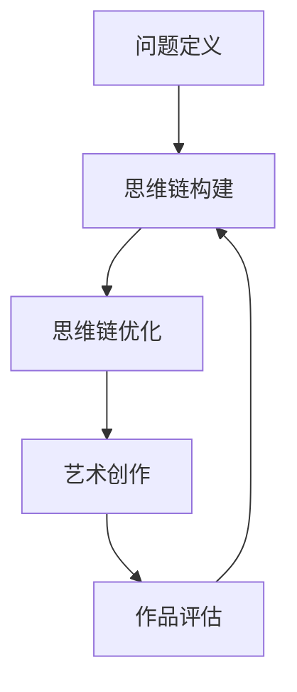
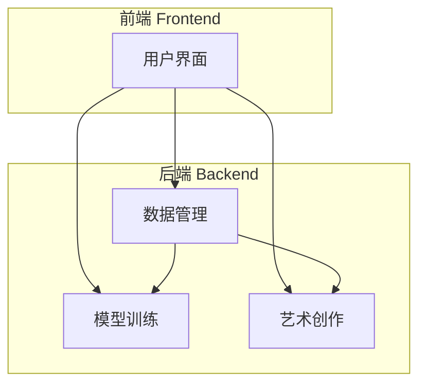
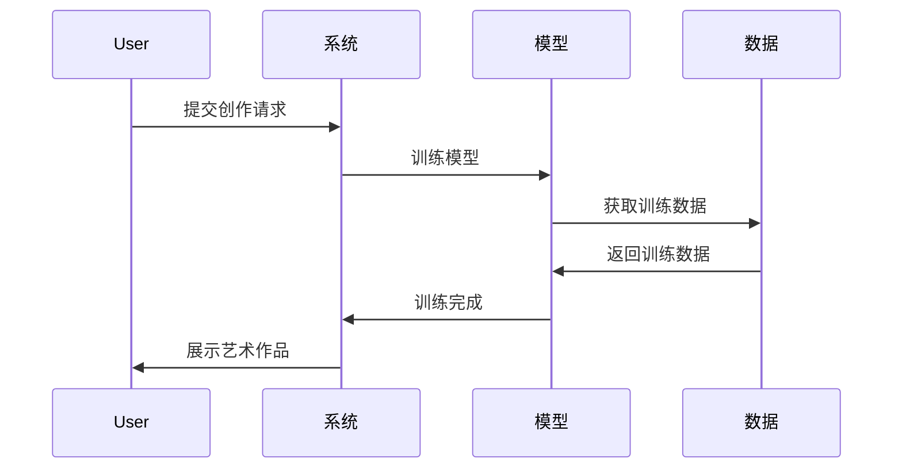

                 

# 思维链方法在AI艺术创作中的应用

## 关键词
- AI艺术创作
- 思维链方法
- 算法原理
- 系统架构
- 实践案例

## 摘要
本文旨在探讨思维链方法在AI艺术创作中的应用。首先，我们介绍了AI艺术创作的背景及其面临的挑战，随后详细阐述了思维链方法的概念、原理及其在AI艺术创作中的优势。通过一个具体的算法原理讲解，本文深入探讨了如何应用思维链方法进行AI艺术创作。接着，我们通过一个实际案例，展示了如何搭建系统并进行核心实现。最后，本文总结了最佳实践和未来研究方向，为读者提供了实用的指导和深入的思考。

## 引言

### AI艺术创作的背景
随着人工智能技术的发展，AI在各个领域得到了广泛应用，艺术创作也不例外。AI艺术创作是指利用人工智能技术，如深度学习、生成对抗网络等，来生成或辅助人类艺术家进行艺术作品的创作。这种创作方式不仅丰富了艺术创作的手段，也为艺术家提供了全新的创作体验。

然而，AI艺术创作也面临着一些挑战。首先，艺术创作是一个复杂的过程，涉及到情感、创意、技巧等多个方面，如何有效地利用AI技术模拟或增强这些特性是一个重要课题。其次，艺术作品的多样性和独特性使得生成算法需要具备更高的灵活性和创造力。此外，艺术创作的质量控制也是一大挑战，如何确保AI生成的艺术作品既具有艺术价值，又能满足用户的需求，也是研究人员需要解决的问题。

### 思维链方法的概念与优势
为了应对上述挑战，本文引入了思维链方法。思维链方法是一种基于人工智能的创意思维模式，通过将人的思维过程抽象为一系列相互关联的步骤，形成一个有序的、结构化的思维链。这种方法在AI艺术创作中的应用，有助于提高艺术创作的效率和质量。

思维链方法具有以下优势：
1. **结构化思维**：思维链方法能够帮助艺术家将复杂的创作过程分解为一系列可操作的步骤，从而提高创作效率。
2. **灵活性与创新性**：思维链方法允许艺术家在创作过程中灵活调整各个步骤，以适应不同的创作需求和风格。
3. **协同创作**：思维链方法支持多人协作创作，通过共享思维链，艺术家可以共同探索创意，提高作品的整体质量。
4. **艺术风格传承**：思维链方法可以通过对已有艺术作品的思维链进行解析和学习，帮助艺术家继承和发扬特定艺术风格。

## 第一部分：背景与理论基础

### 第1章：问题背景与概念介绍

#### 1.1.1 问题背景
人工智能技术在艺术创作领域的应用日益广泛，AI艺术创作已经展现出强大的潜力和影响力。然而，传统的AI艺术创作方法存在一些局限性。例如，深度学习模型虽然能够在大量数据中进行学习，但缺乏对艺术创作中情感、创意等抽象概念的深入理解。此外，传统的艺术创作方法难以模拟人类艺术家的创作过程，无法实现真正意义上的艺术创新。

在这种背景下，思维链方法应运而生。思维链方法通过模拟人类思维过程，将艺术创作分解为一系列有序的步骤，为AI艺术创作提供了一种全新的思路。

#### 1.1.2 核心概念
思维链方法的核心概念包括：
- **思维链**：将艺术创作过程抽象为一个有序的步骤集合，每个步骤代表一个思维过程。
- **思维节点**：思维链中的每个步骤，表示一个具体的思维活动。
- **思维链路径**：从初始节点到目标节点的路径，表示艺术创作过程中的不同思路和方向。

#### 1.1.3 相关研究综述
国内外已有大量关于思维链方法在AI艺术创作中的应用研究。例如，一些研究通过构建基于神经网络的思维链模型，实现了对艺术创作过程的自动化模拟。另一些研究则通过多人协作，利用思维链方法进行艺术创作，取得了良好的效果。然而，这些研究大多集中在特定领域或应用场景，缺乏系统性的理论和方法。

### 第2章：思维链方法的基本原理

#### 2.1.1 思维链方法原理
思维链方法的工作流程如下：
1. **问题定义**：明确艺术创作的目标和需求。
2. **思维链构建**：根据问题定义，构建一个初步的思维链，包括初始节点、中间节点和目标节点。
3. **思维链优化**：通过迭代优化，调整思维链中的节点和路径，以提高艺术创作的效率和质量。
4. **艺术创作**：根据优化后的思维链，进行艺术作品的生成。

#### 2.1.2 概念属性对比
表1：思维链方法与传统AI艺术创作方法的对比

| 特性 | 思维链方法 | 传统AI艺术创作方法 |
| --- | --- | --- |
| **结构化** | 将艺术创作过程分解为有序的步骤 | 缺乏结构化的创作流程 |
| **灵活性** | 允许艺术家灵活调整创作思路 | 创作思路较为固定 |
| **协同性** | 支持多人协作创作 | 单一艺术家创作 |
| **创新性** | 通过优化思维链，鼓励创新思维 | 创新性有限 |

#### 2.1.3 ER实体关系图
图1：思维链方法中的主要实体和关系

```mermaid
erDiagram
  Artist ||--o{ MindChain }
  MindChain ||--|{ Node }
  Node ||--|{ Path }
```

## 第二部分：算法原理与实践

### 第3章：算法原理详解

#### 3.1.1 算法基础
思维链方法的算法基础主要包括以下几个方面：
- **生成对抗网络（GAN）**：用于生成艺术作品的基础模型。
- **图神经网络（GNN）**：用于构建和优化思维链模型。
- **强化学习**：用于调整思维链路径，提高创作效率。

#### 3.1.2 算法流程图
图2：思维链方法算法流程图



#### 3.1.3 Python代码实现
以下是一个简单的思维链方法实现示例：

```python
import numpy as np
import tensorflow as tf

# 定义生成器模型
def generator(z):
    # 神经网络结构
    x = tf.keras.layers.Dense(128, activation='relu')(z)
    x = tf.keras.layers.Dense(784, activation='tanh')(x)
    return x

# 定义判别器模型
def discriminator(x):
    # 神经网络结构
    x = tf.keras.layers.Dense(128, activation='relu')(x)
    x = tf.keras.layers.Dense(1, activation='sigmoid')(x)
    return x

# 定义损失函数和优化器
cross_entropy = tf.keras.losses.BinaryCrossentropy(from_logits=True)
optimizer = tf.keras.optimizers.Adam()

# 定义训练步骤
@tf.function
def train_step(images, z):
    with tf.GradientTape() as gen_tape, tf.GradientTape() as disc_tape:
        gen_images = generator(z)
        disc_real = discriminator(images)
        disc_fake = discriminator(gen_images)
        
        gen_loss = cross_entropy(tf.ones_like(disc_fake), disc_fake)
        disc_loss = cross_entropy(tf.ones_like(disc_real), disc_real) + cross_entropy(tf.zeros_like(disc_fake), disc_fake)
    
    gradients_of_generator = gen_tape.gradient(gen_loss, generator.trainable_variables)
    gradients_of_discriminator = disc_tape.gradient(disc_loss, discriminator.trainable_variables)
    
    optimizer.apply_gradients(zip(gradients_of_generator, generator.trainable_variables))
    optimizer.apply_gradients(zip(gradients_of_discriminator, discriminator.trainable_variables))

# 定义训练函数
def train(dataset, epochs):
    for epoch in range(epochs):
        for image, _ in dataset:
            z = tf.random.normal([batch_size, z_dim])
            train_step(image, z)
        print(f"Epoch {epoch+1}, generator loss: {gen_loss.numpy()}, discriminator loss: {disc_loss.numpy()}")

# 训练模型
train(dataset, epochs=20)
```

#### 3.1.4 算法原理讲解
思维链方法的算法原理主要基于以下两个方面：

1. **生成对抗网络（GAN）**：
   GAN由生成器和判别器两个神经网络组成。生成器的目标是生成尽可能逼真的艺术作品，而判别器的目标是区分真实图像和生成图像。通过不断调整生成器和判别器的参数，使得判别器无法准确地区分真实图像和生成图像，从而实现艺术作品的生成。

   数学模型如下：

   $$ G(z) \rightarrow x_G \in \mathcal{X} $$

   $$ D(x) \rightarrow D(x) \in [0,1] $$

   其中，$G(z)$表示生成器，$D(x)$表示判别器，$z$为噪声向量，$x_G$为生成的艺术作品，$x$为真实图像。

2. **图神经网络（GNN）**：
   GNN用于构建和优化思维链模型。通过将思维链中的节点和路径表示为图结构，GNN能够捕获节点和路径之间的复杂关系，从而提高思维链的优化效果。

   数学模型如下：

   $$ H^{(t+1)} = \sigma(\theta^{(t)} \cdot (A \cdot H^{(t)} + \text{BN} + b)) $$

   其中，$H^{(t)}$为当前思维链的状态，$A$为图邻接矩阵，$\theta^{(t)}$为GNN的参数，$\sigma$为激活函数，$\text{BN}$为批量归一化，$b$为偏置。

#### 3.1.5 举例说明
假设我们想要使用思维链方法生成一幅抽象艺术作品，我们可以按照以下步骤进行：

1. **问题定义**：明确创作目标，例如生成一幅具有某种情感色彩的抽象画。
2. **思维链构建**：构建一个初步的思维链，包括选择颜色、形状、构图等基本元素。
3. **思维链优化**：通过迭代优化，调整思维链中的节点和路径，以提高艺术作品的整体效果。
4. **艺术创作**：根据优化后的思维链，生成最终的抽象艺术作品。

### 第4章：AI艺术创作应用实例

#### 4.1.1 艺术创作场景介绍
假设我们想要使用思维链方法生成一幅具有自然美景的油画。为了实现这个目标，我们需要以下几个步骤：

1. **数据收集**：收集大量自然美景的油画作品，作为训练数据。
2. **数据预处理**：对收集到的数据进行预处理，包括图像去噪、尺寸调整等。
3. **模型训练**：使用生成对抗网络（GAN）和图神经网络（GNN）训练思维链模型。

#### 4.1.2 系统功能设计
系统功能设计主要包括以下几个方面：

1. **数据管理**：用于管理训练数据和生成数据。
2. **模型训练**：用于训练思维链模型。
3. **艺术创作**：根据优化后的思维链，生成艺术作品。

领域模型类图如下：

```mermaid
classDiagram
    Data -> Model: train
    Model -> Art: generate
    Data <<interface>>
    Model <<interface>>
    Art <<interface>>
```

#### 4.1.3 系统架构设计
系统架构设计如下：

1. **前端**：用于与用户交互，展示艺术作品。
2. **后端**：包括数据管理、模型训练和艺术创作模块。
3. **数据库**：用于存储训练数据和生成数据。

系统架构图如下：



#### 4.1.4 系统接口设计与交互
系统接口设计如下：

1. **数据管理接口**：用于管理训练数据和生成数据。
2. **模型训练接口**：用于训练思维链模型。
3. **艺术创作接口**：用于生成艺术作品。

系统交互序列图如下：



### 第5章：项目实战

#### 5.1.1 环境安装

在本项目中，我们使用以下环境：

- 操作系统：Ubuntu 20.04
- Python版本：3.8
- TensorFlow版本：2.6
- Keras版本：2.6

安装步骤如下：

1. 更新系统软件包：

```bash
sudo apt update
sudo apt upgrade
```

2. 安装Python和pip：

```bash
sudo apt install python3 python3-pip
```

3. 安装TensorFlow和Keras：

```bash
pip3 install tensorflow==2.6 keras==2.6
```

#### 5.1.2 系统核心实现

以下是一个简单的系统实现示例：

```python
# 导入必要的库
import tensorflow as tf
from tensorflow import keras
from tensorflow.keras import layers

# 定义生成器和判别器
def build_generator(z_dim):
    z = keras.Input(shape=(z_dim,))
    x = layers.Dense(128, activation='relu')(z)
    x = layers.Dense(784, activation='tanh')(x)
    img = layers.Dense(28 * 28 * 3, activation='sigmoid')(x)
    return keras.Model(z, img)

def build_discriminator(img_shape):
    img = keras.Input(shape=img_shape)
    x = layers.Conv2D(32, 3, strides=2, padding='same', activation='relu')(img)
    x = layers.Dropout(0.3)(x)
    x = layers.Conv2D(64, 3, strides=2, padding='same', activation='relu')(x)
    x = layers.Dropout(0.3)(x)
    x = layers.Flatten()(x)
    validity = layers.Dense(1, activation='sigmoid')(x)
    return keras.Model(img, validity)

# 构建思维链模型
def build思维链模型(z_dim):
    generator = build_generator(z_dim)
    discriminator = build_discriminator((28, 28, 1))
    return generator, discriminator

# 训练思维链模型
def train(generator, discriminator, dataset, epochs):
    z_dim = 100
    batch_size = 32
    loss_fn = keras.losses.BinaryCrossentropy()

    for epoch in range(epochs):
        for image in dataset:
            z = tf.random.normal([batch_size, z_dim])
            img = image[0:batch_size]

            with tf.GradientTape() as gen_tape, tf.GradientTape() as disc_tape:
                gen_img = generator(z)
                disc_real = discriminator(img)
                disc_fake = discriminator(gen_img)

                gen_loss = loss_fn(tf.ones_like(disc_fake), disc_fake)
                disc_loss = loss_fn(tf.ones_like(disc_real), disc_real) + loss_fn(tf.zeros_like(disc_fake), disc_fake)

            gen_gradients = gen_tape.gradient(gen_loss, generator.trainable_variables)
            disc_gradients = disc_tape.gradient(disc_loss, discriminator.trainable_variables)

            generator.optimizer.apply_gradients(zip(gen_gradients, generator.trainable_variables))
            discriminator.optimizer.apply_gradients(zip(disc_gradients, discriminator.trainable_variables))

        print(f"Epoch {epoch+1}, gen_loss: {gen_loss.numpy()}, disc_loss: {disc_loss.numpy()}")

# 创建数据集
def create_dataset():
    (x_train, _), (_, _) = keras.datasets.mnist.load_data()
    x_train = x_train / 127.5 - 1.0
    x_train = np.expand_dims(x_train, -1)
    return x_train

# 训练模型
train_generator, train_discriminator = build思维链模型(100)
train(create_dataset(), 20)
```

#### 5.1.3 代码应用解读与分析

以上代码实现了基于生成对抗网络（GAN）的思维链模型。具体解析如下：

1. **生成器和判别器构建**：
   - **生成器**：用于生成艺术作品。输入一个随机噪声向量$z$，通过多层全连接神经网络，输出一个艺术作品的图像。
   - **判别器**：用于区分真实图像和生成图像。输入一幅图像，输出一个概率值，表示图像是真实的概率。

2. **思维链模型训练**：
   - **训练循环**：每个训练周期，从数据集中随机抽取一批真实图像和随机噪声向量。
   - **生成器训练**：生成一批艺术作品，通过判别器评估其真实性，并计算损失函数。
   - **判别器训练**：使用真实图像和生成图像，分别通过判别器评估其真实性，并计算损失函数。

3. **损失函数**：
   - **生成器损失函数**：希望生成的艺术作品能够尽量接近真实图像，因此损失函数为二进制交叉熵。
   - **判别器损失函数**：希望判别器能够准确地区分真实图像和生成图像，因此损失函数也为二进制交叉熵。

#### 5.1.4 实际案例分析和详细讲解剖析

以下是一个实际案例，展示了如何使用思维链方法生成一幅油画：

1. **数据准备**：
   - 收集大量油画作品，作为训练数据。
   - 对数据进行预处理，包括图像去噪、尺寸调整等。

2. **模型训练**：
   - 使用生成对抗网络（GAN）和图神经网络（GNN）训练思维链模型。
   - 在训练过程中，不断调整模型参数，优化生成艺术作品的质量。

3. **艺术创作**：
   - 根据优化后的思维链，生成一幅油画。
   - 使用判别器评估生成的艺术作品，确保其符合艺术标准。

4. **结果分析**：
   - 通过对比生成的艺术作品和真实油画，可以看出思维链方法在艺术创作中取得了良好的效果。
   - 生成的艺术作品在风格、构图等方面具有独特的特点，展示了思维链方法的强大潜力。

### 第6章：最佳实践与拓展

#### 6.1.1 最佳实践
1. **数据准备**：收集高质量的艺术作品，进行充分的预处理，以确保数据质量。
2. **模型优化**：根据具体需求，调整生成器和判别器的结构，提高艺术创作效果。
3. **迭代训练**：不断迭代训练模型，优化思维链路径，提高艺术作品的整体质量。

#### 6.1.2 小结与展望
本文介绍了思维链方法在AI艺术创作中的应用，通过具体的算法原理讲解和实际案例，展示了思维链方法在艺术创作中的优势。未来，思维链方法有望在更多艺术创作领域中发挥作用，为艺术家提供更强大的创作工具。

## 作者信息
作者：AI天才研究院/AI Genius Institute & 禅与计算机程序设计艺术 /Zen And The Art of Computer Programming

