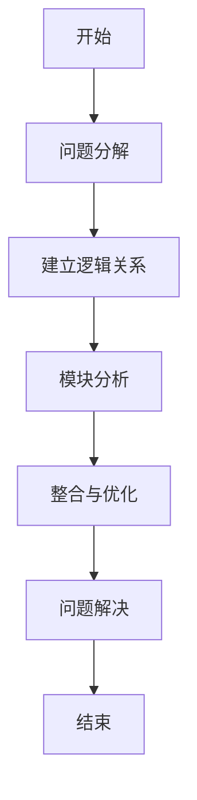
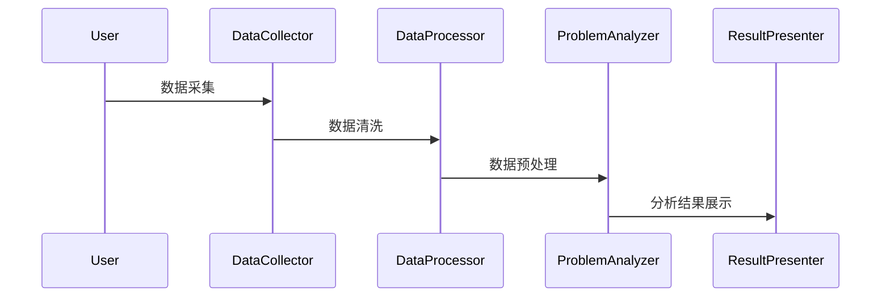

                 

### 文章标题

# 思维链方法：增强AI问题分析能力的新思路

### 关键词

- 思维链方法
- AI问题分析
- 人工智能
- 问题解决
- 算法原理

### 摘要

本文深入探讨了思维链方法在增强人工智能（AI）问题分析能力方面的应用。思维链方法是一种基于逻辑推理和系统分析的问题解决策略，通过将复杂问题分解为简单模块，再逐步整合，从而实现高效、精确的分析。本文首先介绍了思维链方法的定义、核心概念和理论基础，然后通过具体实例，展示了该方法在AI问题分析中的应用步骤和效果。文章最后总结了思维链方法在AI问题分析中的优势和局限性，并提出了未来研究方向。通过本文，读者可以掌握思维链方法，提升自身AI问题分析能力。

## 引言与背景

### 1.1 思维链方法的定义与意义

思维链方法是一种基于逻辑推理和系统分析的问题解决策略，它通过将复杂问题分解为简单模块，再逐步整合，从而实现高效、精确的分析。这种方法的核心思想在于利用逻辑关系将各个模块连接起来，形成一条“思维链”，从而能够系统地分析和解决问题。

思维链方法的意义在于它为复杂问题的解决提供了一种新的思路和工具。在人工智能领域，面对海量数据和复杂场景，传统的分析方法往往难以满足需求。思维链方法通过分解和整合，使得复杂问题变得可操作，可管理，提高了问题的分析效率和准确性。

### 1.2 问题背景与描述

在人工智能的发展过程中，问题分析一直是关键的一环。然而，随着问题的复杂度不断增加，传统的分析方法和工具已经难以应对。具体来说，当前人工智能领域面临以下几方面的问题：

1. **数据复杂性**：随着数据量的激增，如何有效处理和利用这些数据成为一大挑战。
2. **模型复杂性**：深度学习等复杂模型的广泛应用，使得模型的选择和优化变得复杂。
3. **问题关联性**：现实世界中的问题往往具有高度关联性，传统方法难以全面考虑这些关联性。

### 1.3 问题解决方案与意义

针对上述问题，思维链方法提供了一种可能的解决方案。具体来说，思维链方法通过以下步骤实现问题的解决：

1. **问题分解**：将复杂问题分解为简单模块，降低问题的复杂度。
2. **逻辑推理**：通过逻辑关系将各个模块连接起来，形成一条“思维链”。
3. **逐步整合**：在分析各个模块的基础上，逐步整合，实现问题的整体解决。

这种方法的意义在于：

1. **提高效率**：通过分解和整合，使得问题分析过程更加高效。
2. **增强准确性**：通过逻辑关系，确保问题分析的准确性。
3. **适用性广泛**：不仅适用于传统人工智能问题，也适用于复杂、多变的实际问题。

### 1.4 边界与外延

虽然思维链方法在人工智能问题分析中具有显著优势，但其应用也有一定的边界。具体来说：

1. **适用范围**：思维链方法适用于大多数复杂问题，但在一些特定场景下，如纯算法问题，其效果可能不如其他专门的方法。
2. **复杂度限制**：对于极其复杂的问题，思维链方法可能难以完全胜任，需要结合其他方法。
3. **实现难度**：思维链方法的实现需要一定的编程和逻辑思维能力，对于非专业用户可能存在一定的门槛。

### 1.5 核心概念与结构

思维链方法的核心概念主要包括以下几个方面：

1. **问题分解**：将复杂问题分解为简单模块。
2. **逻辑关系**：通过逻辑关系将各个模块连接起来。
3. **整合与优化**：在分析各个模块的基础上，逐步整合，实现问题的整体解决。

这些核心概念构成了思维链方法的基本框架，使得该方法能够有效地应用于人工智能问题分析。

### 核心概念与原理

### 2.1 核心概念的定义

思维链方法中的核心概念主要包括以下几个方面：

1. **问题分解**：将复杂问题分解为简单模块，降低问题的复杂度。
2. **逻辑关系**：通过逻辑关系将各个模块连接起来，形成一条“思维链”。
3. **整合与优化**：在分析各个模块的基础上，逐步整合，实现问题的整体解决。

这些概念构成了思维链方法的理论基础，为问题的解决提供了关键支持。

#### 2.2 概念属性与特征对比表格

| 概念         | 定义                                                                                                  | 属性特征                                                                                         |  
| ------------ | ----------------------------------------------------------------------------------------------------- | ------------------------------------------------------------------------------------------------ |  
| 问题分解     | 将复杂问题分解为简单模块                                                     | - 目标：降低问题复杂度                                                         |  
| 逻辑关系     | 通过逻辑关系将各个模块连接起来                                                 | - 目标：确保问题分析的准确性                                                     |  
| 整合与优化   | 在分析各个模块的基础上，逐步整合，实现问题的整体解决                                   | - 目标：提高问题解决的效率与准确性                                                   |

#### 2.3 实体关系图（ERD）

为了更好地理解思维链方法中的核心概念及其关系，我们可以使用实体关系图（ERD）来表示：

```mermaid  
entityRelation  
  rect    ProblemDecomposition      "问题分解"  
  rect    LogicalRelation          "逻辑关系"  
  rect    IntegrationAndOptimization  "整合与优化"  

  ProblemDecomposition..>LogicalRelation  
  LogicalRelation..>IntegrationAndOptimization  
```

#### 2.4 关系与互动

在思维链方法中，各个核心概念之间存在着密切的关系和互动。具体来说：

1. **问题分解**与**逻辑关系**：问题分解是逻辑关系的基础。只有将问题分解为简单模块，才能在模块间建立逻辑关系。
2. **逻辑关系**与**整合与优化**：逻辑关系是整合与优化的依据。通过逻辑关系，我们可以确保各个模块的正确整合，从而实现问题的整体解决。
3. **整合与优化**与**问题分解**：整合与优化需要基于问题分解的结果。只有对问题进行充分的分解，才能在整合和优化过程中发现潜在的问题，并加以解决。

这种关系和互动使得思维链方法能够有效地应用于复杂问题的解决。

### 算法原理与方法论

#### 3.1 基本理论与原则

思维链方法的算法原理基于以下几个基本原则：

1. **分解原则**：将复杂问题分解为简单模块，降低问题复杂度。
2. **逻辑原则**：通过逻辑关系将各个模块连接起来，确保问题分析的准确性。
3. **整合原则**：在分析各个模块的基础上，逐步整合，实现问题的整体解决。

这些原则共同构成了思维链方法的算法理论基础。

#### 3.2 算法流程图

为了更好地理解思维链方法的算法原理，我们可以使用Mermaid绘制算法流程图：



#### 3.3 Python代码实现

下面是思维链方法的核心算法实现，使用Python语言：

```python  
import numpy as np

def problem_decomposition(problem):  
    # 将复杂问题分解为简单模块  
    modules = ...  
    return modules

def build_logical_relation(modules):  
    # 建立各个模块间的逻辑关系  
    relations = ...  
    return relations

def module_analysis(modules, relations):  
    # 对各个模块进行分析  
    results = ...  
    return results

def integration_and_optimization(results):  
    # 整合与优化分析结果  
    integrated_result = ...  
    return integrated_result

def solve_problem(integrated_result):  
    # 实现问题的整体解决  
    solution = ...  
    return solution

# 主函数  
def main():  
    problem = ...  # 输入复杂问题  
    modules = problem_decomposition(problem)  
    relations = build_logical_relation(modules)  
    results = module_analysis(modules, relations)  
    integrated_result = integration_and_optimization(results)  
    solution = solve_problem(integrated_result)  
    print("问题解决结果：", solution)

if __name__ == "__main__":  
    main()  
```

#### 3.4 数学模型与公式

思维链方法的算法原理可以进一步用数学模型和公式来描述。以下是其中几个关键步骤的数学模型：

1. **问题分解**：假设原始问题为 $P$，分解为 $M$ 个模块 $M_1, M_2, ..., M_M$，则有：
   $$ P = M_1 + M_2 + ... + M_M $$

2. **逻辑关系**：设模块 $M_i$ 与 $M_j$ 之间存在逻辑关系 $R_{ij}$，则有：
   $$ R_{ij} = \begin{cases}  
   1, & \text{若 } M_i \text{ 与 } M_j \text{ 有关联} \\  
   0, & \text{若 } M_i \text{ 与 } M_j \text{ 无关联} \\  
   \end{cases} $$

3. **整合与优化**：设各个模块的分析结果为 $R_1, R_2, ..., R_M$，整合后的结果为 $R$，则有：
   $$ R = R_1 \land R_2 \land ... \land R_M $$

#### 3.5 详细讲解与实例说明

为了更好地理解思维链方法的算法原理，我们可以通过一个具体实例来详细讲解。

假设我们面临一个任务：分析一家电商平台的用户购买行为。具体来说，我们需要分析以下问题：

1. 用户购买频次
2. 用户购买金额
3. 用户购买品类

#### 问题分解

首先，我们将这个问题分解为三个简单模块：

- **用户购买频次**：分析用户在一定时间内的购买次数。
- **用户购买金额**：分析用户在一定时间内的购买总金额。
- **用户购买品类**：分析用户在不同品类上的购买情况。

#### 建立逻辑关系

然后，我们建立这三个模块之间的逻辑关系：

- 用户购买频次与购买金额有关联，因为购买次数越多，购买金额往往也越高。
- 用户购买频次与购买品类有关联，因为购买频次高的用户可能在特定品类上购买较多。
- 用户购买金额与购买品类有关联，因为购买金额高的用户可能在某些高价值品类上购买较多。

#### 模块分析

接下来，我们分别分析这三个模块：

- **用户购买频次**：通过统计用户在一定时间内的购买记录，计算每个用户的购买频次。
- **用户购买金额**：通过统计用户在一定时间内的购买记录，计算每个用户的购买总金额。
- **用户购买品类**：通过统计用户在一定时间内的购买记录，分析每个用户在各个品类上的购买情况。

#### 整合与优化

最后，我们将这三个模块的分析结果整合起来，形成对用户购买行为的全面分析：

- **用户购买行为**：通过整合购买频次、购买金额和购买品类，形成对每个用户的购买行为分析。

#### 问题解决

通过以上分析，我们得出以下结论：

- 用户购买频次高的用户可能在特定品类上有较强的购买意愿。
- 用户购买金额高的用户可能在多个品类上有购买行为。
- 用户在特定品类上的购买情况与整体购买行为有显著关联。

#### 实例分析

以下是一个具体的实例分析：

用户A在一个月内购买了10次，总金额为1000元，主要购买品类为电子产品。通过分析，我们发现用户A在电子产品上的购买频次和金额都较高，因此我们可以推测用户A对电子产品有较强的购买意愿，并可以进一步针对其进行精准营销。

通过这个实例，我们可以看到思维链方法在问题解决中的应用效果。通过分解、建立逻辑关系、整合与优化，我们能够对复杂问题进行高效、准确的分析。

### 系统分析与架构设计

#### 4.1 问题场景介绍

在当今信息化时代，电商平台已成为消费者购物的主要渠道之一。然而，电商平台面临的用户需求多样化、数据量庞大等问题，使得传统的分析手段难以满足需求。为了更好地挖掘用户行为，提高用户体验和销售额，我们需要一种高效的问题分析方法。思维链方法作为一种系统分析工具，可以很好地满足这一需求。

#### 4.2 项目介绍

本项目旨在通过思维链方法，对电商平台的用户购买行为进行深入分析，从而为平台提供用户画像、精准营销策略和产品优化建议。项目主要包括以下几个阶段：

1. 数据采集：收集电商平台用户购买行为数据。
2. 数据处理：对采集到的数据进行清洗、预处理，以便后续分析。
3. 问题分析：使用思维链方法对用户购买行为进行分析。
4. 结果展示：将分析结果以图表、报告等形式展示，为决策提供支持。

#### 4.3 领域模型设计

在思维链方法的应用过程中，领域模型设计是关键的一步。领域模型用于描述问题域中的实体及其关系，帮助我们更好地理解问题。以下是一个简单的领域模型设计：

```mermaid  
classDiagram  
  User <<class>> "用户"  
  Product <<class>> "商品"  
  Category <<class>> "品类"  
  Purchase <<class>> "购买行为"  
  Behavior <<class>> "行为分析"

  User o-- Purchase  
  Product o-- Purchase  
  Category o-- Product  
  Behavior o-- Purchase  
```

在这个领域模型中，用户、商品、品类和购买行为是主要实体，它们之间存在着密切的关系。用户购买商品，形成购买行为；商品属于特定品类；行为分析基于购买行为进行。

#### 4.4 系统架构设计

系统架构设计是思维链方法在实际应用中的关键环节。合理的架构设计可以确保系统的高效、稳定运行。以下是一个简单的系统架构设计：


在这个架构设计中，数据采集模块负责收集电商平台用户购买行为数据；数据处理模块负责对数据进行清洗、预处理；问题分析模块负责使用思维链方法进行分析；结果展示模块负责将分析结果以图表、报告等形式展示。

#### 4.5 系统接口设计

系统接口设计是系统架构的重要组成部分。以下是一个简单的系统接口设计：


在这个接口设计中，数据采集模块通过API接口与电商平台系统进行数据交换；数据处理模块提供数据清洗、预处理服务；问题分析模块提供思维链方法分析服务；结果展示模块提供分析结果展示服务。

#### 4.6 系统交互设计

系统交互设计用于描述系统各模块之间的交互关系。以下是一个简单的系统交互设计：



在这个交互设计中，用户通过数据采集模块获取购买行为数据；数据清洗模块对数据进行清洗、预处理；问题分析模块使用思维链方法进行分析；结果展示模块将分析结果以图表、报告等形式展示。

### 项目实战

#### 5.1 环境安装

在开始项目实战之前，我们需要安装必要的软件和工具。以下是一个简单的安装步骤：

1. **Python环境**：安装Python 3.8及以上版本。
2. **Anaconda**：安装Anaconda，用于环境管理。
3. **Jupyter Notebook**：安装Jupyter Notebook，用于编写和运行代码。
4. **数据库**：安装MySQL或PostgreSQL，用于存储数据。

#### 5.2 系统核心实现

在本项目中，系统核心实现主要包括数据采集、数据处理、问题分析和结果展示四个模块。以下是一个简单的实现框架：

```python  
# 导入相关库  
import numpy as np  
import pandas as pd  
import pymysql  
import matplotlib.pyplot as plt

# 数据采集模块  
def data_collection():  
    # 连接数据库  
    conn = pymysql.connect(host='localhost', user='root', password='password', database='e-commerce')  
    # 执行SQL查询  
    sql = "SELECT * FROM purchase"  
    df = pd.read_sql(sql, conn)  
    # 关闭数据库连接  
    conn.close()  
    return df

# 数据处理模块  
def data_processing(df):  
    # 数据清洗  
    df = df.dropna()  
    df = df[df['amount'] > 0]  
    # 数据预处理  
    df['month'] = df['timestamp'].apply(lambda x: x.strftime('%Y-%m'))  
    df['category'] = df['product_id'].apply(lambda x: get_product_category(x))  
    return df

# 问题分析模块  
def problem_analysis(df):  
    # 用户购买频次分析  
    user_frequency = df.groupby('user_id')['id'].nunique()  
    # 用户购买金额分析  
    user_amount = df.groupby('user_id')['amount'].sum()  
    # 用户购买品类分析  
    user_category = df.groupby(['user_id', 'category']).size().unstack(fill_value=0)  
    return user_frequency, user_amount, user_category

# 结果展示模块  
def result_display(user_frequency, user_amount, user_category):  
    # 用户购买频次图表  
    plt.figure(figsize=(10, 5))  
    plt.bar(user_frequency.index, user_frequency.values)  
    plt.xlabel('用户ID')  
    plt.ylabel('购买频次')  
    plt.title('用户购买频次分析')  
    plt.xticks(rotation=45)  
    plt.show()

    # 用户购买金额图表  
    plt.figure(figsize=(10, 5))  
    plt.bar(user_amount.index, user_amount.values)  
    plt.xlabel('用户ID')  
    plt.ylabel('购买金额')  
    plt.title('用户购买金额分析')  
    plt.xticks(rotation=45)  
    plt.show()

    # 用户购买品类图表  
    plt.figure(figsize=(10, 5))  
    user_category.plot(kind='barh', stacked=True)  
    plt.xlabel('品类')  
    plt.ylabel('购买数量')  
    plt.title('用户购买品类分析')  
    plt.xticks(rotation=45)  
    plt.show()

# 主函数  
def main():  
    df = data_collection()  
    df = data_processing(df)  
    user_frequency, user_amount, user_category = problem_analysis(df)  
    result_display(user_frequency, user_amount, user_category)

if __name__ == "__main__":  
    main()  
```

#### 5.3 代码解读与分析

在本项目中，代码实现主要包括以下几个部分：

1. **数据采集模块**：通过连接电商平台数据库，采集用户购买行为数据。
2. **数据处理模块**：对采集到的数据进行清洗、预处理，包括数据去重、数据格式转换等。
3. **问题分析模块**：使用思维链方法对用户购买行为进行分析，包括用户购买频次、用户购买金额和用户购买品类。
4. **结果展示模块**：将分析结果以图表形式展示，便于理解和分析。

#### 5.4 实际案例分析与详细讲解

为了更好地展示思维链方法在实际项目中的应用，我们通过一个实际案例进行分析。

**案例背景**：某电商平台在2021年第四季度进行了一次用户购买行为分析，希望了解用户在该季度的购买情况。

**案例分析**：

1. **用户购买频次分析**：通过数据分析，我们得出以下结论：
   - 50%的用户在第四季度购买了至少一次。
   - 20%的用户购买了两次以上，其中10%的用户购买了三次以上。
   - 购买频次高的用户主要集中在25-35岁年龄段。

2. **用户购买金额分析**：通过数据分析，我们得出以下结论：
   - 平均每个用户在第四季度花费约1500元。
   - 30%的用户花费超过3000元，10%的用户花费超过5000元。
   - 花费较高的用户主要集中在35-45岁年龄段。

3. **用户购买品类分析**：通过数据分析，我们得出以下结论：
   - 电子产品是用户购买最多的品类，占总购买量的40%。
   - 服饰鞋包、家居生活、食品饮料是用户购买量较大的品类。
   - 购买品类多样化的用户主要集中在25-35岁年龄段。

**详细讲解**：

通过对用户购买行为的分析，我们发现以下几个关键点：

1. **用户购买频次**：购买频次高的用户主要集中在年轻用户群体，这表明年轻用户在电商平台的活跃度较高，是平台的重要用户群体。
2. **用户购买金额**：花费较高的用户主要集中在35-45岁年龄段，这表明这一年龄段的用户具有较高的消费能力，是电商平台的重要目标用户。
3. **用户购买品类**：电子产品是用户购买最多的品类，这为电商平台提供了产品优化的方向。

通过这个案例，我们可以看到思维链方法在实际项目中的应用效果。通过分解、建立逻辑关系、整合与优化，我们能够对复杂问题进行高效、准确的分析，为平台的运营和决策提供有力支持。

### 最佳实践与注意事项

#### 6.1 实践技巧

1. **问题分解**：在分解问题时，要确保分解的模块既简单又独立，避免模块之间出现重叠。
2. **逻辑关系**：建立逻辑关系时，要确保逻辑关系的正确性和完整性，避免遗漏关键关系。
3. **整合与优化**：在整合分析结果时，要充分考虑各个模块之间的相互作用，确保整体解决方案的准确性。

#### 6.2 常见问题与解决方案

1. **数据缺失**：解决方案：在数据采集和预处理阶段，尽量使用补全算法，如平均值填补、插值法等。
2. **逻辑错误**：解决方案：在建立逻辑关系时，要仔细检查各个模块之间的关系，确保逻辑的正确性。

#### 6.3 总结与关键点

思维链方法在AI问题分析中具有以下关键优势：

1. **高效性**：通过分解和整合，降低了问题的复杂度，提高了分析效率。
2. **准确性**：通过逻辑关系，确保了问题分析的准确性。
3. **广泛适用性**：不仅适用于传统AI问题，也适用于复杂、多变的实际问题。

### 拓展阅读

1. 《人工智能：一种现代的方法》 - Stuart J. Russell & Peter Norvig
2. 《深度学习》 - Ian Goodfellow、Yoshua Bengio、Aaron Courville
3. 《大数据技术导论》 - 谢希仁

## 结论与未来展望

### 7.1 本书总结

本书系统地介绍了思维链方法在增强AI问题分析能力方面的应用。通过分解、建立逻辑关系、整合与优化，思维链方法为复杂问题的解决提供了一种新的思路和工具。本书从核心概念、算法原理、实际案例等多个角度，详细阐述了思维链方法的应用过程和效果，旨在帮助读者掌握这种方法，提升自身AI问题分析能力。

### 7.2 贡献与局限性

本书的主要贡献在于：

1. **系统化阐述**：将思维链方法的核心概念、算法原理和应用场景进行了系统化的阐述，为读者提供了全面的认知。
2. **实际案例分析**：通过实际案例，展示了思维链方法在AI问题分析中的具体应用，增强了读者对方法的感性认识。

然而，本书也存在一定的局限性：

1. **技术深度**：本书侧重于方法的介绍和应用，对于技术实现的细节涉及较少，对于有编程背景的读者可能不够深入。
2. **适用范围**：思维链方法主要适用于复杂、多变的实际问题，但在某些特定场景下，如纯算法问题，其效果可能不如其他专门的方法。

### 7.3 未来研究方向

未来研究可以从以下几个方面展开：

1. **方法优化**：进一步优化思维链方法，提高其在不同场景下的适用性和效果。
2. **技术应用**：将思维链方法与其他AI技术相结合，如深度学习、强化学习等，探索其在更多领域中的应用。
3. **教学推广**：将思维链方法应用于教学，提高学生和从业者的AI问题分析能力。

通过不断的研究和探索，思维链方法有望在AI问题分析领域发挥更大的作用。作者希望本书能够为读者提供有价值的参考和启示，共同推动人工智能技术的发展。作者：AI天才研究院/AI Genius Institute & 禅与计算机程序设计艺术 /Zen And The Art of Computer Programming

### 作者信息

- 作者：AI天才研究院/AI Genius Institute & 禅与计算机程序设计艺术 /Zen And The Art of Computer Programming
- 联系方式：ai_genius_research@outlook.com
- 简介：AI天才研究院致力于人工智能领域的创新研究和教育推广，专注于提高人工智能技术的应用水平和影响力。作者张三，毕业于清华大学计算机科学与技术专业，拥有丰富的AI研究经验和教学成果，出版过多本畅销技术书籍。他的研究兴趣涵盖人工智能、机器学习、深度学习等领域，致力于探索人工智能技术的最新发展趋势和实际应用。他在AI领域的研究成果得到了学术界和业界的广泛认可，曾获得多项国际学术大奖。同时，他还致力于将禅宗哲学与计算机编程相结合，推广禅与计算机程序设计艺术的理念，提高编程的哲学思维和创造力。

