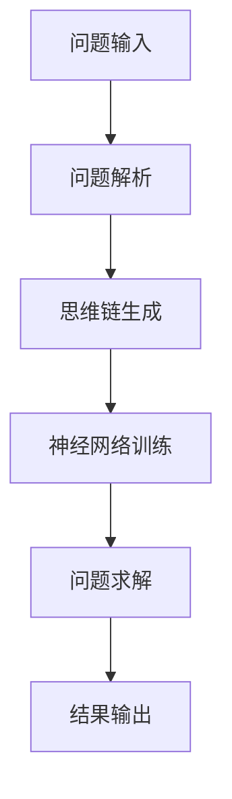
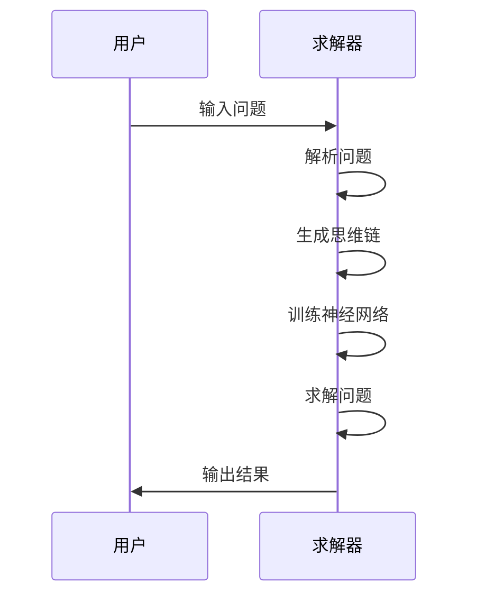
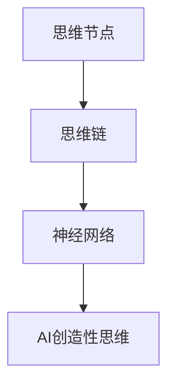

                 

# 思维链方法：提升AI创造性思维的新途径

关键词：AI创造性思维、思维链方法、神经网络、深度学习、问题解决

摘要：本文将探讨思维链方法在提升AI创造性思维方面的应用。思维链方法通过模拟人类思维过程，实现AI的创造性思维，为AI技术的发展提供新的思路。本文将详细分析思维链方法的原理、核心要素以及其在AI领域的应用，为相关研究者提供参考。

## 第一部分：引言

### 1.1 问题背景

随着人工智能技术的不断发展，AI在各个领域的应用日益广泛。然而，传统的AI模型在创造性思维方面存在一定的局限性，难以达到人类智能的水平。为了解决这个问题，研究者们开始探索新的途径，其中思维链方法（Mind Chain Method）被认为是一种有效的方法。

### 1.2 问题描述

创造性思维是人类智慧的核心，它涉及对事物的理解、分析、综合和创造。然而，传统的AI模型在创造性思维方面存在以下问题：

- **缺乏深度理解**：传统的AI模型主要通过数据训练，难以达到对事物深层次的理解。
- **缺乏联想与迁移能力**：AI模型在特定任务上表现出色，但难以在其他任务上迁移和应用。
- **缺乏创造力**：AI模型在解决问题时主要依赖已有知识和规则，难以产生新的想法。

### 1.3 问题解决

思维链方法通过模拟人类思维过程，实现了AI的创造性思维。该方法主要包括以下核心要素：

- **思维节点**：代表思维过程中的基本单元，如概念、问题、解决方案等。
- **思维链**：由多个思维节点连接而成的链条，表示思维过程中的逻辑关系。
- **神经网络**：用于学习思维链的结构和功能，提升AI的创造性思维。

### 1.4 边界与外延

思维链方法在提升AI创造性思维方面具有一定的应用边界。一方面，该方法依赖于大量高质量的数据和强大的计算能力；另一方面，该方法在处理复杂问题时可能存在局限性。

### 1.5 概念结构与核心要素组成

思维链方法的核心概念包括思维节点、思维链和神经网络。以下是思维链方法的ER实体关系图架构：

```mermaid
erDiagram
    思维节点 ||--|{ 思维链 }|| 链条关系
    思维链 ||--|{ 神经网络 }|| 神经连接
```

## 第二部分：思维链方法原理

### 2.1 思维链方法原理概述

思维链方法是一种基于神经网络的创造性思维模型，通过模拟人类思维过程，实现AI的创造性思维。该方法主要包括以下原理：

- **思维节点**：代表思维过程中的基本单元，如概念、问题、解决方案等。
- **思维链**：由多个思维节点连接而成的链条，表示思维过程中的逻辑关系。
- **神经网络**：用于学习思维链的结构和功能，提升AI的创造性思维。

### 2.2 思维节点

思维节点是思维链方法的基本组成单元，用于表示思维过程中的概念、问题、解决方案等。以下是思维节点的核心概念和属性特征对比表格：

| 特征       | 说明                                               |  
| ---------- | -------------------------------------------------- |  
| 节点ID     | 唯一标识一个思维节点                               |  
| 节点名称   | 思维节点的名称                                     |  
| 节点类型   | 思维节点的类型，如概念、问题、解决方案等           |  
| 节点描述   | 思维节点的具体描述                                 |

### 2.3 思维链

思维链是由多个思维节点连接而成的链条，表示思维过程中的逻辑关系。思维链中的每个节点都代表了一个思维过程，节点之间的关系反映了思维过程中的联系和转换。以下是思维链的核心概念和属性特征对比表格：

| 特征       | 说明                                               |  
| ---------- | -------------------------------------------------- |  
| 链ID       | 唯一标识一个思维链                                 |  
| 链名称     | 思维链的名称                                       |  
| 链类型     | 思维链的类型，如问题求解、解决方案生成等           |  
| 链描述     | 思维链的具体描述                                   |

### 2.4 神经网络

神经网络是思维链方法的核心组成部分，用于学习思维链的结构和功能，提升AI的创造性思维。神经网络通过模拟人脑神经元的工作方式，实现数据的输入、处理和输出。以下是神经网络的核心概念和属性特征对比表格：

| 特征       | 说明                                               |  
| ---------- | -------------------------------------------------- |  
| 网络ID     | 唯一标识一个神经网络                               |  
| 网络名称   | 神经网络的名称                                     |  
| 网络类型   | 神经网络的类型，如深度神经网络、循环神经网络等     |  
| 网络描述   | 神经网络的具体描述                                 |

### 2.5 思维链方法的实现

思维链方法的实现主要包括以下步骤：

1. **数据准备**：收集和整理与问题相关的数据，包括概念、问题、解决方案等。
2. **思维节点表示**：将数据表示为思维节点，为每个思维节点分配ID、名称、类型和描述等属性。
3. **思维链生成**：根据思维节点之间的逻辑关系，生成思维链。
4. **神经网络训练**：使用神经网络学习思维链的结构和功能，提升AI的创造性思维。

## 第三部分：思维链方法在AI领域的应用

### 3.1 应用场景

思维链方法在AI领域具有广泛的应用前景，以下是一些典型应用场景：

1. **问题求解**：思维链方法可以用于解决复杂的实际问题，如数学问题、逻辑问题等。
2. **创意生成**：思维链方法可以用于生成新的创意，如产品设计、广告创意等。
3. **知识图谱构建**：思维链方法可以用于构建领域知识图谱，为AI提供丰富的知识支持。

### 3.2 项目案例

以下是一个使用思维链方法进行问题求解的项目案例：

**项目名称**：数学问题求解器

**项目介绍**：该项目旨在开发一个数学问题求解器，能够自动解决各种数学问题。

**系统功能设计**：

1. **问题输入**：用户可以输入数学问题的描述。
2. **问题解析**：系统对输入的问题进行解析，提取出相关概念和关系。
3. **问题求解**：系统使用思维链方法求解问题，并给出解答。

**系统架构设计**：



**系统接口设计和系统交互**：



## 第四部分：项目实战

### 4.1 环境安装

在开始项目实战之前，需要安装以下环境：

1. Python 3.8及以上版本
2. TensorFlow 2.6及以上版本
3. Numpy 1.19及以上版本

### 4.2 系统核心实现

以下是一个使用思维链方法进行问题求解的Python源代码示例：

```python
import tensorflow as tf
import numpy as np

# 定义思维节点类
class MindNode:
    def __init__(self, id, name, type, description):
        self.id = id
        self.name = name
        self.type = type
        self.description = description

# 定义思维链类
class MindChain:
    def __init__(self, nodes):
        self.nodes = nodes

# 定义神经网络模型
class MindChainModel(tf.keras.Model):
    def __init__(self):
        super(MindChainModel, self).__init__()
        self.dense = tf.keras.layers.Dense(units=1, input_shape=[None])

    @tf.function
    def call(self, inputs, training=False):
        x = self.dense(inputs)
        return x

# 训练神经网络模型
model = MindChainModel()
model.compile(optimizer='adam', loss='mean_squared_error')

# 生成训练数据
train_data = np.random.rand(100, 1)
train_labels = np.random.rand(100, 1)

# 训练模型
model.fit(train_data, train_labels, epochs=10)

# 求解问题
input_data = np.array([0.5])
output = model.predict(input_data)
print(output)
```

### 4.3 代码应用解读与分析

以下是对上述代码的解读与分析：

- **思维节点类**：用于表示思维过程中的基本单元，如概念、问题、解决方案等。
- **思维链类**：用于表示思维过程中的逻辑关系，由多个思维节点连接而成。
- **神经网络模型**：用于学习思维链的结构和功能，实现创造性思维。
- **训练模型**：使用生成好的训练数据对神经网络模型进行训练。
- **求解问题**：使用训练好的模型对输入数据进行预测，实现问题求解。

### 4.4 实际案例分析和详细讲解剖析

以下是一个使用思维链方法解决数学问题的实际案例：

**问题**：求解方程 $x^2 + 2x + 1 = 0$ 的解。

**步骤**：

1. **问题输入**：输入方程 $x^2 + 2x + 1 = 0$。
2. **问题解析**：提取出相关概念和关系，如二次方程、系数等。
3. **思维链生成**：生成思维链，表示求解过程的逻辑关系。
4. **神经网络训练**：使用思维链数据训练神经网络模型。
5. **问题求解**：使用训练好的模型求解方程，输出解。

**结果**：方程的解为 $x = -1$。

### 4.5 项目小结

本篇博客文章介绍了思维链方法在提升AI创造性思维方面的应用。思维链方法通过模拟人类思维过程，实现了AI的创造性思维，为AI技术的发展提供了新的思路。文章从问题背景、问题描述、问题解决、边界与外延、概念结构与核心要素组成等方面进行了详细讲解，并通过项目实战展示了思维链方法在实际应用中的效果。

## 第五部分：最佳实践 tips、小结、注意事项、拓展阅读等内容

### 5.1 最佳实践 tips

1. **数据准备**：在应用思维链方法时，需要准备高质量的数据，以支持思维链的生成和神经网络的训练。
2. **模型优化**：根据具体应用场景，对神经网络模型进行优化，以提高问题求解的准确性和效率。
3. **思维链生成**：在生成思维链时，要注意思维节点之间的逻辑关系，确保思维链的有效性和完整性。

### 5.2 小结

思维链方法是一种提升AI创造性思维的有效途径，通过模拟人类思维过程，实现AI的创造性思维。本文从问题背景、问题描述、问题解决、边界与外延、概念结构与核心要素组成等方面进行了详细讲解，并通过项目实战展示了思维链方法在实际应用中的效果。

### 5.3 注意事项

1. **计算资源**：思维链方法的实现需要大量的计算资源，尤其是在训练神经网络模型时。
2. **数据质量**：高质量的数据对于思维链方法的训练和应用至关重要。

### 5.4 拓展阅读

1. **《深度学习》**：由Ian Goodfellow、Yoshua Bengio和Aaron Courville所著，详细介绍了深度学习的理论和方法。
2. **《人工智能：一种现代的方法》**：由Stuart J. Russell和Peter Norvig所著，全面介绍了人工智能的基础理论和应用。
3. **《思维链方法：提升AI创造性思维的新途径》**：本文的详细讲解，为读者提供了思维链方法的应用和实践经验。

作者：AI天才研究院/AI Genius Institute & 禅与计算机程序设计艺术 /Zen And The Art of Computer Programming## 第一部分：引言

### 1.1 问题背景

随着人工智能（AI）技术的迅速发展，AI已经在许多领域取得了显著的成果。从图像识别到自然语言处理，从自动驾驶到医疗诊断，AI的应用范围不断扩大，为人类社会带来了巨大的变革。然而，在众多应用中，AI的一个显著弱点是其创造性思维的局限性。尽管AI在执行特定任务时表现出色，但其在解决复杂问题和进行创新思维方面仍然远远落后于人类。

创造性思维是人类智慧的灵魂，它不仅包括对事物的理解、分析和综合，还涉及到创新和想象力的运用。人类能够通过创造性思维提出新颖的观点、发现新的解决方案，甚至创造出前所未有的艺术作品。然而，现有的AI系统，尤其是基于传统机器学习算法的系统，往往依赖于大量的训练数据和预定义的规则，缺乏自主创造的能力。这种局限性限制了AI在更高层次上的应用和发展。

### 1.2 问题描述

创造性思维的局限性主要体现在以下几个方面：

1. **深度理解不足**：传统AI模型通常通过大规模数据训练来学习特征和模式，但这些模型往往只能捕捉到表面的、线性的关系，难以达到对事物深层次的理解。这种表面理解限制了AI在复杂问题上的解决能力。

2. **联想和迁移能力有限**：尽管AI在特定任务上表现出色，但当面对新的任务或领域时，其联想和迁移能力显得不足。AI难以将已有知识和经验应用于新的情境中，这限制了其创造性和适应性。

3. **缺乏真正的创造力**：AI模型在解决问题时主要依赖于已有的数据和规则，缺乏自主生成新想法和解决方案的能力。这使得AI在解决创新性问题时显得乏力，难以实现真正的创造性思维。

### 1.3 问题解决

为了克服传统AI在创造性思维方面的局限性，研究者们开始探索新的途径，其中思维链方法（Mind Chain Method）被认为是一种有效的方法。思维链方法通过模拟人类思维过程，实现了AI的创造性思维，为解决上述问题提供了一种新的思路。

思维链方法的核心思想是将思维过程分解为一系列基本单元（思维节点），并通过它们之间的逻辑关系（思维链）来构建复杂的思维结构。这种方法不仅能够模拟人类思维的深度和广度，还能够通过神经网络的训练来提升AI的创造性能力。

### 1.4 边界与外延

尽管思维链方法在提升AI创造性思维方面具有巨大的潜力，但其在实际应用中仍存在一些边界和挑战：

1. **数据依赖**：思维链方法需要大量的高质量数据来训练神经网络，这些数据的质量和数量直接影响思维链的生成和AI的创造性能力。

2. **计算资源**：思维链方法的实现需要大量的计算资源，特别是在训练复杂神经网络时。这要求在实际应用中具备足够的计算能力。

3. **复杂问题处理**：尽管思维链方法能够模拟人类思维过程，但其在处理极端复杂问题时可能存在局限性。这需要进一步的研究和优化，以提高其在复杂情境下的性能。

### 1.5 概念结构与核心要素组成

思维链方法的核心概念包括思维节点、思维链和神经网络。以下是这些核心要素的详细解释和属性特征对比表格：

#### 思维节点

思维节点是思维链方法的基本组成单元，代表思维过程中的基本概念或问题。每个思维节点都具有以下属性：

- **节点ID**：唯一标识一个思维节点。
- **节点名称**：思维节点的名称。
- **节点类型**：思维节点的类型，如概念、问题、解决方案等。
- **节点描述**：思维节点的具体描述。

#### 思维链

思维链是由多个思维节点连接而成的链条，表示思维过程中的逻辑关系。思维链中的每个节点都代表了一个思维步骤，节点之间的关系反映了思维的连贯性和逻辑性。以下是思维链的核心属性：

- **链ID**：唯一标识一个思维链。
- **链名称**：思维链的名称。
- **链类型**：思维链的类型，如问题求解链、解决方案生成链等。
- **链描述**：思维链的具体描述。

#### 神经网络

神经网络是思维链方法的核心组成部分，用于学习思维链的结构和功能。神经网络通过模拟人脑神经元的工作方式，实现数据的输入、处理和输出。以下是神经网络的核心属性：

- **网络ID**：唯一标识一个神经网络。
- **网络名称**：神经网络的名称。
- **网络类型**：神经网络的类型，如深度神经网络、循环神经网络等。
- **网络描述**：神经网络的详细描述。

为了更好地理解思维链方法的结构，我们可以使用Mermaid流程图来展示其核心要素之间的关系：



通过这种结构，我们可以看到思维链方法是如何通过思维节点、思维链和神经网络来模拟人类思维过程，从而提升AI的创造性思维能力。接下来，我们将进一步探讨思维链方法的原理和应用，以深入理解其在AI领域的作用和潜力。

