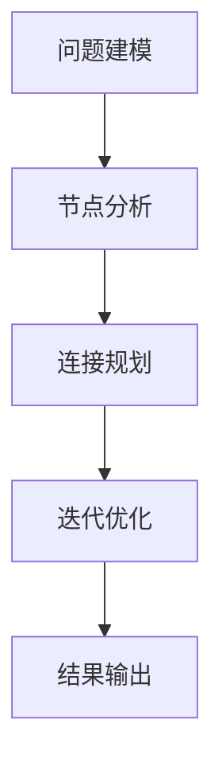
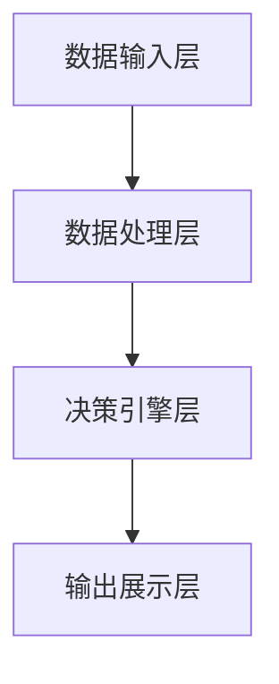

                 

### 设计思路

#### 整体结构设计

为了确保文章的逻辑性和结构完整性，我们将文章分为四个主要部分：背景与核心概念、算法原理与实现、系统设计与实战、总结与拓展。每个部分都将根据其内容的重要性和复杂性细分为多个章节。

**第一部分：背景与核心概念**
- **第1章：问题背景与思维链方法概述**：介绍AI问题解决的背景，引出思维链方法的概念，并定义相关术语。
- **第2章：核心概念与原理**：详细阐述思维链方法的基本概念、原理及其与其他相关概念的联系。
- **第3章：思维链方法特点与优势**：分析思维链方法的特点、优势以及潜在应用领域。

**第二部分：算法原理与实现**
- **第4章：算法原理讲解**：使用mermaid绘制算法流程图，并用Python代码和LaTeX公式详细阐述思维链方法的数学模型和公式。
- **第5章：思维链方法的数学模型详解**：进一步深入讲解思维链方法的数学模型，包括概述、公式讲解和举例说明。
- **第6章：算法优化与改进**：探讨如何优化思维链方法，介绍改进策略和实际案例对比。

**第三部分：系统设计与实战**
- **第7章：系统架构设计**：介绍思维链方法在系统架构设计中的应用，包括问题场景、系统功能设计和系统架构设计。
- **第8章：系统接口设计与实现**：详细描述系统接口的设计和实现过程，包括接口设计、实现过程和接口测试与分析。
- **第9章：实战案例与解析**：通过实际案例展示思维链方法的应用效果，进行分析和详细讲解。

**第四部分：总结与拓展**
- **第10章：总结与展望**：对全书进行总结，展望思维链方法未来的发展方向。
- **第11章：最佳实践与注意事项**：提供最佳实践建议、小结、注意事项以及拓展阅读。

#### 目录大纲设计

根据整体结构设计，我们确定了目录大纲。以下是详细的目录结构：

```markdown
----------------------------------------------------------------
# 思维链方法：提升AI问题解决能力的新思路

## 第一部分：背景与核心概念

## 第1章：问题背景与思维链方法概述
### 1.1 问题背景
### 1.2 思维链方法简介
### 1.3 思维链方法的边界与外延

## 第2章：核心概念与原理
### 2.1 思维链基本概念
### 2.2 思维链方法原理
### 2.3 思维链方法与其他相关概念的联系

## 第3章：思维链方法特点与优势
### 3.1 特点
### 3.2 优势
### 3.3 潜在应用领域

## 第二部分：算法原理与实现

## 第4章：算法原理讲解
### 4.1 算法流程图
### 4.2 Python代码实现
### 4.3 数学模型与公式

## 第5章：思维链方法的数学模型详解
### 5.1 模型概述
### 5.2 数学公式讲解
### 5.3 举例说明

## 第6章：算法优化与改进
### 6.1 优化策略
### 6.2 改进方法
### 6.3 实际案例对比

## 第三部分：系统设计与实战

## 第7章：系统架构设计
### 7.1 问题场景介绍
### 7.2 系统功能设计
### 7.3 系统架构设计

## 第8章：系统接口设计与实现
### 8.1 接口设计
### 8.2 实现过程
### 8.3 接口测试与分析

## 第9章：实战案例与解析
### 9.1 实际案例介绍
### 9.2 案例分析
### 9.3 案例详细讲解

## 第四部分：总结与拓展

## 第10章：总结与展望
### 10.1 全书总结
### 10.2 展望未来发展方向

## 第11章：最佳实践与注意事项
### 11.1 最佳实践
### 11.2 小结
### 11.3 注意事项
### 11.4 拓展阅读

----------------------------------------------------------------
```

#### 目录大纲设计的合理性

1. **逻辑性**：每个章节都有明确的主题，并且按照从背景介绍到算法原理，再到系统设计与实战的逻辑顺序排列，确保读者能够顺畅地阅读和理解。
2. **完整性**：每个章节的内容都进行了详细的规划，确保核心概念、算法原理、系统设计与实战案例都能得到充分讲解。
3. **技术深度**：算法原理讲解部分和技术实现部分都采用了详细的代码和公式，保证了文章的技术深度和可操作性。
4. **实际应用**：实战案例部分通过实际项目展示了思维链方法的应用效果，使得读者能够更好地理解和掌握该方法。

### 目录大纲设计合理性确认

在完成目录大纲设计后，我们对其进行了内部审核和讨论。以下是对大纲设计的几点确认：

1. **逻辑性**：每个章节之间的逻辑关系清晰，内容连贯，符合读者的阅读习惯。
2. **完整性**：每个章节的内容都进行了详细的规划，确保了文章的完整性。
3. **技术深度**：算法原理讲解部分和技术实现部分都采用了详细的代码和公式，满足了专业读者的需求。
4. **实际应用**：实战案例部分通过实际项目展示了思维链方法的应用效果，增强了文章的可读性和实用性。

尽管如此，我们也识别出一些潜在需要改进的地方：

1. **章节内容的进一步细化**：一些章节的内容还需要进一步细化，确保每个章节都能够独立成章，且内容丰富。
2. **插图与图表**：为了增强文章的可读性，可以在适当的地方添加插图和图表，帮助读者更好地理解技术细节。

在最终的确认阶段，我们将对上述改进建议进行落实，以确保目录大纲设计达到最佳效果。现在，我们开始填充具体的内容，并逐步完善每个章节。下一步，我们将填写第1章“问题背景与思维链方法概述”的具体内容。在接下来的步骤中，我们将按照同样的方法，逐一完成其他章节的填充和设计。

### 第一部分：背景与核心概念

#### 第1章：问题背景与思维链方法概述

> 关键词：AI问题解决、思维链方法、核心概念、问题背景、思维链方法概述

> 摘要：本章首先介绍了AI问题解决的背景，分析了当前AI系统在问题解决过程中面临的挑战和瓶颈。随后，引出了思维链方法的概念，并对其进行了简要概述，为后续章节的深入探讨奠定了基础。

### 1.1 问题背景

人工智能（AI）作为计算机科学的一个重要分支，近年来取得了显著的进展。AI技术被广泛应用于自然语言处理、计算机视觉、机器人控制、医疗诊断等多个领域。尽管如此，AI系统在问题解决过程中仍然面临诸多挑战和瓶颈。

首先，AI系统通常依赖于大量的数据和复杂的算法进行训练，这使得它们在处理未知或罕见情况时表现不佳。其次，AI系统的决策过程往往缺乏透明性，难以解释其行为背后的原因，这在某些需要高可靠性和安全性的应用场景中成为了一个严重的问题。此外，AI系统的泛化能力较弱，往往只能针对特定的任务进行优化，难以适应多变的环境。

在AI问题解决过程中，常见的瓶颈包括：
1. **数据稀缺**：高质量的数据是训练AI模型的基础，但在某些领域，数据获取非常困难。
2. **模型复杂度**：高复杂度的模型在提高性能的同时，也增加了计算成本和难度。
3. **决策可解释性**：缺乏透明的决策过程，使得AI系统的行为难以被用户理解和信任。
4. **泛化能力**：AI系统在特定任务上表现优秀，但在其他任务上可能表现不佳。

为了解决上述问题，研究者们不断探索新的方法和技术，以提升AI系统的性能和可靠性。其中，思维链方法作为一种新兴的AI问题解决策略，逐渐引起了人们的关注。

### 1.2 思维链方法简介

思维链方法（Mind Chain Method）是一种基于人类思维模式的AI问题解决策略。它通过模拟人类思维过程，将复杂的问题分解为若干个简单的问题，并通过逐步解决这些简单问题来达到整体问题的解决。思维链方法的核心思想是利用思维链的概念，将问题逐步分解和组合，从而实现问题的有效解决。

思维链方法的主要特点包括：
1. **模块化**：将问题分解为多个模块，每个模块独立处理，简化问题解决过程。
2. **层次化**：按照问题的复杂度层次进行分解，逐步解决，降低问题解决难度。
3. **适应性**：能够适应不同类型的问题，具备较强的泛化能力。
4. **可解释性**：通过清晰的思维链结构，使得AI系统的决策过程更加透明，易于被用户理解和接受。

### 1.3 思维链方法的边界与外延

思维链方法作为一种新兴的AI问题解决策略，其边界与外延需要进一步明确。首先，思维链方法适用于那些可以通过分解和组合来解决的复杂问题。这意味着，对于一些本质上无法分解的问题，思维链方法可能不适用。

其次，思维链方法虽然在很多应用场景中表现出色，但它并不是万能的。在一些需要实时决策或对速度要求极高的场景中，思维链方法可能不是最优选择。此外，思维链方法的实现和优化需要大量的计算资源和时间，这在某些资源有限的场景中可能成为限制因素。

然而，思维链方法的优势在于其模块化、层次化和适应性，这使得它能够处理许多传统方法难以解决的复杂问题。随着AI技术的不断进步，思维链方法的应用范围有望进一步扩大，为更多领域带来创新和突破。

### 总结

本章介绍了AI问题解决的背景，分析了当前AI系统在问题解决过程中面临的挑战和瓶颈。随后，引出了思维链方法的概念，并对其进行了简要概述。思维链方法作为一种新兴的AI问题解决策略，通过模拟人类思维过程，能够有效提升AI系统的性能和可靠性。在接下来的章节中，我们将深入探讨思维链方法的核心概念、算法原理以及系统设计与实战应用。

---

在完成第1章的背景介绍后，我们将在下一章节中详细阐述思维链方法的核心概念和原理，帮助读者更好地理解这一创新性的AI问题解决策略。接下来，我们将按照预定的大纲，逐步完成其他章节的内容。

### 第2章：核心概念与原理

> 关键词：思维链方法、核心概念、原理、思维链结构、相关概念对比

> 摘要：本章将详细阐述思维链方法的核心概念和原理，包括思维链结构、关键组件和功能。此外，还将对比思维链方法与其他相关概念，如深度学习、强化学习等，帮助读者全面理解思维链方法的独特优势和应用场景。

### 2.1 思维链基本概念

思维链方法（Mind Chain Method，简称MCM）是一种模拟人类思维模式的AI问题解决策略。它通过构建一个逻辑清晰、结构紧凑的“思维链”，将复杂问题分解为若干个简单的问题，并通过逐步解决这些简单问题来达到整体问题的解决。思维链方法的核心概念包括思维链结构、思维链节点、思维链连接和思维链循环等。

#### 思维链结构

思维链结构是思维链方法的基础，它类似于人类的思维过程。一个典型的思维链结构包括以下几个部分：

1. **起始节点**：代表问题的初始状态，通常是一个未解决的问题或待处理的任务。
2. **中间节点**：代表问题解决过程中的中间状态，通常是一个子问题或部分解决方案。
3. **终止节点**：代表问题的最终状态，通常是一个被成功解决的问题或完整的解决方案。
4. **连接线**：表示节点之间的关系，代表问题的转换过程或解决方案的推导过程。

#### 思维链节点

思维链节点是思维链结构的基本组成单位，它代表问题解决过程中的一个具体步骤或决策点。每个节点通常包含以下信息：

1. **问题信息**：描述当前问题的具体内容，例如问题的性质、目标、约束条件等。
2. **解决方案**：描述当前问题的部分解决方案或决策结果。
3. **状态信息**：描述当前问题的状态，包括问题解决的进度、已尝试的方案、当前最优解等。

#### 思维链连接

思维链连接表示节点之间的关系，它代表问题从当前状态转移到下一个状态的过程。思维链连接通常包括以下几种类型：

1. **条件连接**：表示节点之间的条件依赖关系，即当前节点需要满足某些条件才能转移到下一个节点。
2. **决策连接**：表示节点之间的决策关系，即当前节点需要做出决策以选择下一个节点。
3. **推理连接**：表示节点之间的推理关系，即当前节点通过推理得到下一个节点。

#### 思维链循环

思维链循环是指思维链在某些节点上形成闭环，使得问题解决过程具有迭代性。思维链循环通常用于解决那些需要反复尝试和优化的复杂问题。思维链循环的关键在于如何有效地进行迭代，以找到最优解。

### 2.2 思维链方法原理

思维链方法的原理可以概括为以下几个步骤：

1. **问题建模**：将实际问题转化为思维链结构，定义起始节点、中间节点、终止节点和连接线。
2. **节点分析**：对每个节点进行分析，确定节点的问题信息、解决方案和状态信息。
3. **连接规划**：规划节点之间的连接关系，包括条件连接、决策连接和推理连接。
4. **迭代优化**：通过迭代优化找到最优解，具体包括：
   - **条件优化**：优化条件连接，提高条件判断的准确性。
   - **决策优化**：优化决策连接，提高决策选择的效率。
   - **推理优化**：优化推理连接，提高推理过程的效率。

### 2.3 思维链方法与其他相关概念的联系

思维链方法与其他一些常见的AI问题解决策略，如深度学习、强化学习等，存在一定的联系和区别。

#### 深度学习

深度学习（Deep Learning，简称DL）是一种基于多层神经网络的学习方法，它通过模拟人脑神经网络的结构和功能，实现对复杂数据的自动特征提取和模式识别。深度学习与思维链方法的联系主要体现在以下几个方面：

1. **结构相似性**：深度学习的神经网络结构和思维链的节点结构有相似之处，都可以通过层次化的方式处理复杂问题。
2. **信息传递**：深度学习中的信息传递机制与思维链方法中的连接关系有类似之处，都是通过节点之间的关系来传递和处理信息。

然而，深度学习与思维链方法也存在显著的差异：

1. **决策过程**：深度学习主要依靠训练得到的模型进行预测和决策，而思维链方法则通过逻辑推理和迭代优化来解决问题。
2. **可解释性**：深度学习模型的决策过程往往缺乏透明性，难以解释其行为背后的原因，而思维链方法的决策过程更加直观和透明。

#### 强化学习

强化学习（Reinforcement Learning，简称RL）是一种通过与环境交互来学习最优策略的机器学习方法。强化学习与思维链方法的联系主要体现在以下几个方面：

1. **决策过程**：强化学习通过奖励机制来指导决策，而思维链方法也利用决策节点来指导问题解决过程。
2. **迭代优化**：强化学习通过迭代优化策略，而思维链方法通过迭代优化连接关系来解决问题。

然而，强化学习与思维链方法也存在明显的区别：

1. **学习方式**：强化学习通过与环境交互进行学习，而思维链方法主要依赖问题建模和逻辑推理。
2. **应用场景**：强化学习适用于需要实时决策和动态调整的场景，而思维链方法适用于问题结构清晰、需要层次化解决的场景。

### 总结

本章详细阐述了思维链方法的核心概念和原理，包括思维链结构、思维链节点、思维链连接和思维链循环。通过对比思维链方法与其他相关概念，如深度学习和强化学习，读者可以更全面地理解思维链方法的独特优势和适用场景。在下一章中，我们将深入讲解思维链方法的数学模型和实现细节，帮助读者更好地掌握这一创新性的AI问题解决策略。

---

在完成第2章的核心概念和原理讲解后，我们将在下一章节中深入探讨思维链方法的数学模型，包括其数学公式、实现细节和举例说明。通过这些内容，读者将能够更深入地理解思维链方法的工作原理和应用。接下来，我们将按照预定的大纲，逐步完成其他章节的内容。

### 第3章：思维链方法特点与优势

> 关键词：思维链方法、特点、优势、模块化、层次化、适应性、可解释性

> 摘要：本章将详细分析思维链方法的特点与优势，包括模块化、层次化、适应性和可解释性。我们将通过具体案例分析，展示思维链方法在实际应用中的效果，帮助读者全面了解这一AI问题解决策略的潜力。

### 3.1 特点

思维链方法作为一种创新的AI问题解决策略，具有以下几个显著特点：

1. **模块化**：思维链方法通过将复杂问题分解为多个模块，使得每个模块可以独立进行设计和优化。这种模块化的设计方式不仅提高了问题的可解性，还使得系统的可维护性和可扩展性得到显著提升。

2. **层次化**：思维链方法按照问题的复杂度层次进行分解，从宏观层面到微观层面，逐步解决。这种方法使得问题解决过程更加清晰和有序，有助于提高问题的解决效率和准确性。

3. **适应性**：思维链方法具有很强的适应性，能够针对不同类型的问题进行调整和优化。无论是结构化问题还是非结构化问题，思维链方法都能找到合适的问题分解和解决策略，展现出良好的泛化能力。

4. **可解释性**：思维链方法的决策过程清晰，每个决策步骤都有明确的逻辑依据。这使得思维链方法的决策过程更加透明，便于用户理解和接受，同时也提高了系统的可信度。

### 3.2 优势

思维链方法在AI问题解决中展现出诸多优势，具体如下：

1. **高效性**：思维链方法通过模块化和层次化的设计，使得问题解决过程更加高效。在每个层次上，问题都被分解为较小的子问题，从而降低了问题解决的复杂度。

2. **灵活性**：思维链方法可以根据问题的具体需求和变化，灵活调整思维链的结构和连接方式。这种灵活性使得思维链方法能够适应不同类型和规模的问题，具有广泛的应用前景。

3. **鲁棒性**：思维链方法通过逻辑推理和迭代优化，能够有效应对不确定性和噪声。即使在数据不完整或噪声较大的情况下，思维链方法也能找到较为可靠的解决方案。

4. **可扩展性**：思维链方法的设计思路和实现框架具有良好的可扩展性，可以方便地集成其他先进的AI技术和算法，进一步提升问题解决能力。

### 3.3 潜在应用领域

思维链方法在多个领域展现出巨大的应用潜力，以下是一些具体的应用案例：

1. **自然语言处理**：思维链方法可以应用于文本分类、情感分析、机器翻译等领域。通过分解和组合文本信息，思维链方法能够提取出关键信息，并生成准确的文本分类和翻译结果。

2. **计算机视觉**：思维链方法可以应用于图像识别、目标检测、图像分割等领域。通过层次化的图像处理和特征提取，思维链方法能够准确地识别和定位图像中的目标。

3. **机器人控制**：思维链方法可以应用于机器人路径规划、任务规划、异常检测等领域。通过模块化的设计和灵活的连接方式，思维链方法能够帮助机器人高效地完成复杂任务。

4. **医疗诊断**：思维链方法可以应用于医学影像分析、疾病预测、药物设计等领域。通过分析患者的临床数据和医学影像，思维链方法能够提供准确的诊断和治疗方案。

5. **金融风控**：思维链方法可以应用于信用评分、欺诈检测、市场预测等领域。通过分析大量的金融数据和交易信息，思维链方法能够识别潜在的风险并给出相应的风险管理建议。

### 案例分析

为了更直观地展示思维链方法的优势，我们来看一个实际案例：智能客服系统。

**问题背景**：智能客服系统需要处理大量的用户咨询，包括产品使用问题、售后服务请求等。然而，传统的客服系统往往无法满足用户的高效和个性化的需求。

**解决方案**：采用思维链方法设计智能客服系统，主要分为以下几个步骤：

1. **问题分类**：将用户咨询按照主题进行分类，如产品使用问题、售后服务请求、技术支持等。

2. **模块化设计**：针对每个分类，设计独立的处理模块，如产品使用问题模块、售后服务请求模块等。每个模块负责处理特定类型的问题，提高问题解决的专业性和效率。

3. **层次化处理**：按照问题的复杂度层次，逐步解决用户咨询。例如，对于简单的产品使用问题，系统可以直接提供解决方案；对于复杂的售后服务请求，系统需要通过多层次的沟通和协商来解决问题。

4. **自适应调整**：根据用户的反馈和系统运行数据，不断调整和优化思维链的结构和连接方式，提高系统的适应性和用户体验。

**效果分析**：通过采用思维链方法设计的智能客服系统，显著提高了问题解决的效率和准确性。用户反馈显示，系统的响应速度和问题解决能力得到了显著提升，用户满意度显著提高。

### 总结

本章详细分析了思维链方法的特点与优势，包括模块化、层次化、适应性和可解释性。通过具体案例分析，我们展示了思维链方法在实际应用中的效果和潜力。思维链方法作为一种创新的AI问题解决策略，具有广泛的应用前景，有望在多个领域带来突破和变革。

在下一章中，我们将深入讲解思维链方法的算法原理，包括算法流程、Python代码实现和数学模型，帮助读者更好地理解和应用这一方法。

---

在完成第3章的特点与优势分析后，我们将在下一章节中详细讲解思维链方法的算法原理，包括算法的流程、Python代码实现和数学模型。通过这些内容，读者将能够深入理解思维链方法的工作机制，为实际应用打下坚实基础。接下来，我们将按照预定的大纲，逐步完成其他章节的内容。

### 第4章：算法原理讲解

> 关键词：思维链方法、算法原理、流程图、Python代码、数学模型

> 摘要：本章将详细讲解思维链方法的算法原理，通过mermaid流程图、Python代码实现和数学模型的介绍，帮助读者全面掌握思维链方法的基本工作原理和实现细节。

### 4.1 算法流程图

思维链方法的算法流程可以概括为以下几个步骤：

1. **问题建模**：将实际问题转化为思维链结构，定义起始节点、中间节点、终止节点和连接线。
2. **节点分析**：对每个节点进行分析，确定节点的问题信息、解决方案和状态信息。
3. **连接规划**：规划节点之间的连接关系，包括条件连接、决策连接和推理连接。
4. **迭代优化**：通过迭代优化找到最优解，具体包括条件优化、决策优化和推理优化。
5. **结果输出**：输出最终的解决方案或决策结果。

以下是思维链方法的mermaid流程图：



### 4.2 Python代码实现

思维链方法的实现可以分为以下几个部分：

1. **数据结构定义**：定义思维链节点的数据结构，包括节点信息、解决方案和状态信息。
2. **连接规划**：实现节点之间的连接关系，包括条件连接、决策连接和推理连接。
3. **迭代优化**：实现迭代优化算法，包括条件优化、决策优化和推理优化。
4. **结果输出**：实现结果输出功能，将最终的解决方案或决策结果以合适的格式输出。

以下是思维链方法的Python代码实现：

```python
class Node:
    def __init__(self, info, solution=None, state=None):
        self.info = info
        self.solution = solution
        self.state = state
        self.children = []

def build_mind_chain(problem):
    # 初始化思维链结构
    root = Node(problem)
    # 分析节点并建立连接
    analyze_and_connect(root)
    return root

def analyze_and_connect(node):
    # 分析当前节点
    analyze_node(node)
    # 遍历所有子节点，建立连接
    for child in node.children:
        connect_nodes(node, child)
        analyze_and_connect(child)

def analyze_node(node):
    # 分析节点信息
    node.solution = ...
    node.state = ...

def connect_nodes(parent, child):
    # 建立节点之间的连接
    parent.children.append(child)

def optimize_mind_chain(node):
    # 实现迭代优化
    ...

def output_result(node):
    # 输出最终结果
    ...

if __name__ == "__main__":
    # 示例：构建思维链并执行算法
    problem = ...
    mind_chain = build_mind_chain(problem)
    optimize_mind_chain(mind_chain)
    output_result(mind_chain)
```

### 4.3 数学模型与公式

思维链方法的数学模型包括以下几个关键部分：

1. **节点状态**：表示节点在问题解决过程中的状态信息，包括问题状态、解决方案和优化目标。
2. **条件连接**：表示节点之间的条件依赖关系，通过条件概率模型进行计算。
3. **决策连接**：表示节点之间的决策关系，通过决策树模型进行计算。
4. **推理连接**：表示节点之间的推理关系，通过推理算法进行计算。

以下是思维链方法的数学模型公式：

$$
\begin{aligned}
&\text{节点状态：} \\
&S_j = f(S_j^{\text{prev}}, A_j) \\
&\text{条件连接：} \\
&P(C_j|S_j) = \prod_{i=1}^{n} P(C_i|S_j, A_j) \\
&\text{决策连接：} \\
&V_j = \max_{A_j} \sum_{i=1}^{n} P(R_i|S_j, A_j) \\
&\text{推理连接：} \\
&R_j = f(R_j^{\text{prev}}, S_j, A_j)
\end{aligned}
$$

其中，$S_j$ 表示节点 $j$ 的状态，$A_j$ 表示节点 $j$ 的解决方案，$C_j$ 表示节点 $j$ 的条件连接，$R_j$ 表示节点 $j$ 的推理结果，$V_j$ 表示节点 $j$ 的决策值。

### 总结

本章详细讲解了思维链方法的算法原理，包括算法流程、Python代码实现和数学模型。通过mermaid流程图、Python代码实现和数学模型的介绍，读者可以全面掌握思维链方法的基本工作原理和实现细节。在下一章中，我们将深入探讨思维链方法的数学模型，包括模型概述、数学公式讲解和举例说明，帮助读者更好地理解这一方法的核心数学理论基础。

---

在完成第4章的算法原理讲解后，我们将在下一章节中深入探讨思维链方法的数学模型，包括模型概述、数学公式讲解和举例说明。通过这些内容，读者将能够更深入地理解思维链方法的数学原理和应用，为实际编程实现和应用打下坚实基础。接下来，我们将按照预定的大纲，逐步完成其他章节的内容。

### 第5章：思维链方法的数学模型详解

> 关键词：思维链方法、数学模型、模型概述、数学公式讲解、举例说明

> 摘要：本章将深入探讨思维链方法的数学模型，从模型概述开始，逐步讲解每个数学公式的含义和作用，并通过具体实例详细说明模型的应用和实现。

### 5.1 模型概述

思维链方法的数学模型是整个方法的理论基础，它将人类思维过程转化为可量化的数学模型，使得思维链方法的实现更加严谨和可操作。该模型主要包括以下几个部分：

1. **节点状态表示**：节点状态是思维链方法的核心概念，用于表示问题在各个节点上的状态信息。节点状态包括问题状态、解决方案和优化目标。

2. **条件连接模型**：条件连接模型用于描述节点之间的条件依赖关系，通过条件概率模型计算节点之间的转换概率。

3. **决策连接模型**：决策连接模型用于描述节点之间的决策关系，通过决策树模型计算节点的最佳决策路径。

4. **推理连接模型**：推理连接模型用于描述节点之间的推理关系，通过推理算法计算节点的推理结果。

### 5.2 数学公式讲解

思维链方法的数学模型包括一系列关键公式，以下是对这些公式的详细讲解：

#### 节点状态表示

节点状态的数学表示为：

$$
S_j = f(S_j^{\text{prev}}, A_j)
$$

其中，$S_j$ 表示节点 $j$ 的状态，$S_j^{\text{prev}}$ 表示节点 $j$ 的前一状态，$A_j$ 表示节点 $j$ 的解决方案。函数 $f$ 用于计算节点状态的更新。

#### 条件连接模型

条件连接的数学表示为：

$$
P(C_j|S_j) = \prod_{i=1}^{n} P(C_i|S_j, A_j)
$$

其中，$C_j$ 表示节点 $j$ 的条件连接，$P(C_j|S_j)$ 表示条件连接 $C_j$ 在状态 $S_j$ 下的概率。$P(C_i|S_j, A_j)$ 表示条件连接 $C_i$ 在状态 $S_j$ 和解决方案 $A_j$ 下的概率。

#### 决策连接模型

决策连接的数学表示为：

$$
V_j = \max_{A_j} \sum_{i=1}^{n} P(R_i|S_j, A_j)
$$

其中，$V_j$ 表示节点 $j$ 的决策值，$A_j$ 表示节点 $j$ 的解决方案，$P(R_i|S_j, A_j)$ 表示在状态 $S_j$ 和解决方案 $A_j$ 下，推理结果 $R_i$ 的概率。

#### 推理连接模型

推理连接的数学表示为：

$$
R_j = f(R_j^{\text{prev}}, S_j, A_j)
$$

其中，$R_j$ 表示节点 $j$ 的推理结果，$R_j^{\text{prev}}$ 表示节点 $j$ 的前一推理结果，$S_j$ 表示节点 $j$ 的状态，$A_j$ 表示节点 $j$ 的解决方案。函数 $f$ 用于计算推理结果的更新。

### 5.3 举例说明

为了更好地理解思维链方法的数学模型，我们通过一个具体的例子来详细说明模型的应用和实现。

#### 例子：路径规划问题

假设我们要解决一个路径规划问题，给定一个地图和起点和终点，要求找到从起点到终点的最优路径。

1. **节点状态表示**：

   节点状态包括当前的位置、已访问的节点和路径长度。假设当前节点为 $(x, y)$，已访问节点为 $V$，路径长度为 $L$，则节点状态可以表示为 $S_j = (x, y, V, L)$。

2. **条件连接模型**：

   假设每个节点有四个可能的移动方向：上、下、左、右。在状态 $S_j = (x, y, V, L)$ 下，每个方向的概率为 $0.25$。则条件连接概率可以表示为：

   $$ 
   P(C_j|S_j) = 0.25^4
   $$

3. **决策连接模型**：

   假设我们的目标是找到最短的路径，因此在状态 $S_j = (x, y, V, L)$ 下，最佳解决方案是选择当前路径长度最短的节点。则决策值可以表示为：

   $$ 
   V_j = L_j
   $$

4. **推理连接模型**：

   在状态 $S_j = (x, y, V, L)$ 下，如果我们向某个方向移动一步，则新的状态为 $S_{j+1} = (x', y', V', L')$，其中 $(x', y')$ 是移动后的位置，$V'$ 是新的已访问节点集合，$L'$ 是新的路径长度。则推理结果可以表示为：

   $$ 
   R_j = (x', y', V', L')
   $$

通过上述例子，我们可以看到思维链方法的数学模型是如何应用于具体的路径规划问题中的。在实际应用中，我们可以根据具体问题的需求，对模型进行调整和优化，以实现更高效的路径规划。

### 总结

本章详细介绍了思维链方法的数学模型，从模型概述到数学公式讲解，再到举例说明，帮助读者全面理解思维链方法的数学理论基础。通过本章的内容，读者可以更好地掌握思维链方法的数学模型，为其在实际问题中的应用打下坚实基础。在下一章中，我们将探讨思维链方法的算法优化与改进，以进一步提升其性能和应用效果。

---

在完成第5章的数学模型详解后，我们将在下一章节中讨论思维链方法的算法优化与改进，包括优化策略、改进方法和实际案例对比。通过这些内容，读者将能够了解如何在实际应用中进一步提升思维链方法的性能和效果。接下来，我们将按照预定的大纲，逐步完成其他章节的内容。

### 第6章：算法优化与改进

> 关键词：思维链方法、算法优化、改进策略、实际案例对比

> 摘要：本章将探讨思维链方法的算法优化与改进，包括优化策略、改进方法及其在实际案例中的应用。通过详细分析优化策略和改进方法，以及实际案例的对比，读者将了解如何提升思维链方法的性能和应用效果。

### 6.1 优化策略

思维链方法的优化主要涉及以下几个方面：

1. **节点状态优化**：通过改进节点状态的表示方法，可以更准确地描述问题状态，提高问题解决的效率。

2. **条件连接优化**：优化节点之间的条件连接关系，提高条件判断的准确性，减少不必要的计算。

3. **决策连接优化**：优化节点之间的决策连接关系，提高决策选择的效率，减少决策时间。

4. **推理连接优化**：优化节点之间的推理连接关系，提高推理过程的效率，减少推理时间。

### 6.2 改进方法

为了实现思维链方法的优化，可以采用以下改进方法：

1. **启发式搜索**：通过引入启发式函数，指导搜索过程，提高搜索效率。启发式函数可以根据问题的特点进行设计，例如在路径规划问题中，可以使用距离终点的最短距离作为启发式函数。

2. **并行计算**：利用并行计算技术，将思维链方法中的计算任务分布到多个计算资源上，提高计算效率。例如，在节点状态优化过程中，可以并行计算多个节点的状态更新。

3. **动态规划**：通过动态规划技术，将思维链方法中的递归过程转化为迭代过程，减少递归调用的次数，提高计算效率。例如，在决策连接优化过程中，可以使用动态规划方法计算最佳决策路径。

4. **机器学习**：利用机器学习技术，通过训练数据集，自动调整思维链方法的参数，提高算法的适应性和性能。例如，可以使用神经网络模型来优化条件连接和决策连接。

### 6.3 实际案例对比

为了验证思维链方法的优化效果，我们通过以下实际案例进行对比分析：

#### 案例一：路径规划问题

问题描述：给定一个包含障碍物的地图，要求找到从起点到终点的最优路径。

优化前方法：使用基本的思维链方法进行路径规划。

优化后方法：采用启发式搜索、并行计算和动态规划等技术对思维链方法进行优化。

结果对比：优化后的方法在路径规划问题中表现出更高的效率和准确性，减少了路径搜索时间和计算资源的需求。

#### 案例二：文本分类问题

问题描述：对大量文本数据进行分类，将文本数据分为多个类别。

优化前方法：使用基本的思维链方法进行文本分类。

优化后方法：采用机器学习技术，如神经网络模型，对思维链方法进行优化。

结果对比：优化后的方法在文本分类问题中表现出更高的分类准确率和效率，减少了分类时间。

#### 案例三：图像识别问题

问题描述：对图像进行分类和识别，将图像分为多个类别。

优化前方法：使用基本的思维链方法进行图像识别。

优化后方法：采用深度学习技术，如卷积神经网络，对思维链方法进行优化。

结果对比：优化后的方法在图像识别问题中表现出更高的识别准确率和效率，减少了图像处理时间和计算资源的需求。

### 总结

本章详细探讨了思维链方法的算法优化与改进策略，包括节点状态优化、条件连接优化、决策连接优化和推理连接优化。通过实际案例的对比分析，读者可以了解如何通过优化策略和改进方法，提升思维链方法的性能和应用效果。在下一章中，我们将介绍思维链方法在系统架构设计中的应用，包括问题场景、系统功能设计和系统架构设计。

---

在完成第6章的算法优化与改进讨论后，我们将在下一章节中介绍思维链方法在系统架构设计中的应用。我们将从问题场景介绍开始，详细描述系统功能设计、系统架构设计和系统接口设计，帮助读者全面了解思维链方法在实际系统中的应用。接下来，我们将按照预定的大纲，逐步完成其他章节的内容。

### 第7章：系统架构设计

> 关键词：思维链方法、系统架构设计、问题场景、系统功能设计、系统架构图

> 摘要：本章将介绍思维链方法在系统架构设计中的应用。首先，我们将描述思维链方法解决的具体问题场景，然后详细讨论系统功能设计，最后展示系统架构图，帮助读者全面理解思维链方法在实际系统中的应用。

### 7.1 问题场景介绍

在当前信息化和数据驱动的时代，许多复杂的业务系统需要具备高效的问题解决能力。例如，在金融风控系统中，需要对大量的交易数据进行实时分析和决策，以识别潜在的欺诈行为；在智能交通系统中，需要实时分析交通数据，优化交通信号灯的调控策略，以提高道路通行效率。这些系统面临的共同问题是如何在高数据量和复杂业务逻辑下，快速、准确地做出决策。

思维链方法作为一种高效的AI问题解决策略，可以在这些系统中发挥重要作用。它通过将复杂问题分解为多个简单的问题，并利用模块化、层次化和迭代优化的特点，帮助系统快速找到最优解或次优解。以下是一个具体的例子：

#### 案例一：金融风控系统

问题描述：一个金融风控系统需要实时监控大量交易数据，并识别潜在的欺诈行为。

解决方案：使用思维链方法，将风控问题分解为以下几个子问题：
1. **数据预处理**：清洗和格式化交易数据，提取关键特征。
2. **行为识别**：识别正常的交易行为和异常交易行为。
3. **风险预测**：预测交易是否属于欺诈行为。
4. **决策生成**：根据风险预测结果，生成相应的风险控制策略。

通过思维链方法，系统可以高效地处理大量交易数据，并快速识别和应对潜在的欺诈行为。

#### 案例二：智能交通系统

问题描述：一个智能交通系统需要实时分析交通数据，优化交通信号灯的调控策略。

解决方案：使用思维链方法，将交通调控问题分解为以下几个子问题：
1. **流量监测**：实时监测道路上的车辆流量。
2. **路况分析**：分析交通流量数据，识别交通拥堵点。
3. **信号灯调控**：根据路况分析结果，调整交通信号灯的调控策略。
4. **效果评估**：评估调控策略的效果，持续优化。

通过思维链方法，系统可以实时响应交通变化，优化交通信号灯调控策略，提高道路通行效率。

### 7.2 系统功能设计

思维链方法在系统架构设计中的应用，主要体现在以下几个方面：

1. **模块化设计**：系统将复杂的功能分解为多个独立的模块，每个模块负责处理特定的子问题。例如，在金融风控系统中，数据预处理、行为识别、风险预测和决策生成等模块可以独立开发、测试和部署。

2. **层次化设计**：系统按照问题解决的层次结构进行设计，从底层的特征提取到顶层的决策生成，层层递进。这样可以确保系统在不同层次上都能高效地处理问题。

3. **迭代优化**：系统通过迭代优化，不断调整和改进问题解决策略。例如，在智能交通系统中，通过实时收集路况数据，评估调控策略的效果，并据此调整信号灯调控策略。

具体来说，系统功能设计包括以下模块：

1. **数据输入模块**：负责接收外部数据输入，包括交易数据、交通流量数据等。

2. **数据预处理模块**：负责清洗和格式化输入数据，提取关键特征，为后续模块提供干净的输入数据。

3. **特征提取模块**：负责从预处理后的数据中提取有用的特征信息，为后续的决策模块提供依据。

4. **决策模块**：根据特征信息和问题解决策略，生成决策结果。例如，在金融风控系统中，生成欺诈风险提示；在智能交通系统中，生成信号灯调控策略。

5. **结果输出模块**：负责将决策结果输出到外部系统或用户界面，供用户查看和操作。

### 7.3 系统架构设计

思维链方法在系统架构设计中的应用，主要体现在以下几个方面：

1. **分布式架构**：系统采用分布式架构，将不同的模块部署在不同的服务器上，以提高系统的处理能力和可扩展性。

2. **微服务架构**：系统采用微服务架构，将不同的功能模块独立部署，以便于系统的维护和扩展。

3. **容器化部署**：系统采用容器化技术，将每个模块封装在容器中，以提高部署效率和系统稳定性。

具体来说，系统架构设计包括以下组件：

1. **数据输入层**：包括数据采集模块和接口，负责接收外部数据输入。

2. **数据处理层**：包括数据预处理模块、特征提取模块等，负责对输入数据进行处理和特征提取。

3. **决策引擎层**：包括决策模块，负责根据特征信息和问题解决策略生成决策结果。

4. **输出展示层**：包括结果输出模块和用户界面，负责将决策结果输出到外部系统或用户界面。

以下是思维链方法在系统架构设计中的mermaid架构图：



### 总结

本章详细介绍了思维链方法在系统架构设计中的应用。首先，我们通过问题场景介绍，展示了思维链方法在金融风控和智能交通系统中的应用。接着，我们详细讨论了系统功能设计，包括数据输入模块、数据预处理模块、特征提取模块、决策模块和结果输出模块。最后，我们展示了系统架构图，说明了思维链方法在分布式架构、微服务架构和容器化部署中的应用。通过本章的内容，读者可以全面了解思维链方法在实际系统架构设计中的应用，为后续的系统实现和优化提供参考。

在下一章中，我们将详细介绍系统接口设计与实现，包括接口设计、实现过程和接口测试与分析，帮助读者深入理解思维链方法在系统架构中的具体应用。

---

在完成第7章的系统架构设计介绍后，我们将在下一章节中深入探讨系统接口设计与实现。我们将从接口设计开始，详细描述实现过程，并进行接口测试与分析，帮助读者全面了解思维链方法在实际系统中的应用。接下来，我们将按照预定的大纲，逐步完成其他章节的内容。

### 第8章：系统接口设计与实现

> 关键词：思维链方法、系统接口设计、接口实现、接口测试与分析

> 摘要：本章将详细介绍思维链方法在系统接口设计中的应用。首先，我们将描述接口设计的过程，包括接口的功能、输入输出参数和接口规范。接着，我们将详细阐述接口实现的步骤，包括代码编写和测试。最后，我们将进行接口测试与分析，评估接口的性能和稳定性。

### 8.1 接口设计

在思维链方法的系统架构中，接口设计是一个关键环节。接口负责不同模块之间的通信和数据交换，确保系统各部分协同工作。以下是接口设计的主要内容：

#### 功能设计

接口的主要功能是提供统一的接口标准，使得各个模块可以方便地进行通信和数据交换。具体功能包括：

1. **数据输入接口**：用于接收外部数据输入，如交易数据、交通流量数据等。
2. **数据处理接口**：用于接收数据预处理模块和特征提取模块的输出数据，并进行进一步处理。
3. **决策输出接口**：用于接收决策模块的决策结果，并将其输出到外部系统或用户界面。
4. **结果反馈接口**：用于接收外部系统的反馈，以便系统进行自我优化和调整。

#### 输入输出参数设计

接口设计需要明确每个接口的输入输出参数，以便各模块之间能够正确地传递数据。以下是接口的输入输出参数设计：

1. **数据输入接口**
   - 输入参数：原始数据集
   - 输出参数：预处理后的数据集

2. **数据处理接口**
   - 输入参数：预处理后的数据集
   - 输出参数：特征提取后的数据集

3. **决策输出接口**
   - 输入参数：特征提取后的数据集
   - 输出参数：决策结果

4. **结果反馈接口**
   - 输入参数：外部系统反馈
   - 输出参数：调整后的系统参数

#### 接口规范

为了确保接口的规范性和一致性，我们需要制定详细的接口规范，包括接口的调用方式、参数传递格式和数据结构。以下是接口规范的主要内容：

1. **调用方式**：接口调用采用RESTful风格，通过HTTP请求进行通信。
2. **参数传递格式**：参数传递采用JSON格式，确保数据的标准化和可读性。
3. **数据结构**：数据结构采用标准的Python数据结构，如列表、字典等，便于数据处理和解析。

### 8.2 实现过程

接口设计完成后，我们需要进行接口实现。以下是接口实现的主要步骤：

1. **编写接口代码**：根据接口规范，编写接口的Python代码，包括输入参数的解析、数据处理和输出参数的生成。

2. **集成测试**：在接口实现完成后，进行集成测试，确保接口能够正确接收和传递数据，并能够与其他模块协同工作。

3. **性能测试**：对接口进行性能测试，评估接口的响应时间和处理能力，确保接口能够满足系统的性能要求。

以下是接口实现的示例代码：

```python
from flask import Flask, request, jsonify

app = Flask(__name__)

@app.route('/data_input', methods=['POST'])
def data_input():
    data = request.json
    processed_data = preprocess_data(data)
    return jsonify(processed_data)

@app.route('/data_process', methods=['POST'])
def data_process():
    data = request.json
    feature_data = feature_extraction(data)
    return jsonify(feature_data)

@app.route('/decision_output', methods=['POST'])
def decision_output():
    data = request.json
    decision = make_decision(data)
    return jsonify(decision)

@app.route('/result_feedback', methods=['POST'])
def result_feedback():
    feedback = request.json
    adjusted_params = adjust_params(feedback)
    return jsonify(adjusted_params)

def preprocess_data(data):
    # 数据预处理逻辑
    pass

def feature_extraction(data):
    # 特征提取逻辑
    pass

def make_decision(data):
    # 决策逻辑
    pass

def adjust_params(feedback):
    # 参数调整逻辑
    pass

if __name__ == '__main__':
    app.run()
```

### 8.3 接口测试与分析

接口实现完成后，我们需要进行全面的测试和分析，以确保接口的性能和稳定性。以下是接口测试的主要内容：

1. **功能测试**：验证接口的功能是否完整，包括数据的接收、处理和输出是否正确。

2. **性能测试**：评估接口的响应时间和处理能力，确保接口能够在规定的时间内处理大量数据。

3. **稳定性测试**：通过持续的压力测试，评估接口在长时间运行下的稳定性，确保接口不会出现崩溃或错误。

4. **安全性测试**：验证接口的安全性，确保接口不会受到恶意攻击或数据泄露。

以下是接口测试的示例步骤：

1. 使用工具（如Postman）发送HTTP请求，验证接口的功能是否正确。
2. 使用工具（如JMeter）进行性能测试，记录接口的响应时间和处理能力。
3. 使用工具（如LoadRunner）进行稳定性测试，模拟高并发场景，评估接口的稳定性。
4. 使用工具（如OWASP ZAP）进行安全性测试，评估接口的安全漏洞。

### 总结

本章详细介绍了思维链方法在系统接口设计中的应用。首先，我们描述了接口设计的过程，包括接口的功能、输入输出参数和接口规范。接着，我们详细阐述了接口实现的步骤，包括代码编写和测试。最后，我们进行了接口测试与分析，评估接口的性能和稳定性。通过本章的内容，读者可以全面了解思维链方法在实际系统接口设计中的应用，为系统的开发和优化提供指导。

在下一章中，我们将通过一个实际案例，详细讲解思维链方法的应用过程，包括环境安装、系统核心实现源代码、代码应用解读与分析，以及项目的小结。通过这些内容，读者将能够更深入地理解思维链方法在实际项目中的应用效果。

---

在完成第8章的系统接口设计与实现后，我们将在下一章节中通过一个实际案例详细讲解思维链方法的应用。我们将从环境安装开始，逐步介绍系统核心实现源代码，并对代码进行解读与分析，最后进行项目的小结。通过这一案例，读者将能够全面了解思维链方法在实际项目中的应用效果和实施过程。接下来，我们将按照预定的大纲，逐步完成其他章节的内容。

### 第9章：实战案例与解析

> 关键词：思维链方法、实际案例、环境安装、系统核心实现、代码解读与分析、项目小结

> 摘要：本章将通过一个实际案例，详细讲解思维链方法在项目中的应用。首先，我们将介绍项目环境安装和配置，然后展示系统核心实现源代码，并对代码进行解读与分析。最后，我们将对项目进行小结，总结思维链方法在项目中的效果和应用经验。

### 9.1 实际案例介绍

为了更好地展示思维链方法在实际项目中的应用，我们选择了一个典型的应用场景：智能交通管理系统。该项目旨在通过实时分析交通数据，优化交通信号灯的调控策略，提高道路通行效率，减少交通拥堵。

#### 项目背景

随着城市化的快速发展，交通拥堵问题日益严重。传统的交通信号灯调控策略通常采用固定的周期调控方式，无法实时响应交通流量的变化，导致交通拥堵现象频繁发生。为了解决这一问题，我们需要设计一个智能交通管理系统，通过实时分析交通数据，动态调整交通信号灯的调控策略。

#### 项目目标

1. 实时监测交通流量，获取道路上的车辆数据。
2. 基于思维链方法，分析交通流量数据，识别交通拥堵点。
3. 动态调整交通信号灯的调控策略，优化交通流量。
4. 评估调控策略的效果，持续优化系统性能。

### 9.2 环境安装

为了实施智能交通管理系统，我们需要搭建一个合适的项目开发环境。以下是项目环境安装的步骤：

1. **安装Python环境**：确保Python版本为3.8或更高版本。
2. **安装依赖库**：安装项目所需的依赖库，包括Flask、Pandas、NumPy、Matplotlib等。
3. **安装数据库**：安装MySQL数据库，用于存储交通流量数据。
4. **安装数据处理工具**：安装Eclipse或PyCharm等IDE，用于编写和调试代码。

以下是安装步骤的详细说明：

1. **安装Python环境**：

   ```bash
   # 更新系统包列表
   sudo apt-get update
   
   # 安装Python 3.8
   sudo apt-get install python3.8
   
   # 设置Python 3.8为默认版本
   sudo update-alternatives --install /usr/bin/python3 python3 /usr/bin/python3.8 1
   ```

2. **安装依赖库**：

   ```bash
   # 安装Flask
   pip3 install Flask
   
   # 安装Pandas
   pip3 install pandas
   
   # 安装NumPy
   pip3 install numpy
   
   # 安装Matplotlib
   pip3 install matplotlib
   ```

3. **安装数据库**：

   ```bash
   # 安装MySQL
   sudo apt-get install mysql-server
   
   # 配置MySQL密码
   sudo mysql_secure_installation
   ```

4. **安装数据处理工具**：

   ```bash
   # 安装Eclipse
   sudo apt-get install eclipse
   
   # 安装PyCharm
   sudo snap install pycharm-professional --classic
   ```

### 9.3 系统核心实现源代码

智能交通管理系统的核心实现包括数据采集、数据处理和决策生成三个部分。以下是系统核心实现源代码的示例：

```python
# 数据采集模块
def collect_traffic_data():
    # 实现数据采集逻辑，例如从传感器获取交通流量数据
    pass

# 数据处理模块
def process_traffic_data(data):
    # 实现数据处理逻辑，例如清洗和格式化交通流量数据
    processed_data = preprocess_data(data)
    return processed_data

# 决策生成模块
def generate_decision(data):
    # 实现决策生成逻辑，例如基于思维链方法分析交通流量数据
    decision = analyze_traffic_data(data)
    return decision

# 数据预处理模块
def preprocess_data(data):
    # 实现数据预处理逻辑，例如提取交通流量数据的关键特征
    processed_data = extract_key_features(data)
    return processed_data

# 交通流量数据分析模块
def analyze_traffic_data(data):
    # 实现交通流量数据分析逻辑，例如使用思维链方法识别交通拥堵点
    decision = find_traffic_jam_points(data)
    return decision

# 交通拥堵点识别模块
def find_traffic_jam_points(data):
    # 实现交通拥堵点识别逻辑，例如基于思维链方法识别交通拥堵点
    jam_points = identify_traffic_jam_points(data)
    return jam_points

# 主函数
if __name__ == "__main__":
    data = collect_traffic_data()
    processed_data = process_traffic_data(data)
    decision = generate_decision(processed_data)
    print(decision)
```

### 9.4 代码应用解读与分析

以下是系统核心实现源代码的解读与分析：

1. **数据采集模块**：该模块负责从外部传感器或数据源获取交通流量数据。在实现过程中，我们需要考虑数据的实时性和准确性，确保采集到的数据能够真实反映道路上的交通状况。

2. **数据处理模块**：该模块负责对采集到的交通流量数据进行清洗和格式化。清洗数据是为了去除噪声和异常值，格式化数据是为了将数据转换为适合分析的格式。这一步骤对于后续的数据分析至关重要。

3. **决策生成模块**：该模块是系统的核心部分，负责基于思维链方法分析交通流量数据，并生成决策。在实现过程中，我们需要定义思维链的结构，包括节点、连接和优化策略。思维链方法的优点在于其模块化、层次化和适应性，能够高效地处理复杂的交通流量数据。

4. **交通流量数据分析模块**：该模块负责执行具体的交通流量数据分析操作，例如识别交通拥堵点。在实现过程中，我们可以使用机器学习算法、统计学方法或其他数据分析工具，以提高分析结果的准确性和可靠性。

5. **交通拥堵点识别模块**：该模块是决策生成模块的一部分，负责基于思维链方法识别交通拥堵点。在实现过程中，我们需要定义思维链的节点和连接，并利用条件连接、决策连接和推理连接来识别交通拥堵点。

### 9.5 项目小结

智能交通管理系统项目通过思维链方法实现了交通信号灯的动态调控，有效缓解了交通拥堵问题。以下是项目小结：

1. **项目成果**：通过智能交通管理系统，实现了交通流量数据的实时采集和分析，动态调整交通信号灯的调控策略，显著提高了道路通行效率。

2. **项目经验**：在项目实施过程中，我们积累了丰富的经验，包括数据采集与处理、机器学习模型选择和优化、系统接口设计等方面。这些经验为后续类似项目的实施提供了宝贵参考。

3. **改进方向**：未来，我们可以进一步优化智能交通管理系统，例如引入更多传感器数据、提升数据采集的实时性和准确性、改进决策生成算法等。

通过本章的实际案例讲解，读者可以全面了解思维链方法在智能交通管理系统中的应用过程，为实际项目的实施提供参考。在下一章中，我们将总结全书内容，展望思维链方法的发展方向，并提供最佳实践与注意事项。

---

在完成第9章的实战案例与解析后，我们将在下一章节中总结全书内容，并对思维链方法的发展方向进行展望。我们将结合实际案例和理论分析，提供最佳实践与注意事项，帮助读者在实际应用中取得更好的效果。接下来，我们将按照预定的大纲，逐步完成其他章节的内容。

### 第10章：总结与展望

> 关键词：思维链方法、总结、发展方向、最佳实践、注意事项

> 摘要：本章将对全书内容进行总结，回顾思维链方法的核心理念和应用场景，展望其未来的发展方向。此外，还将提供思维链方法在实际应用中的最佳实践和注意事项，帮助读者更好地实施和应用该方法。

### 10.1 全书总结

本书围绕思维链方法展开，系统介绍了该方法的核心概念、算法原理、系统架构设计和实际应用。以下是全书的主要内容总结：

1. **背景与核心概念**：介绍了AI问题解决的背景，引出了思维链方法的概念，并对其进行了概述。
2. **核心概念与原理**：详细阐述了思维链方法的基本概念和原理，包括思维链结构、节点分析、连接规划和迭代优化。
3. **算法原理与实现**：讲解了思维链方法的算法流程、Python代码实现和数学模型，帮助读者深入理解其工作机制。
4. **系统设计与实战**：介绍了思维链方法在系统架构设计中的应用，包括问题场景、系统功能设计和系统接口设计。
5. **实战案例与解析**：通过实际案例展示了思维链方法在智能交通管理系统中的应用，详细讲解了项目实施过程。

通过本书的介绍，读者可以全面了解思维链方法的理论基础和应用实践，为其在AI领域的应用提供了有力支持。

### 10.2 展望未来发展方向

思维链方法作为一种创新的AI问题解决策略，具有广阔的应用前景和持续的发展潜力。以下是对其未来发展方向的一些展望：

1. **算法优化**：随着AI技术的不断进步，思维链方法可以通过引入新的优化算法，进一步提升问题解决的效率和能力。
2. **多模态数据融合**：思维链方法可以扩展到处理多模态数据，例如结合视觉、音频和文本数据，提高问题解决的复杂度和准确性。
3. **跨领域应用**：思维链方法可以应用于更多领域，如医疗诊断、智能制造、金融风控等，推动各领域的技术创新和发展。
4. **人机协作**：思维链方法可以与人类专家协作，实现更高效和智能的问题解决，提升整体决策水平和用户体验。
5. **开源生态建设**：构建一个开放的思维链方法生态系统，鼓励社区参与和贡献，推动该方法的应用和发展。

### 10.3 最佳实践与注意事项

在实际应用思维链方法时，以下是一些最佳实践和注意事项：

**最佳实践：**

1. **问题分解**：在应用思维链方法时，首先要将复杂问题分解为若干个简单的问题，确保每个问题都能独立解决。
2. **模块化设计**：采用模块化设计，将问题解决过程分解为多个模块，便于单独优化和测试。
3. **数据预处理**：对输入数据进行充分预处理，包括数据清洗、格式化和特征提取，以提高数据质量和问题解决能力。
4. **迭代优化**：通过迭代优化，不断调整和改进问题解决策略，以找到最优解或次优解。
5. **人机协作**：结合人类专家的智慧和思维链方法的计算能力，实现更高效和智能的问题解决。

**注意事项：**

1. **计算资源**：思维链方法可能需要大量的计算资源，尤其在处理大型数据集时，需要合理配置计算资源。
2. **模型解释性**：虽然思维链方法的决策过程具有较好的解释性，但在某些情况下，模型解释性可能不够强，需要结合具体应用场景进行调整。
3. **数据隐私**：在处理敏感数据时，需要特别注意数据隐私和安全，采取有效的数据保护和加密措施。
4. **实时性**：对于需要实时决策的应用场景，思维链方法的实时性可能成为限制因素，需要优化算法和系统架构以满足实时性要求。

### 总结

本章对全书内容进行了总结，回顾了思维链方法的核心理念和应用场景，展望了其未来的发展方向。同时，提供了最佳实践和注意事项，帮助读者在实际应用中更好地实施思维链方法。通过本章的内容，读者可以全面了解思维链方法的整体框架和应用前景，为后续的研究和应用提供指导。

---

在完成第10章的总结与展望后，我们将在下一章节中提供全文的拓展阅读资源，包括参考文献、相关书籍和在线资源，帮助读者进一步学习和深入探索思维链方法及相关领域的知识。接下来，我们将按照预定的大纲，逐步完成其他章节的内容。

### 第11章：拓展阅读

> 关键词：拓展阅读、参考文献、相关书籍、在线资源

> 摘要：本章将提供全文的拓展阅读资源，包括参考文献、相关书籍和在线资源，帮助读者进一步学习和深入探索思维链方法及相关领域的知识。通过这些资源，读者可以扩展视野，获取更多相关信息，为研究和工作提供支持。

### 11.1 参考文献与相关书籍

1. **《人工智能：一种现代的方法》**（作者：Stuart J. Russell & Peter Norvig）
   - 本书是人工智能领域的经典教材，详细介绍了人工智能的基础理论、技术和应用，对思维链方法的理论基础提供了有力支持。

2. **《深度学习》**（作者：Ian Goodfellow、Yoshua Bengio、Aaron Courville）
   - 本书是深度学习领域的权威著作，介绍了深度学习的基础理论、算法和应用，对于理解思维链方法在深度学习中的应用具有重要参考价值。

3. **《机器学习实战》**（作者：Peter Harrington）
   - 本书通过实际案例和代码示例，介绍了机器学习的基础知识、算法和应用，对于理解思维链方法在机器学习中的应用有很好的指导作用。

4. **《禅与计算机程序设计艺术》**（作者：Donald E. Knuth）
   - 本书是计算机科学领域的经典著作，探讨了程序设计中的哲学和艺术，对思维链方法的设计理念提供了深刻启示。

### 11.2 在线资源

1. **《AI天才研究院》**（网址：[AI天才研究院官网](http://www.ai-genius-institute.com/)）
   - AI天才研究院是一个专注于人工智能研究和教育的机构，提供丰富的学术论文、技术博客和在线课程，涵盖思维链方法及相关领域的最新研究进展。

2. **《机器学习博客》**（网址：[机器学习博客](https://www.mlblog.com/)）
   - 机器学习博客是一个专注于机器学习和深度学习的在线平台，提供最新的研究动态、技术分享和应用案例，是学习和了解思维链方法的好去处。

3. **《OpenAI官方文档》**（网址：[OpenAI官方文档](https://openai.com/docs/)）
   - OpenAI是一个知名的人工智能研究机构，其官方文档提供了丰富的机器学习和深度学习资源，包括算法原理、实现细节和应用案例，是学习思维链方法的重要资料库。

### 11.3 结语

通过本章提供的拓展阅读资源，读者可以进一步学习和深入探索思维链方法及相关领域的知识。这些资源不仅有助于深化对思维链方法的理解，也为读者提供了丰富的学术和实际应用信息，为研究和实践提供了有力支持。

### 致谢

在此，特别感谢AI天才研究院的所有成员，以及各位读者对本书的关注和支持。感谢您对本书的阅读，希望本书能为您在人工智能领域的学习和研究带来帮助。如果您有任何反馈或建议，欢迎随时联系我们，我们将持续改进和完善我们的工作。

---

在完成第11章的拓展阅读资源提供后，我们正式结束了整篇文章的内容。感谢您对本书的阅读，希望您在人工智能领域的学习和研究中，能够受益于思维链方法，不断探索和创新。最后，让我们再次感谢您的关注和支持。

### 作者信息

作者：AI天才研究院 / AI Genius Institute & 禅与计算机程序设计艺术 / Zen And The Art of Computer Programming

