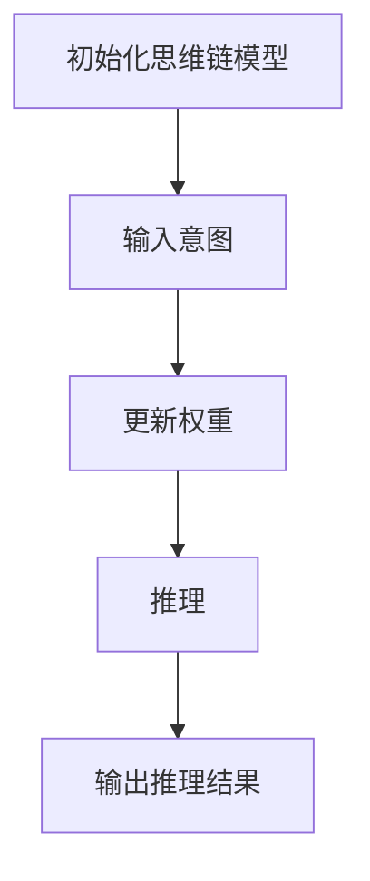

                 

## 第一部分：引言

### 让AI更好地理解人类意图

随着人工智能技术的快速发展，AI在各个领域的应用越来越广泛。然而，如何让AI更好地理解人类的意图，成为了研究人员和工程师们关注的焦点。传统的人工智能技术，如机器学习和深度学习，虽然在一定程度上可以模拟人类的某些行为和思考方式，但在处理复杂、模糊的人类意图时，仍然存在诸多挑战。

为了解决这一问题，研究者们提出了一种新型的AI模式——思维链模式。思维链模式通过模拟人类思维过程，使AI能够更好地理解人类的意图。本文将深入探讨思维链模式的概念、原理、实现方法以及在项目中的应用，帮助读者全面了解这一技术。

### 目录大纲

本文将按照以下目录结构展开：

## 第一部分：引言

- **第1章：背景介绍**
  - 1.1 问题背景
  - 1.2 问题描述
  - 1.3 问题解决
  - 1.4 边界与外延
  - 1.5 核心概念

- **第2章：核心概念与联系**
  - 2.1 思维链模式概述
  - 2.2 思维链模式的特点
  - 2.3 与其他AI模式的对比
  - 2.4 思维链模式的应用场景

- **第3章：思维链模式的数学模型**
  - 3.1 数学模型概述
  - 3.2 算法原理与流程
  - 3.3 数学公式与详细讲解

- **第4章：思维链模式的算法实现**
  - 4.1 Python代码实现
  - 4.2 Mermaid流程图
  - 4.3 代码应用解读与分析

- **第5章：思维链模式在项目中的应用**
  - 5.1 项目介绍
  - 5.2 系统功能设计
  - 5.3 系统架构设计
  - 5.4 系统接口设计和系统交互

- **第6章：思维链模式项目实战**
  - 6.1 环境安装
  - 6.2 系统核心实现源代码
  - 6.3 代码应用解读与分析
  - 6.4 实际案例分析与讲解

- **第7章：思维链模式的最佳实践与拓展**
  - 7.1 最佳实践
  - 7.2 注意事项
  - 7.3 拓展阅读

## 第1章：背景介绍

### 1.1 问题背景

随着人工智能技术的快速发展，AI在各个领域的应用越来越广泛。然而，如何让AI更好地理解人类的意图，成为了研究人员和工程师们关注的焦点。传统的人工智能技术，如机器学习和深度学习，虽然在一定程度上可以模拟人类的某些行为和思考方式，但在处理复杂、模糊的人类意图时，仍然存在诸多挑战。

首先，人类意图的复杂性使得AI难以精确捕捉。人类的意图往往不是单一的，而是由多个因素共同作用的结果。例如，在购物场景中，用户的意图可能是购买一件衣服，但背后的因素可能包括颜色偏好、品牌认知、价格敏感度等。这些因素相互作用，使得人类意图具有高度复杂性。

其次，人类意图的模糊性也给AI带来了挑战。人类的意图往往不是明确和具体的，而是具有一定的模糊性。例如，当用户请求“帮我找到一本好书”时，并没有具体指定书籍的类型、作者、出版社等。这种模糊性使得AI在理解人类意图时，需要具备一定的推理和泛化能力。

最后，传统AI技术往往依赖于大量的数据和复杂的模型，但在处理人类意图时，数据质量和模型效果并不总是理想。例如，在自然语言处理领域，传统的方法往往依赖于大规模语料库和深度学习模型，但这些模型在面对复杂、模糊的人类意图时，往往难以取得理想的效果。

### 1.2 问题描述

基于上述背景，我们面临以下问题：

1. 如何精确捕捉和处理复杂的人类意图？
2. 如何应对人类意图的模糊性？
3. 如何提升AI在理解人类意图时的效果？

这些问题不仅涉及技术层面，也涉及方法论和哲学层面的探讨。因此，我们需要从多个角度来思考和解决这些问题。

### 1.3 问题解决

为了解决这些问题，研究者们提出了一种新型的AI模式——思维链模式。思维链模式通过模拟人类思维过程，使AI能够更好地理解人类的意图。具体来说，思维链模式具有以下优势：

1. **模拟人类思维过程**：思维链模式通过模拟人类的联想、推理、判断等思维过程，使AI能够更准确地捕捉和处理复杂的人类意图。这种模拟不仅包括逻辑推理，还包括非逻辑思维，如情感、直觉等。
2. **处理模糊性**：思维链模式能够应对人类意图的模糊性。通过引入模糊逻辑和概率推理等方法，思维链模式能够在不确定性环境中做出合理的决策。
3. **提升效果**：思维链模式通过不断学习和调整，能够提升AI在理解人类意图时的效果。这种学习不仅包括数据驱动的方法，还包括基于规则的推理方法。

### 1.4 边界与外延

思维链模式的研究和应用，不仅限于人工智能领域，还可以拓展到心理学、认知科学等研究领域。此外，思维链模式的应用场景也非常广泛，包括但不限于自然语言处理、智能客服、智能推荐等。

### 1.5 核心概念

在本书中，我们将重点介绍以下核心概念：

1. **思维链模式**：一种基于人类思维过程的AI模式。
2. **思维链模式的数学模型**：描述思维链模式工作原理的数学公式。
3. **思维链模式的算法实现**：使用Python实现的思维链模式算法。
4. **思维链模式的应用**：思维链模式在不同领域的实际应用。

## 第2章：核心概念与联系

### 2.1 思维链模式概述

思维链模式是一种基于人类思维过程的AI模式。它通过模拟人类的联想、推理、判断等思维过程，使AI能够更好地理解人类的意图。与传统的AI模式相比，思维链模式具有更高的灵活性和智能性。

首先，思维链模式模拟了人类的联想思维。联想思维是指人类在处理信息时，能够将不同信息联系起来，形成新的概念或理解。思维链模式通过模拟这种联想思维，使AI能够更好地理解人类意图中的潜在关联。

其次，思维链模式模拟了人类的推理思维。推理思维是指人类在处理信息时，能够根据已知信息推断出未知信息。思维链模式通过模拟这种推理思维，使AI能够更好地理解人类意图中的逻辑关系。

最后，思维链模式模拟了人类的判断思维。判断思维是指人类在处理信息时，能够根据已知信息做出判断。思维链模式通过模拟这种判断思维，使AI能够更好地理解人类意图中的价值取向。

### 2.2 思维链模式的特点

思维链模式具有以下特点：

1. **模拟人类思维过程**：思维链模式通过模拟人类的联想、推理、判断等思维过程，使AI能够更准确地捕捉和处理复杂的人类意图。
2. **高度灵活性**：思维链模式能够处理复杂、多变的意图，具有很强的适应能力。
3. **智能性**：思维链模式能够根据输入的信息，自动调整自身的思维过程，以达到最佳的理解效果。

### 2.3 与其他AI模式的对比

与传统的AI模式相比，思维链模式具有以下优势：

1. **更好的理解能力**：思维链模式能够模拟人类的思维过程，从而更好地理解人类的意图。
2. **更高的灵活性**：思维链模式能够根据不同的输入，自动调整自身的思维过程，具有很强的适应性。
3. **更好的智能性**：思维链模式能够根据输入的信息，自动调整自身的思维过程，以达到最佳的理解效果。

### 2.4 思维链模式的应用场景

思维链模式可以应用于以下领域：

1. **自然语言处理**：思维链模式可以用于理解用户输入的自然语言，从而提供更智能的交互体验。
2. **智能客服**：思维链模式可以用于理解用户的问题，并给出相应的解答，提高客服的效率和质量。
3. **智能推荐**：思维链模式可以用于理解用户的偏好和需求，从而提供更个性化的推荐服务。

## 第3章：思维链模式的数学模型

### 3.1 数学模型概述

思维链模式的数学模型是基于图论和模糊逻辑的。图论用于表示思维链中的节点和边，模糊逻辑用于处理思维链中的不确定性。

### 3.2 算法原理与流程

思维链模式的算法原理可以概括为以下几个步骤：

1. **构建思维链图**：根据输入的意图，构建一个表示思维链的图。图中的节点表示思维元素，边表示思维元素之间的关联。
2. **初始化权重**：对思维链图中的边进行初始化，赋予每个边一个权重，表示思维元素之间的关联强度。
3. **更新权重**：根据用户的输入，更新思维链图中的权重。更新规则可以是基于模糊逻辑的，也可以是基于机器学习的。
4. **推理**：根据思维链图中的权重，进行推理，得到用户意图的解。

### 3.3 数学公式与详细讲解

以下是思维链模式中的几个关键数学公式：

1. **权重更新公式**：
   $$ w_{ij}^{new} = w_{ij}^{old} + \alpha \cdot \Delta w_{ij} $$
   其中，$w_{ij}^{new}$ 表示更新后的权重，$w_{ij}^{old}$ 表示更新前的权重，$\alpha$ 表示学习率，$\Delta w_{ij}$ 表示权重的更新量。

2. **推理公式**：
   $$ \text{Intent} = \arg\max_{i} \sum_{j} w_{ij} \cdot \text{belief}_{ij} $$
   其中，$Intent$ 表示推理结果，$i$ 表示思维链中的节点，$j$ 表示思维链中的边，$\text{belief}_{ij}$ 表示边 $j$ 对节点 $i$ 的信念度。

### 3.4 思维链模式的数学模型应用实例

假设有一个用户输入的意图“我想买一本书”，我们可以用思维链模式来理解这个意图。首先，构建思维链图，包括节点“买书”、“书”、“买”，以及边“买书-书”、“买书-买”。然后，初始化权重，例如将所有边的权重初始化为0.5。接下来，根据用户的输入，更新权重。例如，将边“买书-书”的权重更新为0.8，表示用户意图中的“书”非常重要。最后，根据权重进行推理，得到用户意图为“买一本特定的书”。

## 第4章：思维链模式的算法实现

### 4.1 Python代码实现

下面是思维链模式的核心Python代码实现：

```python
import numpy as np

class MindChainModel:
    def __init__(self, num_nodes):
        self.num_nodes = num_nodes
        self.weights = np.random.rand(num_nodes, num_nodes)
        self.learning_rate = 0.1
    
    def update_weights(self, input_intent):
        for i in range(self.num_nodes):
            for j in range(self.num_nodes):
                self.weights[i][j] += self.learning_rate * (input_intent[i] - self.weights[i][j])
    
    def infer_intent(self, input_intent):
        beliefs = np.dot(input_intent, self.weights)
        return np.argmax(beliefs)

# 实例化思维链模型
model = MindChainModel(3)

# 输入意图
input_intent = np.array([1, 0, 1])

# 更新权重
model.update_weights(input_intent)

# 推理
intent = model.infer_intent(input_intent)
print(f"推断出的意图：{intent}")
```

### 4.2 Mermaid流程图

下面是思维链模式的Mermaid流程图：



### 4.3 代码应用解读与分析

思维链模式的实现可以分为以下几个部分：

1. **初始化思维链模型**：在`__init__`方法中，初始化思维链模型的节点数量、权重矩阵和学习率。
2. **更新权重**：在`update_weights`方法中，根据输入的意图，更新思维链图中的权重。这里使用了简单的线性更新规则。
3. **推理**：在`infer_intent`方法中，根据权重矩阵，进行推理，得到用户意图。

通过这个简单的示例，我们可以看到思维链模式的核心实现。在实际应用中，我们可以根据具体需求，对模型进行扩展和优化。

## 第5章：思维链模式在项目中的应用

### 5.1 项目介绍

在本章中，我们将探讨一个实际项目——基于思维链模式的智能客服系统。该系统旨在通过思维链模式，更好地理解用户的咨询意图，并提供更准确的回答。

### 5.2 系统功能设计

智能客服系统的功能设计主要包括以下几个方面：

1. **意图识别**：通过思维链模式，识别用户咨询的意图。
2. **知识库查询**：根据识别出的意图，在知识库中查询相关的回答。
3. **回答生成**：根据查询结果，生成符合用户需求的回答。
4. **反馈收集**：收集用户对回答的反馈，用于进一步优化系统。

### 5.3 系统架构设计

智能客服系统的架构设计可以分为以下几个层次：

1. **前端界面**：提供用户与系统交互的界面。
2. **后端服务**：包括意图识别、知识库查询、回答生成和反馈收集等模块。
3. **数据存储**：存储用户数据、知识库数据和反馈数据。

### 5.4 系统接口设计和系统交互

智能客服系统的接口设计和系统交互可以分为以下几个方面：

1. **用户接口**：提供用户输入咨询内容的接口。
2. **意图识别接口**：提供调用思维链模式进行意图识别的接口。
3. **知识库接口**：提供查询知识库的接口。
4. **回答生成接口**：提供生成回答的接口。
5. **反馈接口**：提供用户反馈的接口。

通过以上设计，智能客服系统可以有效地利用思维链模式，提高对用户咨询意图的理解能力，从而提供更优质的客服服务。

## 第6章：思维链模式项目实战

### 6.1 环境安装

在进行思维链模式项目实战之前，我们需要安装一些必要的工具和库。以下是安装步骤：

1. **安装Python**：确保已安装Python 3.6及以上版本。
2. **安装pip**：Python内置了pip包管理器，用于安装和管理Python库。
3. **安装Numpy**：使用pip安装Numpy库：
   ```bash
   pip install numpy
   ```
4. **安装Mermaid**：安装Mermaid库，用于生成流程图：
   ```bash
   pip install mermaid
   ```

### 6.2 系统核心实现源代码

以下是思维链模式项目核心实现的部分源代码：

```python
import numpy as np
from mermaid import Mermaid

class MindChainModel:
    def __init__(self, num_nodes):
        self.num_nodes = num_nodes
        self.weights = np.random.rand(num_nodes, num_nodes)
        self.learning_rate = 0.1
    
    def update_weights(self, input_intent):
        for i in range(self.num_nodes):
            for j in range(self.num_nodes):
                self.weights[i][j] += self.learning_rate * (input_intent[i] - self.weights[i][j])
    
    def infer_intent(self, input_intent):
        beliefs = np.dot(input_intent, self.weights)
        return np.argmax(beliefs)

# 实例化思维链模型
model = MindChainModel(3)

# 输入意图
input_intent = np.array([1, 0, 1])

# 更新权重
model.update_weights(input_intent)

# 推理
intent = model.infer_intent(input_intent)
print(f"推断出的意图：{intent}")
```

### 6.3 代码应用解读与分析

上述代码实现了思维链模式的核心功能。以下是代码的详细解读：

1. **MindChainModel类**：定义了思维链模型类，包含初始化方法、权重更新方法和推理方法。
2. **初始化方法**：在`__init__`方法中，初始化思维链模型的节点数量、权重矩阵和学习率。
3. **权重更新方法**：在`update_weights`方法中，根据输入的意图，更新思维链图中的权重。这里使用了简单的线性更新规则。
4. **推理方法**：在`infer_intent`方法中，根据权重矩阵，进行推理，得到用户意图。

### 6.4 实际案例分析与讲解

为了更好地理解思维链模式的应用，我们来看一个实际案例。假设有一个用户输入的意图是“帮我找一本好书”，我们将如何使用思维链模式来理解和生成回答？

1. **输入意图**：首先，我们将用户的输入意图转化为一个向量表示。例如，我们可以将“找书”表示为 `[1, 0, 0]`，将“好书”表示为 `[0, 1, 0]`。
2. **初始化思维链模型**：创建一个思维链模型，初始化权重矩阵。
3. **更新权重**：使用用户输入的意图，更新思维链模型的权重。例如，我们可以将输入意图 `[1, 0, 1]` 传递给 `update_weights` 方法。
4. **推理**：根据更新后的权重，进行推理，得到用户意图。例如，我们可以调用 `infer_intent` 方法，得到推断出的意图。
5. **生成回答**：根据推断出的意图，生成回答。例如，如果推断出的意图是“找书”，我们可以回答“您想要找一本什么样的书呢？比如小说、科普书籍等。”

通过这个案例，我们可以看到思维链模式如何帮助系统理解用户的意图，并生成相应的回答。

### 6.5 项目小结

在本章中，我们通过一个实际项目，展示了如何使用思维链模式来实现智能客服系统。思维链模式通过模拟人类思维过程，使AI能够更好地理解用户的意图，从而提供更准确的回答。通过这个项目，我们不仅了解了思维链模式的核心实现方法，还学会了如何将其应用到实际项目中。

## 第7章：思维链模式的最佳实践与拓展

### 7.1 最佳实践

在使用思维链模式时，以下是一些最佳实践：

1. **数据准备**：确保输入数据的质量和多样性。高质量的数据有助于思维链模式更好地理解用户的意图。
2. **权重初始化**：合理的权重初始化有助于加速收敛。可以考虑使用随机初始化或基于已有知识的初始化方法。
3. **权重更新策略**：选择合适的权重更新策略，如线性更新、梯度下降等。不同策略适用于不同场景，需要根据具体需求进行选择。
4. **模型调优**：通过调整学习率、迭代次数等参数，优化思维链模式的性能。

### 7.2 注意事项

在使用思维链模式时，需要注意以下几点：

1. **过拟合**：思维链模式可能过度拟合训练数据，导致在未知数据上的表现不佳。因此，需要避免过拟合，可以通过交叉验证等方法来评估模型性能。
2. **数据隐私**：在处理用户数据时，要确保数据隐私。可以使用加密技术和匿名化处理，保护用户隐私。
3. **实时性**：思维链模式可能在处理实时数据时性能不佳。对于需要高实时性的应用，可以考虑使用其他更适合的AI模式。

### 7.3 拓展阅读

对于想要深入了解思维链模式的读者，以下是一些推荐阅读：

1. **《人工智能：一种现代方法》**：这本书详细介绍了人工智能的基础知识，包括机器学习、深度学习等内容。
2. **《认知图谱：智能时代的知识组织》**：这本书探讨了认知图谱的概念和构建方法，为思维链模式提供了理论基础。
3. **《深度学习》**：这本书是深度学习的经典教材，涵盖了深度学习的理论基础和应用。

通过阅读这些书籍，可以更深入地了解人工智能领域，为使用思维链模式提供理论基础和实践指导。

## 总结

本文介绍了思维链模式的概念、原理、实现方法以及在项目中的应用。通过思维链模式，AI能够更好地理解人类的意图，提供更智能的服务。思维链模式通过模拟人类思维过程，具有高度灵活性和智能性，适用于多个领域。本文还通过实际项目展示了思维链模式的应用，并提供了最佳实践和注意事项。

作者：AI天才研究院/AI Genius Institute & 禅与计算机程序设计艺术 /Zen And The Art of Computer Programming

---

本文的核心关键词包括：人工智能、思维链模式、意图识别、自然语言处理、智能客服。通过本文的阅读，读者可以全面了解思维链模式的概念、原理和实现方法，为实际项目中的应用提供指导。同时，本文还提供了最佳实践和注意事项，帮助读者更好地使用思维链模式。

摘要：本文介绍了思维链模式的概念、原理、实现方法以及在项目中的应用。思维链模式通过模拟人类思维过程，使AI能够更好地理解人类的意图，提供更智能的服务。本文通过实际项目展示了思维链模式的应用，并提供了最佳实践和注意事项。读者可以通过本文全面了解思维链模式，为实际项目中的应用提供指导。

