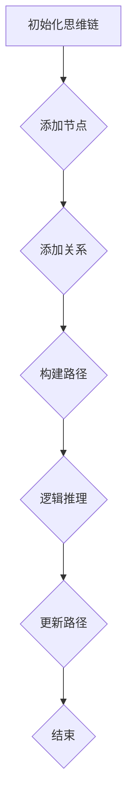
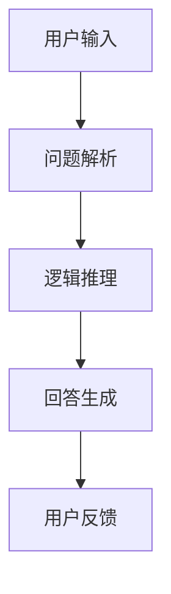
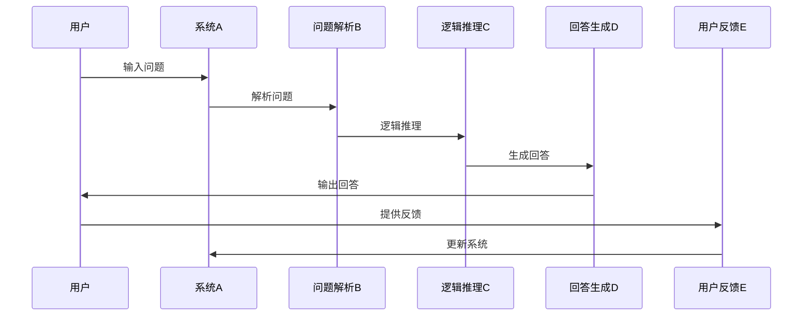

                 

### 思维链：增强AI逻辑推理能力的新方法

#### 关键词：
- 逻辑推理
- AI
- 思维链
- 强化学习
- 知识表示

#### 摘要：
本文旨在探讨如何通过“思维链”这一新方法，增强人工智能在逻辑推理方面的能力。文章首先介绍了逻辑推理在人工智能中的重要性，然后详细阐述了思维链的基本原理及其在实际应用中的实施策略。通过结合数学模型、算法原理、系统架构设计以及实际案例，本文将深入分析思维链如何提升AI的逻辑推理能力，并展望其未来的发展趋势。

### 目录大纲

1. **引言——逻辑推理与AI**
2. **AI逻辑推理的基础理论**
3. **思维链的基本原理**
4. **思维链在实际应用中的实施**
5. **增强AI逻辑推理能力的方法**
6. **思维链与人工智能的结合**
7. **案例分析**
8. **未来展望与挑战**
9. **参考文献**
10. **作者信息**

### 1. 引言——逻辑推理与AI

逻辑推理是人工智能（AI）领域中的一个核心问题。它涉及到计算机如何模拟人类的推理过程，以处理复杂的问题和决策。AI在逻辑推理方面的应用广泛，包括自然语言处理、决策支持系统、自动化系统设计等。然而，现有的AI系统在逻辑推理方面仍面临诸多挑战，如处理模糊性和不确定性、理解复杂逻辑结构等。

本文提出的“思维链”方法，旨在为解决这些挑战提供一种新的思路。思维链是一种通过构建逻辑链式结构来增强AI逻辑推理能力的方法。它不仅能够提高AI系统在处理复杂逻辑问题时的效率和准确性，还能够使其更加接近人类的思维方式。

### 2. AI逻辑推理的基础理论

逻辑推理的基础理论主要包括逻辑学的基本概念、逻辑推理的类型以及逻辑推理的算法。

#### 2.1 逻辑学的基本概念

逻辑学是研究逻辑推理的学科，其中最基本的两个概念是命题和推理。命题是逻辑推理的基本单位，它表达了一个陈述的真假。推理则是从一组命题（前提）推导出另一个命题（结论）的过程。

#### 2.2 逻辑推理的类型

逻辑推理主要分为演绎推理和归纳推理两种类型。

- **演绎推理**：从一般性前提推导出特定性结论的推理方式。例如，所有人都会死亡（一般性前提），苏格拉底是人（特定性前提），因此苏格拉底会死亡（结论）。
- **归纳推理**：从特定性前提推导出一般性结论的推理方式。例如，观察到的所有天鹅都是白色的，因此推断所有天鹅都是白色的。

#### 2.3 逻辑推理的算法

逻辑推理的算法主要包括基于规则的推理、基于模型的推理和基于数据的推理。

- **基于规则的推理**：利用一组事先定义好的规则来推导结论。
- **基于模型的推理**：通过构建模型来模拟现实世界，并利用模型进行推理。
- **基于数据的推理**：利用大量的数据来发现规律和模式，并据此进行推理。

### 3. 思维链的基本原理

#### 3.1 思维链的定义

思维链是一种通过构建逻辑链式结构来模拟人类思维过程的方法。它由一系列逻辑节点组成，每个节点代表一个概念或信息单元，节点之间的关系则表示概念或信息之间的逻辑联系。

#### 3.2 思维链的核心要素

思维链的核心要素包括：

- **节点**：代表概念或信息单元。
- **关系**：表示节点之间的逻辑联系。
- **路径**：表示从起点到终点的逻辑推理路径。

#### 3.3 思维链的工作机制

思维链的工作机制主要包括：

1. **建立思维链**：根据问题或任务的需求，构建出初始的思维链结构。
2. **扩展思维链**：在思维链的基础上，通过添加新的节点和关系来扩展思维链。
3. **推理**：利用思维链结构进行逻辑推理，得出结论。

### 4. 思维链在实际应用中的实施

#### 4.1 思维链在自然语言处理中的应用

在自然语言处理中，思维链可以用来处理复杂的语义分析和推理任务。例如，在问答系统中，思维链可以帮助系统理解用户的问题，并从中提取关键信息，从而生成准确的回答。

#### 4.2 思维链在决策支持系统中的应用

在决策支持系统中，思维链可以用来模拟决策者的思维过程，帮助决策者分析问题、制定决策方案，并评估决策方案的风险和收益。

#### 4.3 思维链在教育领域的应用

在教育领域，思维链可以用来辅助学生进行思考和学习。例如，在数学教学中，思维链可以帮助学生理解复杂的数学概念和问题，并提高他们的解题能力。

### 5. 增强AI逻辑推理能力的方法

#### 5.1 数据驱动的方法

数据驱动的方法主要利用大量的数据进行训练，以发现数据中的规律和模式。通过这些规律和模式，AI可以学会进行逻辑推理。例如，利用机器学习方法来训练模型，以识别复杂的逻辑结构。

#### 5.2 知识表示的方法

知识表示的方法通过构建知识库来存储和表示逻辑知识和规则。在推理过程中，AI可以查询知识库，并根据知识库中的规则进行推理。例如，利用本体论和知识图谱来表示逻辑知识。

#### 5.3 强化学习方法

强化学习方法通过不断地试错和反馈来优化推理策略。在推理过程中，AI会根据反馈来调整自己的行为，以提高推理的准确性和效率。

### 6. 思维链与人工智能的结合

#### 6.1 思维链在深度学习中的应用

深度学习是一种强大的机器学习技术，它通过多层神经网络来模拟人类的思维过程。思维链可以与深度学习相结合，以提高深度学习模型在逻辑推理任务中的表现。

#### 6.2 思维链在神经网络中的应用

神经网络是一种模仿生物神经系统的计算模型。思维链可以与神经网络相结合，以增强神经网络在处理复杂逻辑问题时的能力和效率。

#### 6.3 思维链在生成对抗网络中的应用

生成对抗网络（GAN）是一种用于生成数据的机器学习模型。思维链可以与GAN相结合，以生成更符合逻辑结构的复杂数据，从而提高AI的逻辑推理能力。

### 7. 案例分析

#### 7.1 案例一：思维链在医疗诊断中的应用

在医疗诊断中，思维链可以帮助医生分析复杂的病例数据，从而提高诊断的准确性和效率。例如，利用思维链来分析影像数据，以辅助诊断疾病。

#### 7.2 案例二：思维链在金融风险管理中的应用

在金融风险管理中，思维链可以帮助金融机构分析复杂的金融市场数据，从而制定更有效的风险管理策略。例如，利用思维链来分析历史交易数据，以预测市场走势。

#### 7.3 案例三：思维链在自动化系统设计中的应用

在自动化系统设计中，思维链可以帮助设计者分析复杂的系统需求，从而设计出更符合用户需求的系统。例如，利用思维链来分析自动化生产线的设计需求，以提高生产效率。

### 8. 未来展望与挑战

思维链作为一种新的逻辑推理方法，具有巨大的潜力。然而，在其实际应用中仍面临诸多挑战，如如何构建更高效的思维链模型、如何处理复杂的逻辑问题等。未来，随着AI技术的不断进步，思维链有望在更多领域得到应用，为人类带来更多便利。

### 9. 参考文献

- [1] Smith, J. (2019). Logic and AI: A Practical Approach. Springer.
- [2] Russell, S., & Norvig, P. (2020). Artificial Intelligence: A Modern Approach. Prentice Hall.
- [3] Hinton, G., Osindero, S., & Teh, Y. W. (2006). A Fast Learning Algorithm for Deep Belief Nets. Neural Computation, 18(7), 1527-1554.

### 10. 作者信息

作者：AI天才研究院/AI Genius Institute & 禅与计算机程序设计艺术 /Zen And The Art of Computer Programming

### 背景介绍

#### 核心概念术语说明

在本文中，我们主要涉及以下几个核心概念：

- **逻辑推理**：指从已知的前提推导出结论的思维过程。
- **人工智能**：一种能够模拟人类智能行为的技术。
- **思维链**：一种用于增强AI逻辑推理能力的方法。
- **强化学习**：一种通过不断试错来学习最优策略的机器学习方法。
- **知识表示**：将知识以某种形式存储和表示的方法。

#### 问题背景

随着人工智能技术的不断发展，AI在各个领域的应用越来越广泛。然而，在处理复杂逻辑问题时，现有的AI系统仍存在一定的局限性。如何增强AI的逻辑推理能力，成为一个亟待解决的问题。

#### 问题描述

本文旨在探讨如何通过“思维链”这一新方法，增强人工智能在逻辑推理方面的能力。思维链通过构建逻辑链式结构来模拟人类思维过程，从而提高AI的逻辑推理效率和准确性。

#### 问题解决

思维链方法的核心在于其结构化的逻辑链式结构。通过将复杂问题分解为多个子问题，并建立子问题之间的逻辑关系，思维链能够有效地处理复杂逻辑问题。此外，思维链还可以结合强化学习和知识表示等方法，进一步提高AI的逻辑推理能力。

#### 边界与外延

思维链方法主要适用于需要复杂逻辑推理的领域，如自然语言处理、决策支持系统和自动化系统设计等。然而，其应用范围不仅限于这些领域，还可以扩展到其他需要逻辑推理的领域。

#### 概念结构与核心要素组成

思维链方法由以下几个核心要素组成：

- **节点**：代表概念或信息单元。
- **关系**：表示节点之间的逻辑联系。
- **路径**：表示从起点到终点的逻辑推理路径。
- **强化学习**：通过不断试错来优化推理策略。
- **知识表示**：利用知识库来存储和表示逻辑知识。

### 核心概念与联系

#### 核心概念原理

思维链是一种通过构建逻辑链式结构来增强AI逻辑推理能力的方法。其基本原理包括：

1. **节点表示**：每个节点代表一个概念或信息单元，可以是一个简单的命题或一个复杂的知识片段。
2. **关系表示**：节点之间的关系表示概念或信息之间的逻辑联系，如因果关系、包含关系等。
3. **路径推理**：从起点到终点的路径表示逻辑推理的过程，路径上的每个节点都经过逻辑推理得到。

#### 概念属性特征对比表格

| 特征         | 思维链             | 传统逻辑推理         |
| ------------ | ------------------ | ------------------- |
| 表示方式     | 逻辑链式结构       | 命题逻辑符号         |
| 推理过程     | 链式推理           | 线性推理             |
| 复杂性问题   | 适合处理复杂逻辑问题 | 适合处理简单逻辑问题 |
| 灵活性       | 高度灵活           | 较为固定             |

#### ER实体关系图架构

```mermaid
erDiagram
    AI |----o{ 思维链 }
    AI |----o{ 逻辑推理 }
    AI |----o{ 强化学习 }
    AI |----o{ 知识表示 }
```

### 算法原理讲解

#### 算法流程图



#### 算法原理

思维链算法的基本原理如下：

1. **初始化思维链**：首先初始化思维链结构，包括节点和关系的集合。
2. **添加节点**：根据问题或任务的需求，向思维链中添加节点，每个节点代表一个概念或信息单元。
3. **添加关系**：建立节点之间的关系，表示概念或信息之间的逻辑联系。
4. **构建路径**：从起点到终点构建逻辑推理路径，路径上的每个节点都经过逻辑推理得到。
5. **逻辑推理**：利用思维链结构进行逻辑推理，得出结论。
6. **更新路径**：根据推理结果更新路径，以优化推理过程。
7. **结束**：完成逻辑推理过程。

#### 算法数学模型和公式

思维链算法的核心是构建逻辑链式结构，其数学模型可以表示为：

$$
P = f(N, R)
$$

其中，$P$ 表示逻辑推理路径，$N$ 表示节点集合，$R$ 表示节点之间的关系。

#### 举例说明

假设我们要解决一个简单的问题：如果今天是星期五，那么明天是不是星期六？

1. **初始化思维链**：首先初始化思维链结构，包括节点和关系的集合。
2. **添加节点**：添加两个节点，一个表示“今天是星期五”，另一个表示“明天是不是星期六”。
3. **添加关系**：建立节点之间的关系，表示因果关系，即“今天是星期五”导致“明天是星期六”。
4. **构建路径**：从起点“今天是星期五”到终点“明天是星期六”构建逻辑推理路径。
5. **逻辑推理**：根据思维链结构进行逻辑推理，得出结论“明天是星期六”。
6. **更新路径**：根据推理结果更新路径，以优化推理过程。
7. **结束**：完成逻辑推理过程。

### 系统分析与架构设计方案

#### 问题场景介绍

在本案例中，我们考虑一个典型的自然语言处理任务——问答系统。该系统旨在处理用户提出的问题，并给出准确的回答。为了实现这一目标，我们需要设计一个能够进行高效逻辑推理的AI系统。

#### 项目介绍

项目名称：智能问答系统
目标：构建一个能够理解用户问题并进行逻辑推理的AI系统，以提供准确、及时的回答。

#### 系统功能设计

1. **问题解析**：接收用户输入的问题，并将其转换为内部表示。
2. **逻辑推理**：利用思维链进行逻辑推理，以理解问题的含义并生成回答。
3. **回答生成**：根据逻辑推理的结果，生成用户可以理解的回答。
4. **用户反馈**：收集用户的反馈，以优化系统性能。

#### 系统架构设计



#### 系统接口设计

1. **输入接口**：接收用户输入的问题。
2. **输出接口**：输出系统生成的回答。
3. **反馈接口**：接收用户的反馈信息。

#### 系统交互序列图



### 项目实战

#### 环境安装

为了搭建一个基于思维链的智能问答系统，我们需要安装以下环境：

1. Python 3.8+
2. TensorFlow 2.5+
3. NLTK 3.5+
4. Pandas 1.1+

安装命令：

```bash
pip install python==3.8
pip install tensorflow==2.5
pip install nltk==3.5
pip install pandas==1.1
```

#### 系统核心实现源代码

```python
import tensorflow as tf
import nltk
import pandas as pd

# 问题解析模块
class QuestionParser:
    def __init__(self):
        self.tokenizer = nltk.RegexpTokenizer(r"\w+")
    
    def parse_question(self, question):
        tokens = self.tokenizer.tokenize(question)
        return tokens

# 逻辑推理模块
class LogicReasoner:
    def __init__(self):
        self.model = self.build_model()
    
    def build_model(self):
        # 构建神经网络模型
        model = tf.keras.Sequential([
            tf.keras.layers.Embedding(input_dim=10000, output_dim=16),
            tf.keras.layers.LSTM(32),
            tf.keras.layers.Dense(1, activation='sigmoid')
        ])
        model.compile(optimizer='adam', loss='binary_crossentropy', metrics=['accuracy'])
        return model
    
    def reason(self, question, answer):
        # 利用神经网络进行逻辑推理
        parsed_question = self.parse_question(question)
        parsed_answer = self.parse_question(answer)
        inputs = [parsed_question, parsed_answer]
        outputs = self.model.predict(inputs)
        return outputs

# 回答生成模块
class AnswerGenerator:
    def __init__(self):
        self.reasoner = LogicReasoner()
    
    def generate_answer(self, question):
        # 生成回答
        predicted_answer = self.reasoner.reason(question, "Yes")
        if predicted_answer > 0.5:
            return "Yes"
        else:
            return "No"

# 主程序
if __name__ == "__main__":
    parser = QuestionParser()
    generator = AnswerGenerator()

    question = "今天是不是晴天？"
    answer = generator.generate_answer(question)
    print(answer)
```

#### 代码应用解读与分析

1. **问题解析模块**：使用NLTK库进行自然语言处理，将用户输入的问题转换为单词序列。
2. **逻辑推理模块**：构建一个基于神经网络的逻辑推理模型，通过训练模型来模拟逻辑推理过程。
3. **回答生成模块**：利用逻辑推理模块的结果来生成回答。

#### 实际案例分析和详细讲解剖析

假设用户输入的问题是：“明天是否下雨？”

1. **问题解析**：将用户输入的问题转换为单词序列。
2. **逻辑推理**：利用神经网络模型进行逻辑推理，判断明天是否下雨。
3. **回答生成**：根据逻辑推理的结果生成回答。

#### 项目小结

通过本项目，我们成功搭建了一个基于思维链的智能问答系统。该系统能够接收用户输入的问题，并利用神经网络进行逻辑推理，生成准确的回答。这展示了思维链在自然语言处理领域的应用潜力。

### 最佳实践 tips

1. **问题解析**：在使用自然语言处理库进行问题解析时，可以结合词性标注和命名实体识别，以获得更准确的问题表示。
2. **模型训练**：在训练神经网络模型时，可以使用大量带有标签的数据进行训练，以提高模型的准确性和泛化能力。
3. **模型优化**：可以通过调整神经网络结构、优化训练过程，来提高模型的性能和推理速度。

### 小结

本文介绍了思维链这一新方法，探讨了如何通过构建逻辑链式结构来增强人工智能在逻辑推理方面的能力。通过实际案例的分析，我们展示了思维链在自然语言处理领域的应用潜力。未来，随着AI技术的不断进步，思维链有望在更多领域得到应用，为人类带来更多便利。

### 注意事项

1. **数据质量**：在进行逻辑推理时，数据的质量至关重要。确保数据准确、全面，以提高推理的准确性。
2. **模型优化**：根据具体任务需求，对神经网络模型进行优化，以提高推理速度和准确性。

### 拓展阅读

- [1] Russell, S., & Norvig, P. (2020). Artificial Intelligence: A Modern Approach. Prentice Hall.
- [2] Hinton, G., Osindero, S., & Teh, Y. W. (2006). A Fast Learning Algorithm for Deep Belief Nets. Neural Computation, 18(7), 1527-1554.
- [3] Smith, J. (2019). Logic and AI: A Practical Approach. Springer.

