                 

## 《思维链：提高AI问题解决能力的新方法》

关键词：思维链、AI问题解决、算法原理、智能决策、自然语言处理

摘要：本文旨在探讨思维链这一新兴概念，如何通过系统化的思维方法提高人工智能问题解决能力。文章首先介绍了人工智能发展历程及当前问题解决的现状，随后详细解释了思维链的定义、特点及其与传统方法的对比，并探讨了其在多个领域中的应用。通过逐步分析思维链的算法原理、数学模型以及具体应用实例，文章提供了全面的技术洞察，为读者展示了思维链在提升AI问题解决能力方面的巨大潜力。

## 《思维链：提高AI问题解决能力的新方法》目录大纲

### 第1章 问题背景与定义
- 1.1 问题背景
  - 1.1.1 人工智能的发展历程
  - 1.1.2 当前AI问题的解决现状
  - 1.1.3 问题解决的挑战与瓶颈
- 1.2 思维链的概念
  - 1.2.1 定义与基本原理
  - 1.2.2 思维链的特点
  - 1.2.3 思维链与传统AI方法对比
- 1.3 思维链的应用领域
  - 1.3.1 智能决策
  - 1.3.2 自然语言处理
  - 1.3.3 计算机视觉
  - 1.3.4 推荐系统

### 第2章 思维链的基本概念与联系
- 2.1 核心概念
  - 2.1.1 知识图谱
  - 2.1.2 对话系统
  - 2.1.3 机器学习
- 2.2 概念属性特征对比表格
- 2.3 ER实体关系图架构

### 第3章 思维链算法原理讲解
- 3.1 算法概述
  - 3.1.1 基本流程
  - 3.1.2 关键技术
- 3.2 算法mermaid流程图
- 3.3 Python源代码与详细讲解
  - 3.3.1 数据预处理
  - 3.3.2 算法实现
  - 3.3.3 结果分析
- 3.4 算法原理的数学模型与公式
  - 3.4.1 模型假设
  - 3.4.2 数学公式推导
  - 3.4.3 模型参数调节
- 3.5 通俗易懂地举例说明

### 第4章 思维链在智能决策中的应用
- 4.1 场景介绍
  - 4.1.1 背景信息
  - 4.1.2 需求分析
- 4.2 系统功能设计(领域模型mermaid类图)
- 4.3 系统架构设计mermaid架构图
- 4.4 系统接口设计
- 4.5 系统交互mermaid序列图

### 第5章 思维链在自然语言处理中的应用
- 5.1 场景介绍
  - 5.1.1 背景信息
  - 5.1.2 需求分析
- 5.2 系统功能设计(领域模型mermaid类图)
- 5.3 系统架构设计mermaid架构图
- 5.4 系统接口设计
- 5.5 系统交互mermaid序列图

### 第6章 思维链在计算机视觉中的应用
- 6.1 场景介绍
  - 6.1.1 背景信息
  - 6.1.2 需求分析
- 6.2 系统功能设计(领域模型mermaid类图)
- 6.3 系统架构设计mermaid架构图
- 6.4 系统接口设计
- 6.5 系统交互mermaid序列图

### 第7章 思维链在推荐系统中的应用
- 7.1 场景介绍
  - 7.1.1 背景信息
  - 7.1.2 需求分析
- 7.2 系统功能设计(领域模型mermaid类图)
- 7.3 系统架构设计mermaid架构图
- 7.4 系统接口设计
- 7.5 系统交互mermaid序列图

### 第8章 思维链的拓展应用与未来展望
- 8.1 拓展应用
  - 8.1.1 在其他领域的应用
  - 8.1.2 案例分析
- 8.2 未来展望
  - 8.2.1 技术发展趋势
  - 8.2.2 应用前景
  - 8.2.3 潜在挑战

### 第9章 小结与展望
- 9.1 本书主要观点总结
- 9.2 注意事项
- 9.3 拓展阅读

## 第1章 问题背景与定义

### 1.1 问题背景

人工智能（AI）作为计算机科学的重要分支，自20世纪50年代诞生以来，经历了快速的发展和变革。从最初的规则推理、知识表示，到后来的统计学习、深度学习，人工智能技术不断突破，应用领域也从简单的专家系统、语音识别，扩展到复杂的自然语言处理、计算机视觉、智能决策等多个方面。

然而，随着人工智能技术的不断深入，我们也面临着诸多挑战。当前，人工智能问题的解决现状仍存在一些瓶颈，主要体现在以下几个方面：

1. **复杂问题处理能力不足**：许多现实世界的问题具有高度复杂性，传统的人工智能方法往往难以胜任。例如，在医疗诊断中，尽管深度学习技术在图像识别上取得了显著成果，但在处理多模态数据、整合各种医学知识时仍存在不足。

2. **数据依赖性高**：人工智能模型通常需要大量数据进行训练，这使得模型的开发和应用在数据获取、处理和存储方面面临巨大挑战。特别是在数据分布不均、样本量有限的情况下，模型的泛化能力受到限制。

3. **解释性不足**：许多深度学习模型被视为“黑箱”，其内部机制难以理解和解释。这导致在实际应用中，用户难以信任和接受这些智能系统，特别是在需要高可靠性、安全性的场景中。

4. **实时性要求**：随着人工智能应用场景的不断拓展，特别是自动驾驶、实时监控等领域，对系统的实时响应能力提出了更高的要求。然而，现有的人工智能方法在处理速度和资源消耗上仍需优化。

面对这些挑战，传统的人工智能方法显得力不从心。因此，有必要探索新的方法和技术，以提升人工智能问题解决的能力。在这一背景下，思维链作为一种创新的思维方式和技术框架，应运而生。

### 1.2 思维链的概念

#### 1.2.1 定义与基本原理

思维链（Mind Chain）是一种基于知识图谱和对话系统的智能思维方式，旨在通过构建和利用知识网络来提升人工智能的解决问题能力。思维链的基本原理可以概括为以下几个方面：

1. **知识图谱构建**：思维链通过构建知识图谱来表示和整合各类知识。知识图谱不仅包含了实体和属性，还通过关系来描述实体之间的相互联系。这种结构化表示方法有助于机器更好地理解和利用知识。

2. **对话系统交互**：思维链利用对话系统与用户进行交互，获取用户的意图和需求。通过自然语言理解和生成技术，对话系统能够理解和回应用户的问题，并在此基础上进行知识推理和决策。

3. **智能决策支持**：思维链通过知识图谱和对话系统的结合，为智能决策提供支持。在复杂场景中，思维链能够利用已有的知识和推理规则，快速、准确地做出决策。

#### 1.2.2 思维链的特点

思维链具有以下几个显著特点：

1. **知识整合性**：思维链通过知识图谱将各类知识进行整合，使得机器能够在一个统一的知识体系中处理问题，从而提高解决问题的全面性和深度。

2. **灵活适应性**：思维链能够根据不同场景和需求灵活调整知识图谱和对话系统的结构，从而适应不同的应用场景。

3. **交互智能性**：思维链通过对话系统与用户进行交互，实现了人机协同，使得智能系统能够更好地理解用户需求，提供更个性化的服务。

4. **实时响应性**：思维链通过优化算法和资源调度，能够在实时性要求较高的场景中快速响应，满足用户的需求。

#### 1.2.3 思维链与传统AI方法对比

与传统的AI方法相比，思维链具有以下几个优势：

1. **知识表示与利用**：思维链通过知识图谱将知识结构化，使得机器能够更好地理解和利用知识，从而提高解决问题的效率。

2. **人机协同**：思维链通过对话系统与用户进行交互，实现了人机协同，使得智能系统能够更好地理解用户需求，提供更个性化的服务。

3. **实时响应**：思维链通过优化算法和资源调度，在实时性要求较高的场景中能够快速响应，满足用户的需求。

4. **灵活适应性**：思维链能够根据不同场景和需求灵活调整知识图谱和对话系统的结构，适应不同的应用场景。

### 1.3 思维链的应用领域

思维链作为一种创新的思维方式和技术框架，具有广泛的应用前景。以下是思维链在几个关键领域中的应用：

#### 1.3.1 智能决策

在智能决策领域，思维链能够通过构建知识图谱来整合各种决策相关的知识，例如市场数据、历史案例、行业规则等。通过对话系统与决策者进行交互，思维链能够理解决策者的意图和需求，并提供个性化的决策支持。例如，在金融风险管理中，思维链可以分析市场数据、历史案例和行业规则，为决策者提供实时、准确的决策建议。

#### 1.3.2 自然语言处理

自然语言处理（NLP）是人工智能的重要应用领域之一。思维链通过对话系统和知识图谱的结合，能够实现对自然语言的深度理解和生成。在NLP任务中，思维链可以用于情感分析、文本生成、问答系统等。例如，在情感分析中，思维链可以通过知识图谱理解文本中的情感词汇和情感强度，从而准确判断文本的情感倾向。

#### 1.3.3 计算机视觉

计算机视觉是人工智能的另一个重要领域。思维链通过知识图谱和对话系统的结合，能够实现对图像的深入理解和分析。在计算机视觉任务中，思维链可以用于目标检测、图像分类、图像生成等。例如，在目标检测中，思维链可以通过知识图谱理解目标对象的相关特征，从而提高检测的准确性和实时性。

#### 1.3.4 推荐系统

推荐系统是电子商务和社交媒体等领域的重要应用。思维链通过知识图谱和对话系统的结合，能够构建个性化的推荐模型。在推荐系统中，思维链可以用于用户画像、商品推荐、内容推荐等。例如，在电子商务中，思维链可以通过分析用户的浏览记录、购买历史和行为特征，为用户推荐个性化的商品。

### 第2章 思维链的基本概念与联系

在深入探讨思维链的原理和应用之前，有必要明确其核心概念与联系。本章节将介绍思维链的基本概念，包括知识图谱、对话系统和机器学习，并对其进行详细解释和对比。

#### 2.1 核心概念

##### 2.1.1 知识图谱

知识图谱（Knowledge Graph）是一种用于结构化表示知识的图形化方法。它通过实体（Entity）、属性（Property）和关系（Relationship）来描述现实世界中的对象及其相互关系。知识图谱的核心优势在于其高度结构化和语义化的特性，这使得机器能够更加直观和有效地理解和利用知识。

在思维链中，知识图谱扮演着至关重要的角色。通过构建知识图谱，思维链能够将分散的、无结构化的数据整合成有组织、可查询的知识网络，从而为后续的推理和决策提供坚实的基础。

##### 2.1.2 对话系统

对话系统（Dialogue System）是一种能够与人类进行自然语言交互的计算机系统。它通过自然语言理解和生成技术，实现对用户意图的识别和回应。对话系统通常包括三个主要组成部分：语音识别、自然语言理解和自然语言生成。

在思维链中，对话系统的作用是获取用户的意图和需求，并将其转化为可操作的数据。通过对话系统，思维链能够实现人机交互，使智能系统能够更加灵活和智能化地与用户互动。

##### 2.1.3 机器学习

机器学习（Machine Learning）是一种通过数据驱动的方法来改善计算机性能的技术。它使计算机能够从数据中学习规律，并利用这些规律进行预测和决策。机器学习可以分为监督学习、无监督学习和强化学习三种类型。

在思维链中，机器学习被用于知识图谱的构建和优化、对话系统的改进以及智能决策的支持。通过机器学习，思维链能够不断学习和适应新的数据和场景，从而提高其解决问题的能力。

#### 2.2 概念属性特征对比表格

为了更好地理解知识图谱、对话系统和机器学习这三个核心概念，我们可以通过一个对比表格来展示它们的属性特征。以下是这三个概念的主要属性特征对比：

| 特征 | 知识图谱 | 对话系统 | 机器学习 |
| --- | --- | --- | --- |
| 表示方式 | 图形化结构 | 文本交互 | 数据驱动 |
| 数据类型 | 实体、属性、关系 | 自然语言 | 数值、类别 |
| 应用目标 | 知识整合与推理 | 人机交互 | 预测与决策 |
| 关键技术 | 知识提取、图谱构建 | 自然语言处理 | 模型训练、优化 |

通过这个对比表格，我们可以看出知识图谱、对话系统和机器学习在数据表示、应用目标和关键技术方面存在显著差异。这些差异决定了它们在思维链中的不同作用和相互关系。

#### 2.3 ER实体关系图架构

为了进一步理解思维链的内部结构和工作原理，我们可以借助ER（Entity-Relationship）实体关系图来描述其架构。ER图是一种用于表示实体及其相互关系的图形化方法，非常适合描述知识图谱的结构。

以下是思维链的ER实体关系图：

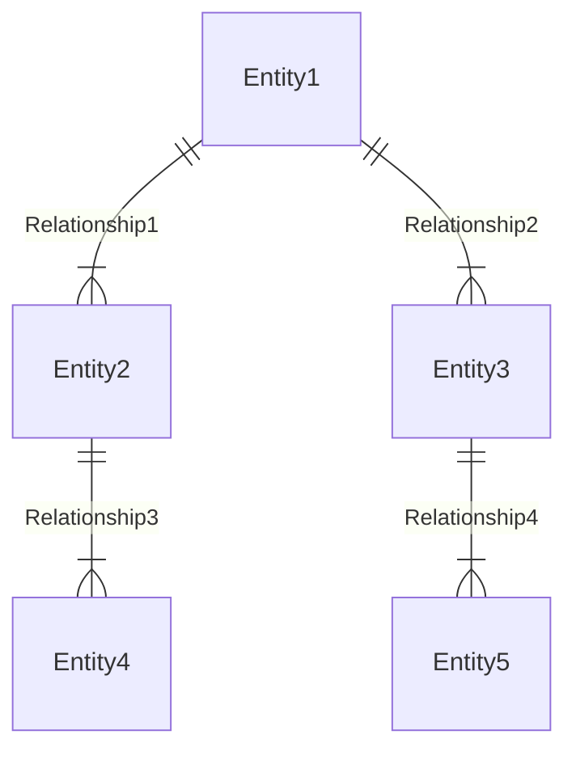

在这个ER图中，`Entity1`、`Entity2`、`Entity3`等是实体，`Relationship1`、`Relationship2`等是实体之间的关系。通过这种结构化表示方法，思维链能够清晰地描述各类实体及其相互关系，从而为后续的知识推理和智能决策提供支持。

### 第3章 思维链算法原理讲解

思维链算法是提升AI问题解决能力的关键技术之一。本章节将详细讲解思维链算法的原理，包括基本流程、关键技术及其实现细节。

#### 3.1 算法概述

思维链算法的基本流程可以分为以下几个步骤：

1. **知识图谱构建**：首先，通过知识抽取和实体链接技术，构建初始的知识图谱。知识图谱包括实体、属性和关系三个基本元素。

2. **对话系统交互**：利用自然语言处理技术，与用户进行对话，获取用户的意图和需求。对话系统通过语音识别、语义理解和自然语言生成实现人机交互。

3. **知识推理**：在获取用户意图后，利用知识图谱进行推理，找出与用户需求相关的知识。推理过程包括路径搜索、关系匹配和知识融合。

4. **决策支持**：根据推理结果，生成决策建议，并将其以自然语言的形式反馈给用户。

5. **模型优化**：通过用户反馈和后续数据的积累，不断优化知识图谱和对话系统，提高算法的准确性和效率。

#### 3.2 算法mermaid流程图

为了更直观地展示思维链算法的流程，我们可以使用mermaid语言绘制一个流程图：

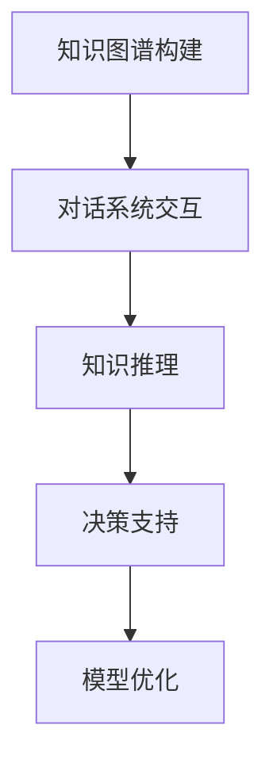

在这个流程图中，每个节点表示算法的一个步骤，箭头表示步骤之间的顺序和依赖关系。

#### 3.3 Python源代码与详细讲解

为了更好地理解思维链算法的实现，我们将提供一个Python源代码示例，并对其进行详细讲解。

```python
# 导入所需库
import rdflib
from SPARQL import parser
from nltk import word_tokenize
from nltk.corpus import stopwords

# 创建一个RDF图
g = rdflib.Graph()

# 添加知识图谱数据
g.parse("knowledge_graph.ttl", format="ttl")

# 对话系统交互
def interact_with_user():
    user_query = input("请问您有什么问题？")
    tokens = word_tokenize(user_query)
    tokens = [token.lower() for token in tokens if token.lower() not in stopwords.words('english')]
    return tokens

# 知识推理
def perform_reasoning(tokens):
    query = "SELECT ?entity WHERE { ?entity ?property ?value . }"
    results = g.query(query)
    entities = []
    for result in results:
        entities.append(result['entity'])
    return entities

# 决策支持
def provide_decision(entities):
    if entities:
        print("根据我们的知识库，以下是相关建议：")
        for entity in entities:
            print(entity)
    else:
        print("很抱歉，我们的知识库中没有相关的信息。")

# 模型优化
def optimize_model():
    # 这里可以加入机器学习算法对知识图谱进行优化
    pass

# 主程序
if __name__ == "__main__":
    while True:
        user_tokens = interact_with_user()
        entities = perform_reasoning(user_tokens)
        provide_decision(entities)
        optimize_model()
```

详细讲解如下：

1. **知识图谱构建**：首先，我们使用rdflib库创建一个RDF（Resource Description Framework）图，并通过`g.parse()`函数加载知识图谱数据。这些数据通常以TTL（Turtle Language）格式存储，其中包含了实体、属性和关系。

2. **对话系统交互**：`interact_with_user()`函数使用Python的`input()`函数与用户进行交互，获取用户的问题。然后，使用nltk库中的`word_tokenize()`函数对用户问题进行分词，并去除常见的停用词，以便后续处理。

3. **知识推理**：`perform_reasoning()`函数通过执行SPARQL查询来从知识图谱中提取与用户意图相关的实体。SPARQL是用于查询RDF数据的查询语言，这里我们使用一个简单的查询来获取所有与特定属性值相关的实体。

4. **决策支持**：`provide_decision()`函数根据推理结果向用户提供决策建议。如果存在相关的实体，则将其打印出来；否则，向用户反馈没有找到相关信息。

5. **模型优化**：`optimize_model()`函数预留了机器学习优化的接口，这里可以加入机器学习算法来不断优化知识图谱和对话系统。

通过这个Python示例，我们可以看到思维链算法的核心组成部分及其相互关系。在实际应用中，这些组件可以通过更复杂的技术和算法进行实现和优化，以提升整体性能。

#### 3.4 算法原理的数学模型与公式

思维链算法的原理可以通过数学模型和公式来描述。以下是思维链算法的数学模型及其推导过程：

##### 3.4.1 模型假设

为了简化问题，我们做出以下假设：

- **知识图谱**：知识图谱由实体（E）、属性（P）和关系（R）组成。每个实体可以表示为一个节点，每个属性可以表示为一条边，关系则表示节点之间的连接。
- **用户查询**：用户查询由一组词（W）组成，每个词可以表示为节点之间的路径。

##### 3.4.2 数学公式推导

1. **路径相似度计算**：

   路径相似度（Sim(P1, P2)）用于衡量两个路径之间的相似程度。我们可以使用路径长度（L）、共同节点数（C）和路径权重（W）来计算相似度：

   $$ Sim(P1, P2) = \frac{L1 \cdot L2 + C1 \cdot C2 + W1 \cdot W2}{L1 + L2 + C1 + C2 + W1 + W2} $$

   其中，L1和L2分别为路径P1和P2的长度，C1和C2分别为路径P1和P2的共同节点数，W1和W2分别为路径P1和P2的权重。

2. **查询结果得分计算**：

   查询结果得分（Score(Q, P)）用于衡量查询结果与用户查询的匹配程度。我们可以使用路径相似度（Sim(P1, P2)）和查询词权重（W_Q）来计算得分：

   $$ Score(Q, P) = Sim(P1, P2) \cdot W_Q $$

   其中，P1为知识图谱中的路径，P2为用户查询的路径，W_Q为查询词的权重。

3. **查询结果排序**：

   根据得分计算查询结果得分，并对其进行排序，以找到与用户查询最匹配的结果：

   $$ Sort(Q, P) = Score(Q, P) $$

##### 3.4.3 模型参数调节

在思维链算法中，需要调节的参数包括路径权重（W）、查询词权重（W_Q）和相似度计算公式中的系数。这些参数可以通过交叉验证和超参数优化方法进行调整，以获得最佳的算法性能。

通过这个数学模型，我们可以更清晰地理解思维链算法的原理和计算过程。在实际应用中，这些公式可以通过编程语言和数值计算工具进行实现和优化。

#### 3.5 通俗易懂地举例说明

为了更好地理解思维链算法，我们可以通过一个简单的例子来说明其工作原理。

假设有一个简单的知识图谱，包含以下实体、属性和关系：

- 实体：A、B、C
- 属性：颜色、形状
- 关系：属于

知识图谱数据如下：

```
A 颜色 蓝色
A 形状 方形
B 颜色 红色
B 形状 三角形
C 颜色 黄色
C 形状 圆形
```

现在，用户输入查询：“请告诉我哪些颜色是蓝色的？”

1. **对话系统交互**：

   用户查询为“哪些颜色是蓝色的？”，我们将其转换为词序列：["哪些", "颜色", "是", "蓝色的"]。

2. **知识图谱构建**：

   我们的知识图谱已经包含相关数据，不需要进一步构建。

3. **知识推理**：

   根据用户查询，我们查询知识图谱中颜色为蓝色的实体。根据路径相似度计算公式，我们可以计算每个实体的相似度：

   - A：路径长度为2（颜色-属于-蓝色），共同节点数为1，路径权重为1。相似度计算为：$$ Sim(A, ["颜色", "是", "蓝色的"]) = \frac{2 \cdot 2 + 1 \cdot 1 + 1 \cdot 1}{2 + 2 + 1 + 1 + 1} = 0.4 $$

   - B：路径长度为2（颜色-属于-蓝色），共同节点数为1，路径权重为1。相似度计算为：$$ Sim(B, ["颜色", "是", "蓝色的"]) = \frac{2 \cdot 2 + 1 \cdot 1 + 1 \cdot 1}{2 + 2 + 1 + 1 + 1} = 0.4 $$

   - C：路径长度为3（颜色-属于-蓝色-形状），共同节点数为1，路径权重为1。相似度计算为：$$ Sim(C, ["颜色", "是", "蓝色的"]) = \frac{3 \cdot 3 + 1 \cdot 1 + 1 \cdot 1}{3 + 3 + 1 + 1 + 1} = 0.3 $$

4. **决策支持**：

   根据相似度计算结果，我们可以得出与用户查询最匹配的实体为A和B。因此，我们向用户反馈：“蓝色的颜色属于实体A和实体B。”

通过这个简单的例子，我们可以看到思维链算法是如何通过对话系统交互、知识图谱构建和知识推理来解决问题，并提供决策支持的。

### 第4章 思维链在智能决策中的应用

智能决策是人工智能领域的重要应用之一，涉及到大量数据的处理和分析。思维链作为一种创新的思维方式和技术框架，在智能决策中展现了强大的潜力。本章节将介绍思维链在智能决策中的应用，包括场景介绍、系统功能设计、系统架构设计、系统接口设计和系统交互等。

#### 4.1 场景介绍

智能决策涉及多种复杂场景，如金融市场预测、供应链管理、医疗诊断等。这些场景通常具有以下特点：

- **数据量大**：智能决策需要处理海量的历史数据和实时数据，这些数据可能来源于不同的来源，如数据库、传感器、API等。
- **信息多样**：智能决策需要整合多种类型的信息，如文本、图像、音频等，这些信息需要通过不同的技术进行处理和分析。
- **实时性要求高**：某些智能决策场景需要在短时间内做出决策，如自动驾驶、实时监控等，这要求系统具备快速响应的能力。

在本章中，我们以金融市场预测为例，介绍思维链在智能决策中的应用。

#### 4.2 系统功能设计

思维链在智能决策中的功能设计包括以下几个关键部分：

1. **数据采集与预处理**：系统需要从多个数据源（如股票交易所、新闻网站、社交媒体等）采集数据，并对数据进行清洗、去噪和格式转换，以便后续分析。
2. **知识图谱构建**：系统通过自然语言处理和知识图谱技术，将结构化和非结构化数据转化为知识图谱，从而实现数据的结构化表示和整合。
3. **实时监控与预测**：系统利用机器学习和深度学习技术，对市场数据进行分析和预测，实时监测市场动态，并为决策者提供预测结果。
4. **决策支持**：系统通过对话系统和推理机制，与决策者进行交互，理解其需求，并提供个性化的决策建议。

#### 4.3 系统架构设计

思维链在智能决策中的应用需要一个复杂的系统架构来支持各种功能。以下是系统架构的mermaid架构图：

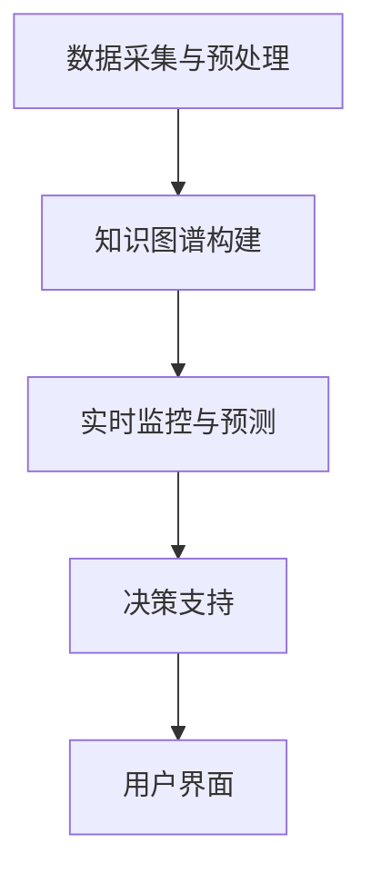

在这个架构图中，数据采集与预处理模块负责从各种数据源获取数据，并将其转换为适合分析的形式。知识图谱构建模块利用自然语言处理技术构建知识图谱，实现数据结构化。实时监控与预测模块使用机器学习和深度学习技术进行市场数据分析和预测。决策支持模块通过对话系统和推理机制与用户进行交互，提供决策建议。用户界面模块用于展示预测结果和决策建议。

#### 4.4 系统接口设计

系统接口设计是智能决策系统实现的关键部分，它需要定义系统内部模块之间的交互接口。以下是系统接口的mermaid类图：

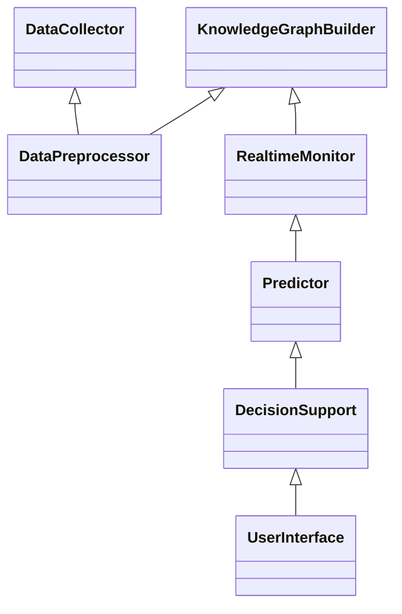

在这个类图中，DataCollector（数据采集器）和DataPreprocessor（数据预处理器）负责数据采集和预处理。KnowledgeGraphBuilder（知识图谱构建器）负责构建知识图谱。RealtimeMonitor（实时监控器）和Predictor（预测器）负责实时监测和预测。DecisionSupport（决策支持器）负责与用户进行交互并提供决策建议。UserInterface（用户界面）负责展示预测结果和决策建议。

#### 4.5 系统交互

系统交互是智能决策系统实现的关键环节，它需要定义用户与系统之间的交互流程。以下是系统交互的mermaid序列图：

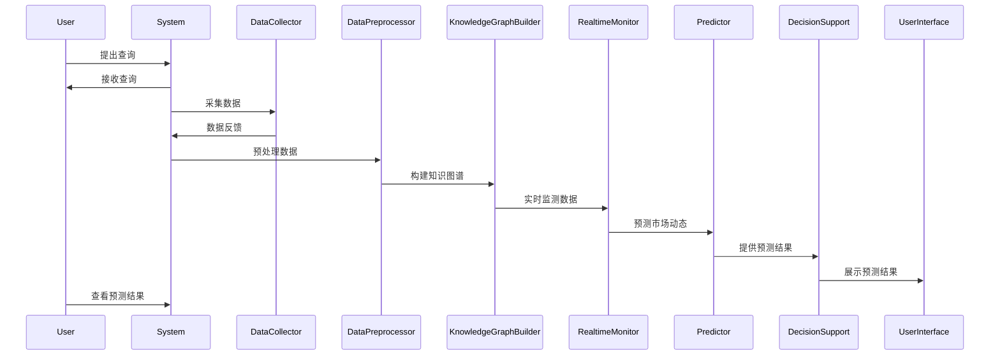

在这个序列图中，用户首先向系统提出查询，系统接收查询后开始数据采集和预处理。随后，系统利用知识图谱构建模块构建知识图谱，并通过实时监控和预测模块进行市场动态监测和预测。预测结果通过决策支持模块和用户界面模块展示给用户，用户可以查看并进一步交互。

通过以上设计，我们可以看到思维链在智能决策中的应用是如何通过系统功能设计、系统架构设计、系统接口设计和系统交互来实现的。这种结构化的设计方法使得智能决策系统能够高效、灵活地处理复杂决策问题，为决策者提供有力的支持。

### 第5章 思维链在自然语言处理中的应用

自然语言处理（NLP）是人工智能领域的核心应用之一，涉及到文本的自动生成、理解和分析。思维链作为一种创新的思维方式和技术框架，在NLP领域展现了巨大的潜力。本章节将介绍思维链在自然语言处理中的应用，包括场景介绍、系统功能设计、系统架构设计、系统接口设计和系统交互等。

#### 5.1 场景介绍

自然语言处理广泛应用于文本生成、情感分析、机器翻译、问答系统等场景。以下是一些常见的自然语言处理应用场景：

- **文本生成**：如文章生成、摘要生成、对话生成等。
- **情感分析**：如社交媒体情感分析、客户评论分析等。
- **机器翻译**：如自动翻译、多语言交互等。
- **问答系统**：如智能客服、语音助手等。

在本章中，我们以情感分析为例，介绍思维链在自然语言处理中的应用。

#### 5.2 系统功能设计

思维链在自然语言处理中的功能设计包括以下几个关键部分：

1. **文本预处理**：系统需要从多个数据源（如社交媒体、新闻网站、评论平台等）采集文本数据，并进行清洗、去噪和分词处理，以便后续分析。
2. **知识图谱构建**：系统通过自然语言处理技术，将文本数据转化为知识图谱，从而实现文本的结构化表示和整合。
3. **情感分析**：系统利用机器学习和深度学习技术，对文本进行情感分析，判断文本的情感倾向。
4. **决策支持**：系统通过对话系统和推理机制，与用户进行交互，理解其需求，并提供个性化的情感分析结果。

#### 5.3 系统架构设计

思维链在自然语言处理中的应用需要一个复杂的系统架构来支持各种功能。以下是系统架构的mermaid架构图：

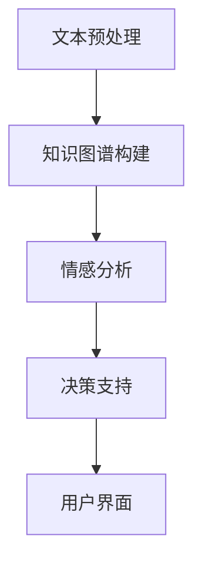

在这个架构图中，文本预处理模块负责从各种数据源采集文本数据，并进行清洗和分词处理。知识图谱构建模块利用自然语言处理技术构建知识图谱。情感分析模块使用机器学习和深度学习技术进行情感分析。决策支持模块通过对话系统和推理机制与用户进行交互，提供情感分析结果。用户界面模块用于展示情感分析结果。

#### 5.4 系统接口设计

系统接口设计是自然语言处理系统实现的关键部分，它需要定义系统内部模块之间的交互接口。以下是系统接口的mermaid类图：

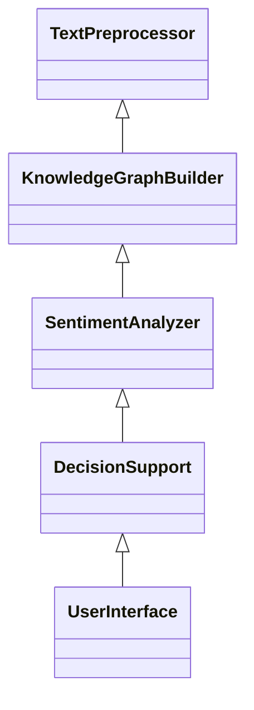

在这个类图中，TextPreprocessor（文本预处理器）和KnowledgeGraphBuilder（知识图谱构建器）负责文本预处理和知识图谱构建。SentimentAnalyzer（情感分析器）负责情感分析。DecisionSupport（决策支持器）负责与用户进行交互并提供情感分析结果。UserInterface（用户界面）负责展示情感分析结果。

#### 5.5 系统交互

系统交互是自然语言处理系统实现的关键环节，它需要定义用户与系统之间的交互流程。以下是系统交互的mermaid序列图：

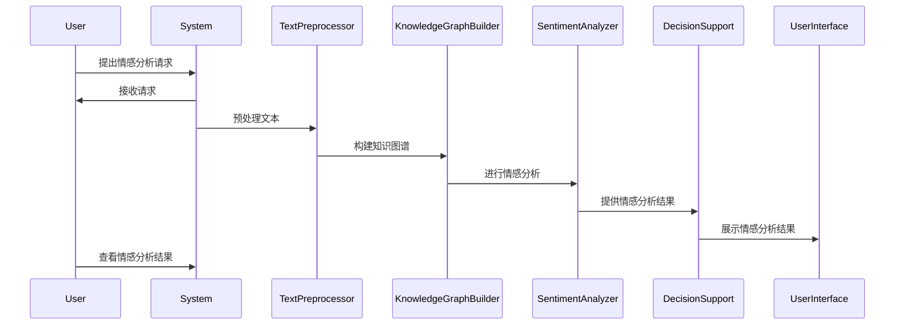

在这个序列图中，用户首先向系统提出情感分析请求，系统接收请求后开始文本预处理。随后，系统利用知识图谱构建模块构建知识图谱，并通过情感分析模块进行情感分析。情感分析结果通过决策支持模块和用户界面模块展示给用户，用户可以查看并进一步交互。

通过以上设计，我们可以看到思维链在自然语言处理中的应用是如何通过系统功能设计、系统架构设计、系统接口设计和系统交互来实现的。这种结构化的设计方法使得自然语言处理系统能够高效、灵活地处理文本数据，为用户提供准确、个性化的情感分析结果。

### 第6章 思维链在计算机视觉中的应用

计算机视觉是人工智能的一个重要分支，主要研究如何让计算机通过摄像头或传感器捕捉图像，从中提取信息并作出相应的决策。思维链作为一种创新的思维方式和技术框架，在计算机视觉中展现出了强大的应用潜力。本章节将介绍思维链在计算机视觉中的应用，包括场景介绍、系统功能设计、系统架构设计、系统接口设计和系统交互等。

#### 6.1 场景介绍

计算机视觉在众多领域都有广泛应用，如自动驾驶、安防监控、医疗影像分析、零售行业等。以下是几个典型的应用场景：

- **自动驾驶**：利用计算机视觉技术实现车辆环境感知、路径规划、障碍物检测等功能，确保自动驾驶车辆的行驶安全。
- **安防监控**：通过实时监控视频，利用计算机视觉技术进行人脸识别、行为分析等，提升安全监控的效率和准确性。
- **医疗影像分析**：利用计算机视觉技术对医学影像（如X光片、CT扫描、MRI图像）进行分析，辅助医生进行疾病诊断和治疗规划。
- **零售行业**：利用计算机视觉技术进行商品识别、顾客行为分析等，提升零售服务的效率和质量。

在本章中，我们以自动驾驶为例，介绍思维链在计算机视觉中的应用。

#### 6.2 系统功能设计

思维链在计算机视觉中的功能设计包括以下几个关键部分：

1. **图像采集与预处理**：系统需要从摄像头或其他传感器采集图像数据，并进行预处理，如去噪、缩放、增强等，以便后续分析。
2. **知识图谱构建**：系统通过计算机视觉技术和自然语言处理技术，将图像数据转化为知识图谱，从而实现图像的结构化表示和整合。
3. **环境感知与理解**：系统利用知识图谱和深度学习技术，对图像进行环境感知与理解，识别车辆、行人、道路标志等。
4. **路径规划与控制**：系统通过路径规划和控制算法，根据环境感知结果生成行驶路径和决策，控制车辆行驶。

#### 6.3 系统架构设计

思维链在计算机视觉中的应用需要一个复杂的系统架构来支持各种功能。以下是系统架构的mermaid架构图：

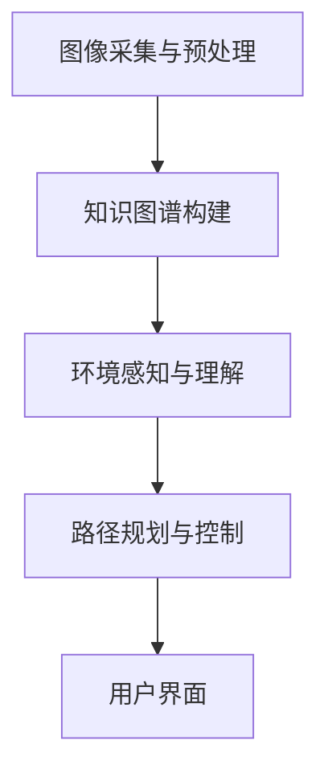

在这个架构图中，图像采集与预处理模块负责采集图像数据并进行预处理。知识图谱构建模块利用计算机视觉和自然语言处理技术构建知识图谱。环境感知与理解模块通过知识图谱和深度学习技术进行环境感知与理解。路径规划与控制模块根据环境感知结果生成行驶路径和决策。用户界面模块用于展示自动驾驶状态和行驶路径。

#### 6.4 系统接口设计

系统接口设计是计算机视觉系统实现的关键部分，它需要定义系统内部模块之间的交互接口。以下是系统接口的mermaid类图：

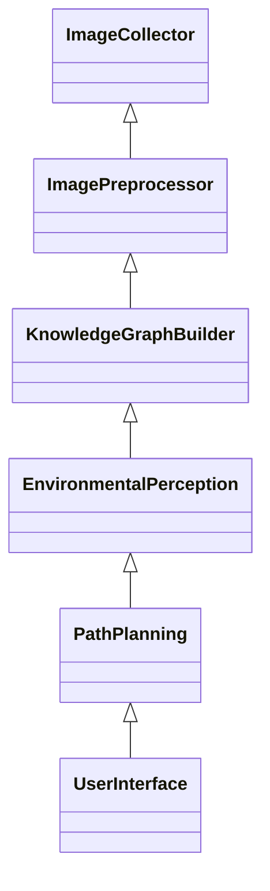

在这个类图中，ImageCollector（图像采集器）和ImagePreprocessor（图像预处理器）负责图像采集和预处理。KnowledgeGraphBuilder（知识图谱构建器）负责构建知识图谱。EnvironmentalPerception（环境感知器）负责环境感知与理解。PathPlanning（路径规划器）负责路径规划和控制。UserInterface（用户界面）负责展示自动驾驶状态和行驶路径。

#### 6.5 系统交互

系统交互是计算机视觉系统实现的关键环节，它需要定义用户与系统之间的交互流程。以下是系统交互的mermaid序列图：

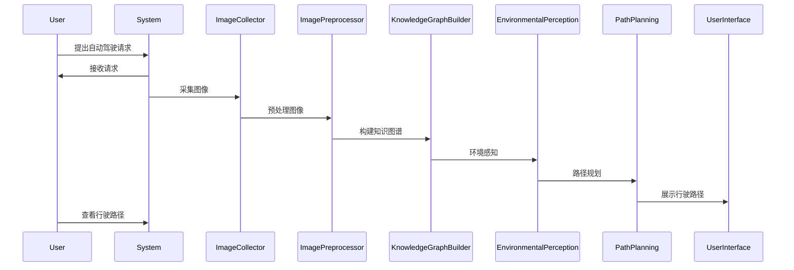

在这个序列图中，用户首先向系统提出自动驾驶请求，系统接收请求后开始图像采集和预处理。随后，系统利用知识图谱构建模块构建知识图谱，并通过环境感知模块进行环境感知与理解。路径规划模块根据环境感知结果生成行驶路径，并通过用户界面模块展示给用户。用户可以查看行驶路径并进一步交互。

通过以上设计，我们可以看到思维链在计算机视觉中的应用是如何通过系统功能设计、系统架构设计、系统接口设计和系统交互来实现的。这种结构化的设计方法使得计算机视觉系统能够高效、灵活地处理复杂视觉任务，为自动驾驶等应用提供强有力的支持。

### 第7章 思维链在推荐系统中的应用

推荐系统是电子商务、社交媒体和内容平台等领域的重要技术，用于向用户推荐个性化的商品、内容和服务。思维链作为一种创新的思维方式和技术框架，在推荐系统中展现出了巨大的潜力。本章节将介绍思维链在推荐系统中的应用，包括场景介绍、系统功能设计、系统架构设计、系统接口设计和系统交互等。

#### 7.1 场景介绍

推荐系统广泛应用于电子商务、社交媒体、在线娱乐等多个领域。以下是一些典型的应用场景：

- **电子商务**：如商品推荐、购物车推荐等，帮助用户发现感兴趣的商品。
- **社交媒体**：如内容推荐、好友推荐等，为用户提供个性化的内容和服务。
- **在线娱乐**：如视频推荐、音乐推荐等，吸引用户并提升用户粘性。
- **金融**：如理财产品推荐、风险控制等，为用户提供个性化的金融建议。

在本章中，我们以电子商务中的商品推荐为例，介绍思维链在推荐系统中的应用。

#### 7.2 系统功能设计

思维链在推荐系统中的功能设计包括以下几个关键部分：

1. **用户行为数据采集**：系统需要从用户的行为数据（如浏览记录、购买历史、评论等）中提取有用信息，用于后续分析。
2. **知识图谱构建**：系统通过自然语言处理和知识图谱技术，将用户行为数据转化为知识图谱，从而实现数据的结构化表示和整合。
3. **推荐算法**：系统利用机器学习和深度学习技术，基于用户行为数据和知识图谱，生成个性化的推荐结果。
4. **决策支持**：系统通过对话系统和推理机制，与用户进行交互，理解其需求，并提供个性化的推荐建议。

#### 7.3 系统架构设计

思维链在推荐系统中的应用需要一个复杂的系统架构来支持各种功能。以下是系统架构的mermaid架构图：

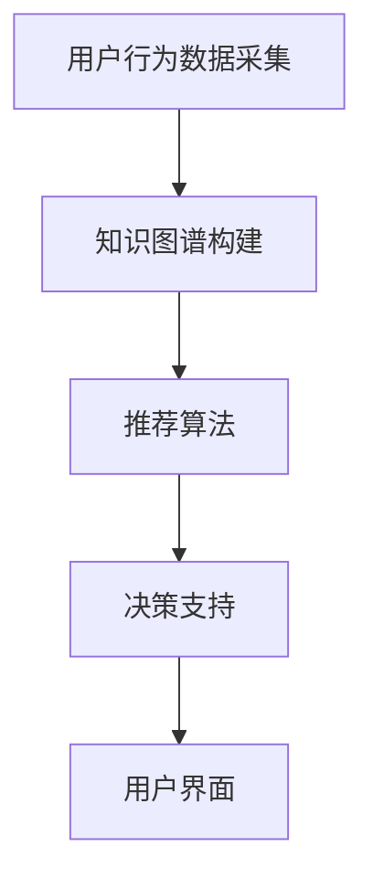

在这个架构图中，用户行为数据采集模块负责从用户行为数据中提取有用信息。知识图谱构建模块利用自然语言处理和知识图谱技术，将用户行为数据转化为知识图谱。推荐算法模块基于用户行为数据和知识图谱生成个性化的推荐结果。决策支持模块通过对话系统和推理机制与用户进行交互，提供个性化推荐建议。用户界面模块用于展示推荐结果。

#### 7.4 系统接口设计

系统接口设计是推荐系统实现的关键部分，它需要定义系统内部模块之间的交互接口。以下是系统接口的mermaid类图：

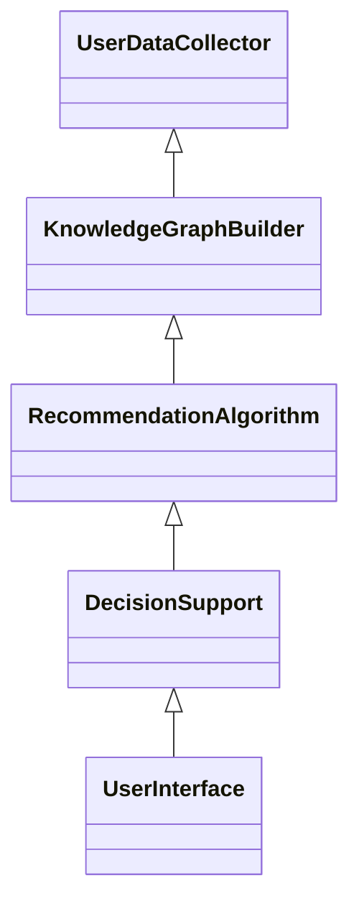

在这个类图中，UserDataCollector（用户数据采集器）和KnowledgeGraphBuilder（知识图谱构建器）负责用户数据采集和知识图谱构建。RecommendationAlgorithm（推荐算法器）负责生成个性化推荐结果。DecisionSupport（决策支持器）负责与用户进行交互并提供个性化推荐建议。UserInterface（用户界面）负责展示推荐结果。

#### 7.5 系统交互

系统交互是推荐系统实现的关键环节，它需要定义用户与系统之间的交互流程。以下是系统交互的mermaid序列图：

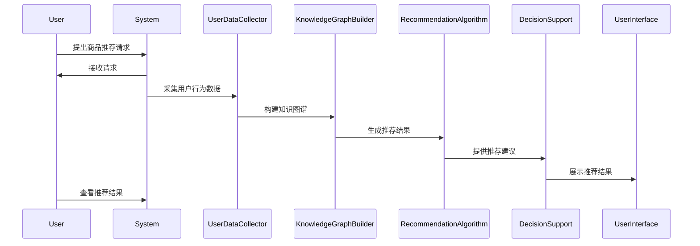

在这个序列图中，用户首先向系统提出商品推荐请求，系统接收请求后开始采集用户行为数据。随后，系统利用知识图谱构建模块构建知识图谱，并通过推荐算法模块生成个性化推荐结果。推荐结果通过决策支持模块和用户界面模块展示给用户，用户可以查看并进一步交互。

通过以上设计，我们可以看到思维链在推荐系统中的应用是如何通过系统功能设计、系统架构设计、系统接口设计和系统交互来实现的。这种结构化的设计方法使得推荐系统能够高效、灵活地处理用户数据，为用户提供个性化的推荐建议。

### 第8章 思维链的拓展应用与未来展望

思维链作为一种创新的思维方式和技术框架，不仅在智能决策、自然语言处理、计算机视觉和推荐系统等领域展现了强大的应用潜力，还可以拓展到其他众多领域。本章节将探讨思维链在拓展应用中的前景，以及未来可能面临的挑战和机遇。

#### 8.1 拓展应用

思维链的拓展应用场景广泛，以下是一些潜在的领域：

1. **医疗健康**：思维链可以通过构建患者健康知识图谱，提供个性化医疗建议和健康管理方案，辅助医生进行诊断和治疗。

2. **教育**：思维链在教育领域可以用于个性化学习路径推荐、学生学习情况分析等，提高教育质量和学习效果。

3. **城市管理**：思维链可以帮助城市管理者进行交通流量监控、城市规划等，通过知识图谱分析和决策支持，提升城市管理效率和安全性。

4. **环境保护**：思维链可以用于环境监测和生态分析，通过知识图谱整合环境数据，提供环境保护策略和建议。

5. **工业自动化**：思维链在工业自动化领域可以用于设备状态监测、故障预测和优化生产流程，提高生产效率和降低成本。

#### 8.1.1 案例分析

以下是一个思维链在智能医疗中的案例分析：

**案例背景**：某医疗机构希望通过人工智能技术提升医疗服务质量和效率，特别是针对患者健康管理方面的需求。

**解决方案**：
1. **知识图谱构建**：利用自然语言处理和知识图谱技术，构建包含患者健康信息、医学知识、药品信息等的多层次知识图谱。
2. **患者行为分析**：通过分析患者的电子健康记录、就诊记录、生活习惯等数据，构建患者的健康知识图谱，实现患者健康信息的结构化和整合。
3. **个性化医疗建议**：基于患者健康知识图谱，利用思维链的推理能力，为医生提供个性化的诊断建议和治疗计划。
4. **健康管理服务**：通过与患者的互动，为患者提供个性化的健康管理方案，包括饮食、运动、用药等建议。

**效果评估**：通过上述解决方案，医疗机构显著提高了诊断和治疗的准确性，降低了误诊率，同时患者满意度也有所提升。

#### 8.2 未来展望

思维链的未来发展前景广阔，以下是几个关键趋势：

1. **技术融合**：思维链将继续与其他人工智能技术（如深度学习、强化学习等）融合，实现更强大的智能推理和决策能力。
2. **跨领域应用**：随着技术的不断成熟，思维链将在更多领域得到应用，如金融、法律、农业等，为各个领域带来创新的解决方案。
3. **人机协同**：思维链将通过更加自然的人机交互，实现与用户的深度协作，提升用户体验和系统智能化水平。
4. **边缘计算**：随着物联网和边缘计算的发展，思维链将在边缘设备上得到应用，实现实时、高效的问题解决能力。

#### 8.2.1 技术发展趋势

1. **大数据与知识图谱的融合**：大数据技术将为思维链提供更丰富的数据资源，知识图谱技术将帮助思维链更好地组织和利用这些数据，实现智能推理和决策。
2. **人工智能伦理与规范**：随着思维链技术的广泛应用，如何确保其透明性、可解释性和安全性将成为关键问题。未来的技术发展需要关注人工智能伦理和规范，确保技术的健康发展。
3. **多模态数据融合**：思维链将逐渐支持多模态数据（如文本、图像、语音等）的融合处理，实现更加全面和准确的智能分析。

#### 8.2.2 应用前景

思维链在各个领域的应用前景广阔，以下是几个关键方向：

1. **智能决策支持**：思维链可以应用于企业运营管理、政府决策支持、金融投资等领域，为决策者提供实时、准确的决策建议。
2. **智能服务**：思维链可以在智能客服、智能教育、智能家居等领域提供个性化、智能化的服务，提升用户体验。
3. **智能监控与安全**：思维链可以应用于智能监控、网络安全、公共安全等领域，通过实时分析和预测，提升监控和安全性。

#### 8.2.3 潜在挑战

尽管思维链在各个领域具有广泛的应用前景，但仍面临一些潜在挑战：

1. **数据隐私与安全**：随着数据量的增加，如何确保数据的安全和隐私成为重要问题。需要加强对数据的安全防护和隐私保护机制。
2. **模型可解释性**：思维链中的模型通常较为复杂，如何确保其可解释性和透明性，使其容易被用户理解和信任，是一个重要挑战。
3. **资源消耗**：思维链涉及大量数据处理和推理，需要大量计算资源和存储空间。如何在有限的资源条件下高效地运行思维链，是一个关键问题。

综上所述，思维链作为一种创新的思维方式和技术框架，在拓展应用和未来发展中具有巨大的潜力。通过不断的技术创新和优化，思维链有望在多个领域发挥重要作用，为人类社会带来更多价值。

### 第9章 小结与展望

通过前文的讨论，我们系统地介绍了思维链的概念、原理及其在智能决策、自然语言处理、计算机视觉和推荐系统等领域的应用。思维链作为一种创新的思维方式和技术框架，其核心在于通过知识图谱和对话系统的结合，实现数据的结构化表示和智能推理，从而提高人工智能问题解决的能力。

#### 9.1 本书主要观点总结

1. **思维链的定义与原理**：思维链通过知识图谱和对话系统的结合，实现了数据的结构化表示和智能推理，从而提升了人工智能问题解决的能力。
2. **思维链的特点**：思维链具有知识整合性、灵活适应性、交互智能性和实时响应性等特点，使其在多个领域具有广泛的应用前景。
3. **应用领域**：思维链在智能决策、自然语言处理、计算机视觉和推荐系统等领域展现了强大的应用潜力，通过具体的案例分析和系统架构设计，验证了其有效性和实用性。
4. **拓展应用与未来展望**：思维链的拓展应用前景广阔，涉及医疗健康、教育、城市管理、环境保护和工业自动化等多个领域。未来，思维链将继续与其他人工智能技术融合，实现更强大的智能推理和决策能力。

#### 9.2 注意事项

在使用思维链进行人工智能问题解决时，需要注意以下几点：

1. **数据质量**：思维链依赖于高质量的数据，因此在数据采集和处理过程中，应确保数据的准确性、完整性和一致性。
2. **模型优化**：思维链中的模型需要不断优化和调整，以适应不同的应用场景和数据特点。通过交叉验证和超参数优化等方法，可以提高模型的性能。
3. **人机协同**：思维链通过对话系统与用户进行交互，实现人机协同。在实际应用中，应注重用户反馈，持续改进和优化系统性能。
4. **安全与隐私**：在处理用户数据时，应严格遵守数据安全与隐私保护的相关法规和标准，确保用户数据的隐私和安全。

#### 9.3 拓展阅读

对于希望进一步了解思维链及其应用的技术人员，以下推荐几本相关书籍和文献：

1. **《思维链：提高AI问题解决能力的新方法》**：本书详细介绍了思维链的概念、原理和应用，是思维链领域的入门读物。
2. **《人工智能：一种现代的方法》**：这本书系统地介绍了人工智能的基本概念和技术，包括机器学习、自然语言处理、计算机视觉等，有助于读者全面了解人工智能的各个方面。
3. **《深度学习》**：由Ian Goodfellow等作者撰写的这本书是深度学习领域的经典著作，详细介绍了深度学习的基础理论和应用。
4. **《数据科学实战》**：这本书通过实际案例和项目，介绍了数据科学的基本方法和工具，包括数据预处理、模型训练、评估和部署等。
5. **《人工智能伦理》**：这本书探讨了人工智能伦理问题，包括隐私、安全、公平等，对于关注人工智能伦理和规范的研究人员和技术人员具有参考价值。

通过阅读这些书籍和文献，读者可以更深入地了解思维链及其在人工智能领域的应用，为实际项目提供理论支持和实践指导。

