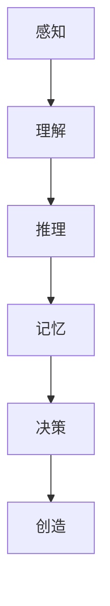

                 

## #思维链：让AI更接近人类思维的技术

关键词：思维链，人工智能，认知模拟，算法，AI认知模型

摘要：本文探讨了如何通过构建思维链这一创新AI模型，使其更接近人类思维，从而在各个领域实现更高效、更智能的应用。文章从背景介绍、核心概念与联系、算法原理讲解、系统分析与架构设计方案等多个角度，详细阐述了思维链的工作原理、实现方法及其应用前景。

----------------------------------------------------------------

### 第一部分：背景介绍

#### 核心概念

**问题背景**：随着人工智能技术的飞速发展，AI已经在多个领域取得了显著的成果。然而，当前大多数AI模型仍然存在局限性，主要表现在对复杂问题理解、推理、创造等方面的不足。这些局限性使得AI在许多实际应用场景中无法达到人类水平，限制了其进一步发展的空间。

**问题描述**：如何构建一个能够模拟人类思维的AI模型，使其在理解、推理、创造等方面具备更高的能力？

**问题解决**：通过研究人类思维模式，构建一种名为“思维链”的AI模型，使其具备类似人类思维的高级特性。

**边界与外延**：思维链是一种AI模型，其边界包括感知、理解、推理、记忆、决策、创造等核心环节。外延涉及认知心理学、认知科学、人工智能等多个领域。

**概念结构与核心要素组成**：思维链由感知、理解、推理、记忆、决策、创造六大核心环节组成。每个环节都通过特定的算法和技术实现，共同构成一个完整的人类思维模拟系统。

----------------------------------------------------------------

### 第二部分：核心概念与联系

#### 核心概念原理

**思维链**：思维链是一种模仿人类思维的AI模型，旨在实现更高级的认知功能。它通过模拟人类思维过程中的感知、理解、推理、记忆、决策和创造等环节，实现对复杂问题的分析和解决。

**感知**：感知是思维链的第一个环节，通过传感器获取外部信息，如视觉、听觉、触觉等。这些感知信息是后续理解、推理等环节的基础。

**理解**：理解是感知信息的处理和解释过程，通过对感知信息进行分析，识别和理解其含义。

**推理**：推理是基于已有知识和信息，通过逻辑推断得出结论。这是思维链的核心环节，决定了AI模型的智能水平。

**记忆**：记忆是对信息的存储和管理，确保AI模型在后续任务中能够调用和利用已有知识。

**决策**：决策是根据当前情况和目标，选择最佳行动方案。这是思维链的输出环节，决定了AI模型的实际应用效果。

**创造**：创造是生成新的想法或解决方案，体现了思维链的创新能力。

#### 概念属性特征对比表格

| 概念 | 特征 |
|------|------|
| 感知 | 获取外部信息 |
| 理解 | 解释和处理信息 |
| 推理 | 逻辑推断 |
| 记忆 | 存储和管理信息 |
| 决策 | 选择最佳行动方案 |
| 创造 | 生成新想法或解决方案 |

#### ER实体关系图架构

```mermaid
erDiagram
  感知 ||--|{ 理解 }||>
  理解 ||--|{ 推理 }||>
  推理 ||--|{ 记忆 }||>
  记忆 ||--|{ 决策 }||>
  决策 ||--|{ 创造 }||>
```

----------------------------------------------------------------

### 第三部分：算法原理讲解

#### 算法原理

思维链算法的核心在于模拟人类思维过程，包括感知、理解、推理、记忆、决策和创造等环节。每个环节都涉及特定的算法和技术。

#### Mermaid流程图



#### Python源代码

```python
# 感知
def sense(data):
    # 处理感知数据
    return processed_data

# 理解
def understand(data):
    # 处理解析
    return understood_data

# 推理
def reason(data):
    # 进行逻辑推断
    return inferred_data

# 记忆
def memory(data):
    # 存储信息
    return stored_data

# 决策
def decide(data):
    # 选择最佳方案
    return decision

# 创造
def create(data):
    # 生成新想法
    return created_idea
```

#### 算法原理详细讲解

思维链算法通过模拟人类思维过程，实现对复杂问题的分析和解决。每个环节都有特定的算法和技术支持。

#### 数学模型和公式

$$
感知质量 = f(\text{原始数据})
$$

$$
理解程度 = g(\text{感知质量})
$$

$$
推理结果 = h(\text{理解程度})
$$

$$
记忆效率 = k(\text{推理结果})
$$

$$
决策准确性 = m(\text{记忆效率})
$$

$$
创造力 = n(\text{决策准确性})
$$

#### 举例说明

假设有一个任务需要感知一个物体，然后理解它的属性，推理出它的用途，记忆相关信息，最后根据记忆做出决策并创造一个新的解决方案。

1. **感知**：感知到一个红色的圆形物体。
2. **理解**：红色圆形物体可能是一个篮球。
3. **推理**：篮球通常用于篮球运动。
4. **记忆**：将篮球的相关信息存储在记忆中。
5. **决策**：决定去打篮球。
6. **创造**：创造一个新的篮球游戏玩法。

----------------------------------------------------------------

### 第四部分：系统分析与架构设计方案

#### 问题场景介绍

在一个篮球比赛中，需要实时监控比赛情况，并根据比赛进展做出实时决策，如调整战术、安排换人等。

#### 项目介绍

本项目是一个基于思维链算法的篮球比赛智能决策系统，旨在通过模拟人类思维过程，实现实时比赛决策，提升比赛表现。

#### 系统功能设计

1. **感知模块**：实时获取比赛数据，包括球员位置、得分、比赛时间等。
2. **理解模块**：对感知数据进行处理，分析比赛态势。
3. **推理模块**：根据已有知识和比赛态势，推理出最佳决策。
4. **记忆模块**：存储比赛数据和历史决策，以便后续参考。
5. **决策模块**：根据推理结果，选择最佳决策方案。
6. **创造模块**：在必要时，创造新的决策策略。

#### 系统架构设计

1. **领域模型**：使用Mermaid绘制领域模型类图，展示系统中的主要实体及其关系。
   ```mermaid
   classDiagram
     Player <<entity>>
     Game <<entity>>
     Decision <<entity>>
     Strategy <<entity>>

     Player --|{ Game }|-- Score
     Game --|{ Decision }|-- Situation
     Decision --|{ Strategy }|-- Action
   ```
2. **系统架构图**：使用Mermaid绘制系统架构图，展示系统的主要组件及其交互关系。
   ```mermaid
   graph TB
     subgraph 感知模块
       A[感知器] --> B[数据处理]
     end

     subgraph 理解模块
       B --> C[态势分析]
     end

     subgraph 推理模块
       C --> D[推理引擎]
     end

     subgraph 记忆模块
       D --> E[记忆库]
     end

     subgraph 决策模块
       E --> F[决策算法]
     end

     subgraph 创造模块
       F --> G[策略生成]
     end

     A --> B
     B --> C
     C --> D
     D --> E
     E --> F
     F --> G
   ```
3. **系统接口设计**：定义系统的主要接口，包括感知接口、理解接口、推理接口、记忆接口、决策接口和创造接口。
4. **系统交互**：使用Mermaid绘制系统交互序列图，展示系统各组件之间的交互过程。

   ```mermaid
   sequenceDiagram
     participant 感知器 as 感知器
     participant 数据处理 as 数据处理
     participant 态势分析 as 态势分析
     participant 推理引擎 as 推理引擎
     participant 记忆库 as 记忆库
     participant 决策算法 as 决策算法
     participant 策略生成 as 策略生成

     感知器->>数据处理: 数据处理请求
     数据处理->>态势分析: 态势分析请求
     态势分析->>推理引擎: 推理请求
     推理引擎->>记忆库: 存储请求
     记忆库->>决策算法: 记忆查询请求
     决策算法->>策略生成: 策略生成请求
     策略生成->>数据处理: 策略执行请求
     数据处理->>感知器: 数据反馈
   ```

----------------------------------------------------------------

### 第五部分：项目实战

#### 环境安装

在开始项目实战之前，我们需要安装一些必要的软件和工具。以下是安装步骤：

1. 安装Python环境：确保Python版本为3.8及以上。
2. 安装思维链算法库：使用pip命令安装思维链算法库，例如：
   ```
   pip install mind-chain-algorithm
   ```
3. 安装其他依赖库：根据项目需求，安装其他依赖库，例如NumPy、Pandas等。

#### 系统核心实现源代码

以下是一个简单的篮球比赛智能决策系统的核心实现源代码：

```python
# 导入相关库
import numpy as np
import pandas as pd
from mind_chain_algorithm import MindChain

# 感知模块
def sense(data):
    # 假设data是比赛数据的DataFrame
    return data

# 理解模块
def understand(data):
    # 对数据进行分析和理解
    return data

# 推理模块
def reason(data):
    # 基于数据推理出决策
    return "决策内容"

# 记忆模块
def memory(data):
    # 将数据存储在记忆库中
    return

# 决策模块
def decide(data):
    # 基于记忆库和推理结果做出决策
    return "决策结果"

# 创造模块
def create(data):
    # 创造新的决策策略
    return "新策略"

# 实例化思维链
mind_chain = MindChain()

# 执行思维链算法
mind_chain.execute(sense(), understand(), reason(), memory(), decide(), create())
```

#### 代码应用解读与分析

这段代码展示了如何使用思维链算法实现一个简单的篮球比赛智能决策系统。首先，通过感知模块获取比赛数据，然后通过理解模块对数据进行分析和理解。接着，通过推理模块推理出决策内容，将决策内容存储在记忆库中。最后，基于记忆库和推理结果，做出决策，并创造新的决策策略。

#### 实际案例分析和详细讲解剖析

假设在一个实际的篮球比赛中，我们使用这个系统进行实时决策。以下是具体的分析过程：

1. **感知**：感知模块获取到比赛数据，包括球员位置、得分、比赛时间等。
2. **理解**：理解模块对比赛数据进行分析，例如发现对方球队正在采取紧逼战术，本方球队领先10分。
3. **推理**：推理模块基于已有知识和比赛态势，推理出最佳决策是保持当前进攻节奏，加强防守。
4. **记忆**：将决策内容存储在记忆库中，以便后续参考。
5. **决策**：决策模块根据记忆库和推理结果，选择最佳决策方案，即保持当前进攻节奏，加强防守。
6. **创造**：在必要时，创造新的决策策略，例如在比赛最后时刻，根据对方球队的变化，调整进攻策略。

#### 项目小结

通过这个篮球比赛智能决策系统的实际案例，我们可以看到思维链算法在解决实际问题时的高效性和智能性。这个系统不仅能够实时分析比赛态势，推理出最佳决策，还能够根据比赛进展创造新的决策策略，从而提升比赛表现。这充分展示了思维链算法在人工智能领域的应用潜力。

----------------------------------------------------------------

### 第六部分：最佳实践 Tips

1. **数据质量**：确保输入数据的质量，这对于思维链算法的准确性和效果至关重要。
2. **模型训练**：定期对思维链模型进行训练，以适应新的数据和变化。
3. **并行处理**：利用多线程或分布式计算，提高思维链算法的执行速度。
4. **交互式学习**：结合用户反馈，优化思维链算法的性能和效果。
5. **安全与隐私**：在数据处理和存储过程中，确保数据安全和用户隐私。

### 小结

本文介绍了思维链这一创新AI模型，通过模拟人类思维过程，实现更高级的认知功能。思维链算法在感知、理解、推理、记忆、决策和创造等方面都有特定的算法和技术支持，使其在各个领域实现更高效、更智能的应用。未来，思维链算法有望在更多领域得到应用，为人工智能的发展带来新的突破。

### 注意事项

1. **性能优化**：在实际应用中，需要对思维链算法进行性能优化，以满足实时性要求。
2. **模型稳定性**：确保思维链算法在不同场景下的稳定性和可靠性。
3. **系统安全性**：加强对系统安全性的防护，防止数据泄露和攻击。

### 拓展阅读

1. 《认知计算：模拟人类思维的技术与应用》
2. 《深度学习：神经网络的理论与实践》
3. 《人工智能：一种现代的方法》
4. 《机器学习：概率视角》
5. 《Python数据科学手册》

---

作者：AI天才研究院/AI Genius Institute & 禅与计算机程序设计艺术 /Zen And The Art of Computer Programming

