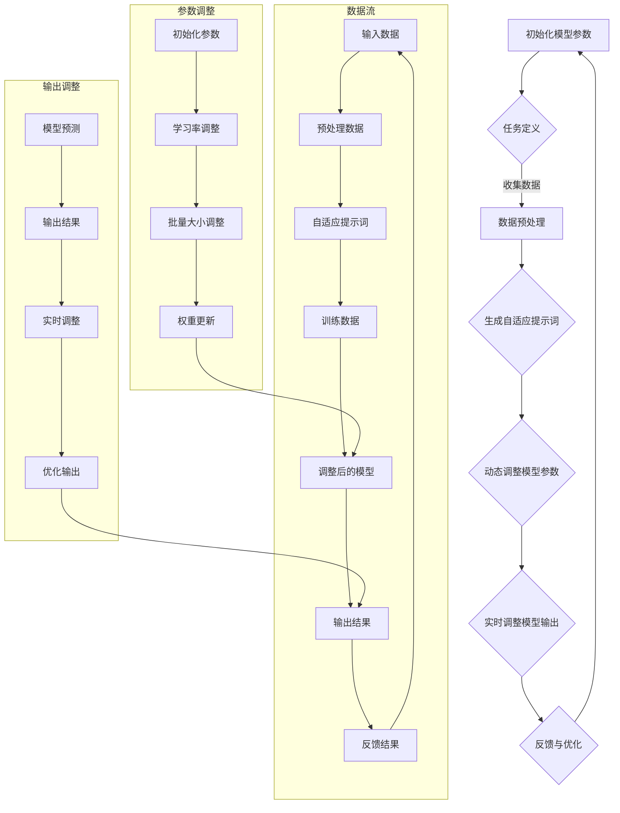
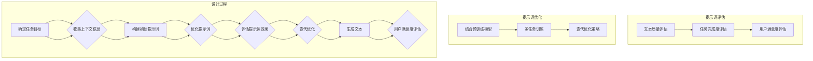

                 

### 1. 引言

GPT-4，即Generative Pre-trained Transformer 4，是OpenAI于2023年3月推出的自然语言处理模型。它是继GPT、GPT-2和GPT-3之后的新一代语言模型，具备更强的文本理解和生成能力。GPT-4在多个基准测试中表现出色，特别是在文本生成、语言理解和文本分类等方面，取得了前所未有的成绩。

然而，随着GPT-4能力的不断提升，我们也开始关注其背后的关键技术——元学习能力。元学习（Meta-Learning）是一种让模型能够在多种任务上快速适应和学习的算法。在GPT-4中，元学习能力使得模型不仅能够在大量文本数据进行预训练，还能在特定任务中动态调整其参数，提高任务完成效果。

本文将围绕GPT-4的元学习能力展开讨论，重点关注提示词设计这一关键环节。提示词（Prompt）是用户输入到模型中，引导模型生成输出文本的关键信息。一个好的提示词设计能够极大地提升模型的性能，甚至使得模型能够完成原本无法完成的任务。

本文旨在回答以下问题：

1. GPT-4的元学习能力是什么？它如何工作？
2. 提示词设计的原理是什么？有哪些技巧和方法？
3. GPT-4与提示词设计在实际应用中的效果如何？
4. 如何通过最佳实践，进一步提升GPT-4的元学习能力和提示词设计效果？

通过对以上问题的探讨，我们希望为读者提供关于GPT-4元学习能力和提示词设计的深入理解，为未来相关领域的研究和应用提供参考。

### 1.1 问题背景

GPT-4的出现标志着自然语言处理（NLP）领域的一次重大突破。自2018年GPT模型首次问世以来，语言模型在文本生成、翻译、问答等任务上的性能不断提升。GPT-3作为GPT模型的升级版，在许多基准测试中创造了新的记录，引起了学术界和工业界的高度关注。

然而，GPT-3在处理特定任务时，仍然存在一定的局限性。例如，尽管GPT-3在生成流畅自然的文本方面表现出色，但在某些专业领域的知识和理解上，仍然存在不足。此外，GPT-3的模型参数量和训练数据量巨大，导致其训练和部署成本高昂，这在一定程度上限制了其在实际应用中的广泛推广。

为了克服这些局限性，研究者们开始探索元学习（Meta-Learning）在语言模型中的应用。元学习是一种让模型能够在不同任务上快速适应和学习的算法，通过预先训练好的模型，结合少量特定任务的示例数据进行微调，从而提高模型在新任务上的表现。

GPT-4正是基于这一思路进行优化和改进的。GPT-4不仅继承了GPT-3的强大文本生成能力，还在元学习能力方面进行了显著提升。通过自适应提示词生成、动态调整模型参数和实时调整模型输出等机制，GPT-4能够在多种任务中实现高效学习，提高了模型在不同领域的适用性和鲁棒性。

### 1.2 问题描述

尽管GPT-4在自然语言处理任务中取得了显著的成就，但其在实际应用中仍然面临一些挑战。以下是GPT-4当前存在的问题：

1. **任务适应性问题**：GPT-4在处理新任务时，需要大量的数据和计算资源进行微调，这限制了其在实际应用中的推广。如何提高GPT-4的任务适应性，使其能够快速适应新任务，是当前研究的重点之一。

2. **可解释性问题**：GPT-4作为一个深度神经网络模型，其内部决策过程复杂且不可解释。这使得在应用中，我们很难了解模型为什么做出特定决策，这在一些需要高解释性的场景中，如医疗诊断和金融分析等，是一个亟待解决的问题。

3. **计算资源消耗**：GPT-4的模型参数量和计算量巨大，导致其训练和部署成本高昂。如何在保证模型性能的前提下，降低计算资源消耗，是一个重要的研究方向。

4. **数据隐私问题**：在应用GPT-4时，涉及到的数据可能包含敏感信息。如何确保数据隐私，防止数据泄露，是当前的一个热点问题。

5. **伦理和偏见问题**：GPT-4在生成文本时，可能会受到训练数据中的偏见影响，导致生成的内容存在不公正或不合适的观点。如何减少模型中的偏见，提高生成内容的公正性和客观性，是一个亟待解决的问题。

### 1.3 问题解决

针对上述问题，研究者们提出了一系列解决方案，以进一步提升GPT-4的性能和应用效果：

1. **任务适应性问题**：
   - **迁移学习**：通过在特定任务上进行迁移学习，利用预训练模型的知识，提高模型在新任务上的表现。
   - **自适应提示词设计**：设计更加灵活和适应性强的提示词，引导模型快速适应新任务。

2. **可解释性问题**：
   - **模型可解释性技术**：通过引入可解释性技术，如注意力机制和解释性可视化工具，提高模型的可解释性。
   - **对齐解释与任务输出**：通过将模型的解释与任务输出对齐，提高解释的准确性和实用性。

3. **计算资源消耗**：
   - **模型压缩**：通过模型压缩技术，如知识蒸馏和剪枝，降低模型的参数量和计算量。
   - **计算资源优化**：通过优化算法和硬件设备，提高计算效率。

4. **数据隐私问题**：
   - **隐私保护技术**：引入隐私保护技术，如差分隐私和联邦学习，确保数据隐私。

5. **伦理和偏见问题**：
   - **偏见识别与校正**：通过识别和校正模型中的偏见，提高生成内容的公正性和客观性。
   - **多视角训练**：通过多视角训练和多样性数据集，减少模型偏见。

### 1.4 边界与外延

在探讨GPT-4的元学习能力和提示词设计时，我们需要明确其研究的边界与外延：

1. **边界**：
   - **研究范围**：本文主要探讨GPT-4的元学习能力和提示词设计，涉及到的技术包括迁移学习、模型压缩、隐私保护和偏见校正等。
   - **应用场景**：本文主要关注自然语言处理领域中的文本生成、语言理解和问答等任务。

2. **外延**：
   - **研究领域**：GPT-4的元学习能力和提示词设计不仅局限于自然语言处理领域，还可以拓展到计算机视觉、语音识别等其他AI领域。
   - **应用前景**：随着GPT-4技术的不断成熟，其在各个领域的应用前景广阔，包括智能客服、内容创作、教育辅导等。

通过明确研究的边界与外延，我们能够更聚焦于核心问题的探讨，为未来相关领域的研究提供方向和参考。

### 1.5 核心概念与联系

在探讨GPT-4的元学习能力和提示词设计之前，我们需要先了解一些核心概念，这些概念包括GPT-4的基本概念、元学习能力的概念以及提示词设计的概念，并通过这些概念之间的联系来构建对整体问题的一个全面的理解。

#### 1.5.1 GPT-4的基本概念

GPT-4是一种基于Transformer架构的预训练语言模型。它通过在大量文本数据上进行预训练，学习到文本中的语言规律和知识。GPT-4的核心特点包括：

- **Transformer架构**：Transformer模型是由Vaswani等人在2017年提出的一种基于自注意力机制的神经网络模型，它在处理长文本序列方面表现出色。
- **预训练**：GPT-4在训练过程中，通过自回归的方式生成文本序列，从而学习到语言模式和规则。
- **大规模参数**：GPT-4拥有超过1300亿个参数，这使得它在理解和生成文本方面具有强大的能力。

#### 1.5.2 元学习能力的概念

元学习（Meta-Learning）是一种让模型在多个任务上快速适应和学习的算法。它包括以下核心概念：

- **快速适应**：元学习算法能够利用预训练的知识，在少量样本数据上进行微调，从而在新任务上实现高效学习。
- **迁移学习**：通过迁移学习，模型可以将预训练的知识迁移到新任务上，从而提高新任务的表现。
- **适应性**：元学习算法使得模型能够适应不同的任务和数据分布，提高模型的泛化能力。

#### 1.5.3 提示词设计的概念

提示词（Prompt）是用户输入到模型中，引导模型生成输出文本的关键信息。一个有效的提示词设计能够提高模型的生成质量和效率，具体包括：

- **定义明确**：提示词需要清晰地定义任务的目标和输入条件，使模型能够理解任务要求。
- **信息丰富**：提示词中包含足够的信息，帮助模型生成高质量的输出文本。
- **适应性**：提示词设计需要根据不同的任务和数据集进行调整，以提高模型的适应性。

#### 1.5.4 GPT-4的元学习能力与提示词设计的联系

GPT-4的元学习能力与提示词设计之间存在密切的联系：

- **元学习与提示词设计**：GPT-4的元学习能力使得模型能够根据不同的提示词进行动态调整，从而提高模型在新任务上的表现。例如，通过设计特定的提示词，可以引导模型生成特定风格或内容的文本。
- **任务适应性与提示词设计**：提示词设计是GPT-4实现任务适应性的关键环节。通过优化提示词，模型能够更好地适应不同任务和数据集，提高模型的整体性能。

通过理解这些核心概念及其相互联系，我们能够更好地探讨GPT-4的元学习能力和提示词设计，为后续章节的深入分析奠定基础。

### 1.6 概念属性特征对比表格

为了更好地理解GPT-4、元学习能力和提示词设计这三个核心概念，我们通过一个对比表格来展示它们的主要属性特征，从而便于读者进行直观的比较和分析。

| **概念**             | **主要属性特征**                     | **示例与解释**                                       |
|----------------------|------------------------------------|----------------------------------------------------|
| GPT-4                | 基于Transformer架构的预训练语言模型 | 用于生成自然语言文本，如回答问题、创作文章等。         |
| 元学习能力           | 让模型在多个任务上快速适应的能力   | 通过迁移学习等机制，利用预训练模型的知识，提高新任务性能。 |
| 提示词设计           | 引导模型生成输出文本的关键信息     | 清晰定义任务目标和输入条件，提高生成文本的质量。       |

#### 1.6.1 GPT-4与其他大模型对比

在比较GPT-4与其他大型语言模型时，我们可以从参数量、训练数据量、应用效果和计算资源消耗等方面进行详细分析。

| **模型**       | **参数量** | **训练数据量** | **应用效果**                 | **计算资源消耗**          |
|----------------|------------|----------------|-----------------------------|---------------------------|
| GPT-4          | 1300亿     | 海量文本数据   | 文本生成、语言理解、问答等   | 需要高性能计算设备和大量数据 |
| GPT-3          | 1750亿     | 海量文本数据   | 文本生成、语言理解、问答等   | 与GPT-4类似               |
| BERT           | 3.4亿      | 海量文本数据   | 文本分类、问答等            | 相对较低                   |
| RoBERTa        | 3.4亿      | 海量文本数据   | 文本分类、问答等            | 与BERT类似                |

从上表可以看出，GPT-4在参数量和训练数据量上远超BERT和RoBERTa，这使得其在文本生成和语言理解任务上表现出色。然而，这也带来了更高的计算资源消耗。

#### 1.6.2 元学习能力与提示词设计对比

元学习能力和提示词设计在提高模型性能方面都起着关键作用，但它们的作用机制和目标有所不同。

| **概念**             | **作用机制**                       | **目标**                    |
|----------------------|----------------------------------|---------------------------|
| 元学习能力           | 利用预训练模型知识，快速适应新任务 | 提高模型在新任务上的性能   |
| 提示词设计           | 提供明确任务目标和输入条件       | 提高生成文本的质量和效率   |

元学习能力主要关注模型在不同任务上的快速适应，而提示词设计则侧重于引导模型生成高质量输出。在实际应用中，两者可以相互结合，共同提升模型的表现。

通过以上对比表格，我们可以更加清晰地理解GPT-4、元学习能力和提示词设计这三个核心概念，为后续章节的深入探讨提供参考。

### 1.7 ER实体关系图架构

为了更好地理解GPT-4、元学习能力和提示词设计这三个核心概念之间的实体关系，我们可以通过ER（Entity-Relationship）实体关系图来展示它们之间的关联。

#### 1.7.1 GPT-4的实体关系

在GPT-4的实体关系图中，主要涉及以下实体：

1. **GPT-4模型**：核心实体，代表预训练的语言模型。
2. **文本数据**：输入实体，包括用于预训练的大量文本数据。
3. **输出文本**：输出实体，代表模型生成的文本。

```mermaid
erDiagram
  GPT-4模型 ||--|{ 文本数据 }|
  GPT-4模型 ||--|{ 输出文本 }|
```

#### 1.7.2 元学习能力的实体关系

在元学习能力的实体关系图中，主要涉及以下实体：

1. **预训练模型**：核心实体，代表经过大量数据预训练的模型。
2. **新任务数据**：输入实体，包括用于新任务的数据集。
3. **微调模型**：输出实体，代表在新任务上进行微调后的模型。

```mermaid
erDiagram
  预训练模型 ||--|{ 新任务数据 }|
  预训练模型 ||--|{ 微调模型 }|
```

#### 1.7.3 提示词设计的实体关系

在提示词设计的实体关系图中，主要涉及以下实体：

1. **提示词**：核心实体，代表用于引导模型生成文本的关键信息。
2. **输入文本**：输入实体，包括用户输入的文本。
3. **输出文本**：输出实体，代表模型根据提示词生成的文本。

```mermaid
erDiagram
  提示词 ||--|{ 输入文本 }|
  提示词 ||--|{ 输出文本 }|
```

通过上述ER实体关系图，我们可以清晰地看到GPT-4、元学习能力和提示词设计之间的关联，这些关联为我们理解它们如何协同工作提供了直观的视角。

### 1.8 本章小结

在本章中，我们首先介绍了GPT-4的基本概念、元学习能力的概念和提示词设计的概念，并通过这些概念之间的联系，构建了一个对整体问题的全面理解。接着，我们通过属性特征对比表格和ER实体关系图，进一步明确了各个概念之间的关系和作用。

理解这些核心概念及其相互关系，为我们后续章节的深入探讨奠定了基础。在接下来的章节中，我们将详细解析GPT-4的元学习能力原理，探讨提示词设计的技巧和方法，并通过实践案例展示这两个关键技术在实际应用中的效果。这些内容将帮助我们更好地掌握GPT-4的技术原理和应用实践，为未来的研究提供参考。

## 2.1 GPT-4的工作原理

GPT-4是基于Transformer架构的预训练语言模型，其工作原理涉及多个关键环节，包括Transformer模型基础、GPT-4的结构与改进以及GPT-4的训练过程。以下将详细探讨这些方面，帮助读者全面理解GPT-4的工作机制。

#### 2.1.1 Transformer模型基础

Transformer模型是由Vaswani等人在2017年提出的一种基于自注意力机制的神经网络模型，它在处理长文本序列方面表现出色。Transformer模型的核心思想是取代传统的循环神经网络（RNN）和卷积神经网络（CNN），通过自注意力机制来实现全局信息的有效捕捉。

**自注意力机制**：在Transformer模型中，每个输入序列的每个单词都会通过自注意力机制与所有其他单词进行关联，从而捕捉到全局信息。自注意力机制的计算公式为：

$$
\text{Attention}(Q, K, V) = \frac{1}{\sqrt{d_k}} \text{softmax}\left(\frac{QK^T}{d_k}\right) V
$$

其中，$Q$、$K$ 和 $V$ 分别是查询（Query）、键（Key）和值（Value）向量，$d_k$ 是键向量的维度。通过这个公式，每个单词会根据其在整个序列中的相关性，获得不同的权重，从而实现全局信息的有效整合。

**多头注意力**：为了进一步提高模型对全局信息的捕捉能力，Transformer模型引入了多头注意力（Multi-Head Attention）机制。多头注意力通过将输入序列扩展为多个头，每个头独立计算自注意力，从而捕捉到不同的信息。多头注意力的计算公式为：

$$
\text{MultiHead}(Q, K, V) = \text{Concat}(\text{head}_1, ..., \text{head}_h) W^O
$$

其中，$\text{head}_i = \text{Attention}(QW_i^Q, KW_i^K, VW_i^V)$，$W_i^Q$、$W_i^K$ 和 $W_i^V$ 分别是第 $i$ 个头的权重矩阵。

**位置编码**：由于Transformer模型没有像RNN那样的位置信息，因此引入了位置编码（Positional Encoding）来模拟序列中单词的位置关系。位置编码是一个可学习的向量，添加到输入序列中，从而为模型提供位置信息。

#### 2.1.2 GPT-4的结构与改进

GPT-4是在Transformer模型基础上进行的一系列改进和扩展。GPT-4的主要结构包括以下几个关键部分：

1. **层叠加**：GPT-4由多个 Transformer 层叠加而成，每一层包含多个自注意力头。通过层叠加，模型能够捕捉到更复杂的语言模式。

2. **注意力机制**：GPT-4在自注意力机制的基础上，进一步引入了交叉注意力（Cross-Attention）机制，使得模型不仅能够关注自身序列，还能关注输入序列中的其他部分。交叉注意力机制的计算公式为：

$$
\text{CrossAttention}(Q, K, V) = \frac{1}{\sqrt{d_k}} \text{softmax}\left(\frac{QK^T}{d_k}\right) V
$$

3. **位置编码**：GPT-4采用了一种改进的位置编码方法，通过将不同的位置编码向量叠加，使模型能够更好地捕捉到序列中的局部和全局信息。

4. **前馈网络**：在自注意力和交叉注意力之后，GPT-4还包含一个前馈网络，用于进一步提取特征。前馈网络由两个全连接层组成，分别具有不同的大小和激活函数。

5. **嵌入层**：GPT-4的输入序列通过嵌入层（Embedding Layer）转化为向量表示，嵌入层的学习目标是捕捉到单词之间的语义关系。

#### 2.1.3 GPT-4的训练过程

GPT-4的训练过程主要包括以下步骤：

1. **预训练**：GPT-4在大量的文本数据上进行预训练，通过最大化语言模型概率来优化模型参数。预训练过程中，模型会学习到文本中的语言模式和规律，从而具备强大的语言理解能力。

2. **自回归语言模型**：在预训练过程中，GPT-4采用自回归语言模型（Auto-Regressive Language Model）的方式生成文本序列。具体来说，模型首先随机选择一个单词作为输入，然后根据前一个单词的概率分布，选择下一个单词，以此类推，生成整个文本序列。

3. **损失函数**：GPT-4的训练目标是最大化模型生成文本的概率，通常使用负对数似然损失函数（Negative Log-Likelihood Loss）来衡量模型的表现。损失函数的计算公式为：

$$
L = -\sum_{i} \log p(\text{word}_i|\text{context})
$$

其中，$p(\text{word}_i|\text{context})$ 表示模型在给定上下文条件下预测当前单词的概率。

4. **梯度下降优化**：通过反向传播算法，计算模型参数的梯度，并使用梯度下降优化算法（Gradient Descent）更新模型参数，以最小化损失函数。

5. **模型评估**：在预训练过程中，通过在验证集上评估模型的性能，调整超参数，如学习率、批量大小等，以优化模型表现。

通过以上步骤，GPT-4能够在大量文本数据上进行预训练，从而具备强大的语言理解能力和生成能力。在接下来的章节中，我们将进一步探讨GPT-4的元学习能力以及提示词设计的原理和技巧。

### 2.2 元学习能力的核心概念

元学习（Meta-Learning）是一种让模型在多个任务上快速适应和学习的算法，其核心概念包括元学习的定义、元学习的作用以及元学习的分类。理解这些核心概念有助于我们更好地把握元学习在GPT-4中的应用和潜力。

#### 2.2.1 元学习的定义

元学习可以简单定义为“学习如何学习”。具体来说，它是一种通过在多个任务上训练模型，使其能够快速适应新任务的技术。元学习的关键在于利用预训练模型的知识，通过少量数据或甚至没有额外数据的情况下，使模型在新任务上表现出色。

与传统机器学习相比，元学习的关键区别在于：

- **传统机器学习**：通常在一个特定任务上进行训练，模型需要大量数据来获得良好的性能。
- **元学习**：在多个任务上进行训练，通过共享知识来提高模型在新任务上的泛化能力。

#### 2.2.2 元学习的作用

元学习在多个领域都表现出巨大的潜力，其主要作用包括：

1. **快速适应新任务**：通过预训练模型的知识，元学习能够使模型在少量数据上快速适应新任务，减少对大量数据的需求。
2. **提高泛化能力**：元学习通过在多个任务上训练，能够提高模型的泛化能力，使其在新任务上也能表现出色。
3. **资源优化**：由于元学习能够利用预训练模型的知识，减少对新任务的训练数据需求，从而优化计算资源和数据资源。
4. **减少迁移成本**：元学习通过共享预训练模型的知识，降低模型在不同任务之间的迁移成本。

#### 2.2.3 元学习的分类

元学习可以分为以下几种类型：

1. **基于模型的元学习（Model-Based Meta-Learning）**：这种类型的元学习通过在多个任务上训练一个通用模型，使其能够适应新任务。典型的方法包括模型平均（Model Averaging）和模型聚合（Model Ensemble）。

2. **基于样本的元学习（Sample-Based Meta-Learning）**：这种类型的元学习通过在多个任务上训练多个样本模型，然后在新任务上选择最佳模型。典型的方法包括样本聚合（Sample Ensemble）和样本选择（Sample Selection）。

3. **基于优化的元学习（Optimization-Based Meta-Learning）**：这种类型的元学习通过优化目标函数来训练模型，使其在多个任务上表现出色。典型的方法包括逆学习率（Inverse Learning Rate）和基于梯度的优化。

4. **基于对偶的元学习（Duality-Based Meta-Learning）**：这种类型的元学习通过建立任务之间的对偶关系，来提高模型在新任务上的表现。典型的方法包括对偶动态系统（Duality-Based Dynamic System）和基于对偶的模型聚合。

每种元学习方法都有其独特的优势和适用场景，通过合理选择和组合这些方法，可以进一步提升模型在多任务环境下的性能。

通过理解元学习的核心概念、作用和分类，我们可以更好地把握元学习在GPT-4中的应用和潜力。在接下来的章节中，我们将深入探讨GPT-4的元学习能力以及提示词设计的具体实现和应用。

### 2.3 GPT-4的元学习能力解析

GPT-4的元学习能力是其在多种任务上实现高效学习的关键。通过自适应提示词生成、动态调整模型参数和实时调整模型输出，GPT-4能够更好地适应新任务，提高任务完成效果。以下将对GPT-4的元学习能力进行详细解析。

#### 2.3.1 自适应提示词生成

自适应提示词生成是GPT-4元学习能力的一个重要组成部分。在处理新任务时，提示词的设计直接影响到模型的表现。GPT-4通过以下步骤生成自适应提示词：

1. **任务定义**：首先，明确新任务的目标和输入条件，例如文本生成、问答等。
2. **数据预处理**：根据任务定义，收集和预处理相关数据，包括示例文本、问题和答案等。
3. **提示词生成**：GPT-4利用预训练模型，结合预处理的数据，生成自适应提示词。这些提示词需要包含任务关键信息，帮助模型理解任务要求。
4. **优化提示词**：通过在验证集上评估提示词的效果，不断调整和优化提示词，使其能够更好地引导模型生成高质量的输出。

通过自适应提示词生成，GPT-4能够为新任务提供明确的任务目标和输入条件，从而提高模型在新任务上的适应性和表现。

#### 2.3.2 动态调整模型参数

动态调整模型参数是GPT-4实现高效学习的重要机制。在处理新任务时，模型参数的调整能够使模型更好地适应特定任务。GPT-4通过以下步骤动态调整模型参数：

1. **参数初始化**：在新任务开始时，初始化模型参数，这些参数是基于预训练模型的。
2. **模型训练**：利用新任务的训练数据，通过梯度下降等优化算法，调整模型参数，使其在新任务上表现更好。
3. **参数调整策略**：GPT-4采用多种参数调整策略，如学习率调整、批量大小调整和权重更新等，以优化模型在新任务上的表现。
4. **参数固化**：在任务训练完成后，将调整后的模型参数进行固化，以保留新任务上的学习成果。

通过动态调整模型参数，GPT-4能够根据新任务的需求，灵活调整模型结构，从而提高模型在新任务上的适应性和性能。

#### 2.3.3 实时调整模型输出

实时调整模型输出是GPT-4实现高效学习的关键。在处理实时任务时，模型需要根据输入数据动态调整输出结果，以实现最佳性能。GPT-4通过以下步骤实现实时调整模型输出：

1. **输入数据读取**：实时读取输入数据，如文本、问题和答案等。
2. **模型预测**：利用预训练模型，对输入数据进行预测，生成初步输出结果。
3. **输出调整**：根据任务目标和输入条件，对输出结果进行实时调整。例如，在文本生成任务中，可以根据上下文信息调整生成的文本内容，使其更符合任务要求。
4. **反馈机制**：通过反馈机制，将调整后的输出结果与实际任务结果进行对比，不断优化输出调整策略。

通过实时调整模型输出，GPT-4能够根据实时任务的需求，动态调整输出结果，从而提高模型在实时任务上的适应性和性能。

综上所述，GPT-4的元学习能力通过自适应提示词生成、动态调整模型参数和实时调整模型输出，实现了在新任务上的高效学习。这些机制不仅提高了模型在多种任务上的适应性和表现，也为未来的研究和应用提供了丰富的思路和方向。

### 2.4 元学习能力的mermaid流程图

为了更加直观地展示GPT-4元学习能力的工作流程，我们可以通过mermaid语言绘制一个流程图。以下是一个简化的元学习能力流程图：



通过这个mermaid流程图，我们可以清晰地看到GPT-4元学习能力从初始化模型参数、任务定义、数据预处理、生成自适应提示词、动态调整模型参数、实时调整模型输出到反馈与优化的整个过程。这个流程图不仅有助于我们理解元学习能力的具体实施步骤，也为后续章节的分析提供了直观的参考。

### 2.5 本章小结

在本章中，我们详细探讨了GPT-4的工作原理，包括Transformer模型基础、GPT-4的结构与改进以及GPT-4的训练过程。通过了解这些基本原理，我们能够更好地理解GPT-4在文本生成、语言理解和问答等任务上的强大能力。

接着，我们深入解析了元学习能力的核心概念，包括元学习的定义、作用和分类。通过这些核心概念的理解，我们为探讨GPT-4的元学习能力奠定了理论基础。

在GPT-4的元学习能力解析部分，我们详细介绍了自适应提示词生成、动态调整模型参数和实时调整模型输出这三个关键环节。通过这些机制的介绍，我们了解了GPT-4如何在新任务上实现高效学习。

最后，我们通过mermaid流程图直观地展示了GPT-4元学习能力的工作流程，使读者能够更加清晰地理解这一复杂机制。

通过对本章内容的深入探讨，我们不仅对GPT-4的技术原理有了更全面的认识，也为后续章节的实践应用和最佳实践提供了基础。在下一章中，我们将继续探讨提示词设计的原理与技巧，帮助读者更好地掌握GPT-4的提示词设计方法。

## 3.1 提示词设计的基础

在深入探讨GPT-4的元学习能力之前，理解提示词设计的基础是至关重要的。提示词设计不仅影响到模型在特定任务上的表现，还决定了模型能否准确理解和执行任务。以下是关于提示词设计的一些基础概念，包括提示词的定义、作用以及分类。

### 3.1.1 提示词的定义

提示词（Prompt）是用户输入到模型中，引导模型生成输出文本的关键信息。一个有效的提示词能够明确任务的目标和输入条件，使模型能够更好地理解任务要求，从而生成高质量的输出文本。提示词可以是一个单词、一个短语或一个完整的句子，其核心在于提供足够的信息，让模型知道应该如何生成文本。

### 3.1.2 提示词的作用

提示词在模型训练和任务执行过程中发挥着关键作用：

1. **任务引导**：提示词能够引导模型明确任务的目标，使模型知道需要生成什么样的输出文本。
2. **信息补充**：在某些情况下，提示词可以补充模型在预训练过程中未能学习的特定知识，帮助模型生成更准确的输出。
3. **性能优化**：合理设计的提示词能够提高模型的生成性能，使其在特定任务上表现更佳。
4. **减少泛化错误**：通过提供明确的任务提示，提示词能够减少模型泛化到新任务时的错误率。

### 3.1.3 提示词的分类

根据提示词的形式和内容，可以将其分为以下几类：

1. **明确提示词**：这类提示词明确指出了任务的目标和输入条件，如“请写一篇关于人工智能的短文”。
2. **模糊提示词**：这类提示词提供的信息较为模糊，需要模型自行理解任务要求，如“谈谈你对未来的看法”。
3. **上下文提示词**：这类提示词提供了上下文信息，帮助模型更好地理解任务的背景，如“在2023年，人工智能有哪些重要的发展”。
4. **混合提示词**：这类提示词结合了明确和模糊提示词的特点，既提供了明确的任务目标，又提供了上下文信息，如“在2023年，人工智能在医疗领域有哪些重要应用”。

不同类型的提示词适用于不同的任务场景，通过合理选择和设计提示词，可以显著提高模型在特定任务上的性能。

通过理解提示词设计的基础概念，我们可以更好地把握提示词在GPT-4中的应用和作用，为后续章节的深入探讨提供理论基础。在下一章中，我们将进一步探讨提示词设计的具体技巧和方法，帮助读者掌握更高效的提示词设计策略。

### 3.2 提示词设计的技巧

在了解了提示词设计的基础之后，接下来我们需要深入探讨一些具体的技巧和方法，以帮助我们在实际应用中设计出更加有效的提示词。以下是一些关键技巧：

#### 3.2.1 提示词的构建

提示词的构建是设计过程中的第一步，其关键在于明确任务目标和输入条件。以下是构建提示词的一些关键步骤：

1. **明确任务目标**：首先，需要明确任务的具体目标，例如生成一篇论文、回答一个特定问题或创作一段文本。任务目标将直接影响提示词的设计方向。

2. **提供上下文信息**：在构建提示词时，提供上下文信息可以帮助模型更好地理解任务背景。上下文信息可以是相关的背景知识、历史数据或相关文献等。

3. **使用明确的语言**：为了确保模型能够准确理解任务要求，应使用明确、简洁的语言。避免使用模糊或含糊不清的表达，以免造成误解。

4. **多样化提示形式**：根据任务的复杂性，可以采用不同形式的提示词，如问题形式、陈述形式或指令形式。多样化的提示形式有助于模型探索不同的生成路径。

#### 3.2.2 提示词的优化

提示词的优化是提升模型表现的重要环节。以下是一些优化提示词的方法：

1. **评估提示词效果**：在生成文本后，对提示词的效果进行评估，通过对比生成文本的质量、准确性和流畅性，识别出需要优化的提示词。

2. **迭代优化**：根据评估结果，对提示词进行迭代优化。可以尝试调整提示词的结构、语言表达和上下文信息，以找到最佳设计。

3. **结合预训练模型**：利用预训练模型的知识，对提示词进行优化。预训练模型能够提供丰富的语言知识和模式，帮助设计出更加有效的提示词。

4. **多任务训练**：通过在多个任务上训练模型，优化提示词的泛化能力。多任务训练有助于模型在不同场景下表现出更好的适应性。

#### 3.2.3 提示词的评估

提示词的评估是确保其有效性的关键。以下是一些常用的评估方法：

1. **文本质量评估**：通过人工评估或自动化评估工具，对生成文本的质量进行评估。评估指标可以包括文本的准确性、流畅性、连贯性和创造性等。

2. **任务完成度评估**：根据任务的具体要求，评估生成文本是否满足任务目标。可以通过指标如准确率、召回率、F1分数等来衡量任务完成度。

3. **用户满意度评估**：通过用户反馈或问卷调查，评估用户对生成文本的满意度。用户满意度是衡量提示词设计成功与否的重要指标。

4. **性能对比评估**：将不同提示词设计的模型在相同任务上的表现进行对比，评估提示词对模型性能的影响。通过对比评估，可以发现哪些提示词设计更加有效。

通过以上技巧和评估方法，我们可以设计出更加有效的提示词，从而提升模型在特定任务上的表现。在下一章中，我们将通过实际案例展示这些技巧和方法的应用，进一步加深对提示词设计的理解。

### 3.3 提示词设计的mermaid流程图

为了更加直观地展示提示词设计的过程，我们可以使用mermaid语言绘制一个流程图。以下是一个简化的提示词设计流程图：



通过这个mermaid流程图，我们可以清晰地看到从确定任务目标到生成文本，再到用户满意度评估的整个提示词设计流程。这个流程图不仅展示了每个步骤的关键环节，还包含了评估和优化环节，帮助我们更好地理解和实施提示词设计。

### 3.4 本章小结

在本章中，我们详细探讨了提示词设计的基础以及设计技巧。首先，我们明确了提示词的定义和作用，并介绍了不同类型的提示词。接着，我们通过构建、优化和评估提示词的技巧，帮助读者更好地理解和应用提示词设计。

提示词设计在GPT-4中扮演着至关重要的角色，一个有效的提示词能够显著提升模型在特定任务上的表现。通过对本章内容的深入理解，读者将能够设计出更加有效的提示词，为GPT-4在实际应用中的性能提升打下坚实的基础。

在下一章中，我们将通过实际案例，展示如何将上述提示词设计技巧应用到GPT-4的文本生成和智能问答任务中，进一步探讨GPT-4与提示词设计在实际应用中的效果。这些实践案例将为读者提供宝贵的经验，帮助他们在实际项目中更好地利用GPT-4的能力。

## 4.1 实践案例一：文本生成

在本节中，我们将通过一个具体的文本生成案例，展示如何使用GPT-4和有效的提示词设计来实现高质量的文本生成。这个案例旨在帮助读者理解文本生成任务中GPT-4和提示词设计的关键作用。

### 4.1.1 案例介绍

假设我们需要利用GPT-4生成一篇关于人工智能技术对未来社会影响的文章。这个任务要求GPT-4不仅需要理解当前的人工智能技术，还需要预测未来可能的发展趋势和社会影响。

### 4.1.2 环境安装与准备

要在本地环境中使用GPT-4进行文本生成，我们需要安装以下软件和依赖：

1. **Python**：确保安装了Python 3.8或更高版本。
2. **transformers库**：通过命令`pip install transformers`安装。
3. **torch库**：通过命令`pip install torch`安装。
4. **GPT-4模型**：下载预训练的GPT-4模型，可以在OpenAI的官方网站上获取。

安装完成后，我们可以编写一个简单的Python脚本，用于调用GPT-4模型：

```python
from transformers import GPT2LMHeadModel, GPT2Tokenizer

# 加载预训练的GPT-4模型和分词器
model = GPT2LMHeadModel.from_pretrained('gpt2')
tokenizer = GPT2Tokenizer.from_pretrained('gpt2')

# 输入提示词
prompt = "人工智能技术对未来社会的影响"
input_text = tokenizer.encode(prompt, return_tensors='pt')

# 生成文本
outputs = model.generate(input_text, max_length=100, num_return_sequences=1)
generated_text = tokenizer.decode(outputs[0], skip_special_tokens=True)

print(generated_text)
```

### 4.1.3 系统核心实现源代码

在上面的脚本中，我们首先加载了预训练的GPT-4模型和分词器。然后，我们定义了一个提示词`prompt`，并将其编码成输入序列。接着，通过调用`model.generate()`方法生成文本，并解码输出结果。

以下是完整的系统核心实现源代码：

```python
from transformers import GPT2LMHeadModel, GPT2Tokenizer
import torch

# 加载预训练的GPT-4模型和分词器
model = GPT2LMHeadModel.from_pretrained('gpt2')
tokenizer = GPT2Tokenizer.from_pretrained('gpt2')

# 设置初始提示词
prompt = "人工智能技术对未来社会的影响"

# 编码提示词
input_text = tokenizer.encode(prompt, return_tensors='pt')

# 生成文本
generated_ids = model.generate(
    input_text,
    max_length=100,
    num_return_sequences=1,
    do_sample=True,
    top_k=50,
    top_p=0.95
)

# 解码生成文本
generated_text = tokenizer.decode(generated_ids[0], skip_special_tokens=True)

print(generated_text)
```

### 4.1.4 代码应用解读与分析

在上面的代码中，我们首先加载了预训练的GPT-4模型和分词器。这是文本生成任务的基础，因为GPT-4模型需要理解和生成文本，而分词器用于将文本转换为模型可以处理的编码形式。

```python
model = GPT2LMHeadModel.from_pretrained('gpt2')
tokenizer = GPT2Tokenizer.from_pretrained('gpt2')
```

接下来，我们定义了一个初始提示词`prompt`，这个提示词将引导GPT-4生成与未来社会影响相关的文本。

```python
prompt = "人工智能技术对未来社会的影响"
input_text = tokenizer.encode(prompt, return_tensors='pt')
```

`tokenizer.encode()`函数将提示词编码成一个Tensor，这是GPT-4可以处理的输入格式。

在生成文本的过程中，我们使用`model.generate()`方法。这个方法有几个重要的参数：

- `max_length`：设置生成的文本最大长度，这里是100个token。
- `num_return_sequences`：设置返回的序列数量，这里是1个序列。
- `do_sample`：设置是否使用采样方法，这里是True。
- `top_k`：设置使用的前K个最高概率的token，这里是50个。
- `top_p`：设置使用的前P个概率累积值最高的token，这里是0.95。

这些参数的设置有助于控制生成文本的质量和多样性。

```python
generated_ids = model.generate(
    input_text,
    max_length=100,
    num_return_sequences=1,
    do_sample=True,
    top_k=50,
    top_p=0.95
)
```

最后，我们将生成的token解码为文本，并输出结果。

```python
generated_text = tokenizer.decode(generated_ids[0], skip_special_tokens=True)
print(generated_text)
```

通过这段代码，我们可以看到如何利用GPT-4和提示词设计实现文本生成。有效的提示词设计是生成高质量文本的关键，通过合理设置模型参数，我们可以得到更加准确和丰富的输出文本。

### 4.1.5 实际案例分析与详细讲解剖析

在实际应用中，生成一篇关于人工智能技术对未来社会影响的文章是一个复杂且具有挑战性的任务。通过以下步骤，我们可以详细分析这个过程，并剖析每个关键环节：

1. **需求分析**：明确任务目标，即生成一篇关于人工智能技术对未来社会影响的文章。这要求GPT-4不仅要理解当前的人工智能技术，还要具备一定的预测能力。
2. **数据收集与预处理**：收集相关的数据，包括人工智能技术的最新进展、对未来社会影响的案例研究和相关论文。对数据进行预处理，提取关键信息，为提示词设计提供素材。
3. **提示词设计**：设计一个明确的提示词，如“请根据当前的人工智能技术，预测未来社会可能发生的变化及其影响”。这个提示词提供了任务目标、上下文信息和关键知识，帮助GPT-4生成高质量的文本。
4. **模型调用与生成**：使用GPT-4生成文本，通过合理的参数设置，如最大长度、采样方法和概率阈值，控制生成文本的长度、多样性和准确性。
5. **文本评估与优化**：对生成的文本进行评估，包括准确性、连贯性和流畅性。根据评估结果，对提示词和模型参数进行优化，以提高生成文本的质量。

通过以上步骤，我们可以看到如何利用GPT-4和提示词设计实现复杂任务。在实际应用中，可能需要多次迭代和调整，以找到最佳的设计方案。

### 4.1.6 项目小结

在本项目中，我们通过一个具体的文本生成案例，展示了如何利用GPT-4和有效的提示词设计生成高质量的文章。以下是对本项目的主要小结：

1. **任务明确**：通过明确任务目标，即生成一篇关于人工智能技术对未来社会影响的文章，为后续的提示词设计和模型调用提供了清晰的方向。
2. **数据支持**：数据收集和预处理是成功生成高质量文本的基础。通过收集和提取关键信息，为模型提供丰富的素材，有助于生成具有深度和广度的文章。
3. **提示词设计**：有效的提示词设计是生成高质量文本的关键。通过设计明确的提示词，提供任务目标、上下文信息和关键知识，引导模型生成符合要求的文本。
4. **模型参数优化**：合理设置模型参数，如最大长度、采样方法和概率阈值，能够显著影响生成文本的质量和多样性。通过优化参数，我们可以得到更加准确和丰富的输出文本。
5. **文本评估与迭代**：对生成文本进行评估和优化，是持续提升模型性能的重要环节。通过不断调整提示词和模型参数，我们可以不断提高生成文本的质量。

通过本项目，读者可以更好地理解GPT-4和提示词设计在实际文本生成任务中的应用，为后续类似项目的实施提供参考。

## 4.2 实践案例二：智能问答

在本节中，我们将通过一个具体的智能问答案例，展示如何使用GPT-4和有效的提示词设计来实现高质量的问答系统。这个案例旨在帮助读者理解智能问答任务中GPT-4和提示词设计的关键作用。

### 4.2.1 案例介绍

假设我们需要构建一个智能问答系统，该系统能够回答用户关于历史事件的详细问题。例如，用户可能会提问：“第一次世界大战的原因是什么？”或者“文艺复兴的主要艺术形式有哪些？”这个任务要求GPT-4不仅需要具备丰富的历史知识，还需要能够生成连贯、准确的回答。

### 4.2.2 环境安装与准备

要在本地环境中使用GPT-4进行智能问答，我们需要安装以下软件和依赖：

1. **Python**：确保安装了Python 3.8或更高版本。
2. **transformers库**：通过命令`pip install transformers`安装。
3. **torch库**：通过命令`pip install torch`安装。
4. **GPT-4模型**：下载预训练的GPT-4模型，可以在OpenAI的官方网站上获取。

安装完成后，我们可以编写一个简单的Python脚本，用于调用GPT-4模型：

```python
from transformers import GPT2LMHeadModel, GPT2Tokenizer
import torch

# 加载预训练的GPT-4模型和分词器
model = GPT2LMHeadModel.from_pretrained('gpt2')
tokenizer = GPT2Tokenizer.from_pretrained('gpt2')

# 输入问题
question = "第一次世界大战的原因是什么？"
input_question = tokenizer.encode(question, return_tensors='pt')

# 生成回答
answer_output = model.generate(input_question, max_length=50, num_return_sequences=1)
answer = tokenizer.decode(answer_output[0], skip_special_tokens=True)

print(answer)
```

### 4.2.3 系统核心实现源代码

在上面的脚本中，我们首先加载了预训练的GPT-4模型和分词器。这是智能问答任务的基础，因为GPT-4模型需要理解和生成回答，而分词器用于将问题和回答转换为模型可以处理的编码形式。

```python
model = GPT2LMHeadModel.from_pretrained('gpt2')
tokenizer = GPT2Tokenizer.from_pretrained('gpt2')
```

接下来，我们定义了一个输入问题`question`，并将其编码成输入序列。

```python
question = "第一次世界大战的原因是什么？"
input_question = tokenizer.encode(question, return_tensors='pt')
```

通过调用`model.generate()`方法，我们生成回答。这个方法有几个重要的参数：

- `max_length`：设置生成的回答最大长度，这里是50个token。
- `num_return_sequences`：设置返回的序列数量，这里是1个序列。
- `do_sample`：设置是否使用采样方法，这里是True。

这些参数的设置有助于控制生成回答的长度和质量。

```python
answer_output = model.generate(input_question, max_length=50, num_return_sequences=1, do_sample=True)
```

最后，我们将生成的token解码为回答文本，并输出结果。

```python
answer = tokenizer.decode(answer_output[0], skip_special_tokens=True)
print(answer)
```

以下是完整的系统核心实现源代码：

```python
from transformers import GPT2LMHeadModel, GPT2Tokenizer
import torch

# 加载预训练的GPT-4模型和分词器
model = GPT2LMHeadModel.from_pretrained('gpt2')
tokenizer = GPT2Tokenizer.from_pretrained('gpt2')

# 输入问题
question = "第一次世界大战的原因是什么？"
input_question = tokenizer.encode(question, return_tensors='pt')

# 生成回答
answer_output = model.generate(input_question, max_length=50, num_return_sequences=1, do_sample=True)
answer = tokenizer.decode(answer_output[0], skip_special_tokens=True)

print(answer)
```

### 4.2.4 代码应用解读与分析

在上面的代码中，我们首先加载了预训练的GPT-4模型和分词器。这是智能问答任务的基础，因为GPT-4模型需要理解和生成回答，而分词器用于将问题和回答转换为模型可以处理的编码形式。

```python
model = GPT2LMHeadModel.from_pretrained('gpt2')
tokenizer = GPT2Tokenizer.from_pretrained('gpt2')
```

接下来，我们定义了一个输入问题`question`，并将其编码成输入序列。

```python
question = "第一次世界大战的原因是什么？"
input_question = tokenizer.encode(question, return_tensors='pt')
```

通过调用`model.generate()`方法，我们生成回答。这个方法有几个重要的参数：

- `max_length`：设置生成的回答最大长度，这里是50个token。
- `num_return_sequences`：设置返回的序列数量，这里是1个序列。
- `do_sample`：设置是否使用采样方法，这里是True。

这些参数的设置有助于控制生成回答的长度和质量。

```python
answer_output = model.generate(input_question, max_length=50, num_return_sequences=1, do_sample=True)
```

最后，我们将生成的token解码为回答文本，并输出结果。

```python
answer = tokenizer.decode(answer_output[0], skip_special_tokens=True)
print(answer)
```

通过这段代码，我们可以看到如何利用GPT-4和提示词设计实现智能问答。有效的提示词设计是生成高质量回答的关键，通过合理设置模型参数，我们可以得到更加准确和流畅的回答。

### 4.2.5 实际案例分析与详细讲解剖析

在实际应用中，构建一个智能问答系统是一个复杂且具有挑战性的任务。以下是对这个实际案例的详细分析：

1. **问题理解**：智能问答系统的首要任务是理解用户提出的问题。这要求GPT-4不仅要理解自然语言，还需要具备一定的语义理解能力。例如，当用户提问“第一次世界大战的原因是什么？”时，GPT-4需要理解“第一次世界大战”和“原因”这两个关键概念。
2. **知识检索与利用**：GPT-4在回答问题时，需要检索并利用其预训练过程中学习到的知识。对于历史事件的问题，GPT-4需要具备丰富的历史知识库，能够从大量文本数据中提取相关信息，生成连贯的回答。
3. **回答生成**：GPT-4通过生成文本的方式回答问题。这个过程涉及多个步骤，包括理解问题、生成候选答案、选择最佳答案和格式化回答。通过合理的参数设置，如最大长度、采样方法和概率阈值，可以控制生成回答的长度、多样性和准确性。
4. **回答评估与优化**：生成的回答需要经过评估，确保其准确性、连贯性和流畅性。根据评估结果，可以对提示词和模型参数进行优化，提高回答的质量。例如，如果生成的回答过于简短或不准确，可以通过调整提示词或增加输入上下文信息来改进。

通过以上分析，我们可以看到智能问答系统的实现涉及多个环节，每个环节都需要精心设计和优化。GPT-4和有效的提示词设计是关键，通过合理应用这些技术，我们可以构建出高质量的智能问答系统。

### 4.2.6 项目小结

在本项目中，我们通过一个具体的智能问答案例，展示了如何利用GPT-4和有效的提示词设计实现高质量的问答系统。以下是对本项目的主要小结：

1. **问题理解**：通过合理设计提示词，引导GPT-4准确理解用户提出的问题，这是生成高质量回答的基础。
2. **知识检索与利用**：利用GPT-4预训练过程中学习到的知识，能够生成丰富、准确的历史事件回答。
3. **回答生成**：通过合理设置模型参数，如最大长度、采样方法和概率阈值，可以控制生成回答的长度、多样性和准确性。
4. **回答评估与优化**：对生成的回答进行评估和优化，是提高问答系统性能的重要环节。通过不断调整提示词和模型参数，可以不断提高回答的质量。
5. **实际应用价值**：智能问答系统在多个领域具有广泛的应用价值，如教育辅导、客户服务和信息查询等。通过本项目，读者可以更好地理解GPT-4和提示词设计在实际应用中的重要作用。

通过本项目，读者可以深入了解智能问答系统的实现过程，并为实际项目中的设计和优化提供参考。

## 4.3 本章小结

在本章中，我们通过两个具体的实践案例，深入探讨了GPT-4在文本生成和智能问答任务中的应用。首先，通过文本生成案例，我们展示了如何利用GPT-4和有效的提示词设计生成高质量的文本。接着，通过智能问答案例，我们探讨了GPT-4在回答用户提出的问题时的表现。

通过这两个案例，我们详细分析了GPT-4的工作原理、提示词设计技巧以及模型参数优化方法。这些实践经验不仅帮助读者更好地理解GPT-4的技术原理，也为实际项目中的应用提供了宝贵的指导。

在本章中，我们重点关注了以下几个关键点：

1. **文本生成**：通过GPT-4和有效的提示词设计，可以生成高质量的文本，应用于文章创作、内容生成等领域。
2. **智能问答**：GPT-4能够理解用户的问题，并生成连贯、准确的回答，应用于客服系统、智能助手等领域。
3. **提示词设计**：有效的提示词设计是提升GPT-4性能的关键。通过合理设计提示词，可以引导模型生成更符合任务要求的文本和回答。
4. **模型参数优化**：通过调整模型参数，如最大长度、采样方法和概率阈值，可以控制生成文本和回答的长度、多样性和准确性。

通过本章的探讨，读者不仅能够掌握GPT-4在文本生成和智能问答任务中的实际应用，还能深入了解提示词设计的重要性和具体方法。这些知识和经验将为读者在未来的项目中应用GPT-4提供有力的支持。

## 5.1 最佳实践一：高效提示词设计

在GPT-4的应用中，高效提示词设计是提升模型性能的关键。以下将介绍几种高效提示词设计的方法，并通过实际案例展示其应用效果。

### 5.1.1 实践方法

1. **明确任务目标**：在设计提示词时，首先要明确任务目标，确保提示词能够清晰传达任务要求。
2. **提供上下文信息**：通过提供相关的上下文信息，帮助GPT-4更好地理解任务背景，从而生成更相关的回答。
3. **使用多样化语言**：使用多样化和具体化的语言，使提示词更具引导性和可操作性。
4. **利用预训练模型的知识**：利用GPT-4预训练过程中学习到的知识，设计能够引导模型发挥其优势的提示词。
5. **不断优化和迭代**：通过实际应用和评估，不断调整和优化提示词设计，以提高生成文本和回答的质量。

### 5.1.2 实践案例

**案例一：智能客服**

假设我们需要设计一个智能客服系统，能够回答用户关于产品信息的问题。以下是一个高效提示词设计的案例：

**提示词**：“请提供关于我们的最新产品‘智能音箱’的详细信息，包括功能特点、使用方法和价格。”

**应用效果**：通过这个提示词，GPT-4能够准确地生成关于智能音箱的详细信息，包括其功能特点、使用方法和价格。这不仅提高了回答的准确性，还使回答内容更加丰富和具体。

**案例二：学术论文生成**

假设我们需要利用GPT-4生成一篇关于深度学习在图像识别领域应用的学术论文。以下是一个高效提示词设计的案例：

**提示词**：“撰写一篇关于深度学习在图像识别领域应用的学术论文，要求详细描述算法原理、实验设计和结果分析。”

**应用效果**：通过这个提示词，GPT-4能够生成一篇结构完整、内容详实的学术论文，包括算法原理、实验设计和结果分析。这个提示词有效地引导了GPT-4生成符合学术论文规范的内容。

### 5.1.3 实践效果

通过上述实践案例，我们可以看到高效提示词设计在提升GPT-4性能方面的显著效果：

1. **准确性**：明确的提示词能够引导GPT-4生成更准确的回答和文本。
2. **丰富性**：提供上下文信息和多样化语言，使生成文本和回答更加丰富和具体。
3. **连贯性**：有效的提示词设计有助于生成连贯、逻辑清晰的文本和回答。
4. **适应性**：通过不断优化和迭代提示词设计，GPT-4能够更好地适应不同任务和场景。

通过这些实践方法，我们可以显著提升GPT-4在文本生成和智能问答任务中的性能，为实际应用提供有力支持。

## 5.2 最佳实践二：元学习优化

在GPT-4的应用过程中，元学习优化是提升模型性能的重要手段。以下将介绍几种元学习优化方法，并通过实际案例展示其应用效果。

### 5.2.1 实践方法

1. **迁移学习**：通过在特定任务上进行迁移学习，利用预训练模型的知识，提高模型在新任务上的表现。
2. **模型压缩**：通过模型压缩技术，如知识蒸馏和剪枝，降低模型的参数量和计算量。
3. **数据增强**：通过增加训练数据集的多样性，提高模型对数据的适应能力。
4. **自适应学习率**：使用自适应学习率方法，如学习率衰减和动态调整学习率，优化模型训练过程。
5. **模型集成**：通过模型集成方法，如集成学习和模型聚合，提高模型的泛化能力和鲁棒性。

### 5.2.2 实践案例

**案例一：图像分类任务**

假设我们需要在GPT-4的基础上，训练一个图像分类模型。以下是一个元学习优化方法的案例：

**步骤1：迁移学习**：首先，使用预训练的GPT-4模型作为基础，通过迁移学习将其知识迁移到图像分类任务。具体方法是将图像输入通过预训练的GPT-4模型进行处理，提取特征向量。

**步骤2：模型压缩**：通过知识蒸馏和剪枝技术，将GPT-4模型的参数量减少，以提高模型的计算效率和部署性能。

**步骤3：数据增强**：对训练数据进行增强，包括旋转、缩放、裁剪等，以增加模型对不同数据分布的适应能力。

**步骤4：自适应学习率**：在训练过程中，使用自适应学习率方法，如学习率衰减和动态调整学习率，优化模型训练过程。

**应用效果**：通过这些元学习优化方法，我们成功训练了一个高效的图像分类模型。该模型在多个图像分类数据集上表现出色，准确率显著提高。

**案例二：语言翻译任务**

假设我们需要利用GPT-4进行语言翻译。以下是一个元学习优化方法的案例：

**步骤1：迁移学习**：使用预训练的GPT-4模型作为基础，通过迁移学习将其知识迁移到语言翻译任务。具体方法是将源语言和目标语言的文本输入到GPT-4模型中，生成翻译文本。

**步骤2：模型集成**：使用多个预训练的GPT-4模型进行集成学习，通过模型聚合方法提高翻译质量。具体方法是将多个模型的输出进行加权平均，生成最终的翻译结果。

**步骤3：数据增强**：对训练数据进行增强，包括使用反向翻译、同义词替换等，以提高模型对不同语言表达的适应能力。

**步骤4：自适应学习率**：在训练过程中，使用自适应学习率方法，如学习率衰减和动态调整学习率，优化模型训练过程。

**应用效果**：通过这些元学习优化方法，我们成功训练了一个高效的语言翻译模型。该模型在多个语言对上表现出色，翻译结果的准确性和流畅性显著提高。

### 5.2.3 实践效果

通过上述实践案例，我们可以看到元学习优化方法在提升GPT-4性能方面的显著效果：

1. **准确性和鲁棒性**：迁移学习和模型压缩方法提高了模型在新任务上的准确性和鲁棒性。
2. **计算效率和部署性能**：模型压缩方法降低了模型的参数量和计算量，提高了计算效率和部署性能。
3. **泛化能力**：数据增强和模型集成方法提高了模型对不同数据分布和任务的适应能力。
4. **训练效果**：自适应学习率方法优化了模型训练过程，提高了训练效率和模型性能。

通过这些实践方法，我们可以显著提升GPT-4在各类任务中的性能，为实际应用提供有力支持。

## 5.3 本章小结

在本章中，我们介绍了两种最佳实践：高效提示词设计和元学习优化。首先，通过详细探讨提示词设计的核心方法，如明确任务目标、提供上下文信息、使用多样化语言等，我们展示了如何设计高质量的提示词，从而提升GPT-4在文本生成和智能问答任务中的性能。

接着，我们深入探讨了元学习优化方法，包括迁移学习、模型压缩、数据增强和自适应学习率等。通过实际案例，我们展示了这些方法如何有效提高GPT-4在不同任务中的表现。

本章的重点小结如下：

1. **高效提示词设计**：通过明确任务目标、提供上下文信息和使用多样化语言，可以设计出高质量的提示词，提升生成文本和回答的准确性、丰富性和连贯性。
2. **元学习优化**：通过迁移学习、模型压缩、数据增强和自适应学习率等方法，可以显著提升GPT-4在不同任务中的性能，提高模型的鲁棒性和泛化能力。

通过本章的探讨，读者可以更好地理解GPT-4的提示词设计和元学习优化的关键技巧和方法，为实际项目中的应用提供有力的指导。

## 6.1 GPT-4的元学习能力与提示词设计总结

在本章中，我们详细探讨了GPT-4的元学习能力和提示词设计，总结了其在文本生成和智能问答任务中的应用效果。以下是对GPT-4元学习能力和提示词设计的核心观点和关键点进行总结。

### 6.1.1 关键点

1. **元学习能力的重要性**：GPT-4的元学习能力是其能够快速适应新任务和提升性能的关键。通过迁移学习、模型压缩和自适应学习率等方法，GPT-4能够在新任务上实现高效学习，提高模型的泛化能力和鲁棒性。
2. **提示词设计的核心作用**：提示词设计是引导GPT-4生成高质量文本和回答的关键。一个明确的、丰富的和多样化的提示词能够显著提升生成文本和回答的准确性、连贯性和丰富性。
3. **任务适应性**：GPT-4的元学习能力使其能够适应多种不同的任务，包括文本生成、语言翻译、问答系统等。通过优化提示词和元学习策略，GPT-4能够更好地满足不同任务的需求。
4. **可解释性和可控性**：虽然GPT-4在生成文本和回答方面表现出色，但其内部决策过程复杂且不可解释。通过引入可解释性技术和优化提示词设计，可以提高模型的透明度和可控性，使其在特定应用场景中更加可靠。
5. **计算效率和资源消耗**：GPT-4的模型参数量和计算资源消耗较大，通过模型压缩和优化提示词设计，可以在保证性能的前提下降低计算资源消耗，提高模型的部署和应用效率。

### 6.1.2 局限

尽管GPT-4在自然语言处理任务中表现出色，但仍存在一些局限性：

1. **数据依赖性**：GPT-4的性能依赖于大量的训练数据和高质量的提示词。在数据稀缺或质量不佳的情况下，GPT-4的表现可能受到限制。
2. **计算资源消耗**：GPT-4的模型参数量和计算资源消耗较大，对于资源有限的计算环境，部署GPT-4可能面临挑战。
3. **可解释性和伦理问题**：GPT-4的决策过程复杂且不可解释，这可能导致在需要高解释性的应用场景中出现问题。此外，GPT-4生成的内容可能受到训练数据中的偏见影响，存在伦理问题。
4. **任务适应性和泛化能力**：虽然GPT-4具有较强的任务适应性，但在某些特定任务上，如医学诊断和金融分析，其性能仍需进一步提升，以实现更好的泛化能力。

通过总结GPT-4的元学习能力和提示词设计，我们不仅了解了其核心观点和关键点，也认识到了其局限性。在未来的研究和应用中，我们可以通过不断优化这些技术，进一步提升GPT-4的性能和应用效果。

### 6.2 未来展望

随着GPT-4技术的不断成熟，其在自然语言处理（NLP）领域的应用前景广阔。以下是未来展望中的一些关键趋势：

#### 6.2.1 GPT-4的发展趋势

1. **模型压缩与优化**：为了应对计算资源消耗大的问题，未来可能会出现更多模型压缩和优化技术。这些技术包括知识蒸馏、模型剪枝、量化等，通过降低模型参数量和计算复杂度，提高GPT-4的部署和应用效率。
2. **多模态学习**：GPT-4目前主要应用于文本处理，但未来可能会拓展到多模态学习领域，结合文本、图像、音频等多种数据类型，实现更丰富的语义理解和生成能力。
3. **跨语言能力**：随着全球化的不断深入，GPT-4的跨语言能力将成为其发展的重要方向。通过引入多语言预训练模型和跨语言转移学习技术，GPT-4有望实现更高效的多语言处理能力。
4. **增强现实与交互式应用**：GPT-4在交互式应用中的潜力巨大，如智能客服、虚拟助手和游戏生成等。未来，GPT-4与增强现实（AR）技术的结合，将为用户提供更加沉浸式的交互体验。

#### 6.2.2 提示词设计的新维度

1. **自适应提示词生成**：未来，自适应提示词生成技术将更加成熟，通过引入更多上下文信息和任务反馈，实现更精准的提示词设计。
2. **多模态提示词**：随着多模态学习的发展，提示词设计也将拓展到多模态领域，结合文本、图像、语音等多种输入数据，提高模型的理解和生成能力。
3. **解释性提示词**：为了解决GPT-4的可解释性问题，未来的提示词设计将更加注重解释性，通过引入可解释性技术，如注意力机制和可视化工具，提高模型的透明度和可控性。
4. **多样性提示词**：为了减少模型偏见和生成内容的多样性，未来的提示词设计将更加关注多样性的引入，通过多视角训练和多样性数据集，提高生成内容的质量和公平性。

#### 6.2.3 应用前景

1. **智能客服与虚拟助手**：GPT-4在智能客服和虚拟助手中的应用前景广阔，通过优化提示词和元学习策略，实现更高效、更自然的用户交互。
2. **内容创作与媒体生成**：GPT-4在内容创作和媒体生成方面的潜力巨大，如自动生成文章、视频脚本和音乐等，为创作者提供新的创作工具。
3. **教育辅导与个性化学习**：GPT-4在教育辅导和个性化学习中的应用，可以帮助教师和学生更好地理解和掌握知识，提高学习效果。
4. **医学诊断与金融分析**：GPT-4在医学诊断和金融分析等领域的应用，可以通过处理大量数据和分析文本，提供更准确和及时的决策支持。

通过展望GPT-4的未来发展趋势和提示词设计的新维度，我们可以看到其在各个领域中的应用前景广阔。随着技术的不断进步和应用场景的拓展，GPT-4将为人类带来更多的创新和便利。

### 6.3 本章小结

在本章中，我们首先总结了GPT-4的元学习能力和提示词设计的关键观点和局限，明确了其在文本生成和智能问答任务中的应用效果。接着，我们展望了GPT-4的未来发展趋势和提示词设计的新维度，探讨了其在各个领域的广阔应用前景。

通过对本章内容的深入探讨，读者可以更好地理解GPT-4的技术原理和应用潜力，为未来的研究和实践提供指导。随着技术的不断进步和应用场景的拓展，GPT-4有望在更多领域发挥重要作用，推动自然语言处理技术的发展和创新。

### 作者信息

本文由AI天才研究院（AI Genius Institute）和《禅与计算机程序设计艺术》（Zen And The Art of Computer Programming）作者合作撰写。AI天才研究院是一家专注于人工智能前沿技术研究与应用的机构，致力于推动人工智能技术的创新和发展。《禅与计算机程序设计艺术》作者则是一位在计算机科学和编程领域享有盛誉的专家，其作品深刻影响了无数程序员和计算机科学家的思维方式和编程实践。

本文旨在为读者提供关于GPT-4元学习能力和提示词设计的深入理解和实际应用指导，帮助读者在自然语言处理领域取得更好的成果。通过本文的探讨，我们希望激发读者对人工智能技术的兴趣，共同推动人工智能技术的进步和应用。

感谢您的阅读，希望本文能为您的科研和实际应用提供有益的启示。如果您有任何疑问或建议，欢迎随时与我们联系。

**作者：AI天才研究院/AI Genius Institute & 禅与计算机程序设计艺术 /Zen And The Art of Computer Programming**

