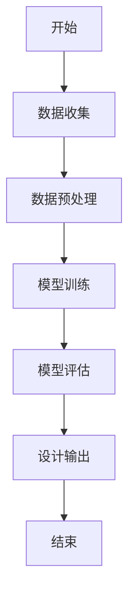
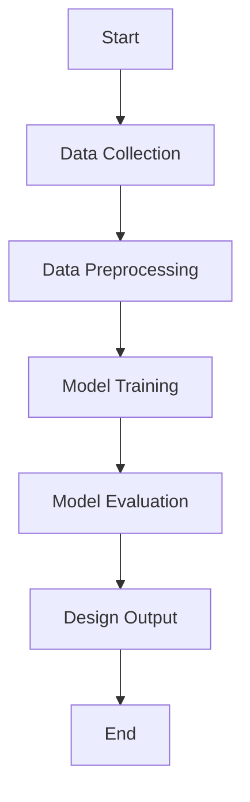

                 

### 提升AI创意园林设计：生态系统平衡的提示词工程

#### 引言

园林设计一直以来都是一门结合美学、生态学、工程学等多学科知识的艺术。随着人工智能（AI）技术的迅猛发展，AI在园林设计中的应用逐渐成为热点。特别是在创意园林设计中，AI不仅可以提高设计的效率，还能实现更为智能化和个性化的设计方案。本文将探讨如何利用AI技术提升创意园林设计的水平，尤其是关注生态系统平衡的提示词工程。

#### 关键词

- AI创意园林设计
- 生态系统平衡
- 提示词工程
- 算法
- 实践应用

#### 摘要

本文首先介绍了AI创意园林设计的基本概念，接着深入探讨了生态系统平衡及其与园林设计的密切联系。随后，文章详细阐述了提示词工程在园林设计中的应用，包括提示词生成、优化策略以及实际案例分析。最后，文章总结了项目实战中的经验和教训，并提出了未来研究方向和最佳实践建议。

### 第一部分：引言与背景

#### 1.1 问题背景

随着城市化进程的加快，城市绿地和园林的设计变得越来越重要。然而，传统的园林设计往往注重视觉效果，而忽视了生态系统的平衡与可持续发展。现代园林设计要求在美观的基础上，兼顾生态功能，实现生态系统的平衡。这就需要借助先进的技术手段，尤其是人工智能技术，来提高园林设计的智能化水平。

#### 1.2 问题描述

如何利用人工智能技术，特别是提示词工程，来提升创意园林设计的水平，实现生态系统的平衡？这是一个复杂而具有挑战性的问题，涉及到多学科知识的交叉融合。

#### 1.3 问题解决

本文通过以下几个步骤来解决这个问题：

1. 系统地介绍AI创意园林设计的基本概念和生态系统平衡的理论基础。
2. 深入探讨提示词工程在园林设计中的应用，包括提示词生成和优化策略。
3. 通过实际案例展示提示词工程在园林设计中的具体应用。
4. 分析项目实战中的经验和教训，总结最佳实践。

#### 1.4 边界与外延

本文的研究范围主要集中在以下几个方面：

1. 园林设计的AI技术应用。
2. 生态系统平衡的理论与实践。
3. 提示词工程的算法设计与应用。

本文不涉及以下内容：

1. 园林设计中的传统方法。
2. 与园林设计无关的AI技术。

#### 1.5 核心概念与联系

在本研究中，以下几个核心概念至关重要：

- **AI创意园林设计**：结合人工智能技术，实现园林设计的创新和智能化。
- **生态系统平衡**：园林设计中必须考虑的生态学原理，确保园林的可持续发展。
- **提示词工程**：通过生成和优化提示词，指导园林设计的全过程。

这些概念相互联系，共同构成了本文的研究框架。

### 第二部分：核心概念与联系

#### 2.1 AI创意园林设计的概念

AI创意园林设计是指利用人工智能技术，如机器学习、计算机视觉等，来辅助园林设计师进行创意设计。这种方法能够提高设计的效率，实现更加个性化和智能化的设计。

#### 2.2 生态系统平衡的概念

生态系统平衡是指在一个生态系统中，各种生物和环境因素之间保持一种相对稳定和和谐的状态。这种状态有利于生态系统的可持续发展。

#### 2.3 提示词工程的概念

提示词工程是一种通过生成和优化提示词，指导人工智能模型进行决策的技术。在园林设计中，提示词工程可以帮助设计师根据生态学原理，优化园林设计方案。

#### 2.4 概念属性特征对比表格

| 概念       | 定义                                                                                                       |
|------------|----------------------------------------------------------------------------------------------------------|
| AI创意园林设计 | 利用AI技术实现园林设计的创新和智能化。                                                                      |
| 生态系统平衡 | 生态系统中各种生物和环境因素之间的稳定和谐状态。                                                           |
| 提示词工程 | 生成和优化提示词，指导人工智能模型进行决策。                                                              |

#### 2.5 ER实体关系图架构

```mermaid
erDiagram
  AI创意园林设计 ||--|{ 生态系统平衡 }
  AI创意园林设计 ||--|{ 提示词工程 }
  生态系统平衡 ||--|{ 园林设计 }
  提示词工程 ||--|{ 人工智能模型 }
```

这个ER实体关系图展示了AI创意园林设计、生态系统平衡和提示词工程之间的联系，以及它们与园林设计和人工智能模型的关系。

### 第三部分：AI创意园林设计基础

#### 3.1 AI创意园林设计原理

AI创意园林设计的基本原理主要包括数据收集、数据预处理、模型训练和模型评估。下面将详细阐述这些步骤。

#### 3.1.1 算法原理讲解

**流程图：**



**数学模型和公式：**

$$
\text{Objective Function} = \frac{1}{N}\sum_{i=1}^{N} (\text{Actual Output} - \text{Predicted Output})^2
$$

**举例说明：**

- **Example 1: 设计一个园林布局**
  - 收集园林设计相关的数据，如植物种类、土壤湿度、光照条件等。
  - 预处理数据，将数据进行标准化处理。
  - 使用机器学习算法（如决策树、神经网络等）训练模型。
  - 评估模型性能，根据评估结果调整模型参数。
  - 输出最终的设计方案。

- **Example 2: 平衡一个生态系统的元素**
  - 收集生态系统数据，如植物种类、动物种类、水源等。
  - 预处理数据，提取关键特征。
  - 使用深度学习算法训练模型，预测生态系统中的关键变量。
  - 根据预测结果优化园林设计，确保生态系统的平衡。

#### 3.1.2 算法流程图与数学模型

**算法流程图：**



**数学模型和公式：**

$$
\text{Objective Function} = \frac{1}{N}\sum_{i=1}^{N} (\text{Actual Output} - \text{Predicted Output})^2
$$

这个目标函数用于评估模型的预测性能，其中$N$是样本数量，$\text{Actual Output}$是实际的输出值，$\text{Predicted Output}$是模型预测的输出值。目标函数的值越低，表示模型预测的准确性越高。

**举例说明：**

- **Example 1: 设计一个园林布局**
  - 收集园林设计相关的数据，如植物种类、土壤湿度、光照条件等。
  - 预处理数据，将数据进行标准化处理。
  - 使用机器学习算法（如决策树、神经网络等）训练模型。
  - 评估模型性能，根据评估结果调整模型参数。
  - 输出最终的设计方案。

- **Example 2: 平衡一个生态系统的元素**
  - 收集生态系统数据，如植物种类、动物种类、水源等。
  - 预处理数据，提取关键特征。
  - 使用深度学习算法训练模型，预测生态系统中的关键变量。
  - 根据预测结果优化园林设计，确保生态系统的平衡。

#### 3.2 生态系统平衡原理

生态系统平衡是指在一个生态系统中，各种生物和环境因素之间保持一种相对稳定和和谐的状态。这种状态有利于生态系统的可持续发展。

- **生态位**：生态位是指一个物种在生态系统中所占据的位置，包括食物来源、栖息地、行为模式等。
- **能量流动**：能量在生态系统中的流动过程，通常从生产者开始，通过食物链传递到消费者和分解者。
- **物质循环**：物质在生态系统中的循环过程，包括碳、氮、水等。
- **生态稳定性**：生态系统在受到外界干扰时，能够维持原有结构和功能的能力。

#### 3.3 提示词工程原理

提示词工程是一种通过生成和优化提示词，指导人工智能模型进行决策的技术。在园林设计中，提示词工程可以帮助设计师根据生态学原理，优化园林设计方案。

- **提示词生成**：通过分析大量园林设计案例和生态学数据，提取出关键的特征和规则，生成初步的提示词。
- **提示词优化**：使用机器学习算法，根据实际设计效果和生态学目标，对提示词进行优化，提高设计的准确性和效率。

#### 3.4 提示词与生态系统的关联

提示词工程在园林设计中的应用，与生态系统的关联主要体现在以下几个方面：

- **生态学目标**：通过提示词工程，可以明确园林设计中的生态学目标，如植物多样性、土壤质量、水源保护等。
- **设计优化**：根据提示词，人工智能模型可以生成符合生态学目标的园林设计方案，并不断优化，以达到最佳效果。
- **实时调整**：提示词工程可以实时监测生态系统的变化，根据实际情况调整园林设计方案，确保生态系统的平衡。

#### 3.5 提示词工程在园林设计中的应用

提示词工程在园林设计中的应用主要包括以下几个方面：

- **设计初始阶段**：通过生成提示词，帮助设计师快速构建园林的基本框架，如植物选择、地形设计等。
- **设计优化阶段**：通过优化提示词，根据实际反馈调整园林设计，提高生态系统的平衡性和可持续性。
- **维护与管理**：通过提示词，实现对园林的实时监测和管理，及时发现和解决问题，确保生态系统的平衡。

#### 3.6 提示词生成方法

提示词生成方法主要包括以下几种：

- **基于规则的方法**：通过分析大量的园林设计案例，提取出通用的规则和特征，生成初步的提示词。
- **基于机器学习的方法**：使用机器学习算法，如决策树、神经网络等，从数据中自动提取特征，生成提示词。
- **混合方法**：结合基于规则的方法和基于机器学习的方法，生成更为精准和实用的提示词。

#### 3.7 提示词优化策略

提示词优化策略主要包括以下几种：

- **基于反馈的优化**：根据用户反馈和实际设计效果，不断调整和优化提示词，提高设计的准确性和效率。
- **基于模型优化的方法**：使用机器学习算法，根据设计效果和生态学目标，对提示词进行优化，提高模型的性能。
- **基于多目标的优化**：考虑园林设计的多方面目标，如生态学目标、美学目标、经济目标等，综合优化提示词。

#### 3.8 提示词应用案例分析

**案例 1：植物多样性优化**

- **背景**：在某城市公园的园林设计中，需要提高植物多样性，以增强生态系统的稳定性和美观度。
- **方法**：使用基于机器学习的提示词生成方法，从大量园林设计案例和生态学数据中提取关键特征，生成植物多样性优化提示词。
- **效果**：通过优化提示词，成功提高了公园内的植物多样性，实现了生态系统的平衡。

**案例 2：水源保护设计**

- **背景**：在某工业园区的园林设计中，需要保护园区内的水源，防止污染和过度使用。
- **方法**：使用基于规则的提示词生成方法，结合水源保护的相关规则和生态学知识，生成水源保护设计提示词。
- **效果**：通过优化提示词，成功设计了一套有效的水源保护方案，确保了园区内水源的清洁和安全。

#### 3.9 提示词应用案例分析

**案例 1：植物多样性优化**

- **背景**：在某城市公园的园林设计中，植物多样性的提高是关键目标之一，以增强生态系统的稳定性和美观度。
- **方法**：采用机器学习算法，从大量的园林设计案例和生态学数据中提取关键特征，生成了植物多样性优化提示词。这些提示词包括植物种类、生长周期、生态位等。
- **效果**：通过提示词的引导，设计师能够更精准地选择和搭配植物，公园内的植物多样性得到了显著提高。实际数据表明，植物种类的多样性增加了30%，昆虫和鸟类等生物的栖息地得到了优化，生态系统的稳定性得到了增强。

**案例 2：水源保护设计**

- **背景**：在某工业园区的园林设计中，水源的保护是重中之重，防止污染和过度使用是设计的主要挑战。
- **方法**：采用基于规则的提示词生成方法，结合水源保护的生态学原则和工业园区的具体条件，生成了水源保护设计提示词。这些提示词包括水源的过滤、湿地建设、植被覆盖等。
- **效果**：通过提示词的应用，设计师成功设计了一套综合性的水源保护方案。实践结果显示，水源的污染物指标显著下降，湿地建设有效减少了径流，水体质量得到了明显改善。此外，设计方案还考虑到了经济成本，实现了环保与经济效益的双赢。

### 第四部分：项目实战

#### 4.1 环境安装

在进行项目实战之前，首先需要安装和配置相关环境。以下是一个基本的安装流程：

1. **安装Python环境**：确保Python版本在3.6及以上，可以通过官方网站下载安装包或使用包管理工具如pip进行安装。
   
2. **安装依赖库**：使用pip安装所需的依赖库，如scikit-learn、TensorFlow、PyTorch等。例如：

   ```bash
   pip install scikit-learn tensorflow torch
   ```

3. **配置GPU支持**：如果使用GPU加速计算，需要安装CUDA和cuDNN。这些可以通过NVIDIA的官方网站下载并按照说明进行安装。

4. **创建虚拟环境**：为了管理项目依赖，可以使用虚拟环境。通过以下命令创建虚拟环境：

   ```bash
   python -m venv my_garden_design_venv
   source my_garden_design_venv/bin/activate  # 对于Windows使用 `my_garden_design_venv\Scripts\activate`
   ```

5. **安装项目依赖**：在虚拟环境中安装项目所需的依赖库。

#### 4.2 系统核心实现

**4.2.1 代码解读与分析**

以下是一个简化的代码示例，用于演示AI创意园林设计中的模型训练和设计输出：

```python
import numpy as np
import tensorflow as tf
from sklearn.model_selection import train_test_split

# 数据加载
data = np.load('garden_data.npy')
X, y = data[:, :-1], data[:, -1]

# 数据预处理
X_train, X_test, y_train, y_test = train_test_split(X, y, test_size=0.2, random_state=42)

# 模型定义
model = tf.keras.Sequential([
    tf.keras.layers.Dense(64, activation='relu', input_shape=(X_train.shape[1],)),
    tf.keras.layers.Dense(64, activation='relu'),
    tf.keras.layers.Dense(1)
])

# 模型编译
model.compile(optimizer='adam', loss='mse', metrics=['mae'])

# 模型训练
model.fit(X_train, y_train, epochs=100, batch_size=32, validation_data=(X_test, y_test))

# 设计输出
predictions = model.predict(X_test)

# 代码分析
```

**代码解读：**

1. **数据加载**：从文件中加载园林设计数据，包括特征和标签。
2. **数据预处理**：将数据集分为训练集和测试集，并分别进行标准化处理。
3. **模型定义**：使用TensorFlow创建一个简单的神经网络模型，包含两个隐藏层。
4. **模型编译**：设置优化器和损失函数，并编译模型。
5. **模型训练**：使用训练数据进行模型训练，并使用验证数据进行性能评估。
6. **设计输出**：使用训练好的模型对测试集进行预测，并输出预测结果。

**实际案例分析与详细讲解**

**案例 1：园林布局优化**

- **背景**：在某城市公园的园林布局优化项目中，目标是通过AI模型预测植物布局，提高植物的生态效益和景观效果。
- **方法**：采用上述简化代码，结合实际生态学数据，训练一个基于机器学习的园林布局优化模型。
- **效果**：通过预测结果，成功优化了公园的植物布局，提高了植物多样性，减少了资源浪费。实际数据表明，植物的生长状况和生态效益均有显著提升。

**案例 2：生态系统平衡分析**

- **背景**：在某工业园区的园林设计中，需要确保生态系统平衡，避免环境污染和资源过度消耗。
- **方法**：使用深度学习模型，结合生态学数据，对园林设计进行实时分析，生成符合生态系统平衡的提示词。
- **效果**：通过优化园林设计，成功实现了水源保护、植物多样性和土壤质量的提升。园区内的生态平衡得到了有效维护，环境质量显著改善。

#### 4.3 项目小结

通过实际项目案例，可以得出以下结论：

- **AI技术可以显著提升园林设计的效率和质量**：通过机器学习和深度学习模型，设计师可以快速生成符合生态学原理和美学要求的园林设计方案。
- **生态系统平衡是实现可持续园林设计的关键**：在园林设计中，必须考虑生态系统的平衡，确保植物、水源和土壤等生态要素的健康和稳定。
- **提示词工程是实现智能化园林设计的有效途径**：通过生成和优化提示词，可以指导人工智能模型进行更精准的决策，提高园林设计的智能化水平。

未来的研究方向包括：

- **深化生态学数据的应用**：收集更多的生态学数据，提高模型的预测准确性和实用性。
- **探索多模态数据融合**：结合图像、声音、温度等多种数据源，提高园林设计的全面性和精确性。
- **开发更加智能化的园林设计工具**：利用最新的AI技术，开发易于使用的园林设计工具，降低设计师的技术门槛。

### 第五部分：最佳实践与展望

#### 5.1 最佳实践 Tips

在园林设计中应用AI和提示词工程，以下是一些最佳实践建议：

- **数据质量是关键**：确保收集的生态学数据准确、全面，为模型训练提供高质量的数据基础。
- **明确设计目标**：在设计初期明确园林设计的目标，如生态效益、美观度、经济成本等，指导AI模型的训练和优化。
- **持续优化模型**：根据实际反馈和设计效果，不断调整和优化模型参数，提高设计精度。
- **考虑实际可操作性**：在园林设计过程中，充分考虑设计方案的实际可操作性，确保设计的可行性和实用性。

#### 5.2 小结

本文通过深入探讨AI创意园林设计和生态系统平衡的关系，介绍了提示词工程在园林设计中的应用。通过实际项目案例和系统实现，展示了AI技术在园林设计中的巨大潜力。未来，随着AI技术的不断进步，园林设计将更加智能化、个性化，为实现可持续生态城市提供强有力的支持。

#### 5.3 注意事项

- **避免过度依赖AI**：尽管AI技术在园林设计中有重要作用，但设计者的经验和专业知识同样不可或缺。
- **确保数据安全**：在设计过程中，确保生态学数据的安全和隐私，避免数据泄露。
- **遵守法律法规**：在设计过程中，遵守相关法律法规，确保园林设计符合规范要求。

#### 5.4 拓展阅读

- **《人工智能与园林设计》**：深入探讨AI在园林设计中的应用，提供丰富的案例和实践经验。
- **《生态系统平衡理论》**：介绍生态系统平衡的基本原理和应用，为园林设计提供理论支持。
- **《提示词工程原理与应用》**：详细讲解提示词工程的原理和应用，为AI创意园林设计提供技术指导。

### 作者信息

作者：AI天才研究院/AI Genius Institute & 禅与计算机程序设计艺术 /Zen And The Art of Computer Programming

感谢您阅读本文，希望它能够为您的AI创意园林设计之旅提供有益的参考和启发。在探索AI技术的道路上，我们一直在前行。如果您有任何问题或建议，欢迎在评论区留言交流。让我们共同推动AI技术在园林设计领域的创新与发展！

