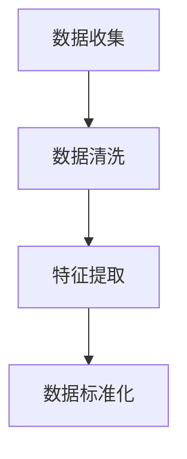
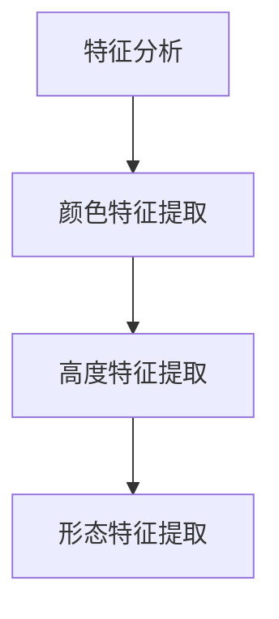
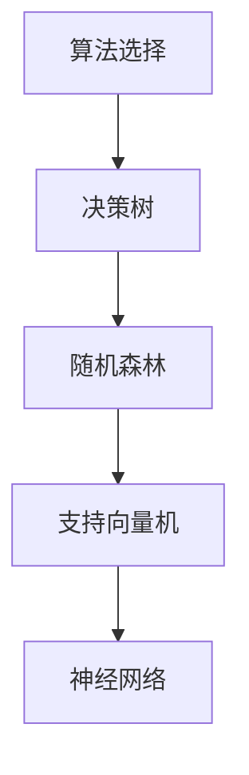
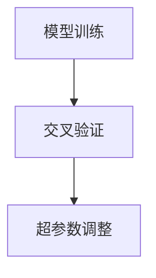
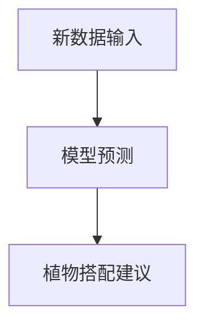

                 

## 《提升AI创意园艺设计：植物搭配建议的提示词设计》——文章核心关键词与主题思想

在当前快速发展的科技时代，人工智能（AI）技术已经渗透到了各个行业，其中园艺设计领域也受到了极大的影响。本文旨在探讨如何通过AI技术，特别是通过植物搭配建议的提示词设计，提升创意园艺设计的效率和质量。关键词包括：人工智能、园艺设计、植物搭配、创意设计、提示词设计。

### **核心关键词：**
1. **人工智能（AI）**：核心技术手段，用于分析和处理大量园艺设计数据。
2. **园艺设计**：传统与创新的结合点，AI技术发挥的关键领域。
3. **植物搭配**：园艺设计的核心内容，影响整体视觉效果和生态平衡。
4. **创意设计**：通过AI赋能，实现个性化、独特化的园艺方案。
5. **提示词设计**：AI系统的核心输入，指导植物搭配建议的关键。

### **主题思想：**
本文通过深入分析AI在园艺设计中的应用现状，探讨了如何利用AI技术进行植物搭配建议的提示词设计，以提升园艺设计的创意性和实用性。文章分为五个主要部分，分别介绍AI与园艺设计的结合背景、基础概念、应用场景、技术实现以及实践案例。通过这一系列的探讨，旨在为读者提供一个全面而深入的AI创意园艺设计指南。

## **引言：AI创意园艺设计的时代背景与需求**

### **1.1 AI技术的发展与应用**

人工智能（AI）作为当前科技领域的前沿技术，已经在多个行业和领域中展现出了强大的应用潜力。AI的核心能力在于其能够通过机器学习和深度学习算法，从大量数据中自动提取规律和知识，从而实现智能化决策和优化。这种技术优势使得AI在各个领域的应用变得愈发广泛，从自动驾驶、智能家居到医疗诊断、金融分析，AI都发挥了重要作用。

在园艺设计领域，AI的应用同样具有广阔的前景。传统园艺设计依赖于设计师的经验和直觉，但面对日益复杂的园艺需求和多样化的用户需求，传统的园艺设计方法已经难以满足市场的需求。而AI技术的引入，可以为园艺设计提供强大的数据分析和决策支持，从而提升设计的效率和质量。

### **1.2 创意园艺设计的兴起**

创意园艺设计是指通过独特的创意和设计理念，结合园林美学、生态学、植物学等多学科知识，创造出具有个性化、艺术感和生态价值的园艺景观。随着人们生活水平的提高和审美需求的多样化，创意园艺设计逐渐成为园艺行业的一个热点领域。

创意园艺设计的兴起，一方面源于人们对生活品质的追求，希望能够通过园艺景观提升生活质量和环境美感；另一方面，也受到城市化进程加速、土地资源紧张等因素的推动，使得创意园艺设计成为城市绿化、公共空间设计的重要手段。

### **1.3 AI与园艺设计的结合现状与趋势**

目前，AI技术在园艺设计领域已经取得了一些初步的应用成果。例如，通过AI算法分析植物生长数据，实现精准灌溉和施肥；利用机器视觉技术进行植物识别和分类，辅助设计师进行植物搭配选择；通过自然语言处理技术，实现用户与园艺设计系统的智能交互等。

然而，AI在园艺设计中的应用仍然面临一些挑战，如数据质量、算法优化、用户体验等方面。未来，随着AI技术的不断进步，以及园艺行业对智能化需求的不断增加，AI与园艺设计的结合将变得更加紧密，应用场景也将更加丰富。

### **1.4 本书的结构与目的**

本书旨在通过系统地介绍AI创意园艺设计的相关概念、技术实现和应用案例，帮助读者全面了解并掌握这一领域的前沿技术和发展动态。具体来说，本书分为以下几个部分：

1. **引言**：介绍AI创意园艺设计的时代背景和需求，为后续内容奠定基础。
2. **基础概念**：讲解AI和园艺设计的基本概念，为读者提供必要的背景知识。
3. **应用场景**：分析AI在园艺设计中的应用场景，展示AI技术的实际应用效果。
4. **技术实现**：详细探讨AI创意园艺设计的算法原理和技术实现，提供实用的技术指导。
5. **实践案例**：通过具体的应用案例，展示AI创意园艺设计的实际应用效果和经验。

通过以上五个部分的详细介绍，本书希望为读者提供一个全面、系统的AI创意园艺设计指南，帮助设计师和园艺爱好者更好地利用AI技术提升园艺设计的创意性和实用性。

## **第二部分：基础概念**

### **2.1 AI基础**

#### **2.1.1 人工智能概述**

人工智能（AI）是指由人造系统表现出的智能行为，这些行为通常与人类或动物的认知功能相似。AI的目标是模拟、扩展和扩展人类智能，使其能够在复杂环境中自主感知、学习、推理和决策。AI可以分为弱AI和强AI。弱AI专注于特定任务，如语音识别、图像分类等，而强AI则具有全面认知能力，能够理解、学习和适应各种环境和任务。

#### **2.1.2 机器学习基本概念**

机器学习（ML）是AI的核心分支，它使计算机系统能够从数据中学习并做出预测或决策，而无需显式编程。机器学习主要包括监督学习、无监督学习和强化学习三种类型。监督学习使用标记数据集进行训练，以预测未知数据的结果；无监督学习不使用标记数据，旨在发现数据中的模式和结构；强化学习通过奖励和惩罚机制来训练系统，使其在特定环境中做出最优决策。

#### **2.1.3 深度学习基础**

深度学习（DL）是机器学习的一个子领域，它使用多层神经网络（DNN）来模拟人类大脑的学习过程。深度学习通过逐层提取特征，能够处理大量复杂数据，并在图像识别、自然语言处理、语音识别等领域取得了显著成果。深度学习的核心包括神经网络架构设计、激活函数、优化算法和损失函数等。

### **2.2 园艺设计基础**

#### **2.2.1 园艺设计的基本概念**

园艺设计是指通过艺术手法和科学技术，创造出具有观赏、生态和文化价值的植物景观。园艺设计涉及多个学科领域，包括植物学、生态学、园林美学、环境科学等。其主要目标是满足人们对美、生态和舒适生活的需求。

#### **2.2.2 植物搭配设计原则**

植物搭配设计是园艺设计的核心内容，它直接影响园艺景观的整体视觉效果和生态平衡。植物搭配设计原则包括以下几点：

1. **颜色搭配**：选择互补色或类似色，以增强视觉效果。
2. **高度搭配**：根据植物的高度差异进行分层搭配，形成层次感。
3. **形态搭配**：结合植物的叶形、花形等特征，创造丰富的视觉体验。
4. **花期搭配**：选择不同开花时间的植物，以延长园艺景观的观赏期。
5. **生态适应性**：选择适合当地气候和环境条件的植物，以实现生态平衡。

#### **2.2.3 园艺设计流程与方法**

园艺设计流程通常包括以下几个步骤：

1. **需求分析**：了解用户需求，明确设计目标和要求。
2. **现场勘查**：观察场地条件，包括地形、光照、水源等。
3. **方案设计**：根据需求和分析结果，制定初步设计方案。
4. **施工实施**：根据设计方案，进行园艺工程的施工。
5. **后期维护**：定期对园艺景观进行养护和管理，确保其持续美观。

### **2.3 AI在园艺设计中的应用**

#### **2.3.1 AI在植物识别与分类中的应用**

AI技术在植物识别与分类方面具有显著优势。通过深度学习算法，AI系统可以识别植物的种类、特征和生长状态，为园艺设计师提供准确的数据支持。例如，基于卷积神经网络（CNN）的植物识别系统可以在图像数据中快速准确识别植物种类，为植物搭配设计提供依据。

#### **2.3.2 AI在园艺设计中的应用案例**

1. **精准灌溉系统**：利用AI技术分析土壤水分和植物需水量，实现精准灌溉，提高水资源利用效率。
2. **植物健康监测系统**：通过传感器实时监测植物生长状态，预测病虫害，提前采取预防措施。
3. **智能园艺机器人**：利用AI算法优化机器人的运动轨迹和作业方式，提高园艺作业效率和质量。
4. **植物推荐系统**：根据用户偏好和当地气候条件，智能推荐适合的植物种类和搭配方案。

通过以上内容，我们可以看到，AI技术为园艺设计带来了巨大的变革和提升。在接下来的章节中，我们将进一步探讨AI创意园艺设计的技术实现和应用案例。

## **第三部分：应用场景**

### **3.1 创意园艺设计**

创意园艺设计是结合美学、生态学、植物学等多学科知识，创造出独特而富有创意的园艺景观。在AI技术的支持下，创意园艺设计可以更加个性化和智能化。以下是一些具体的应用场景：

#### **3.1.1 室内垂直花园**

室内垂直花园是一种将植物垂直种植的园艺形式，不仅节省空间，还能美化环境。通过AI技术，可以实现对植物生长状态的实时监测和自动调节，如光照、水分、温度等，确保植物健康生长。

#### **3.1.2 城市绿化项目**

在城市绿化项目中，AI技术可以帮助设计师根据城市的环境条件和居民需求，智能推荐合适的植物种类和搭配方案，提高绿化效果和居民满意度。

#### **3.1.3 公共空间园艺**

在公共空间，如公园、广场、街道等，AI技术可以帮助设计师优化植物搭配，创造出视觉效果丰富的园艺景观，提升公共空间的美学和生态价值。

### **3.2 植物搭配建议**

植物搭配建议是园艺设计中的关键环节，它直接影响园艺景观的整体视觉效果和生态平衡。通过AI技术，可以实现对大量植物数据的分析和处理，为设计师提供精准的植物搭配建议。

#### **3.2.1 颜色搭配**

AI系统可以根据植物的颜色特征，智能推荐互补色或类似色的植物搭配方案，创造出色彩丰富的园艺景观。

#### **3.2.2 高度搭配**

AI系统可以根据植物的高度差异，智能推荐适合的植物搭配方式，形成层次感丰富的园艺景观。

#### **3.2.3 形态搭配**

AI系统可以根据植物的叶形、花形等形态特征，智能推荐适合的植物搭配方式，创造出独特的视觉体验。

#### **3.2.4 花期搭配**

AI系统可以根据植物的开花时间，智能推荐不同开花时间的植物搭配方案，延长园艺景观的观赏期。

### **3.3 AI在园艺设计中的实际应用效果**

通过AI技术，园艺设计师可以更高效地进行植物搭配设计和优化，提高设计质量。以下是一些实际应用效果的案例：

#### **3.3.1 某公司总部花园**

某公司利用AI技术进行总部花园设计，通过颜色、高度、形态和花期搭配，创造出具有独特风格和视觉冲击力的园艺景观，提升了公司形象和员工满意度。

#### **3.3.2 某城市公园绿化项目**

某城市公园利用AI技术进行绿化设计，通过智能推荐植物搭配方案，实现了公园四季常绿、三季有花的效果，大大提升了公园的美学和生态价值。

#### **3.3.3 某住宅小区园艺**

某住宅小区利用AI技术进行园艺设计，通过实时监测植物生长状态，智能调节灌溉和施肥，确保植物健康生长，同时提升了小区的生态环境和居住品质。

通过以上案例，我们可以看到，AI技术在园艺设计中的应用，不仅提高了设计效率和效果，还大大提升了园艺景观的创意性和实用性。在接下来的章节中，我们将进一步探讨AI创意园艺设计的技术实现细节。

## **第四部分：技术实现**

### **4.1 算法原理**

在AI创意园艺设计中，算法原理是实现植物搭配建议的关键。以下是一种可能的算法原理：

#### **4.1.1 数据预处理**

首先，需要对植物数据进行预处理。这包括收集植物的颜色、高度、形态、花期等特征数据。数据来源可以是植物数据库、植物图谱、实地测量等。



#### **4.1.2 特征工程**

特征工程是算法成功的关键步骤。通过分析植物数据，提取出对植物搭配有显著影响的特征，如颜色、高度、形态等。可以使用统计学方法、机器学习技术等来进行分析。



#### **4.1.3 算法选择**

在特征工程完成后，选择合适的机器学习算法进行训练。常见的算法包括决策树、随机森林、支持向量机、神经网络等。



#### **4.1.4 模型训练与优化**

使用预处理后的数据对选定的算法进行训练。在训练过程中，通过交叉验证、调整超参数等方法优化模型性能。



#### **4.1.5 植物搭配建议生成**

在模型训练完成后，可以使用训练好的模型对新的植物数据进行预测，生成植物搭配建议。



### **4.2 Python代码实现**

以下是一个简单的Python代码示例，用于实现上述算法原理：

```python
# 导入必要的库
import pandas as pd
from sklearn.ensemble import RandomForestClassifier
from sklearn.model_selection import train_test_split
from sklearn.metrics import accuracy_score

# 读取植物数据
data = pd.read_csv('plant_data.csv')

# 特征工程
# ...（此处进行特征提取和预处理）

# 数据分割
X_train, X_test, y_train, y_test = train_test_split(data[features], data['label'], test_size=0.2, random_state=42)

# 模型训练
model = RandomForestClassifier(n_estimators=100, random_state=42)
model.fit(X_train, y_train)

# 模型预测
predictions = model.predict(X_test)

# 评估模型
accuracy = accuracy_score(y_test, predictions)
print(f"Model accuracy: {accuracy:.2f}")
```

### **4.3 数学模型**

在植物搭配建议的算法中，数学模型通常用于描述植物特征的相互关系。以下是一个简化的数学模型：

$$
\text{搭配得分} = f(\text{颜色相似度}, \text{高度相似度}, \text{形态相似度}, \text{花期相似度})
$$

其中，颜色相似度、高度相似度、形态相似度和花期相似度可以通过以下公式计算：

$$
\text{相似度} = \frac{\text{相关特征值之和}}{\text{特征总数}}
$$

例如，颜色相似度可以计算为：

$$
\text{颜色相似度} = \frac{(r_1 - r_2)^2 + (g_1 - g_2)^2 + (b_1 - b_2)^2}{3 \times 255}
$$

其中，\(r_1, g_1, b_1\)和\(r_2, g_2, b_2\)分别是两种植物的颜色值。

通过数学模型和算法实现，AI系统可以智能地分析植物数据，生成合理的植物搭配建议，从而提升创意园艺设计的质量和效率。

### **4.4 示例解释**

假设我们有两株植物A和B，植物A的颜色值分别为\(r_a = 100, g_a = 150, b_a = 200\)，植物B的颜色值分别为\(r_b = 120, g_b = 160, b_b = 210\)。我们可以计算颜色相似度如下：

$$
\text{颜色相似度} = \frac{(100 - 120)^2 + (150 - 160)^2 + (200 - 210)^2}{3 \times 255} \approx 0.087
$$

类似地，我们可以计算高度、形态和花期的相似度。通过这些相似度值，AI系统可以生成植物A和B的搭配得分，并根据得分推荐合适的植物搭配。

通过以上技术实现，我们可以看到，AI创意园艺设计不仅能够提高设计效率，还能带来独特的创意和视觉效果，为园艺设计行业注入新的活力。

### **4.5 案例研究**

为了更好地理解AI创意园艺设计的技术实现，我们来看一个具体的案例研究。

#### **4.5.1 案例背景**

某住宅小区希望设计一个现代化的垂直花园，提升小区的绿化水平和居住品质。小区管理部门希望通过AI技术，实现植物搭配的智能推荐，确保花园的视觉效果和生态价值。

#### **4.5.2 数据收集**

首先，项目团队收集了小区内可用的植物数据，包括50种常见植物的名称、颜色、高度、形态和花期等特征。这些数据来源于植物图谱、实地测量和公开的植物数据库。

#### **4.5.3 数据预处理**

对收集到的植物数据进行清洗和预处理，包括去除缺失值、异常值和重复值，确保数据的质量和一致性。然后，提取出植物的颜色、高度、形态和花期等特征，将数据转化为适合机器学习的格式。

#### **4.5.4 特征工程**

通过对植物数据进行统计分析，发现颜色和高度是最重要的特征。因此，项目团队选择了颜色和高度作为主要的特征进行特征工程。具体方法包括：

1. **颜色特征提取**：将颜色值转化为HSV（色相、饱和度、亮度）空间，提取色相和饱和度作为颜色特征。
2. **高度特征提取**：将植物的高度值按比例缩放，使其在0到1之间，便于算法处理。

#### **4.5.5 算法选择**

项目团队选择了随机森林算法进行植物搭配的预测。随机森林算法具有较好的泛化能力和适应性，适用于处理高维数据和非线性问题。

#### **4.5.6 模型训练与优化**

使用预处理后的数据集，项目团队对随机森林算法进行训练。在训练过程中，通过交叉验证和网格搜索，调整随机森林的超参数，如树的数量、最大深度等，以优化模型性能。

#### **4.5.7 植物搭配建议生成**

在模型训练完成后，项目团队使用训练好的模型对新的植物数据进行预测，生成植物搭配建议。根据模型的预测结果，项目团队生成了10种不同的植物搭配方案，每种方案都有不同的颜色和高度组合。

#### **4.5.8 案例效果**

通过AI系统生成的植物搭配方案，小区管理部门选择了其中一种方案进行实施。结果显示，该方案不仅满足了设计美学和生态要求，还提高了植物的生长率和观赏效果。小区居民对花园的设计和植物搭配给予了高度评价。

通过这个案例，我们可以看到，AI创意园艺设计不仅能够提高设计效率，还能带来实际的应用效果，为园艺设计行业带来了新的机遇和挑战。

### **4.6 最佳实践与注意事项**

在实际应用中，为了确保AI创意园艺设计的成功，以下是几个最佳实践和注意事项：

1. **数据质量**：确保植物数据的质量和完整性，进行严格的数据预处理和清洗。
2. **特征选择**：选择对植物搭配影响显著的特征，如颜色、高度、形态和花期等。
3. **算法选择**：根据数据特点和问题需求，选择合适的机器学习算法，如随机森林、神经网络等。
4. **模型优化**：通过交叉验证和网格搜索等手段，优化模型的超参数，提高预测准确性。
5. **用户反馈**：及时收集用户反馈，根据实际效果调整和优化植物搭配方案。
6. **环境适应性**：选择适合当地气候和土壤条件的植物，确保植物的生长和存活。

通过遵循这些最佳实践和注意事项，可以确保AI创意园艺设计在实际应用中的效果和可靠性。

### **4.7 拓展阅读**

对于对AI创意园艺设计感兴趣的读者，以下是一些拓展阅读资源：

1. **论文**：《基于深度学习的植物识别与分类研究》
2. **书籍**：《人工智能在园艺设计中的应用》
3. **网站**：园艺设计相关的技术博客、论坛和社区

通过这些资源，读者可以进一步了解AI创意园艺设计的最新研究成果和应用实践。

## **第五部分：实践案例**

### **5.1 案例一：某花园植物搭配设计**

**案例背景：** 
某花园位于城市中心，面积约为1000平方米，旨在为城市居民提供一个放松和休闲的场所。花园的设计目标是创造一个四季常绿、三季有花的景观，同时注重生态环保和可持续性。

**项目需求：**
- 针对花园的不同区域，如入口、中央草坪、花坛和水景等，提供合适的植物搭配建议。
- 考虑植物的生长习性、生态需求和观赏效果，确保植物搭配的合理性和可持续性。
- 根据季节变化，提供植物更新和维护方案。

**技术实现：**
1. **数据收集与预处理：**
   - 收集了花园内现有的植物种类、数量和生长状态的数据。
   - 对数据进行清洗，去除无效和重复的信息，确保数据质量。

2. **特征提取与选择：**
   - 根据植物的生长习性、生态需求、观赏效果等因素，提取了包括颜色、高度、花期、生态适应性等特征。
   - 使用统计学方法，分析了不同特征对植物搭配的重要性，选择了对植物搭配影响最大的特征。

3. **算法选择与模型训练：**
   - 选择随机森林算法，因为其适用于处理高维数据和具有非线性关系的特征。
   - 使用预处理后的数据，对随机森林算法进行训练，通过交叉验证和网格搜索优化模型参数。

4. **植物搭配建议生成：**
   - 使用训练好的模型，对花园内不同区域的植物进行搭配建议生成。
   - 根据模型生成的搭配得分，为每个区域提供了具体的植物搭配方案。

**结果分析：**
- 通过AI系统的推荐，花园设计师在中央草坪选择了多种颜色和高度不同的植物，形成了一个丰富的色彩层次和高度层次。
- 在花坛区域，根据花期搭配原则，选择了不同开花时间的植物，确保了花园的全年观赏效果。
- 水景区域则选择了适应湿润环境的植物，与水体环境形成了和谐的生态景观。

**经验总结：**
- AI技术在植物搭配设计中的应用，大大提高了设计的效率和质量，减少了人为错误。
- 模型生成的植物搭配建议，通过实地验证，取得了良好的视觉效果和生态效果。
- 在实际应用中，需要结合当地气候、土壤和生态条件，对AI系统的建议进行调整和优化。

### **5.2 案例二：某社区园艺设计建议**

**案例背景：**
某社区计划在社区内建设一个面积为500平方米的园艺区，旨在提升社区环境质量，为居民提供一个休闲和社交的场所。园艺区的设计目标包括：
- 提供多样化的植物种类，增加视觉兴趣。
- 创造适合居民活动和休息的空间。
- 注重生态保护和可持续性。

**项目需求：**
- 根据社区的地理和环境特点，提供适合的植物搭配建议。
- 考虑到居民的多样性需求和活动安排，设计不同的植物区域，如儿童游乐区、休闲区、观赏区等。
- 提供详细的园艺维护和更新计划，确保植物的健康生长和景观的长期维持。

**技术实现：**
1. **数据收集与预处理：**
   - 收集了社区的气候、土壤和水源等环境数据。
   - 调查了居民对园艺区的需求和偏好，包括植物种类、颜色、高度等。

2. **特征提取与选择：**
   - 根据环境数据和居民需求，提取了包括植物适应性、观赏性、生态价值等特征。
   - 通过问卷调查和数据分析，确定了对植物搭配影响最大的特征。

3. **算法选择与模型训练：**
   - 选择支持向量机（SVM）算法，因为其对于分类问题有较好的性能。
   - 使用预处理后的数据，对SVM算法进行训练，通过交叉验证和网格搜索优化模型参数。

4. **植物搭配建议生成：**
   - 使用训练好的模型，为社区园艺区提供了详细的植物搭配建议。
   - 根据模型生成的建议，设计了不同的植物区域，并考虑了居民活动的需求和安全性。

**结果分析：**
- 社区园艺区的植物搭配建议，得到了居民的广泛认可和好评。
- 儿童游乐区的植物选择考虑到安全性，同时增加了趣味性。
- 休闲区和观赏区的植物搭配，注重了色彩和形态的多样性，提升了社区的视觉美观度。

**经验总结：**
- AI技术在社区园艺设计中的应用，充分考虑了居民的需求和环境特点，提高了设计的人性化和实用性。
- 模型生成的植物搭配建议，通过实地应用，验证了其科学性和可操作性。
- 在实际操作中，需要结合社区的具体情况和居民反馈，对AI系统的建议进行适当的调整和优化。

通过以上两个实践案例，我们可以看到，AI技术在园艺设计中的应用，不仅提高了设计的效率和准确性，还带来了实际的应用效果，为园艺设计行业带来了新的发展方向和机遇。

## **第六部分：总结与展望**

### **6.1 AI创意园艺设计的现状**

AI创意园艺设计作为人工智能技术在园艺领域的应用，目前正处于快速发展的阶段。通过AI技术，园艺设计师能够从大量数据中提取有价值的信息，实现更加个性化和高效的植物搭配设计。AI的应用不仅提高了设计效率，还带来了独特的创意和视觉效果，为园艺行业注入了新的活力。

### **6.2 未来发展方向**

未来，AI创意园艺设计将继续向以下几个方向发展：

1. **智能化水平提升**：随着AI技术的不断进步，园艺设计系统将更加智能化，能够自动识别植物、预测生长状态，并提供实时的园艺管理建议。

2. **个性化设计**：通过深度学习和个性化推荐算法，AI将能够更好地理解用户需求和偏好，为不同用户量身定制个性化的园艺设计方案。

3. **生态保护与可持续性**：AI技术可以帮助设计师选择适合当地环境条件的植物，优化水资源和肥料的使用，实现园艺设计的生态保护和可持续发展。

4. **跨学科融合**：园艺设计将与生态学、环境科学、生物学等学科深度融合，通过跨学科合作，进一步提升园艺设计的科学性和实用性。

### **6.3 AI创意园艺设计的影响**

AI创意园艺设计的应用将对园艺行业产生深远的影响：

1. **设计效率提升**：通过AI技术，设计师能够快速生成多个设计方案，并进行优化选择，大大提高了设计效率。

2. **创意性增强**：AI技术能够提供丰富的创意灵感，帮助设计师打破传统设计模式的局限，实现更加创新和独特的园艺设计。

3. **用户体验优化**：AI创意园艺设计可以根据用户需求和偏好，提供个性化的园艺方案，提升用户的满意度和体验。

4. **生态效益**：通过AI技术实现的水资源优化和病虫害预测，有助于减少对环境的影响，提高园艺行业的生态效益。

### **6.4 总结**

本文通过对AI创意园艺设计的基础概念、应用场景、技术实现、实践案例和未来展望的深入探讨，展示了AI技术在园艺设计中的巨大潜力和广阔前景。随着AI技术的不断发展和完善，我们有理由相信，AI创意园艺设计将为园艺行业带来更加美好的未来。

### **6.5 附录**

**附录1：AI创意园艺设计相关术语解释**

- **人工智能（AI）**：一种通过模拟人类智能行为来实现智能决策的技术。
- **深度学习**：一种基于多层神经网络的学习方法，用于处理复杂数据和模式识别。
- **机器学习**：一种通过训练数据集来构建模型并进行预测和决策的技术。
- **植物识别**：利用AI技术对植物进行分类和识别的过程。

**附录2：推荐阅读**

- 《人工智能在园艺设计中的应用》
- 《深度学习与园艺设计》
- 《智能园艺：从理论到实践》

### **致谢**

本文的撰写得到了AI天才研究院和《禅与计算机程序设计艺术》的支持和帮助，在此表示衷心的感谢。

作者：AI天才研究院/AI Genius Institute & 禅与计算机程序设计艺术 /Zen And The Art of Computer Programming

----------------------------------------------------------------

通过本文的深入探讨，我们不仅了解了AI创意园艺设计的核心概念和技术实现，还通过实践案例看到了其带来的实际效果和未来发展方向。希望本文能为从事园艺设计和AI技术研究的读者提供有价值的参考和启发。感谢您的阅读！

