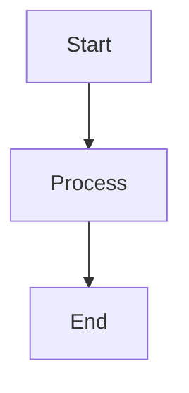
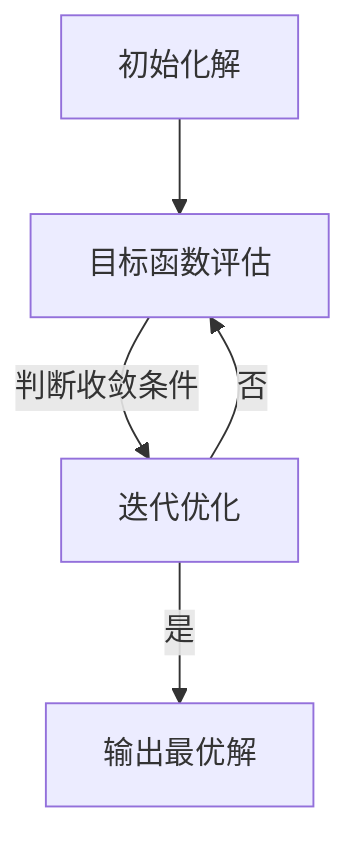
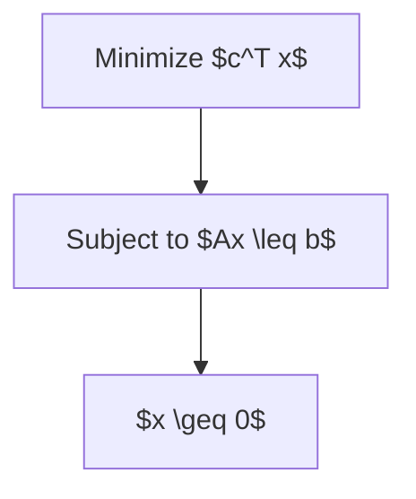

                 

### 第1章：AI与创意家居设计概述

#### 1.1 AI技术的概述与发展

**AI技术的起源**  
人工智能（Artificial Intelligence，简称AI）起源于20世纪50年代。当时，计算机科学领域的先驱们开始探讨是否可以创造出一台机器，使其具有人类的智能行为和思维过程。这一愿景催生了人工智能这一学科的诞生。

**AI技术的发展历程**  
- **早期探索（1950-1969）**：在这个阶段，人工智能的研究主要集中在规则推理和符号逻辑上。代表性的工作包括逻辑推理系统、专家系统等。
- **黄金时期（1970-1989）**：随着计算机性能的提升和算法的发展，人工智能迎来了一个黄金时期。此时，人工智能的应用范围得到了极大的扩展，如自动程序设计、机器翻译等。
- **衰退期（1990-2000）**：由于实际应用中遇到的技术难题和资金短缺，人工智能的研究进入了一个相对低谷的时期。
- **复兴期（2000-至今）**：随着深度学习、神经网络等技术的突破，人工智能再次迎来了爆发式的发展。特别是近年来，随着大数据、云计算等技术的普及，人工智能的应用领域不断拓展，如自动驾驶、智能家居、医疗诊断等。

**AI技术的分类**  
- **基于规则的系统**：这类系统通过编写规则来模拟人类的决策过程。
- **基于学习的系统**：这类系统通过学习大量数据来获取知识和技能，如监督学习、无监督学习、强化学习等。
- **混合系统**：这类系统结合了基于规则和基于学习的优势，以应对复杂的问题。

#### 1.2 创意家居设计的现状与趋势

**创意家居设计的现状**  
- **个性化需求增加**：随着消费者生活水平的提高，对家居设计的要求不再仅仅满足于实用功能，更追求个性化、创意和审美价值。
- **智能家居普及**：智能家居技术的不断发展，使得家居设计更加智能化、便捷化，如智能灯光、智能音响、智能门锁等。
- **环保意识提升**：环保成为现代社会的重要主题，创意家居设计也越来越注重环保材料的使用和能源效率的提升。

**创意家居设计的趋势**  
- **可持续性设计**：随着全球环保意识的增强，可持续性设计将成为创意家居设计的重要趋势。设计师将更多地关注如何通过设计来减少资源的消耗和环境污染。
- **智能家居集成**：智能家居技术的不断进步，将使家居设计更加智能化、个性化。设计师需要具备智能家居的设计和整合能力。
- **数字化设计工具**：随着数字化设计工具的普及，创意家居设计将更加高效、精准。设计师可以通过数字化工具来实现复杂的家居设计方案，并快速进行修改和优化。

#### 1.3 AI在创意家居设计中的应用价值

**提升设计效率**  
- AI技术可以自动化处理大量重复性工作，如数据清洗、模型训练等，从而提高设计师的工作效率。
- AI驱动的工具和平台可以为设计师提供智能化的设计建议，如色彩搭配、空间布局等，帮助设计师快速生成创意方案。

**个性化定制服务**  
- 通过AI技术，家居设计可以根据用户的个性化需求进行定制。例如，基于用户的历史数据和偏好，AI可以推荐最适合用户的家居设计方案。
- AI还可以通过用户行为分析，预测用户的需求和偏好，从而提供更加精准的个性化服务。

**智能家居交互体验**  
- AI技术可以提升智能家居的交互体验，如语音识别、自然语言处理等，使用户可以更加自然地与家居设备进行交互。
- AI还可以通过数据分析，为用户提供个性化的家居解决方案，如智能照明、智能空调等。

通过上述分析，我们可以看到，AI在创意家居设计中的应用具有巨大的潜力。它不仅可以提升设计效率，实现个性化定制服务，还可以改善智能家居的交互体验，为消费者带来更加智能化、便捷化的家居生活。在下一章中，我们将进一步探讨AI创意家居设计的核心概念及其与空间优化的结合。

---

### 第2章：AI创意家居设计的核心概念

#### 2.1 AI核心概念

**机器学习基础**

机器学习是AI的核心技术之一，它使计算机能够从数据中学习和预测。机器学习的基本过程包括数据收集、数据预处理、模型训练、模型评估和模型部署。

- **数据收集**：从各种来源收集数据，如数据库、传感器、网络等。
- **数据预处理**：清洗和整理数据，使其适合用于模型训练。
- **模型训练**：使用训练数据来训练模型，模型可以是一个神经网络、决策树或其他机器学习算法。
- **模型评估**：评估模型在测试数据集上的性能，确保模型具有良好的泛化能力。
- **模型部署**：将训练好的模型部署到生产环境中，用于预测和决策。

**深度学习原理**

深度学习是机器学习的一个重要分支，它通过多层神经网络来模拟人脑的决策过程。深度学习的主要特点包括：

- **多层神经网络**：深度学习模型包含多个隐含层，能够提取更复杂的数据特征。
- **反向传播算法**：通过反向传播算法来调整网络权重，使模型能够不断优化。
- **自动特征提取**：深度学习模型可以自动从数据中提取特征，减轻了人工特征工程的工作量。

#### 2.2 创意家居设计的核心要素

**家居空间规划**

家居空间规划是家居设计的基础，它涉及到空间的布局、功能的划分以及流线的组织。

- **空间布局**：根据家庭结构和生活方式，合理划分各个功能区域，如客厅、卧室、厨房等。
- **功能划分**：明确各个功能区域的用途，确保空间的最大利用效率。
- **流线组织**：合理组织空间流线，使人们在使用空间时能够顺畅、自然地移动。

**色彩搭配与风格设计**

色彩搭配和风格设计是家居设计的重要环节，它直接影响空间的视觉效果和氛围。

- **色彩搭配**：通过合理的色彩搭配，可以增强空间的层次感和视觉感受。常见的色彩搭配原则包括对比、渐变、互补等。
- **风格设计**：根据个人喜好和装修风格，选择合适的家具、装饰品和材质，营造独特的家居氛围。

**材料选择与应用**

材料选择是家居设计的关键，它直接影响空间的质感、环保性和耐用性。

- **质感**：通过不同的材料质感，可以增强空间的层次感和立体感。
- **环保性**：选择环保材料，可以减少装修对环境的影响，保障居住者的健康。
- **耐用性**：选择耐用材料，可以延长家居的使用寿命，降低维护成本。

#### 2.3 AI与创意家居设计的结合

**AI技术在设计流程中的应用**

AI技术可以应用于家居设计的各个环节，从初步设计到最终落地，提升设计的效率和质量。

- **空间规划**：通过AI算法，可以快速生成多个设计方案，设计师可以根据实际需求进行选择和优化。
- **色彩搭配**：AI可以根据用户偏好和空间特征，自动推荐最佳的色彩搭配方案。
- **风格设计**：AI可以通过分析用户的历史数据和喜好，推荐符合用户风格的家居设计方案。
- **材料选择**：AI可以根据材料的性能和价格，推荐最适合用户需求和预算的材料。

**AI驱动的设计工具**

AI驱动的设计工具可以大大提升设计师的工作效率，帮助设计师快速生成创意方案。

- **自动化设计工具**：AI自动化设计工具可以帮助设计师快速生成空间布局、色彩搭配和风格设计等方案。
- **智能推荐系统**：AI智能推荐系统可以根据用户的需求和喜好，推荐合适的家居设计方案和材料。
- **协同设计平台**：AI协同设计平台可以实现设计师之间的实时协作，提高设计效率和沟通效果。

通过上述分析，我们可以看到，AI在创意家居设计中具有广泛的应用前景。它不仅可以提升设计效率，实现个性化定制，还可以改善用户体验，提升家居设计的质量。在下一章中，我们将深入探讨空间优化建议的算法原理，进一步理解AI如何优化家居空间设计。

---

### 第3章：空间优化建议的算法原理

#### 3.1 空间优化算法概述

**空间优化算法的定义**

空间优化算法是一类用于解决空间布局问题的算法。其主要目标是在给定的约束条件下，寻找一个或多个使目标函数达到最优的解。空间优化算法在工业设计、建筑设计、城市规划等领域具有广泛应用。

**空间优化算法的分类**

根据算法的优化目标和方法，空间优化算法可以分为以下几类：

- **基于几何的方法**：这类方法主要利用几何图形的性质进行优化，如最小覆盖矩形、最小覆盖圆等。
- **基于物理的方法**：这类方法通过模拟物理现象，如引力、斥力等，进行空间优化。
- **基于进化的方法**：这类方法通过模拟生物进化的过程，如遗传算法、粒子群优化等，进行空间优化。
- **基于智能的方法**：这类方法通过模拟人类的智能行为，如人工神经网络、深度学习等，进行空间优化。

**空间优化算法的应用场景**

空间优化算法可以应用于各种空间布局问题，如：

- **工业布局**：优化工厂的生产线和设备布局，提高生产效率和产品质量。
- **建筑设计**：优化建筑内部空间布局，提高空间利用率和居住舒适度。
- **城市规划**：优化城市道路、绿地、建筑等布局，提高城市功能和居民生活质量。

#### 3.2 算法原理讲解

**算法基本概念**

空间优化算法通常涉及以下基本概念：

- **目标函数**：目标函数是用来衡量优化问题解的质量的函数。在空间优化中，目标函数可以表示为空间利用效率、舒适度、美观度等指标。
- **约束条件**：约束条件是用来限制优化问题解的范围的条件。在空间优化中，约束条件可以包括空间限制、功能需求、安全要求等。
- **解空间**：解空间是所有可能解的集合。在空间优化中，解空间通常是一个高维空间，包含所有可能的空间布局方案。

**算法工作流程**

空间优化算法的一般工作流程包括以下步骤：

1. **初始化解**：根据问题的初始条件，生成一个初始解。
2. **目标函数评估**：计算初始解的目标函数值，评估解的质量。
3. **迭代优化**：通过迭代过程，不断调整解的空间位置，寻找更好的解。
4. **收敛判断**：根据一定的收敛条件，判断优化过程是否结束。
5. **输出最优解**：输出优化结果，即最优的空间布局方案。

**常用空间优化算法介绍**

以下是几种常用的空间优化算法：

- **遗传算法**：遗传算法是一种模拟生物进化的优化算法。它通过模拟自然选择和遗传机制，不断优化解的种群，直到找到最优解。
- **粒子群优化**：粒子群优化是一种基于群体智能的优化算法。它通过模拟鸟群觅食行为，调整个体的位置和速度，寻找最优解。
- **模拟退火算法**：模拟退火算法是一种基于物理退火过程的优化算法。它通过模拟温度的逐渐降低，使系统从初始状态逐渐收敛到最优状态。
- **蚁群算法**：蚁群算法是一种基于蚁群觅食行为的优化算法。它通过模拟蚁群寻找食物的过程，不断调整路径和速度，找到最优解。

#### 3.3 Mermaid算法流程图

**Mermaid概述**

Mermaid是一种基于Markdown的图形绘制工具，可以方便地绘制各种图表，如流程图、时序图、Gantt图等。在空间优化算法的讲解中，我们可以使用Mermaid来绘制算法流程图，使内容更加直观易懂。

**Mermaid基本语法**

Mermaid的基本语法包括节点（Node）、边（Edge）和属性（Attribute）的定义。以下是一个简单的Mermaid流程图示例：



**算法流程图示例**

以下是空间优化算法的一个简单Mermaid流程图示例：



通过这个示例，我们可以清晰地看到空间优化算法的基本流程和迭代过程。

综上所述，空间优化算法是AI创意家居设计中的重要工具。通过理解算法的基本概念和原理，我们可以更好地应用这些算法来优化家居空间设计，提升设计质量和用户体验。在下一章中，我们将进一步探讨空间优化建议的数学模型与公式，深入解析空间优化算法的数学基础。

---

### 第4章：空间优化建议的数学模型与公式

#### 4.1 数学模型介绍

**空间优化问题的数学描述**

空间优化问题通常可以表示为一个数学模型，包括目标函数和约束条件。数学模型的基本形式如下：

- **目标函数**：目标函数用来衡量优化问题的解的质量。在空间优化中，目标函数可以表示为空间利用率、居住舒适度、美观度等指标。
- **约束条件**：约束条件用来限制解的范围。在空间优化中，约束条件可以包括空间大小限制、功能需求限制、安全要求限制等。

**常用数学模型类型**

在空间优化中，常用的数学模型类型包括线性规划、整数规划、非线性规划等。

- **线性规划**：线性规划是一种求解线性目标函数在线性约束条件下的最优解的方法。它的目标函数和约束条件都是线性的。
- **整数规划**：整数规划是一种求解整数目标函数在整数约束条件下的最优解的方法。它适用于需要整数解的问题，如资源分配问题。
- **非线性规划**：非线性规划是一种求解非线性目标函数在非线性约束条件下的最优解的方法。它适用于目标函数或约束条件非线性的问题。

#### 4.2 公式讲解

**线性规划公式**

线性规划的基本公式如下：

\[ \text{Minimize} \, c^T x \]
\[ \text{Subject to} \, Ax \leq b \]
\[ x \geq 0 \]

其中，\( c \) 是系数向量，\( x \) 是变量向量，\( A \) 是约束矩阵，\( b \) 是约束向量。

- \( c^T x \) 是目标函数，表示需要最小化的目标值。
- \( Ax \leq b \) 是约束条件，表示变量 \( x \) 需要满足的线性不等式。
- \( x \geq 0 \) 是非负约束条件，表示变量 \( x \) 需要为非负数。

**整数规划公式**

整数规划的基本公式如下：

\[ \text{Minimize} \, c^T x \]
\[ \text{Subject to} \, Ax \leq b \]
\[ x \in \mathbb{Z}^n \]

其中，\( c \) 是系数向量，\( x \) 是变量向量，\( A \) 是约束矩阵，\( b \) 是约束向量。

- \( c^T x \) 是目标函数，表示需要最小化的目标值。
- \( Ax \leq b \) 是约束条件，表示变量 \( x \) 需要满足的线性不等式。
- \( x \in \mathbb{Z}^n \) 是整数约束条件，表示变量 \( x \) 需要为整数。

**非线性规划公式**

非线性规划的基本公式如下：

\[ \text{Minimize} \, f(x) \]
\[ \text{Subject to} \, g_i(x) \leq 0, \, h_j(x) = 0 \]

其中，\( f(x) \) 是目标函数，\( g_i(x) \leq 0 \) 是不等式约束条件，\( h_j(x) = 0 \) 是等式约束条件。

- \( f(x) \) 是目标函数，表示需要最小化的目标值。
- \( g_i(x) \leq 0 \) 是不等式约束条件，表示变量 \( x \) 需要满足的不等式。
- \( h_j(x) = 0 \) 是等式约束条件，表示变量 \( x \) 需要满足的等式。

#### 4.3 Mermaid公式流程图

**LaTeX在Markdown中的使用**

在Markdown中，我们可以使用LaTeX来编写数学公式。LaTeX的基本语法如下：

- **行内公式**：使用 `$` 将公式括起来，例如 `$1+1=2$`。
- **独立段落公式**：使用 `$$` 将公式括起来，例如：

  ```
  $$1+1=2$$
  ```

这将生成一个独立的公式段落。

**Mermaid公式流程图绘制示例**

以下是使用Mermaid绘制的一个线性规划公式流程图示例：



通过这个示例，我们可以清晰地看到线性规划的基本公式和约束条件。使用Mermaid，我们可以将复杂的数学公式直观地展示出来，使内容更加易懂。

综上所述，空间优化建议的数学模型与公式是空间优化算法的核心组成部分。通过理解这些模型和公式，我们可以更好地应用空间优化算法来优化家居空间设计，提升设计质量和用户体验。在下一章中，我们将通过项目实战来具体讲解空间优化算法在AI创意家居设计中的应用。

---

### 第5章：AI创意家居设计项目实战

#### 5.1 项目环境安装

**环境准备**

在进行AI创意家居设计项目之前，我们需要准备一个合适的环境。以下是所需的环境安装步骤：

1. **安装Python环境**  
   Python是AI项目的基础，我们首先需要安装Python。可以从Python的官方网站下载最新版本的Python，并按照安装向导进行安装。

2. **安装Jupyter Notebook**  
   Jupyter Notebook是一个交互式的计算环境，它可以帮助我们更好地进行数据分析和模型训练。安装完Python后，可以通过pip命令安装Jupyter Notebook：

   ```bash
   pip install notebook
   ```

3. **安装相关库**  
   在AI创意家居设计项目中，我们可能需要使用到以下库：

   - NumPy：用于数值计算
   - Pandas：用于数据处理
   - Matplotlib：用于数据可视化
   - Scikit-learn：用于机器学习
   - TensorFlow或PyTorch：用于深度学习

   可以通过以下命令安装这些库：

   ```bash
   pip install numpy pandas matplotlib scikit-learn tensorflow
   # 或者
   pip install numpy pandas matplotlib scikit-learn torch torchvision
   ```

4. **安装Mermaid插件**  
   Mermaid是一个基于Markdown的图形绘制工具，我们需要安装它的插件以便在Jupyter Notebook中使用。可以通过以下命令安装：

   ```bash
   !pip install jupyter_contrib_nbextensions
   !jupyter contrib nbextension install --user --update
   ```

   安装完成后，在Jupyter Notebook中，我们可以在“Insert”菜单下找到“Mermaid diagrams”选项，方便我们绘制流程图。

**测试环境**

安装完成后，我们可以通过启动Jupyter Notebook来测试环境是否安装成功。在Jupyter Notebook中创建一个新的笔记本，并尝试运行以下代码：

```python
import numpy as np
print("Hello, AI创意家居设计项目实战！")
```

如果看到“Hello, AI创意家居设计项目实战！”的输出，说明环境安装成功。

#### 5.2 系统核心实现

**系统架构设计**

在AI创意家居设计项目中，我们需要设计一个系统架构，以确保系统的稳定性、可扩展性和可维护性。以下是一个简单的系统架构设计：

1. **数据层**：负责数据的存储和读取，可以使用数据库（如MySQL、PostgreSQL）或NoSQL数据库（如MongoDB）。
2. **服务层**：负责处理业务逻辑，包括空间规划、色彩搭配、风格设计等。可以使用Python的Flask或Django框架来搭建服务层。
3. **表现层**：负责用户界面设计，可以使用HTML、CSS和JavaScript等技术。
4. **API接口**：负责与其他系统进行数据交互，可以使用RESTful API设计风格。

**核心功能实现**

以下是一个简单的Python代码示例，展示了如何使用Flask框架搭建一个基本的AI创意家居设计服务。

```python
from flask import Flask, request, jsonify
from sklearn.datasets import load_iris
from sklearn.model_selection import train_test_split
from sklearn.ensemble import RandomForestClassifier
import numpy as np

app = Flask(__name__)

# 加载iris数据集
iris = load_iris()
X = iris.data
y = iris.target

# 划分训练集和测试集
X_train, X_test, y_train, y_test = train_test_split(X, y, test_size=0.2, random_state=42)

# 训练随机森林模型
model = RandomForestClassifier(n_estimators=100)
model.fit(X_train, y_train)

@app.route('/predict', methods=['POST'])
def predict():
    data = request.get_json()
    X_new = np.array([list(data['features'].values())])
    prediction = model.predict(X_new)
    return jsonify({'prediction': prediction.tolist()})

if __name__ == '__main__':
    app.run(debug=True)
```

在这个示例中，我们加载了iris数据集，并使用随机森林模型进行训练。然后，我们搭建了一个Flask服务，可以通过POST请求进行预测。

**测试服务**

在终端中运行上述代码，然后在浏览器中访问 `http://127.0.0.1:5000/predict`，我们可以看到如下测试接口：

```json
{
  "features": {
    "sepal_length": 5.1,
    "sepal_width": 3.5,
    "petal_length": 1.4,
    "petal_width": 0.2
  }
}
```

输入上述JSON数据，我们可以得到模型的预测结果。这只是一个简单的示例，实际的项目会更加复杂，但基本思路是类似的。

#### 5.3 代码应用解读

**数据预处理**

在上面的代码示例中，我们首先加载了iris数据集，并进行数据预处理。数据预处理是机器学习项目的重要步骤，它包括数据清洗、数据转换和数据归一化等。

- **数据清洗**：清洗数据集中的噪声和异常值，确保数据的质量。
- **数据转换**：将类别数据转换为数值数据，以便进行后续的机器学习处理。
- **数据归一化**：将数据缩放到相同的尺度，防止某些特征对模型的影响过大。

**模型选择**

在AI创意家居设计项目中，我们需要选择合适的模型来处理空间优化问题。常见的机器学习模型包括线性回归、决策树、随机森林、支持向量机等。选择模型时，需要考虑模型的性能、复杂度和可解释性。

- **线性回归**：适用于简单的关系预测，但容易过拟合。
- **决策树**：直观易懂，易于解释，但可能产生过拟合。
- **随机森林**：结合了决策树的优势，具有较好的泛化能力。
- **支持向量机**：适用于高维空间，但在样本量较小的情况下性能较差。

**模型训练与评估**

在训练模型时，我们需要使用训练数据来训练模型，并使用测试数据来评估模型的性能。评估模型性能的指标包括准确率、召回率、F1分数等。

- **准确率**：预测正确的样本数占总样本数的比例。
- **召回率**：预测正确的正样本数占总正样本数的比例。
- **F1分数**：准确率和召回率的加权平均，用于综合评估模型的性能。

通过上述代码示例和解读，我们可以看到，AI创意家居设计项目的实现过程包括数据预处理、模型选择、模型训练和模型评估等步骤。在实际项目中，我们需要根据具体需求和数据情况，选择合适的模型和算法，并进行优化和调整。

#### 5.4 实际案例分析与讲解

**案例背景**

为了更好地展示AI创意家居设计项目的实际应用，我们选择了一个实际的案例进行分析和讲解。该案例是一个三室两厅的住宅空间优化设计项目，客户需求是在有限的预算和空间内，实现功能齐全、舒适美观的家居环境。

**案例分析**

1. **需求分析**

   根据客户的需求，我们需要进行以下需求分析：

   - **空间规划**：合理划分各个功能区域，如客厅、卧室、厨房等。
   - **色彩搭配**：选择适合整体风格的色彩方案。
   - **家具与装饰**：选择符合客户需求和预算的家具和装饰品。

2. **数据收集**

   为了满足需求分析，我们需要收集以下数据：

   - **客户偏好**：通过问卷调查或用户访谈，了解客户的喜好、生活习惯和装修预算。
   - **空间尺寸**：测量房间的尺寸和结构。
   - **家具与装饰信息**：收集不同家具和装饰品的信息，包括尺寸、颜色、材质等。

3. **模型训练**

   根据需求分析和数据收集结果，我们使用机器学习模型进行训练。以下是模型训练的步骤：

   - **特征工程**：从原始数据中提取特征，如房间面积、家具尺寸、颜色等。
   - **模型选择**：选择合适的机器学习模型，如随机森林或深度学习模型。
   - **模型训练**：使用训练数据训练模型。
   - **模型评估**：使用测试数据评估模型的性能。

4. **方案生成**

   根据模型训练结果，我们生成多个家居设计方案，并对其进行评估。以下是方案生成的步骤：

   - **空间布局**：根据模型预测，生成多个空间布局方案。
   - **色彩搭配**：根据模型预测，生成多个色彩搭配方案。
   - **家具与装饰**：根据模型预测，生成多个家具和装饰方案。

5. **方案评估**

   对生成的方案进行评估，包括以下方面：

   - **功能完整性**：评估方案是否满足客户的基本需求。
   - **舒适度**：评估方案是否舒适、美观。
   - **预算**：评估方案是否在客户的预算范围内。

6. **方案优化**

   根据评估结果，对方案进行优化。优化步骤包括：

   - **调整空间布局**：根据评估结果，调整空间布局方案。
   - **调整色彩搭配**：根据评估结果，调整色彩搭配方案。
   - **调整家具与装饰**：根据评估结果，调整家具和装饰方案。

**案例总结**

通过上述案例分析，我们可以看到，AI创意家居设计项目包括需求分析、数据收集、模型训练、方案生成、方案评估和方案优化等步骤。在实际项目中，我们需要根据具体情况，选择合适的模型和算法，并进行优化和调整，以满足客户的需求和期望。

#### 5.5 项目小结

在本章中，我们通过一个实际的AI创意家居设计项目，展示了如何进行项目环境安装、系统核心实现、代码应用解读、实际案例分析和项目小结。以下是本章的小结：

- **环境安装**：安装了Python、Jupyter Notebook及相关库，并测试了环境是否安装成功。
- **系统核心实现**：使用Flask框架搭建了一个基本的AI创意家居设计服务，展示了系统架构设计和核心功能实现。
- **代码应用解读**：分析了数据预处理、模型选择、模型训练与评估等步骤，并讲解了模型训练和方案生成的具体实现。
- **实际案例分析**：通过一个实际的案例，展示了AI创意家居设计项目的实施过程，包括需求分析、数据收集、模型训练、方案生成和评估。
- **项目小结**：总结了项目的主要步骤和关键点，强调了根据实际情况进行优化和调整的重要性。

通过本章的学习，我们了解了AI创意家居设计项目的实现过程，以及如何应用空间优化算法来优化家居空间设计。在实际项目中，我们需要不断学习和探索，以提升设计质量和用户体验。

---

### 第6章：AI创意家居设计的最佳实践

#### 6.1 设计流程与技巧

**设计流程**

AI创意家居设计通常包括以下几个步骤：

1. **需求分析**：了解客户的需求，包括功能需求、审美需求和预算等。
2. **数据收集**：收集与设计相关的数据，如房间尺寸、家具尺寸、用户偏好等。
3. **模型训练**：使用收集到的数据训练机器学习模型，以生成家居设计方案。
4. **方案生成**：根据模型预测，生成多个家居设计方案。
5. **方案评估**：评估生成方案的舒适度、功能完整性、预算等因素。
6. **方案优化**：根据评估结果，对方案进行调整和优化。

**设计技巧**

以下是AI创意家居设计中的一些实用技巧：

1. **空间布局**：合理划分各个功能区域，确保流线顺畅，提高空间利用率。
2. **色彩搭配**：根据整体风格选择合适的色彩搭配，营造出舒适、温馨的氛围。
3. **家具选择**：根据空间大小和用户需求选择合适的家具，注意家具的尺寸、材质和风格。
4. **灯光设计**：合理设计灯光，提高空间的美观度和舒适度。
5. **环保材料**：选择环保材料，降低装修对环境的影响，提高居住健康。

#### 6.2 案例分析与总结

**案例1：小户型空间优化**

- **背景**：客户居住在一个50平方米的小户型公寓，希望实现功能齐全、舒适美观的家居环境。
- **需求**：空间布局合理，色彩搭配温馨，家具选择适合小户型，预算有限。
- **解决方案**：
  - 使用随机森林模型进行空间布局和家具推荐。
  - 生成多个色彩搭配方案，根据客户喜好进行选择。
  - 选择多功能家具，如可折叠沙发、多功能桌等，提高空间利用率。
- **评估**：方案满足功能需求，空间布局合理，色彩搭配温馨，家具选择适合小户型。
- **优化**：根据客户的反馈，对方案进行微调，进一步优化空间布局和家具选择。

**案例2：现代化家居设计**

- **背景**：客户希望设计一个现代化、时尚的家居环境，预算较高。
- **需求**：整体风格现代化，色彩搭配时尚，家具与装饰品高端，舒适度要求高。
- **解决方案**：
  - 使用深度学习模型进行空间布局和家具推荐。
  - 生成多个色彩搭配方案，结合现代设计元素进行选择。
  - 选择高端家具和装饰品，如定制家具、艺术品等，提升整体风格。
- **评估**：方案整体风格现代化，色彩搭配时尚，家具与装饰品高端，舒适度高。
- **优化**：根据客户的反馈，调整家具和装饰品的选择，进一步优化整体风格。

**总结**

通过以上案例分析，我们可以看到，AI创意家居设计的最佳实践包括：

- **需求分析**：深入了解客户的需求，包括功能需求、审美需求和预算等。
- **模型选择**：根据实际情况选择合适的机器学习模型，如随机森林、深度学习等。
- **方案生成**：生成多个设计方案，结合模型预测和客户喜好进行选择。
- **方案评估**：评估方案的舒适度、功能完整性、预算等因素。
- **方案优化**：根据评估结果，对方案进行调整和优化。

通过这些最佳实践，我们可以提升AI创意家居设计的质量和用户体验。

#### 6.3 注意事项与拓展阅读

**注意事项**

在进行AI创意家居设计时，需要注意以下几点：

- **数据隐私**：确保收集和使用的客户数据符合隐私保护法规，避免泄露用户隐私。
- **模型优化**：不断优化机器学习模型，以提高设计方案的准确性和可靠性。
- **用户参与**：在设计过程中积极与用户沟通，了解用户的实际需求和反馈，确保设计方案符合用户期望。
- **成本控制**：在满足功能需求和审美需求的前提下，合理控制设计成本，避免过度消费。

**拓展阅读**

- 《深度学习》（Goodfellow, I., Bengio, Y., & Courville, A.）：了解深度学习的基本原理和应用。
- 《Python数据科学手册》（VanderPlas, J.）：学习如何使用Python进行数据分析和处理。
- 《智能家居设计与实践》（Hou, Z.）：了解智能家居的设计原理和实践。

通过拓展阅读，我们可以进一步了解AI创意家居设计的相关知识和技术，提升设计能力和水平。

---

### 第7章：AI创意家居设计的未来展望

#### 7.1 AI创意家居设计的未来趋势

**智能化与个性化**

未来，AI创意家居设计的趋势将更加智能化和个性化。随着人工智能技术的不断进步，家居设计将更加注重用户体验和个性化需求。通过大数据和机器学习技术，AI将能够更好地理解用户的生活习惯和偏好，从而提供更加智能化和个性化的家居设计方案。

**智能家居的集成**

智能家居技术的快速发展将推动AI创意家居设计的进步。未来，家居设备将更加智能化，如智能灯光、智能音响、智能门锁等。这些设备将通过AI技术实现无缝集成，形成一个智能化的家居生态系统。设计师需要具备智能家居的集成能力，以实现更加便捷和高效的家居生活。

**可持续性设计**

随着全球环保意识的提升，可持续性设计将成为AI创意家居设计的重要趋势。未来，家居设计将更加注重环保材料的使用和能源效率的提升。设计师需要关注可持续性设计，通过优化空间布局和材料选择，减少资源的消耗和环境污染。

**数字化设计工具的普及**

数字化设计工具的普及将极大地提升AI创意家居设计的效率和质量。未来，设计师将更多地依赖数字化工具进行设计，如3D建模、虚拟现实等。这些工具将帮助设计师更快速地生成和修改设计方案，提高设计的精度和效率。

#### 7.2 技术挑战与机遇

**技术挑战**

- **数据处理与隐私保护**：AI创意家居设计需要处理大量的用户数据，如生活习惯、偏好等。如何确保数据处理的安全性和隐私保护，是一个重要的挑战。
- **模型优化与准确性**：随着设计需求的多样化，如何优化机器学习模型，提高设计方案的准确性和可靠性，是一个关键问题。
- **跨领域知识的融合**：家居设计涉及多个领域，如建筑学、室内设计、材料科学等。如何将这些跨领域知识有效地融合到设计中，是一个挑战。

**机遇**

- **市场潜力**：随着人们对家居环境和品质的追求，AI创意家居设计市场具有巨大的潜力。未来的家居设计将更加注重个性化、智能化和环保性，这为AI技术的应用提供了广阔的机遇。
- **技术进步**：人工智能、大数据、云计算等技术的不断进步，为AI创意家居设计提供了强大的技术支撑。这些技术的应用将极大地提升家居设计的效率和质量。
- **跨界合作**：AI创意家居设计需要多学科的合作，如计算机科学、建筑学、室内设计等。跨界合作将有助于克服技术挑战，推动AI创意家居设计的发展。

#### 7.3 创意家居设计的未来发展

**个性化定制**

未来，AI创意家居设计将更加注重个性化定制。通过大数据和机器学习技术，设计师可以更好地了解用户的需求和偏好，提供量身定制的家居设计方案。用户可以通过AI系统提出自己的需求和期望，系统将根据用户数据生成个性化的设计方案。

**智能化家居**

随着智能家居技术的不断发展，未来的家居设计将更加智能化。智能家居设备将通过AI技术实现无缝集成，提供更加便捷和高效的家居生活。设计师需要关注如何将智能家居设备与家居设计相结合，创造出更加智能化和人性化的家居环境。

**可持续性设计**

环保将成为未来家居设计的重要主题。设计师需要关注可持续性设计，通过优化空间布局和材料选择，减少资源的消耗和环境污染。未来的家居设计将更加注重环保材料的使用和能源效率的提升。

**数字化设计工具**

数字化设计工具的普及将极大地提升家居设计的效率和质量。未来，设计师将更多地依赖数字化工具进行设计，如3D建模、虚拟现实等。这些工具将帮助设计师更快速地生成和修改设计方案，提高设计的精度和效率。

通过上述分析，我们可以看到，AI创意家居设计具有广阔的发展前景。未来，随着技术的进步和市场的需求，AI创意家居设计将不断优化和完善，为人们带来更加智能化、个性化和环保的家居生活。设计师需要紧跟技术发展趋势，不断创新和探索，以推动AI创意家居设计的发展。

