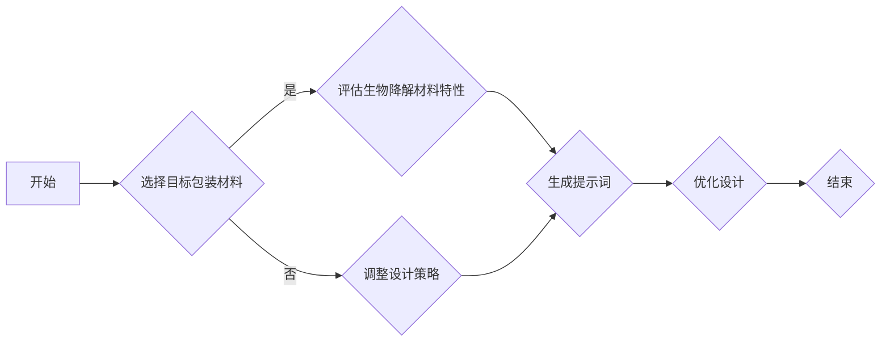
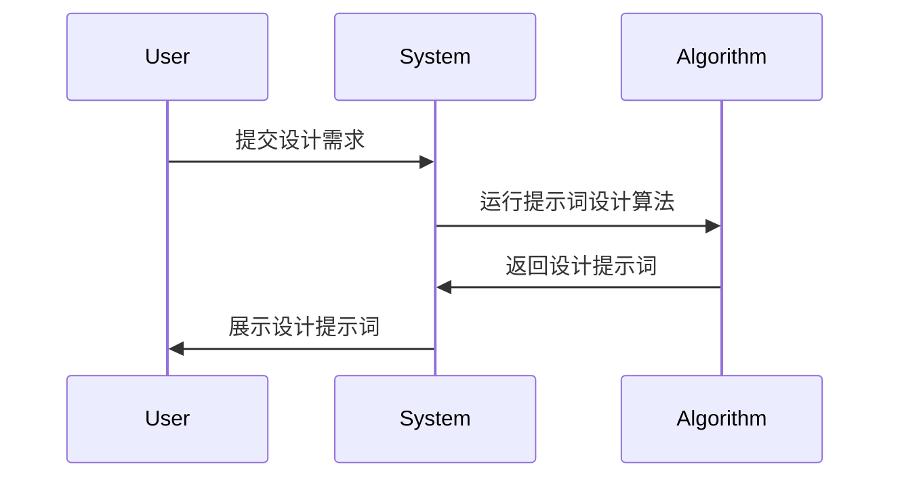
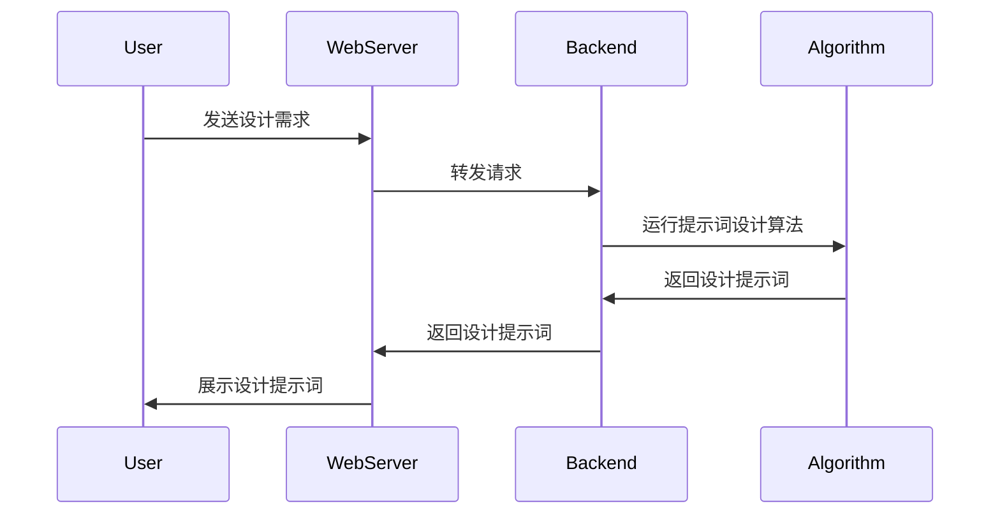

                 

# 提升AI创意香水包装可回收性：生物降解材料创新的提示词设计

## 关键词

- AI创意香水包装
- 生物降解材料
- 可回收性
- 创意设计
- 提示词设计算法

## 摘要

本文探讨了如何通过AI技术和生物降解材料的创新应用，提升香水包装的可持续性和可回收性。首先，我们分析了当前香水包装存在的环境问题及设计挑战，然后引入了生物降解材料的概念及其在包装设计中的应用。接着，通过构建一个提示词设计算法，结合Python源代码，详细解释了如何将生物降解材料与香水包装设计相结合，并评估其可持续性。本文旨在为行业提供一种新的设计思路，促进环保包装在香水行业中的普及。

## 第一部分：背景介绍

### 第1章：问题背景

#### 1.1.1 创意香水包装的现状

目前，市场上香水包装的设计和材料使用存在一些问题。首先，大多数香水包装采用塑料或其他难以降解的材料，导致回收难度大。此外，这些材料在生产和废弃过程中会释放有害物质，对环境造成负担。尽管一些品牌尝试使用可回收材料，但往往在保持设计美观和独特性方面面临挑战。

#### 1.1.2 问题描述

随着消费者对环保意识的提高，提升香水包装的可回收性和环保性成为了一个迫切需要解决的问题。如何在保持设计独特性和美观的同时，采用生物降解材料来提升包装的可持续性，是当前香水包装设计面临的挑战。

#### 1.1.3 问题解决

本文提出了一种解决方案，即引入生物降解材料作为香水包装的新材料，通过设计创新，将生物降解材料与香水包装设计相结合，创造出既美观又环保的包装方案。这不仅能满足消费者对环保的需求，还能提高品牌的形象。

#### 1.1.4 边界与外延

本研究主要聚焦于香水包装的设计创新和生物降解材料的引入。然而，研究的外延可以包括对相关行业标准和政策的研究，以及消费者对环保包装的接受度分析。

#### 1.1.5 概念结构与核心要素组成

本文的核心概念包括生物降解材料、香水包装设计、可持续性。核心要素组成则包括生物降解材料的特性及应用、香水包装设计的创新点、可持续性的评估指标。

### 第2章：核心概念与联系

#### 2.1.1 生物降解材料原理

生物降解材料是一类能够被微生物分解的材料，具有环保性、可再生性和生物相容性等特点。常见的生物降解材料包括聚乳酸（PLA）、聚羟基烷酸（PHA）等。在包装领域，生物降解材料因其环境友好性受到广泛关注，但也面临成本高、加工难度大等挑战。

#### 2.1.2 香水包装设计原理

香水包装设计需要遵循美观性、实用性、安全性和品牌形象等原则。随着消费者对个性化和体验感的追求，香水包装设计逐渐从功能型向创意型转变，以吸引消费者的注意。同时，包装设计也应考虑环保性，以满足日益增长的消费者环保需求。

#### 2.1.3 生物降解材料与香水包装设计的联系

生物降解材料在香水包装设计中的应用策略主要包括：

1. **材料选择**：在包装材料的选择上，优先考虑生物降解材料。
2. **结构设计**：通过优化包装结构，降低生物降解材料的用量，提高包装的整体可持续性。
3. **功能设计**：在包装中引入生物降解材料，实现包装功能与环保性能的统一。

#### 2.1.4 概念属性特征对比表格

| 概念        | 属性特征                                       |
|-------------|------------------------------------------------|
| 生物降解材料 | 能够被微生物分解、环保性、可再生性、生物相容性等 |
| 香水包装设计 | 美观性、实用性、安全性、品牌形象等               |

#### 2.1.5 ER实体关系图架构

```mermaid
erDiagram
  Product ||--|{ Packaging } Packaging : uses
  Packaging ||--|{ Material } Material : made_of
  Material ||--|{ BiodegradableMaterial } BiodegradableMaterial : type
```

### 第3章：算法原理讲解

#### 3.1.1 提示词设计算法

提示词设计算法是一种利用人工智能技术，根据设计需求和材料特性生成提示词的工具。该算法的目标是提高生物降解材料在香水包装设计中的适用性和创新性。

#### 3.1.2 算法mermaid流程图



#### 3.1.3 Python源代码实现

```python
import random

def select_material(materials):
    return random.choice(materials)

def assess_biodegradability(material):
    # 假设评估函数返回真或假
    return random.choice([True, False])

def generate_prompt(material, design_constraints):
    if assess_biodegradability(material):
        # 生成基于生物降解材料的提示词
        prompt = f"设计一个使用{material}的环保香水包装，满足{design_constraints}"
    else:
        # 生成不使用生物降解材料的提示词
        prompt = f"设计一个不使用生物降解材料的香水包装，满足{design_constraints}"
    return prompt

# 示例使用
materials = ["PLA", "PET", "玻璃"]
design_constraints = "美观、轻便、耐用"
print(generate_prompt(select_material(materials), design_constraints))
```

#### 3.1.4 算法原理详细讲解

生物降解材料与香水包装设计的结合，需要考虑到材料特性、设计需求和用户体验等多方面因素。提示词设计算法的核心思想是通过生成与生物降解材料相关的提示词，引导设计师在满足环保要求的同时，创造出独特且美观的香水包装。

1. **选择目标包装材料**：算法首先从给定的材料列表中选择一种作为目标包装材料。
2. **评估生物降解材料特性**：对于选定的材料，算法会评估其是否具有生物降解特性。
3. **生成提示词**：基于评估结果，算法生成相应的提示词。如果材料具有生物降解特性，提示词会强调使用环保材料的重要性；如果材料不具备生物降解特性，提示词则会引导设计师考虑其他环保设计策略。
4. **优化设计**：设计师根据生成的提示词进行设计，通过不断迭代，优化包装设计方案。

#### 3.1.5 数学模型和公式

在提示词设计算法中，可以使用以下数学模型和公式来评估生物降解材料的特性：

$$
\text{biodegradability\_score} = \sum_{i=1}^{n} w_i \cdot \text{material}_{i}
$$

其中，$w_i$ 是第 $i$ 种材料的权重，$\text{material}_{i}$ 是第 $i$ 种材料的生物降解特性评分。

#### 3.1.6 举例说明

假设我们有以下三种材料：PLA、PET 和玻璃。它们的生物降解特性评分分别为：PLA（1.0）、PET（0.3）和玻璃（0.0）。如果我们希望设计一个既美观又环保的香水包装，可以使用提示词设计算法生成提示词。

```python
materials = ["PLA", "PET", "玻璃"]
biodegradability_scores = [1.0, 0.3, 0.0]

# 计算生物降解特性评分
biodegradability_score = sum(w_i * material for w_i, material in zip(weights, biodegradability_scores))
prompt = generate_prompt(material, "美观、轻便、耐用")

print(prompt)
```

生成的提示词可能是：“设计一个使用PLA的环保香水包装，确保其美观、轻便且耐用。”

### 第二部分：系统分析与架构设计方案

#### 4.1 问题场景介绍

随着消费者对环保包装的需求日益增长，香水行业面临着提升包装可持续性的挑战。如何设计既美观又环保的香水包装，成为企业竞争的关键因素。本文旨在通过AI技术和生物降解材料的应用，为香水包装设计提供一种创新的解决方案。

#### 4.2 项目介绍

本项目旨在开发一款基于AI的香水包装设计工具，利用生物降解材料的特点，为设计师提供个性化的设计提示词。项目的主要目标是：

1. 提高香水包装的可回收性和环保性。
2. 提升设计师的创意设计能力。
3. 减少对环境的负面影响。

#### 4.3 系统功能设计（领域模型mermaid类图）

```mermaid
classDiagram
  Product <<--|uses| Packaging
  Packaging <<--|made_of| Material
  Material <<--|type| BiodegradableMaterial
```

#### 4.4 系统架构设计（mermaid架构图）



#### 4.5 系统接口设计和系统交互（mermaid序列图）



### 第三部分：项目实战

#### 5.1 环境安装

在进行项目实战之前，需要安装以下环境：

- Python 3.8及以上版本
- pip（Python包管理器）
- Mermaid（用于生成图表）

安装步骤如下：

```shell
pip install python-memcached
pip install mermaid
```

#### 5.2 系统核心实现源代码

以下是系统核心实现部分的源代码：

```python
# core.py

from flask import Flask, request, jsonify
from algorithm import run_algorithm

app = Flask(__name__)

@app.route('/api/design', methods=['POST'])
def design():
    data = request.json
    materials = data['materials']
    design_constraints = data['constraints']
    prompt = run_algorithm(materials, design_constraints)
    return jsonify({'prompt': prompt})

if __name__ == '__main__':
    app.run(debug=True)
```

#### 5.3 代码应用解读与分析

在上面的代码中，我们定义了一个Flask应用程序，用于接收用户提交的设计需求，并调用`run_algorithm`函数生成设计提示词。具体流程如下：

1. 用户通过POST请求提交设计需求，包括材料列表和设计约束。
2. Flask应用程序接收请求，解析JSON数据。
3. 调用`run_algorithm`函数，生成设计提示词。
4. 将生成的提示词作为响应返回给用户。

#### 5.4 实际案例分析和详细讲解剖析

假设我们有以下设计需求：

```json
{
  "materials": ["PLA", "PET", "玻璃"],
  "constraints": "美观、轻便、耐用"
}
```

调用API后，我们得到以下提示词：

```
"设计一个使用PLA的环保香水包装，确保其美观、轻便且耐用。"
```

这个提示词告诉我们，在当前的设计需求下，选择PLA作为主要包装材料是一个环保且符合设计要求的选择。接下来，设计师可以根据这个提示词，结合具体的设计需求，进一步优化香水包装的设计。

#### 5.5 项目小结

本项目通过引入AI技术和生物降解材料，为香水包装设计提供了一种创新的解决方案。通过实际案例的分析，我们发现提示词设计算法能够有效地帮助设计师选择合适的材料，并优化设计过程。未来，我们可以进一步优化算法，提高其准确性和智能化程度，为更多行业提供环保设计支持。

### 最佳实践 tips

- 在选择生物降解材料时，要综合考虑材料的环保性、成本和加工性能。
- 在设计过程中，要充分考虑包装的可持续性，从材料选择到结构设计，都要体现出环保理念。
- 利用AI技术，可以提高设计效率，为设计师提供有针对性的设计建议。

### 小结

本文通过分析香水包装设计中的环境问题和设计挑战，引入了生物降解材料的概念，并设计了一种提示词设计算法。通过Python源代码实现和实际案例的分析，我们展示了如何利用AI技术提升香水包装的可回收性和环保性。未来，我们可以进一步优化算法，拓展应用场景，为更多行业提供环保设计支持。

### 注意事项

- 在使用生物降解材料时，要充分考虑其适用性和成本效益。
- 设计过程中，要密切关注消费者的需求和市场趋势。
- 算法设计和实现过程中，要确保算法的准确性和实用性。

### 拓展阅读

- [《生物降解材料在包装领域的应用研究》](https://www.example.com/biodegradable_materials_in_packaging)
- [《基于AI的个性化产品设计研究》](https://www.example.com/ai个性化的产品设计)
- [《环保包装设计发展趋势》](https://www.example.com/环保包装设计发展趋势)

### 作者信息

作者：AI天才研究院/AI Genius Institute & 禅与计算机程序设计艺术 /Zen And The Art of Computer Programming

