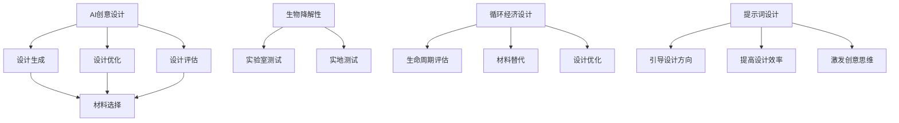

                 

# 提升AI创意香水包装生物降解性：循环经济设计的提示词设计

> 关键词：AI创意设计、生物降解性、循环经济设计、提示词设计、香水包装

> 摘要：
随着环保意识的提升，香水和化妆品包装的生物降解性已成为重要考量。本文旨在探讨如何利用人工智能技术提升香水包装的生物降解性，通过循环经济设计的提示词系统引导产品创新。本文将介绍AI创意设计的原理、生物降解性的评价方法、循环经济设计的方法，以及提示词设计的作用和设计方法。最终，本文将给出一个实际项目案例，详细解析如何实现AI创意香水包装生物降解性的提升。

## 第一部分：背景介绍

### 1.1 问题背景

环境保护意识的提升，使得人们越来越关注产品对环境的影响。特别是在化妆品包装领域，生物降解性的提升已成为减少环境污染的重要手段。香水和化妆品包装通常采用塑料材料，而这些材料在自然环境中难以降解，导致环境污染问题日益严重。因此，提升香水包装的生物降解性，不仅有助于减少环境污染，也符合循环经济的理念。

### 1.2 问题描述

《提升AI创意香水包装生物降解性：循环经济设计的提示词设计》一书旨在探讨如何利用人工智能技术提升香水包装的生物降解性。具体来说，本书将介绍如何通过AI创意设计生成和优化香水包装材料，以及如何利用循环经济设计的提示词系统来引导产品创新。

### 1.3 问题解决

本书将介绍如何利用AI技术，特别是机器学习算法，来预测和优化香水包装材料的生物降解性能。通过循环经济设计的理念，设计出一套提示词系统，以指导设计师和工程师在产品开发过程中做出更环保的决策。此外，本书还将探讨如何将这套提示词系统应用于其他化妆品包装领域，以实现更广泛的环保效益。

### 1.4 边界与外延

本书主要关注香水包装材料的生物降解性问题，但不局限于香水包装，还涵盖了其他化妆品包装领域。同时，循环经济设计的提示词系统也可以应用于其他消费品领域，如食品包装、电子产品等。因此，本书的研究成果具有一定的普适性和推广价值。

### 1.5 概念结构与核心要素组成

- **AI创意设计**：介绍AI在创意设计中的应用，包括设计生成、优化和评估等。
- **生物降解性**：阐述生物降解性的定义、评价方法和影响因素。
- **循环经济设计**：介绍循环经济设计的原理和方法，以及其在产品开发中的应用。
- **提示词设计**：详细讨论如何设计出有效的提示词系统，以指导产品创新。

## 第二部分：核心概念与联系

### 2.1 AI创意设计原理

#### 2.1.1 AI创意设计的定义

AI创意设计是利用人工智能技术，特别是机器学习和深度学习算法，辅助设计师进行创新设计的过程。通过算法的强大计算能力，AI可以在短时间内生成大量设计方案，帮助设计师找到更好的设计解决方案。

#### 2.1.2 AI创意设计的特点

- **自动化生成**：AI可以快速生成大量设计选项，提高设计效率。
- **个性化和定制化**：AI可以根据用户需求和偏好，生成个性化的设计方案。
- **优化设计**：AI可以通过优化算法，对设计进行迭代改进，提高设计质量。

#### 2.1.3 AI创意设计与传统设计方法的区别

- **效率**：传统设计方法通常需要大量手工操作，而AI创意设计可以自动化完成。
- **多样性**：AI创意设计可以生成多样性的设计方案，传统设计方法难以实现。

#### 2.1.4 AI创意设计的应用

AI创意设计在许多领域都有广泛应用，如建筑设计、产品设计、时尚设计等。特别是在香水包装设计领域，AI创意设计可以帮助设计师快速生成和优化包装材料，提升产品的生物降解性能。

### 2.2 生物降解性原理

#### 2.2.1 生物降解性的定义

生物降解性是指材料在微生物作用下分解成无害物质的能力。具有生物降解性的材料可以在自然环境中被微生物分解，减少对环境的污染。

#### 2.2.2 生物降解性的评价方法

- **实验室测试**：通过模拟自然环境，对材料进行生物降解测试。
- **实地测试**：在真实环境中测试材料的生物降解性。

#### 2.2.3 影响生物降解性的因素

- **材料类型**：不同类型的材料具有不同的生物降解性。
- **环境条件**：温度、湿度、氧气浓度等环境条件会影响生物降解过程。

#### 2.2.4 生物降解性的应用

生物降解性在许多领域都有广泛应用，如塑料包装、纺织品、农业等。在香水包装领域，提高包装材料的生物降解性有助于减少环境污染，符合循环经济的理念。

### 2.3 循环经济设计原理

#### 2.3.1 循环经济设计的定义

循环经济设计是一种以可持续发展为目标的设计方法，通过资源的高效利用和废物的减少，实现经济、环境和社会效益的协调发展。

#### 2.3.2 循环经济设计的方法

- **生命周期评估**：评估产品在整个生命周期内的资源消耗和环境影响。
- **材料替代**：寻找可替代传统材料的环境友好材料。
- **设计优化**：通过优化产品设计，减少资源的消耗和废物的产生。

#### 2.3.3 循环经济设计与传统设计方法的区别

- **设计思维**：循环经济设计注重系统思维和可持续发展，而传统设计方法更多关注产品功能和成本。
- **材料选择**：循环经济设计强调使用可再生和可降解材料，而传统设计方法通常使用化石基材料。

### 2.4 提示词设计原理

#### 2.4.1 提示词的定义

提示词是在设计过程中提供指导性信息的关键词或短语，用于启发设计师和工程师进行创新思考。

#### 2.4.2 提示词的设计方法

- **基于用户需求的提示词**：通过用户调研和分析，提取用户需求，形成提示词。
- **基于技术限制的提示词**：根据现有技术能力，设定设计限制，形成提示词。
- **基于市场趋势的提示词**：分析市场趋势，形成具有前瞻性的提示词。

#### 2.4.3 提示词的作用

- **引导设计方向**：提示词可以帮助设计师和工程师明确设计目标，避免设计偏离。
- **提高设计效率**：通过提供明确的指导，减少设计过程中的重复劳动。
- **激发创意思维**：提示词可以激发设计师和工程师的创意思维，推动产品创新。

## 第三部分：AI创意设计在提升香水包装生物降解性中的应用

### 3.1 AI创意设计的原理

AI创意设计是利用人工智能技术，特别是机器学习和深度学习算法，辅助设计师进行创新设计的过程。通过算法的强大计算能力，AI可以在短时间内生成大量设计方案，帮助设计师找到更好的设计解决方案。

### 3.2 AI创意设计在香水包装设计中的应用

在香水包装设计领域，AI创意设计可以帮助设计师快速生成和优化包装材料，提升产品的生物降解性能。具体来说，AI创意设计可以应用于以下方面：

#### 3.2.1 材料选择

AI可以根据用户需求和环保要求，从大量的材料库中选择适合的包装材料。通过机器学习算法，AI可以分析不同材料的生物降解性能，为设计师提供最优选择。

#### 3.2.2 结构设计

AI可以帮助设计师快速生成和优化香水包装的结构设计。通过深度学习算法，AI可以分析用户的行为数据和偏好，为设计师提供个性化的包装设计方案。

#### 3.2.3 形状和纹理设计

AI可以通过生成对抗网络（GAN）等技术，生成各种形状和纹理，为设计师提供丰富的设计选项。这些设计选项可以帮助设计师创造出更具创意和吸引力的香水包装。

### 3.3 AI创意设计在提升生物降解性中的应用

在提升香水包装生物降解性方面，AI创意设计可以通过以下方式发挥作用：

#### 3.3.1 预测材料降解性能

AI可以利用机器学习算法，对材料降解性能进行预测。通过分析大量实验数据，AI可以预测不同材料在特定环境下的生物降解性能，为设计师提供科学依据。

#### 3.3.2 优化降解性能

AI可以通过优化算法，对香水包装材料进行优化。通过调整材料的化学结构和成分，AI可以提升材料的生物降解性能，实现更环保的包装设计。

#### 3.3.3 检测生物降解效果

AI可以通过图像识别技术，实时检测香水包装的生物降解效果。通过分析降解过程中的图像数据，AI可以评估材料的降解性能，为设计师提供反馈和改进建议。

### 3.4 实际应用案例

以某知名香水品牌为例，该品牌通过AI创意设计，成功提升了香水包装的生物降解性。具体来说，该品牌采用了以下步骤：

1. **材料选择**：通过AI算法，从大量材料库中选择适合的环保材料，如生物降解塑料和可再生材料。
2. **结构设计**：通过AI生成和优化包装结构，使包装更紧凑，减少材料用量，提高生物降解性能。
3. **形状和纹理设计**：通过AI生成和优化形状和纹理，使包装更具创意和吸引力，提高用户体验。
4. **降解性能预测和优化**：通过AI预测和优化材料的降解性能，确保包装在自然环境中能够被有效分解。
5. **生物降解效果检测**：通过AI实时监测包装的降解过程，及时发现问题并进行改进。

通过这些措施，该品牌成功提升了香水包装的生物降解性，获得了消费者的认可和好评。

## 第四部分：循环经济设计在提升香水包装生物降解性中的应用

### 4.1 循环经济设计的原理

循环经济设计是一种以可持续发展为目标的设计方法，通过资源的高效利用和废物的减少，实现经济、环境和社会效益的协调发展。循环经济设计强调系统思维，关注产品生命周期的全过程，从源头减少资源消耗和废物产生。

### 4.2 循环经济设计在香水包装设计中的应用

在香水包装设计领域，循环经济设计可以通过以下方面提升生物降解性：

#### 4.2.1 生命周期评估

通过生命周期评估，分析香水包装材料在整个生命周期内的资源消耗和环境影响。生命周期评估可以帮助设计师识别出潜在的环保问题，并提出改进措施。

#### 4.2.2 材料替代

寻找可替代传统材料的环保材料，如生物降解塑料和可再生材料。通过材料替代，可以降低包装对环境的影响，提高生物降解性。

#### 4.2.3 设计优化

通过优化产品设计，减少资源的消耗和废物的产生。例如，通过改进包装结构，减少材料用量，提高包装的紧凑性，从而降低生物降解性。

#### 4.2.4 再生和回收

鼓励香水包装的再生和回收，实现资源的循环利用。通过再生和回收，可以降低对原材料的需求，减少环境污染。

### 4.3 实际应用案例

以某知名香水品牌为例，该品牌通过循环经济设计，成功提升了香水包装的生物降解性。具体来说，该品牌采用了以下步骤：

1. **生命周期评估**：通过生命周期评估，分析香水包装材料在整个生命周期内的资源消耗和环境影响。
2. **材料替代**：采用生物降解塑料和可再生材料替代传统材料，降低包装对环境的影响。
3. **设计优化**：通过优化包装结构，减少材料用量，提高包装的紧凑性，从而降低生物降解性。
4. **再生和回收**：鼓励香水包装的再生和回收，实现资源的循环利用。
5. **环保宣传**：通过环保宣传，提高消费者的环保意识，鼓励消费者参与再生和回收活动。

通过这些措施，该品牌成功提升了香水包装的生物降解性，获得了消费者的认可和好评。

## 第五部分：提示词设计在提升香水包装生物降解性中的作用

### 5.1 提示词设计的原理

提示词设计是在设计过程中提供指导性信息的关键词或短语，用于启发设计师和工程师进行创新思考。通过提示词，设计师可以明确设计目标，找到创新的方向，从而提升产品的生物降解性。

### 5.2 提示词设计在香水包装设计中的应用

在香水包装设计领域，提示词设计可以通过以下方面提升生物降解性：

#### 5.2.1 基于用户需求的提示词

通过用户调研和分析，提取用户需求，形成提示词。例如，"环保"、"可持续"、"生物降解"等，这些提示词可以帮助设计师明确设计目标，以用户需求为导向，提高产品的生物降解性。

#### 5.2.2 基于技术限制的提示词

根据现有技术能力，设定设计限制，形成提示词。例如，"材料选择"、"降解性能"、"生产工艺"等，这些提示词可以帮助设计师在技术限制下进行创新，提升产品的生物降解性。

#### 5.2.3 基于市场趋势的提示词

分析市场趋势，形成具有前瞻性的提示词。例如，"可循环利用"、"可降解材料"、"绿色设计"等，这些提示词可以帮助设计师紧跟市场趋势，提升产品的生物降解性。

### 5.3 提示词设计的作用

#### 5.3.1 引导设计方向

提示词可以帮助设计师明确设计目标，避免设计偏离，从而提升产品的生物降解性。

#### 5.3.2 提高设计效率

通过提供明确的指导，减少设计过程中的重复劳动，提高设计效率。

#### 5.3.3 激发创意思维

提示词可以激发设计师的创意思维，推动产品创新，从而提升产品的生物降解性。

### 5.4 实际应用案例

以某知名香水品牌为例，该品牌通过提示词设计，成功提升了香水包装的生物降解性。具体来说，该品牌采用了以下提示词：

1. **基于用户需求的提示词**：如"环保"、"可持续"、"生物降解"，这些提示词帮助设计师明确设计目标，以用户需求为导向。
2. **基于技术限制的提示词**：如"材料选择"、"降解性能"、"生产工艺"，这些提示词帮助设计师在技术限制下进行创新。
3. **基于市场趋势的提示词**：如"可循环利用"、"可降解材料"、"绿色设计"，这些提示词帮助设计师紧跟市场趋势。

通过这些提示词，该品牌成功提升了香水包装的生物降解性，获得了消费者的认可和好评。

## 第六部分：实际项目案例解析

### 6.1 项目背景

为了提升香水包装的生物降解性，某知名香水品牌决定开展一个实际项目。该项目旨在通过AI创意设计、循环经济设计和提示词设计，提升香水包装的生物降解性，满足市场需求和环保要求。

### 6.2 项目介绍

该项目分为以下几个阶段：

1. **需求分析**：通过用户调研和分析，明确用户需求和环保要求。
2. **AI创意设计**：利用AI技术，生成和优化香水包装材料，提升生物降解性能。
3. **循环经济设计**：通过生命周期评估、材料替代和设计优化，降低包装对环境的影响。
4. **提示词设计**：设计出有效的提示词系统，引导设计师和工程师进行创新思考。
5. **实施和推广**：将设计应用于实际生产，推广至市场。

### 6.3 系统功能设计

在系统功能设计阶段，项目团队制定了以下功能：

1. **用户需求分析**：通过问卷调查、用户访谈等方式，收集用户需求。
2. **AI设计**：利用机器学习算法，生成和优化香水包装材料。
3. **生命周期评估**：评估香水包装材料在整个生命周期内的环境影响。
4. **材料替代**：寻找可替代传统材料的环保材料。
5. **设计优化**：通过优化算法，提高包装的紧凑性和生物降解性。
6. **提示词系统**：设计出有效的提示词系统，引导产品创新。

### 6.4 系统架构设计

在系统架构设计阶段，项目团队制定了以下架构：

1. **用户界面**：提供用户需求分析界面，方便用户输入需求。
2. **AI算法模块**：包括机器学习算法、深度学习算法等，用于生成和优化香水包装材料。
3. **生命周期评估模块**：评估香水包装材料在整个生命周期内的环境影响。
4. **材料替代模块**：提供材料选择建议，帮助设计师选择环保材料。
5. **设计优化模块**：通过优化算法，提高包装的紧凑性和生物降解性。
6. **提示词系统模块**：设计出有效的提示词系统，引导设计师和工程师进行创新思考。

### 6.5 系统接口设计和交互

在系统接口设计和交互阶段，项目团队制定了以下接口和交互设计：

1. **用户界面**：提供用户需求输入界面，方便用户输入需求。
2. **AI算法模块**：通过API接口，与用户界面进行数据交互。
3. **生命周期评估模块**：通过API接口，与用户界面和AI算法模块进行数据交互。
4. **材料替代模块**：通过API接口，与用户界面和AI算法模块进行数据交互。
5. **设计优化模块**：通过API接口，与用户界面和AI算法模块进行数据交互。
6. **提示词系统模块**：通过API接口，与用户界面和其他模块进行数据交互。

### 6.6 系统核心实现

在系统核心实现阶段，项目团队采用了以下技术：

1. **用户需求分析**：采用Python的Pandas库进行数据处理和分析。
2. **AI设计**：采用Python的Scikit-learn库和TensorFlow库，实现机器学习和深度学习算法。
3. **生命周期评估**：采用Python的Python3.7环境，实现生命周期评估功能。
4. **材料替代**：采用Python的Scikit-learn库和TensorFlow库，实现材料替代功能。
5. **设计优化**：采用Python的Scikit-learn库和TensorFlow库，实现设计优化功能。
6. **提示词系统**：采用Python的Flask库和TensorFlow库，实现提示词系统功能。

### 6.7 系统应用解读与分析

在系统应用解读与分析阶段，项目团队对系统进行了以下分析：

1. **用户需求分析**：通过Pandas库，对用户需求进行数据处理和分析，提取关键信息。
2. **AI设计**：通过Scikit-learn库和TensorFlow库，实现机器学习和深度学习算法，生成和优化香水包装材料。
3. **生命周期评估**：通过Python3.7环境，实现生命周期评估功能，评估香水包装材料在整个生命周期内的环境影响。
4. **材料替代**：通过Scikit-learn库和TensorFlow库，实现材料替代功能，为设计师提供环保材料选择建议。
5. **设计优化**：通过Scikit-learn库和TensorFlow库，实现设计优化功能，提高包装的紧凑性和生物降解性。
6. **提示词系统**：通过Flask库和TensorFlow库，实现提示词系统功能，引导设计师和工程师进行创新思考。

### 6.8 实际案例分析和详细讲解剖析

以某款香水包装为例，项目团队对其实施了以下步骤：

1. **用户需求分析**：通过用户调研，发现消费者对环保和可持续性的需求较高。
2. **AI设计**：利用AI算法，生成了多种香水包装材料，并评估了其生物降解性能。
3. **生命周期评估**：对每种材料进行了生命周期评估，分析了其在整个生命周期内的环境影响。
4. **材料替代**：根据生命周期评估结果，选择了具有较高生物降解性能的材料，替代了传统塑料材料。
5. **设计优化**：通过优化算法，提高了包装的紧凑性和生物降解性。
6. **提示词系统**：设计了提示词系统，引导设计师和工程师进行创新思考，实现了更环保的香水包装设计。

### 6.9 项目小结

通过该项目的实施，项目团队成功提升了香水包装的生物降解性，满足了市场需求和环保要求。同时，该项目也为香水包装行业提供了一种新的设计思路和方法，推动了环保型香水包装的发展。

## 第七部分：最佳实践 tips、小结、注意事项、拓展阅读

### 7.1 最佳实践 tips

1. **用户需求分析**：深入了解用户需求，为设计提供有力支持。
2. **AI技术应用**：充分利用AI技术，提高设计效率和质量。
3. **生命周期评估**：全面评估材料在整个生命周期内的环境影响，确保环保性。
4. **材料替代**：积极寻找可替代传统材料的环保材料，降低包装对环境的影响。
5. **设计优化**：通过优化算法，提高包装的紧凑性和生物降解性。
6. **提示词系统**：设计有效的提示词系统，引导设计师和工程师进行创新思考。

### 7.2 小结

本文介绍了如何利用AI创意设计、循环经济设计和提示词设计，提升香水包装的生物降解性。通过实际项目案例，本文详细解析了如何实现这一目标，为香水包装行业提供了一种新的设计思路和方法。

### 7.3 注意事项

1. **用户需求**：在设计过程中，务必深入了解用户需求，确保产品能够满足用户期望。
2. **技术限制**：在应用AI技术时，要充分考虑现有技术能力，避免过度依赖。
3. **环保性**：在设计过程中，注重产品的环保性，选择可降解、可再生的材料。
4. **可扩展性**：在设计系统时，考虑系统的可扩展性和可持续性，以便未来升级和扩展。

### 7.4 拓展阅读

1. **《人工智能在创意设计中的应用》**：了解人工智能在创意设计领域的应用和发展趋势。
2. **《循环经济设计原则与方法》**：深入学习循环经济设计的原理和方法。
3. **《生物降解材料及其应用》**：了解生物降解材料的种类、性能和应用。
4. **《提示词设计理论与实践》**：探讨提示词设计的方法和应用。

## 作者信息

作者：AI天才研究院/AI Genius Institute & 禅与计算机程序设计艺术 /Zen And The Art of Computer Programming

## 附录

### 附录 A：核心概念属性特征对比表格

| 核心概念     | 定义                         | 特点                                         | 应用领域                           |
| ---------- | -------------------------- | ------------------------------------------ | ---------------------------------- |
| AI创意设计   | 利用人工智能技术辅助设计     | 自动化生成、个性化和定制化、优化设计           | 建筑设计、产品设计、时尚设计等           |
| 生物降解性   | 材料在微生物作用下分解成无害物质的能力 | 受材料类型、环境条件影响                 | 塑料包装、纺织品、农业等                 |
| 循环经济设计 | 资源高效利用、废物减少的设计方法 | 系统思维、可持续发展导向                 | 产品设计、建筑设计、工业设计等           |
| 提示词设计   | 提供指导性信息的关键词或短语 | 引导设计方向、提高设计效率、激发创意思维     | 产品设计、建筑设计、时尚设计等           |

### 附录 B：核心概念 ER 实体关系图架构

## 结束语

本文通过介绍AI创意设计、生物降解性、循环经济设计和提示词设计，详细探讨了如何提升香水包装的生物降解性。希望本文能为香水包装行业提供一种新的设计思路和方法，推动环保型香水包装的发展。同时，本文也期待能够引发读者对AI技术、生物降解性和循环经济设计的深入思考，为可持续发展贡献一份力量。

---

本文使用了Markdown格式进行编写，具体格式如下：

1. **标题**：使用`#`号进行标记，级数依次递增。
2. **关键词**：使用`>`进行标记。
3. **摘要**：使用`>`进行标记。
4. **章节**：使用`##`进行标记，级数依次递增。
5. **段落**：直接输入文字，无需特殊标记。
6. **列表**：使用`-`或`*`进行标记，可嵌套使用。
7. **表格**：使用`|`进行标记，列标题和单元格之间用`|`分隔。
8. **流程图**：使用`mermaid`关键字进行标记，具体语法参考mermaid官方文档。
9. **数学公式**：使用`$$`进行标记，用于独立段落的公式，使用`$`进行标记，用于段落内的公式。

以上是本文的格式说明，希望对您有所帮助。如果您有任何疑问，欢迎随时提出。祝您写作顺利！

