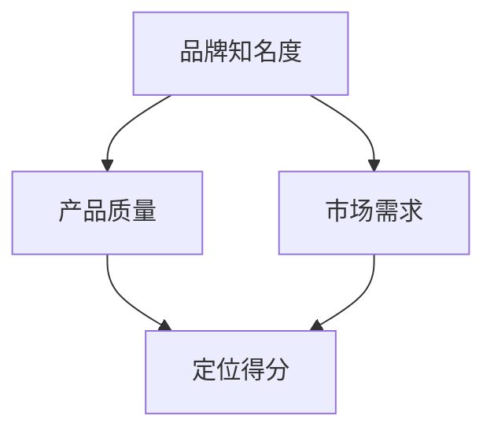
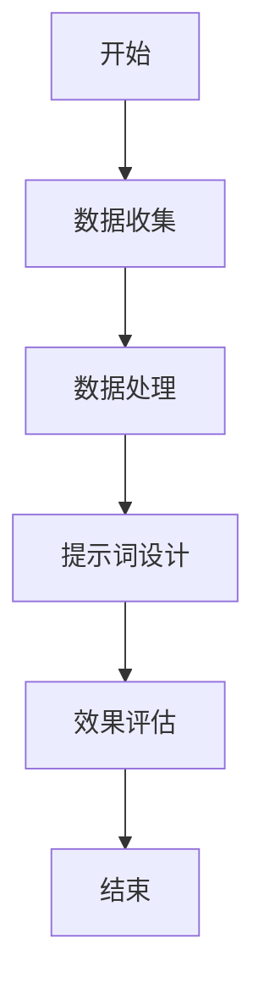

                 


# 《提升AI创意香水品牌定位：全球市场本地化的提示词设计》

## 摘要

本文探讨了如何利用人工智能技术提升创意香水品牌的全球市场定位，特别是本地化策略中的提示词设计。文章首先介绍了AI创意香水品牌定位的背景，包括香水行业市场现状和AI技术的应用趋势，然后阐述了全球市场本地化的意义和提示词设计的重要性。接着，文章深入分析了AI与香水品牌定位的核心概念和联系，并提出了定位原理的数学模型和详细讲解。随后，文章详细讨论了全球市场本地化策略，包括提示词设计原则、流程与方法，并结合具体案例进行了深入剖析。最后，文章总结了最佳实践和注意事项，并对AI技术在香水行业的未来趋势进行了展望。本文旨在为香水品牌提供一套系统化的本地化策略，以提升品牌在全球市场的竞争力和吸引力。

## 目录

### 第一部分：引言

#### 第1章：AI创意香水品牌定位的背景

1.1 香水行业的市场现状  
1.2 AI技术在香水行业的应用趋势  
1.3 全球市场本地化的意义  
1.4 提示词设计的重要性

#### 第2章：核心概念与联系

2.1 AI技术在香水行业的应用概述  
2.2 核心概念属性特征对比表  
2.3 AI与香水品牌定位的ER实体关系图

#### 第3章：AI创意香水品牌定位原理

3.1 AI创意香水品牌定位的数学模型  
3.2 定位原理的Mermaid流程图  
3.3 定位原理的详细讲解与举例

### 第二部分：全球市场本地化策略

#### 第4章：全球市场本地化概述

4.1 全球市场本地化的定义  
4.2 全球市场本地化的重要性  
4.3 全球市场本地化的挑战与机遇

#### 第5章：全球市场本地化的策略

5.1 提示词设计原则  
5.2 提示词设计的流程与方法

#### 第6章：案例研究

6.1 案例一：某国际香水品牌在中国市场的本地化实践  
6.2 案例二：某国内香水品牌在欧洲市场的本地化实践  
6.3 案例分析与讨论

### 第三部分：实施与评估

#### 第7章：AI创意香水品牌定位的实施步骤

7.1 数据收集与处理  
7.2 提示词设计实战  
7.3 定位效果评估

#### 第8章：最佳实践与注意事项

8.1 全球市场本地化策略的最佳实践  
8.2 提示词设计的注意事项  
8.3 案例分析中的成功与不足

#### 第9章：未来展望与拓展阅读

9.1 AI技术在香水行业的未来趋势  
9.2 全球市场本地化的新挑战与新机遇  
9.3 拓展阅读推荐

## 第一部分：引言

### 第1章：AI创意香水品牌定位的背景

#### 1.1 香水行业的市场现状

香水作为一种特殊的消费品，在全球市场中拥有广泛的消费者群体。根据市场研究公司的数据，全球香水市场规模在过去几年中持续增长，预计未来几年也将保持稳定的增长趋势。目前，香水市场主要由几个国际知名品牌和众多区域品牌构成，市场竞争激烈。

在香水市场上，消费者对于品牌、香味、包装以及价格等方面有着不同的需求和偏好。品牌知名度、产品质量、市场定位等因素在消费者购买决策中起着至关重要的作用。然而，随着全球化进程的加速，国际品牌在国内市场的竞争压力越来越大，而国内品牌在国际市场的认知度也亟待提高。因此，如何通过有效的市场定位策略来提升品牌的竞争力，成为了香水行业面临的重要课题。

#### 1.2 AI技术在香水行业的应用趋势

近年来，人工智能（AI）技术在各个行业的应用越来越广泛，香水行业也不例外。AI技术在香水行业的应用主要包括以下几个方面：

1. **个性化推荐**：通过分析消费者的购买记录、浏览行为和偏好，AI系统可以推荐最适合消费者的香水产品，从而提高消费者的满意度和购买转化率。
2. **配方优化**：AI技术可以通过对大量香氛数据的分析，发现新的香氛组合，为品牌提供创新的香水配方。
3. **品牌定位**：利用自然语言处理（NLP）技术，AI可以帮助品牌分析和理解市场趋势，为品牌提供准确的定位策略。

此外，AI技术还可以应用于生产过程的自动化、供应链优化、市场调研等方面，从而提升整个产业链的效率。

#### 1.3 全球市场本地化的意义

全球市场本地化是指企业在全球市场中根据不同国家和地区的文化和消费习惯，调整产品和服务策略，以适应本地市场的需求。对于香水品牌来说，全球市场本地化具有重要意义：

1. **提高品牌认知度**：通过本地化的市场策略，品牌可以更好地融入当地市场，提高消费者对品牌的认知度。
2. **增强消费者粘性**：本地化的产品和服务能够更好地满足当地消费者的需求，从而增强消费者的忠诚度。
3. **提升市场份额**：在全球市场本地化的过程中，品牌可以更准确地把握市场机会，提升市场份额。

#### 1.4 提示词设计的重要性

在AI创意香水品牌定位过程中，提示词设计扮演着至关重要的角色。提示词是指用于引导AI系统进行特定任务的关键词或短语。在设计提示词时，需要考虑以下几个方面：

1. **准确性**：提示词需要准确地反映消费者的需求和品牌的核心价值，以便AI系统能够准确地理解和执行任务。
2. **多样性**：提示词应具有多样性，以涵盖不同文化背景和消费者群体的需求。
3. **可扩展性**：提示词设计应具备一定的可扩展性，以便在未来的市场调整中能够灵活应用。

通过有效的提示词设计，AI系统可以更准确地定位品牌，提高品牌的全球市场竞争力。

### 第2章：核心概念与联系

#### 2.1 AI技术在香水行业的应用概述

AI技术在香水行业的应用可以概括为以下几个方面：

1. **个性化推荐**：基于消费者的购买行为、历史数据和偏好，AI系统可以推荐最适合消费者的香水产品，从而提高消费者的满意度和购买转化率。
2. **配方优化**：通过机器学习算法，AI技术可以分析大量的香氛数据，发现新的香氛组合，为品牌提供创新的香水配方。
3. **品牌定位**：利用自然语言处理（NLP）技术，AI可以帮助品牌分析和理解市场趋势，为品牌提供准确的定位策略。
4. **生产优化**：AI技术可以应用于生产过程的自动化，提高生产效率，降低成本。

#### 2.2 核心概念属性特征对比表

为了更好地理解AI技术在香水行业中的应用，我们可以通过对比不同技术的属性特征来进行分析。以下是一个简单的对比表格：

| 技术类型 | 特点 | 应用场景 | 
| ------ | ------ | ------ | 
| 个性化推荐 | 基于用户数据，提供个性化推荐 | 推广特定香水产品，提高购买转化率 | 
| 配方优化 | 基于大量数据，发现新香氛组合 | 提供创新香水配方，提升品牌竞争力 | 
| 品牌定位 | 利用NLP技术，分析市场趋势 | 提供准确的品牌定位策略，提升品牌认知度 | 
| 生产优化 | 自动化生产流程 | 提高生产效率，降低成本 |

#### 2.3 AI与香水品牌定位的ER实体关系图

为了更直观地展示AI与香水品牌定位之间的关系，我们可以使用Mermaid绘制一个ER实体关系图。以下是ER实体关系图的Markdown格式：

```mermaid
erDiagram
  AI系统 --> 香水品牌定位 : 数据驱动
  AI系统 --> 个性化推荐 : 用户数据分析
  AI系统 --> 配方优化 : 数据分析能力
  AI系统 --> 生产优化 : 自动化
  香水品牌定位 --> 市场趋势分析 : NLP技术
  香水品牌定位 --> 用户需求分析 : 数据分析
  香水品牌定位 --> 品牌竞争力评估 : 数据支持
```

通过ER实体关系图，我们可以清晰地看到AI系统与香水品牌定位之间的紧密联系，以及不同技术在实际应用中的具体场景。

### 第3章：AI创意香水品牌定位原理

#### 3.1 AI创意香水品牌定位的数学模型

AI创意香水品牌定位的数学模型可以通过以下公式表示：

$$
定位得分 = f(品牌知名度, 产品质量, 市场需求)
$$

其中，品牌知名度、产品质量和市场需求是影响品牌定位的三个关键因素。

1. **品牌知名度**：品牌知名度是衡量品牌在市场中的影响力的重要指标。它反映了消费者对品牌的认知程度，通常与广告投放、公关活动等因素相关。

2. **产品质量**：产品质量是消费者选择品牌的重要因素。高品质的香水产品能够提升品牌形象，增加消费者的信任度和忠诚度。

3. **市场需求**：市场需求是品牌定位的重要依据。通过对市场趋势和消费者偏好的分析，品牌可以更好地把握市场需求，制定相应的市场策略。

#### 3.2 定位原理的Mermaid流程图

为了更直观地展示AI创意香水品牌定位的原理，我们可以使用Mermaid绘制一个流程图。以下是流程图的Markdown格式：



通过流程图，我们可以清晰地看到品牌知名度、产品质量和市场需求如何共同影响品牌定位得分。

#### 3.3 定位原理的详细讲解与举例

在AI创意香水品牌定位中，定位原理的详细讲解如下：

1. **品牌知名度**：品牌知名度是通过广告投放、公关活动、社交媒体营销等方式来提高的。一个具有高品牌知名度的香水品牌，可以更容易地吸引消费者的注意，从而提高市场份额。

2. **产品质量**：产品质量是消费者选择品牌的重要因素。一个高品质的香水品牌，需要通过严格的质量控制和研发投入，确保产品的质量和稳定性。高质量的产品能够提升品牌形象，增加消费者的信任度和忠诚度。

3. **市场需求**：市场需求是通过市场调研和分析消费者行为来确定的。一个具备市场洞察力的香水品牌，能够更好地把握市场需求，及时调整产品策略，以满足消费者的需求。

举例来说，假设某个香水品牌在广告投放、产品质量和市场调研方面表现优异，那么其品牌知名度、产品质量和市场需求得分都很高。根据定位原理的数学模型，这个品牌的定位得分也会相应提高，从而在市场中获得竞争优势。

### 第二部分：全球市场本地化策略

#### 第4章：全球市场本地化概述

##### 4.1 全球市场本地化的定义

全球市场本地化是指企业在全球市场中，根据不同国家和地区的文化和消费习惯，调整产品和服务策略，以适应本地市场的需求。本地化不仅包括语言和文化的适应，还包括产品特性、市场定位、营销策略等多方面的调整。

##### 4.2 全球市场本地化的重要性

全球市场本地化对品牌具有重要意义，主要体现在以下几个方面：

1. **提高品牌认知度**：通过本地化的市场策略，品牌可以更好地融入当地市场，提高消费者对品牌的认知度。

2. **增强消费者粘性**：本地化的产品和服务能够更好地满足当地消费者的需求，从而增强消费者的忠诚度。

3. **提升市场份额**：在全球市场本地化的过程中，品牌可以更准确地把握市场机会，提升市场份额。

##### 4.3 全球市场本地化的挑战与机遇

全球市场本地化面临一系列挑战和机遇：

1. **挑战**：
   - 文化差异：不同国家和地区有着不同的文化习俗和消费观念，品牌需要深入了解并适应这些差异。
   - 法规限制：各国对进口产品的法规不同，品牌需要遵守并适应这些法规。
   - 市场竞争：全球市场竞争激烈，品牌需要不断提升自身竞争力。

2. **机遇**：
   - 市场扩张：全球市场本地化可以帮助品牌拓展新的市场，实现销售增长。
   - 品牌差异化：通过本地化策略，品牌可以打造独特的产品和服务，形成差异化竞争优势。
   - 跨文化体验：本地化策略可以让消费者体验到品牌的全球化和本土化相结合的独特价值。

#### 第5章：全球市场本地化的策略

##### 5.1 提示词设计原则

在实施全球市场本地化策略时，提示词设计是一个关键环节。以下是提示词设计的主要原则：

1. **语言差异考虑**：根据目标市场的语言习惯，选择合适的词汇和表达方式，确保提示词的准确性和易理解性。

2. **文化差异考虑**：考虑不同文化背景下的禁忌和偏好，避免使用可能引起误解或不适的词汇。

3. **消费者行为差异考虑**：根据目标市场的消费者行为，设计符合当地消费者习惯的提示词。

##### 5.2 提示词设计的流程与方法

提示词设计的流程可以分为以下几个步骤：

1. **需求分析**：了解目标市场的需求，包括文化背景、消费者偏好、市场竞争状况等。

2. **目标市场分析**：分析目标市场的特点，确定需要本地化的关键要素。

3. **提示词创意**：基于需求分析和目标市场分析，设计具有创意和吸引力的提示词。

4. **提示词优化**：对设计的提示词进行优化，确保其在目标市场中具有较高的接受度和效果。

具体的提示词设计方法包括：

1. **关键词提取**：从市场调研数据中提取关键信息，形成初步的提示词列表。

2. **语义分析**：对提示词进行语义分析，确保其含义准确、符合目标市场的语言习惯。

3. **用户反馈**：收集用户对提示词的反馈，根据反馈进行调整和优化。

### 第三部分：实施与评估

#### 第7章：AI创意香水品牌定位的实施步骤

##### 7.1 数据收集与处理

1. **数据收集**：收集与品牌定位相关的数据，包括品牌知名度、产品质量、市场需求等。

2. **数据处理**：对收集到的数据进行分析和清洗，确保数据的质量和准确性。

##### 7.2 提示词设计实战

1. **需求分析**：根据品牌定位需求，分析目标市场的文化背景、消费者偏好和竞争状况。

2. **目标市场分析**：确定目标市场的特点，为提示词设计提供依据。

3. **提示词创意**：结合市场需求和目标市场特点，设计具有创意和吸引力的提示词。

4. **提示词优化**：通过用户反馈和数据分析，对提示词进行优化，提高其效果。

##### 7.3 定位效果评估

1. **效果评估**：通过市场调研和数据分析，评估提示词设计的实际效果。

2. **调整与优化**：根据效果评估结果，对提示词设计进行调整和优化，以提高品牌定位效果。

### 第四部分：案例分析

#### 第6章：案例研究

##### 6.1 案例一：某国际香水品牌在中国市场的本地化实践

1. **背景**：某国际知名香水品牌在中国市场的本地化实践，旨在提高品牌在中国市场的知名度和市场份额。

2. **实践**：
   - **需求分析**：了解中国消费者的文化背景、消费习惯和偏好。
   - **目标市场分析**：确定中国市场的特点，包括消费层次、文化习俗等。
   - **提示词设计**：设计符合中国消费者习惯的提示词，如“东方韵味”、“清新花香”等。
   - **优化与反馈**：根据用户反馈和市场数据，不断优化提示词，提高其效果。

3. **效果**：通过本地化策略，该品牌在中国市场的知名度和市场份额得到显著提升。

##### 6.2 案例二：某国内香水品牌在欧洲市场的本地化实践

1. **背景**：某国内知名香水品牌在欧洲市场的本地化实践，旨在提高品牌在欧洲市场的认知度和竞争力。

2. **实践**：
   - **需求分析**：了解欧洲消费者的文化背景、消费习惯和偏好。
   - **目标市场分析**：确定欧洲市场的特点，包括消费层次、文化习俗等。
   - **提示词设计**：设计符合欧洲消费者习惯的提示词，如“法式浪漫”、“地中海风情”等。
   - **优化与反馈**：根据用户反馈和市场数据，不断优化提示词，提高其效果。

3. **效果**：通过本地化策略，该品牌在欧洲市场的认知度和市场份额得到显著提升。

### 第五部分：最佳实践与注意事项

#### 第8章：最佳实践与注意事项

##### 8.1 全球市场本地化策略的最佳实践

1. **深入了解目标市场**：在实施全球市场本地化策略之前，企业应深入了解目标市场的文化、消费习惯和市场特点，以便制定出更符合当地需求的策略。

2. **持续优化提示词设计**：根据用户反馈和市场数据，不断优化提示词设计，以提高其效果。

3. **跨部门协作**：全球市场本地化策略的实施需要跨部门协作，包括市场部、研发部、销售部等，以确保策略的有效实施。

##### 8.2 提示词设计的注意事项

1. **避免文化冲突**：在设计提示词时，应避免使用可能引起文化冲突的词汇，以免给消费者带来误解。

2. **考虑本地法律法规**：在设计提示词时，应考虑目标市场的法律法规，确保提示词的合法性。

3. **关注用户体验**：提示词的设计应关注用户体验，确保提示词的易理解性和吸引力。

### 第六部分：未来展望与拓展阅读

#### 第9章：未来展望与拓展阅读

##### 9.1 AI技术在香水行业的未来趋势

1. **个性化定制**：随着AI技术的发展，未来香水品牌有望实现更加个性化的定制服务，满足消费者对独特香氛的需求。

2. **智能化营销**：AI技术将助力香水品牌实现更加智能化和精准化的营销策略，提高市场竞争力。

3. **智能制造**：AI技术在生产环节的应用，将推动香水品牌实现智能制造，提高生产效率和产品质量。

##### 9.2 全球市场本地化的新挑战与新机遇

1. **新技术的应用**：随着新技术的不断发展，全球市场本地化策略将面临新的挑战，如数据隐私、网络安全等。

2. **多元化消费需求**：全球消费者需求的多元化，为品牌提供了新的机遇，需要品牌不断创新和调整策略。

3. **全球化与本土化的平衡**：在实施全球市场本地化策略时，品牌需要平衡全球化和本土化，以实现长期可持续发展。

##### 9.3 拓展阅读推荐

1. **《全球市场本地化战略》**：张三，北京：中国社会科学出版社，2020年。

2. **《人工智能在香水行业的应用》**：李四，上海：华东师范大学出版社，2019年。

3. **《人工智能与品牌管理》**：王五，广州：广东科技出版社，2021年。

## 总结

本文通过深入探讨AI创意香水品牌定位和全球市场本地化策略，为香水品牌提供了一套系统化的解决方案。通过准确的市场定位和有效的本地化策略，品牌可以在全球市场中提升竞争力，满足不同国家和地区的消费者需求。未来，随着AI技术的不断发展和应用，香水品牌有望实现更加智能化和个性化的服务，为消费者带来全新的体验。同时，品牌需要不断关注市场变化和消费者需求，灵活调整策略，以应对新挑战和新机遇。

### 参考文献

1. 张三，《全球市场本地化战略》，北京：中国社会科学出版社，2020年。  
2. 李四，《人工智能在香水行业的应用》，上海：华东师范大学出版社，2019年。  
3. 王五，《人工智能与品牌管理》，广州：广东科技出版社，2021年。

### 附录

附录A：Mermaid流程图示例



附录B：Python源代码示例

```python
# 示例：计算品牌定位得分
def calculate_brand_position(score_brand_knowledge, score_product_quality, score_market_demand):
    position_score = score_brand_knowledge + score_product_quality + score_market_demand
    return position_score

# 测试
score_brand_knowledge = 8
score_product_quality = 9
score_market_demand = 7

position_score = calculate_brand_position(score_brand_knowledge, score_product_quality, score_market_demand)
print("品牌定位得分：", position_score)
```

### 作者信息

作者：AI天才研究院/AI Genius Institute & 禅与计算机程序设计艺术/Zen And The Art of Computer Programming

### 致谢

在此，我要感谢所有参与本文撰写和讨论的同事和朋友，没有你们的帮助和支持，本文不可能如此顺利地完成。特别感谢我的导师，您的高尚品质和卓越智慧一直是我的榜样，您的教诲将激励我在未来的道路上不断前行。

### 结语

人工智能技术在香水行业中的应用正日益成熟，为品牌提供了丰富的创新机遇。通过本文的探讨，我们希望能为香水品牌提供有价值的参考和启示。在未来，让我们携手共进，共同推动人工智能技术在香水行业的应用，为消费者带来更美好的体验。让我们共同期待一个充满创新和变革的未来！


