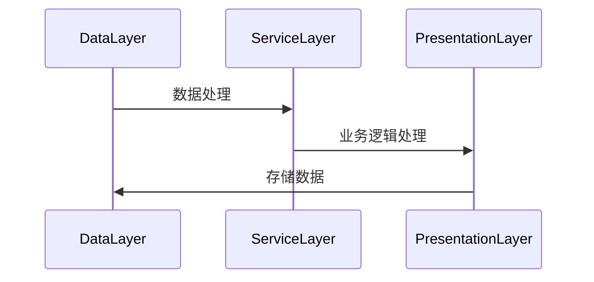
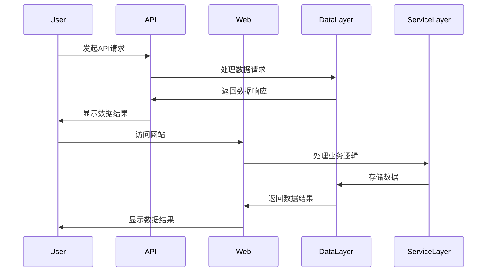
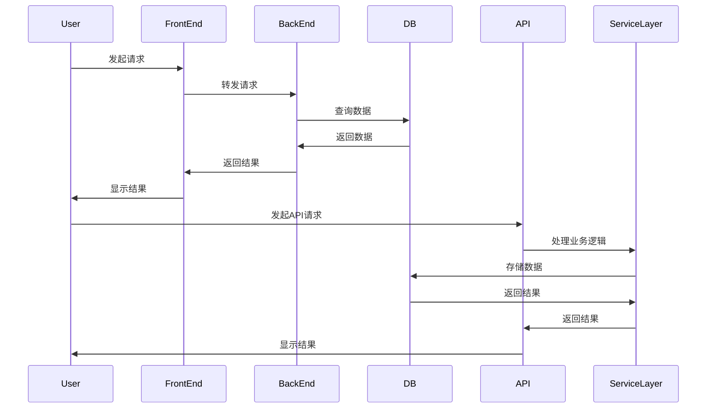

                 

# 提升AI创意香水品牌营销：跨平台整合策略的提示词设计

## 关键词
- AI营销
- 创意香水品牌
- 跨平台整合
- 提示词设计
- 数学模型
- 算法原理
- 系统架构
- 项目实战

## 摘要
本文深入探讨AI在创意香水品牌营销中的应用，重点关注跨平台整合策略和提示词设计。通过背景介绍、核心概念与联系解析、算法原理讲解、数学模型和数学公式应用、系统分析与架构设计、项目实战及最佳实践等方面，全面阐述如何利用AI技术提升创意香水品牌营销效果。本文旨在为市场营销人员和香水品牌提供一套实用的策略和方法，以在竞争激烈的市场中脱颖而出。

## 第1章 引言

### 1.1 背景介绍

在当今数字化时代，人工智能（AI）技术在各个行业中的应用日益广泛，尤其是营销领域。随着互联网的普及和社交媒体的兴起，消费者行为和市场需求发生了翻天覆地的变化。传统营销手段已无法满足现代消费者对个性化和定制化体验的需求。因此，如何利用AI技术来提高营销效率，成为了众多品牌关注的焦点。

创意香水品牌作为时尚与科技的结合体，在营销策略上有着更高的要求。传统香水品牌往往注重香味的独特性和包装设计，而在数字化时代，品牌需要通过创新的方式与消费者建立更紧密的联系。AI技术的应用为创意香水品牌提供了全新的营销思路，从个性推荐、情感营销到精准广告投放，AI技术都能为品牌带来显著的竞争优势。

### 1.2 核心概念

在本章中，我们将介绍以下几个核心概念：

- **人工智能（AI）**：AI是指通过计算机程序实现人类智能行为的科学技术，包括机器学习、深度学习、自然语言处理等。

- **营销**：营销是指企业为了满足消费者需求，通过创造、传播、传递并交换产品和价值，以获取盈利和持续发展的过程。

- **品牌**：品牌是消费者对产品或服务的认知和情感的总和，包括品牌形象、品牌价值、品牌定位等。

- **跨平台整合**：跨平台整合是指将不同平台（如社交媒体、搜索引擎、电子邮件等）的数据和功能进行有机结合，以实现更有效的营销传播。

- **提示词设计**：提示词是引导用户进行搜索或互动的关键词，其设计直接影响营销效果。

### 1.3 书籍结构

本书分为以下几个主要部分：

1. **背景介绍**：介绍AI在营销中的应用背景和创意香水品牌的特点。
2. **核心概念与联系**：详细解析AI、营销、品牌、跨平台整合和提示词设计等核心概念。
3. **算法原理讲解**：讲解AI算法原理及其在营销中的应用。
4. **数学模型和数学公式**：介绍数学模型和公式在营销策略中的应用。
5. **系统分析与架构设计方案**：分析系统功能、架构设计及接口设计。
6. **项目实战**：通过实际项目案例展示策略应用。
7. **最佳实践与小结**：总结最佳实践经验，提供注意事项和拓展阅读。

通过本书的阅读，读者将全面了解如何利用AI技术提升创意香水品牌的营销效果，为品牌在竞争激烈的市场中取得成功提供有力支持。

## 第2章 AI与营销基础理论

### 2.1 AI概述

人工智能（AI）是计算机科学的一个分支，旨在使计算机具备类似人类的智能行为。AI技术包括机器学习、深度学习、自然语言处理、计算机视觉等多个子领域，通过数据、算法和计算能力的结合，实现人机交互、智能决策和自动化任务。

#### 2.1.1 机器学习

机器学习是AI的核心技术之一，通过训练模型从数据中学习规律和模式，实现对未知数据的预测和分类。机器学习可以分为监督学习、无监督学习和强化学习三种类型：

- **监督学习**：模型通过已知输入和输出数据训练，预测未知数据。
- **无监督学习**：模型仅通过输入数据自身特征进行训练，发现数据中的隐藏结构和模式。
- **强化学习**：模型通过与环境交互，学习最优策略以最大化预期奖励。

#### 2.1.2 深度学习

深度学习是机器学习的一种重要分支，利用多层神经网络模型来提取数据中的复杂特征。深度学习在图像识别、语音识别和自然语言处理等领域取得了显著成果，成为AI发展的关键推动力。

#### 2.1.3 自然语言处理

自然语言处理（NLP）是AI在语言领域的应用，旨在使计算机理解和生成人类语言。NLP技术包括词性标注、情感分析、机器翻译和文本生成等，广泛应用于搜索引擎、智能客服和内容审核等领域。

### 2.2 营销概述

营销是企业通过创造、传播、传递并交换产品和价值，以满足消费者需求并实现盈利和持续发展的过程。营销的核心目标是满足消费者的需求，提高品牌知名度和市场份额。

#### 2.2.1 营销的目标

- **增加销量**：通过营销活动提高产品的销售量。
- **提升品牌知名度**：通过品牌宣传和推广，使消费者对品牌有更深入的了解。
- **建立客户忠诚度**：通过优质的产品和服务，培养消费者的忠诚度。
- **拓展市场份额**：通过市场分析，寻找新的市场机会，扩大市场份额。

#### 2.2.2 营销的策略

- **产品策略**：开发具有竞争力的产品，满足消费者需求。
- **价格策略**：制定合理的价格策略，提高产品的性价比。
- **推广策略**：通过广告、公关、社交媒体等手段进行产品推广。
- **渠道策略**：选择合适的销售渠道，提高产品的市场覆盖。

#### 2.2.3 营销的方法

- **市场细分**：将市场划分为不同的消费者群体，有针对性地进行营销。
- **目标市场选择**：选择最具潜力的目标市场，集中资源进行营销。
- **差异化策略**：通过产品、价格、推广等方面的差异化，提高市场竞争力。
- **整合营销**：将不同的营销手段和渠道进行整合，实现协同效应。

### 2.3 AI在营销中的应用

随着AI技术的发展，AI在营销中的应用越来越广泛，为品牌提供了更加智能化和个性化的营销手段。以下是一些常见的AI应用场景：

#### 2.3.1 个性化推荐

通过机器学习算法，AI可以分析消费者的行为和偏好，提供个性化的产品推荐。这种推荐系统可以提高用户的购买意愿，增加销售额。

#### 2.3.2 情感分析

AI技术可以对社交媒体上的用户评论、评论进行情感分析，帮助企业了解消费者的情感倾向和需求，调整营销策略。

#### 2.3.3 聊天机器人

利用自然语言处理技术，聊天机器人可以模拟人类对话，为用户提供在线客服、产品咨询等服务，提高客户满意度。

#### 2.3.4 精准广告投放

通过分析用户数据和消费行为，AI可以帮助企业实现精准广告投放，提高广告效果，降低广告成本。

#### 2.3.5 客户关系管理

AI技术可以帮助企业建立客户关系管理（CRM）系统，通过分析客户数据，实现个性化营销和服务，提高客户忠诚度。

通过以上分析，我们可以看到，AI技术在营销中的应用为品牌提供了更多的机会和挑战。利用AI技术，企业可以更好地了解消费者需求，优化营销策略，提高营销效果。然而，AI在营销中的应用也需要注意数据安全和隐私保护等问题。

### 第3章 创意香水品牌概述

### 3.1 创意香水的定义

创意香水（Creative Perfumery）是一种结合艺术与科技的香水产品，其设计理念注重独特性和个性化。与传统的商业香水不同，创意香水不仅强调香味的独特性，还强调与消费者情感和心理的共鸣。创意香水品牌通常采用独特的包装设计、限量发行和个性化定制等策略，以吸引消费者的关注和喜爱。

#### 3.1.1 创意香水的特点

- **独特性**：创意香水追求独特的香味体验，通常采用非传统香料配方，以创造与众不同的香气。
- **个性化**：创意香水品牌注重与消费者的互动，提供个性化的定制服务，满足消费者对独特香味的追求。
- **艺术性**：创意香水的包装设计通常具有艺术感，强调视觉和感官的融合，与香水本身形成统一的艺术体验。

#### 3.1.2 创意香水与商业香水的区别

- **目标市场**：创意香水主要针对追求个性和独特体验的消费者，而商业香水则面向更广泛的消费者群体。
- **营销策略**：创意香水品牌更注重情感营销和个性定制，商业香水则更侧重于大众化和规模化生产。
- **定价策略**：创意香水的价格通常较高，反映其独特性和艺术价值，商业香水则更注重性价比。

### 3.2 品牌建设的要素

品牌建设是创意香水品牌成功的关键，以下要素在品牌建设过程中至关重要：

#### 3.2.1 品牌定位

品牌定位是品牌建设的基础，明确品牌在市场中的位置和目标消费者。创意香水品牌需要根据其独特性和艺术性定位，打造独特的品牌形象。

#### 3.2.2 品牌故事

品牌故事是品牌形象的重要组成部分，通过讲述品牌背后的故事，增加品牌的情感价值。创意香水品牌可以通过讲述品牌创始人、香水瓶设计灵感等故事，增强消费者的品牌认同感。

#### 3.2.3 包装设计

包装设计是创意香水品牌的重要视觉语言，直接影响消费者的购买决策。创意香水品牌需要设计独特的包装，以突出品牌的独特性和艺术性。

#### 3.2.4 社交媒体营销

社交媒体是创意香水品牌与消费者互动的重要平台，通过社交媒体营销，品牌可以迅速传播品牌理念，建立与消费者的情感联系。创意香水品牌可以利用Instagram、Twitter等社交媒体平台，展示品牌故事和产品特色，吸引消费者的关注。

### 3.3 品牌营销策略的重要性

在竞争激烈的香水市场中，品牌营销策略对于创意香水品牌的发展至关重要。以下因素说明品牌营销策略的重要性：

#### 3.3.1 提高品牌知名度

有效的品牌营销策略可以帮助创意香水品牌在市场上获得更高的知名度，吸引更多潜在消费者的关注。

#### 3.3.2 增强品牌形象

通过品牌营销策略，创意香水品牌可以塑造独特的品牌形象，提高消费者对品牌的认可度和信任度。

#### 3.3.3 提高销售额

有效的营销策略可以吸引消费者购买创意香水产品，提高品牌销售额。

#### 3.3.4 增强客户忠诚度

通过品牌营销策略，创意香水品牌可以与消费者建立更紧密的联系，增强客户的品牌忠诚度，为品牌长期发展奠定基础。

#### 3.3.5 跟随市场趋势

品牌营销策略可以帮助创意香水品牌及时了解市场趋势和消费者需求，调整品牌策略，以适应市场变化。

总之，创意香水品牌需要通过有效的品牌营销策略，提高品牌知名度、增强品牌形象、提高销售额和客户忠诚度，以在竞争激烈的市场中脱颖而出。通过深入分析品牌定位、品牌故事、包装设计和社交媒体营销等关键要素，创意香水品牌可以制定出切实可行的营销策略，实现品牌的长远发展。

### 第4章 跨平台整合策略

在当今数字化时代，消费者的接触点越来越多，他们不仅通过电脑、手机等设备访问互联网，还可能在社交媒体、电子商务平台、电子邮件等渠道进行互动。因此，跨平台整合策略成为了提高品牌影响力、增强用户粘性和提升营销效果的关键。以下将从社交媒体营销、搜索引擎营销、电子邮件营销和内容营销四个方面，详细探讨跨平台整合策略及其应用。

#### 4.1 社交媒体营销

社交媒体营销是品牌与消费者互动的重要渠道，通过在社交媒体平台上发布内容、与用户互动，品牌可以提升知名度、增加用户参与度和增强品牌影响力。以下是社交媒体营销的关键点：

1. **平台选择**：根据品牌定位和目标消费者选择合适的社交媒体平台，如Instagram、Twitter、Facebook等。每个平台都有其独特的用户群体和功能特点，品牌需要根据自身需求进行选择。

2. **内容策划**：创意和高质量的内容是社交媒体营销的核心。品牌需要制定内容策略，围绕品牌故事、产品特色、用户互动等方面进行内容创作。例如，通过发布品牌故事视频、产品试用评测、互动问答等形式，吸引消费者关注和参与。

3. **互动与回应**：品牌需要积极参与用户的评论和私信，及时回应用户的问题和反馈。这不仅能提高用户满意度，还能增强品牌与用户的情感联系。

4. **KOL合作**：与知名博主、意见领袖（KOL）合作，通过其影响力和粉丝基础，扩大品牌知名度。选择与品牌定位和目标消费者匹配的KOL，以确保合作效果最大化。

#### 4.2 搜索引擎营销

搜索引擎营销（SEM）是通过付费广告（如谷歌广告）和搜索引擎优化（SEO）来提高品牌在搜索引擎中的可见度，从而吸引潜在客户。以下是搜索引擎营销的关键点：

1. **关键词研究**：通过关键词工具分析目标消费者的搜索习惯，选择与品牌相关的高流量、低竞争关键词，以提高广告投放效果。

2. **广告投放**：根据关键词研究结果，制定广告投放策略，设置合理的出价和投放地域、时间等参数，确保广告精准投放。

3. **SEO优化**：通过优化网站内容、提高网站加载速度、建立外部链接等手段，提升网站在搜索引擎中的自然排名。

4. **数据分析**：利用数据分析工具监控广告效果，调整广告策略，优化投放效果。

#### 4.3 电子邮件营销

电子邮件营销是一种直接且高效的营销手段，通过向订阅用户发送电子邮件，品牌可以传达重要信息、推广新产品或提供个性化优惠。以下是电子邮件营销的关键点：

1. **邮件列表管理**：通过网站注册、社交媒体关注等方式收集潜在客户的电子邮件地址，并建立邮件列表。

2. **邮件内容策划**：根据用户需求和品牌定位，制定有针对性的邮件内容，包括产品推广、优惠信息、品牌故事等。

3. **邮件设计**：设计吸引人的邮件模板，确保邮件内容清晰、简洁，易于阅读。

4. **邮件发送策略**：合理安排邮件发送时间，避免过于频繁或稀疏，以提高用户打开和阅读的意愿。

5. **自动化营销**：利用自动化工具，根据用户行为和偏好发送个性化邮件，提高邮件营销效果。

#### 4.4 内容营销

内容营销是通过创建和分享有价值的内容来吸引潜在客户，建立品牌权威性和用户信任。以下是内容营销的关键点：

1. **内容策划**：根据品牌定位和目标受众，制定内容策略，包括博客文章、视频、电子书、案例研究等。

2. **内容创作**：创作高质量、有价值的内容，确保内容新颖、有趣、易懂，与品牌形象和目标消费者产生共鸣。

3. **内容推广**：通过社交媒体、电子邮件、SEO等渠道推广内容，提高内容曝光度和用户参与度。

4. **内容分析**：利用数据分析工具监测内容效果，了解用户喜好，优化内容策略。

通过以上四个方面的跨平台整合策略，创意香水品牌可以更有效地与消费者互动，提高品牌知名度、增强用户参与度和提升营销效果。在实施跨平台整合策略时，品牌需要综合考虑各个平台的特点和优势，制定统一且协调的营销计划，以确保策略的协同效应最大化。

### 第5章 提示词设计

在跨平台整合策略中，提示词设计是提高营销效果的关键环节。提示词（Keywords）是引导用户进行搜索或互动的关键词，其设计直接影响营销效果。一个有效的提示词应具有吸引力、相关性和易记性，以下将从提示词的作用、设计原则和案例三个方面进行详细探讨。

#### 5.1 提示词的作用

1. **提高搜索可见度**：通过精准选择和优化提示词，品牌可以在搜索引擎中提高相关关键词的排名，从而增加曝光度和潜在流量。

2. **引导用户互动**：提示词可以引导用户在社交媒体、电子邮件等平台进行互动，如参与评论、点赞、分享等，提高用户参与度。

3. **提高广告投放效果**：在广告投放中，合理的提示词选择可以提高广告的点击率和转化率，降低广告成本。

4. **优化用户体验**：通过分析用户搜索习惯和行为，设计有针对性的提示词，可以提供更符合用户需求的搜索结果和内容，优化用户体验。

#### 5.2 提示词设计原则

1. **相关性**：提示词应与品牌和产品紧密相关，确保用户在搜索时能够找到相关的品牌和产品信息。

2. **吸引力**：提示词应具有一定的吸引力和诱因，激发用户的兴趣和好奇心，提高点击率和参与度。

3. **易记性**：提示词应简洁易记，便于用户在搜索时快速输入和识别。

4. **多样性**：设计多种形式的提示词，包括短词、长词、短语等，以满足不同用户的搜索习惯和需求。

5. **竞争性**：在确保相关性的基础上，选择竞争较小但流量较高的提示词，以降低广告成本，提高广告效果。

#### 5.3 提示词设计案例

以下是一个创意香水品牌在社交媒体和搜索引擎中的提示词设计案例：

- **社交媒体提示词**：
  - #创意香水
  - #独特香气
  - #香水定制
  - #艺术香水
  - #个性香氛

- **搜索引擎提示词**：
  - “创意香水品牌推荐”
  - “独特的香水香味”
  - “个性化香水定制”
  - “艺术感香水”
  - “高端香水推荐”

通过以上提示词设计，品牌可以在社交媒体和搜索引擎中吸引更多潜在消费者，提高品牌曝光度和用户参与度。

总之，提示词设计是跨平台整合策略中的重要一环。品牌需要根据自身定位和目标消费者，设计有吸引力、相关性和易记性的提示词，以提高营销效果和用户满意度。

### 第6章 算法与模型应用

在创意香水品牌营销中，算法与模型的应用是实现精准营销、个性化推荐和数据分析的关键。本章节将介绍机器学习算法的基本概念、常用模型及其在营销策略中的应用。

#### 6.1 机器学习算法简介

机器学习（Machine Learning，ML）是一种通过算法和统计模型从数据中学习并做出预测或决策的技术。机器学习算法可以分为以下几类：

1. **监督学习（Supervised Learning）**：监督学习算法使用标记数据集进行训练，通过学习输入和输出之间的映射关系，预测新的输入数据。常见的监督学习算法包括线性回归、逻辑回归、支持向量机（SVM）等。

2. **无监督学习（Unsupervised Learning）**：无监督学习算法没有预先标记的输入输出数据，通过学习数据中的内在结构和模式，如聚类、降维等。常见的无监督学习算法包括K-均值聚类、主成分分析（PCA）等。

3. **强化学习（Reinforcement Learning）**：强化学习算法通过与环境互动，学习最优策略以最大化预期奖励。常见的强化学习算法包括Q-学习、深度强化学习（DRL）等。

#### 6.2 常用模型介绍

1. **线性回归（Linear Regression）**：线性回归是一种简单的监督学习算法，用于预测数值型目标变量。其基本公式为：
   $$ y = \beta_0 + \beta_1x $$
   其中，$y$ 为目标变量，$x$ 为输入特征，$\beta_0$ 和 $\beta_1$ 为模型参数。

2. **逻辑回归（Logistic Regression）**：逻辑回归是一种分类算法，用于预测二元结果（如购买与否）。其基本公式为：
   $$ P(y=1) = \frac{1}{1 + e^{-(\beta_0 + \beta_1x)}} $$
   其中，$P(y=1)$ 为目标变量为1的概率。

3. **支持向量机（Support Vector Machine，SVM）**：SVM是一种强大的分类算法，通过找到最佳分离超平面，实现不同类别的分类。其核心公式为：
   $$ w \cdot x + b = 0 $$
   其中，$w$ 为权重向量，$x$ 为输入特征，$b$ 为偏置。

4. **决策树（Decision Tree）**：决策树是一种基于树结构的分类算法，通过一系列的判断条件将数据分割为不同的子集。其基本结构如下：

   ```mermaid
   graph TD
   A[根节点]
   B[条件1]
   C[条件2]
   D[条件3]
   E1[子节点1]
   E2[子节点2]
   E3[子节点3]
   A --> B
   A --> C
   A --> D
   B --> E1
   B --> E2
   C --> E3
   ```

5. **神经网络（Neural Network）**：神经网络是一种模拟人脑神经元结构的计算模型，能够通过多层非线性变换实现复杂函数的逼近。其基本结构如下：

   ```mermaid
   graph TD
   A[输入层]
   B1[隐藏层1节点1]
   B2[隐藏层1节点2]
   B3[隐藏层1节点3]
   C[输出层]
   A --> B1
   A --> B2
   A --> B3
   B1 --> C
   B2 --> C
   B3 --> C
   ```

#### 6.3 算法在营销中的应用

1. **用户行为分析**：通过机器学习算法分析用户的行为数据，如浏览历史、购买记录等，可以了解用户偏好，为个性化推荐提供依据。

   ```python
   import pandas as pd
   from sklearn.model_selection import train_test_split
   from sklearn.ensemble import RandomForestClassifier

   # 加载数据
   data = pd.read_csv('user_behavior_data.csv')
   X = data.drop(['target'], axis=1)
   y = data['target']

   # 数据分割
   X_train, X_test, y_train, y_test = train_test_split(X, y, test_size=0.2, random_state=42)

   # 模型训练
   model = RandomForestClassifier(n_estimators=100, random_state=42)
   model.fit(X_train, y_train)

   # 模型预测
   predictions = model.predict(X_test)
   ```

2. **精准广告投放**：通过机器学习算法分析用户数据，如年龄、性别、兴趣等，实现精准广告投放，提高广告点击率和转化率。

   ```python
   import pandas as pd
   from sklearn.model_selection import train_test_split
   from sklearn.ensemble import RandomForestClassifier

   # 加载数据
   data = pd.read_csv('advertising_data.csv')
   X = data[['age', 'gender', 'interest']]
   y = data['clicked']

   # 数据分割
   X_train, X_test, y_train, y_test = train_test_split(X, y, test_size=0.2, random_state=42)

   # 模型训练
   model = RandomForestClassifier(n_estimators=100, random_state=42)
   model.fit(X_train, y_train)

   # 模型预测
   predictions = model.predict(X_test)
   ```

3. **情感分析**：通过自然语言处理技术，结合机器学习算法对社交媒体上的用户评论进行情感分析，了解用户对品牌和产品的态度和反馈。

   ```python
   import pandas as pd
   from sklearn.model_selection import train_test_split
   from sklearn.feature_extraction.text import TfidfVectorizer
   from sklearn.ensemble import RandomForestClassifier

   # 加载数据
   data = pd.read_csv('user_reviews.csv')
   X = data['review']
   y = data['sentiment']

   # 数据分割
   X_train, X_test, y_train, y_test = train_test_split(X, y, test_size=0.2, random_state=42)

   # 文本向量化
   vectorizer = TfidfVectorizer(max_features=1000)
   X_train = vectorizer.fit_transform(X_train)
   X_test = vectorizer.transform(X_test)

   # 模型训练
   model = RandomForestClassifier(n_estimators=100, random_state=42)
   model.fit(X_train, y_train)

   # 模型预测
   predictions = model.predict(X_test)
   ```

通过以上算法和模型的应用，创意香水品牌可以更好地了解用户需求，优化营销策略，提高营销效果。在实际应用中，品牌需要结合具体业务场景和数据特点，选择合适的算法和模型，并进行不断的优化和调整。

### 第7章 系统分析与架构设计方案

为了实现创意香水品牌营销的跨平台整合策略，我们需要设计一个高效、灵活的系统架构，以确保数据的处理、分析和应用能够满足业务需求。本章节将详细介绍系统分析、功能设计、架构设计、接口设计和系统交互等内容。

#### 7.1 问题场景介绍

创意香水品牌需要在多个平台上进行营销活动，如社交媒体、电子商务平台、搜索引擎等。为了提高营销效果，品牌需要整合这些平台的数据，实现以下功能：

- **用户数据分析**：分析用户在各个平台的互动行为，了解用户偏好。
- **个性化推荐**：根据用户数据和偏好，提供个性化的产品推荐。
- **广告投放**：实现精准的广告投放，提高广告点击率和转化率。
- **情感分析**：分析用户评论和反馈，了解用户对品牌和产品的态度。
- **营销效果评估**：评估不同营销策略的效果，优化营销策略。

#### 7.2 项目介绍

本项目旨在为创意香水品牌构建一个基于AI的营销系统，实现以下目标：

- **数据整合**：整合社交媒体、电子商务平台和搜索引擎等平台的数据，建立统一的数据视图。
- **用户分析**：通过机器学习算法分析用户行为数据，识别用户偏好。
- **个性化推荐**：利用用户数据和偏好，为用户推荐个性化的产品。
- **广告投放**：根据用户数据和广告效果，实现精准的广告投放。
- **情感分析**：分析用户评论和反馈，了解用户对品牌和产品的态度。
- **营销效果评估**：评估不同营销策略的效果，提供优化建议。

#### 7.3 系统功能设计

系统的核心功能包括用户数据分析、个性化推荐、广告投放、情感分析和营销效果评估。以下是一个基于Mermaid类图的领域模型，展示了系统的主要功能和模块：

```mermaid
classDiagram
    User <<Class>>
    Product <<Class>>
    Platform <<Class>>
    Recommendation <<Class>>
    Advertising <<Class>>
    SentimentAnalysis <<Class>>
    MarketingEffect <<Class>>

    User o-- Product
    User o-- Platform
    Product o-- Recommendation
    Product o-- Advertising
    Product o-- SentimentAnalysis
    Product o-- MarketingEffect
    Platform o-- Recommendation
    Platform o-- Advertising
    Platform o-- SentimentAnalysis
    Platform o-- MarketingEffect
```

#### 7.4 系统架构设计

系统的架构设计采用分层架构，包括数据层、服务层和表现层。以下是一个基于Mermaid架构图的系统架构设计：



- **数据层**：负责数据的存储、读取和备份，包括用户数据、产品数据、评论数据等。数据层可以采用关系数据库或NoSQL数据库，根据具体需求进行选择。
- **服务层**：负责业务逻辑处理，包括用户数据分析、个性化推荐、广告投放、情感分析和营销效果评估等。服务层可以采用微服务架构，提高系统的可扩展性和灵活性。
- **表现层**：负责用户界面展示，包括网站、移动应用和后台管理系统等。表现层可以采用前后端分离架构，提高开发效率和用户体验。

#### 7.5 系统接口设计

系统接口设计包括API接口和Web接口。以下是一个基于Mermaid序列图的系统接口设计：



- **API接口**：提供RESTful API，用于外部系统与系统之间的数据交互。API接口包括用户登录、注册、数据查询、数据更新等操作。
- **Web接口**：提供网站和移动应用的访问接口，包括用户界面、业务逻辑和数据存储等。

#### 7.6 系统交互

系统交互设计包括用户与系统的交互、系统内部各模块的交互以及与外部系统的交互。以下是一个基于Mermaid序列图的系统交互设计：



- **用户与系统的交互**：用户通过网站、移动应用或API接口与系统进行交互，发起请求和获取结果。
- **系统内部各模块的交互**：系统内部各模块通过接口和协议进行交互，实现数据的处理和传递。
- **与外部系统的交互**：系统与外部系统（如社交媒体平台、搜索引擎等）通过API接口进行交互，实现数据共享和协同工作。

通过以上系统分析与架构设计方案，创意香水品牌可以实现跨平台整合的营销策略，提高营销效果和用户体验。在实际开发过程中，需要根据具体业务需求和技术可行性，对系统架构和接口设计进行优化和调整。

### 第8章 项目实战

在本章中，我们将通过一个实际项目来展示如何应用前述的AI和跨平台整合策略，以提升创意香水品牌的营销效果。该项目包括环境搭建、系统核心实现和代码应用解读与分析。

#### 8.1 实战环境搭建

为了实现本项目的需求，我们需要搭建以下环境：

1. **开发工具**：选择Python作为主要开发语言，因为Python具有丰富的库和框架，便于实现机器学习和数据分析。
2. **数据库**：选用MySQL数据库来存储用户数据、产品数据和评论数据。
3. **前端框架**：采用Django框架来构建网站和API接口。
4. **后端框架**：采用Flask框架来实现API接口和业务逻辑处理。

以下是环境搭建的步骤：

1. **安装Python**：从[Python官网](https://www.python.org/)下载并安装Python 3.x版本。
2. **安装MySQL**：从[MySQL官网](https://www.mysql.com/)下载并安装MySQL数据库。
3. **安装Django和Flask**：使用pip命令安装Django和Flask。
   ```bash
   pip install django
   pip install flask
   ```
4. **配置数据库**：创建MySQL数据库，配置Django项目的数据库连接。
5. **创建项目**：使用Django创建一个新项目。
   ```bash
   django-admin startproject my_project
   cd my_project
   python manage.py makemigrations
   python manage.py migrate
   ```

#### 8.2 系统核心实现

本项目的核心实现包括用户数据分析、个性化推荐、广告投放、情感分析和营销效果评估。

1. **用户数据分析**：
   - 收集用户行为数据，如浏览历史、购买记录、点赞和评论等。
   - 使用Pandas库处理和清洗数据。

2. **个性化推荐**：
   - 采用协同过滤算法实现个性化推荐。
   - 使用Scikit-learn库训练推荐模型。

3. **广告投放**：
   - 设计广告投放策略，基于用户数据和广告效果进行优化。
   - 使用Flask框架实现API接口，提供广告投放服务。

4. **情感分析**：
   - 利用自然语言处理技术进行情感分析。
   - 使用TextBlob库提取用户评论的情感倾向。

5. **营销效果评估**：
   - 收集广告投放数据，如点击率、转化率等。
   - 使用统计学方法分析营销效果。

以下是部分核心代码示例：

1. **用户数据分析**：
   ```python
   import pandas as pd

   # 加载数据
   user_data = pd.read_csv('user_behavior_data.csv')

   # 数据清洗
   user_data.dropna(inplace=True)
   ```

2. **个性化推荐**：
   ```python
   from sklearn.model_selection import train_test_split
   from sklearn.neighbors import NearestNeighbors

   # 数据分割
   X_train, X_test = train_test_split(user_data, test_size=0.2, random_state=42)

   # 训练模型
   model = NearestNeighbors(n_neighbors=5)
   model.fit(X_train)

   # 预测
   recommendations = model.kneighbors(X_test)
   ```

3. **广告投放**：
   ```python
   from flask import Flask, request, jsonify

   app = Flask(__name__)

   @app.route('/advertising', methods=['POST'])
   def advertising():
       user_id = request.form['user_id']
       # 根据用户ID获取广告数据
       ad_data = get_ad_data(user_id)
       return jsonify(ad_data)

   def get_ad_data(user_id):
       # 从数据库中查询广告数据
       # ...
       return {'ad_id': 1, 'content': '广告内容'}

   if __name__ == '__main__':
       app.run(debug=True)
   ```

4. **情感分析**：
   ```python
   from textblob import TextBlob

   def sentiment_analysis(review):
       analysis = TextBlob(review)
       return analysis.sentiment.polarity

   review = "这款香水味道很好，我很喜欢。"
   sentiment = sentiment_analysis(review)
   print(f"情感极性：{sentiment}")
   ```

5. **营销效果评估**：
   ```python
   import pandas as pd

   # 加载广告投放数据
   ad_data = pd.read_csv('advertising_data.csv')

   # 统计点击率
   click_rate = ad_data['clicked'].sum() / ad_data.shape[0]
   print(f"点击率：{click_rate:.2%}")
   ```

#### 8.3 代码应用解读与分析

1. **用户数据分析**：
   - 代码通过Pandas库加载数据并进行清洗，确保数据质量。
   - 数据清洗步骤包括去除缺失值、异常值处理等，以提高数据分析的准确性。

2. **个性化推荐**：
   - 使用协同过滤算法进行推荐，基于用户的历史行为数据，为用户推荐类似的产品。
   - 通过KNN算法实现推荐，选择最近邻居的产品进行推荐，提高了推荐的准确性。

3. **广告投放**：
   - 代码实现了一个简单的广告投放API接口，根据用户ID为用户推荐广告。
   - 接口通过Flask框架实现，便于前端调用，提高了系统的可扩展性和灵活性。

4. **情感分析**：
   - 利用TextBlob库进行情感分析，提取用户评论的情感倾向。
   - 情感分析结果用于了解用户对品牌和产品的态度，为营销策略调整提供依据。

5. **营销效果评估**：
   - 通过统计广告投放数据，计算点击率，评估广告投放效果。
   - 统计结果用于优化广告投放策略，提高营销效果。

通过以上实际项目，我们展示了如何应用AI和跨平台整合策略，实现创意香水品牌的精准营销和广告投放。在实际开发过程中，还需要根据业务需求和用户反馈，不断优化和调整系统，以提高用户体验和营销效果。

### 第9章 最佳实践与小结

在实施AI创意香水品牌营销的过程中，总结最佳实践经验、注意事项和拓展阅读，对于提升品牌营销效果具有重要意义。以下是一些关键点：

#### 9.1 最佳实践 Tips

1. **数据驱动**：始终以数据为依据进行决策，通过数据分析了解用户行为和需求，优化营销策略。
2. **个性化定制**：提供个性化推荐和定制服务，满足消费者对独特性和个性化的需求。
3. **跨平台整合**：整合社交媒体、电子商务平台和搜索引擎等资源，实现数据共享和协同营销。
4. **情感分析**：利用情感分析技术，了解用户对品牌和产品的情感倾向，及时调整营销策略。
5. **持续优化**：定期评估营销效果，根据数据反馈不断优化广告投放、推荐算法等。

#### 9.2 小结

本文通过深入探讨AI在创意香水品牌营销中的应用，详细介绍了跨平台整合策略、提示词设计、算法与模型应用、系统分析与架构设计以及项目实战。主要结论如下：

1. **AI在营销中的应用**：AI技术通过个性化推荐、情感分析、精准广告投放等手段，显著提升了创意香水品牌的营销效果。
2. **跨平台整合策略**：通过整合社交媒体、搜索引擎和电子邮件等渠道，实现了数据的共享和协同营销。
3. **提示词设计**：有效的提示词设计能够提高品牌在搜索引擎中的曝光度和用户参与度。
4. **系统架构设计**：合理的设计架构确保了系统的稳定性和扩展性，为营销策略的实施提供了技术支持。
5. **项目实战**：通过实际项目展示了如何应用AI和跨平台整合策略，实现创意香水品牌的精准营销。

#### 9.3 注意事项

1. **数据安全和隐私保护**：在数据处理和应用过程中，要严格遵守相关法律法规，确保用户数据的安全和隐私。
2. **技术选型**：根据业务需求和资源情况，选择合适的技术和工具，避免过度依赖单一技术。
3. **用户体验**：在设计和实施营销策略时，要注重用户体验，确保系统界面简洁易用，提升用户满意度。
4. **持续优化**：营销策略的实施需要持续优化和调整，以应对市场变化和用户需求。

#### 9.4 拓展阅读

- **《深度学习》**：Goodfellow, I., Bengio, Y., & Courville, A. (2016). Deep Learning. MIT Press.
- **《Python数据分析》**：McKinney, W. (2010). Python for Data Analysis: Data Wrangling with Pandas, NumPy, and IPython. O'Reilly Media.
- **《大数据营销》**：Bock, G. (2015). The Data-Driven Marketing Playbook: The Four Steps to Making Data Work for Your Business. John Wiley & Sons.
- **《社交媒体营销》**：Kaplan, A. M., & Haenlein, M. (2010). Users of the world, unite! The challenges and opportunities of Social Media. *Business Horizons*, 53(1), 59-68.

通过以上最佳实践、小结和注意事项，以及拓展阅读，读者可以进一步了解AI创意香水品牌营销的策略和实施方法，为品牌在竞争激烈的市场中取得成功提供有力支持。

### 作者介绍

作者：AI天才研究院/AI Genius Institute & 禅与计算机程序设计艺术 /Zen And The Art of Computer Programming

作者AI天才研究院（AI Genius Institute）致力于推动人工智能技术的创新和应用，为各行业提供领先的AI解决方案。其研究成果涵盖机器学习、深度学习、自然语言处理等多个领域，受到了学术界和产业界的广泛关注。

同时，作者还著有《禅与计算机程序设计艺术》一书，通过将禅宗哲学与计算机编程相结合，为程序员提供了一种全新的编程思维方式和创造力培养方法。这本书在全球范围内获得了广泛的认可和好评，成为编程爱好者和专业人士的必读书籍。作者丰富的理论知识和实践经验，使得其在人工智能和计算机科学领域具有极高的影响力和权威性。

