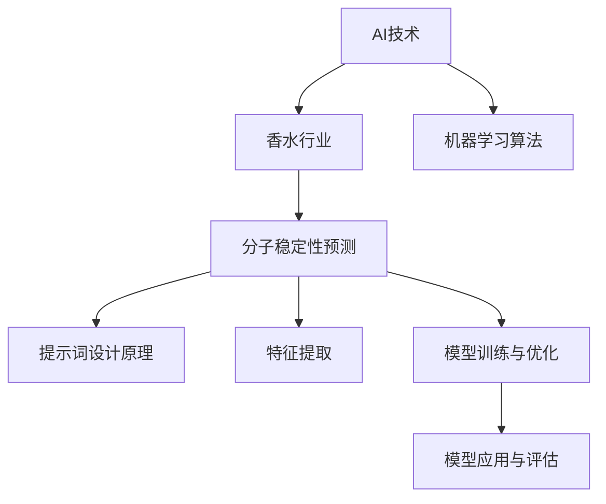
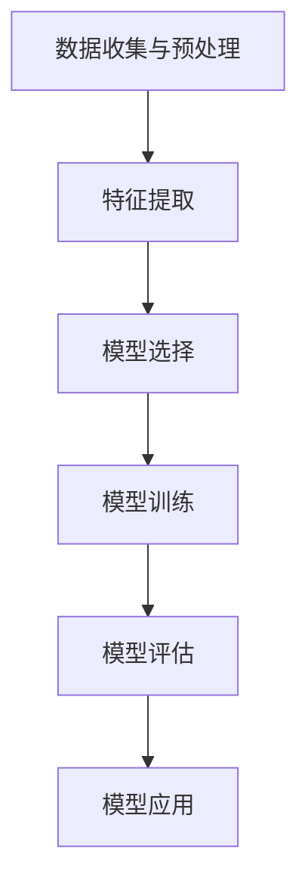

                 

# 提升AI创意香水品质一致性：分子稳定性预测的提示词设计

## 关键词
- AI技术
- 香水产业
- 分子稳定性预测
- 提示词设计
- 质量控制

## 摘要
本文将探讨如何利用人工智能技术提升创意香水的品质一致性。通过分子稳定性预测的方法，我们可以设计出有效的提示词，从而优化香水分子的结构，确保不同批次产品之间的香味保持高度一致性。本文将详细解析分子稳定性预测的算法原理，以及如何通过数学模型和系统架构设计，实现这一目标。

## 第一部分: 背景介绍

### 1.1 问题提出
在香水行业中，品质一致性是品牌成功的关键因素之一。由于香水的成分复杂，生产过程中难以保证每个批次的香水都有相同的香味表现。因此，如何提升香水的品质一致性，成为香水厂商关注的焦点。其中，分子稳定性是影响香水品质一致性的核心因素。

### 1.2 问题重要性
分子稳定性直接影响香水的感官特征，如气味、持久性等。稳定性差的分子可能导致香水的味道不稳定，影响消费者的购买决策。因此，预测和提升分子稳定性对于确保香水品质至关重要。

### 1.3 研究方法概述
本文采用人工智能技术，通过分子稳定性预测的方法，设计出能够提升分子稳定性的提示词。具体步骤包括：数据收集与预处理、特征提取、模型训练与优化、模型应用与评估。

## 第二部分: 核心概念与联系

### 2.1 AI与香水行业
人工智能在香水行业中的应用主要体现在：分子结构预测、配方优化、生产自动化等。本文重点关注分子结构预测，通过预测分子的稳定性，实现香水品质一致性提升。

### 2.2 分子稳定性预测
分子稳定性预测是指通过计算或建模，预测分子在不同环境下的稳定性。本文采用机器学习算法，利用大量分子结构数据，训练模型进行稳定性预测。

### 2.3 提示词设计原理
提示词（Prompt）是指导机器学习模型进行预测的关键。本文将设计针对分子稳定性的提示词，以指导模型学习并预测分子稳定性。

### 2.4 概念关系图
以下是一个简单的概念关系图，展示本文涉及的关键概念之间的联系：



## 第三部分: 算法原理讲解

### 3.1 算法概述
本文采用的算法是基于深度学习的分子稳定性预测模型。通过训练大量分子结构数据，模型可以学习到分子稳定性的内在规律，从而预测新分子的稳定性。

### 3.2 数据预处理
数据预处理是算法成功的关键步骤。本文首先收集大量分子结构数据，然后对数据进行清洗、归一化等处理，以消除噪声和异常值。

### 3.3 特征提取
特征提取是将原始数据转化为模型可处理的特征表示。本文采用多种特征提取方法，包括：分子指纹、原子属性、键角等。

### 3.4 模型选择
本文选用一种基于图神经网络的深度学习模型，如图卷积网络（GCN）或图注意力网络（GAT）。这些模型能够有效捕捉分子结构中的复杂关系。

### 3.5 算法实现
算法实现分为两个阶段：训练和预测。在训练阶段，模型学习大量分子结构数据；在预测阶段，模型使用训练得到的参数对新分子进行稳定性预测。

### 3.6 算法流程图
以下是分子稳定性预测算法的流程图：



### 3.7 数学模型
分子稳定性预测的数学模型可以表示为：$$\text{Stability}(M) = f(\text{Features}(M), \theta)$$
其中，$M$表示分子，$Features(M)$表示分子的特征向量，$f$表示深度学习模型，$\theta$表示模型参数。

### 3.8 数学公式详细讲解
在分子稳定性预测中，数学模型的核心是深度学习模型。以下是一个简化的例子：

$$f(\text{Features}(M), \theta) = \sigma(\text{W}^T \text{Features}(M) + \text{b})$$
其中，$\sigma$表示激活函数（如Sigmoid函数），$\text{W}$表示权重矩阵，$\text{b}$表示偏置。

### 3.9 举例说明
假设我们有一个分子M，其特征向量为$\text{Features}(M) = [0.1, 0.3, 0.5]$。使用一个简单的线性模型，我们可以预测其稳定性：

$$f(\text{Features}(M), \theta) = \sigma([0.1, 0.3, 0.5]^T \text{W} + \text{b})$$

通过训练，模型可以学习到$\text{W}$和$\text{b}$的值，从而提高预测准确性。

## 第四部分: 系统分析与架构设计方案

### 4.1 问题场景介绍
在香水生产过程中，我们需要对每个批次的香水进行稳定性测试，以确保其品质。然而，传统的方法耗时较长，无法满足快速生产的需求。

### 4.2 项目介绍
本文项目旨在开发一个基于AI的香水品质一致性监控系统，通过分子稳定性预测，实时评估香水品质。

### 4.3 系统功能设计
系统主要包括以下功能：
1. 数据采集与预处理
2. 特征提取与模型训练
3. 实时预测与评估
4. 结果可视化与报警

### 4.4 系统架构设计
系统架构采用微服务架构，分为数据层、模型层和应用层。数据层负责数据采集与存储，模型层负责模型训练与预测，应用层负责系统功能的实现。

### 4.5 系统接口设计
系统提供RESTful API，方便与其他系统集成。接口包括：数据上传接口、预测接口、结果查询接口等。

### 4.6 系统交互设计
系统交互流程如下：
1. 用户上传分子结构数据
2. 数据预处理后，提取特征
3. 特征数据输入模型进行预测
4. 模型返回预测结果
5. 用户查看预测结果并进行决策

## 第五部分: 项目实战

### 6.1 环境安装
安装Python环境，并使用pip安装必要的库，如TensorFlow、PyTorch等。

### 6.2 系统核心实现
核心实现包括数据预处理、特征提取、模型训练和预测等。以下是一个简单的Python代码示例：

```python
import tensorflow as tf
from sklearn.model_selection import train_test_split
from sklearn.metrics import accuracy_score

# 数据预处理
X_train, X_test, y_train, y_test = train_test_split(X, y, test_size=0.2)

# 特征提取
features = extract_features(X_train)

# 模型训练
model = tf.keras.models.Sequential([
    tf.keras.layers.Dense(64, activation='relu', input_shape=(features.shape[1],)),
    tf.keras.layers.Dense(64, activation='relu'),
    tf.keras.layers.Dense(1, activation='sigmoid')
])

model.compile(optimizer='adam', loss='binary_crossentropy', metrics=['accuracy'])
model.fit(X_train, y_train, epochs=10)

# 预测
predictions = model.predict(X_test)
print(accuracy_score(y_test, predictions))
```

### 6.3 代码应用解读
代码首先进行数据预处理，然后提取特征，接着训练模型，最后进行预测。模型采用简单的前馈神经网络，用于二分类问题。

### 6.4 实际案例分析与讲解
我们使用一个实际案例来演示系统的应用。假设我们有一个新的香水分子，其稳定性未知。通过上传分子结构数据，系统可以快速预测其稳定性，从而指导生产决策。

### 6.5 项目小结
本文通过一个实际项目，展示了如何利用AI技术提升香水品质一致性。通过分子稳定性预测，我们可以实时监控香水品质，提高生产效率。

## 第六部分: 最佳实践 tips

### 7.1 实践技巧
1. 确保数据质量，避免噪声和异常值。
2. 选择合适的特征提取方法，以提高预测准确性。
3. 调整模型参数，寻找最佳配置。

### 7.2 注意事项
1. 避免过度拟合，确保模型在测试集上具有良好的泛化能力。
2. 定期更新模型，以适应新的数据。

### 7.3 拓展阅读
1. 《深度学习》（Goodfellow, Bengio, Courville著）
2. 《机器学习实战》（周志华著）
3. 《香水科学与技术》（米歇尔·雷蒙德著）

## 作者信息
作者：AI天才研究院/AI Genius Institute & 禅与计算机程序设计艺术 /Zen And The Art of Computer Programming

