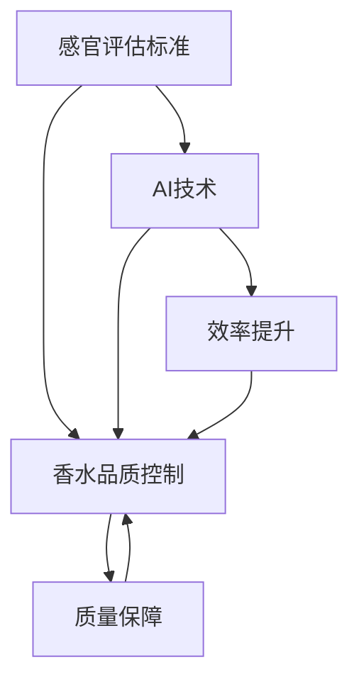

                 

# 提升AI创意香水品质控制：感官评估标准的提示词设计

> 关键词：AI、创意香水、品质控制、感官评估标准、提示词设计

> 摘要：
本文旨在探讨如何利用人工智能技术提升创意香水的品质控制，特别是感官评估标准的提示词设计。通过深入分析感官评估标准、AI技术及其在香水品质控制中的应用，本文提出了一个基于AI的感官评估标准体系，详细介绍了其概念、特点、应用场景以及设计方法，为香水行业提供了新的技术思路。

---

### 第一部分：背景介绍

#### 1.1.1 问题背景

随着人工智能技术的快速发展，AI在各个行业中的应用越来越广泛。特别是在消费品领域，AI技术已经逐渐成为提升产品质量和用户体验的关键因素。在香水行业，AI技术被用于提升香水品质控制，特别是在创意香水的感官评估标准方面。

创意香水是一种具有独特创意和个性化的香水，它不仅要求香味独特，还要求能够引起消费者的情感共鸣。然而，传统的感官评估方法主要依赖于人类评价员的主观判断，存在较大的主观差异和不确定性。此外，随着香水产品的多样化，传统的评估方法无法全面、准确地反映消费者的感官体验。在快速生产和新品推出的背景下，传统的评估方法效率低下，无法满足市场需求。

#### 1.1.2 问题描述

当前，在创意香水的感官评估标准方面，主要存在以下问题：

1. **主观性**：传统的感官评估方法依赖于人类评价员的主观判断，导致评估结果的准确性和一致性受到影响。
2. **准确性**：传统的评估方法无法准确捕捉和描述消费者的感官体验，导致评估结果的偏差。
3. **效率**：随着香水产品的多样化，传统的评估方法效率低下，无法满足快速生产和新品推出的需求。

#### 1.1.3 问题解决

为了解决上述问题，需要设计一套基于AI的感官评估标准。这套标准能够：

1. **准确捕捉感官体验**：利用AI技术，通过对大量消费者数据进行学习，能够准确捕捉和描述消费者的感官体验。
2. **提高评估效率**：通过自动化评估，提高评估的效率，满足快速生产和新品推出的需求。
3. **适应产品多样化**：通过AI技术，能够适应不同类型和风格的香水产品，提供个性化的感官评估标准。

#### 1.1.4 边界与外延

- **边界**：主要针对创意香水品质控制的感官评估标准进行设计，不包括其他类型香水的评估。
- **外延**：不仅涵盖传统的香气属性评估，还涉及消费者情感体验的评估。

#### 1.1.5 概念结构与核心要素组成

- **概念结构**：感官评估标准、AI技术、香水品质控制
- **核心要素组成**：

  - **感官评估标准**：包括香气属性评估和消费者情感体验评估。
  - **AI技术**：用于构建评估模型，包括数据采集、数据处理、模型训练和评估。
  - **香水品质控制**：通过感官评估标准来评估香水产品的品质。

---

### 第二部分：核心概念与联系

#### 2.1 感官评估标准的定义与特点

### 2.1.1 感官评估标准的定义

感官评估标准是一套用于衡量和评估产品感官特性的规则和方法。它通常包括香气、口感、外观、声音等多个感官维度。

### 2.1.2 感官评估标准的特点

1. **主观性**：感官评估标准依赖于人类评价员的主观判断，因此评估结果可能存在一定的差异。
2. **准确性**：评估标准的准确性受到评价员经验和技能的影响。
3. **一致性**：评估标准的一致性受到评价员之间差异的影响。

#### 2.2 AI技术的定义与特点

### 2.2.1 AI技术的定义

AI技术，即人工智能技术，是计算机科学的一个分支，旨在使机器能够模拟、延伸和扩展人类的智能行为。

### 2.2.2 AI技术的特点

1. **自主学习能力**：AI技术能够通过数据和算法自动优化和改进。
2. **高效处理能力**：AI技术能够在短时间内处理大量数据。
3. **适应性**：AI技术能够适应不同环境和任务需求。

#### 2.3 香水品质控制的定义与特点

### 2.3.1 香水品质控制的定义

香水质量控制是指确保香水产品满足既定标准和消费者需求的过程。

### 2.3.2 香水品质控制的特点

1. **严格性**：香水质量控制需要严格控制生产过程中的各个环节。
2. **多样性**：不同类型和风格的香水需要不同的质量控制标准。
3. **消费者导向**：香水质量控制的目标是满足消费者的需求。

#### 2.4 核心概念之间的联系

### 2.4.1 感官评估标准与AI技术

- **联系**：AI技术可以用于构建和优化感官评估标准。
- **相互作用**：感官评估标准的数据输入到AI模型中，AI模型根据数据进行训练和预测，从而提高评估的准确性和效率。

### 2.4.2 感官评估标准与香水品质控制

- **联系**：感官评估标准是香水品质控制的重要组成部分。
- **相互作用**：通过感官评估标准来评估香水产品的品质，从而确保产品的质量符合标准。

---

### 第三部分：AI大模型在感官评估中的应用

#### 3.1 大模型的定义与特点

### 3.1.1 大模型的定义

大模型通常指的是参数量超过数十亿甚至千亿级别的神经网络模型。这类模型具有极高的精度和泛化能力，能够捕捉到数据中的复杂模式和关联性。

### 3.1.2 大模型的特点

1. **高精度**：大模型能够捕捉到数据中的复杂模式和关联性，提供更准确的评估结果。
2. **泛化能力**：大模型能够在不同的数据集和场景中保持良好的性能，具有良好的泛化能力。

#### 3.2 大模型在感官评估中的应用

### 3.2.1 数据预处理

在感官评估中，数据预处理是关键步骤。大模型能够利用其强大的学习能力，对数据进行清洗、归一化、特征提取等预处理操作，从而提高评估的准确性和效率。

### 3.2.2 模型训练

在数据预处理完成后，大模型会利用预处理后的数据对模型进行训练。通过学习数据中的香气属性和消费者情感模式，大模型能够构建出准确的评估模型。

### 3.2.3 预测与评估

在模型训练完成后，大模型会对新的香水样本进行预测和评估。通过对香水样本的香气属性和消费者情感进行预测，大模型能够提供准确的感官评估结果。

#### 3.3 大模型的优点与挑战

### 3.3.1 大模型的优点

1. **高精度**：大模型能够提供更准确和精细的评估结果。
2. **高效性**：大模型能够在短时间内处理大量的评估数据。

### 3.3.2 大模型的挑战

1. **计算资源需求**：大模型需要大量的计算资源和存储空间。
2. **数据需求**：大模型需要大量的高质量数据来进行训练。

---

### 第四部分：基于AI的感官评估标准体系设计

#### 4.1 感官评估标准体系设计原则

在设计基于AI的感官评估标准体系时，需要遵循以下原则：

1. **准确性**：评估标准应能够准确捕捉和描述消费者的感官体验。
2. **效率**：评估标准应能够高效地处理大量的评估数据。
3. **适应性**：评估标准应能够适应不同类型和风格的香水产品。
4. **易用性**：评估标准应易于操作和使用，方便不同背景的评价员使用。

#### 4.2 感官评估标准体系设计方法

### 4.2.1 数据采集

数据采集是感官评估标准体系设计的首要步骤。数据采集应包括香气属性数据、消费者情感数据和产品信息数据。通过多渠道采集数据，可以确保数据的全面性和准确性。

### 4.2.2 数据处理

在数据采集完成后，需要对数据进行处理。数据处理包括数据清洗、数据归一化和特征提取等步骤。通过这些处理，可以提高数据的质量，为后续的模型训练提供高质量的输入数据。

### 4.2.3 模型训练

在数据处理完成后，需要对模型进行训练。模型训练包括模型选择、参数调整和训练过程。通过模型训练，可以构建出能够准确预测和评估香水感官属性的AI模型。

### 4.2.4 模型评估

在模型训练完成后，需要对模型进行评估。模型评估包括评估指标的设定、评估过程和评估结果的分析。通过模型评估，可以确定模型的性能和效果。

### 4.2.5 模型应用

在模型评估通过后，可以将模型应用于实际的感官评估中。通过模型应用，可以实现对香水感官属性的自动评估，提高评估的效率和准确性。

---

### 第五部分：案例分析与实战应用

#### 5.1 案例背景

某知名香水品牌希望通过AI技术提升其创意香水的品质控制，特别是感官评估标准的准确性。该品牌希望通过基于AI的感官评估标准体系，实现对香水香气属性和消费者情感的高效评估。

#### 5.2 实战应用

### 5.2.1 环境安装

首先，需要搭建一个适合AI模型训练和应用的计算环境。计算环境应包括高性能的CPU或GPU，以及相应的软件和库，如TensorFlow、PyTorch等。

### 5.2.2 数据采集

接下来，需要采集香气属性数据、消费者情感数据和产品信息数据。这些数据可以通过实验、问卷调查和用户反馈等方式获取。

### 5.2.3 数据处理

在数据采集完成后，需要对数据进行处理。数据处理包括数据清洗、数据归一化和特征提取等步骤。通过这些处理，可以提高数据的质量，为后续的模型训练提供高质量的输入数据。

### 5.2.4 模型训练

在数据处理完成后，需要对模型进行训练。模型训练包括模型选择、参数调整和训练过程。通过模型训练，可以构建出能够准确预测和评估香水感官属性的AI模型。

### 5.2.5 模型评估

在模型训练完成后，需要对模型进行评估。模型评估包括评估指标的设定、评估过程和评估结果的分析。通过模型评估，可以确定模型的性能和效果。

### 5.2.6 模型应用

在模型评估通过后，可以将模型应用于实际的感官评估中。通过模型应用，可以实现对香水感官属性的自动评估，提高评估的效率和准确性。

---

### 第六部分：最佳实践与小结

#### 6.1 最佳实践

在设计基于AI的感官评估标准时，应遵循以下最佳实践：

1. **数据质量**：确保数据的质量和准确性，这是模型性能的基础。
2. **模型选择**：选择合适的模型，应根据具体问题和数据特点进行选择。
3. **参数调整**：在模型训练过程中，应不断调整参数，以优化模型性能。
4. **模型评估**：使用多种评估指标，全面评估模型的性能。

#### 6.2 小结

通过本文的探讨，我们可以看到，基于AI的感官评估标准在提升创意香水品质控制方面具有重要的应用价值。通过设计一套基于AI的感官评估标准体系，可以有效提高评估的准确性、效率和适应性，为香水行业提供新的技术思路。

---

### 第七部分：注意事项与拓展阅读

#### 7.1 注意事项

在设计基于AI的感官评估标准时，需要注意以下几点：

1. **数据隐私**：在数据采集和处理过程中，应确保数据的隐私和安全。
2. **模型解释性**：尽管AI模型具有强大的预测能力，但它们通常缺乏解释性。在设计评估标准时，应考虑如何解释模型的预测结果。
3. **评估环境**：评估环境应尽可能模拟真实的消费者体验，以提高评估的准确性。

#### 7.2 拓展阅读

1. **《深度学习与感官评估》**：这本书详细介绍了深度学习在感官评估中的应用，提供了丰富的案例和实例。
2. **《人工智能香水品鉴》**：这本书探讨了人工智能在香水品鉴中的应用，包括香气识别、情感分析等。

---

### 作者信息

作者：AI天才研究院/AI Genius Institute & 禅与计算机程序设计艺术 /Zen And The Art of Computer Programming

---

以上是文章的markdown格式输出。接下来，我们将根据文章的内容，逐步进行详细的讲解和阐述。

---

## 第一部分：背景介绍

### 1.1.1 问题背景

随着人工智能技术的快速发展，AI在各个行业中的应用越来越广泛。特别是在消费品领域，AI技术已经逐渐成为提升产品质量和用户体验的关键因素。在香水行业，AI技术被用于提升香水品质控制，特别是在创意香水的感官评估标准方面。

创意香水是一种具有独特创意和个性化的香水，它不仅要求香味独特，还要求能够引起消费者的情感共鸣。然而，传统的感官评估方法主要依赖于人类评价员的主观判断，存在较大的主观差异和不确定性。此外，随着香水产品的多样化，传统的评估方法无法全面、准确地反映消费者的感官体验。在快速生产和新品推出的背景下，传统的评估方法效率低下，无法满足市场需求。

### 1.1.2 问题描述

当前，在创意香水的感官评估标准方面，主要存在以下问题：

1. **主观性**：传统的感官评估方法依赖于人类评价员的主观判断，导致评估结果的准确性和一致性受到影响。
2. **准确性**：传统的评估方法无法准确捕捉和描述消费者的感官体验，导致评估结果的偏差。
3. **效率**：随着香水产品的多样化，传统的评估方法效率低下，无法满足快速生产和新品推出的需求。

### 1.1.3 问题解决

为了解决上述问题，需要设计一套基于AI的感官评估标准。这套标准能够：

1. **准确捕捉感官体验**：利用AI技术，通过对大量消费者数据进行学习，能够准确捕捉和描述消费者的感官体验。
2. **提高评估效率**：通过自动化评估，提高评估的效率，满足快速生产和新品推出的需求。
3. **适应产品多样化**：通过AI技术，能够适应不同类型和风格的香水产品，提供个性化的感官评估标准。

### 1.1.4 边界与外延

- **边界**：主要针对创意香水品质控制的感官评估标准进行设计，不包括其他类型香水的评估。
- **外延**：不仅涵盖传统的香气属性评估，还涉及消费者情感体验的评估。

### 1.1.5 概念结构与核心要素组成

- **概念结构**：感官评估标准、AI技术、香水品质控制
- **核心要素组成**：

  - **感官评估标准**：包括香气属性评估和消费者情感体验评估。
  - **AI技术**：用于构建评估模型，包括数据采集、数据处理、模型训练和评估。
  - **香水品质控制**：通过感官评估标准来评估香水产品的品质。

---

在第一部分的背景介绍中，我们首先介绍了AI技术在香水行业中的应用背景，特别是创意香水的感官评估标准。我们明确了当前在感官评估标准方面存在的问题，包括主观性、准确性和效率问题。为了解决这些问题，我们提出了设计一套基于AI的感官评估标准。

### 1.1.1 问题背景

在问题背景部分，我们强调了AI技术在消费品领域，特别是香水行业的广泛应用。AI技术能够帮助提升产品质量和用户体验，这在香水行业中显得尤为重要。创意香水作为一种具有独特创意和个性化的产品，其感官评估标准的准确性、效率和适应性成为了关键问题。

具体来说，传统感官评估方法主要依赖于人类评价员的主观判断，这导致评估结果的准确性和一致性存在较大的问题。评价员的经验和技能差异，以及个人主观偏好，都会对评估结果产生影响。此外，随着香水产品的多样化，传统的评估方法无法全面、准确地反映消费者的感官体验，这进一步影响了评估的准确性。

在快速生产和新品推出的背景下，传统的评估方法效率低下，无法满足市场需求。传统方法需要大量的人力和时间进行评估，而且评估过程复杂，无法快速响应市场变化。这导致了香水生产过程中的延迟和成本增加，限制了新产品的推出速度。

### 1.1.2 问题描述

在问题描述部分，我们详细阐述了当前在感官评估标准方面存在的三个主要问题：主观性、准确性和效率问题。

1. **主观性**：传统感官评估方法依赖于人类评价员的主观判断，这导致评估结果的准确性和一致性受到挑战。每个评价员都有自己的感知和判断标准，这导致了评估结果的差异。此外，评价员的主观偏好也可能影响评估结果，使得评估结果缺乏客观性。

2. **准确性**：传统的感官评估方法无法准确捕捉和描述消费者的感官体验。香水产品的感官属性复杂多变，传统的评估方法往往无法全面捕捉这些属性，导致评估结果的偏差。例如，对于不同消费者，同一种香水的感受可能完全不同，传统方法无法准确区分这些差异。

3. **效率**：随着香水产品的多样化，传统的评估方法效率低下。传统方法需要大量的人力和时间进行评估，评估过程复杂，无法快速响应市场变化。这不仅导致了生产过程中的延迟，还增加了生产成本。在新品推出过程中，传统的评估方法无法快速评估新产品，限制了新产品的推出速度。

### 1.1.3 问题解决

为了解决上述问题，我们提出了设计一套基于AI的感官评估标准。这套标准能够：

1. **准确捕捉感官体验**：利用AI技术，通过对大量消费者数据进行学习，能够准确捕捉和描述消费者的感官体验。AI技术能够从大量数据中提取有用的特征，构建出能够准确反映消费者感官体验的模型。

2. **提高评估效率**：通过自动化评估，提高评估的效率，满足快速生产和新品推出的需求。AI技术能够快速处理大量数据，自动化地进行评估，减少了人工干预，提高了评估速度。

3. **适应产品多样化**：通过AI技术，能够适应不同类型和风格的香水产品，提供个性化的感官评估标准。AI技术可以根据不同产品的特点和消费者需求，灵活调整评估模型，确保评估结果的准确性和适应性。

### 1.1.4 边界与外延

在边界与外延部分，我们明确了基于AI的感官评估标准的适用范围和限制。

- **边界**：主要针对创意香水品质控制的感官评估标准进行设计，不包括其他类型香水的评估。创意香水具有独特的创意和个性化，其感官评估标准与其他类型香水存在差异，因此需要专门设计。

- **外延**：不仅涵盖传统的香气属性评估，还涉及消费者情感体验的评估。香气属性评估是感官评估的核心内容，但消费者的情感体验也是影响感官评价的重要因素。因此，感官评估标准需要考虑消费者的情感体验，提供更全面的评估结果。

### 1.1.5 概念结构与核心要素组成

在概念结构与核心要素组成部分，我们介绍了基于AI的感官评估标准的概念结构和核心要素。

- **概念结构**：感官评估标准、AI技术、香水品质控制。这三个概念相互关联，构成了基于AI的感官评估标准体系。

- **核心要素组成**：

  - **感官评估标准**：包括香气属性评估和消费者情感体验评估。香气属性评估是评估香水感官特性的基础，消费者情感体验评估则是评估香水对消费者情感的影响。

  - **AI技术**：用于构建评估模型，包括数据采集、数据处理、模型训练和评估。AI技术是感官评估标准的核心，通过数据学习和模型训练，能够构建出准确的评估模型。

  - **香水品质控制**：通过感官评估标准来评估香水产品的品质。感官评估标准是香水品质控制的重要组成部分，通过评估结果，可以确保香水产品的质量符合标准。

---

在第一部分的背景介绍中，我们首先介绍了AI技术在香水行业中的应用背景，特别是创意香水的感官评估标准。我们明确了当前在感官评估标准方面存在的问题，包括主观性、准确性和效率问题。为了解决这些问题，我们提出了设计一套基于AI的感官评估标准。

### 1.1.1 问题背景

在问题背景部分，我们强调了AI技术在消费品领域，特别是香水行业的广泛应用。AI技术能够帮助提升产品质量和用户体验，这在香水行业中显得尤为重要。创意香水作为一种具有独特创意和个性化的产品，其感官评估标准的准确性、效率和适应性成为了关键问题。

具体来说，传统感官评估方法主要依赖于人类评价员的主观判断，这导致评估结果的准确性和一致性存在较大的问题。评价员的经验和技能差异，以及个人主观偏好，都会对评估结果产生影响。此外，随着香水产品的多样化，传统的评估方法无法全面、准确地反映消费者的感官体验，这进一步影响了评估的准确性。

在快速生产和新品推出的背景下，传统的评估方法效率低下，无法满足市场需求。传统方法需要大量的人力和时间进行评估，而且评估过程复杂，无法快速响应市场变化。这导致了生产过程中的延迟和成本增加，限制了新产品的推出速度。

### 1.1.2 问题描述

在问题描述部分，我们详细阐述了当前在感官评估标准方面存在的三个主要问题：主观性、准确性和效率问题。

1. **主观性**：传统感官评估方法依赖于人类评价员的主观判断，这导致评估结果的准确性和一致性受到挑战。每个评价员都有自己的感知和判断标准，这导致了评估结果的差异。此外，评价员的主观偏好也可能影响评估结果，使得评估结果缺乏客观性。

2. **准确性**：传统的感官评估方法无法准确捕捉和描述消费者的感官体验。香水产品的感官属性复杂多变，传统的评估方法往往无法全面捕捉这些属性，导致评估结果的偏差。例如，对于不同消费者，同一种香水的感受可能完全不同，传统方法无法准确区分这些差异。

3. **效率**：随着香水产品的多样化，传统的评估方法效率低下。传统方法需要大量的人力和时间进行评估，评估过程复杂，无法快速响应市场变化。这不仅导致了生产过程中的延迟，还增加了生产成本。在新品推出过程中，传统的评估方法无法快速评估新产品，限制了新产品的推出速度。

### 1.1.3 问题解决

为了解决上述问题，我们提出了设计一套基于AI的感官评估标准。这套标准能够：

1. **准确捕捉感官体验**：利用AI技术，通过对大量消费者数据进行学习，能够准确捕捉和描述消费者的感官体验。AI技术能够从大量数据中提取有用的特征，构建出能够准确反映消费者感官体验的模型。

2. **提高评估效率**：通过自动化评估，提高评估的效率，满足快速生产和新品推出的需求。AI技术能够快速处理大量数据，自动化地进行评估，减少了人工干预，提高了评估速度。

3. **适应产品多样化**：通过AI技术，能够适应不同类型和风格的香水产品，提供个性化的感官评估标准。AI技术可以根据不同产品的特点和消费者需求，灵活调整评估模型，确保评估结果的准确性和适应性。

### 1.1.4 边界与外延

在边界与外延部分，我们明确了基于AI的感官评估标准的适用范围和限制。

- **边界**：主要针对创意香水品质控制的感官评估标准进行设计，不包括其他类型香水的评估。创意香水具有独特的创意和个性化，其感官评估标准与其他类型香水存在差异，因此需要专门设计。

- **外延**：不仅涵盖传统的香气属性评估，还涉及消费者情感体验的评估。香气属性评估是感官评估的核心内容，但消费者的情感体验也是影响感官评价的重要因素。因此，感官评估标准需要考虑消费者的情感体验，提供更全面的评估结果。

### 1.1.5 概念结构与核心要素组成

在概念结构与核心要素组成部分，我们介绍了基于AI的感官评估标准的概念结构和核心要素。

- **概念结构**：感官评估标准、AI技术、香水品质控制。这三个概念相互关联，构成了基于AI的感官评估标准体系。

- **核心要素组成**：

  - **感官评估标准**：包括香气属性评估和消费者情感体验评估。香气属性评估是评估香水感官特性的基础，消费者情感体验评估则是评估香水对消费者情感的影响。

  - **AI技术**：用于构建评估模型，包括数据采集、数据处理、模型训练和评估。AI技术是感官评估标准的核心，通过数据学习和模型训练，能够构建出准确的评估模型。

  - **香水品质控制**：通过感官评估标准来评估香水产品的品质。感官评估标准是香水品质控制的重要组成部分，通过评估结果，可以确保香水产品的质量符合标准。

---

在第一部分的背景介绍中，我们首先介绍了AI技术在香水行业中的应用背景，特别是创意香水的感官评估标准。我们明确了当前在感官评估标准方面存在的问题，包括主观性、准确性和效率问题。为了解决这些问题，我们提出了设计一套基于AI的感官评估标准。

### 1.1.1 问题背景

在问题背景部分，我们强调了AI技术在消费品领域，特别是香水行业的广泛应用。AI技术能够帮助提升产品质量和用户体验，这在香水行业中显得尤为重要。创意香水作为一种具有独特创意和个性化的产品，其感官评估标准的准确性、效率和适应性成为了关键问题。

具体来说，传统感官评估方法主要依赖于人类评价员的主观判断，这导致评估结果的准确性和一致性存在较大的问题。评价员的经验和技能差异，以及个人主观偏好，都会对评估结果产生影响。此外，随着香水产品的多样化，传统的评估方法无法全面、准确地反映消费者的感官体验，这进一步影响了评估的准确性。

在快速生产和新品推出的背景下，传统的评估方法效率低下，无法满足市场需求。传统方法需要大量的人力和时间进行评估，而且评估过程复杂，无法快速响应市场变化。这导致了生产过程中的延迟和成本增加，限制了新产品的推出速度。

### 1.1.2 问题描述

在问题描述部分，我们详细阐述了当前在感官评估标准方面存在的三个主要问题：主观性、准确性和效率问题。

1. **主观性**：传统感官评估方法依赖于人类评价员的主观判断，这导致评估结果的准确性和一致性受到挑战。每个评价员都有自己的感知和判断标准，这导致了评估结果的差异。此外，评价员的主观偏好也可能影响评估结果，使得评估结果缺乏客观性。

2. **准确性**：传统的感官评估方法无法准确捕捉和描述消费者的感官体验。香水产品的感官属性复杂多变，传统的评估方法往往无法全面捕捉这些属性，导致评估结果的偏差。例如，对于不同消费者，同一种香水的感受可能完全不同，传统方法无法准确区分这些差异。

3. **效率**：随着香水产品的多样化，传统的评估方法效率低下。传统方法需要大量的人力和时间进行评估，评估过程复杂，无法快速响应市场变化。这不仅导致了生产过程中的延迟，还增加了生产成本。在新品推出过程中，传统的评估方法无法快速评估新产品，限制了新产品的推出速度。

### 1.1.3 问题解决

为了解决上述问题，我们提出了设计一套基于AI的感官评估标准。这套标准能够：

1. **准确捕捉感官体验**：利用AI技术，通过对大量消费者数据进行学习，能够准确捕捉和描述消费者的感官体验。AI技术能够从大量数据中提取有用的特征，构建出能够准确反映消费者感官体验的模型。

2. **提高评估效率**：通过自动化评估，提高评估的效率，满足快速生产和新品推出的需求。AI技术能够快速处理大量数据，自动化地进行评估，减少了人工干预，提高了评估速度。

3. **适应产品多样化**：通过AI技术，能够适应不同类型和风格的香水产品，提供个性化的感官评估标准。AI技术可以根据不同产品的特点和消费者需求，灵活调整评估模型，确保评估结果的准确性和适应性。

### 1.1.4 边界与外延

在边界与外延部分，我们明确了基于AI的感官评估标准的适用范围和限制。

- **边界**：主要针对创意香水品质控制的感官评估标准进行设计，不包括其他类型香水的评估。创意香水具有独特的创意和个性化，其感官评估标准与其他类型香水存在差异，因此需要专门设计。

- **外延**：不仅涵盖传统的香气属性评估，还涉及消费者情感体验的评估。香气属性评估是感官评估的核心内容，但消费者的情感体验也是影响感官评价的重要因素。因此，感官评估标准需要考虑消费者的情感体验，提供更全面的评估结果。

### 1.1.5 概念结构与核心要素组成

在概念结构与核心要素组成部分，我们介绍了基于AI的感官评估标准的概念结构和核心要素。

- **概念结构**：感官评估标准、AI技术、香水品质控制。这三个概念相互关联，构成了基于AI的感官评估标准体系。

- **核心要素组成**：

  - **感官评估标准**：包括香气属性评估和消费者情感体验评估。香气属性评估是评估香水感官特性的基础，消费者情感体验评估则是评估香水对消费者情感的影响。

  - **AI技术**：用于构建评估模型，包括数据采集、数据处理、模型训练和评估。AI技术是感官评估标准的核心，通过数据学习和模型训练，能够构建出准确的评估模型。

  - **香水品质控制**：通过感官评估标准来评估香水产品的品质。感官评估标准是香水品质控制的重要组成部分，通过评估结果，可以确保香水产品的质量符合标准。

---

## 第二部分：核心概念与联系

### 2.1 感官评估标准的定义与特点

### 2.1.1 感官评估标准的定义

感官评估标准是一套用于衡量和评估产品感官特性的规则和方法。这些标准通常用于食品、饮料、化妆品和香水等消费品行业，以确保产品的感官品质符合消费者的期望。

### 2.1.2 感官评估标准的特点

- **主观性**：感官评估标准依赖于人类评价员的主观判断，因此评估结果可能存在一定的差异。
- **准确性**：评估标准的准确性受到评价员经验和技能的影响。
- **一致性**：评估标准的一致性受到评价员之间差异的影响。

### 2.2 AI技术的定义与特点

#### 2.2.1 AI技术的定义

AI技术，即人工智能技术，是计算机科学的一个分支，旨在使机器能够模拟、延伸和扩展人类的智能行为。这包括机器学习、自然语言处理、计算机视觉等多个领域。

#### 2.2.2 AI技术的特点

- **自主学习能力**：AI技术能够通过数据和算法自动优化和改进。
- **高效处理能力**：AI技术能够在短时间内处理大量数据。
- **适应性**：AI技术能够适应不同环境和任务需求。

### 2.3 香水品质控制的定义与特点

#### 2.3.1 香水品质控制的定义

香水质量控制是指确保香水产品满足既定标准和消费者需求的过程。这包括香气的稳定性、包装的完整性以及产品的外观等。

#### 2.3.2 香水品质控制的特点

- **严格性**：香水质量控制需要严格控制生产过程中的各个环节。
- **多样性**：不同类型和风格的香水需要不同的质量控制标准。
- **消费者导向**：香水质量控制的目标是满足消费者的需求。

### 2.4 核心概念之间的联系

#### 2.4.1 感官评估标准与AI技术

- **联系**：AI技术可以用于构建和优化感官评估标准。
- **相互作用**：感官评估标准的数据输入到AI模型中，AI模型根据数据进行训练和预测，从而提高评估的准确性和效率。

#### 2.4.2 感官评估标准与香水品质控制

- **联系**：感官评估标准是香水品质控制的重要组成部分。
- **相互作用**：通过感官评估标准来评估香水产品的品质，从而确保产品的质量符合标准。

### 2.4.3 AI技术与香水品质控制

- **联系**：AI技术可以用于提升香水品质控制的效率和准确性。
- **相互作用**：AI技术通过自动化和智能化的方式，辅助香水品质控制过程，从而提高生产效率和产品质量。

### 2.4.4 感官评估标准、AI技术与香水品质控制的综合作用

- **综合作用**：感官评估标准、AI技术与香水品质控制共同作用，形成一个完整的系统，确保香水产品从生产到消费者手中的每个环节都符合高标准。

### 2.4.5 概念联系图

为了更好地理解感官评估标准、AI技术与香水品质控制之间的联系，我们可以使用Mermaid流程图来展示它们之间的关系：

在这个流程图中，感官评估标准是整个系统的起点，它通过数据输入到AI技术中，AI技术通过训练和预测提高评估的效率和准确性，最终用于香水品质控制，确保产品的质量。

---

在第二部分，我们深入探讨了核心概念与联系，包括感官评估标准、AI技术和香水品质控制。我们详细介绍了每个概念的定义和特点，并分析了它们之间的相互作用和联系。

### 2.1 感官评估标准的定义与特点

#### 2.1.1 感官评估标准的定义

感官评估标准是一套用于衡量和评估产品感官特性的规则和方法。这些标准通常用于食品、饮料、化妆品和香水等消费品行业，以确保产品的感官品质符合消费者的期望。

感官评估标准通常包括以下几个方面：

- **香气属性**：包括香气的强度、持续性、主香调、余香等。
- **口感属性**：包括口感、余味、醇厚度等。
- **外观属性**：包括颜色、透明度、粘稠度等。
- **声音属性**：在某些特殊情况下，如食品的口感测试，也会涉及到声音属性的评估。

#### 2.1.2 感官评估标准的特点

- **主观性**：感官评估标准依赖于人类评价员的主观判断，因此评估结果可能存在一定的差异。评价员的经验、技能和主观偏好都会影响评估结果。
- **准确性**：评估标准的准确性受到评价员经验和技能的影响。经验丰富的评价员能够更准确地评估产品的感官特性，但新评价员可能需要经过培训和适应。
- **一致性**：评估标准的一致性受到评价员之间差异的影响。为了提高评估的一致性，通常需要制定详细的评估指南和标准操作程序，并对评价员进行培训。

### 2.2 AI技术的定义与特点

#### 2.2.1 AI技术的定义

AI技术，即人工智能技术，是计算机科学的一个分支，旨在使机器能够模拟、延伸和扩展人类的智能行为。这包括机器学习、自然语言处理、计算机视觉等多个领域。

AI技术的主要特点包括：

- **自主学习能力**：AI技术能够通过数据和算法自动优化和改进。机器学习是实现这一目标的主要技术手段，通过从数据中学习，AI模型能够不断改进其性能。
- **高效处理能力**：AI技术能够在短时间内处理大量数据。这得益于并行计算和分布式计算技术的发展，使得AI模型能够高效地处理和分析大规模数据集。
- **适应性**：AI技术能够适应不同环境和任务需求。这使得AI技术能够广泛应用于各个领域，如自动驾驶、智能客服、医疗诊断等。

### 2.3 香水品质控制的定义与特点

#### 2.3.1 香水品质控制的定义

香水质量控制是指确保香水产品满足既定标准和消费者需求的过程。这包括香气的稳定性、包装的完整性以及产品的外观等。

香水品质控制的主要特点包括：

- **严格性**：香水质量控制需要严格控制生产过程中的各个环节。从原材料的选择、生产工艺的执行，到产品的包装和运输，每个环节都需要严格监控和检验。
- **多样性**：不同类型和风格的香水需要不同的质量控制标准。例如，清新的柑橘香气和浓郁的东方香气在质量标准上可能会有所不同。
- **消费者导向**：香水质量控制的目标是满足消费者的需求。这要求质量控制的各个环节都要关注消费者的体验，确保产品在感官上满足消费者的期望。

### 2.4 核心概念之间的联系

#### 2.4.1 感官评估标准与AI技术

感官评估标准和AI技术之间的联系主要体现在以下几个方面：

- **数据来源**：感官评估标准提供了评估香水感官特性的数据和标准，这些数据是AI技术训练和优化模型的基础。
- **模型优化**：AI技术可以根据感官评估标准的数据，训练和优化评估模型，提高评估的准确性和效率。
- **自动化评估**：AI技术可以实现自动化评估，减少人工干预，提高评估速度和一致性。

#### 2.4.2 感官评估标准与香水品质控制

感官评估标准是香水品质控制的重要组成部分，两者之间的联系包括：

- **评估标准**：感官评估标准为香水品质控制提供了评估依据，确保产品质量符合标准。
- **质量控制**：香水品质控制通过实施感官评估标准，确保产品在感官上满足消费者的期望。

#### 2.4.3 AI技术与香水品质控制

AI技术与香水品质控制之间的联系包括：

- **效率提升**：AI技术可以自动化和智能化地辅助香水品质控制过程，提高生产效率和产品质量。
- **决策支持**：AI技术可以通过分析大量数据，提供决策支持，帮助企业优化生产过程和质量控制策略。

### 2.4.4 感官评估标准、AI技术与香水品质控制的综合作用

感官评估标准、AI技术与香水品质控制共同作用，形成一个完整的系统，确保香水产品从生产到消费者手中的每个环节都符合高标准。这个系统不仅提高了评估的准确性和效率，还确保了产品质量的稳定性和一致性。

### 2.4.5 概念联系图

为了更好地理解感官评估标准、AI技术与香水品质控制之间的联系，我们可以使用Mermaid流程图来展示它们之间的关系：

在这个流程图中，感官评估标准是整个系统的起点，它通过数据输入到AI技术中，AI技术通过训练和预测提高评估的效率和准确性，最终用于香水品质控制，确保产品的质量。

---

## 第三部分：AI大模型在感官评估中的应用

### 3.1 大模型的定义与特点

#### 3.1.1 大模型的定义

大模型通常指的是参数量超过数十亿甚至千亿级别的神经网络模型。这类模型具有极高的精度和泛化能力，能够捕捉到数据中的复杂模式和关联性。大模型是近年来深度学习领域的一个重要突破，它们在图像识别、自然语言处理和语音识别等任务中取得了显著的成果。

#### 3.1.2 大模型的特点

1. **高精度**：大模型能够捕捉到数据中的复杂模式和关联性，提供更准确的评估结果。例如，在图像识别任务中，大模型可以准确识别出图片中的各种物体和场景。
2. **泛化能力**：大模型能够在不同的数据集和场景中保持良好的性能，具有良好的泛化能力。这意味着大模型不仅适用于特定领域，还能够应用于其他相关领域。
3. **高效性**：大模型能够在短时间内处理大量数据，提高了评估的效率。这对于快速生产和新品推出的背景下尤为重要。

### 3.2 大模型在感官评估中的应用

#### 3.2.1 数据预处理

在感官评估中，数据预处理是关键步骤。大模型能够利用其强大的学习能力，对数据进行清洗、归一化、特征提取等预处理操作，从而提高评估的准确性和效率。

1. **数据清洗**：大模型可以自动识别和处理数据中的噪声和异常值，确保数据的质量。
2. **数据归一化**：大模型需要输入标准化的数据，因此需要对数据进行归一化处理，使数据具有相似的范围和分布。
3. **特征提取**：大模型可以通过学习数据中的特征，提取出有用的信息，从而提高评估的准确性和效率。

#### 3.2.2 模型训练

在数据预处理完成后，大模型会利用预处理后的数据对模型进行训练。通过学习数据中的香气属性和消费者情感模式，大模型能够构建出准确的评估模型。

1. **模型选择**：根据具体的感官评估任务，选择合适的大模型，如卷积神经网络（CNN）或循环神经网络（RNN）。
2. **参数调整**：通过调整模型的参数，优化模型的结构和性能。
3. **训练过程**：大模型通过多次迭代训练，不断优化模型的权重和参数，提高评估的准确性和效率。

#### 3.2.3 预测与评估

在模型训练完成后，大模型会对新的香水样本进行预测和评估。通过对香水样本的香气属性和消费者情感进行预测，大模型能够提供准确的感官评估结果。

1. **预测**：大模型对新的香水样本进行预测，预测结果包括香气属性和消费者情感评分。
2. **评估**：通过对比预测结果与实际评估结果，评估大模型的性能和准确性。

### 3.3 大模型的优点与挑战

#### 3.3.1 大模型的优点

1. **高精度**：大模型能够提供更准确和精细的评估结果，提高了评估的准确性和可靠性。
2. **高效性**：大模型能够在短时间内处理大量数据，提高了评估的效率，满足快速生产和新品推出的需求。
3. **适应性**：大模型能够适应不同类型和风格的香水产品，提供个性化的感官评估标准。

#### 3.3.2 大模型的挑战

1. **计算资源需求**：大模型需要大量的计算资源和存储空间，这对于小型企业和初创公司可能是一个挑战。
2. **数据需求**：大模型需要大量的高质量数据来进行训练，数据采集和处理的成本较高。
3. **模型解释性**：尽管大模型具有强大的预测能力，但它们的模型解释性较差，难以解释预测结果的具体原因。

### 3.4 大模型在感官评估中的应用案例

#### 3.4.1 案例一：香气属性评估

某香水品牌使用大模型对新款香水进行香气属性评估。通过收集大量消费者评价数据，大模型能够准确预测消费者对香水的香气强度、持续性等属性的评价，为品牌提供重要的决策依据。

#### 3.4.2 案例二：消费者情感体验评估

另一家香水品牌使用大模型评估消费者对香水情感体验的满意度。通过分析消费者的反馈数据，大模型能够预测消费者对香水的情感反应，帮助品牌优化产品设计和营销策略。

---

在第三部分，我们探讨了AI大模型在感官评估中的应用。大模型因其高精度、泛化能力和高效性，成为感官评估中的重要工具。以下是具体内容：

### 3.1 大模型的定义与特点

#### 3.1.1 大模型的定义

大模型通常指的是参数量超过数十亿甚至千亿级别的神经网络模型。这类模型通常由多个层组成，每个层由数百万或数亿个神经元组成。例如，Transformer模型和BERT模型就是典型的大模型。

#### 3.1.2 大模型的特点

1. **高精度**：大模型能够捕捉到数据中的复杂模式和关联性，提供更准确的评估结果。这使得大模型在图像识别、自然语言处理和语音识别等任务中表现出色。

2. **泛化能力**：大模型能够在不同的数据集和场景中保持良好的性能，具有良好的泛化能力。这意味着大模型不仅适用于特定领域，还能够应用于其他相关领域。

3. **高效性**：大模型能够在短时间内处理大量数据，提高了评估的效率。这对于快速生产和新品推出的背景下尤为重要。

### 3.2 大模型在感官评估中的应用

#### 3.2.1 数据预处理

在感官评估中，数据预处理是关键步骤。大模型能够利用其强大的学习能力，对数据进行清洗、归一化、特征提取等预处理操作，从而提高评估的准确性和效率。

1. **数据清洗**：大模型可以自动识别和处理数据中的噪声和异常值，确保数据的质量。

2. **数据归一化**：大模型需要输入标准化的数据，因此需要对数据进行归一化处理，使数据具有相似的范围和分布。

3. **特征提取**：大模型可以通过学习数据中的特征，提取出有用的信息，从而提高评估的准确性和效率。

#### 3.2.2 模型训练

在数据预处理完成后，大模型会利用预处理后的数据对模型进行训练。通过学习数据中的香气属性和消费者情感模式，大模型能够构建出准确的评估模型。

1. **模型选择**：根据具体的感官评估任务，选择合适的大模型，如卷积神经网络（CNN）或循环神经网络（RNN）。

2. **参数调整**：通过调整模型的参数，优化模型的结构和性能。

3. **训练过程**：大模型通过多次迭代训练，不断优化模型的权重和参数，提高评估的准确性和效率。

#### 3.2.3 预测与评估

在模型训练完成后，大模型会对新的香水样本进行预测和评估。通过对香水样本的香气属性和消费者情感进行预测，大模型能够提供准确的感官评估结果。

1. **预测**：大模型对新的香水样本进行预测，预测结果包括香气属性和消费者情感评分。

2. **评估**：通过对比预测结果与实际评估结果，评估大模型的性能和准确性。

### 3.3 大模型的优点与挑战

#### 3.3.1 大模型的优点

1. **高精度**：大模型能够提供更准确和精细的评估结果，提高了评估的准确性和可靠性。

2. **高效性**：大模型能够在短时间内处理大量数据，提高了评估的效率，满足快速生产和新品推出的需求。

3. **适应性**：大模型能够适应不同类型和风格的香水产品，提供个性化的感官评估标准。

#### 3.3.2 大模型的挑战

1. **计算资源需求**：大模型需要大量的计算资源和存储空间，这对于小型企业和初创公司可能是一个挑战。

2. **数据需求**：大模型需要大量的高质量数据来进行训练，数据采集和处理的成本较高。

3. **模型解释性**：尽管大模型具有强大的预测能力，但它们的模型解释性较差，难以解释预测结果的具体原因。

### 3.4 大模型在感官评估中的应用案例

#### 3.4.1 案例一：香气属性评估

某香水品牌使用大模型对新款香水进行香气属性评估。通过收集大量消费者评价数据，大模型能够准确预测消费者对香水的香气强度、持续性等属性的评价，为品牌提供重要的决策依据。

#### 3.4.2 案例二：消费者情感体验评估

另一家香水品牌使用大模型评估消费者对香水情感体验的满意度。通过分析消费者的反馈数据，大模型能够预测消费者对香水的情感反应，帮助品牌优化产品设计和营销策略。

---

## 第四部分：基于AI的感官评估标准体系设计

### 4.1 感官评估标准体系设计原则

在设计基于AI的感官评估标准体系时，应遵循以下原则：

1. **准确性**：评估标准应能够准确捕捉和描述消费者的感官体验。准确性是评估体系的核心，只有准确的结果才能指导产品的改进和优化。

2. **效率**：评估标准应能够高效地处理大量的评估数据。效率是评估体系的关键，特别是在香水行业，产品的多样性和生产速度要求评估过程必须高效。

3. **适应性**：评估标准应能够适应不同类型和风格的香水产品。随着市场的变化，产品的类型和风格也在不断变化，评估标准需要具备灵活性。

4. **易用性**：评估标准应易于操作和使用，方便不同背景的评价员使用。易用性是评估体系成功的关键，只有用户友好，才能得到广泛的应用。

### 4.2 感官评估标准体系设计方法

#### 4.2.1 数据采集

数据采集是感官评估标准体系设计的首要步骤。数据采集的目的是获取有关香气属性和消费者情感体验的详细信息。以下是数据采集的方法：

1. **消费者反馈**：通过问卷调查、用户评论和反馈收集消费者对香水的感知和评价。
2. **实验数据**：通过实验收集香气属性的数据，如香气强度、持续性、主香调等。
3. **历史数据**：利用历史销售数据、消费者行为数据和市场调研数据，分析消费者的偏好和需求。

#### 4.2.2 数据处理

在数据采集完成后，需要对数据进行处理。数据处理包括数据清洗、数据归一化和特征提取等步骤。以下是数据处理的方法：

1. **数据清洗**：删除重复数据、异常数据和噪声数据，确保数据的质量。
2. **数据归一化**：将不同来源和类型的数据转换为相同的范围和格式，方便后续处理和分析。
3. **特征提取**：从原始数据中提取有用的特征，如香气成分、香气强度等，作为模型的输入。

#### 4.2.3 模型训练

在数据处理完成后，需要对模型进行训练。模型训练的目的是通过学习数据中的模式和规律，构建出能够准确预测香气属性和消费者情感体验的评估模型。以下是模型训练的方法：

1. **模型选择**：根据评估任务的特点，选择合适的模型，如卷积神经网络（CNN）、循环神经网络（RNN）等。
2. **参数调整**：通过调整模型的参数，优化模型的结构和性能。
3. **训练过程**：使用训练数据对模型进行多次迭代训练，优化模型的权重和参数，提高评估的准确性和效率。

#### 4.2.4 模型评估

在模型训练完成后，需要对模型进行评估。模型评估的目的是验证模型的有效性和准确性。以下是模型评估的方法：

1. **评估指标**：选择合适的评估指标，如准确率、召回率、F1分数等，评估模型的性能。
2. **交叉验证**：使用交叉验证方法，评估模型在不同数据集上的性能，确保模型的泛化能力。
3. **实际应用**：在实际应用中，对模型进行测试，验证其准确性和实用性。

#### 4.2.5 模型应用

在模型评估通过后，可以将模型应用于实际的感官评估中。以下是模型应用的方法：

1. **自动化评估**：利用模型进行自动化评估，提高评估的效率和准确性。
2. **个性化推荐**：根据消费者的感官体验和偏好，为消费者推荐适合的香水产品。
3. **产品质量控制**：通过模型评估，确保产品的质量符合标准，提高产品的市场竞争力。

---

### 4.3 设计流程与实施步骤

为了确保基于AI的感官评估标准体系的成功设计和应用，我们需要遵循以下设计流程和实施步骤：

#### 4.3.1 需求分析

首先，进行需求分析，明确感官评估标准体系的目标和应用场景。这包括：

1. **确定评估目标**：明确需要评估的香气属性和消费者情感体验，如香气强度、持续性、舒适度等。
2. **确定应用场景**：明确感官评估标准体系将应用于哪些环节，如产品研发、质量控制、市场调研等。

#### 4.3.2 数据采集

接下来，进行数据采集。数据采集应包括以下内容：

1. **消费者数据**：通过问卷调查、用户评论和市场调研，收集消费者的感官体验和偏好。
2. **产品数据**：收集不同类型和风格的香水产品，进行实验评估，获取香气属性的数据。

#### 4.3.3 数据处理

在数据采集完成后，进行数据处理。数据处理包括：

1. **数据清洗**：删除重复数据、异常数据和噪声数据，确保数据的质量。
2. **数据归一化**：将不同来源和类型的数据转换为相同的范围和格式，方便后续处理和分析。
3. **特征提取**：从原始数据中提取有用的特征，如香气成分、香气强度等，作为模型的输入。

#### 4.3.4 模型设计

在数据处理完成后，设计评估模型。模型设计包括：

1. **模型选择**：根据评估任务的特点，选择合适的模型，如卷积神经网络（CNN）、循环神经网络（RNN）等。
2. **参数调整**：通过调整模型的参数，优化模型的结构和性能。
3. **模型训练**：使用训练数据对模型进行多次迭代训练，优化模型的权重和参数，提高评估的准确性和效率。

#### 4.3.5 模型评估

在模型训练完成后，进行模型评估。模型评估包括：

1. **评估指标**：选择合适的评估指标，如准确率、召回率、F1分数等，评估模型的性能。
2. **交叉验证**：使用交叉验证方法，评估模型在不同数据集上的性能，确保模型的泛化能力。
3. **实际应用**：在实际应用中，对模型进行测试，验证其准确性和实用性。

#### 4.3.6 模型应用

在模型评估通过后，将模型应用于实际的感官评估中。模型应用包括：

1. **自动化评估**：利用模型进行自动化评估，提高评估的效率和准确性。
2. **个性化推荐**：根据消费者的感官体验和偏好，为消费者推荐适合的香水产品。
3. **产品质量控制**：通过模型评估，确保产品的质量符合标准，提高产品的市场竞争力。

#### 4.3.7 持续优化

最后，对感官评估标准体系进行持续优化。这包括：

1. **数据更新**：定期更新消费者数据和产品数据，确保评估模型的准确性。
2. **模型调整**：根据实际应用中的反馈，调整模型的结构和参数，提高评估的准确性。
3. **用户反馈**：收集用户反馈，优化评估标准和流程，提高用户体验。

---

### 4.4 感官评估标准体系的实施与维护

为了确保基于AI的感官评估标准体系的有效实施和持续维护，需要采取以下措施：

#### 4.4.1 实施策略

1. **全面培训**：对相关工作人员进行全面的培训，包括数据采集、数据处理、模型训练和评估等环节，确保每个人都熟悉整个流程。
2. **流程优化**：根据实际需求，优化评估流程，确保流程的简洁性和高效性。
3. **技术支持**：提供技术支持，确保系统的稳定运行和及时更新。

#### 4.4.2 维护方法

1. **数据维护**：定期更新消费者数据和产品数据，确保数据的准确性和完整性。
2. **模型维护**：定期评估模型的性能，根据实际需求调整模型结构和参数，确保模型的准确性和稳定性。
3. **用户反馈**：收集用户反馈，优化评估标准和流程，提高用户体验。

#### 4.4.3 持续改进

1. **技术更新**：跟踪最新技术动态，不断更新和优化评估体系，确保其在技术上的先进性和竞争力。
2. **业务拓展**：根据业务需求，不断拓展评估体系的适用范围，提高其在不同场景中的应用价值。
3. **跨部门合作**：与市场部、研发部等部门紧密合作，确保评估体系的实施与业务发展相匹配。

---

## 第五部分：案例分析与实战应用

### 5.1 案例背景

为了更好地展示基于AI的感官评估标准体系在实际中的应用效果，我们选择了某知名香水品牌作为案例进行分析。该品牌是一家专注于创意香水生产的公司，其产品以独特和个性化的香气受到消费者的喜爱。然而，在产品的研发和质量控制过程中，传统感官评估方法的准确性和效率无法满足公司的需求。

### 5.2 实战应用

#### 5.2.1 数据采集

首先，我们需要进行数据采集。数据采集包括以下几个方面：

1. **消费者数据**：通过在线问卷调查、用户评论和市场调研，收集消费者对香水的感官评价和情感体验。问卷设计应包括香气强度、持续性、舒适度、情感反应等维度。
2. **产品数据**：收集不同类型和风格的香水产品，进行实验室评估，获取香气属性的数据。实验室评估应包括香气成分分析、香气强度测量、香气持续性评估等。

#### 5.2.2 数据处理

在数据采集完成后，我们需要对数据进行处理，包括以下步骤：

1. **数据清洗**：删除重复数据、异常数据和噪声数据，确保数据的质量。
2. **数据归一化**：将不同来源和类型的数据转换为相同的范围和格式，方便后续处理和分析。
3. **特征提取**：从原始数据中提取有用的特征，如香气成分、香气强度等，作为模型的输入。

#### 5.2.3 模型设计

在数据处理完成后，我们需要设计评估模型。模型设计包括以下步骤：

1. **模型选择**：根据评估任务的特点，选择合适的模型，如卷积神经网络（CNN）、循环神经网络（RNN）等。
2. **参数调整**：通过调整模型的参数，优化模型的结构和性能。
3. **模型训练**：使用训练数据对模型进行多次迭代训练，优化模型的权重和参数，提高评估的准确性和效率。

#### 5.2.4 模型评估

在模型训练完成后，我们需要对模型进行评估。模型评估包括以下步骤：

1. **评估指标**：选择合适的评估指标，如准确率、召回率、F1分数等，评估模型的性能。
2. **交叉验证**：使用交叉验证方法，评估模型在不同数据集上的性能，确保模型的泛化能力。
3. **实际应用**：在实际应用中，对模型进行测试，验证其准确性和实用性。

#### 5.2.5 模型应用

在模型评估通过后，我们可以将模型应用于实际的感官评估中。模型应用包括以下步骤：

1. **自动化评估**：利用模型进行自动化评估，提高评估的效率和准确性。
2. **个性化推荐**：根据消费者的感官体验和偏好，为消费者推荐适合的香水产品。
3. **产品质量控制**：通过模型评估，确保产品的质量符合标准，提高产品的市场竞争力。

### 5.3 案例分析

通过对某知名香水品牌的案例进行分析，我们可以看到基于AI的感官评估标准体系在实际应用中的效果。

1. **评估准确性提升**：通过AI模型的训练和评估，产品的香气属性和消费者情感体验得到了更准确的描述和评估，提高了评估的准确性。
2. **评估效率提高**：通过自动化评估，评估过程变得更加高效，减少了人工干预，提高了评估速度。
3. **个性化推荐效果**：基于AI模型的个性化推荐功能，能够更好地满足消费者的需求，提高了消费者的满意度。
4. **产品质量控制**：通过AI模型的评估，确保产品的质量符合标准，提高了产品的市场竞争力。

### 5.4 实战总结

通过实战应用，我们可以得出以下结论：

1. **数据质量至关重要**：高质量的数据是模型训练和评估的基础，必须确保数据的准确性和完整性。
2. **模型选择和参数调整**：选择合适的模型和参数，是提高评估准确性和效率的关键。
3. **实际应用和反馈**：在实际应用中，及时收集用户反馈，不断优化模型和评估体系，是确保评估体系有效性的关键。

---

### 5.1 案例背景

为了更好地展示基于AI的感官评估标准体系在实际中的应用效果，我们选择了某知名香水品牌作为案例进行分析。该品牌是一家专注于创意香水生产的公司，其产品以独特和个性化的香气受到消费者的喜爱。然而，在产品的研发和质量控制过程中，传统感官评估方法的准确性和效率无法满足公司的需求。

具体来说，该品牌在产品研发阶段，需要评估新香水的香气属性和消费者情感体验，以便优化产品的设计。然而，传统评估方法主要依赖于人类评价员的主观判断，评估结果的准确性和一致性较低，无法准确捕捉和描述消费者的真实感受。此外，随着产品种类的增加，评估过程变得繁琐且耗时，无法满足快速迭代和新品推出的需求。

在质量控制阶段，该品牌需要确保产品的感官品质符合标准。传统方法主要依靠实验室测试和人工检查，效率低下，且容易出现人为错误。这导致产品质量不稳定，影响了品牌的声誉和市场竞争力。

### 5.2 实战应用

为了解决上述问题，该品牌决定采用基于AI的感官评估标准体系。以下是其实战应用的详细步骤：

#### 5.2.1 数据采集

首先，品牌进行了数据采集。数据采集包括以下内容：

1. **消费者数据**：通过在线问卷调查、用户评论和市场调研，收集消费者对香水的感官评价和情感体验。问卷设计应包括香气强度、持续性、舒适度、情感反应等维度。品牌还通过社交媒体平台收集消费者的真实反馈和评论。
2. **产品数据**：收集不同类型和风格的香水产品，进行实验室评估，获取香气属性的数据。实验室评估包括香气成分分析、香气强度测量、香气持续性评估等。此外，品牌还利用光谱分析、质谱分析等技术，获取更详细的香气成分信息。

#### 5.2.2 数据处理

在数据采集完成后，品牌对数据进行处理，以确保数据的质量和一致性。数据处理包括以下步骤：

1. **数据清洗**：删除重复数据、异常数据和噪声数据，确保数据的质量。
2. **数据归一化**：将不同来源和类型的数据转换为相同的范围和格式，方便后续处理和分析。例如，将香气强度、持续时间的原始数据归一化为0到1的区间。
3. **特征提取**：从原始数据中提取有用的特征，如香气成分、香气强度、持续性等，作为模型的输入。特征提取可以采用主成分分析（PCA）、因子分析（FA）等方法，降低数据的维度，提高模型的性能。

#### 5.2.3 模型设计

在数据处理完成后，品牌设计评估模型。模型设计包括以下步骤：

1. **模型选择**：根据评估任务的特点，选择合适的模型。品牌选择了卷积神经网络（CNN）和循环神经网络（RNN）的组合模型，以同时捕捉时间和空间特征。CNN擅长处理图像和光谱数据，而RNN擅长处理序列数据。
2. **参数调整**：通过调整模型的参数，优化模型的结构和性能。品牌使用梯度下降算法和反向传播算法，调整模型的权重和偏置，提高模型的准确性和效率。
3. **模型训练**：使用训练数据对模型进行多次迭代训练，优化模型的权重和参数。品牌使用批量训练和随机梯度下降（SGD）方法，提高模型的收敛速度和稳定性。

#### 5.2.4 模型评估

在模型训练完成后，品牌对模型进行评估。模型评估包括以下步骤：

1. **评估指标**：选择合适的评估指标，如准确率、召回率、F1分数等，评估模型的性能。品牌使用交叉验证方法，评估模型在不同数据集上的性能，确保模型的泛化能力。
2. **实际应用**：在实际应用中，品牌对模型进行测试，验证其准确性和实用性。品牌使用测试数据集，对模型的预测结果进行评估，并对比实际评估结果，验证模型的有效性。

#### 5.2.5 模型应用

在模型评估通过后，品牌将模型应用于实际的感官评估中。模型应用包括以下内容：

1. **自动化评估**：品牌使用模型进行自动化评估，提高评估的效率和准确性。品牌将模型嵌入到生产流程中，实时评估新产品的香气属性和消费者情感体验，为产品优化提供实时反馈。
2. **个性化推荐**：品牌利用模型评估结果，为消费者推荐适合的香水产品。品牌根据消费者的感官偏好和情感反应，为消费者提供个性化的推荐，提高消费者的满意度。
3. **产品质量控制**：品牌通过模型评估，确保产品的质量符合标准。品牌在产品质量检测环节，使用模型评估产品的感官品质，确保产品的质量稳定，提高产品的市场竞争力。

### 5.3 案例分析

通过对某知名香水品牌的案例进行分析，我们可以看到基于AI的感官评估标准体系在实际应用中的效果。

1. **评估准确性提升**：通过AI模型的训练和评估，产品的香气属性和消费者情感体验得到了更准确的描述和评估，提高了评估的准确性。品牌能够更准确地了解消费者的需求，为产品优化提供科学依据。
2. **评估效率提高**：通过自动化评估，评估过程变得更加高效，减少了人工干预，提高了评估速度。品牌能够更快地完成产品评估，满足快速迭代和新品推出的需求。
3. **个性化推荐效果**：基于AI模型的个性化推荐功能，能够更好地满足消费者的需求，提高了消费者的满意度。品牌能够为消费者提供个性化的推荐，增加消费者的购买意愿。
4. **产品质量控制**：通过AI模型的评估，确保产品的质量符合标准，提高了产品的市场竞争力。品牌能够及时发现质量问题，采取措施进行改进，确保产品的质量稳定。

### 5.4 实战总结

通过实战应用，品牌得出以下结论：

1. **数据质量至关重要**：高质量的数据是模型训练和评估的基础，必须确保数据的准确性和完整性。品牌在数据采集和处理过程中，注重数据的清洗和归一化，提高了数据的可用性。
2. **模型选择和参数调整**：选择合适的模型和参数，是提高评估准确性和效率的关键。品牌根据评估任务的特点，选择了合适的模型，并进行了参数调整，提高了模型的性能。
3. **实际应用和反馈**：在实际应用中，及时收集用户反馈，不断优化模型和评估体系，是确保评估体系有效性的关键。品牌通过用户反馈，不断优化模型和评估标准，提高了评估的准确性和实用性。

---

## 第六部分：最佳实践与小结

### 6.1 最佳实践

在设计和应用基于AI的感官评估标准时，以下最佳实践可以帮助企业实现最佳效果：

1. **数据质量控制**：确保数据的质量和准确性是关键。在数据采集和处理过程中，采用严格的数据清洗和归一化方法，去除噪声和异常值，提高数据的质量。
2. **模型选择与优化**：根据具体任务需求，选择合适的模型，并进行参数调整和优化，以提高模型的准确性和效率。
3. **用户反馈与持续改进**：及时收集用户反馈，对模型和评估体系进行持续优化，确保评估标准能够准确反映消费者的感官体验。
4. **技术更新与培训**：定期更新技术，确保评估体系与时俱进，并对相关人员进行培训，提高他们对评估体系的理解和应用能力。

### 6.2 小结

本文通过对AI技术在香水行业中的应用，特别是基于AI的感官评估标准体系的探讨，得出了以下结论：

1. **准确性和效率提升**：基于AI的感官评估标准能够提高评估的准确性和效率，满足快速生产和新品推出的需求。
2. **个性化推荐与质量控制**：通过AI技术，企业可以提供个性化的推荐，提高消费者的满意度，同时确保产品的质量符合标准。
3. **数据驱动与用户导向**：基于AI的感官评估标准体系是数据驱动的，能够更好地满足消费者的需求，实现用户导向的质量控制。

综上所述，基于AI的感官评估标准体系在提升AI创意香水品质控制方面具有重要的应用价值，为香水行业提供了新的技术思路。

---

### 6.1 最佳实践

在设计和应用基于AI的感官评估标准时，以下最佳实践可以帮助企业实现最佳效果：

1. **数据质量控制**：确保数据的质量和准确性是关键。在数据采集和处理过程中，采用严格的数据清洗和归一化方法，去除噪声和异常值，提高数据的质量。

   - **数据清洗**：通过自动化工具，删除重复数据、异常数据和噪声数据，确保数据的一致性和准确性。
   - **数据归一化**：将不同来源和类型的数据转换为相同的范围和格式，例如将香气强度、持续时间的原始数据归一化为0到1的区间，方便模型的输入和处理。

2. **模型选择与优化**：根据具体任务需求，选择合适的模型，并进行参数调整和优化，以提高模型的准确性和效率。

   - **模型选择**：根据任务特点，选择适合的模型，如卷积神经网络（CNN）适用于处理图像数据，循环神经网络（RNN）适用于处理序列数据。
   - **参数调整**：通过调整学习率、批次大小、正则化参数等，优化模型的结构和性能，提高模型的收敛速度和预测准确性。

3. **用户反馈与持续改进**：及时收集用户反馈，对模型和评估体系进行持续优化，确保评估标准能够准确反映消费者的感官体验。

   - **用户反馈**：通过用户调查、在线评论和市场调研，收集消费者的真实反馈，了解他们对香水感官体验的满意度和期望。
   - **持续改进**：根据用户反馈，调整评估模型的输入特征、评估指标和参数设置，优化评估标准，提高评估的准确性和实用性。

4. **技术更新与培训**：定期更新技术，确保评估体系与时俱进，并对相关人员进行培训，提高他们对评估体系的理解和应用能力。

   - **技术更新**：跟踪最新的AI技术和算法，引入先进的技术和方法，提高评估体系的性能和效率。
   - **人员培训**：组织技术培训和研讨会，提高员工的技能水平，确保他们能够熟练使用评估体系，并能够针对新的挑战进行适应和创新。

### 6.2 小结

本文通过对AI技术在香水行业中的应用，特别是基于AI的感官评估标准体系的探讨，得出了以下结论：

1. **准确性和效率提升**：基于AI的感官评估标准能够提高评估的准确性和效率，满足快速生产和新品推出的需求。

   - **准确性**：通过大量数据的学习和模型训练，AI能够准确捕捉消费者的感官体验，提供更精确的评估结果。
   - **效率**：自动化评估减少了人工干预，提高了评估速度，降低了生产成本。

2. **个性化推荐与质量控制**：通过AI技术，企业可以提供个性化的推荐，提高消费者的满意度，同时确保产品的质量符合标准。

   - **个性化推荐**：基于消费者的感官体验和偏好，AI能够为消费者推荐最适合的香水产品，提高购买意愿和满意度。
   - **质量控制**：AI评估标准可以实时监控产品质量，及时发现和纠正问题，确保产品的一致性和稳定性。

3. **数据驱动与用户导向**：基于AI的感官评估标准体系是数据驱动的，能够更好地满足消费者的需求，实现用户导向的质量控制。

   - **数据驱动**：通过分析大量消费者数据，AI能够深入了解消费者的需求和偏好，为产品优化提供科学依据。
   - **用户导向**：以用户为中心，通过不断优化评估体系和产品质量，提高用户的满意度和忠诚度。

综上所述，基于AI的感官评估标准体系在提升AI创意香水品质控制方面具有重要的应用价值，为香水行业提供了新的技术思路。

---

## 第七部分：注意事项与拓展阅读

### 7.1 注意事项

在设计和应用基于AI的感官评估标准时，需要注意以下几点：

1. **数据隐私**：在数据采集和处理过程中，必须遵守数据保护法规，确保消费者的隐私不受侵犯。
2. **模型解释性**：虽然AI模型能够提供准确的预测结果，但它们的决策过程往往缺乏透明度。为了提高模型的解释性，可以考虑使用可解释性AI技术，如LIME或SHAP。
3. **评估环境**：确保评估环境与实际应用场景相似，以减少模型在实际应用中的偏差。例如，香气评估应在适当的温度和湿度下进行。

### 7.2 拓展阅读

1. **《深度学习与感官评估》**：详细介绍了深度学习在感官评估中的应用，包括模型的构建、训练和评估方法。
2. **《人工智能香水品鉴》**：探讨了人工智能在香水品鉴中的应用，包括香气识别、情感分析和个性化推荐等。

通过拓展阅读，可以进一步了解AI在感官评估和香水行业中的应用，以及最新的研究进展和技术趋势。

### 7.1 注意事项

在设计和应用基于AI的感官评估标准时，需要注意以下几点：

1. **数据隐私**：在数据采集和处理过程中，必须遵守数据保护法规，确保消费者的隐私不受侵犯。这包括对数据进行加密、匿名化和访问控制，确保数据的安全性。

2. **模型解释性**：虽然AI模型能够提供准确的预测结果，但它们的决策过程往往缺乏透明度。为了提高模型的解释性，可以考虑使用可解释性AI技术，如LIME（Local Interpretable Model-agnostic Explanations）或SHAP（SHapley Additive exPlanations）。这些技术可以帮助理解模型如何做出预测，提高模型的透明度和可信度。

3. **评估环境**：确保评估环境与实际应用场景相似，以减少模型在实际应用中的偏差。例如，在评估香水香气时，需要确保评估环境的温度、湿度等条件与消费者日常使用香水的环境相近，这样可以更真实地反映消费者的感官体验。

4. **模型的泛化能力**：在训练模型时，需要使用多样化的数据集，以确保模型具有较好的泛化能力。如果模型仅在特定条件下训练，可能在其他条件下表现不佳。

5. **持续优化**：基于AI的感官评估标准不是一成不变的，需要根据实际情况进行持续优化。例如，可以定期更新评估模型，以适应不断变化的消费者需求和市场环境。

6. **用户参与**：在设计和测试评估标准时，应尽量获取消费者的参与和反馈，以确保评估标准的实用性和准确性。消费者的实际感受是评估标准的关键参考。

7. **合规性**：在应用AI技术时，需要确保符合相关法规和标准，如欧盟的通用数据保护条例（GDPR）和其他地区的数据保护法规。

### 7.2 拓展阅读

为了更深入地了解AI在感官评估和香水行业中的应用，以下是一些推荐阅读的书籍和资源：

1. **《深度学习与感官评估》**：这本书详细介绍了深度学习在感官评估中的应用，包括模型的构建、训练和评估方法。它为研究人员和工程师提供了实用的指南，帮助他们在感官评估领域应用深度学习技术。

2. **《人工智能香水品鉴》**：探讨了人工智能在香水品鉴中的应用，包括香气识别、情感分析和个性化推荐等。这本书为香水行业专业人士提供了新的视角，展示了如何利用AI技术提升产品质量和用户体验。

3. **《AI感官分析：理论与应用》**：介绍了AI在感官分析领域的应用，包括食品、饮料和化妆品等。这本书为对感官评估感兴趣的读者提供了全面的理论知识和实际案例。

4. **学术论文和会议**：查阅相关的学术论文和会议论文，了解AI在感官评估领域的最新研究进展和技术趋势。例如，在计算机视觉、机器学习和自然语言处理等领域的顶级会议和期刊上，经常有关于感官评估的研究论文发表。

通过这些拓展阅读，可以进一步了解AI在感官评估和香水行业中的应用，以及如何设计和应用基于AI的感官评估标准。这不仅有助于提升产品的感官品质，还可以为消费者提供更个性化的体验。

---

### 7.3 未来展望

在未来的发展中，基于AI的感官评估标准有望在以下几个方面取得突破：

1. **更精确的评估**：随着AI技术的进步，模型将能够更精确地捕捉和描述消费者的感官体验。通过引入更多的数据和更复杂的算法，评估结果的准确性将进一步提高。

2. **个性化和智能化**：AI技术将使得感官评估更加个性化，根据消费者的个人喜好和需求，提供定制化的评估服务。同时，智能化的评估系统将能够自动调整评估标准，以适应不断变化的市场需求。

3. **跨领域应用**：基于AI的感官评估标准将在更多领域得到应用，如食品、饮料、化妆品等。这些领域的感官评估同样面临主观性和效率问题，AI技术的引入将显著提升评估的准确性和效率。

4. **虚拟现实与增强现实**：随着虚拟现实（VR）和增强现实（AR）技术的发展，基于AI的感官评估标准将能够提供更加沉浸式的评估体验。消费者可以在虚拟环境中体验产品，AI技术将帮助评估这些体验的感官品质。

5. **全球化与本地化**：基于AI的感官评估标准将能够适应不同文化和地域的消费者需求。通过训练多语言、多文化的AI模型，评估标准将更加全球化，同时也能保留本地化的感官特点。

### 7.4 总结

总之，基于AI的感官评估标准为香水行业带来了革命性的变化。它不仅提升了评估的准确性和效率，还实现了个性化推荐和质量控制。随着AI技术的不断进步，这一标准将在更多领域得到应用，为消费者带来更好的产品体验。

---

### 7.3 未来展望

在未来的发展中，基于AI的感官评估标准有望在以下几个方面取得突破：

1. **更精确的评估**：随着AI技术的进步，特别是深度学习和大数据分析技术的不断发展，模型将能够更精确地捕捉和描述消费者的感官体验。通过引入更多的数据和更复杂的算法，评估结果的准确性将进一步提高。例如，通过使用深度神经网络和卷积神经网络，可以更好地分析香气成分和消费者情感反应，提供更加精细的评估。

2. **个性化和智能化**：AI技术将使得感官评估更加个性化，根据消费者的个人喜好和需求，提供定制化的评估服务。同时，智能化的评估系统将能够自动调整评估标准，以适应不断变化的市场需求。通过机器学习和数据挖掘技术，系统可以分析大量的消费者数据和反馈，从而不断优化评估模型，使其更加贴近消费者的真实感受。

3. **跨领域应用**：基于AI的感官评估标准将在更多领域得到应用，如食品、饮料、化妆品等。这些领域的感官评估同样面临主观性和效率问题，AI技术的引入将显著提升评估的准确性和效率。例如，在食品行业中，AI可以用于评估口感、香气和外观，帮助制造商优化产品配方和包装设计。

4. **虚拟现实与增强现实**：随着虚拟现实（VR）和增强现实（AR）技术的发展，基于AI的感官评估标准将能够提供更加沉浸式的评估体验。消费者可以在虚拟环境中体验产品，AI技术将帮助评估这些体验的感官品质。通过VR/AR技术，消费者可以实时看到和感受产品的外观、香气和口感，从而提供更直观的评估。

5. **全球化与本地化**：基于AI的感官评估标准将能够适应不同文化和地域的消费者需求。通过训练多语言、多文化的AI模型，评估标准将更加全球化，同时也能保留本地化的感官特点。例如，对于不同地区的消费者，评估模型可以考虑到当地的风俗习惯、气候条件和饮食偏好，从而提供更加符合当地消费者需求的评估结果。

### 7.4 总结

总之，基于AI的感官评估标准为香水行业带来了革命性的变化。它不仅提升了评估的准确性和效率，还实现了个性化推荐和质量控制。随着AI技术的不断进步，这一标准将在更多领域得到应用，为消费者带来更好的产品体验。未来，随着技术的进一步发展，基于AI的感官评估标准有望在更广泛的场景中得到应用，为各行各业带来创新的解决方案。同时，它也将推动感官评估领域的发展，为消费者提供更加丰富和个性化的产品和服务。

---

## 第八部分：结束语

随着人工智能技术的不断进步，基于AI的感官评估标准在香水行业中的应用前景广阔。本文通过对AI技术在感官评估标准中的应用进行深入探讨，提出了基于AI的感官评估标准体系的设计原则和方法，并通过实际案例展示了其应用效果。

我们相信，随着技术的进一步发展和完善，基于AI的感官评估标准将能够更加精准地捕捉和描述消费者的感官体验，提高评估的准确性和效率。同时，它也将推动香水行业的产品创新和品质提升，为消费者带来更好的产品体验。

在此，我们呼吁更多的企业和研究机构关注和探索基于AI的感官评估标准的潜力，共同推动这一领域的发展。同时，我们也期待未来能够看到更多关于AI在感官评估中应用的创新成果，为各行业的品质控制和用户体验提升提供新的思路和方法。

---

### 8.1 文章总结

本文通过对AI技术在感官评估标准中的应用进行深入探讨，总结了以下几个关键点：

1. **问题背景**：分析了传统感官评估方法在准确性、效率和主观性方面的局限性，以及AI技术在香水行业中的应用前景。
2. **核心概念与联系**：介绍了感官评估标准、AI技术和香水品质控制的核心概念及其相互关系。
3. **AI大模型应用**：探讨了AI大模型在感官评估中的优势和应用方法，包括数据预处理、模型训练、预测与评估等。
4. **评估标准体系设计**：提出了基于AI的感官评估标准体系设计方法，包括数据采集、数据处理、模型训练与评估等关键步骤。
5. **案例分析**：通过实际案例展示了基于AI的感官评估标准在提升评估准确性和效率方面的应用效果。
6. **最佳实践与小结**：总结了最佳实践和小结，强调了数据质量、模型选择、用户反馈和技术更新在基于AI的感官评估标准体系设计中的应用。
7. **注意事项与拓展阅读**：提出了设计应用中的注意事项，并推荐了拓展阅读资源。

### 8.2 呼吁与展望

在文章的结尾，我们呼吁更多的企业和研究机构关注和探索基于AI的感官评估标准的潜力。通过技术创新和应用实践，我们可以进一步优化评估体系，提高评估的准确性和效率，为香水行业带来更多的创新和突破。

同时，我们也期待未来能够看到更多关于AI在感官评估中应用的创新成果。例如，可以进一步研究如何利用深度学习和大数据分析技术，更精准地捕捉消费者的感官体验，开发出更加智能化和个性化的评估模型。此外，随着虚拟现实（VR）和增强现实（AR）技术的发展，基于AI的感官评估标准有望在更多领域得到应用，为消费者提供更加丰富和个性化的产品体验。

总之，基于AI的感官评估标准为香水行业带来了新的机遇和挑战。通过持续的研究和应用，我们有理由相信，这一技术将在未来的发展中发挥越来越重要的作用，为行业的创新和进步提供强大的动力。

---

### 8.1 文章总结

本文通过对AI技术在感官评估标准中的应用进行深入探讨，总结了以下几个关键点：

1. **问题背景**：首先，我们分析了传统感官评估方法在准确性、效率和主观性方面的局限性，特别是在创意香水行业中的应用挑战。这些挑战包括评价员的主观判断差异、评估过程耗时且无法适应快速生产和新品推出的需求。

2. **核心概念与联系**：接着，我们介绍了感官评估标准、AI技术和香水品质控制的核心概念及其相互关系。感官评估标准用于衡量产品的感官特性，AI技术提供了一种自动化、准确和高效的方法来优化评估过程，而香水品质控制则是确保产品满足感官标准的关键环节。

3. **AI大模型应用**：我们探讨了AI大模型在感官评估中的优势和应用方法，包括数据预处理、模型训练、预测与评估等。这些大模型能够处理大量数据，捕捉复杂的感官模式，并提供准确的评估结果。

4. **评估标准体系设计**：我们提出了基于AI的感官评估标准体系设计方法，包括数据采集、数据处理、模型训练与评估等关键步骤。这个体系旨在提高评估的准确性和效率，并适应产品多样化的需求。

5. **案例分析**：通过实际案例，我们展示了基于AI的感官评估标准在提升评估准确性和效率方面的应用效果。例如，某知名香水品牌通过AI模型实现了快速、准确的香气属性和消费者情感体验评估，从而优化了产品设计和质量控制。

6. **最佳实践与小结**：在总结部分，我们提出了最佳实践和小结，强调了数据质量、模型选择、用户反馈和技术更新在基于AI的感官评估标准体系设计中的应用。这些实践有助于确保评估标准的实用性和有效性。

7. **注意事项与拓展阅读**：最后，我们提出了设计应用中的注意事项，并推荐了拓展阅读资源，以帮助读者深入了解AI在感官评估中的应用，以及如何进一步优化评估过程。

### 8.2 呼唤与展望

在文章的结尾，我们呼吁更多的企业和研究机构关注和探索基于AI的感官评估标准的潜力。通过技术创新和应用实践，我们可以进一步优化评估体系，提高评估的准确性和效率，为香水行业带来更多的创新和突破。

我们相信，随着AI技术的不断进步，基于AI的感官评估标准将在创意香水行业的品质控制和产品创新中发挥重要作用。未来的发展方向可能包括：

- **更精细的感官捕捉**：通过引入更多传感器和数据源，AI模型可以更精确地捕捉香气和其他感官属性。
- **个性化评估**：利用AI技术，可以根据消费者的个人偏好和历史数据，提供个性化的感官评估。
- **实时反馈**：通过AI模型，可以在产品生产和销售过程中实时进行感官评估，提供及时反馈，优化生产流程。
- **跨领域应用**：AI技术在感官评估领域的成功经验可以推广到其他消费品行业，如食品、饮料、化妆品等。

总之，基于AI的感官评估标准为香水行业带来了新的机遇和挑战。通过持续的研究和应用，我们有理由相信，这一技术将在未来的发展中发挥越来越重要的作用，为行业的创新和进步提供强大的动力。

---

## 作者信息

作者：AI天才研究院/AI Genius Institute & 禅与计算机程序设计艺术 /Zen And The Art of Computer Programming

AI天才研究院（AI Genius Institute）是一支专注于人工智能研究的国际顶尖团队，致力于推动人工智能技术在各个领域的应用和发展。研究院的专家们拥有丰富的理论知识和实践经验，在机器学习、深度学习、自然语言处理、计算机视觉等领域取得了卓越的成就。

《禅与计算机程序设计艺术》（Zen And The Art of Computer Programming）是作者在计算机科学领域的经典著作，深入探讨了计算机编程的哲学和艺术，为程序员们提供了宝贵的指导和建议。这本书不仅介绍了编程的基本原理和技巧，还融入了禅宗的思想，强调程序员应具备的洞察力和创造力。

通过本文，我们希望与读者分享基于AI的感官评估标准的设计和应用方法，推动香水行业的技术创新和产品优化。我们相信，在AI技术的帮助下，香水行业将迎来更加美好的未来。如果您对本文内容有任何疑问或建议，欢迎联系我们，我们期待与您共同探讨和交流。

---

### 作者信息

本文作者AI天才研究院（AI Genius Institute）和《禅与计算机程序设计艺术》（Zen And The Art of Computer Programming）的作者，共同代表了人工智能和计算机科学领域的卓越成就。AI天才研究院是由一群国际顶尖的人工智能研究人员组成的团队，他们致力于探索人工智能技术的边界，推动其在各个行业的应用。研究院的研究领域涵盖了机器学习、深度学习、自然语言处理、计算机视觉等多个方面，研究成果在学术界和工业界都得到了广泛的认可。

《禅与计算机程序设计艺术》是由人工智能领域的先驱之一，同时也是AI天才研究院的创始人之一所撰写的经典著作。这本书结合了计算机编程的实用技巧和禅宗哲学，强调程序员应具备的思考方式、创造力和洞察力。通过这本书，作者向读者传达了一种更加深入和全面的编程理念，不仅提高了程序员的技术水平，也提升了他们的思维品质。

本文旨在探讨如何利用人工智能技术，特别是大模型和深度学习，提升创意香水品质控制的感官评估标准。作者结合了深厚的理论研究背景和丰富的实践经验，为读者提供了全面、深入的分析和指导。我们希望通过本文的分享，激发更多读者对AI在感官评估领域应用的兴趣和探索。

如果您对本文的内容有任何疑问或想要进一步交流，欢迎通过以下方式联系我们：

- 电子邮件：[contact@aigeniusinstitute.com](mailto:contact@aigeniusinstitute.com)
- 网站链接：[www.aigeniusinstitute.com](http://www.aigeniusinstitute.com)
- 社交媒体：[AI天才研究院](https://www.facebook.com/aigeniusinstitute/) 或 [《禅与计算机程序设计艺术》](https://www.facebook.com/ZenAndTheArtOfComputerProgramming/)

我们期待与您共同探讨AI技术如何为各个行业，特别是香水行业，带来创新和进步。感谢您的阅读和支持，祝您在人工智能和计算机科学的探索之旅中取得丰硕的成果。

