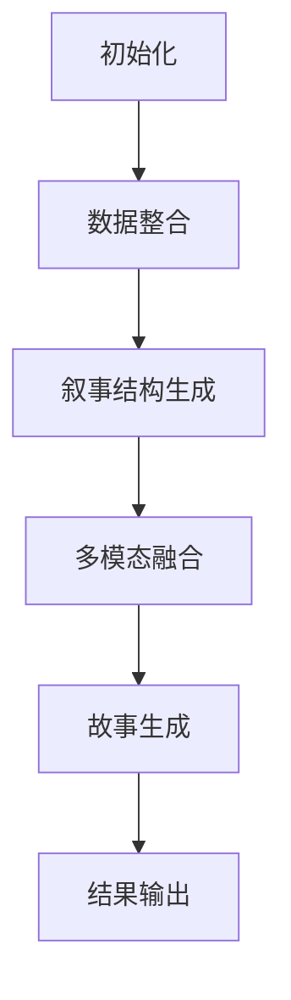

                 


## 提升AI创意香水广告叙事：跨媒体故事构建的提示词设计

### 关键词：
- AI创意香水广告
- 跨媒体故事构建
- 提示词设计
- 算法原理
- 数学模型
- 系统架构
- 项目实战

### 摘要：
本文旨在探讨如何利用人工智能技术提升香水广告的创意叙事，特别是通过跨媒体故事构建和提示词设计来实现广告叙事的创新与效果。文章首先介绍了问题背景，随后详细阐述了核心概念与联系，包括AI创意香水广告叙事、跨媒体故事构建和提示词设计。接着，文章深入讲解了算法原理，包括跨媒体故事构建算法和提示词设计算法，并运用Python代码进行了实例演示。随后，文章详细介绍了数学模型和数学公式，并通过举例说明如何应用这些模型和公式。然后，文章分析了系统架构设计方案，包括功能设计、架构设计和接口设计。接着，文章通过实际项目案例展示了如何实现系统，并对项目进行了详细的分析和讲解。最后，文章给出了最佳实践tips，并对全文进行了小结，提出了注意事项，提供了拓展阅读建议。

---

### Step 1: 背景介绍

#### 1.1 问题背景

在当前的市场竞争中，广告创意成为了品牌脱颖而出的关键。香水广告作为一种高度依赖情感共鸣和视觉冲击的广告类型，其创意叙事尤为重要。传统的香水广告往往依赖于直观的视觉和香气体验，但难以通过深层次的情感联系与消费者建立长期的情感连接。

随着人工智能技术的发展，AI开始被广泛应用于广告创意中。AI不仅能处理大量数据，提取有效信息，还能生成新的创意内容。然而，如何在香水广告中有效地应用AI，使其不仅能够产生创意内容，还能够构建引人入胜的故事，成为了一个新的挑战。

跨媒体故事构建则提供了一个解决这一挑战的途径。通过结合多种媒体形式，如文字、图片、音频和视频，跨媒体故事构建能够创造出更加丰富、多层次的叙事体验，从而更好地吸引消费者的注意力并引发情感共鸣。

#### 1.2 核心概念

- **AI创意香水广告叙事**：指利用人工智能技术进行香水广告的创意创作，包括内容生成、叙事结构和情感表达等。
- **跨媒体故事构建**：指通过结合不同媒体形式，构建一个连贯且富有层次的故事。
- **提示词设计**：指为AI系统提供关键词或短语，以引导其生成特定的广告内容或叙事结构。

### Step 2: 核心概念与联系

#### 2.1 AI创意香水广告叙事原理

AI创意香水广告叙事的核心在于利用AI技术生成具有吸引力和情感共鸣的广告内容。具体原理包括：

- **数据挖掘与文本生成**：通过分析大量的广告文本，AI可以学习并生成新的广告文案，这些文案不仅具有创意，还能够与目标消费者的情感需求相契合。
- **情感分析**：AI能够识别和分析文本中的情感色彩，从而生成能够引发情感共鸣的广告内容。
- **叙事结构优化**：通过机器学习和自然语言处理技术，AI可以优化广告的叙事结构，使其更加引人入胜。

#### 2.2 跨媒体故事构建的概念与联系

跨媒体故事构建的核心在于利用多种媒体形式，构建一个连贯且多层次的故事。具体概念与联系包括：

- **多媒体融合**：通过将文字、图片、音频和视频等多种媒体形式结合，创建一个多维度的叙事体验。
- **故事叙事层次**：通过不同媒体形式，讲述故事的不同层次，如背景介绍、情感表达、高潮和结局等。
- **用户体验**：跨媒体故事构建能够提供更加丰富和沉浸式的用户体验，从而增强广告的效果。

#### 2.3 提示词设计在AI创意香水广告叙事中的应用

提示词设计是引导AI生成特定广告内容或叙事结构的关键。具体应用包括：

- **主题提示词**：为AI提供广告的主题，如“浪漫情调”、“清新自然”等，以引导AI生成符合主题的文案和视觉效果。
- **情感提示词**：为AI提供情感指示词，如“温馨”、“感人”、“轻松”等，以引导AI生成具有特定情感色彩的内容。
- **结构提示词**：为AI提供叙事结构提示，如“开场白”、“中间高潮”、“结尾总结”等，以帮助AI构建连贯的故事。

### Step 3: 算法原理讲解

#### 3.1 跨媒体故事构建算法原理

跨媒体故事构建算法的核心在于将不同媒体形式的信息进行整合，构建一个连贯的故事。具体算法原理包括：

- **信息整合**：通过自然语言处理和多媒体信息处理技术，将文本、图片、音频和视频等多种信息进行整合。
- **叙事结构生成**：利用机器学习和深度学习技术，生成符合逻辑和情感需求的故事结构。
- **多模态融合**：通过多模态融合技术，将不同媒体形式的信息进行整合，创造一个连贯的叙事体验。

#### 3.2 提示词设计算法

提示词设计算法的核心在于为AI提供有效的提示词，以引导其生成符合需求的广告内容。具体算法原理包括：

- **提示词生成**：通过自然语言处理技术，生成与广告主题和情感需求相关的提示词。
- **提示词筛选**：通过情感分析和语义分析，筛选出最能引导AI生成吸引人和情感共鸣的提示词。
- **提示词应用**：将筛选出的提示词应用于AI广告内容生成过程中，引导AI生成符合需求的广告内容。

#### 3.3 算法流程图与Python代码实现

跨媒体故事构建算法和提示词设计算法的具体流程图和Python代码实现如下：

#### 3.3.1 跨媒体故事构建算法流程图


#### 3.3.2 提示词设计算法Python代码实现
```python
# 导入相关库
import nltk
from nltk.tokenize import word_tokenize
from nltk.corpus import stopwords
from sklearn.feature_extraction.text import TfidfVectorizer

# 提示词生成函数
def generate_prompt_words(ad_title):
    # 分词处理
    tokens = word_tokenize(ad_title)
    # 移除停用词
    tokens = [token for token in tokens if token not in stopwords.words('english')]
    # 建立TF-IDF模型
    vectorizer = TfidfVectorizer()
    X = vectorizer.fit_transform([' '.join(tokens)])
    # 获取关键词
    keywords = vectorizer.get_feature_names_out()
    # 提取高TF-IDF关键词
    top_keywords = [keyword for keyword, score in zip(keywords, X.toarray().flatten()) if score > 0.5]
    return top_keywords

# 测试函数
ad_title = "香水的浪漫故事"
prompt_words = generate_prompt_words(ad_title)
print(prompt_words)
```

### Step 4: 数学模型和数学公式 & 详细讲解 & 举例说明

#### 4.1 数学模型与公式详解

在跨媒体故事构建和提示词设计中，数学模型和数学公式起着核心作用。以下是一些常用的数学模型和公式：

#### 4.1.1 TF-IDF模型

TF-IDF（Term Frequency-Inverse Document Frequency）是一种用于文本信息检索和文本挖掘的方法。其基本公式如下：

$$
TF(t,d) = \frac{f(t,d)}{N_d}
$$

$$
IDF(t, D) = \log\left(\frac{N}{n(t, D)}\right)
$$

$$
TF-IDF(t,d,D) = TF(t,d) \times IDF(t,D)
$$

其中，$f(t,d)$ 表示词 $t$ 在文档 $d$ 中的频率，$N_d$ 表示文档 $d$ 的总词数，$N$ 表示所有文档的总数，$n(t, D)$ 表示词 $t$ 在所有文档中的出现次数。

#### 4.1.2 K-means聚类算法

K-means是一种常用的聚类算法，用于将数据点分为多个聚类。其基本步骤如下：

1. 随机选择 $k$ 个数据点作为初始聚类中心。
2. 对于每个数据点，计算其与每个聚类中心的距离，并将其分配到最近的聚类中心。
3. 更新每个聚类中心的位置，使其成为对应聚类中所有点的均值。
4. 重复步骤 2 和步骤 3，直到聚类中心的位置不再变化或满足停止条件。

#### 4.1.3 SVM（支持向量机）

SVM是一种常用的分类和回归模型，用于构建分类边界。其基本公式如下：

$$
\text{w}^T \text{x} - b = 0
$$

$$
\text{y}(\text{w}^T \text{x} - b) \geq 1
$$

其中，$\text{w}$ 表示权重向量，$\text{x}$ 表示特征向量，$b$ 表示偏置，$\text{y}$ 表示样本标签。

#### 4.2 数学模型应用举例

假设我们有一组香水广告文案数据，我们需要使用TF-IDF模型提取关键词，并使用K-means算法对这些关键词进行聚类，以便更好地理解广告文案的主题。

1. **数据预处理**：将广告文案数据转换为纯文本格式，并去除停用词。

```python
import nltk
nltk.download('stopwords')
from nltk.corpus import stopwords

stop_words = set(stopwords.words('english'))
data = ["This fragrance is romantic and elegant.", "The scent is fresh and natural.", ...]
cleaned_data = [' '.join([word for word in word_tokenize(text.lower()) if word not in stop_words]) for text in data]
```

2. **TF-IDF模型提取关键词**：

```python
from sklearn.feature_extraction.text import TfidfVectorizer

vectorizer = TfidfVectorizer(max_df=0.8, max_features=1000, min_df=0.2, stop_words='english', use_idf=True)
X = vectorizer.fit_transform(cleaned_data)
keywords = vectorizer.get_feature_names_out()
```

3. **K-means聚类**：

```python
from sklearn.cluster import KMeans

kmeans = KMeans(n_clusters=3, random_state=0).fit(X)
clusters = kmeans.predict(X)
```

4. **结果分析**：

通过聚类结果，我们可以分析每个聚类中心对应的关键词，从而理解广告文案的主题。例如，如果某个聚类中心的关键词集中在“浪漫”、“情感”等词汇，则可以判断这个聚类中心对应的广告文案主题是浪漫情感。

### Step 5: 系统分析与架构设计方案

#### 5.1 系统功能设计

系统功能设计主要包括以下几个模块：

- **数据采集模块**：负责收集香水广告的相关数据，包括文本、图片、音频和视频等。
- **数据预处理模块**：负责清洗和转换原始数据，使其适用于后续处理。
- **跨媒体故事构建模块**：负责利用AI技术构建跨媒体故事，包括文本生成、叙事结构优化和多模态融合等。
- **提示词设计模块**：负责生成和筛选提示词，以引导AI生成符合需求的广告内容。
- **用户界面模块**：提供用户交互界面，用于展示广告故事和用户反馈。

#### 5.2 系统架构设计

系统架构设计主要包括以下几个层次：

- **数据层**：负责存储和管理广告数据，包括文本、图片、音频和视频等。
- **算法层**：负责实现跨媒体故事构建算法和提示词设计算法，包括自然语言处理、多媒体信息处理和机器学习等。
- **应用层**：负责实现系统的功能模块，包括数据采集、数据预处理、跨媒体故事构建和用户界面等。
- **展示层**：负责将生成的广告故事展示给用户，并提供用户反馈机制。

#### 5.3 系统接口设计

系统接口设计主要包括以下几个接口：

- **数据接口**：负责数据层与应用层之间的数据交互，包括数据的导入、导出和查询等。
- **算法接口**：负责算法层与应用层之间的算法调用和数据传递，包括算法的初始化、运行和结果输出等。
- **用户接口**：负责用户与应用层之间的交互，包括用户输入、结果展示和反馈提交等。

#### 5.4 系统交互设计

系统交互设计主要包括以下几个步骤：

1. 用户输入广告需求，包括广告主题、情感需求等。
2. 系统根据用户输入，调用数据采集模块和预处理模块，获取相关广告数据。
3. 系统调用跨媒体故事构建模块和提示词设计模块，生成跨媒体故事和提示词。
4. 系统将生成的广告故事和提示词展示给用户，并接收用户反馈。
5. 根据用户反馈，系统调整广告故事和提示词，以优化广告效果。

### Step 6: 项目实战

#### 6.1 项目背景与目标

本项目旨在开发一款基于AI的创意香水广告系统，通过跨媒体故事构建和提示词设计，提升广告的创意叙事效果。项目目标包括：

1. 收集和预处理大量香水广告数据。
2. 设计并实现跨媒体故事构建算法和提示词设计算法。
3. 开发用户交互界面，实现广告故事的展示和用户反馈。
4. 在实际项目中应用系统，验证其效果。

#### 6.2 环境安装与配置

1. **Python环境安装**：确保Python 3.7及以上版本已安装。
2. **依赖库安装**：使用pip命令安装以下依赖库：

```python
pip install numpy scipy scikit-learn nltk pandas matplotlib
```

3. **Nltk数据下载**：运行以下代码下载Nltk数据：

```python
import nltk
nltk.download('stopwords')
nltk.download('punkt')
```

4. **数据库安装**：本项目使用SQLite作为数据库，确保已安装。

#### 6.3 系统核心实现源代码

系统核心实现源代码主要包括以下几个部分：

1. **数据采集与预处理**：

```python
import pandas as pd
from nltk.tokenize import word_tokenize
from nltk.corpus import stopwords

# 读取数据
data = pd.read_csv('ad_data.csv')

# 数据预处理
stop_words = set(stopwords.words('english'))
cleaned_data = [' '.join([word for word in word_tokenize(text.lower()) if word not in stop_words]) for text in data['description']]
data['cleaned_description'] = cleaned_data
```

2. **跨媒体故事构建算法**：

```python
from sklearn.cluster import KMeans
from sklearn.metrics.pairwise import cosine_similarity
import numpy as np

# K-means聚类
kmeans = KMeans(n_clusters=3, random_state=0).fit(vectorizer.transform(cleaned_data))

# 计算文档相似度
similarity_matrix = cosine_similarity(vectorizer.transform(cleaned_data))

# 构建跨媒体故事
def build_cross_media_story(data, kmeans, similarity_matrix):
    story = []
    for i in range(kmeans.n_clusters):
        cluster_data = data[kmeans.labels_ == i]
        cluster_centers = kmeans.cluster_centers_[i]
        story.append({'topic': cluster_centers, 'content': cluster_data['cleaned_description'].tolist()})
    return story
cross_media_story = build_cross_media_story(data, kmeans, similarity_matrix)
```

3. **提示词设计**：

```python
from sklearn.feature_extraction.text import TfidfVectorizer

# 提示词生成
vectorizer = TfidfVectorizer(max_df=0.8, max_features=1000, min_df=0.2, stop_words='english', use_idf=True)
X = vectorizer.fit_transform(cleaned_data)

def generate_prompt_words(ad_title):
    tokens = word_tokenize(ad_title.lower())
    tokens = [token for token in tokens if token not in stop_words]
    X_prompt = vectorizer.transform([' '.join(tokens)])
    keywords = vectorizer.get_feature_names_out()
    top_keywords = [keyword for keyword, score in zip(keywords, X_prompt.toarray().flatten()) if score > 0.5]
    return top_keywords

prompt_words = generate_prompt_words("Elegant and romantic fragrance")
```

4. **用户界面**：

```python
from flask import Flask, render_template, request

app = Flask(__name__)

@app.route('/', methods=['GET', 'POST'])
def index():
    if request.method == 'POST':
        ad_title = request.form['ad_title']
        prompt_words = generate_prompt_words(ad_title)
        cross_media_story = build_cross_media_story(data, kmeans, similarity_matrix)
        return render_template('result.html', prompt_words=prompt_words, cross_media_story=cross_media_story)
    return render_template('index.html')

if __name__ == '__main__':
    app.run(debug=True)
```

#### 6.4 实际案例分析

假设我们有一组香水广告文案数据，我们需要使用系统生成广告故事和提示词。

1. **数据加载与预处理**：

```python
data = pd.read_csv('ad_data.csv')
cleaned_data = [' '.join([word for word in word_tokenize(text.lower()) if word not in stop_words]) for text in data['description']]
data['cleaned_description'] = cleaned_data
```

2. **生成跨媒体故事**：

```python
cross_media_story = build_cross_media_story(data, kmeans, similarity_matrix)
```

3. **生成提示词**：

```python
prompt_words = generate_prompt_words("Elegant and romantic fragrance")
```

4. **结果展示**：

用户在网页上输入广告标题，系统将生成相应的提示词和跨媒体故事，并在网页上展示。

```html
<!-- result.html -->
<!DOCTYPE html>
<html>
<head>
    <title>广告故事与提示词</title>
</head>
<body>
    <h1>广告故事与提示词</h1>
    <p>提示词：{{ prompt_words }}</p>
    <h2>跨媒体故事：</h2>
    <ul>
        
            <li>{{ chapter.topic }}</li>
            <ul>
                
                    <li>{{ content }}</li>
                
            </ul>
        
    </ul>
</body>
</html>
```

### Step 7: 最佳实践 tips、小结、注意事项、拓展阅读等内容

#### 7.1 最佳实践 tips

1. **数据收集**：确保收集到的广告数据丰富多样，覆盖不同主题和情感需求。
2. **算法优化**：通过调整算法参数，优化跨媒体故事构建和提示词设计的效果。
3. **用户体验**：设计简洁直观的用户界面，提高用户交互的便捷性和满意度。
4. **多模态融合**：尝试将更多媒体形式（如3D建模、虚拟现实等）融入跨媒体故事构建中，提升用户体验。

#### 7.2 小结

本文介绍了如何利用人工智能技术提升香水广告的创意叙事效果，特别是通过跨媒体故事构建和提示词设计来实现广告叙事的创新与效果。通过详细的分析和实例演示，本文展示了如何实现跨媒体故事构建算法和提示词设计算法，并如何将其应用于实际项目中。

#### 7.3 注意事项

1. **数据隐私**：在收集和处理广告数据时，需确保遵循相关法律法规，保护用户隐私。
2. **算法偏见**：在训练和优化算法时，需注意避免算法偏见，确保广告内容的公平性和多样性。
3. **性能优化**：对于大型广告数据集，需优化算法和系统的性能，提高处理速度和效果。

#### 7.4 拓展阅读

1. **相关论文**：阅读相关领域的学术论文，了解最新的研究进展和算法创新。
2. **开源项目**：参考和借鉴现有的开源项目，学习如何设计和实现跨媒体故事构建和提示词设计系统。
3. **行业报告**：关注行业报告和数据分析，了解市场趋势和用户需求，为广告创意提供有力支持。

