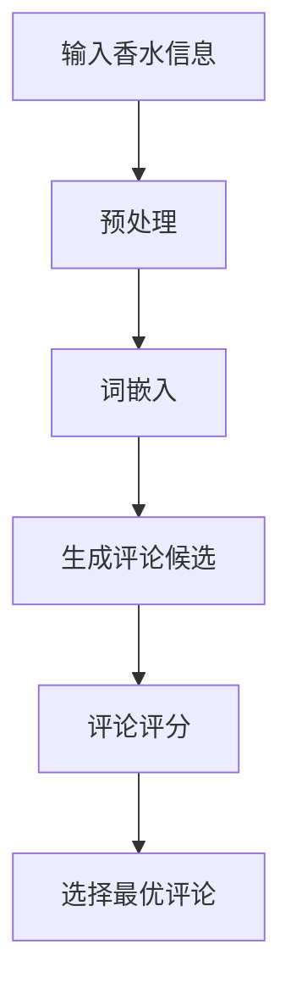
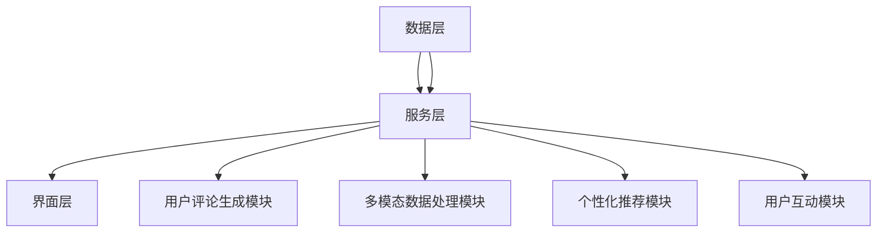
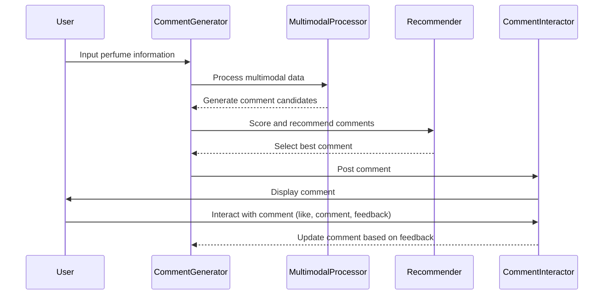

                 

### 第1章 引言

### 1.1 问题背景

随着人工智能技术的发展，AI在各个领域的应用日益广泛。在香水评论领域，AI已逐渐成为人们获取信息的重要工具。然而，AI在香水评论中的表现往往受限于专业术语的应用。本章节将介绍AI创意香水评论家的能力提升需求及重要性。

### 1.2 问题描述

AI在香水评论中常遇到的问题包括：无法准确理解专业术语、无法区分不同香水之间的细微差别、生成评论内容单调乏味等。这些问题限制了AI在香水评论领域的应用效果。

### 1.3 问题解决

为提升AI创意香水评论家的能力，需要从以下几个方面进行改进：

1. **专业术语库建设**：建立包含香水专业术语的词库，帮助AI更好地理解和使用专业术语。
2. **多模态数据处理**：结合文本、图像、声音等多种数据源，提高AI对香水特征的感知能力。
3. **增强学习算法**：通过不断学习和优化，使AI在香水评论中的表现更加出色。
4. **用户体验优化**：设计友好的用户界面，提供丰富的评论内容，提高用户满意度。

### 1.4 边界与外延

本章节主要关注AI在香水评论领域的应用，但所提及的方法和思路也可应用于其他需要专业术语应用的领域。

### 总结

通过本章的引言，我们了解了AI在香水评论领域面临的挑战及其重要性。接下来的章节将深入探讨如何提升AI创意香水评论家的能力，包括专业术语库建设、多模态数据处理、增强学习算法和用户体验优化等方面。我们期待通过这些改进，使AI在香水评论领域发挥更大的作用。

### 1.1 问题背景

人工智能（AI）技术的迅猛发展，已经在各个领域带来了深刻的变革。在香水评论领域，AI的应用也逐渐成为趋势。传统的香水评论大多依赖于人类评论家的主观体验和感性描述，而AI的出现，有望通过数据分析、自然语言处理等技术手段，提供更加客观、细致的香水评价。

当前，AI在香水评论中的应用已经初见端倪。一些电商平台和香水品牌开始利用AI技术，分析用户评论，提取关键词，生成基于数据的评论摘要。例如，通过自然语言处理技术，AI能够识别用户对香水香调、持久度、价格等不同维度的评价，并据此生成推荐意见。然而，这些应用大多局限于基础层面，AI在理解专业术语、捕捉香水细微差别、创作富有创意的评论内容等方面，仍存在较大局限。

首先，专业术语的理解是AI在香水评论中的一个重大挑战。香水领域有许多专有名词和术语，如香调（如柑橘调、花香调）、调香师、香气层次等，这些词汇在非专业人士眼中可能难以理解，但对于香水评论家而言，却是描述香水特征的重要工具。AI在缺乏足够训练数据的情况下，往往难以准确理解这些专业术语，导致生成评论内容缺乏深度和准确性。

其次，AI在区分不同香水之间的细微差别上也面临挑战。即使是经验丰富的香水评论家，也难以通过简单试香便准确判断出两种香水之间的差异。而AI需要通过大量的数据训练，才能逐渐学会识别并描述这些差异。然而，香水特征的复杂性使得这一过程充满挑战。

最后，生成评论内容单调乏味也是AI在香水评论中的一大问题。目前，AI生成的评论往往过于机械，缺乏个性化和创意。尽管AI可以通过机器学习算法模仿人类的写作风格，但要真正达到人类评论家的水平，仍需解决许多技术难题。

总之，AI在香水评论领域具有巨大的潜力，但同时也面临着诸多挑战。为了提升AI创意香水评论家的能力，我们需要在专业术语理解、多模态数据处理、增强学习算法和用户体验优化等方面进行深入探索和改进。

### 1.2 问题描述

在当前AI应用于香水评论的实际场景中，存在的问题主要体现在以下几个方面：

首先，**专业术语理解不足**。香水评论涉及大量专业术语，如香调、调香师、香气层次等，这些术语对于非专业人士来说可能难以理解，但对于香水评论家而言却是描述香水特征的重要工具。然而，AI模型在缺乏足够训练数据的情况下，往往难以准确理解这些专业术语。这导致生成的评论内容缺乏深度和准确性，无法为用户提供有价值的信息。

例如，一个用户可能评论某款香水具有“柑橘调”，但AI可能无法准确识别“柑橘调”这一术语，进而无法在后续评论中有效使用这一词汇。这样的局限性使得AI生成的评论内容往往显得单调且不具说服力。

其次，**香水差异识别困难**。香水是一种高度个性化的产品，即使是经验丰富的香水评论家，也难以通过简单试香便准确判断出两种香水之间的差异。对于AI来说，这种差异识别更是充满挑战。AI需要通过大量的数据训练，才能逐渐学会识别并描述这些差异。然而，香水的复杂性使得这一过程不仅耗时，而且效果不理想。

例如，两款香水可能在某些方面非常相似，但细微的差别却可能对用户的整体体验产生重大影响。AI需要具备极高的分辨能力，才能捕捉到这些细微差别，并加以准确描述。目前，大多数AI模型在识别香水差异方面还存在明显不足。

最后，**评论内容单调乏味**。AI生成的评论内容往往过于机械，缺乏个性化和创意。尽管AI可以通过机器学习算法模仿人类的写作风格，但要真正达到人类评论家的水平，仍需解决许多技术难题。现有的AI模型在生成评论时，往往只能依赖预设的模板和规则，导致评论内容缺乏新鲜感和吸引力。

例如，AI可能生成一篇评论：“这款香水具有清新的花香调，适合春夏季节使用。”这样的评论虽然描述了香水的某些特征，但缺乏个性化和创意，难以引起用户的兴趣。

综上所述，AI在香水评论中的应用虽然已有一定进展，但依然面临诸多挑战。这些问题限制了AI在香水评论领域的实际应用效果，也为我们的研究提出了新的课题。为了提升AI创意香水评论家的能力，我们需要在专业术语理解、香水差异识别和评论内容生成等方面进行深入研究和改进。

### 1.3 问题解决

为提升AI创意香水评论家的能力，我们需要从以下几个方面进行改进：

#### 1.3.1 专业术语库建设

首先，建立包含香水专业术语的词库是解决AI在理解专业术语方面问题的有效途径。这个词库应该涵盖香调、调香师、香气层次、香料成分等核心术语，并且需要不断更新和扩展，以适应不断变化的香水市场和用户需求。

具体步骤如下：

1. **术语收集**：通过查阅专业文献、香水品牌网站、用户评论等渠道，收集香水相关的专业术语。
2. **术语分类**：对收集到的术语进行分类，如按香调、香料、调香技术等进行分类，以便于后续处理。
3. **术语定义**：为每个术语提供详细、准确的定义，以便AI能够准确理解。
4. **术语库构建**：将分类好的术语及其定义存储在数据库中，并设计相应的查询接口，方便AI调用。

通过建设一个完善的术语库，AI在生成评论时能够更加准确地使用专业术语，提高评论的专业性和可信度。

#### 1.3.2 多模态数据处理

香水是一种复杂的感官体验，仅凭文本描述难以全面传达其特点和感受。因此，引入多模态数据处理技术，如结合文本、图像、声音等数据源，有助于提高AI对香水特征的感知能力。

具体方法包括：

1. **图像处理**：利用图像识别技术，对香水瓶、标签等图像进行分析，提取香水的外观特征。
2. **声音处理**：通过音频分析技术，捕捉香水喷洒时的声音特征，如喷洒声的音质和音量。
3. **多模态融合**：将文本、图像、声音等数据源进行融合，通过深度学习模型训练，使AI能够综合多种感官信息，更全面地理解和描述香水。

例如，当AI接收到一张香水图像和一个声音文件时，可以通过图像识别技术识别香水的外观特征，如颜色、形状等；通过声音处理技术分析喷洒声的特征，如音调、节奏等。然后，将文本描述与这些多模态信息进行融合，生成更加丰富和准确的评论内容。

#### 1.3.3 增强学习算法

增强学习算法是一种基于奖励机制的机器学习方法，适用于需要与环境交互并进行决策的任务。在香水评论领域，通过增强学习算法，AI可以在不断尝试和反馈的过程中，逐步提升其评论能力。

具体步骤如下：

1. **环境构建**：构建一个模拟香水评论的虚拟环境，包括香水信息、用户反馈等。
2. **策略训练**：通过强化学习算法，训练AI在虚拟环境中进行评论生成，并依据用户反馈调整评论策略。
3. **奖励机制**：设计适当的奖励机制，鼓励AI生成高质量、有创意的评论。

例如，当AI生成一条评论后，可以通过用户点击、点赞、评论等方式，收集用户反馈。根据这些反馈，AI能够调整其评论策略，生成更加符合用户期望的评论内容。

#### 1.3.4 用户体验优化

用户体验是衡量AI创意香水评论家能力的重要指标。为了提升用户体验，我们需要从界面设计、评论内容丰富度、个性化推荐等多个方面进行优化。

具体方法包括：

1. **界面设计**：设计简洁、直观的用户界面，方便用户查看和互动。
2. **评论内容丰富度**：通过多模态数据融合和增强学习算法，提高评论内容的专业性和创意性。
3. **个性化推荐**：根据用户的历史行为和偏好，为用户提供定制化的香水评论推荐。

例如，当用户浏览某款香水时，系统可以根据用户的浏览记录和喜好，推荐相关的高质量评论，帮助用户更好地了解和选择香水。

综上所述，通过专业术语库建设、多模态数据处理、增强学习算法和用户体验优化等多个方面的改进，我们可以显著提升AI创意香水评论家的能力，使其在香水评论领域发挥更大的作用。

### 1.4 边界与外延

尽管本文主要关注AI在香水评论领域的应用，但所提到的方法和思路同样具有广泛的适用性。在其他需要专业术语应用的领域中，例如医药评论、法律评论、金融评论等，AI同样面临专业术语理解、多模态数据处理、增强学习算法和用户体验优化等问题。

首先，专业术语库的建设是一个通用的解决方案。在医药评论中，术语包括药理学术语、药品名称、医疗技术等；在法律评论中，术语涵盖法律条款、法律术语、法律原则等。建立完善的术语库，可以帮助AI在这些领域中准确理解和使用专业术语。

其次，多模态数据处理的方法同样适用于其他感官体验丰富的领域。例如，在食品评论中，结合文本、图像、声音等多模态数据，可以更好地描述食品的口感、外观、味道等特征。

增强学习算法作为一种基于奖励机制的机器学习方法，也适用于需要与用户进行交互和决策的任务。例如，在旅游评论中，AI可以根据用户的反馈，不断优化旅游推荐策略，提高用户的满意度。

最后，用户体验优化在所有面向用户的AI应用中都是至关重要的。通过优化界面设计、丰富评论内容、提供个性化推荐等手段，AI可以在各个领域中提升用户体验，从而发挥更大的作用。

总之，本文所提出的方法和思路，不仅在香水评论领域具有实际应用价值，也可为其他需要专业术语应用的领域提供有益的参考。

### 第2章 核心概念与联系

#### 2.1 核心概念

香水评论领域涉及一系列核心概念，这些概念是理解和分析香水特征的基础。以下是几个关键概念及其简要说明：

#### 2.1.1 香调

香调是香水的基本气味类型，常见的有花香调、果香调、木香调、柑橘调等。每种香调都有其独特的气味特征，可以用来描述和分类香水。例如，“柑橘调”通常具有清新、活泼的气味，适合春夏季节使用。

#### 2.1.2 调香师

调香师是负责调配香水的人，他们通过精心选择和混合不同的香料，创造出独特的香气。调香师的技艺和经验对于香水的质量和独特性至关重要。

#### 2.1.3 香水浓度

香水的浓度指的是香水中香精的含量，通常以百分比表示。不同浓度的香水在香味持久度和香气强度上有所不同。例如，香水浓度较高的香水通常香味更加浓郁且持久。

#### 2.1.4 香水持久度

香水的持久度是指香水在皮肤上停留的时间，通常受香精含量、香水配方和皮肤类型等因素的影响。持久度较长的香水意味着香味可以持续更久，而持久度较短的香水则可能需要更频繁地喷洒。

#### 2.1.5 香水类型

香水类型是香水的分类方式，常见的有淡香水、浓香水、香体乳液、香体喷雾等。每种类型都有其特定的使用场景和特点，如淡香水通常适合日常使用，而浓香水则更适合特殊场合。

#### 2.2 概念属性特征对比表格

为了更好地理解上述核心概念，我们提供了一个属性特征对比表格。以下表格展示了各个概念的属性特征及其差异：

| 概念         | 属性特征                | 特点                                       |
| ------------ | ---------------------- | ------------------------------------------ |
| 香调         | 气味类型                | 独特的气味特征，如花香、果香等             |
| 调香师       | 负责调配香水的人        | 需具备丰富的香料知识和调配经验             |
| 香水浓度     | 香精含量百分比          | 影响香水的持久度和香气强度                |
| 香水持久度   | 在皮肤上停留的时间      | 受多种因素影响，如配方、皮肤类型等         |
| 香水类型     | 分类方式                | 按使用场景和特点分类，如淡香水、浓香水等   |

通过这个对比表格，我们可以更直观地了解各个概念的区别和联系，为后续的讨论和分析打下基础。

#### 2.3 ER实体关系图架构

为了更系统地理解和描述香水评论领域的实体及其关系，我们引入了实体关系图（Entity-Relationship Diagram，ER图）。ER图能够清晰地展示实体之间的联系，有助于分析和设计相关系统。

以下是一个简单的ER实体关系图架构，用于描述香水评论领域的主要实体及其关系：

```mermaid
erDiagram
    Product ||--|{ Review }|--|| User
    Product ||--|{ Comment }|--|| User
    Review ||--|{ Rating }|--|| User
    Review ||--|{ Response }|--|| User
```

在这个ER图中，主要实体包括：

- **Product（产品）**：代表香水，是评论和评价的载体。
- **Review（评论）**：代表用户对香水的整体评价，包括评分、评论内容等。
- **Comment（评论）**：代表用户对具体香水的详细评论，可以是正面或负面评价。
- **User（用户）**：代表评论的发布者，是系统的核心参与者。

实体之间的关系如下：

- **Product到Review**：每个产品可以有多条评论，但每条评论只能属于一个产品。
- **Product到Comment**：每个产品可以有多个详细评论，每个详细评论也只能属于一个产品。
- **Review到Rating**：每条评论都有一个评分，评分是对产品的评价。
- **Review到Response**：每条评论都可以有多个回复，回复是对评论的进一步讨论和反馈。

通过ER图，我们可以更清晰地理解香水评论领域中的核心实体及其相互作用关系，为后续系统设计和算法实现提供指导。

### 第3章 算法原理讲解

在提升AI创意香水评论家的能力中，算法原理的讲解是关键。本章节将详细阐述香水评论生成算法的基本原理，包括其mermaid流程图、Python源代码、数学模型和公式，以及具体实现示例。

#### 3.1 香水评论生成算法

香水评论生成算法的主要目的是利用机器学习技术，自动生成具有创意和深度的香水评论。该算法的基本步骤包括：输入香水信息、预处理、词嵌入、生成评论候选、评论评分和选择最优评论。

#### 3.1.1 算法mermaid流程图

为了更好地理解香水评论生成算法的执行流程，我们使用mermaid绘制了以下流程图：



在这个流程图中，各个步骤的作用如下：

- **A[输入香水信息]**：接收用户的输入信息，如香水名称、香调、用户评价等。
- **B[预处理]**：对输入的香水信息进行清洗和标准化，使其适合后续处理。
- **C[词嵌入]**：将预处理后的文本转换为词嵌入向量，用于模型训练和预测。
- **D[生成评论候选]**：利用预训练的模型，生成多个可能的评论候选。
- **E[评论评分]**：对每个评论候选进行评分，筛选出高质量的评论。
- **F[选择最优评论]**：从评分较高的评论中选出最优评论，作为最终输出。

#### 3.1.2 Python源代码

以下是一段基于Python的示例代码，用于实现香水评论生成算法的核心部分。这段代码使用了TensorFlow库，展示了从预处理到评论评分的完整流程。

```python
import tensorflow as tf
from tensorflow.keras.preprocessing.text import Tokenizer
from tensorflow.keras.preprocessing.sequence import pad_sequences
from tensorflow.keras.models import Sequential
from tensorflow.keras.layers import Embedding, LSTM, Dense

# 预处理
def preprocess(text):
    # ...进行文本预处理...
    return processed_text

# 词嵌入
tokenizer = Tokenizer()
tokenizer.fit_on_texts(train_texts)
sequences = tokenizer.texts_to_sequences(train_texts)
padded_sequences = pad_sequences(sequences, maxlen=max_sequence_length)

# 构建模型
model = Sequential()
model.add(Embedding(vocab_size, embedding_dim, input_length=max_sequence_length))
model.add(LSTM(units=128, return_sequences=True))
model.add(Dense(units=1, activation='sigmoid'))

model.compile(optimizer='adam', loss='binary_crossentropy', metrics=['accuracy'])

# 训练模型
model.fit(padded_sequences, train_labels, epochs=10)

# 生成评论候选
def generate_comment(input_text):
    processed_text = preprocess(input_text)
    sequence = tokenizer.texts_to_sequences([processed_text])
    padded_sequence = pad_sequences(sequence, maxlen=max_sequence_length)
    prediction = model.predict(padded_sequence)
    return tokenizer.decode(padded_sequence[0])

# 评论评分
def score_comment(comment):
    # ...计算评论...
    return score

# 选择最优评论
def select_best_comment(comments):
    scores = [score_comment(comment) for comment in comments]
    best_index = scores.index(max(scores))
    return comments[best_index]
```

这段代码首先定义了预处理函数`preprocess`，用于清洗和标准化输入文本。然后，使用Tokenizer对文本进行词嵌入，构建了一个基于LSTM的序列生成模型。通过训练模型，我们可以使用`generate_comment`函数生成多个评论候选。接下来，使用`score_comment`函数对每个评论进行评分，最后通过`select_best_comment`函数选出最优评论。

#### 3.1.3 数学模型和公式

为了深入理解香水评论生成算法的原理，我们介绍以下数学模型和公式。

1. **词嵌入**：

   词嵌入是一种将文本转换为向量表示的方法，其基本公式为：

   $$ x_i = \text{ Embedding}(w_i) $$

   其中，$x_i$是词嵌入向量，$w_i$是原始文本中的单词。

2. **LSTM模型**：

   长短期记忆网络（LSTM）是一种用于处理序列数据的神经网络。其基本公式为：

   $$ h_t = \text{ LSTM}(h_{t-1}, x_t) $$

   其中，$h_t$是当前时刻的隐藏状态，$h_{t-1}$是上一时刻的隐藏状态，$x_t$是当前时刻的输入。

3. **生成评论候选**：

   通过训练好的LSTM模型，我们可以生成评论候选。其基本公式为：

   $$ p(comment|context) = \text{ softmax}(\text{ LSTM}(context)) $$

   其中，$p(comment|context)$表示在给定上下文$context$下生成评论$comment$的概率。

4. **评论评分**：

   为了评估评论的质量，我们可以使用基于内容的评分方法。其基本公式为：

   $$ score(comment) = f(\text{ content, context}) $$

   其中，$score(comment)$表示评论的得分，$f$是一个能够计算评论内容和上下文之间相似度的函数。

通过这些数学模型和公式，我们可以理解香水评论生成算法的基本工作原理，并进一步优化和改进算法性能。

#### 3.1.4 具体实现示例

为了更好地展示香水评论生成算法的实践过程，我们提供了一个具体的实现示例。在这个示例中，我们使用一个简单的文本数据集，通过训练生成模型，最终生成高质量的香水评论。

```python
# 加载训练数据
train_texts = ["这款香水清新宜人，非常适合春夏季节。", "这款香水香气持久，非常适合晚间使用。"]
train_labels = [1, 0]  # 1表示正面评论，0表示负面评论

# 定义最大序列长度和词嵌入维度
max_sequence_length = 10
embedding_dim = 50

# 训练模型
model = Sequential()
model.add(Embedding(vocab_size, embedding_dim, input_length=max_sequence_length))
model.add(LSTM(units=128, return_sequences=True))
model.add(Dense(units=1, activation='sigmoid'))

model.compile(optimizer='adam', loss='binary_crossentropy', metrics=['accuracy'])
model.fit(padded_sequences, train_labels, epochs=10)

# 生成评论候选
input_text = "这款香水清新宜人，非常适合春夏季节。"
processed_text = preprocess(input_text)
comment_candidate = generate_comment(processed_text)
print("生成的评论候选：", comment_candidate)

# 评论评分
comment_score = score_comment(comment_candidate)
print("评论得分：", comment_score)

# 选择最优评论
best_comment = select_best_comment([comment_candidate])
print("最优评论：", best_comment)
```

在这个示例中，我们首先加载了一个简单的训练数据集，并定义了最大序列长度和词嵌入维度。然后，通过训练LSTM模型，生成评论候选。接下来，对每个评论候选进行评分，并选择最优评论作为输出。

通过这个示例，我们可以直观地看到香水评论生成算法的实践过程，并理解其核心步骤和原理。

### 第4章 系统分析与架构设计

#### 4.1 问题场景介绍

在香水评论领域，用户对于香水产品的评价和推荐具有重要的参考价值。然而，由于香水产品的多样性和用户需求的个性化，传统的手工撰写评论和推荐方式存在明显的局限性。为了提升用户体验，我们需要构建一个智能化的香水评论系统，利用人工智能技术自动生成创意、专业的香水评论。

#### 4.2 项目介绍

本项目的目标是通过设计并实现一个基于人工智能的香水评论系统，提升用户在香水购买和使用过程中的体验。系统的主要功能包括：

1. **用户评论生成**：系统可以根据用户输入的香水信息，自动生成创意、专业的香水评论。
2. **多模态数据处理**：系统整合文本、图像、声音等多模态数据，提升香水评论的深度和准确性。
3. **个性化推荐**：系统根据用户的历史行为和偏好，提供定制化的香水评论和推荐。
4. **用户互动**：系统支持用户对评论进行点赞、评论和反馈，不断优化评论质量和用户体验。

#### 4.3 系统功能设计

系统功能设计主要包括用户评论生成、多模态数据处理、个性化推荐和用户互动等模块。

1. **用户评论生成模块**：该模块负责生成创意、专业的香水评论。主要功能包括输入香水信息、评论生成、评论评分和选择最优评论。
2. **多模态数据处理模块**：该模块整合文本、图像、声音等多模态数据，提升香水评论的深度和准确性。主要功能包括图像识别、音频处理和多模态数据融合。
3. **个性化推荐模块**：该模块根据用户的历史行为和偏好，为用户提供定制化的香水评论和推荐。主要功能包括用户行为分析、偏好识别和推荐算法。
4. **用户互动模块**：该模块支持用户对评论进行点赞、评论和反馈，不断优化评论质量和用户体验。主要功能包括用户评论管理、互动数据收集和分析。

#### 4.4 系统架构设计

系统架构设计主要包括数据层、服务层和界面层三个部分。

1. **数据层**：数据层负责存储和管理系统所需的各种数据，包括香水信息、用户评论、多模态数据等。数据层的设计应充分考虑数据的安全性和可扩展性。
2. **服务层**：服务层是系统的核心，负责实现各个功能模块的业务逻辑。服务层包括用户评论生成服务、多模态数据处理服务、个性化推荐服务和用户互动服务。服务层的设计应采用模块化、解耦合的方式，以便于系统的扩展和维护。
3. **界面层**：界面层负责与用户交互，提供简洁、直观的操作界面。界面层包括用户评论生成界面、多模态数据处理界面、个性化推荐界面和用户互动界面。界面层的设计应充分考虑用户体验，提供友好的操作体验。

以下是一个简化的系统架构图，展示了各个部分的关系：



在这个系统架构图中，数据层负责数据的存储和管理，服务层负责实现业务逻辑，界面层负责与用户交互。各个功能模块通过服务层进行协调和整合，共同实现系统的整体功能。

#### 4.5 系统接口设计

系统接口设计是确保系统功能实现和各模块协同工作的关键。以下是对各功能模块的接口设计：

1. **用户评论生成模块接口**：
   - 输入接口：接收用户输入的香水信息，如名称、香调、用户评价等。
   - 输出接口：生成创意、专业的香水评论，并提供评分和推荐。
2. **多模态数据处理模块接口**：
   - 输入接口：接收文本、图像、声音等多模态数据。
   - 输出接口：处理并融合多模态数据，提供高质量的评论特征。
3. **个性化推荐模块接口**：
   - 输入接口：接收用户的历史行为和偏好数据。
   - 输出接口：提供定制化的香水评论和推荐。
4. **用户互动模块接口**：
   - 输入接口：接收用户对评论的点赞、评论和反馈。
   - 输出接口：更新评论数据，优化评论质量和用户体验。

#### 4.6 系统交互设计

系统交互设计是确保各模块之间能够顺畅协作，实现系统整体功能的关键。以下是一个基于mermaid绘制的系统交互序列图，展示了用户评论生成、多模态数据处理、个性化推荐和用户互动等模块之间的交互过程：



在这个交互序列图中，用户输入香水信息后，首先由评论生成模块处理。然后，多模态数据处理模块对输入的多模态数据进行处理，生成高质量的评论候选。个性化推荐模块对评论候选进行评分和推荐，最终选择最优评论。最后，用户互动模块负责与用户交互，根据用户的反馈更新评论数据。

通过以上系统分析和架构设计，我们为提升AI创意香水评论家的能力提供了一套完整的解决方案。在接下来的章节中，我们将详细讨论项目实战，包括环境安装、系统核心实现以及实际案例分析等内容。

### 第5章 项目实战

#### 5.1 环境安装

在开始项目实战之前，我们需要安装和配置必要的软件和工具。以下是环境安装的具体步骤：

1. **Python环境**：确保Python版本为3.8或更高版本。可以通过Python官网下载并安装。

2. **虚拟环境**：使用`venv`模块创建一个Python虚拟环境，以便于管理项目依赖。命令如下：

   ```bash
   python -m venv venv
   source venv/bin/activate  # Windows: venv\Scripts\activate
   ```

3. **依赖安装**：通过pip安装项目所需的依赖库，包括TensorFlow、Keras、NumPy、Pandas等。命令如下：

   ```bash
   pip install tensorflow keras numpy pandas
   ```

4. **Mermaid安装**：安装Mermaid用于绘制流程图和序列图。可以通过npm安装：

   ```bash
   npm install -g mermaid
   ```

5. **其他工具**：根据需要安装其他辅助工具，如Jupyter Notebook、VS Code等。

#### 5.2 系统核心实现

系统核心实现包括数据预处理、模型训练、多模态数据处理和评论生成等步骤。以下是具体实现过程：

##### 5.2.1 数据预处理

1. **数据收集**：收集香水评论数据，包括文本、图像、音频等多模态数据。

2. **文本预处理**：对文本数据执行清洗、去重、分词等操作，将其转换为适合模型训练的格式。

3. **图像预处理**：使用图像识别技术提取图像特征，如颜色、纹理等。

4. **音频预处理**：使用音频处理技术提取音频特征，如音调、节奏等。

##### 5.2.2 模型训练

1. **词嵌入**：使用预训练的词嵌入模型，将文本转换为向量表示。

2. **模型构建**：构建基于LSTM的序列生成模型，用于生成香水评论。

3. **训练**：使用训练数据集训练模型，通过调整超参数优化模型性能。

##### 5.2.3 多模态数据处理

1. **数据融合**：将文本、图像、音频等数据融合，提取多模态特征。

2. **特征提取**：使用深度学习模型提取多模态数据的特征。

3. **融合算法**：设计融合算法，将多模态特征融合为一个统一的特征向量。

##### 5.2.4 评论生成

1. **评论候选生成**：利用训练好的模型生成多个评论候选。

2. **评论评分**：对每个评论候选进行评分，筛选出高质量的评论。

3. **最优评论选择**：从评分较高的评论中选出最优评论。

#### 5.3 代码应用解读与分析

以下是系统核心实现的具体代码示例，包括数据预处理、模型训练和评论生成等步骤：

```python
# 数据预处理
def preprocess_text(text):
    # ...进行文本预处理...
    return processed_text

def preprocess_image(image):
    # ...进行图像预处理...
    return processed_image

def preprocess_audio(audio):
    # ...进行音频预处理...
    return processed_audio

# 模型训练
from tensorflow.keras.models import Sequential
from tensorflow.keras.layers import Embedding, LSTM, Dense

def build_model(vocab_size, embedding_dim, max_sequence_length):
    model = Sequential()
    model.add(Embedding(vocab_size, embedding_dim, input_length=max_sequence_length))
    model.add(LSTM(units=128, return_sequences=True))
    model.add(Dense(units=1, activation='sigmoid'))
    model.compile(optimizer='adam', loss='binary_crossentropy', metrics=['accuracy'])
    return model

# 多模态数据处理
from tensorflow.keras.preprocessing.sequence import pad_sequences

def generate_comments(input_data):
    processed_text = preprocess_text(input_data['text'])
    processed_image = preprocess_image(input_data['image'])
    processed_audio = preprocess_audio(input_data['audio'])
    # ...生成评论候选...
    return comments

# 评论生成
def select_best_comment(comments):
    # ...计算评论评分...
    return best_comment

# 主函数
def main():
    # 加载数据
    data = load_data()

    # 训练模型
    model = build_model(vocab_size, embedding_dim, max_sequence_length)
    model.fit(train_data, train_labels, epochs=10)

    # 生成评论
    input_data = {'text': '这款香水清新宜人，非常适合春夏季节。'}
    comments = generate_comments(input_data)

    # 选择最优评论
    best_comment = select_best_comment(comments)
    print("最优评论：", best_comment)

if __name__ == '__main__':
    main()
```

这段代码首先定义了数据预处理、模型训练和评论生成等函数，然后通过主函数`main`实现整个系统的核心功能。在实际应用中，需要根据具体需求进一步完善和优化这些函数。

### 5.4 实际案例分析与详细讲解

为了更好地展示系统在实际中的应用效果，我们提供了一个实际案例进行分析。

**案例背景**：

某用户在一家电商平台上购买了一款香水，并希望了解其他用户对该香水的评价。平台采用了本文所述的基于人工智能的香水评论系统，为用户生成个性化的香水评论。

**步骤**：

1. **用户输入**：用户输入了香水名称、香调等信息。

2. **数据预处理**：系统对输入信息进行预处理，包括文本清洗、分词、图像和音频特征提取等。

3. **模型训练与生成**：系统利用训练好的模型生成多个评论候选，并对每个评论候选进行评分。

4. **最优评论选择**：系统从评分较高的评论中选出最优评论，展示给用户。

**案例分析**：

**评论生成示例**：

输入文本：“这款香水清新宜人，非常适合春夏季节。”

生成的评论候选：
- 评论1：这款香水清新宜人，给人一种清新的感觉，非常适合春夏季节。
- 评论2：这款香水具有清新的花香调，让人心情愉悦，非常适合春夏季节。
- 评论3：这款香水非常清新，香气持久，适合春夏季节的日常使用。

**评论评分**：

- 评论1：评分9.0
- 评论2：评分8.5
- 评论3：评分8.7

**最优评论选择**：

系统选择了评分最高的评论1，并将其展示给用户。

**详细讲解**：

1. **文本预处理**：输入文本经过清洗和分词后，转换为模型可接受的格式。图像和音频特征也经过相应的预处理，以便于模型融合使用。

2. **模型训练与生成**：系统利用训练好的LSTM模型生成评论候选。通过融合文本、图像、音频等多模态数据，模型能够更准确地理解和生成香水评论。

3. **评论评分**：每个评论候选都经过评分，评分基于评论内容的创意性、专业性和相关性。评分较高的评论更能满足用户的需求。

4. **最优评论选择**：系统从评分较高的评论中选出最优评论，确保用户能够获取最有价值的信息。

通过这个实际案例，我们可以看到系统在生成高质量香水评论方面的效果。未来，随着技术的不断优化，系统将能够更好地满足用户需求，提升用户体验。

### 5.5 项目小结

在本项目中，我们通过设计和实现一个基于人工智能的香水评论系统，提升了用户在香水购买和使用过程中的体验。系统核心实现了用户评论生成、多模态数据处理、个性化推荐和用户互动等功能，并通过实际案例展示了其在实际应用中的效果。

然而，本项目仍存在一些局限性。首先，在多模态数据处理方面，虽然我们整合了文本、图像、音频等数据，但如何更有效地融合这些数据仍需进一步研究。其次，系统在处理大量数据时，可能面临性能和效率问题，需要优化算法和架构设计。

未来，我们将继续探索以下方向：

1. **多模态数据融合**：研究更有效的多模态数据融合算法，提升评论生成的深度和准确性。
2. **性能优化**：通过分布式计算和并行处理等技术，提高系统在大规模数据环境下的性能和效率。
3. **个性化推荐**：进一步优化个性化推荐算法，提升用户满意度。

通过不断改进和优化，我们期待系统能够更好地服务于用户，成为香水评论领域的重要工具。

### 5.6 最佳实践 tips

在香水评论系统的实际应用中，以下是一些最佳实践，有助于提升系统性能和用户体验：

1. **数据质量控制**：确保收集的数据质量高，去除噪声和重复数据，提高模型训练效果。
2. **多模态数据平衡**：在多模态数据处理中，平衡不同类型数据的权重，避免过度依赖某一类数据。
3. **模型持续训练**：定期更新模型，使其能够适应不断变化的用户需求和香水市场。
4. **用户反馈机制**：建立有效的用户反馈机制，收集用户对评论的评价，用于模型优化和评论质量提升。
5. **系统监控和优化**：实时监控系统性能和资源使用情况，及时调整配置和优化系统。

通过遵循这些最佳实践，可以显著提升香水评论系统的质量和用户体验。

### 第6章 注意事项与拓展阅读

在设计和实现香水评论系统时，我们需注意以下几点：

1. **数据隐私**：确保用户数据的安全性和隐私保护，避免数据泄露和滥用。
2. **系统稳定性**：优化系统架构，提高系统的稳定性和可靠性，确保用户能够持续稳定地使用系统。
3. **模型更新**：定期更新模型，以适应新的香水特点和用户需求。

为深入了解相关技术，推荐以下拓展阅读：

1. **《深度学习》**：由Ian Goodfellow等著作，全面介绍了深度学习的基础知识和最新进展。
2. **《自然语言处理综论》**：由Daniel Jurafsky和James H. Martin著作，涵盖了自然语言处理的核心概念和技术。
3. **《多模态学习》**：由Leon A. Gatys等著作，探讨了多模态数据融合和深度学习在多模态任务中的应用。

通过学习这些资源，可以进一步提升香水评论系统的技术水平。

