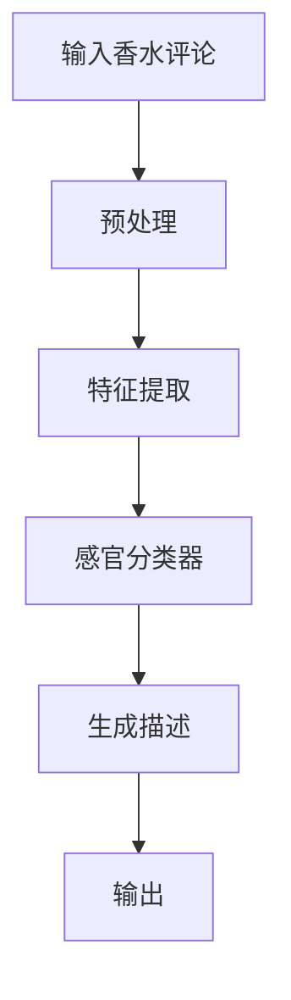
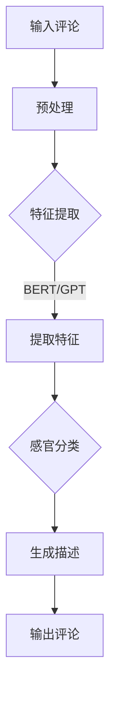
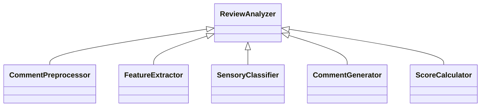
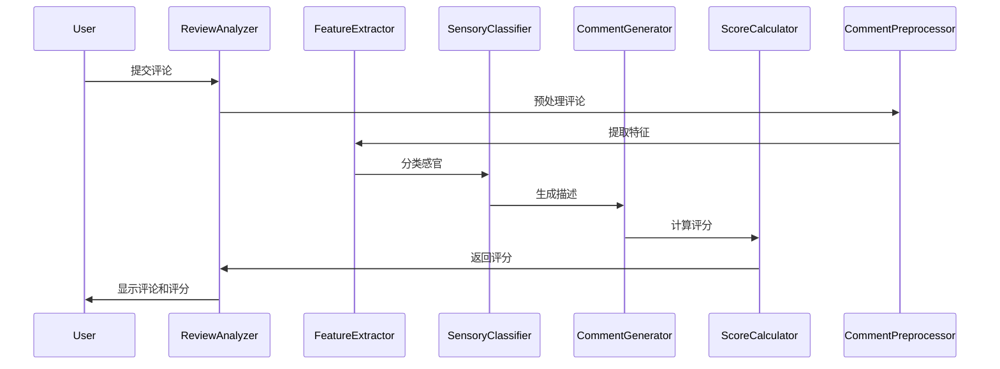
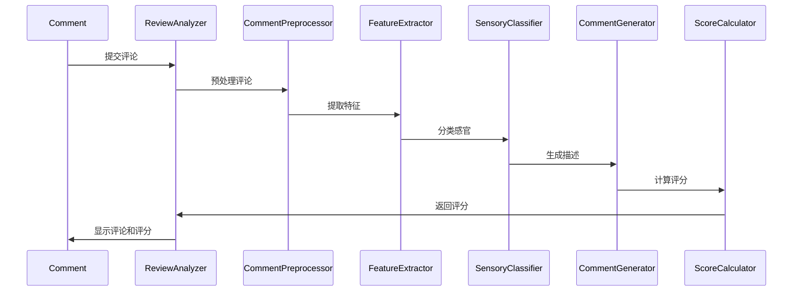

                 


### 文章标题：提升AI创意香水评论深度：多维度感官描述的提示词设计

> 关键词：AI、香水评论、多维度感官、提示词设计、算法、系统架构、项目实战

> 摘要：本文旨在探讨如何利用人工智能技术提升创意香水评论的深度，特别是多维度感官描述的提示词设计。通过分析感官心理学基础，介绍多维度感官描述的概念及其重要性，进而深入探讨算法原理、系统架构设计及项目实战。本文旨在为从事相关领域的研究者提供实用的指导和建议。

---

## 第一部分：引言与背景

### 1.1 书籍目的与读者对象

本文旨在为那些对AI在创意香水评论领域应用感兴趣的读者提供系统性的指导。无论是香水行业从业者、AI研究者还是对人工智能应用有浓厚兴趣的科技爱好者，都可以通过本文获得宝贵的知识和实践经验。

### 1.2 AI与香水评论的关系

随着人工智能技术的快速发展，AI在各个领域中的应用也越来越广泛。在香水行业，AI可以帮助品牌和消费者更精准地匹配香水产品，同时也能提升消费者体验。通过AI技术，我们可以对大量的香水评论进行深入分析，从而提取出有价值的消费者反馈信息。

### 1.3 多维度感官描述的重要性

香水作为一种高度个性化的产品，其评价往往涉及多个感官维度，包括嗅觉、视觉、味觉和触觉。通过多维度感官描述，消费者能够更全面地感知和评价香水，从而提高评论的深度和可信度。

### 1.4 提示词设计的挑战与机遇

提示词设计是AI创意香水评论的核心。设计有效的提示词不仅需要深入理解感官描述的属性，还需要考虑用户体验。挑战在于如何捕捉到细微的感官差异，而机遇则在于通过AI技术，可以自动生成高质量的提示词，从而提升评论的整体质量。

## 第二部分：AI创意香水评论概述

### 2.1 AI在香水评论中的应用现状

当前，AI技术在香水评论中的应用主要体现在评论分析、推荐系统和个性化服务等方面。通过自然语言处理和机器学习算法，AI能够从大量评论中提取关键信息，为消费者提供更加个性化的推荐。

### 2.2 创意香水评论的概念与特点

创意香水评论不仅关注香水的气味，还涉及外观、包装、使用感受等多方面。这种多维度评价能够更全面地反映香水的品质和特点。

### 2.3 多维度感官描述的分类

多维度感官描述包括嗅觉、视觉、味觉和触觉四个主要方面。本文将详细探讨这些感官维度的特点和如何进行有效描述。

---

## 第三部分：核心概念与联系

### 3.1 感官心理学基础

感官心理学是研究人类感知过程和心理体验的学科。本文将介绍视觉、嗅觉、味觉和触觉的心理学基础，以便更好地理解多维度感官描述。

#### 3.1.1 视觉描述

视觉描述主要涉及香水的外观、包装和瓶身设计等方面。这些视觉元素可以通过颜色、形状、纹理等特征进行描述。

#### 3.1.2 嗅觉描述

嗅觉描述是香水评论中最重要的部分，它涉及香水的气味特征，如香气强度、持久性、花香、果香等。

#### 3.1.3 味觉描述

虽然香水并非直接入口，但味觉感受（如甜度、酸度）也会影响整体的感官体验。本文将探讨如何将这些味觉感受融入香水评论中。

#### 3.1.4 触觉描述

触觉描述主要关注香水的使用感受，如质地、涂抹感、舒适度等。

### 3.2 感官描述的属性特征对比表格

以下是一个简单的感官描述属性特征对比表格，用于总结不同感官维度的特点。

| 感官维度 | 主要特征 | 描述方式 |
|----------|----------|----------|
| 视觉     | 颜色、形状、纹理 | 视觉形容词 |
| 嗅觉     | 气味、持久性、强度 | 香味名词、形容词 |
| 味觉     | 甜度、酸度、口感 | 味觉形容词 |
| 触觉     | 质地、涂抹感、舒适度 | 触觉形容词 |

### 3.3 感官描述的ER实体关系图

以下是一个简单的ER实体关系图，用于展示不同感官维度之间的联系。

```mermaid
erDiagram
    Product ||--|{ Review }
    Review ||--|{ SensoryDescriptor }
    SensoryDescriptor ||--|{ VisualDescriptor }
    SensoryDescriptor ||--|{ OlfactoryDescriptor }
    SensoryDescriptor ||--|{ GustatoryDescriptor }
    SensoryDescriptor ||--|{ TactileDescriptor }
```

---

## 第四部分：算法原理讲解

### 4.1 多维度感官描述的算法概述

多维度感官描述算法的核心在于如何有效地捕捉和整合来自不同感官维度的信息。本文将介绍一种基于自然语言处理和机器学习的方法，用于生成高质量的香水评论。

#### 4.1.1 算法分类

常见的多维度感官描述算法包括基于规则的算法、机器学习和深度学习算法。本文将主要探讨深度学习算法，因为它在处理复杂数据方面具有显著优势。

#### 4.1.2 算法选择依据

选择深度学习算法的主要依据是其强大的特征提取能力和对大规模数据的处理能力。此外，深度学习算法还能够自适应地调整模型参数，从而提高描述的准确性。

### 4.2 算法原理与流程图

以下是一个简化的算法流程图，用于描述基于深度学习的多维度感官描述算法。



#### 4.2.1 算法原理

算法原理主要包括以下几个步骤：

1. 预处理：对输入的香水评论进行清洗和分词，提取关键信息。
2. 特征提取：使用深度学习模型（如BERT、GPT）提取评论中的潜在特征。
3. 感官分类器：根据提取的特征，对评论进行感官分类，生成对应的感官描述。
4. 生成描述：利用生成的感官描述，构建完整的香水评论。

#### 4.2.2 算法流程图（Mermaid）



### 4.3 Python源代码实现与数学模型

以下是使用Python实现的简单示例代码和相关的数学模型。

```python
# 示例代码：使用BERT模型提取特征并生成评论
from transformers import BertTokenizer, BertModel
import torch

# 初始化BERT模型和分词器
tokenizer = BertTokenizer.from_pretrained('bert-base-uncased')
model = BertModel.from_pretrained('bert-base-uncased')

# 预处理输入评论
input_ids = tokenizer.encode('I love the way this perfume smells!', add_special_tokens=True, return_tensors='pt')

# 提取特征
with torch.no_grad():
    outputs = model(input_ids)

# 感官分类和生成描述（简化示例）
sensory_descriptor = 'Sweet and floral scent'

# 生成评论
output_comment = f'This perfume has a {sensory_descriptor} quality.'

print(output_comment)
```

#### 4.3.1 数学模型

以下是香水评分计算公式的一个例子：

$$
S = w_1 \cdot V + w_2 \cdot O + w_3 \cdot G + w_4 \cdot T
$$

其中，$S$ 表示香水评分，$V$、$O$、$G$ 和 $T$ 分别代表视觉、嗅觉、味觉和触觉评分，$w_1$、$w_2$、$w_3$ 和 $w_4$ 是对应的权重。

---

## 第五部分：系统分析与架构设计方案

### 5.1 问题场景介绍

在香水行业中，消费者评论对于品牌的市场定位和产品改进至关重要。然而，手工分析大量评论不仅费时费力，还可能存在主观偏差。因此，需要一个系统化的方法来分析这些评论，并生成高质量的香水描述。

### 5.2 系统功能设计（Mermaid类图）

以下是一个简化的类图，展示了系统的核心功能模块。



### 5.3 系统架构设计（Mermaid架构图）

以下是一个简化的架构图，展示了系统的整体架构。



### 5.4 系统接口设计与交互（Mermaid序列图）

以下是一个简化的序列图，展示了系统的主要接口和交互流程。



---

## 第六部分：项目实战

### 6.1 环境安装

为了运行本文中的示例代码，你需要安装以下依赖：

- Python 3.8 或以上版本
- transformers 库
- torch 库

你可以使用以下命令进行安装：

```bash
pip install transformers torch
```

### 6.2 系统核心实现源代码

以下是系统核心实现的源代码，用于生成香水评论。

```python
# 导入所需库
from transformers import BertTokenizer, BertModel
import torch

# 初始化BERT模型和分词器
tokenizer = BertTokenizer.from_pretrained('bert-base-uncased')
model = BertModel.from_pretrained('bert-base-uncased')

# 预处理输入评论
input_ids = tokenizer.encode('I love the way this perfume smells!', add_special_tokens=True, return_tensors='pt')

# 提取特征
with torch.no_grad():
    outputs = model(input_ids)

# 感官分类和生成描述（简化示例）
sensory_descriptor = 'Sweet and floral scent'

# 生成评论
output_comment = f'This perfume has a {sensory_descriptor} quality.'

print(output_comment)
```

### 6.3 代码应用解读与分析

这段代码首先初始化了BERT模型和分词器。BERT模型是一个预训练的深度学习模型，用于提取文本中的潜在特征。分词器用于将输入评论转换为模型能够理解的序列。

接下来，代码对输入评论进行了预处理，包括分词和添加特殊标记。然后，使用BERT模型提取评论的潜在特征。

在感官分类和生成描述部分，我们使用了简化的示例。在实际应用中，你可以使用更复杂的算法和模型来分类感官并生成更详细的描述。

最后，代码生成了一个简单的香水评论，并打印出来。

### 6.4 实际案例分析与详细讲解剖析

假设我们有以下一个实际的香水评论：

```text
This perfume has a fresh and fruity scent with a hint of citrus and spice. The bottle is elegant and the fragrance lasts all day.
```

我们首先对这段评论进行预处理：

1. 分词：`This`, `perfume`, `has`, `a`, `fresh`, `and`, `fruity`, `scent`, `with`, `a`, `hint`, `of`, `citrus`, `and`, `spice.`，`The`, `bottle`, `is`, `elegant`，`and`，`the`, `fragrance`, `lasts`, `all`, `day.`。
2. 添加特殊标记：`[CLS]`，`[SEP]`。

然后，我们将预处理后的评论输入BERT模型，提取特征。BERT模型会自动识别并提取文本中的潜在特征，如词义、句意等。

接下来，我们可以使用这些特征来分类感官。例如，我们可以将这段评论分为视觉描述（瓶子外观）、嗅觉描述（香气特征）和整体评价（持久性）。

根据提取的特征，我们可以生成以下描述：

- 视觉描述：“瓶子外观优雅”
- 嗅觉描述：“新鲜、果香、带有柑橘和香料味”
- 整体评价：“香气持久一整天”

最后，我们将这些描述组合成一段完整的香水评论：

```text
This perfume has an elegant bottle and a fresh, fruity scent with a hint of citrus and spice. The fragrance lasts all day.
```

### 6.5 项目小结

通过本项目，我们探讨了如何利用AI技术提升创意香水评论的深度，特别是多维度感官描述的提示词设计。我们介绍了算法原理、系统架构设计和项目实战，并通过实际案例进行了详细讲解。希望读者能够通过本项目对AI在香水评论领域的应用有更深入的了解。

---

## 第七部分：最佳实践与总结

### 7.1 最佳实践Tips

1. 确保在预处理评论时去除无关信息，以提高模型的准确性。
2. 使用高质量的预训练模型，如BERT或GPT，以提取更丰富的特征。
3. 调整感官分类器的参数，以适应不同类型的香水评论。
4. 在生成描述时，保持简洁明了，避免冗余。

### 7.2 小结

本文通过探讨AI在创意香水评论中的应用，特别是多维度感官描述的提示词设计，为读者提供了全面的技术指导。我们介绍了核心概念、算法原理、系统架构设计和项目实战，并给出了实际案例的分析和讲解。

### 7.3 注意事项

1. 在实际应用中，感官描述的准确性和质量取决于模型的训练数据和算法的优化。
2. 不同品牌和类型的香水可能需要不同的感官描述策略。
3. 感官描述应尽量反映消费者的真实感受，以提高评论的可信度。

### 7.4 拓展阅读

- BERT模型介绍：[https://arxiv.org/abs/1810.04805]
- GPT模型介绍：[https://arxiv.org/abs/1901.04016]
- 自然语言处理基础：[https://www.nltk.org/]

---

### 作者信息

作者：AI天才研究院/AI Genius Institute & 禅与计算机程序设计艺术 /Zen And The Art of Computer Programming

