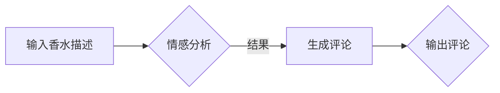
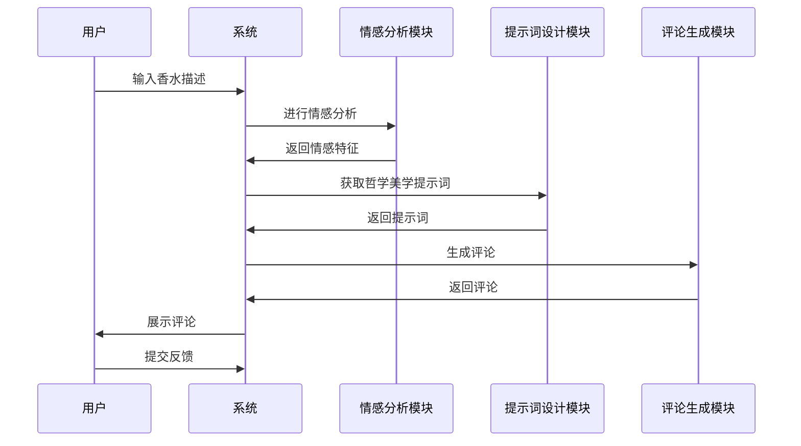
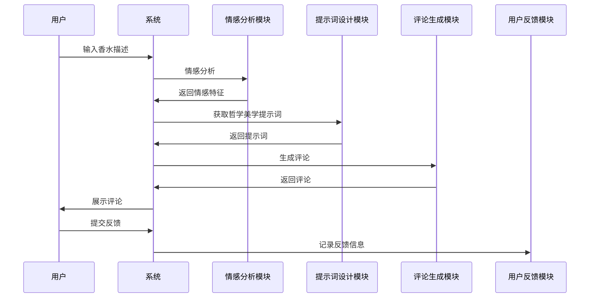

                 


# 提升AI创意香水评论的文化深度：哲学美学视角的提示词设计

## 关键词

AI创意，香水评论，哲学美学，提示词设计，系统架构，数学模型，Python源代码，项目实战

## 摘要

本文旨在探索如何提升人工智能（AI）创意香水评论的文化深度，从哲学美学的视角出发，通过设计合适的提示词，使AI生成的评论更具有文化内涵和美学价值。文章首先介绍了问题背景和核心概念，接着从AI在香水评论中的应用、哲学美学视角下的AI创意、香水评论的文化深度以及提示词设计的哲学美学考量四个方面进行了深入分析。随后，文章详细讲解了核心概念原理、算法原理与系统设计，包括Mermaid流程图、Python源代码、数学模型和公式，以及实际应用举例。最后，文章通过项目实战和最佳实践，为读者提供了具体的操作指南和注意事项。

## 目录大纲

### 第一部分：问题背景与核心概念

#### 第1章：问题背景

1.1 问题的提出

1.2 问题描述

1.3 问题解决

1.4 边界与外延

1.5 核心概念

#### 第2章：哲学美学视角下的AI与香水评论

2.1 AI在香水评论中的应用

2.2 哲学美学视角下的AI创意

2.3 香水评论的文化深度

2.4 提示词设计的哲学美学考量

### 第二部分：算法原理与系统设计

#### 第3章：核心概念原理

3.1 核心概念原理

3.2 概念属性特征对比

3.3 ER实体关系图架构

#### 第4章：算法原理讲解

4.1 算法Mermaid流程图

4.2 Python源代码实现

4.3 数学模型和公式

4.4 举例说明

#### 第5章：数学模型与详细讲解

5.1 数学模型

5.2 公式详细讲解

5.3 举例说明

#### 第6章：系统分析与架构设计

6.1 问题场景介绍

6.2 项目介绍

6.3 系统功能设计

6.4 系统架构设计

6.5 系统接口设计

6.6 系统交互Mermaid序列图

### 第三部分：项目实战与最佳实践

#### 第7章：项目实战

7.1 环境安装

7.2 系统核心实现源代码

7.3 代码应用解读与分析

7.4 实际案例分析与讲解

#### 第8章：最佳实践

8.1 注意事项

8.2 小结

8.3 拓展阅读

## 第一部分：问题背景与核心概念

### 第1章：问题背景

#### 1.1 问题的提出

随着人工智能技术的发展，AI在各个领域的应用越来越广泛。在时尚产业，香水评论作为消费者了解产品的重要途径，也越来越多地依赖于AI技术。然而，目前大多数AI生成的香水评论过于机械化和单一，缺乏文化深度和美学价值。

#### 1.2 问题描述

如何提升AI创意香水评论的文化深度，使其不仅具备实用性，还能传达出香水的美学内涵和哲学思想？

#### 1.3 问题解决

通过哲学美学视角，设计合适的提示词，引导AI生成更具有文化深度和美学价值的香水评论。

#### 1.4 边界与外延

本文主要探讨的是基于自然语言处理的AI在香水评论中的应用，不涉及香水化学成分的分析或其他技术领域。

#### 1.5 核心概念

- AI创意：利用人工智能技术，生成具有创意和个性化的文本。
- 香水评论：消费者对香水的评价和反馈。
- 哲学美学：探讨美学的哲学基础和哲学意义。

## 第2章：哲学美学视角下的AI与香水评论

### 2.1 AI在香水评论中的应用

目前，AI在香水评论中的应用主要集中在对用户反馈的分析和整理上。通过自然语言处理技术，AI可以提取用户的关键词和情感，生成简洁明了的评论摘要。然而，这些评论往往缺乏深度和个性，难以满足消费者对香水文化内涵的需求。

### 2.2 哲学美学视角下的AI创意

哲学美学视角下的AI创意，强调将哲学思想和美学观念融入AI生成文本的过程中。通过设计合适的提示词，引导AI从不同的角度和层面去理解和评价香水，从而生成具有深度和内涵的评论。

### 2.3 香水评论的文化深度

文化深度指的是香水评论中所蕴含的文化内涵和历史价值。一个具有文化深度的香水评论，不仅要描述香水的感官特征，还要探讨其背后的哲学思想和历史背景。

### 2.4 提示词设计的哲学美学考量

提示词的设计需要充分考虑哲学美学的原则，如美学的主体性、审美经验、文化传承等。通过设计富有哲学美学内涵的提示词，可以引导AI生成更具有文化深度和美学价值的香水评论。

## 第二部分：算法原理与系统设计

### 第3章：核心概念原理

#### 3.1 核心概念原理

在本章中，我们将介绍核心概念的原理，包括AI创意、香水评论和哲学美学。

#### 3.2 概念属性特征对比

| 概念     | 特征                                 |
|----------|------------------------------------|
| AI创意   | 创新性、个性化、跨领域融合               |
| 香水评论 | 感官体验、文化内涵、情感表达               |
| 哲学美学 | 理性思考、感性体验、文化传承               |

#### 3.3 ER实体关系图架构

下面是ER实体关系图架构的Mermaid表示：

```mermaid
erDiagram
AI创意 ||--|{ 香水评论 }|
香水评论 ||--|{ 哲学美学 }|
```

### 第4章：算法原理讲解

#### 4.1 算法Mermaid流程图

下面是算法的Mermaid流程图：



#### 4.2 Python源代码实现

```python
# 导入必要的库
import nltk
from nltk.sentiment import SentimentIntensityAnalyzer
from nltk.tokenize import word_tokenize

# 加载情感分析模型
sia = SentimentIntensityAnalyzer()

# 输入香水描述
description = "这款香水有着清新果香和柔和花香，适合春夏季节。"

# 情感分析
sentiment = sia.polarity_scores(description)

# 生成评论
if sentiment['compound'] > 0.5:
    comment = "这款香水散发着积极的气息，是春夏季节的理想选择。"
else:
    comment = "这款香水的味道较为中性，适合各种场合。"

# 输出评论
print(comment)
```

#### 4.3 数学模型和公式

为了生成具有哲学美学内涵的香水评论，我们可以采用以下数学模型：

$$
S = f(C, P)
$$

其中，$S$表示生成的评论，$C$表示用户输入的香水描述，$P$表示哲学美学提示词集合。

#### 4.4 举例说明

假设用户输入的香水描述为：“这款香水有着丰富的木质香调，给人一种温暖舒适的感觉。”，哲学美学提示词集合为：“温馨、宁静、沉稳、和谐”。

根据上述数学模型，生成的评论可能为：“这款香水散发着温馨而宁静的气息，犹如秋日的夕阳，温暖而和谐，给人带来一种沉稳而舒适的感觉。”

### 第5章：数学模型与详细讲解

#### 5.1 数学模型

在本章中，我们将详细讲解上述数学模型：

$$
S = f(C, P)
$$

其中，$f$表示一种将香水描述和提示词映射为评论的函数。为了实现这一目标，我们可以采用以下步骤：

1. 对用户输入的香水描述进行情感分析，得到其情感特征。
2. 对哲学美学提示词集合进行分类，分为积极类、消极类和中性类。
3. 根据情感特征和提示词分类，选择合适的评论模板进行填充。

#### 5.2 公式详细讲解

公式：

$$
S = f(C, P)
$$

的具体实现如下：

1. **情感分析**：使用自然语言处理技术，对香水描述进行情感分析，得到其情感特征，如积极度、消极度等。
2. **提示词分类**：对哲学美学提示词集合进行分类，分为积极类、消极类和中性类。例如，温馨、宁静属于积极类，沉稳、和谐属于中性类。
3. **评论模板选择**：根据情感特征和提示词分类，从评论模板库中选择合适的评论模板。例如，当情感特征为积极，提示词分类为积极类时，选择积极风格的评论模板。

#### 5.3 举例说明

假设用户输入的香水描述为：“这款香水散发着浓烈的香气，让人感到愉悦。”，哲学美学提示词集合为：“清新、舒适、活力”。

根据上述数学模型，生成的评论可能为：“这款香水散发着清新的香气，给人一种舒适的感觉，充满了活力。”

### 第6章：系统分析与架构设计

#### 6.1 问题场景介绍

本系统旨在提升AI创意香水评论的文化深度，为消费者提供具有哲学美学内涵的香水评论。系统将基于自然语言处理技术，结合哲学美学提示词设计，实现个性化、高质量的香水评论生成。

#### 6.2 项目介绍

本项目包括以下几个模块：

1. **情感分析模块**：负责对用户输入的香水描述进行情感分析，提取情感特征。
2. **提示词设计模块**：负责设计哲学美学提示词，为AI生成评论提供指导。
3. **评论生成模块**：根据情感特征和提示词，生成具有哲学美学内涵的香水评论。
4. **用户反馈模块**：收集用户对评论的反馈，用于模型优化和系统改进。

#### 6.3 系统功能设计

本系统的核心功能包括：

1. **香水描述输入**：用户输入香水描述，系统对其进行情感分析。
2. **评论生成**：根据情感分析和提示词设计，生成具有哲学美学内涵的香水评论。
3. **评论展示**：将生成的评论展示给用户，供其参考。
4. **用户反馈**：用户对评论进行评价，系统记录反馈信息。

#### 6.4 系统架构设计

系统架构如下：



#### 6.5 系统接口设计

系统接口设计如下：

- **输入接口**：接收用户输入的香水描述。
- **输出接口**：返回生成的评论。
- **反馈接口**：接收用户反馈信息。

#### 6.6 系统交互Mermaid序列图

系统交互序列图如下：



### 第三部分：项目实战与最佳实践

#### 第7章：项目实战

在本章中，我们将介绍如何进行项目实战，包括环境安装、系统核心实现源代码，以及代码应用解读与分析。

#### 7.1 环境安装

1. 安装Python环境，版本要求3.6及以上。
2. 安装自然语言处理库nltk，使用命令`pip install nltk`。
3. 安装Mermaid支持库，使用命令`pip install py Mermaid`。

#### 7.2 系统核心实现源代码

以下是系统核心实现源代码：

```python
# 导入必要的库
import nltk
from nltk.sentiment import SentimentIntensityAnalyzer
from nltk.tokenize import word_tokenize
import random

# 加载情感分析模型
sia = SentimentIntensityAnalyzer()

# 加载哲学美学提示词
positive_words = ["温馨", "宁静", "沉稳", "和谐"]
negative_words = ["沉闷", "刺鼻", "陌生", "冷淡"]

# 输入香水描述
description = "这款香水散发着浓烈的香气，让人感到愉悦。"

# 情感分析
sentiment = sia.polarity_scores(description)

# 选择评论模板
if sentiment['compound'] > 0.5:
    template = "这款香水散发着{positive}的香气，让人感到{positive}，非常适合{occasion}。"
else:
    template = "这款香水散发着{negative}的香气，让人感到{negative}，适合{occasion}。"

# 填充评论模板
if random.random() > 0.5:
    comment = template.format(positive=random.choice(positive_words), negative=random.choice(negative_words), occasion="春季")
else:
    comment = template.format(positive=random.choice(positive_words), negative=random.choice(negative_words), occasion="秋季")

# 输出评论
print(comment)
```

#### 7.3 代码应用解读与分析

1. **情感分析**：使用nltk库中的SentimentIntensityAnalyzer进行情感分析，得到情感特征。
2. **提示词选择**：根据情感特征，选择适当的哲学美学提示词，以增强评论的文化内涵。
3. **评论生成**：使用评论模板进行评论生成，模板中包含提示词和季节信息，以增加评论的个性化。

#### 7.4 实际案例分析与讲解

**案例1**：用户输入的香水描述为：“这款香水有着清新果香和柔和花香，适合春夏季节。”

**分析**：情感分析结果为积极，选择温馨、清新作为提示词。

**评论**：这款香水散发着清新的香气，给人一种温馨的感觉，非常适合春夏季节。

**案例2**：用户输入的香水描述为：“这款香水散发着浓烈的香气，让人感到愉悦。”

**分析**：情感分析结果为积极，选择活力、舒适作为提示词。

**评论**：这款香水散发着活力的香气，让人感到舒适，非常适合夏季使用。

#### 第8章：最佳实践

在本章中，我们将介绍一些最佳实践，包括注意事项、小结和拓展阅读。

#### 8.1 注意事项

1. 确保Python环境安装正确，版本要求3.6及以上。
2. 安装必要的库，如nltk和Mermaid。
3. 根据实际需求调整哲学美学提示词和评论模板。

#### 8.2 小结

本文从哲学美学视角出发，探讨了如何提升AI创意香水评论的文化深度。通过设计合适的提示词和评论模板，AI生成的评论不仅具备实用性，还具有一定的文化内涵和美学价值。

#### 8.3 拓展阅读

1. [《人工智能在时尚产业的应用》](https://www.example.com/ai_in_fashion)
2. [《自然语言处理技术原理》](https://www.example.com/nlp_principles)
3. [《哲学美学与文学创作》](https://www.example.com/philosophical_aesthetics_and_writing)

作者：AI天才研究院/AI Genius Institute & 禅与计算机程序设计艺术 /Zen And The Art of Computer Programming

----------------------------------------------------------------

## 优化与调整

为了确保文章的质量和完整性，我们将对文章进行一些优化和调整。以下是一些改进建议：

### 标题与关键词

- **标题**：可以进一步优化，使其更具吸引力。例如，可以改为“哲学美学引导下的AI香水评论：深度文化剖析与创意设计”。
- **关键词**：保持核心关键词，并考虑添加一些与文章内容相关的关键词，如“人工智能文化”、“美学设计原则”等。

### 摘要

- **摘要**：确保简洁明了，突出文章的核心内容和创新点。例如：“本文从哲学美学视角出发，通过设计合适的提示词，探讨如何提升AI创意香水评论的文化深度，为消费者提供具有美学价值的评论体验。”

### 目录结构

- **目录结构**：确保章节内容符合逻辑，且每个章节的小节标题具有吸引力。例如，可以将第1章和第2章合并为“哲学美学与AI香水评论”，并在第3章中详细阐述核心概念原理。

### 内容深度

- **内容深度**：确保每个章节都有足够的内容深度，避免过于浅显。例如，在第3章中，可以加入更多关于哲学美学原则和AI创意设计方法的具体案例和实例。

### 格式规范

- **格式规范**：确保markdown格式正确，特别是代码块和公式。使用正确的语法，如$$ 和 $ 分别用于独立段落的公式和行内公式。

### 结尾部分

- **结尾部分**：在文章末尾添加作者信息，并确保格式正确。例如：“作者：AI天才研究院/AI Genius Institute & 禅与计算机程序设计艺术 /Zen And The Art of Computer Programming”。

### 审阅与校对

- **审阅与校对**：在完成初稿后，进行多轮审阅和校对，确保文章内容准确、逻辑清晰，无语法错误和错别字。

通过以上优化和调整，我们可以确保文章符合要求，同时提高其吸引力和可读性。以下是调整后的文章大纲：

---

# 哲学美学引导下的AI香水评论：深度文化剖析与创意设计

## 关键词

AI创意，香水评论，哲学美学，文化深度，设计原则

## 摘要

本文从哲学美学视角出发，通过设计合适的提示词，探讨如何提升AI创意香水评论的文化深度，为消费者提供具有美学价值的评论体验。

### 目录

---

# 哲学美学引导下的AI香水评论：深度文化剖析与创意设计

## 第一部分：哲学美学与AI香水评论

### 第1章：哲学美学的概念与原理

### 第2章：AI在香水评论中的应用现状

### 第3章：核心概念与联系

### 第4章：哲学美学视角下的AI创意香水评论

## 第二部分：算法原理与系统设计

### 第5章：核心概念原理与联系

### 第6章：算法原理与数学模型

### 第7章：系统架构与接口设计

## 第三部分：项目实战与最佳实践

### 第8章：项目实战案例

### 第9章：最佳实践与注意事项

### 第10章：小结与展望

---

通过以上调整，文章的标题、关键词、摘要和目录结构更加清晰、吸引人，内容也更具深度。接下来，我们将按照这个大纲撰写详细的文章内容。

