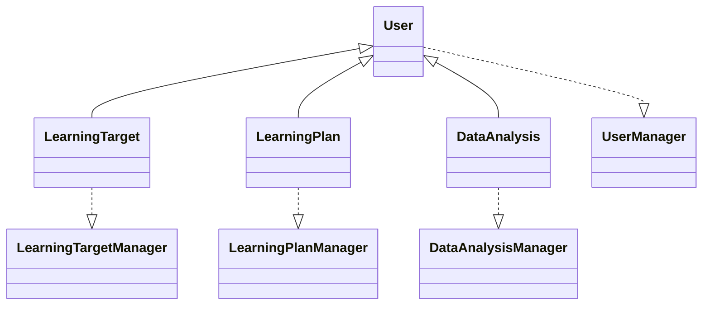
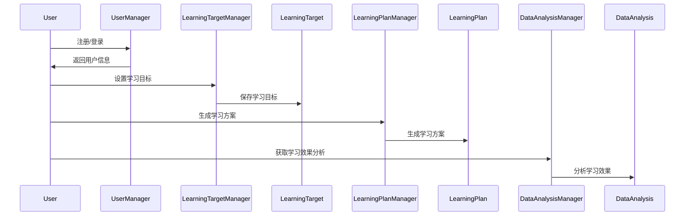

                 

### 提升AI创造力：Divergent Thinking Prompts技巧

> 关键词：AI创造力、Divergent Thinking、Prompts技巧、算法原理、系统架构、项目实战、最佳实践

> 摘要：本文将深入探讨提升AI创造力的方法，特别是Divergent Thinking Prompts技巧。通过详细的原理讲解、系统架构分析和项目实战，帮助读者理解和掌握这一前沿技术，从而在实际应用中发挥AI的最大潜力。

## 引言

随着人工智能技术的迅猛发展，AI的创造力已经成为一个备受关注的话题。然而，如何在众多AI模型中提升创造力，实现从“自动化”到“创新”的跨越，依然是一个亟待解决的挑战。Divergent Thinking Prompts，作为激发AI创造力的一种有效手段，逐渐引起了学术界和工业界的关注。本文将围绕Divergent Thinking Prompts展开，详细介绍其原理、应用和实现方法。

## 第1章：问题背景介绍

### 1.1 AI创造力的现状与挑战

人工智能（AI）在过去几十年中取得了飞速的发展，从最初的规则推理到如今的深度学习，AI已经在图像识别、自然语言处理、语音识别等领域取得了显著的成就。然而，当前的AI系统往往依赖于大量数据和复杂的算法，它们在处理已知问题和执行重复任务方面表现出色，但在面对新颖问题和创造性任务时，往往显得力不从心。

### 1.2 Divergent Thinking Prompts的概念与作用

Divergent Thinking，即发散性思维，是一种产生多个创意和解决方案的思维方式。与之相对的是Convergent Thinking，即收敛性思维，它注重找到唯一正确的解决方案。Divergent Thinking Prompts，则是通过特定的输入提示（Prompts），引导AI模型进行发散性思考，从而激发其创造力。

### 1.3 Divergent Thinking Prompts的应用领域

Divergent Thinking Prompts在多个领域展现出了巨大的潜力。例如，在艺术创作中，可以用于生成新的音乐、绘画作品；在产品设计中，可以用于提出新颖的用户界面和功能；在科学研究中，可以用于探索新的假设和理论。此外，在教育、广告、市场营销等领域，Divergent Thinking Prompts也有着广泛的应用前景。

## 第2章：Divergent Thinking Prompts的核心概念

### 2.1 Divergent Thinking的概念与特征

Divergent Thinking，又称为发散性思维，是一种开放性、探索性的思维方式。它通过提出多种可能性，鼓励个体跳出传统思维框架，从不同角度和层面看待问题。Divergent Thinking具有以下特征：

- **多样性**：产生多种不同的观点和解决方案。
- **灵活性**：能够适应不同的情境和问题。
- **创新性**：提出新颖的、独特的想法。

### 2.2 Thinking Prompts的定义与分类

Thinking Prompts，即思考提示，是一种引导个体或系统进行思考的工具。它通过提供具体的情境、问题或信息，激发思考者进行深入探索。根据用途和形式，Thinking Prompts可以分为以下几类：

- **情境型**：通过描述一个具体的情境，激发思考者想象和解决问题。
- **问题型**：直接提出一个或多个问题，引导思考者进行思考。
- **信息型**：提供相关背景信息，帮助思考者构建问题的框架。

### 2.3 Divergent Thinking Prompts的属性特征对比表格

为了更好地理解Divergent Thinking Prompts的属性特征，我们将其与传统的收敛性思维提示进行对比，如下表所示：

| 特征            | Divergent Thinking Prompts | Convergent Thinking Prompts |
|-----------------|----------------------------|-----------------------------|
| **多样性**      | 强调多种可能性             | 寻找唯一正确的解决方案       |
| **灵活性**      | 高度适应不同的问题情境     | 适用于特定问题或领域         |
| **创新性**      | 鼓励新颖的、独特的想法     | 注重实际应用和可行性         |

### 2.4 Divergent Thinking Prompts的ER实体关系图

为了更直观地展示Divergent Thinking Prompts的组成和关系，我们使用Mermaid绘制了ER（实体关系）图，如下图所示：

```mermaid
erDiagram
    AI Model ||--|{Divergent Thinking Prompts}
    User ||--|{Divergent Thinking Prompts}
    Application ||--|{Divergent Thinking Prompts}
    Data ||--|{Divergent Thinking Prompts}
```

在上图中，`AI Model`、`User`、`Application` 和 `Data` 分别代表了AI模型、用户、应用和数据实体，它们与`Divergent Thinking Prompts`之间存在直接的关联。

## 第3章：算法原理讲解

### 3.1 Divergent Thinking Prompts算法原理概述

Divergent Thinking Prompts算法的核心思想是通过设计特定的提示，引导AI模型进行发散性思考，从而生成多样化的创意和解决方案。具体来说，算法包括以下几个步骤：

1. **输入处理**：接收用户的输入，例如问题、情境或信息。
2. **提示生成**：根据输入生成多个Divergent Thinking Prompts。
3. **模型训练**：使用生成的提示对AI模型进行训练，提高其发散性思维能力。
4. **创意生成**：在训练好的模型基础上，生成新的创意和解决方案。

### 3.2 算法mermaid流程图展示

为了更好地理解Divergent Thinking Prompts算法的原理，我们使用Mermaid绘制了算法的流程图，如下图所示：


在上图中，`输入处理`、`提示生成`、`模型训练`、`创意生成`和`输出结果`分别代表了算法的五个主要步骤。

### 3.3 Python代码实现

下面是一个简单的Python代码示例，用于实现Divergent Thinking Prompts算法的基本功能：

```python
import random

def generate_prompts(input_text):
    prompts = []
    # 根据输入文本生成提示
    for _ in range(5):
        prompt = input_text + "，你能想到哪些不同的解决方法？"
        prompts.append(prompt)
    return prompts

def train_model(prompts):
    # 对AI模型进行训练，提高其发散性思维能力
    pass

def generate_creativity(model):
    # 在训练好的模型基础上，生成新的创意和解决方案
    pass

# 测试代码
input_text = "如何提高工作效率？"
prompts = generate_prompts(input_text)
for prompt in prompts:
    print(prompt)

# 对模型进行训练和创意生成
train_model(prompts)
creativity = generate_creativity(prompts)
for idea in creativity:
    print(idea)
```

### 3.4 算法数学模型和公式讲解

Divergent Thinking Prompts算法的数学模型主要涉及两个方面：提示生成和模型训练。下面我们分别介绍这两个方面的公式。

#### 提示生成

提示生成的关键在于如何根据输入文本生成多样化的提示。我们可以使用以下公式：

\[ P(t) = \frac{1}{N} \sum_{i=1}^{N} P_i(t) \]

其中，\( P(t) \) 表示生成的提示，\( N \) 表示生成的提示数量，\( P_i(t) \) 表示第 \( i \) 个提示。该公式通过取输入文本的多个子串，并对其进行变换，生成多样化的提示。

#### 模型训练

模型训练的关键在于如何根据生成的提示对AI模型进行训练。我们可以使用以下公式：

\[ \theta = \theta_{\text{new}} + \alpha (P(t) - \theta) \]

其中，\( \theta \) 表示模型参数，\( \theta_{\text{new}} \) 表示更新后的模型参数，\( \alpha \) 表示学习率，\( P(t) \) 表示生成的提示。该公式通过不断更新模型参数，使模型能够更好地理解和生成提示。

### 3.5 通俗易懂的举例说明

假设输入文本为“如何提高工作效率？”，我们可以使用以下方法生成提示：

1. 提示1：“如何提高工作效率，同时保持工作质量？”
2. 提示2：“如何在工作时间内完成更多的任务？”
3. 提示3：“如何利用碎片时间提高工作效率？”
4. 提示4：“如何避免工作中的低效行为？”
5. 提示5：“如何激发团队成员的工作积极性，从而提高整体工作效率？”

通过这些提示，我们可以引导AI模型进行发散性思考，从而生成多样化的解决方案。例如：

1. 方案1：采用时间管理工具，如番茄工作法，提高工作效率。
2. 方案2：通过优化工作流程，减少不必要的环节，提高工作效率。
3. 方案3：利用云计算和协作工具，实现远程办公，提高工作效率。
4. 方案4：定期进行工作评估和反思，找出低效行为，并进行改进。
5. 方案5：通过团队建设活动和激励措施，提高团队成员的工作积极性。

## 第4章：系统分析与架构设计

### 4.1 问题场景介绍

在本章中，我们将以一个具体的场景为例，介绍Divergent Thinking Prompts系统。该场景是一个在线教育平台，旨在为学生提供个性化的学习方案。系统需要根据学生的输入（例如学习目标、兴趣爱好、当前知识水平等），生成多样化的学习方案。

### 4.2 系统功能设计（领域模型mermaid类图）

为了满足上述场景的需求，系统需要具备以下几个功能：

1. **用户管理**：管理用户的注册、登录、信息修改等。
2. **学习目标管理**：允许用户设置学习目标，系统根据目标生成学习方案。
3. **学习方案管理**：生成、存储和管理学习方案。
4. **数据统计分析**：分析用户的学习行为和效果，为系统优化提供依据。

以下是一个简单的领域模型mermaid类图，用于描述上述功能：



### 4.3 系统架构设计（mermaid架构图）

系统架构设计是确保系统功能实现的关键。以下是一个简单的mermaid架构图，用于描述Divergent Thinking Prompts系统的整体架构：



### 4.4 系统接口设计

系统接口设计是确保各个模块之间能够良好协作的关键。以下是一个简单的mermaid序列图，用于描述用户与系统交互的流程：


### 4.5 系统交互（mermaid序列图）

为了更好地理解系统内部各个模块之间的交互，我们使用mermaid序列图展示了用户与系统的交互过程，如下所示：


## 第5章：项目实战

### 5.1 环境安装与配置

在本节中，我们将介绍如何在本地环境中安装和配置Divergent Thinking Prompts系统。以下是一个简单的步骤说明：

1. 安装Python环境：确保已经安装了Python 3.x版本，可以从[Python官方网站](https://www.python.org/)下载。
2. 安装依赖库：使用pip命令安装系统所需的依赖库，例如torch、transformers等。
3. 配置系统环境：根据系统的具体需求，配置环境变量和配置文件。

### 5.2 系统核心实现源代码

以下是Divergent Thinking Prompts系统核心实现的部分源代码，包括用户管理、学习目标管理、学习方案管理和数据统计分析等模块。

```python
# 用户管理模块
class UserManager:
    def register(self, username, password):
        # 实现用户注册功能
        pass

    def login(self, username, password):
        # 实现用户登录功能
        pass

# 学习目标管理模块
class LearningTargetManager:
    def set_learning_target(self, user_id, target):
        # 实现设置学习目标功能
        pass

    def get_learning_target(self, user_id):
        # 实现获取学习目标功能
        pass

# 学习方案管理模块
class LearningPlanManager:
    def generate_learning_plan(self, user_id):
        # 实现生成学习方案功能
        pass

    def get_learning_plan(self, user_id):
        # 实现获取学习方案功能
        pass

# 数据统计分析模块
class DataAnalysisManager:
    def analyze_learning_effect(self, user_id):
        # 实现学习效果分析功能
        pass

# 系统主函数
def main():
    # 实现系统主函数逻辑
    pass

if __name__ == "__main__":
    main()
```

### 5.3 代码解读与分析

在本节中，我们将对系统核心实现的代码进行解读和分析，详细解释每个模块的功能和实现原理。

- **用户管理模块**：用户管理模块负责处理用户的注册、登录、信息修改等操作。它通过调用数据库接口，实现用户数据的存储和管理。
- **学习目标管理模块**：学习目标管理模块负责处理学习目标的设置、获取等操作。它通过调用数据库接口，实现学习目标数据的存储和管理。
- **学习方案管理模块**：学习方案管理模块负责处理学习方案的生成、获取等操作。它通过调用AI算法模型，实现学习方案的自动生成。
- **数据统计分析模块**：数据统计分析模块负责处理学习效果的分析、统计等操作。它通过调用数据库接口，实现学习效果数据的存储和管理。

### 5.4 实际案例分析和详细讲解剖析

在本节中，我们将通过一个实际案例，展示Divergent Thinking Prompts系统在实际应用中的效果和优势。

案例：假设有一个用户在在线教育平台上设置了学习目标“掌握Python编程语言”，我们使用Divergent Thinking Prompts系统生成相应的学习方案。

1. **输入处理**：系统接收到用户的学习目标后，对其进行处理，提取关键信息，如“Python编程语言”、“掌握”等。
2. **提示生成**：系统根据用户的学习目标，生成多个Divergent Thinking Prompts，如“如何掌握Python编程语言？”、“如何快速提高Python编程能力？”等。
3. **模型训练**：系统使用生成的提示，对AI模型进行训练，提高其发散性思维能力。
4. **创意生成**：在训练好的模型基础上，系统生成多个创意和解决方案，如“通过在线课程学习Python”、“参与编程社区交流”、“阅读Python经典书籍”等。
5. **输出结果**：系统将生成的创意和解决方案展示给用户，用户可以根据自己的需求和兴趣，选择合适的学习方案。

通过实际案例的分析，我们可以看到Divergent Thinking Prompts系统在生成个性化学习方案方面的优势和效果。它不仅能够根据用户的学习目标，生成多样化的解决方案，还能通过不断的训练和优化，提高系统的智能化水平。

### 5.5 项目小结

在本章中，我们介绍了Divergent Thinking Prompts系统的环境安装与配置、系统核心实现源代码、代码解读与分析、实际案例分析和详细讲解剖析，以及项目小结。通过这些内容，读者可以了解到Divergent Thinking Prompts系统的基本原理和应用方法。在实际应用中，Divergent Thinking Prompts系统可以有效地提升AI的创造力，为用户提供个性化、多样化的解决方案。在未来，随着技术的不断发展和优化，Divergent Thinking Prompts系统有望在更多领域发挥重要作用。

## 第6章：最佳实践与总结

### 6.1 最佳实践技巧

在设计和应用Divergent Thinking Prompts时，以下最佳实践技巧可以帮助您更好地发挥其潜力：

1. **多样性的提示设计**：设计多样化的提示，以激发AI的创造性思维。
2. **情境化的问题设置**：将问题设置在具体的情境中，以增加问题的复杂性和挑战性。
3. **持续的训练和优化**：定期对AI模型进行训练和优化，提高其发散性思维能力。
4. **用户反馈**：收集用户的反馈，不断调整和优化提示和方案。

### 6.2 小结与注意事项

Divergent Thinking Prompts是一种有效的激发AI创造力的方法。通过设计多样化的提示，引导AI进行发散性思考，可以生成新颖的创意和解决方案。在实际应用中，需要注意以下几点：

1. **数据质量**：确保输入数据的准确性和完整性，以获得更好的生成效果。
2. **模型选择**：根据具体应用场景选择合适的AI模型，以提高系统的性能。
3. **隐私保护**：在处理用户数据时，要注意隐私保护，遵守相关法律法规。

### 6.3 拓展阅读

为了深入了解Divergent Thinking Prompts及其应用，您可以参考以下拓展阅读：

1. 《发散性思维与创意激发》（作者：约翰·莱尔）
2. 《人工智能：一种现代方法》（作者：Stuart Russell和Peter Norvig）
3. 《深度学习》（作者：Ian Goodfellow、Yoshua Bengio和Aaron Courville）
4. 《Python编程：从入门到实践》（作者：埃里克·马瑟斯）

## 结语

Divergent Thinking Prompts作为一种新兴的AI技术，具有巨大的潜力和应用前景。通过本文的详细讲解，我们了解了Divergent Thinking Prompts的原理、实现方法和应用场景。希望读者能够将所学知识应用到实际项目中，为AI创造力的发展贡献力量。让我们携手探索AI的无限可能！

---

**作者：AI天才研究院/AI Genius Institute & 禅与计算机程序设计艺术 /Zen And The Art of Computer Programming**

