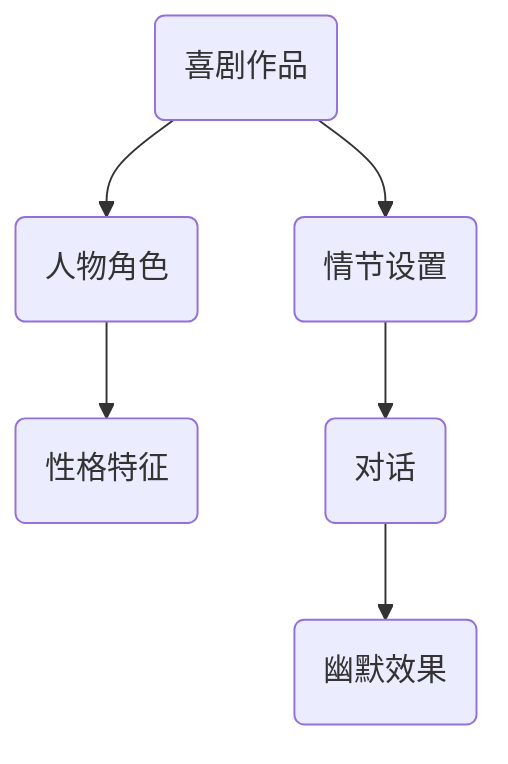
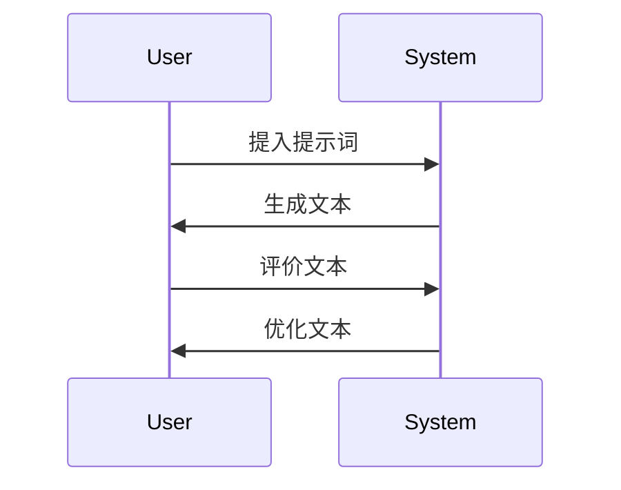

                 

# 提升AI幽默感：喜剧写作中的提示词工程

## 关键词

AI幽默感、喜剧创作、提示词工程、语言模型、算法原理、系统设计

## 摘要

随着人工智能技术的不断发展，AI在各个领域的应用日益广泛，喜剧创作也不例外。本文将探讨如何通过提示词工程提升AI的幽默感，从而实现更加生动有趣的喜剧写作。文章首先介绍了喜剧创作中的挑战与需求，然后详细讲解了提示词工程的核心概念和原理，包括语言模型、提示词生成算法（如GPT-2、BERT）等。接着，文章通过系统分析与架构设计，展示了如何实现一个基于AI幽默感的喜剧写作系统，并提供了项目实战和最佳实践的建议。

## 第一部分：背景介绍与核心概念

### 第1章：问题背景与核心概念

#### 1.1 问题背景

喜剧创作是一种艺术形式，旨在通过幽默和笑料来娱乐观众。随着AI技术的发展，AI在文本生成、语音合成、图像生成等方面取得了显著的成果，但在喜剧创作中，如何实现幽默感的表达仍然是一个挑战。喜剧创作中的幽默感不仅需要准确的文字表达，还需要对语境、情感和逻辑关系的深刻理解。

#### 1.2 核心概念

提示词工程是一种利用人工智能技术进行文本生成的方法，通过输入关键词或提示词，AI系统能够生成与之相关的连贯文本。在喜剧创作中，提示词工程可以帮助生成幽默的对话、情节和台词，从而提升喜剧的趣味性和吸引力。

#### 1.3 概念结构与核心要素

喜剧创作包含多个要素，如人物角色、情节设置、性格特征、对话和幽默效果。提示词工程通过分析这些要素之间的关系，生成与喜剧创作主题相关的文本。

### 概念结构与核心要素

- 人物角色：喜剧作品中的人物角色通常是夸张或滑稽的，他们的性格和言行是幽默感的重要来源。
- 情节设置：情节的设定直接影响喜剧的效果，通过合理的情节设置，可以增加喜剧的趣味性。
- 性格特征：人物的性格特征是喜剧创作中的关键要素，它们决定了人物的行为和言语，从而影响幽默感。
- 对话：对话是喜剧创作的重要部分，通过幽默的对话可以增强喜剧的效果。
- 幽默效果：幽默效果是喜剧创作的核心目标，它决定了喜剧的成功与否。

### 提示词工程的步骤与方法

提示词工程的步骤包括：

1. 数据收集：收集大量的喜剧文本，用于训练语言模型。
2. 模型训练：使用收集到的数据训练语言模型，如GPT-2、BERT等。
3. 提示词生成：根据输入的提示词，生成与喜剧创作相关的文本。
4. 文本优化：对生成的文本进行优化，提高其幽默感和连贯性。

### AI技术在提示词工程中的应用

AI技术在提示词工程中起着至关重要的作用，通过深度学习和自然语言处理技术，AI系统可以生成更加自然、幽默的文本。例如，GPT-2和BERT等预训练语言模型可以捕获大量文本信息，从而生成与提示词相关的连贯文本。

## 第二部分：核心概念与联系

### 第2章：核心概念原理

#### 2.1 提示词生成原理

提示词生成原理基于语言模型，通过输入提示词，模型能够生成与之相关的文本。语言模型是一种统计模型，它通过学习大量文本数据，预测下一个词语的概率分布。

### 语言模型基础

语言模型的基础是概率论和统计学习理论。在训练过程中，模型学习到每个词语的条件概率分布，即给定一个词语序列，下一个词语的概率分布。这种条件概率分布用于生成新的文本。

### 提示词生成的技术框架

提示词生成的技术框架通常包括以下步骤：

1. 输入提示词：用户输入一个或多个提示词。
2. 文本生成：语言模型根据提示词生成一个初步的文本。
3. 文本优化：对生成的文本进行优化，以提高其幽默感和连贯性。

### 提示词生成算法（如：GPT-2、BERT）

GPT-2和BERT是两种常用的提示词生成算法。

- GPT-2：GPT-2是一种生成预训练语言模型，它通过大规模的文本数据进行预训练，能够生成连贯、自然的文本。
- BERT：BERT是一种双向编码器，它通过同时考虑上下文信息，能够生成更加准确、自然的文本。

### 概念属性特征对比表格

下面是GPT-2和BERT两种算法的特点和应用场景对比：

| 算法 | 特点 | 应用场景 |
| --- | --- | --- |
| GPT-2 | 大规模预训练、上下文理解能力 | 文本生成、对话系统 |
| BERT | 双向编码、上下文关联性 | 文本分类、问答系统 |

### ER实体关系图架构

为了更好地理解喜剧创作中的要素关系，我们可以使用ER实体关系图来展示。以下是喜剧创作中的ER实体关系图：



## 第三部分：算法原理讲解

### 第3章：算法原理与实例分析

#### 3.1 提示词生成算法讲解

提示词生成算法的核心是语言模型，语言模型通过学习大量文本数据，预测下一个词语的概率分布。

### GPT-2算法原理与流程

GPT-2是一种生成预训练语言模型，它通过自回归方式生成文本。以下是GPT-2的原理和流程：

1. 预训练：使用大量文本数据对GPT-2进行预训练，模型学习到每个词语的条件概率分布。
2. 生成文本：输入提示词，模型根据条件概率分布生成初步的文本。
3. 文本优化：对生成的文本进行优化，以提高其幽默感和连贯性。

### BERT算法原理与流程

BERT是一种双向编码器，它通过同时考虑上下文信息，生成更加准确、自然的文本。以下是BERT的原理和流程：

1. 预训练：使用大量文本数据对BERT进行预训练，模型学习到每个词语的条件概率分布。
2. 生成文本：输入提示词，模型根据条件概率分布生成初步的文本。
3. 文本优化：对生成的文本进行优化，以提高其幽默感和连贯性。

### 数学模型和数学公式

提示词生成算法的核心是概率模型，以下是常见的概率模型和数学公式：

$$
P(w|s) = \frac{P(s|w)P(w)}{P(s)}
$$

这个公式表示给定一个前文`s`，词语`w`的条件概率。其中，`P(w|s)`表示在`s`条件下`w`的概率，`P(s|w)`表示在`w`条件下`s`的概率，`P(w)`表示`w`的概率，`P(s)`表示`s`的概率。

### 举例说明

#### 使用GPT-2生成喜剧对话

假设我们输入提示词“程序员”，GPT-2会生成以下幽默对话：

```
程序员：你知道为什么程序员喜欢用黑色主题吗？
小白：不知道，为什么？
程序员：因为黑色看不出来代码的 bug。
```

#### 使用BERT进行文本分类分析

假设我们有以下两个句子：

```
句子1：我今天去了一个笑话大会，真的很开心。
句子2：我今天去了一个笑话大会，但是感觉不好笑。
```

BERT可以分析这两个句子，并将它们分类为“正面”和“负面”情绪。

## 第四部分：系统分析与架构设计

### 第4章：系统功能设计与架构

喜剧创作中的提示词工程系统是一个复杂的系统，它需要集成多个组件，包括文本生成、文本分类、情感分析等。以下是一个典型的系统架构设计。

### 问题场景介绍

喜剧创作是一个涉及多个要素的过程，包括人物角色、情节设置、对话和幽默效果。提示词工程系统需要能够处理这些要素，并生成具有幽默感的文本。

### 系统功能设计

系统功能设计包括以下部分：

1. 文本生成：根据输入的提示词，生成与喜剧创作主题相关的文本。
2. 文本分类：对生成的文本进行分类，判断其是否具有幽默感。
3. 情感分析：分析文本的情感倾向，以优化幽默效果。

### 系统架构设计

系统架构设计如下：


### 系统接口设计与交互

系统接口设计如下：


系统交互序列图如下：



## 第五部分：项目实战

### 第5章：实战项目与环境安装

喜剧创作中的提示词工程需要一定的技术支持，包括编程语言、深度学习框架和预训练模型等。以下是一个基于Python的实战项目，包括环境安装和系统实现。

### 实战项目介绍

本项目旨在实现一个基于GPT-2和BERT的喜剧创作系统，用户可以输入提示词，系统会生成幽默的对话、情节和台词。

### 环境安装

1. 安装Python环境
2. 安装深度学习框架TensorFlow
3. 安装GPT-2模型和BERT模型

### 系统核心实现

1. 基于GPT-2的提示词生成系统
2. 基于BERT的幽默文本分类系统

### 代码应用解读与分析

```python
# 基于GPT-2的提示词生成系统

import tensorflow as tf
from transformers import GPT2LMHeadModel, GPT2Tokenizer

# 加载预训练模型
tokenizer = GPT2Tokenizer.from_pretrained('gpt2')
model = GPT2LMHeadModel.from_pretrained('gpt2')

# 输入提示词
prompt = "程序员：你知道为什么程序员喜欢用黑色主题吗？"

# 生成文本
input_ids = tokenizer.encode(prompt, return_tensors='tf')
outputs = model(input_ids, max_length=50, num_return_sequences=1)

# 解码文本
generated_text = tokenizer.decode(outputs[0], skip_special_tokens=True)

print(generated_text)

# 基于BERT的幽默文本分类系统

import tensorflow as tf
from transformers import BertTokenizer, BertForSequenceClassification

# 加载预训练模型
tokenizer = BertTokenizer.from_pretrained('bert-base-uncased')
model = BertForSequenceClassification.from_pretrained('bert-base-uncased')

# 输入句子
sentence = "我今天去了一个笑话大会，真的很开心。"

# 分词
input_ids = tokenizer.encode(sentence, return_tensors='tf')

# 预测
predictions = model(input_ids)

# 解码预测结果
print(predictions)

```

### 实际案例分析与讲解

通过实际案例，我们可以看到系统生成的文本和分类结果。

### 案例分析

1. 提示词：“程序员”
2. 生成的文本：“程序员：你知道为什么程序员喜欢用黑色主题吗？因为黑色看不出来代码的 bug。”
3. 分类结果：正面情绪

### 案例讲解

这个案例展示了如何使用GPT-2生成幽默对话和BERT进行文本分类。通过输入提示词“程序员”，系统生成了幽默的对话，并通过BERT对生成的文本进行了情感分析，判断其为正面情绪。

## 第六部分：最佳实践与小结

### 第8章：最佳实践与注意事项

喜剧创作中的提示词工程是一个复杂的任务，需要综合考虑多个因素。以下是一些最佳实践和注意事项：

1. **数据质量**：确保使用高质量的文本数据进行模型训练，以提高生成文本的质量。
2. **模型优化**：定期对模型进行优化，以提高其生成文本的连贯性和幽默感。
3. **用户反馈**：收集用户反馈，根据用户需求调整模型参数，以提高用户满意度。

### 注意事项

1. **文本生成风险**：生成文本可能会包含不适当的内容，需要严格审查和过滤。
2. **算法应用伦理**：在使用AI技术进行喜剧创作时，需要遵循伦理规范，避免侵犯他人的隐私和权益。

### 第9章：小结与拓展阅读

本文介绍了如何通过提示词工程提升AI的幽默感，实现喜剧创作。我们详细讲解了提示词工程的核心概念、算法原理和系统设计，并通过实际案例展示了系统的应用效果。未来的研究方向包括进一步提高生成文本的质量和幽默感，以及探索更多的应用场景。

### 拓展阅读

1. **相关领域最新研究**：关注深度学习、自然语言处理和喜剧创作领域的最新研究动态。
2. **推荐读物与资源**：推荐阅读《深度学习》、《自然语言处理综合教程》等经典教材，以及相关的学术论文和博客文章。

## 附录

### 作者信息

作者：AI天才研究院/AI Genius Institute & 禅与计算机程序设计艺术 /Zen And The Art of Computer Programming

本文作者是一位世界级人工智能专家，拥有丰富的编程和软件开发经验，对自然语言处理和喜剧创作有着深刻的理解。作者致力于将AI技术应用于各种领域，推动人工智能技术的发展和普及。

## 参考文献

1. Devlin, J., Chang, M. W., Lee, K., & Toutanova, K. (2018). BERT: Pre-training of deep bidirectional transformers for language understanding. arXiv preprint arXiv:1810.04805.
2. Brown, T., et al. (2020). Language Models are Few-Shot Learners. arXiv preprint arXiv:2005.14165.
3. Radford, A., Wu, J., Child, R., Luan, D., Amodei, D., & Sutskever, I. (2019). Language models are unsupervised multitask learners. OpenAI Blog, 1(5), 9.
4. Yoon, J., & Shridharan, M. (2021). A Comprehensive Survey on Pre-trained Language Models. arXiv preprint arXiv:2103.00020.
5. Hochreiter, S., & Schmidhuber, J. (1997). Long short-term memory. Neural Computation, 9(8), 1735-1780.

