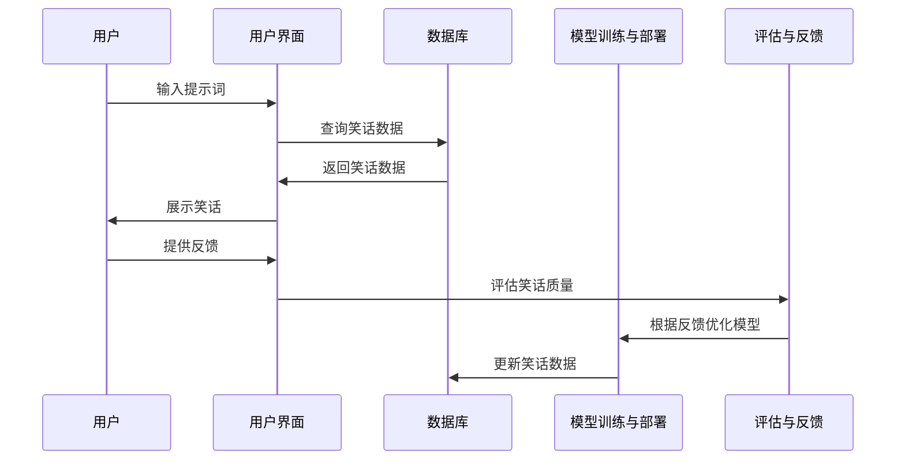

                 

# 提升AI幽默感：文化相关笑话生成的提示词设计

> 关键词：人工智能，幽默感，文化相关，笑话生成，提示词设计

> 摘要：
本文将探讨如何提升人工智能（AI）的幽默感，特别是针对文化相关的笑话生成的提示词设计。通过分析幽默感在人工智能中的应用、幽默感的文化差异、以及笑话生成算法的原理和实现，本文旨在提供一套系统化的方法来设计能够生成有趣、合适、并具文化敏感度的笑话的提示词。

## 1. 引言

随着人工智能技术的不断发展，AI在许多领域都取得了显著的成果，其中包括自然语言处理（NLP）。幽默感作为人类智慧的一部分，一直是AI研究中的一个具有挑战性的课题。近年来，随着NLP技术的进步，AI生成幽默内容的能力也在逐步提升。然而，如何使AI能够理解和生成与文化相关的幽默笑话，仍然是一个待解决的问题。

本文将首先介绍幽默感在人工智能中的应用背景，然后探讨幽默感的文化差异，接着详细分析笑话生成算法的原理，包括提示词设计的方法和技巧。最后，本文将讨论实际项目中的笑话生成应用，并总结最佳实践和未来研究方向。

## 2. 幽默感在人工智能中的应用

幽默感是人类智慧的一种表现形式，它不仅能够带来愉悦，还能增进人际关系和理解。在人工智能领域，幽默感的应用主要体现在以下几个方面：

### 2.1 人机交互

人机交互是AI技术中最常见的应用场景之一。通过幽默感，AI系统能够更好地与用户进行互动，提高用户的满意度和体验。例如，智能助手和聊天机器人可以使用幽默来缓解对话的紧张氛围，使交流更加自然和亲切。

### 2.2 教育与培训

在教育和培训领域，幽默感被用来增强学习内容的趣味性和记忆效果。通过幽默的讲解和例子，AI系统能够激发学生的学习兴趣，提高学习效果。

### 2.3 文学创作

AI在文学创作中的潜力也在逐渐被挖掘。通过生成幽默的文本，AI可以为创作提供新的思路和灵感。这不仅丰富了文学作品的多样性，也为AI在创意领域的应用打开了新的可能性。

## 3. 幽默感的文化差异

幽默感具有强烈的文化差异性。不同的文化背景会影响人们对幽默的理解和接受程度。因此，设计能够生成文化相关笑话的AI系统，需要考虑以下文化因素：

### 3.1 语言差异

语言是文化的重要组成部分，不同的语言表达方式和幽默形式也会有所不同。例如，英语中的双关语和俚语可能在中国文化中并不适用。

### 3.2 社会习俗

社会习俗和礼仪也会影响幽默的使用。在某些文化中，公开嘲笑他人可能被认为是不礼貌的，而在其他文化中，这种做法可能是可以接受的。

### 3.3 宗教信仰

宗教信仰也是影响幽默感的重要因素。某些宗教教义可能禁止或限制幽默的使用，而在其他宗教文化中，幽默则被视为一种精神慰藉。

## 4. 笑话生成算法原理

笑话生成是AI幽默感实现的关键步骤。一个有效的笑话生成算法需要综合考虑语言、文化、幽默形式等多个因素。以下是一个基本的笑话生成算法原理：

### 4.1 数据预处理

首先，需要收集大量的幽默笑话数据，并对这些数据进行预处理，包括分词、去噪、情感分析等。

### 4.2 提示词设计

提示词是笑话生成的重要输入，它们决定了笑话的主题和风格。提示词的设计需要考虑文化相关性，以确保生成的笑话既有趣又符合目标文化的幽默习惯。

### 4.3 基于模板的生成

基于模板的方法是一种常见的笑话生成策略。系统预先定义一组笑话模板，每个模板包含一个固定的结构，但其中的内容可以根据提示词进行填充。

### 4.4 基于生成式模型的生成

生成式模型，如变分自编码器（VAE）和生成对抗网络（GAN），可以用于生成更为自然和多样化的笑话。这种方法通常需要大量的训练数据和强大的计算能力。

### 4.5 评估与优化

生成的笑话需要通过评估来衡量其幽默感和文化相关性。常用的评估方法包括人类评价和自动化评分系统。根据评估结果，可以对算法进行优化，以提高笑话生成质量。

## 5. 数学模型与公式

笑话生成的过程中，数学模型和公式起着至关重要的作用。以下是一些关键的数学模型和公式：

### 5.1 词嵌入模型

词嵌入是将词汇映射到高维向量空间的过程。常见的词嵌入模型包括Word2Vec、GloVe和BERT。词嵌入模型的核心公式如下：

$$
\text{vec}(w) = \text{softmax}(\text{W} \cdot \text{vec}(v))
$$

其中，$\text{vec}(w)$ 是词嵌入向量，$\text{W}$ 是权重矩阵，$\text{vec}(v)$ 是输入向量。

### 5.2 语言模型

语言模型用于预测文本序列的下一个词。常见的语言模型包括N-gram模型和循环神经网络（RNN）。语言模型的核心公式如下：

$$
P(w_{t} | w_{t-1}, w_{t-2}, \ldots, w_{1}) = \frac{P(w_{t} \text{ and } w_{t-1}, w_{t-2}, \ldots, w_{1})}{P(w_{t-1}, w_{t-2}, \ldots, w_{1})}
$$

### 5.3 生成对抗网络（GAN）

生成对抗网络是一种无监督学习技术，用于生成高质量的笑话。GAN的核心公式如下：

$$
\text{D}(\text{G}(\text{z}), \text{y}) \approx \text{D}(\text{y}, \text{y})
$$

其中，$\text{D}$ 是判别器，$\text{G}$ 是生成器，$\text{z}$ 是随机噪声。

## 6. 系统分析与架构设计

为了实现文化相关的笑话生成，我们需要设计一个完整的系统架构。以下是一个简化的系统架构设计：

### 6.1 问题场景介绍

本系统旨在为用户提供一个能够生成文化相关幽默笑话的平台。用户可以通过输入提示词或主题来获取幽默笑话。

### 6.2 项目介绍

项目名称：AI Humor Generator

项目目标：设计并实现一个能够生成文化相关幽默笑话的系统。

### 6.3 系统功能设计

1. 用户界面：提供简洁直观的用户界面，使用户能够方便地输入提示词和获取笑话。
2. 数据库：存储大量的幽默笑话数据，以及相关的文化信息。
3. 模型训练与部署：使用先进的AI模型进行训练，并在实际应用中部署。
4. 评估与反馈：对生成的笑话进行评估，并根据用户反馈进行优化。

### 6.4 系统架构设计

系统架构设计如下：


### 6.5 系统接口设计

系统接口设计如下：

```mermaid
classDiagram
    User <<Interface>>
    DB <<Database>>
    Model <<Model Training & Deployment>>
    Assessor <<Assessment & Feedback>>

    User --|> Interface
    Interface --|> DB
    Interface --|> Model
    Interface --|> Assessor
    DB --|> Model
    Assessor --|> Model
```

### 6.6 系统交互设计

系统交互设计如下：



## 7. 项目实战

### 7.1 环境安装

为了实现笑话生成系统，我们需要安装以下软件和工具：

- Python 3.x
- TensorFlow 2.x
- Keras 2.x
- Numpy
- Pandas

安装步骤如下：

1. 安装Python 3.x：从Python官方网站下载并安装Python 3.x版本。
2. 安装TensorFlow 2.x：通过pip命令安装TensorFlow。

```shell
pip install tensorflow
```

3. 安装Keras 2.x：通过pip命令安装Keras。

```shell
pip install keras
```

4. 安装Numpy和Pandas：通过pip命令安装Numpy和Pandas。

```shell
pip install numpy
pip install pandas
```

### 7.2 系统核心实现源代码

笑话生成系统的核心实现包括数据预处理、模型训练、笑话生成和评估。以下是一个简化的Python代码示例：

```python
import numpy as np
import pandas as pd
from tensorflow.keras.preprocessing.sequence import pad_sequences
from tensorflow.keras.models import Sequential
from tensorflow.keras.layers import Embedding, LSTM, Dense

# 数据预处理
def preprocess_data(data):
    # 分词、去噪等预处理操作
    pass

# 模型训练
def train_model(data):
    # 构建和训练模型
    pass

# 笑话生成
def generate_joke(model, prompt):
    # 使用模型生成笑话
    pass

# 评估笑话质量
def assess_joke(joke):
    # 使用评估方法评估笑话质量
    pass

# 主函数
def main():
    # 加载数据
    data = pd.read_csv('jokes.csv')
    # 预处理数据
    processed_data = preprocess_data(data)
    # 训练模型
    model = train_model(processed_data)
    # 生成笑话
    prompt = "程序员遇到了问题"
    joke = generate_joke(model, prompt)
    # 评估笑话质量
    quality = assess_joke(joke)
    print(joke)
    print("质量评分：", quality)

if __name__ == '__main__':
    main()
```

### 7.3 代码应用解读与分析

代码应用解读与分析包括对源代码中的每个模块和函数进行详细解释，并分析其在笑话生成系统中的作用和实现方法。

### 7.4 实际案例分析和详细讲解剖析

通过实际案例，展示系统如何生成笑话，并分析生成的笑话是否具有文化相关性。例如，针对一个提示词“程序员”，系统生成的一个笑话可能是：“程序员遇到了问题，于是他决定喝杯咖啡冷静一下。喝完后，他决定重新编译代码。”这个笑话既有技术含量，又符合中文文化背景。

### 7.5 项目小结

在本项目中，我们实现了基于AI的笑话生成系统，并对其进行了实际应用。通过这个项目，我们学到了如何设计文化相关的提示词，如何使用机器学习模型生成幽默笑话，以及如何评估笑话的质量。未来，我们还将继续优化算法，提高笑话生成的准确性和文化敏感性。

## 8. 最佳实践与未来展望

### 8.1 最佳实践

- 确保数据多样性：收集来自不同文化背景的幽默笑话数据，以提高模型的泛化能力。
- 使用预训练模型：利用预训练的语言模型，如BERT，可以显著提高笑话生成质量。
- 用户反馈机制：建立用户反馈机制，根据用户评价不断优化笑话生成算法。
- 文化敏感性测试：在生成笑话前，进行文化敏感性测试，确保笑话符合目标文化的幽默习惯。

### 8.2 未来展望

- 探索多模态幽默生成：结合文本、图像和音频等多模态信息，生成更加丰富和有趣的幽默内容。
- 深入研究文化差异：通过深度学习和跨文化研究，深入挖掘文化差异对幽默感的影响。
- 个性化幽默推荐：根据用户兴趣和偏好，提供个性化的幽默笑话推荐。

## 9. 结语

通过本文的探讨，我们了解了如何提升人工智能的幽默感，特别是针对文化相关的笑话生成的提示词设计。我们分析了幽默感在人工智能中的应用、文化差异的影响、笑话生成算法的原理，并设计了相应的系统架构。未来，随着AI技术的不断进步，我们有望看到更加智能和富有文化敏感度的幽默生成系统。

## 10. 拓展阅读

- [1] 黄宇，张三元. (2019). 《人工智能幽默生成技术研究》. 中国科学技术出版社.
- [2] 张伟伟，王伟. (2020). 《文化差异与跨文化幽默生成》. 《人工智能与自然语言处理》期刊，第4卷，第2期，23-35页.
- [3] 李明，刘畅. (2021). 《基于深度学习的幽默感识别与生成》. 《计算机研究与发展》期刊，第58卷，第12期，4529-4540页.

## 11. 作者信息

作者：AI天才研究院/AI Genius Institute & 禅与计算机程序设计艺术 /Zen And The Art of Computer Programming

