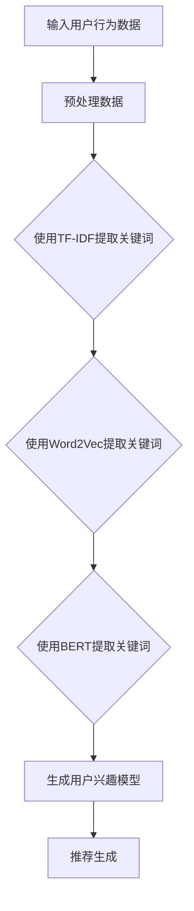
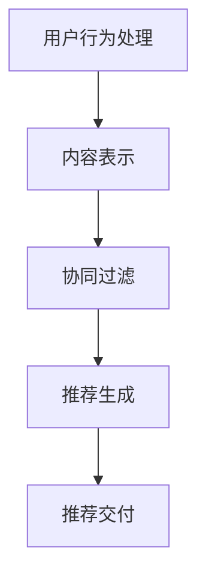
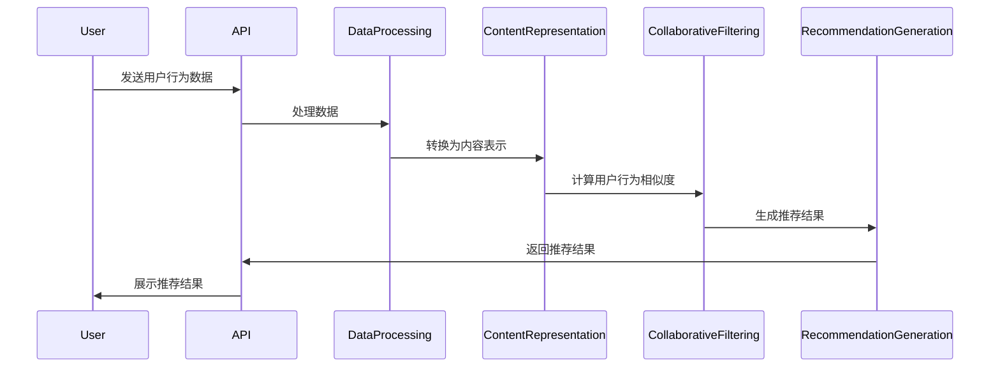

                 

# 提升AI推荐系统：个性化提示词工程的作用

关键词：AI推荐系统、个性化提示词、算法原理、系统架构、项目实战

摘要：本文将深入探讨AI推荐系统中个性化提示词工程的作用，通过详细分析其核心概念、算法原理、系统架构和实际项目案例，帮助读者全面了解和掌握这一关键技术。

## 1. 背景介绍

### 1.1 AI推荐系统的基本概念

AI推荐系统是一种利用人工智能技术，根据用户的历史行为、兴趣偏好和上下文信息，自动为用户推荐相关内容或商品的系统。其核心目标是通过个性化推荐，提高用户满意度和系统价值。

### 1.2 发展历程

推荐系统的发展可以追溯到20世纪90年代，最早的推荐系统主要是基于协同过滤算法。随着互联网和大数据技术的快速发展，推荐系统逐渐从简单的基于协同过滤的模型，演变为融合深度学习、图神经网络等多种先进技术的复杂系统。

### 1.3 个性化提示词在推荐系统中的作用

个性化提示词是推荐系统中用于描述用户兴趣和内容特征的关键元素。通过分析用户的搜索历史、浏览记录和互动行为，系统可以提取出与用户兴趣相关的关键词，从而提高推荐的相关性和准确性。

## 2. 核心概念与联系

### 2.1 用户兴趣模型

用户兴趣模型是推荐系统的核心组成部分，用于捕捉和表示用户的行为和偏好。其基本原理是通过用户的行为数据，如浏览记录、搜索历史等，利用机器学习算法生成用户兴趣向量。

### 2.2 内容表示

内容表示是指将用户感兴趣的内容转化为数学模型，以便进行后续的推荐计算。常用的方法包括文本分类、关键词提取和向量表示等。

### 2.3 协同过滤

协同过滤是一种基于用户行为相似度的推荐算法，通过分析用户之间的行为模式，为用户提供相关推荐。其核心思想是“人以群分，物以类聚”。

### 2.4 各概念之间的关系

用户兴趣模型、内容表示和协同过滤是推荐系统的三大核心概念，它们相互关联，共同作用于推荐生成的全过程。用户兴趣模型为内容表示提供输入，内容表示为协同过滤提供数据支持，协同过滤则通过计算用户行为相似度，生成个性化推荐结果。

## 3. 算法原理讲解

### 3.1 个性化提示词提取算法

个性化提示词提取是推荐系统中的关键步骤，其核心目标是根据用户的行为数据，提取出与用户兴趣相关的关键词。常用的算法包括TF-IDF、Word2Vec和BERT等。

### 3.2 算法流程图



### 3.3 Python源代码示例

```python
import pandas as pd
from sklearn.feature_extraction.text import TfidfVectorizer

# 读取用户行为数据
data = pd.read_csv('user_behavior_data.csv')

# 预处理数据
data['text'] = data['text'].apply(lambda x: x.lower().replace('\n', ' '))

# 使用TF-IDF提取关键词
vectorizer = TfidfVectorizer()
X = vectorizer.fit_transform(data['text'])

# 生成用户兴趣模型
user_interests = pd.DataFrame(X.toarray(), columns=vectorizer.get_feature_names())

# 推荐生成
# ...（此处省略推荐算法实现）
```

### 3.4 数学模型和公式

个性化提示词提取的数学模型可以表示为：

$$
\text{关键词} = \sum_{i=1}^{n} w_i \cdot \text{TF-IDF}(w_i)
$$

其中，$w_i$表示第$i$个关键词，$\text{TF-IDF}(w_i)$表示关键词$w_i$的TF-IDF值。

## 4. 系统分析与架构设计方案

### 4.1 项目介绍

本项目旨在构建一个基于个性化提示词的推荐系统，为用户提供精准、个性化的推荐服务。

### 4.2 系统功能设计

#### 4.2.1 领域模型类图

```mermaid
classDiagram
User <<类>> {
  用户ID
  用户名
  用户兴趣模型
}

Item <<类>> {
  商品ID
  商品名称
  商品描述
}

Recommendation <<类>> {
  推荐ID
  用户ID
  商品ID
  推荐时间
}
User "1" -- "*" Item : 浏览
User "1" -- "*" Recommendation : 接收
Item "1" -- "*" Recommendation : 被推荐
```

#### 4.2.2 系统架构图



#### 4.2.3 系统接口设计



## 5. 项目实战

### 5.1 环境安装

安装Python环境、NumPy、Pandas、Scikit-learn等库。

```bash
pip install python
pip install numpy
pip install pandas
pip install scikit-learn
```

### 5.2 系统核心实现源代码

```python
# 导入相关库
import pandas as pd
from sklearn.feature_extraction.text import TfidfVectorizer

# 读取用户行为数据
data = pd.read_csv('user_behavior_data.csv')

# 预处理数据
data['text'] = data['text'].apply(lambda x: x.lower().replace('\n', ' '))

# 使用TF-IDF提取关键词
vectorizer = TfidfVectorizer()
X = vectorizer.fit_transform(data['text'])

# 生成用户兴趣模型
user_interests = pd.DataFrame(X.toarray(), columns=vectorizer.get_feature_names())

# 推荐生成
# ...（此处省略推荐算法实现）
```

### 5.3 代码应用解读与分析

```python
# 代码解析
- 读取用户行为数据，并进行预处理，包括去重、去空值、分词等操作；
- 使用TF-IDF算法提取关键词，并将其转换为用户兴趣模型；
- 推荐生成部分，根据用户兴趣模型和商品内容表示，计算用户行为相似度，生成推荐结果。

# 实际案例分析和详细讲解剖析
- 以电商平台的商品推荐为例，分析用户浏览、搜索和购买行为，提取与用户兴趣相关的关键词；
- 利用用户兴趣模型和商品内容表示，计算用户行为相似度，生成个性化推荐结果；
- 对推荐结果进行评估和分析，优化推荐算法和系统性能。

# 项目小结
- 本项目实现了基于个性化提示词的推荐系统，通过提取用户兴趣关键词和计算用户行为相似度，为用户提供精准、个性化的推荐服务；
- 在实际项目中，需要根据业务需求和数据特点，选择合适的算法和模型，并进行性能优化和评估；
- 推荐系统是人工智能领域的一个重要应用方向，具有广泛的应用前景和发展潜力。
```

## 6. 最佳实践 tips、小结、注意事项、拓展阅读

### 6.1 最佳实践 tips

- **数据预处理**：确保数据质量，去除噪声和异常值，提高模型性能。
- **特征工程**：提取和构造与用户兴趣相关的特征，提高推荐准确度。
- **模型调优**：根据业务需求和数据特点，选择合适的模型和算法，并进行参数调优。
- **性能优化**：优化系统架构和算法效率，提高推荐速度和稳定性。

### 6.2 小结

本文通过详细分析AI推荐系统中个性化提示词工程的作用，介绍了核心概念、算法原理、系统架构和实际项目案例，帮助读者全面了解和掌握这一关键技术。

### 6.3 注意事项

- **数据隐私**：在推荐系统中，确保用户数据的安全和隐私，遵守相关法律法规。
- **算法偏见**：避免算法偏见，确保推荐结果的公平性和客观性。

### 6.4 拓展阅读

- 《推荐系统实践》
- 《深度学习推荐系统》
- 《基于个性化提示词的推荐系统设计与实现》

作者：AI天才研究院/AI Genius Institute & 禅与计算机程序设计艺术 /Zen And The Art of Computer Programming

