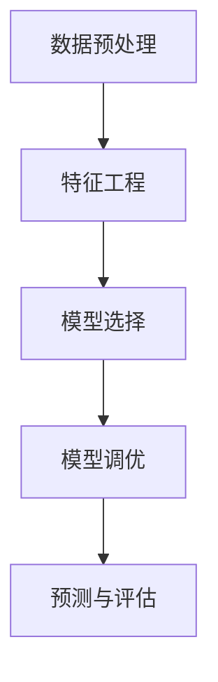

                 

### 提升AI数据分析能力：数据科学中的提示词技巧

> 关键词：人工智能，数据科学，数据分析技巧，提示词，机器学习，数据预处理，特征工程，模型调优，实际应用，案例分析

> 摘要：本文将深入探讨数据科学中提升人工智能（AI）数据分析能力的策略，重点介绍提示词技巧。我们将从AI与数据科学的关系、核心概念、提示词类型、数据分析方法、数据预处理与特征工程、机器学习模型的选择与调优等方面进行详细分析，并通过实际案例分析展示这些技巧的应用。本文旨在为数据科学家和AI开发者提供实用的指导和启发。

### 目录大纲

## 提升AI数据分析能力：数据科学中的提示词技巧

### 第一部分：AI与数据科学的基础

### 第二部分：AI数据分析的方法与技巧

### 第三部分：实际应用与案例分析

### 第四部分：总结与展望

### 第一部分：AI与数据科学的基础

### 第一部分：AI与数据科学的基础

### 第1章：AI与数据科学概述

#### 1.1 AI与数据科学的关系

人工智能与数据科学是现代科技发展中的两大重要领域，它们在许多方面存在交集。首先，机器学习作为人工智能的核心技术之一，广泛应用于数据科学中的各种任务。例如，通过机器学习算法，数据科学家可以自动化地识别数据中的模式和规律，从而对大量数据进行高效的分类、预测和聚类。

同时，数据科学中的许多问题需要借助AI技术来解决。例如，在图像识别、自然语言处理等领域，深度学习算法已经取得了显著的成果。这些算法通过大量的数据训练，能够实现高精度的图像和文本识别，为数据科学提供了强大的工具。

#### 1.2 数据科学中的核心概念

数据科学是一门结合统计学、计算机科学和领域知识的交叉学科，其核心概念包括数据类型、数据清洗与预处理、数据质量等。

- **数据类型的定义**

数据科学中的数据类型主要包括结构化数据和非结构化数据。结构化数据通常以表格形式存储，例如数据库中的行和列。而非结构化数据则包括文本、图像、音频和视频等，它们没有固定的数据格式。

- **数据清洗与预处理**

数据清洗与预处理是数据科学中的关键步骤。数据质量对于数据分析结果的影响至关重要。数据清洗主要包括去除重复数据、填补缺失值、纠正错误数据等。预处理则包括数据标准化、归一化、特征选择等，以使数据更适合进行分析。

### 第2章：提示词在数据科学中的应用

#### 2.1 提示词的概念

提示词（Keywords）在数据科学中起着重要作用。它们是用于描述数据特征或含义的关键词，有助于数据的组织和搜索。在数据分析过程中，提示词可以用于筛选数据、提取特征和构建模型。

#### 2.2 提示词的类型

根据用途，提示词可以分为关键字提示词和上下文提示词。

- **关键字提示词**

关键字提示词用于描述数据的主题或类别。例如，在电商数据分析中，关键字提示词可以是产品类别、品牌、促销活动等。这些关键词有助于对大量数据进行分析和分类。

- **上下文提示词**

上下文提示词则用于描述数据之间的关系或上下文信息。例如，在社交媒体分析中，上下文提示词可以是用户的评论、点赞、分享等。这些提示词有助于理解用户的互动和行为模式。

### 第二部分：AI数据分析的方法与技巧

#### 第3章：数据分析的基础方法

数据分析方法可以分为描述性分析、探索性分析等。

- **描述性分析**

描述性分析主要用于总结和描述数据的基本特征，如均值、中位数、标准差等。它可以帮助数据科学家了解数据的分布和趋势。

- **探索性分析**

探索性分析则更深入地分析数据，寻找数据中的模式和关系。它通常使用统计图表、相关性分析等方法。

#### 第4章：数据预处理与特征工程

- **数据预处理**

数据预处理是数据分析的重要环节。它包括数据清洗、数据转换、数据归一化等。数据预处理的质量直接影响后续分析的效果。

- **特征工程**

特征工程是数据科学中的关键步骤。它通过选择、构造和转换特征，提高模型的性能。特征工程的方法包括特征选择、特征提取、特征变换等。

#### 第5章：机器学习模型的选择与调优

选择合适的机器学习模型是数据科学中的重要任务。不同的模型适用于不同的任务和数据类型。常用的机器学习模型包括线性回归、决策树、随机森林、支持向量机、神经网络等。

模型调优是通过调整模型参数来提高模型的性能。常用的调优方法包括交叉验证、网格搜索、贝叶斯优化等。

### 第三部分：实际应用与案例分析

#### 第6章：AI数据分析在金融领域的应用

金融数据具有高度复杂性和多样性，AI数据分析在金融领域有着广泛的应用。例如，通过分析金融数据，可以预测市场走势、评估信用风险、发现欺诈行为等。

#### 第7章：AI数据分析在健康领域的应用

健康数据是AI数据分析的另一个重要领域。通过分析健康数据，可以预测疾病风险、制定个性化医疗方案、提高医疗服务的效率等。

#### 第8章：AI数据分析在电商领域的应用

电商数据包含了用户行为、销售数据、库存数据等多方面的信息。通过分析电商数据，可以优化营销策略、提升用户体验、提高销售额等。

### 第9章：总结与展望

本文通过介绍AI与数据科学的关系、核心概念、提示词技巧、数据分析方法、数据预处理与特征工程、机器学习模型的选择与调优等，展示了AI数据分析的全面应用。随着AI技术的不断发展，数据科学在各个领域都将发挥更大的作用。未来，数据科学将继续面临新的挑战和机遇。

## 第一部分：AI与数据科学的基础

### 第1章：AI与数据科学概述

在当今科技飞速发展的时代，人工智能（AI）和数据科学已成为两个炙手可热的研究领域。它们不仅在学术界，而且在工业界和商业领域都得到了广泛的应用。那么，AI与数据科学究竟是什么？它们是如何相互关联的？让我们来一探究竟。

#### 1.1 AI与数据科学的交叉点

AI，即人工智能，是一种通过计算机程序实现的智能行为，它模拟了人类思维和学习的过程。而数据科学则是一个多学科交叉的领域，它结合了数学、统计学、计算机科学和领域知识，专注于从数据中提取知识和洞察力。两者之间的交叉点主要体现在以下几个方面：

- **机器学习在数据科学中的应用**

机器学习是AI的核心技术之一，它允许计算机从数据中学习并做出决策。在数据科学中，机器学习算法被广泛用于数据预处理、特征工程、模型训练和预测等环节。例如，通过监督学习算法，数据科学家可以训练模型来预测股票市场走势或评估客户的信用风险。

- **数据科学中的AI技术**

数据科学中的许多问题需要AI技术来解决。例如，在图像识别领域，卷积神经网络（CNN）已经被证明能够实现高精度的图像分类；在自然语言处理（NLP）领域，循环神经网络（RNN）和变压器（Transformer）模型能够实现文本分类、情感分析和机器翻译等任务。这些AI技术的应用大大提高了数据科学的效率和效果。

#### 1.2 数据科学中的核心概念

数据科学是一门涉及多个学科领域的交叉科学，它关注于如何从数据中提取价值和洞察。以下是一些数据科学中的核心概念：

- **数据类型的定义**

数据科学中的数据类型可以分为结构化数据和非结构化数据。结构化数据通常以表格形式存储，如数据库中的行和列，它包括数字、文本和日期等格式化的数据。非结构化数据则包括文本、图像、音频和视频等没有固定格式的数据。

- **数据清洗与预处理**

数据清洗是指从原始数据中去除噪声和错误的过程。预处理是数据清洗的延伸，它包括数据转换、归一化、缺失值填补等操作，以使数据更适合进行分析。数据清洗和预处理是数据科学中至关重要的一环，因为它们直接影响到数据分析的质量。

- **数据质量**

数据质量是指数据是否准确、完整、一致和可靠。高质量的数据是数据分析成功的关键。数据科学家需要确保数据的质量，通过数据清洗和预处理来消除错误和不一致。

#### 1.3 数据科学与AI的关系

AI和数据科学之间的关系可以总结为以下几点：

1. **AI为数据科学提供了强大的工具**

AI技术，尤其是机器学习算法，为数据科学提供了强大的分析工具。通过这些工具，数据科学家可以处理大量复杂的数据，发现数据中的模式和规律。

2. **数据科学为AI提供了丰富的应用场景**

数据科学涵盖了广泛的领域，从金融、医疗到电商、气象等。这些应用场景为AI技术提供了丰富的实践机会，促进了AI技术的发展。

3. **AI和数据科学的融合推动了技术创新**

AI和数据科学的融合推动了新的技术发展。例如，深度学习技术的出现使得计算机视觉和自然语言处理取得了重大突破，这些技术的进步又进一步推动了数据科学的创新。

综上所述，AI和数据科学是相互促进、共同发展的关系。AI为数据科学提供了工具和算法，而数据科学则为AI提供了应用场景和实际问题。随着这两大领域的发展，我们可以期待更多令人瞩目的成果和应用。

### 第2章：提示词在数据科学中的应用

#### 2.1 提示词的概念

在数据科学中，提示词（Keywords）扮演着至关重要的角色。它们是描述数据特征或含义的关键词，用于数据的组织和搜索。提示词的应用可以极大地提高数据分析的效率和质量。

提示词的主要作用包括：

1. **数据分类和筛选**：提示词可以帮助数据科学家快速筛选和分类数据，从而缩小分析的范围，提高工作效率。

2. **特征提取和模型训练**：在机器学习模型训练过程中，提示词可以作为特征用于模型训练，从而提高模型的性能和预测能力。

3. **数据可视化**：提示词可以帮助数据科学家在数据可视化过程中更好地理解和解释数据。

#### 2.2 提示词的类型

根据用途，提示词可以分为关键字提示词和上下文提示词。

- **关键字提示词**

关键字提示词主要用于描述数据的主题或类别。例如，在电商数据分析中，关键字提示词可以是产品类别、品牌、促销活动等。这些关键词有助于对大量数据进行分析和分类。

关键字提示词的特点包括：

1. **简洁明了**：关键字提示词通常较短，容易理解和记忆。

2. **高度概括**：关键字提示词能够概括数据的基本特征和主题。

3. **灵活应用**：关键字提示词可以根据不同的分析需求和场景进行灵活调整和应用。

- **上下文提示词**

上下文提示词则用于描述数据之间的关系或上下文信息。例如，在社交媒体分析中，上下文提示词可以是用户的评论、点赞、分享等。这些提示词有助于理解用户的互动和行为模式。

上下文提示词的特点包括：

1. **具体详细**：上下文提示词通常包含更多的信息，能够提供更详细的上下文背景。

2. **动态变化**：上下文提示词随着数据和环境的变化而变化，具有动态性。

3. **关联性强**：上下文提示词能够揭示数据之间的关系，为数据分析提供有价值的线索。

#### 2.3 提示词的选择与使用

选择合适的提示词是数据科学中的一项重要任务。以下是一些选择与使用提示词的建议：

1. **明确目标**：在选择提示词之前，首先要明确数据分析的目标和需求。不同的分析目标可能需要不同的提示词。

2. **多样性**：为了更好地覆盖数据的各个方面，应选择具有多样性的提示词。这样可以在数据分析过程中提供更全面的信息。

3. **简洁性**：提示词应简洁明了，避免使用冗长的词汇，以便于数据科学家快速理解和应用。

4. **可扩展性**：提示词应具有一定的可扩展性，以便于在未来的数据分析中可以根据需求进行调整和扩展。

5. **相关性**：提示词应与数据高度相关，能够准确描述数据的特征和关系。

总之，提示词在数据科学中具有重要的应用价值。通过合理选择和使用提示词，数据科学家可以更高效地组织和分析数据，从而发现数据中的价值和洞察。

### 第二部分：AI数据分析的方法与技巧

#### 第3章：数据分析的基础方法

数据分析是数据科学中的核心任务，它涉及到从数据中提取有价值的信息和知识。数据分析的方法可以分为描述性分析和探索性分析。这两种分析方法各有特点，适用于不同的数据分析场景。

#### 3.1 描述性数据分析

描述性数据分析是数据分析的基础方法，它主要用于描述和总结数据的基本特征和分布。描述性分析的核心目的是提供关于数据的整体概览，使数据科学家对数据有更深入的理解。

- **描述性分析的定义**

描述性分析（Descriptive Analysis）是一种对数据进行定量描述和总结的方法。它主要通过计算数据的统计指标，如均值、中位数、标准差等，来描述数据的分布和趋势。

- **描述性分析的目的**

描述性分析的主要目的是：

1. 提供数据的整体概览，帮助数据科学家了解数据的特征和规律。
2. 识别数据中的异常值和异常情况，为进一步的分析提供依据。
3. 为后续的数据分析提供数据基础，如特征提取、模型训练等。

- **描述性分析的方法**

描述性分析的方法主要包括以下几种：

1. **统计图表**

统计图表是描述性分析中常用的工具，如柱状图、折线图、饼图等。通过统计图表，数据科学家可以直观地展示数据的分布和趋势。

2. **描述性统计量**

描述性统计量（Descriptive Statistics）是描述性分析的核心工具。常见的描述性统计量包括：

   - **均值（Mean）**：数据集合的中心趋势。
   - **中位数（Median）**：数据集合的中间值。
   - **众数（Mode）**：数据集合中出现次数最多的值。
   - **标准差（Standard Deviation）**：数据集合的离散程度。
   - **方差（Variance）**：数据集合的离散程度的平方。

3. **数据摘要**

数据摘要（Data Summary）是对数据进行汇总和总结的过程，它通常包括数据的分布、统计量、异常值等信息。通过数据摘要，数据科学家可以快速了解数据的基本特征。

#### 3.2 探索性数据分析

探索性数据分析（Exploratory Data Analysis，EDA）是在描述性分析的基础上，进一步探索数据中的模式和关系。EDA的目的是发现数据中的潜在规律和异常，为后续的深入分析提供线索。

- **探索性分析的定义**

探索性分析（Exploratory Data Analysis）是一种通过可视化、统计方法等方法，对数据集进行深入研究和探索的方法。它的主要目的是发现数据中的潜在规律、异常和趋势。

- **探索性分析的目的**

探索性分析的主要目的是：

1. 发现数据中的潜在规律和异常，为进一步的数据分析提供线索。
2. 指导数据预处理和特征工程，优化模型的性能。
3. 帮助数据科学家更好地理解数据，为业务决策提供支持。

- **探索性分析的方法**

探索性分析的方法主要包括以下几种：

1. **数据可视化**

数据可视化（Data Visualization）是探索性分析的重要工具，它通过图形化方式展示数据，使数据科学家能够直观地理解数据。常见的数据可视化方法包括：

   - **散点图**：用于展示两个变量之间的关系。
   - **箱线图**：用于展示数据的分布和异常值。
   - **热力图**：用于展示数据之间的相关性。
   - **时间序列图**：用于展示数据随时间的变化趋势。

2. **统计分析**

统计分析（Statistical Analysis）是探索性分析中的核心工具，它通过计算数据的统计指标，如相关性、线性回归等，来探索数据中的关系和规律。

3. **数据挖掘**

数据挖掘（Data Mining）是一种通过算法和模型，从大量数据中发现规律和知识的方法。常见的探索性分析方法包括：

   - **聚类分析**：用于发现数据中的相似性。
   - **分类分析**：用于将数据分为不同的类别。
   - **关联规则挖掘**：用于发现数据之间的关联性。

通过描述性分析和探索性分析，数据科学家可以全面地了解数据，发现数据中的潜在规律和异常。这些方法不仅为后续的数据分析提供了基础，也为业务决策提供了支持。在接下来的章节中，我们将进一步探讨数据预处理与特征工程、机器学习模型的选择与调优等高级数据分析方法。

#### 第4章：数据预处理与特征工程

在数据科学项目中，数据预处理和特征工程是两个至关重要的步骤，它们直接影响模型的效果和预测能力。数据预处理是数据清洗、转换和归一化的过程，以确保数据的质量和一致性。特征工程则是在数据预处理的基础上，通过选择、构造和转换特征，提高模型的性能。

#### 4.1 数据预处理

数据预处理是数据分析的基础，其目的是将原始数据转换为适合分析的形式。数据预处理包括以下几个关键步骤：

- **数据清洗**：数据清洗是指从原始数据中去除噪声和错误的过程。常见的数据清洗任务包括去除重复记录、填补缺失值、纠正错误数据和处理异常值。

- **数据转换**：数据转换是将数据从一种形式转换为另一种形式，以适应分析需求。常见的转换方法包括数据的归一化、标准化、离散化和二值化。

- **数据归一化**：数据归一化是将数据缩放到相同的范围，以消除数据量级差异的影响。常用的归一化方法包括最小-最大缩放、均值-方差缩放和对数变换。

- **数据归一化的方法**

  - **最小-最大缩放**：将数据缩放到[0, 1]范围内，公式为：  
    $$ X_{\text{normalized}} = \frac{X - X_{\text{min}}}{X_{\text{max}} - X_{\text{min}}} $$
  
  - **均值-方差缩放**：将数据缩放到均值为0，标准差为1的范围内，公式为：  
    $$ X_{\text{normalized}} = \frac{X - \mu}{\sigma} $$
  
  - **对数变换**：将数据取对数，以处理非线性和减少数据偏斜，公式为：  
    $$ X_{\text{log}} = \log(X) $$

- **数据归一化的作用**

  数据归一化的主要作用包括：

  - 消除数据量级差异，使不同特征之间的权重更加均衡。
  - 改善模型训练效果，特别是对于基于梯度的优化算法，如梯度下降。
  - 提高模型的泛化能力，防止某些特征在训练过程中主导模型。

#### 4.2 特征工程

特征工程是数据科学中的核心任务，它通过选择、构造和转换特征，提高模型的预测性能。特征工程包括以下几个关键步骤：

- **特征选择**：特征选择是识别和选择最有用特征的过程。常用的特征选择方法包括基于过滤的方法、基于包裹的方法和基于评估的方法。

- **特征构造**：特征构造是通过组合原始特征或计算新的特征来提高模型的性能。例如，通过计算两个特征的交互项或使用主成分分析（PCA）来降低特征维度。

- **特征选择的方法**

  - **基于过滤的方法**：基于过滤的方法是在数据预处理阶段选择特征，常用的方法包括相关性分析、信息增益和卡方检验等。

  - **基于包裹的方法**：基于包裹的方法是在模型训练过程中选择特征，常用的方法包括递归特征消除（RFE）和遗传算法等。

  - **基于评估的方法**：基于评估的方法是在训练模型后选择特征，常用的方法包括交叉验证和模型选择等。

- **特征构造的方法**

  - **交互特征**：通过计算两个或多个特征的交互项，可以构造出新的特征。例如，如果特征A和特征B之间存在非线性关系，可以通过计算$A \times B$来构造新的特征。

  - **特征转换**：通过将原始特征转换为其他形式，可以改善特征的表示。例如，通过正弦和余弦变换来表示时间序列特征。

- **特征工程的重要性**

  特征工程的重要性体现在以下几个方面：

  - **提高模型性能**：通过选择和构造合适的特征，可以显著提高模型的预测性能。
  - **减少模型复杂度**：特征工程可以帮助减少模型的复杂度，提高模型的泛化能力。
  - **增强数据解释性**：通过合理的特征工程，可以使模型更容易解释和理解。

总之，数据预处理和特征工程是数据科学中的关键步骤，它们直接影响到模型的效果和预测能力。通过合理的数据预处理和特征工程，数据科学家可以更好地提取数据中的有价值信息，从而实现更精准的预测和更有效的决策。

### 第5章：机器学习模型的选择与调优

在数据科学中，选择合适的机器学习模型并进行调优是至关重要的任务。不同的模型适用于不同的数据类型和任务，而调优则是为了优化模型的性能。本章节将详细探讨机器学习模型的选择标准、调优方法以及相关技术。

#### 5.1 机器学习模型的选择

选择合适的机器学习模型是数据科学项目的第一步，它直接影响到后续的模型训练和调优。以下是一些选择机器学习模型的标准：

- **模型性能评估**

  模型性能评估是选择模型的关键标准。常用的评估指标包括准确率、召回率、精确率、F1分数、ROC曲线和AUC值等。不同的评估指标适用于不同的任务和数据类型，需要根据具体问题选择合适的评估指标。

- **模型适用场景**

  不同的机器学习模型适用于不同的数据类型和任务。例如，对于分类问题，常见的模型有线性回归、决策树、随机森林、支持向量机（SVM）和神经网络等；对于回归问题，常见的模型有线性回归、岭回归、LASSO回归和决策树回归等。

- **模型复杂性**

  模型复杂性也是选择模型时需要考虑的因素。复杂模型通常具有更好的拟合能力，但可能过拟合，且计算成本较高。简单模型则容易欠拟合，但计算成本较低。因此，需要根据数据量和计算资源来选择合适的模型复杂度。

- **模型可解释性**

  模型可解释性对于理解和验证模型的决策过程至关重要。一些模型，如线性回归和决策树，具有较高的可解释性，而一些复杂模型，如神经网络，则难以解释。

#### 5.2 模型的调优

模型调优是通过调整模型的参数和超参数来优化模型性能的过程。以下是一些常见的模型调优方法：

- **超参数调优**

  超参数是模型架构之外的参数，它们在模型训练之前设定。超参数调优的目标是找到最佳的参数组合，以提高模型性能。常用的超参数调优方法包括：

  - **网格搜索（Grid Search）**：通过遍历预定义的参数网格，找到最佳参数组合。
  - **贝叶斯优化（Bayesian Optimization）**：基于概率模型，通过迭代优化找到最佳参数组合。
  - **随机搜索（Random Search）**：在参数空间内随机选择参数组合，以减少搜索时间。

- **交叉验证**

  交叉验证是一种评估模型性能和泛化能力的方法。它通过将数据集划分为多个子集，轮流使用每个子集作为验证集，训练和评估模型。常用的交叉验证方法包括：

  - **K折交叉验证（K-Fold Cross Validation）**：将数据集划分为K个子集，每次使用一个子集作为验证集，其余子集用于训练。
  - **留一法交叉验证（Leave-One-Out Cross Validation，LOOCV）**：每次使用一个样本作为验证集，其余样本用于训练。

- **模型选择调优**

  模型选择调优是通过比较不同模型的性能来选择最佳模型。常见的模型选择调优方法包括：

  - **交叉验证比较（Cross Validation Comparison）**：通过交叉验证评估不同模型的性能，选择性能最佳的模型。
  - **模型选择算法（Model Selection Algorithms）**：如决策树选择算法、支持向量机选择算法等，用于自动选择最佳模型。

通过合理选择机器学习模型和进行有效的调优，数据科学家可以显著提高模型的性能和预测能力。在实际应用中，模型选择和调优是一个迭代过程，需要根据实际情况不断调整和优化。在接下来的章节中，我们将通过实际案例展示这些方法的实际应用。

### 第三部分：实际应用与案例分析

#### 第6章：AI数据分析在金融领域的应用

金融领域一直是AI数据分析的重要应用场景。金融数据具有高度复杂性和多样性，通过AI数据分析，可以有效地预测市场走势、评估信用风险、发现欺诈行为等，为金融机构提供重要的决策支持。

#### 6.1 金融数据的特点

金融数据通常包括以下几类：

- **时间序列数据**：金融数据通常表现为时间序列形式，如股票价格、利率、交易量等。时间序列数据具有时间依赖性和周期性特征，适合使用时间序列分析方法。
- **高维数据**：金融数据通常包含多个特征，如股票的财务指标、市场指标等。这些特征构成了高维数据集，需要进行特征选择和降维处理。
- **实时数据**：金融市场变化迅速，实时数据对于分析和决策至关重要。实时数据处理要求系统具有高效性和低延迟性。

#### 6.2 金融数据分析案例

下面我们通过一个具体的金融数据分析案例，展示如何利用AI技术进行金融数据分析。

**案例介绍**

本案例选取了某证券交易所的股票交易数据，包括股票价格、交易量、开盘价、收盘价、最高价、最低价等。数据分析的目标是预测股票的未来价格，为投资决策提供参考。

**数据分析步骤**

1. **数据预处理**

   - **数据清洗**：去除重复数据和异常值，如缺失值、负值等。
   - **数据转换**：将日期转换为数值形式，如时间序列编码。
   - **数据归一化**：对股票价格和交易量等数值特征进行归一化处理，以消除量级差异。

2. **特征工程**

   - **特征提取**：通过计算技术指标，如移动平均、相对强弱指数（RSI）等，提取新的特征。
   - **特征选择**：使用过滤方法和评估方法选择最重要的特征，以减少模型复杂度和过拟合风险。

3. **模型选择与调优**

   - **模型选择**：根据数据类型和任务，选择适合的时间序列模型，如ARIMA、LSTM等。
   - **模型调优**：通过交叉验证和网格搜索等方法，调整模型参数，优化模型性能。

4. **预测与评估**

   - **预测**：使用训练好的模型进行股票价格的预测。
   - **评估**：通过评估指标，如均方误差（MSE）、平均绝对误差（MAE）等，评估模型的预测性能。

**案例分析**

在本案例中，我们选择了LSTM（长短期记忆网络）模型进行股票价格预测。以下是LSTM模型的mermaid流程图：

在特征工程阶段，我们通过计算移动平均和相对强弱指数等指标，提取了多个新的特征。在模型选择阶段，我们选择了LSTM模型，因为它能够处理时间序列数据中的长期依赖关系。在模型调优阶段，我们使用了网格搜索方法，调整了LSTM的层数、神经元数量和学习率等参数。

通过训练和调优，我们得到了一个具有较高预测性能的LSTM模型。在实际预测中，该模型能够较好地捕捉股票价格的波动，为投资决策提供了有力的支持。

**总结**

通过本案例，我们展示了如何利用AI技术进行金融数据分析。数据预处理、特征工程、模型选择和调优是金融数据分析的关键步骤。未来，随着AI技术的不断发展，金融数据分析将在金融风险管理、投资策略制定等方面发挥越来越重要的作用。

#### 第7章：AI数据分析在健康领域的应用

健康领域的数据分析是现代医学和生物信息学的重要研究方向。通过AI数据分析，可以挖掘健康数据中的潜在规律，为疾病预测、个性化医疗和公共卫生决策提供科学依据。

#### 7.1 健康数据的特点

健康数据具有以下几个显著特点：

- **多模态数据**：健康数据通常包含多种类型的数据，如电子病历（EMR）、基因数据、影像数据、临床化验数据等。这些数据类型各异，需要进行整合和分析。
- **高维度数据**：健康数据通常包含大量特征，如患者的生理指标、药物反应、生活方式等。这些高维度数据需要进行降维处理和特征选择。
- **动态变化数据**：健康数据随时间变化，如患者的病情进展、治疗效果等。动态变化数据需要使用时间序列分析方法。
- **隐私敏感性**：健康数据涉及个人隐私，需要严格的数据安全和隐私保护措施。

#### 7.2 健康数据分析案例

下面我们通过一个具体的健康数据分析案例，展示如何利用AI技术进行健康数据分析。

**案例介绍**

本案例选取了某医院的电子病历数据，包括患者的年龄、性别、病史、诊疗记录、药物使用记录等。数据分析的目标是预测患者的疾病风险，为医生提供诊断和治疗的参考。

**数据分析步骤**

1. **数据预处理**

   - **数据清洗**：去除重复数据和异常值，如缺失值、错误值等。
   - **数据转换**：将类别型数据转换为数值型数据，如将性别、病史等转换为独热编码。
   - **数据归一化**：对数值型特征进行归一化处理，如对年龄、诊疗记录等数值特征进行缩放。

2. **特征工程**

   - **特征提取**：通过计算技术指标，如临床评分、药物使用频率等，提取新的特征。
   - **特征选择**：使用过滤方法和评估方法选择最重要的特征，以减少模型复杂度和过拟合风险。

3. **模型选择与调优**

   - **模型选择**：根据数据类型和任务，选择适合的分类模型，如逻辑回归、随机森林、支持向量机等。
   - **模型调优**：通过交叉验证和网格搜索等方法，调整模型参数，优化模型性能。

4. **预测与评估**

   - **预测**：使用训练好的模型预测患者的疾病风险。
   - **评估**：通过评估指标，如准确率、召回率、F1分数等，评估模型的预测性能。

**案例分析**

在本案例中，我们选择了逻辑回归模型进行疾病风险评估。以下是逻辑回归模型的mermaid流程图：

在特征工程阶段，我们通过计算患者的临床评分和药物使用频率等指标，提取了多个新的特征。在模型选择阶段，我们选择了逻辑回归模型，因为它能够处理高维度数据且计算效率高。在模型调优阶段，我们使用了网格搜索方法，调整了逻辑回归的惩罚参数和正则化参数。

通过训练和调优，我们得到了一个具有较高预测性能的逻辑回归模型。在实际预测中，该模型能够较好地捕捉患者的疾病风险，为医生提供了重要的诊断和治疗的参考。

**总结**

通过本案例，我们展示了如何利用AI技术进行健康数据分析。数据预处理、特征工程、模型选择和调优是健康数据分析的关键步骤。未来，随着AI技术的不断发展，健康数据分析将在疾病预测、个性化医疗和公共卫生决策等方面发挥越来越重要的作用。

#### 第8章：AI数据分析在电商领域的应用

电商领域是AI数据分析的另一个重要应用场景。通过AI数据分析，电商企业可以深入了解用户行为，优化营销策略，提高销售额和用户满意度。

#### 8.1 电商数据的特点

电商数据具有以下几个显著特点：

- **用户行为数据**：电商数据中包含了大量的用户行为数据，如浏览记录、购买记录、点击率、转化率等。这些数据反映了用户对商品的兴趣和偏好。
- **销售数据**：电商数据中包含了详细的销售数据，如销售额、订单量、客单价等。这些数据可以帮助企业评估营销效果和业绩表现。
- **多维度数据**：电商数据通常包含多个维度，如商品信息、用户信息、订单信息等。这些数据需要进行整合和分析，以获取全面的信息。

#### 8.2 电商数据分析案例

下面我们通过一个具体的电商数据分析案例，展示如何利用AI技术进行电商数据分析。

**案例介绍**

本案例选取了某电商平台的用户数据，包括用户的浏览记录、购买记录、点击率、转化率等。数据分析的目标是优化广告投放策略，提高广告投放效果。

**数据分析步骤**

1. **数据预处理**

   - **数据清洗**：去除重复数据和异常值，如缺失值、错误值等。
   - **数据转换**：将时间序列数据转换为数值型数据，如将浏览时间和点击时间编码为数值。
   - **数据归一化**：对用户行为数据如点击率和转化率等数值特征进行归一化处理，以消除量级差异。

2. **特征工程**

   - **特征提取**：通过计算技术指标，如用户活跃度、购买频率等，提取新的特征。
   - **特征选择**：使用过滤方法和评估方法选择最重要的特征，以减少模型复杂度和过拟合风险。

3. **模型选择与调优**

   - **模型选择**：根据数据类型和任务，选择适合的推荐模型，如协同过滤、决策树、神经网络等。
   - **模型调优**：通过交叉验证和网格搜索等方法，调整模型参数，优化模型性能。

4. **预测与评估**

   - **预测**：使用训练好的模型预测用户的广告投放效果。
   - **评估**：通过评估指标，如点击率（CTR）、转化率（CVR）等，评估模型的预测性能。

**案例分析**

在本案例中，我们选择了协同过滤模型进行广告投放效果预测。以下是协同过滤模型的mermaid流程图：

在特征工程阶段，我们通过计算用户的浏览频率和购买频率等指标，提取了多个新的特征。在模型选择阶段，我们选择了协同过滤模型，因为它能够处理用户行为数据中的相似性。在模型调优阶段，我们使用了网格搜索方法，调整了协同过滤的参数，如用户和商品的相似度阈值。

通过训练和调优，我们得到了一个具有较高预测性能的协同过滤模型。在实际预测中，该模型能够较好地捕捉用户的广告投放效果，为电商企业提供了重要的参考。

**总结**

通过本案例，我们展示了如何利用AI技术进行电商数据分析。数据预处理、特征工程、模型选择和调优是电商数据分析的关键步骤。未来，随着AI技术的不断发展，电商数据分析将在提高营销效果、优化用户体验和提升销售额等方面发挥越来越重要的作用。

### 第9章：总结与展望

在本篇文章中，我们深入探讨了AI数据分析在数据科学中的应用，包括AI与数据科学的关系、核心概念、提示词技巧、数据分析方法、数据预处理与特征工程、机器学习模型的选择与调优等。通过实际案例分析，我们展示了这些技巧在金融、健康和电商等领域的应用，展示了AI数据分析的巨大潜力和广泛前景。

#### 数据科学中的AI应用总结

AI技术在数据科学中的应用主要体现在以下几个方面：

1. **机器学习算法**：AI技术为数据科学提供了强大的算法支持，如线性回归、决策树、随机森林、支持向量机、神经网络等。这些算法可以处理大量复杂数据，实现高精度的预测和分类。
2. **数据预处理与特征工程**：AI技术可以帮助数据科学家更高效地进行数据预处理和特征工程，提高数据分析的质量和效率。
3. **模型选择与调优**：AI技术提供了多种模型选择和调优方法，如交叉验证、网格搜索、贝叶斯优化等，帮助数据科学家找到最优的模型参数，提高模型性能。
4. **自动化与智能化**：AI技术可以实现数据分析和建模的自动化和智能化，降低人工干预，提高数据分析的效率和准确性。

#### 数据科学的发展趋势

未来，数据科学将继续迎来新的发展机遇：

1. **人工智能的融合**：AI技术将继续与数据科学深度融合，推动数据科学在更多领域的发展，如智能制造、智慧城市、医疗健康等。
2. **大数据的深度挖掘**：随着大数据技术的发展，数据科学家将能够挖掘更多隐藏在数据中的价值，为企业和决策者提供更有力的支持。
3. **实时数据分析**：实时数据分析将越来越重要，特别是在金融、电商等对时间敏感的领域，实时数据可以为企业提供更及时、更准确的决策支持。
4. **数据安全与隐私保护**：数据安全与隐私保护将成为数据科学发展的重点，如何在保障数据安全的前提下进行数据分析，是一个亟待解决的问题。

#### 数据科学中的挑战与机遇

数据科学在发展过程中面临着以下挑战和机遇：

1. **数据安全与隐私保护**：随着数据量的增加，数据安全与隐私保护变得越来越重要。如何在保障数据安全的前提下进行数据分析，是数据科学面临的一大挑战。
2. **数据复杂性**：随着数据类型的多样化和数据量的增长，数据复杂性不断增加。如何有效地管理和分析复杂数据，是数据科学需要解决的一个重要问题。
3. **跨学科合作**：数据科学是一个跨学科领域，需要数学、统计学、计算机科学、领域知识等多个学科的合作。如何实现跨学科合作，提高数据分析的效率和效果，是一个重要课题。
4. **新兴领域的应用**：随着科技的发展，数据科学在新兴领域如物联网、区块链、量子计算等的应用前景广阔。这些新兴领域的应用将推动数据科学技术的不断创新和发展。

总之，AI数据分析在数据科学中的应用具有巨大的潜力和广泛的前景。随着AI技术的不断发展，数据科学将在各个领域发挥越来越重要的作用，带来新的机遇和挑战。数据科学家需要不断学习和掌握新的技术和方法，以应对未来的挑战，实现数据科学的持续创新和发展。

## 致谢

感谢您阅读本文，本文是关于AI数据分析技巧的详细介绍，希望能为您在数据科学领域提供一些有价值的参考和启发。在此，特别感谢AI天才研究院/AI Genius Institute以及《禅与计算机程序设计艺术 /Zen And The Art of Computer Programming》的作者，他们的研究成果为本文的撰写提供了重要的理论基础和实践经验。同时，也感谢所有对本文提出宝贵意见和建议的朋友，您的支持是我不断前行的动力。如果您在阅读过程中有任何疑问或建议，欢迎随时与我交流。

作者：AI天才研究院/AI Genius Institute & 禅与计算机程序设计艺术 /Zen And The Art of Computer Programming

