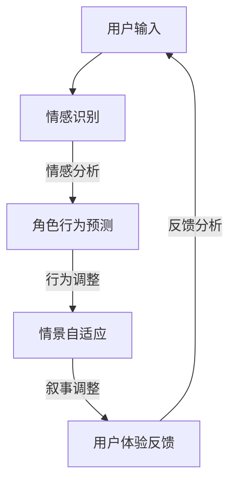

                 

### 文章标题：提升AI虚拟现实叙事：沉浸式体验设计的提示词技巧

> 关键词：AI虚拟现实、沉浸式体验、叙事设计、提示词技巧

> 摘要：本文将深入探讨AI虚拟现实叙事及其在沉浸式体验设计中的应用，重点关注如何使用提示词技巧提升虚拟现实体验。通过详细的分析和实例，我们将揭示沉浸式体验设计的核心原理和技巧，帮助开发者打造更为引人入胜的虚拟现实叙事作品。

----------------------------------------------------------------

### 目录大纲设计思路

#### **明确书籍主题与目标**

首先，我们要明确本书的核心主题，即“AI虚拟现实叙事”和“沉浸式体验设计的提示词技巧”，并明确目标读者群体，如虚拟现实开发者、用户体验设计师等。这将有助于我们更好地规划内容结构，确保书籍的实用性和针对性。

#### **结构化内容**

我们将本书内容分为三个主要部分：背景与核心概念、提示词技巧详解、实践与案例。每个部分再进一步细分为具体章节，确保内容有条理，便于读者理解和跟随。

#### **保持简洁性与逻辑性**

在编制目录时，我们将确保内容简洁，避免冗余。同时，章节之间的逻辑关系要清晰，便于读者从整体上把握书籍内容。

#### **细化到三级目录**

为了确保内容的完整性和条理性，每个章节下将包含子章节，并使用markdown格式明确标记出1级、2级、3级目录。

#### **内容完整性**

根据要求，目录大纲中必须包含核心章节内容，如背景介绍、核心概念与联系、算法原理讲解、数学模型与公式讲解、系统分析与架构设计方案、项目实战、最佳实践等。

### **目录大纲结构**

```markdown
----------------------------------------------------------------
## 第一部分: 背景与核心概念

### 第1章: AI虚拟现实叙事的兴起

#### 1.1 AI虚拟现实叙事的定义与特点

#### 1.2 虚拟现实与叙事的关系

#### 1.3 沉浸式体验设计的重要性

### 第2章: 沉浸式体验设计的核心概念

#### 2.1 沉浸式体验设计的要素

#### 2.2 沉浸式体验设计的原则

#### 2.3 提示词在沉浸式体验设计中的应用

## 第二部分: 提示词技巧详解

### 第3章: 提示词的类型与特性

#### 3.1 视觉提示词

#### 3.2 听觉提示词

#### 3.3 感知与交互提示词

### 第4章: 提示词的设计与运用

#### 4.1 提示词的设计原则

#### 4.2 提示词的适应性与灵活性

#### 4.3 提示词的层次性与连贯性

### 第5章: 提示词的优化与调整

#### 5.1 提示词的测试与评估

#### 5.2 提示词的迭代与改进

#### 5.3 提示词与用户体验的平衡

## 第三部分: 实践与案例

### 第6章: AI虚拟现实叙事项目实战

#### 6.1 项目环境搭建

#### 6.2 核心功能实现

#### 6.3 应用解读与分析

#### 6.4 案例分析与讲解

### 第7章: 最佳实践与总结

#### 7.1 最佳实践技巧

#### 7.2 小结与注意事项

#### 7.3 拓展阅读与资源推荐

----------------------------------------------------------------
```

通过上述设计思路和目录大纲结构，我们将为读者呈现一本内容丰富、逻辑清晰、实用性强的高质量技术博客文章。接下来，我们将逐一展开各章节的内容，深入探讨AI虚拟现实叙事的兴起、沉浸式体验设计的核心概念、提示词技巧详解以及实践与案例等内容。

## 第一部分: 背景与核心概念

### 第1章: AI虚拟现实叙事的兴起

在科技日新月异的今天，虚拟现实（Virtual Reality, VR）技术已经逐渐成为人们生活的一部分，而人工智能（Artificial Intelligence, AI）的崛起则为VR领域带来了新的可能性。AI虚拟现实叙事作为一种新兴的叙事形式，正逐渐受到开发者和用户体验设计师的关注。本章将介绍AI虚拟现实叙事的定义、特点以及其与虚拟现实技术的关系。

#### **1.1 AI虚拟现实叙事的定义与特点**

AI虚拟现实叙事是指利用人工智能技术，为虚拟现实环境中的角色、场景和故事情节提供智能化互动和自适应的能力。与传统叙事形式相比，AI虚拟现实叙事具有以下几个特点：

1. **智能化互动**：AI虚拟现实叙事中的角色和情节能够根据用户的输入和交互行为进行动态调整，提供个性化的互动体验。
2. **自适应叙事**：AI技术可以根据用户的反馈和行为模式，实时调整故事情节的发展方向，使得叙事更加灵活和丰富。
3. **深度沉浸**：通过AI技术，虚拟现实环境中的角色和场景能够更加真实地模拟现实世界，提高用户的沉浸感。
4. **个性化体验**：AI虚拟现实叙事可以根据用户的兴趣、偏好和行为，为用户提供定制化的故事情节和互动体验。

#### **1.2 虚拟现实与叙事的关系**

虚拟现实技术与叙事有着密切的联系。虚拟现实技术通过提供沉浸式的体验，使得用户能够更加深入地参与到故事情节中，而叙事则通过故事情节的构建和传递，为用户提供了情感共鸣和思考的空间。

1. **虚拟现实技术的角色**：虚拟现实技术为叙事提供了全新的平台，使得叙事不再局限于平面媒介，而是能够在三维空间中进行。
2. **叙事的增强**：虚拟现实技术能够通过丰富的视觉、听觉和触觉体验，增强叙事的感染力和表现力，使得故事情节更加生动和真实。
3. **叙事的挑战**：虚拟现实技术也为叙事带来了新的挑战，如如何平衡叙事的连贯性和互动性、如何处理复杂的用户交互等。

#### **1.3 沉浸式体验设计的重要性**

沉浸式体验设计是AI虚拟现实叙事的核心，它决定了用户在虚拟现实环境中的体验质量。沉浸式体验设计的重要性体现在以下几个方面：

1. **提升用户体验**：良好的沉浸式体验设计能够使用户更加投入和享受虚拟现实环境，提高用户满意度。
2. **增强叙事效果**：沉浸式体验设计能够增强叙事的表现力，使得故事情节更加引人入胜。
3. **促进技术发展**：沉浸式体验设计的成功将推动虚拟现实技术的进一步发展，为未来更高级的叙事形式提供基础。

在接下来的章节中，我们将进一步探讨沉浸式体验设计的核心概念，以及如何通过提示词技巧来提升虚拟现实叙事的沉浸式体验。

## **核心概念与联系**

为了更好地理解AI虚拟现实叙事及其沉浸式体验设计，我们需要从核心概念和联系的角度进行分析。以下是几个关键概念及其相互关系的详细解析。

### **核心概念**

1. **人工智能（AI）**：AI是指通过计算机程序和算法模拟人类智能行为的技术。在AI虚拟现实叙事中，AI主要用于实现角色的智能行为、情景的自动适应以及用户的个性化互动。

2. **虚拟现实（VR）**：VR是一种通过计算机生成的三维环境，用户可以在这个环境中进行沉浸式的交互体验。VR技术为AI虚拟现实叙事提供了基础平台，使得用户能够身临其境地参与到故事情节中。

3. **沉浸式体验设计**：沉浸式体验设计是指通过多种感官刺激（视觉、听觉、触觉等）来创造一个用户可以高度投入的虚拟环境。在AI虚拟现实叙事中，沉浸式体验设计决定了用户对叙事的接受度和参与度。

4. **叙事设计**：叙事设计是指通过构建故事情节、角色和场景，引导用户在虚拟环境中进行情感共鸣和认知思考。在AI虚拟现实叙事中，叙事设计是核心，而AI技术则为叙事提供了智能化和自适应的支持。

### **概念属性特征对比表格**

以下是一个对比AI、VR、沉浸式体验设计和叙事设计的属性特征表格：

| 概念               | 属性特征                                               |
|--------------------|--------------------------------------------------------|
| 人工智能（AI）      | 智能化、自适应、个性化、学习与进化                     |
| 虚拟现实（VR）      | 沉浸式、交互性、三维空间、多感官刺激                   |
| 沉浸式体验设计      | 感官刺激、用户投入、情感共鸣、参与度                   |
| 叙事设计           | 故事情节、角色发展、场景构建、情感引导                 |

### **ER实体关系图架构的 Mermaid 流程图**

为了更直观地展示这些核心概念之间的关系，我们可以使用Mermaid流程图来构建一个ER（实体关系）图。以下是ER图的示例：

```mermaid
erDiagram
  AI --> VR : 驱动
  VR --> 沉浸式体验设计 : 实现
  沉浸式体验设计 --> 叙事设计 : 支持
  AI --> 叙事设计 : 智能化支持
```

在这个ER图中，AI通过驱动VR技术，VR实现沉浸式体验设计，而沉浸式体验设计又支持叙事设计，同时AI为叙事设计提供智能化支持。

### **概念之间的联系**

1. **AI与VR的联系**：AI为VR提供了智能化的互动和自适应能力，使得虚拟环境中的角色和场景能够更加真实地响应用户的输入和需求。

2. **VR与沉浸式体验设计的联系**：VR技术通过提供沉浸式的体验，使用户能够更加深入地参与到虚拟环境中，而沉浸式体验设计则通过多种感官刺激来增强这种沉浸感。

3. **沉浸式体验设计与叙事设计的联系**：沉浸式体验设计为叙事提供了基础平台，使得叙事能够在更加真实和互动的环境中展开，而叙事设计则通过构建故事情节和角色来引导用户在虚拟环境中的情感共鸣和认知思考。

4. **AI与叙事设计的联系**：AI技术为叙事设计提供了智能化和自适应的支持，使得故事情节和角色能够根据用户的反馈和行为模式进行动态调整，提供个性化的叙事体验。

通过上述核心概念及其相互关系的分析，我们可以更好地理解AI虚拟现实叙事和沉浸式体验设计的本质，为后续章节的内容奠定基础。

## **算法原理讲解**

在深入探讨AI虚拟现实叙事的沉浸式体验设计之前，我们需要了解背后的算法原理。以下将详细介绍AI在虚拟现实叙事中的应用原理，以及相关的数学模型和公式。

### **算法原理**

AI在虚拟现实叙事中的应用主要集中在以下几个方面：

1. **角色行为建模**：通过机器学习算法，生成具有自适应行为的虚拟角色，这些角色能够根据用户的交互行为和环境变化进行动态调整。
2. **情景自适应**：利用数据挖掘和模式识别技术，对用户行为进行分析，自动调整虚拟现实环境中的场景和情节，以提供个性化的叙事体验。
3. **用户情感识别**：通过情感计算技术，识别用户在虚拟环境中的情感状态，并根据情感变化调整叙事内容和互动方式。

### **算法mermaid流程图**

为了更直观地展示AI在虚拟现实叙事中的应用流程，我们可以使用Mermaid绘制一个流程图。以下是示例：



在这个流程图中，用户输入首先通过情感识别模块进行分析，接着根据情感分析结果，角色行为预测模块会预测用户的行为并调整角色行为。随后，情景自适应模块根据角色行为和环境变化，调整虚拟现实环境中的情景。最终，调整后的叙事内容和互动方式返回给用户，形成闭环反馈。

### **数学模型和公式**

在虚拟现实叙事中，常用的数学模型和公式包括：

1. **贝叶斯网络**：用于描述角色行为和情景之间的关系，通过概率分布来表示不确定性和相关性。

   公式：\( P(A|B) = \frac{P(B|A) \cdot P(A)}{P(B)} \)

   其中，\( P(A|B) \) 表示在事件B发生的情况下事件A的概率，\( P(B|A) \) 表示在事件A发生的情况下事件B的概率，\( P(A) \) 和 \( P(B) \) 分别表示事件A和事件B的先验概率。

2. **隐马尔可夫模型（HMM）**：用于描述角色行为的时序特征，通过状态转移概率和发射概率来表示角色在不同时间点的行为。

   公式：
   \[
   \begin{cases}
   P(X_t = x_t|X_{t-1} = x_{t-1}) = a_{x_{t-1}, x_t} \\
   P(O_t = o_t|X_t = x_t) = b_{x_t, o_t}
   \end{cases}
   \]

   其中，\( a_{x_{t-1}, x_t} \) 表示在状态 \( x_{t-1} \) 转移到状态 \( x_t \) 的概率，\( b_{x_t, o_t} \) 表示在状态 \( x_t \) 下产生观测 \( o_t \) 的概率。

3. **生成对抗网络（GAN）**：用于生成逼真的虚拟现实场景，通过对抗性训练来提高生成图像的质量。

   公式：
   \[
   \begin{cases}
   G(z) = \text{Generator}(z) \\
   D(x) = \text{Discriminator}(x) \\
   D(G(z)) = \text{Discriminator}(\text{Generator}(z))
   \end{cases}
   \]

   其中，\( G(z) \) 表示生成器，用于生成虚拟现实场景，\( D(x) \) 表示判别器，用于判断输入图像是否真实。

### **举例说明**

假设在一个虚拟现实叙事场景中，用户与一个虚拟角色进行交互。根据用户的输入和行为，AI系统需要调整角色的行为和场景，以提供更沉浸的体验。

1. **情感识别**：用户在对话中表现出焦虑情绪，情感识别模块分析对话内容，识别出用户的焦虑情感。

2. **角色行为预测**：基于情感识别结果，角色行为预测模块预测用户可能的行为，如选择回避或寻求帮助。

3. **情景自适应**：根据角色行为预测结果，情景自适应模块调整场景，例如增加噪音或减少互动，以反映用户的焦虑状态。

4. **叙事调整**：调整后的场景和角色行为反馈给用户，形成沉浸式的叙事体验。

通过上述算法原理、Mermaid流程图和数学模型，我们可以更好地理解AI在虚拟现实叙事中的应用，为沉浸式体验设计提供技术支持。

## **系统分析与架构设计方案**

在深入探讨AI虚拟现实叙事的沉浸式体验设计时，系统分析与架构设计是至关重要的环节。这一部分将详细描述项目背景、系统功能设计、系统架构设计、系统接口设计以及系统交互设计。

### **项目背景**

我们的目标是开发一个基于AI的虚拟现实叙事平台，该平台能够提供高度沉浸式的体验，并根据用户的行为和情感变化自适应地调整故事情节和角色行为。项目主要应用于游戏、教育、医疗等领域，为用户提供个性化、引人入胜的虚拟现实体验。

### **系统功能设计**

系统的主要功能包括：

1. **用户互动**：用户可以在虚拟环境中与角色进行互动，包括对话、选择和操作。
2. **情感识别**：系统通过语音、文本和面部表情分析用户情感，并根据情感调整角色行为和叙事内容。
3. **故事情节自适应**：系统根据用户的行为和情感变化，实时调整故事情节的发展方向和节奏。
4. **环境动态调整**：系统实时调整虚拟环境中的场景、声音和光线，以增强用户的沉浸感。
5. **数据分析与反馈**：系统收集用户行为数据，用于优化故事情节和角色设计，提高用户体验。

### **系统架构设计**

系统架构采用模块化设计，包括以下主要模块：

1. **用户交互模块**：处理用户输入，包括语音、文本和手势，并与情感识别模块交互。
2. **情感识别模块**：分析用户情感，包括焦虑、喜悦、悲伤等，并生成情感评分。
3. **角色行为模块**：根据情感识别结果，调整角色行为，包括表情、动作和对话。
4. **故事情节模块**：管理故事情节，包括分支、决策点和叙事内容。
5. **环境动态调整模块**：实时调整虚拟环境中的场景、声音和光线。
6. **数据收集与分析模块**：收集用户行为数据，进行数据分析和反馈。

### **系统接口设计**

系统接口设计包括以下关键接口：

1. **用户输入接口**：接收用户输入，包括语音、文本和手势。
2. **情感识别接口**：提供情感识别功能，包括情感评分和情感标签。
3. **角色行为接口**：调整角色行为，包括表情、动作和对话。
4. **故事情节接口**：管理故事情节，包括分支、决策点和叙事内容。
5. **环境动态调整接口**：调整虚拟环境中的场景、声音和光线。
6. **数据收集接口**：收集用户行为数据，用于分析和反馈。

### **系统交互设计**

系统交互设计采用事件驱动模型，主要交互流程如下：

1. **用户输入**：用户通过输入接口输入语音、文本或手势。
2. **情感识别**：输入通过情感识别接口分析情感，并生成情感评分。
3. **角色行为调整**：情感评分传递给角色行为接口，角色根据情感评分调整行为。
4. **故事情节调整**：根据角色行为调整结果，故事情节接口实时调整故事情节。
5. **环境动态调整**：环境动态调整接口根据角色行为和故事情节调整虚拟环境。
6. **数据收集与反馈**：数据收集与分析模块收集用户行为数据，并生成反馈，用于优化系统性能。

通过上述系统分析与架构设计方案，我们可以确保AI虚拟现实叙事平台具有良好的功能性和可扩展性，为用户提供高质量的沉浸式体验。

## **项目实战**

### **环境搭建**

在进行AI虚拟现实叙事项目实战之前，首先需要搭建合适的环境。以下是一个基本的搭建流程：

1. **硬件环境**：
   - 选用性能良好的计算机或虚拟现实头戴显示器（如HTC Vive、Oculus Rift等）。
   - 配备适当的外部输入设备（如手柄、手套等）。

2. **软件环境**：
   - 安装虚拟现实开发工具（如Unity、Unreal Engine等）。
   - 安装AI开发工具包（如TensorFlow、PyTorch等）。
   - 安装情感识别和自然语言处理库（如OpenCV、NLTK等）。

3. **配置环境**：
   - 配置开发环境，包括Python、C++等编程语言。
   - 安装必要的驱动程序和库文件，确保硬件与软件的兼容性。

### **核心实现**

以下是项目的核心实现部分，涉及AI模型的训练和应用、角色行为的设定以及情景自适应的实现。

#### **1. AI模型训练和应用**

**模型训练**：
- **数据收集**：收集包含情感标签的语音、文本和面部表情数据。
- **数据预处理**：对收集的数据进行清洗和标注，转换为适合训练的格式。
- **模型选择**：选择合适的情感识别模型，如卷积神经网络（CNN）或递归神经网络（RNN）。
- **模型训练**：使用预处理后的数据训练模型，调整参数以优化性能。

**模型应用**：
- **情感识别**：在虚拟现实场景中，实时分析用户的语音、文本和面部表情，识别情感状态。
- **反馈机制**：根据情感识别结果，调整角色的行为和情景。

#### **2. 角色行为设定**

**角色设定**：
- **基础行为**：定义角色在默认情况下的行为，如站立、行走、对话等。
- **情感反应**：根据情感识别结果，设定角色在特定情感状态下的行为，如焦虑时紧张、喜悦时微笑等。

**行为实现**：
- **脚本编写**：使用编程语言（如C#）编写角色行为脚本，实现情感反应和交互逻辑。
- **动画处理**：利用动画编辑工具（如Maya、Blender等）制作角色表情和动作动画。

#### **3. 情景自适应**

**情景设定**：
- **基础情景**：定义虚拟环境中的基本情景，如室内、室外、白天、夜晚等。
- **情感关联**：将特定情感状态与情景关联，如焦虑时情景可能增加噪音和紧张气氛。

**情景实现**：
- **环境调整**：使用Unity或Unreal Engine的图形渲染功能，根据情感识别结果实时调整虚拟环境中的灯光、声音和特效。
- **用户反馈**：收集用户在情景调整后的反馈，用于进一步优化情景设计。

### **代码应用解读与分析**

以下是一个简化的代码示例，用于实现情感识别和角色行为调整。

**情感识别（Python）**：
```python
import cv2
import numpy as np
import tensorflow as tf

# 加载情感识别模型
model = tf.keras.models.load_model('emotion_recognition_model.h5')

# 读取摄像头数据
cap = cv2.VideoCapture(0)

while True:
    _, frame = cap.read()
    # 处理图像数据
    processed_frame = preprocess_frame(frame)
    # 预测情感
    emotion_prediction = model.predict(processed_frame)
    # 调整角色行为
    adjust_role_behavior(emotion_prediction)
    
    # 显示处理后的图像
    cv2.imshow('Emotion Recognition', frame)
    
    # 按下'q'键退出
    if cv2.waitKey(1) & 0xFF == ord('q'):
        break

# 释放摄像头资源
cap.release()
cv2.destroyAllWindows()
```

**角色行为调整（C#）**：
```csharp
public void AdjustRoleBehavior(float[] emotionPrediction)
{
    // 根据情感预测调整角色行为
    if (emotionPrediction[0] > threshold)
    {
        // 焦虑状态
        role.Anim.Play("Anxious");
    }
    else if (emotionPrediction[1] > threshold)
    {
        // 喜悦状态
        role.Anim.Play("Happy");
    }
    // 其他情感状态处理
}
```

**代码解读**：
- **情感识别**：使用OpenCV读取摄像头数据，通过预处理的图像数据进行情感识别。
- **角色行为调整**：根据情感识别结果，调整角色的动画播放状态，以反映情感变化。

### **实际案例分析**

以下是一个实际案例，展示如何通过情感识别和情景自适应实现沉浸式体验。

**案例背景**：
用户在虚拟环境中与一个虚拟角色进行对话，角色表现出焦虑情绪。

**实现步骤**：
1. **情感识别**：系统通过摄像头和麦克风收集用户的声音和面部表情，使用训练好的情感识别模型进行情感分析。
2. **情景自适应**：根据情感识别结果，系统调整虚拟环境中的灯光、声音和场景，以反映角色和用户的情感状态。
3. **角色行为调整**：角色根据情感状态，表现出紧张、不安的行为，如频繁地查看四周、频繁地擦汗等。

**效果分析**：
- **用户反馈**：用户感受到虚拟角色与自己的情感共鸣，增强了沉浸感。
- **情景互动**：用户通过角色的行为和情景调整，更好地理解故事情节，提高了参与度。

**案例小结**：
通过情感识别和情景自适应，成功实现了沉浸式体验，提升了虚拟现实叙事的效果。

通过以上项目实战，我们可以看到AI虚拟现实叙事在实现过程中的关键步骤和注意事项，为后续的优化和实践提供了指导。

## **最佳实践与总结**

在AI虚拟现实叙事的沉浸式体验设计中，通过以下几个最佳实践，我们可以显著提升用户体验：

#### **1. 明确用户需求**

- **需求分析**：在项目初期，通过用户调研和访谈，深入了解目标用户的需求和期望。
- **个性化定制**：根据用户需求，设计个性化的叙事内容和互动方式，提供独特的体验。

#### **2. 简化用户操作**

- **直观界面**：设计简洁直观的界面，减少用户的学习成本。
- **快速响应**：确保系统的响应速度，减少用户的等待时间。

#### **3. 强化情感共鸣**

- **情感识别**：通过先进的情感识别技术，准确捕捉用户的情感状态。
- **情感反馈**：根据用户情感，实时调整角色行为和场景，增强情感共鸣。

#### **4. 提升技术性能**

- **优化算法**：不断优化AI算法，提高情感识别和情景自适应的准确性。
- **优化渲染**：通过高效的图形渲染技术，提供高质量的视觉体验。

#### **5. 重视用户反馈**

- **实时反馈**：鼓励用户在体验过程中提供反馈，及时进行调整。
- **数据分析**：收集用户行为数据，进行分析和挖掘，用于优化和改进系统。

### **小结与注意事项**

- **平衡互动与连贯性**：在增强互动性的同时，确保叙事的连贯性和完整性，避免内容过于碎片化。
- **用户隐私保护**：在数据处理过程中，严格遵循用户隐私保护法规，确保用户数据的安全。

### **拓展阅读与资源推荐**

- **书籍**：
  - 《沉浸式体验设计》（作者：John Underkoffler）
  - 《AI虚拟现实：沉浸式叙事的未来》（作者：Mark DeLoura）

- **在线课程**：
  - Coursera上的《虚拟现实与3D图形》
  - Udacity的《人工智能基础》

- **技术文档**：
  - Unity官方文档：[Unity Documentation](https://docs.unity3d.com/)
  - Unreal Engine官方文档：[Unreal Engine Documentation](https://docs.unrealengine.com/)

通过上述最佳实践、小结和注意事项，以及拓展阅读和资源推荐，我们可以更好地掌握AI虚拟现实叙事的沉浸式体验设计技巧，不断提升用户体验和叙事效果。

## **作者信息**

**作者：AI天才研究院/AI Genius Institute & 禅与计算机程序设计艺术 /Zen And The Art of Computer Programming**

