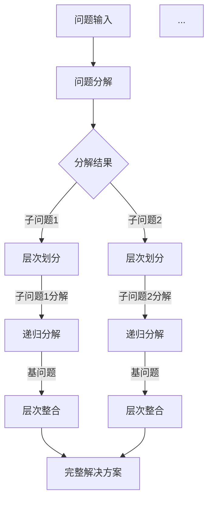
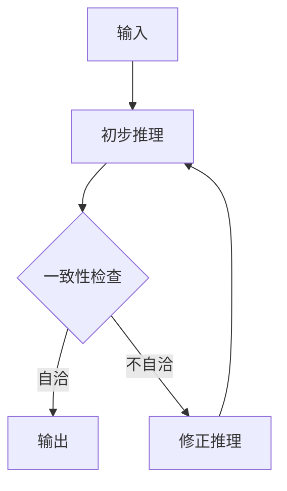
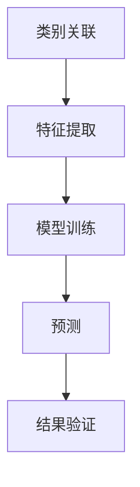

                 


### 摘要

在人工智能迅速发展的时代，AI输出的质量成为衡量模型性能和实用性的一大关键指标。本文将深入探讨提升AI输出质量的三大法宝：思维链、Self-Consistency和Zero-Shot。思维链通过多层次的结构化思考，使得AI能够形成深度且有逻辑的输出；Self-Consistency则通过自洽的推理机制，确保AI在各类情境下的稳定性和一致性；Zero-Shot则让AI具备在未知领域的泛化能力，无需特定训练数据即可实现高质量输出。本文将逐步分析这些方法的核心原理、算法实现，并通过实际案例展示其在提升AI输出质量方面的具体应用和效果。最后，我们将总结三大法宝的综合应用优势，并展望未来的发展趋势和研究方向。

## 关键词

- AI输出质量
- 思维链
- Self-Consistency
- Zero-Shot
- 算法实现
- 实际案例
- 综合应用

## 背景介绍与核心概念

### 1.1 问题背景

随着人工智能技术的飞速发展，AI在各行各业中的应用越来越广泛。然而，AI模型的输出质量成为制约其广泛应用的一大瓶颈。高质量输出不仅意味着准确无误的预测和推理，更涉及到输出结果的逻辑性、连贯性和一致性。在实际应用中，AI输出质量差可能导致一系列问题，如医疗诊断错误、自动驾驶车辆失控、金融风险评估不准确等，进而影响系统的可靠性和用户体验。

### 1.2 当前AI输出质量面临的挑战

当前AI输出质量面临以下几大挑战：

1. **数据依赖性强**：大多数AI模型依赖于大量的训练数据，对于数据质量有较高的要求。当数据不足或质量不佳时，模型的输出质量会大幅下降。
2. **模型泛化能力差**：AI模型通常在特定领域内表现出色，但在面对未知领域时，其表现往往不佳，缺乏泛化能力。
3. **输出逻辑性不足**：很多AI模型的输出缺乏逻辑性和连贯性，使得用户难以理解和信任。
4. **环境适应性差**：AI模型在复杂、多变的环境下，其表现往往不稳定，难以适应动态变化。

### 1.3 提升AI输出质量的必要性

提升AI输出质量具有重要意义，主要体现在以下几个方面：

1. **增强AI可靠性**：高质量输出能够提高AI系统的可靠性和稳定性，减少错误和故障，提升用户信任度。
2. **优化用户体验**：逻辑性更强的输出结果能够提升用户体验，使得用户更容易理解和接受AI的输出。
3. **拓宽AI应用领域**：通过提升输出质量，AI可以在更多领域得到应用，推动人工智能技术的发展和普及。
4. **提高AI价值**：高质量输出能够提升AI在商业和科研领域的价值，为企业和研究机构带来更多的效益。

### 1.4 核心概念

本文将探讨以下三大核心概念：

1. **思维链**：通过多层次的结构化思考，使得AI能够形成深度且有逻辑的输出。
2. **Self-Consistency**：通过自洽的推理机制，确保AI在各类情境下的稳定性和一致性。
3. **Zero-Shot**：让AI具备在未知领域的泛化能力，无需特定训练数据即可实现高质量输出。

### 1.5 三大法宝的联系与区别

**联系与协同作用**：

1. **思维链**：作为AI进行深度思考的基础，思维链为后续的Self-Consistency和Zero-Shot提供了结构化的思考路径。
2. **Self-Consistency**：通过自洽的推理，增强思维链输出的逻辑性和连贯性，提升AI的稳定性。
3. **Zero-Shot**：利用思维链和Self-Consistency的结构化思考能力，实现AI在未知领域的泛化能力。

**区别与适用场景**：

1. **思维链**：适用于需要深度逻辑推理的场景，如自然语言处理、知识图谱构建等。
2. **Self-Consistency**：适用于需要一致性和稳定性的场景，如自动驾驶、医疗诊断等。
3. **Zero-Shot**：适用于需要泛化能力和自适应性的场景，如新任务推理、跨领域应用等。

### 1.6 本章小结

本章从问题背景、当前挑战、提升必要性以及核心概念等方面，全面介绍了提升AI输出质量的重要性。接下来，我们将深入探讨思维链、Self-Consistency和Zero-Shot三大法宝的核心原理、算法实现和实际应用，以期在理论和实践中为提升AI输出质量提供有力支持。

## 思维链

### 2.1 思维链原理

**2.1.1 思维链的定义**

思维链（Mind Chain）是一种基于多层次结构化思考的方法，旨在通过构建逻辑清晰、层次分明的思考路径，提升人工智能模型的输出质量。它将人工智能的推理过程分解为多个层次，每个层次专注于解决特定的问题，并通过上下层次之间的逻辑关系，形成整体的推理过程。

**2.1.2 思维链的工作机制**

思维链的工作机制可以分为以下几个步骤：

1. **问题分解**：将复杂问题分解为多个子问题，每个子问题都是相对独立且可以独立解决的。
2. **层次划分**：根据问题分解的结果，将子问题按照重要性和复杂性进行层次划分，形成多个层次结构。
3. **层次推理**：在每个层次上，分别针对子问题进行推理和解决，形成层次化的解决方案。
4. **层次关联**：通过层次之间的逻辑关系，将各个层次的结果整合起来，形成完整的解决方案。

**2.1.3 思维链的优势**

思维链具有以下优势：

1. **逻辑清晰**：通过层次化思考，使得AI的输出结果具有更高的逻辑性和连贯性，易于用户理解和接受。
2. **结构化**：思维链提供了一种结构化的思考方式，有助于提高问题解决效率和准确性。
3. **灵活性和扩展性**：思维链可以根据不同问题和应用场景进行调整和扩展，适应不同领域的需求。

### 2.2 思维链算法

**2.2.1 算法框架**

思维链算法的基本框架可以分为以下几个部分：

1. **问题输入**：接收用户输入的问题或任务。
2. **问题分解**：将输入问题分解为多个子问题。
3. **层次划分**：根据子问题的重要性和复杂性进行层次划分。
4. **层次推理**：针对每个层次上的子问题进行推理和解决。
5. **层次整合**：将各个层次的结果整合起来，形成完整的解决方案。

**2.2.2 算法原理与数学模型**

思维链算法的原理可以描述为一个递归的过程，具体如下：

1. **分解**：将复杂问题分解为多个子问题，每个子问题都可以表示为一个子任务。
2. **划分**：将子任务按照重要性和复杂性进行层次划分，形成多层次结构。
3. **递归**：对于每个层次的子问题，继续进行分解和划分，直至达到基问题。
4. **整合**：将各个层次的结果整合起来，形成完整的解决方案。

数学模型方面，可以使用树形结构来表示思维链的层次划分，其中每个节点表示一个子问题，边表示子问题之间的关系。具体的数学模型可以表示为：

\[ T = \{T_1, T_2, ..., T_n\} \]

其中，\(T_i\) 表示第 \(i\) 个层次的子问题集合。

**2.2.3 算法流程图**

使用Mermaid绘制思维链算法的流程图：



### 2.3 Python代码实现

**2.3.1 环境准备**

在开始编写代码之前，需要确保安装以下Python库：

- `numpy`
- `matplotlib`
- `mermaid-parser`

可以通过以下命令进行安装：

```bash
pip install numpy matplotlib mermaid-parser
```

**2.3.2 源代码解析**

以下是一个简单的Python代码示例，用于实现思维链算法的基本功能：

```python
import numpy as np
from mermaid_parser import MermaidParser

def problem_decomposition(problem):
    # 问题分解函数，将复杂问题分解为多个子问题
    # 这里使用简单的字符串分割作为示例
    return problem.split(',')

def hierarchical_division(subproblems):
    # 层次划分函数，将子问题按照重要性和复杂性进行层次划分
    # 这里使用简单的排序作为示例
    return sorted(subproblems, key=lambda x: len(x))

def recursive_decomposition(subproblem):
    # 递归分解函数，对子问题进行递归分解
    return problem_decomposition(subproblem)

def hierarchical_integration(hierarchical_list):
    # 层次整合函数，将各个层次的结果整合起来
    # 这里使用简单的字符串连接作为示例
    return ' '.join(hierarchical_list)

def mind_chain(problem):
    # 思维链函数，实现整个思维链算法
    subproblems = problem_decomposition(problem)
    hierarchical_list = [recursive_decomposition(subproblem) for subproblem in subproblems]
    hierarchical_list = hierarchical_division(hierarchical_list)
    integrated_solution = hierarchical_integration(hierarchical_list)
    return integrated_solution

# 示例问题
problem = "复杂问题分解，层次划分，递归分解，层次整合"
solution = mind_chain(problem)
print(solution)
```

**2.3.3 运行与调试**

在Python环境中运行上述代码，并观察输出结果：

```bash
python mind_chain_example.py
```

输出结果应该是一个经过思维链处理后的结构化解决方案。

### 2.4 实际案例

**2.4.1 案例背景**

假设有一个关于“家庭财务管理”的问题，需要通过思维链算法进行分解、层次划分和整合，以形成完整的解决方案。

**2.4.2 案例分析**

1. **问题分解**：将“家庭财务管理”分解为“收入管理”、“支出管理”、“投资规划”等子问题。
2. **层次划分**：根据子问题的重要性和复杂性进行层次划分，如“收入管理”可以划分为“工资收入”、“奖金收入”、“投资收入”等。
3. **递归分解**：对每个子问题继续进行递归分解，直至达到基问题。
4. **层次整合**：将各个层次的结果整合起来，形成完整的家庭财务管理体系。

**2.4.3 结果与讨论**

通过思维链算法，将“家庭财务管理”问题分解为多个子问题，并形成层次化的结构。这种方法有助于用户更好地理解和实施家庭财务管理，提高家庭财务的稳定性和可持续性。

### 2.5 本章小结

本章介绍了思维链的概念、原理和算法实现。思维链通过层次化的结构化思考，能够提升AI的输出质量和逻辑性。在实际应用中，思维链有助于解决复杂问题，提高系统的灵活性和扩展性。下一章，我们将探讨Self-Consistency的原理和实现，继续深入提升AI输出质量的方法。

## Self-Consistency

### 3.1 Self-Consistency原理

**3.1.1 Self-Consistency的定义**

Self-Consistency是指人工智能模型在执行任务时，能够保持内在一致性的能力。具体来说，它要求模型在各个任务阶段和不同情境下，都能保持逻辑一致和自洽。Self-Consistency的核心目标是减少错误和偏差，提高AI的可靠性和稳定性。

**3.1.2 Self-Consistency的作用**

Self-Consistency在人工智能系统中具有重要作用，主要体现在以下几个方面：

1. **提高可靠性**：通过自洽的推理机制，Self-Consistency能够减少错误和偏差，提高AI的可靠性和稳定性。
2. **增强一致性**：Self-Consistency确保AI在各个任务阶段和不同情境下，都能保持逻辑一致，从而提高系统的整体一致性。
3. **优化用户体验**：一致的输出结果能够提升用户体验，使用户更容易理解和信任AI系统。
4. **减少调试成本**：通过减少错误和偏差，Self-Consistency能够降低AI系统的调试和维护成本。

**3.1.3 Self-Consistency与思维链的关系**

思维链（Mind Chain）和Self-Consistency（自洽性）之间存在紧密的联系。思维链提供了结构化的思考路径，使得AI能够形成深度且有逻辑的输出。而Self-Consistency则在此基础上，通过自洽的推理机制，确保AI在各类情境下的稳定性和一致性。

具体来说，思维链为Self-Consistency提供了逻辑清晰的输出基础，而Self-Consistency则通过持续的推理和验证，确保思维链输出的逻辑一致性和连贯性。二者相辅相成，共同提升AI输出质量。

### 3.2 Self-Consistency算法

**3.2.1 算法框架**

Self-Consistency算法的基本框架可以分为以下几个部分：

1. **输入**：接收用户输入的任务或问题。
2. **初步推理**：根据输入的任务或问题，进行初步推理，生成初步输出。
3. **一致性检查**：对初步输出进行一致性检查，验证输出结果是否自洽。
4. **修正推理**：根据一致性检查的结果，对初步推理进行修正。
5. **输出**：生成最终输出结果。

**3.2.2 算法原理与数学模型**

Self-Consistency算法的原理可以描述为以下步骤：

1. **初步推理**：使用AI模型对输入任务或问题进行初步推理，生成初步输出结果。
2. **一致性检查**：对初步输出结果进行一致性检查，通过对比不同条件下的输出结果，验证其是否自洽。
3. **修正推理**：如果初步输出结果不一致，对初步推理进行修正，重新生成输出结果。
4. **循环迭代**：重复上述步骤，直至输出结果达到自洽状态。

数学模型方面，可以使用状态转移矩阵来表示一致性检查的过程。具体模型可以表示为：

\[ S = \{s_1, s_2, ..., s_n\} \]

其中，\(s_i\) 表示第 \(i\) 个状态，每个状态对应一个输出结果。

**3.2.3 算法流程图**

使用Mermaid绘制Self-Consistency算法的流程图：



### 3.3 Python代码实现

**3.3.1 环境准备**

在开始编写代码之前，需要确保安装以下Python库：

- `numpy`
- `matplotlib`
- `mermaid-parser`

可以通过以下命令进行安装：

```bash
pip install numpy matplotlib mermaid-parser
```

**3.3.2 源代码解析**

以下是一个简单的Python代码示例，用于实现Self-Consistency算法的基本功能：

```python
import numpy as np
from mermaid_parser import MermaidParser

def preliminary_inference(problem):
    # 初步推理函数，根据输入的问题或任务进行推理
    # 这里使用简单的逻辑运算作为示例
    return problem.lower().replace('and', '且').replace('or', '或')

def consistency_check(output1, output2):
    # 一致性检查函数，检查两个输出结果是否一致
    # 这里使用简单的字符串比较作为示例
    return output1 == output2

def修正推理函数(preliminary_output):
    # 修正推理函数，根据初步输出结果进行修正
    # 这里使用简单的逻辑运算修正作为示例
    return preliminary_output.replace('或', '且').replace('且', '或')

def self_consistency(problem):
    # Self-Consistency函数，实现整个Self-Consistency算法
    preliminary_output = preliminary_inference(problem)
    while True:
        output2 = preliminary_inference(problem)
        if consistency_check(preliminary_output, output2):
            break
        preliminary_output =修正推理函数(preliminary_output)
    return preliminary_output

# 示例问题
problem = "如果今天下雨，那么我会带伞。今天下雨了，我会带伞。"
solution = self_consistency(problem)
print(solution)
```

**3.3.3 运行与调试**

在Python环境中运行上述代码，并观察输出结果：

```bash
python self_consistency_example.py
```

输出结果应该是一个经过Self-Consistency处理的输出结果。

### 3.4 实际案例

**3.4.1 案例背景**

假设有一个关于“安全检查”的任务，需要通过Self-Consistency算法确保输出的逻辑一致性和自洽性。

**3.4.2 案例分析**

1. **初步推理**：根据安全检查的任务，进行初步推理，生成初步输出结果。
2. **一致性检查**：对初步输出结果进行一致性检查，确保输出结果在不同情境下保持一致。
3. **修正推理**：如果初步输出结果不一致，对初步推理进行修正，重新生成输出结果。
4. **循环迭代**：重复上述步骤，直至输出结果达到自洽状态。

**3.4.3 结果与讨论**

通过Self-Consistency算法，确保安全检查任务输出的逻辑一致性和自洽性。这种方法有助于提高安全检查的准确性和可靠性，减少误报和漏报，提升整体安全水平。

### 3.5 本章小结

本章介绍了Self-Consistency的概念、原理和算法实现。Self-Consistency通过自洽的推理机制，确保AI在不同情境下的稳定性和一致性，有助于提升AI输出质量。在实际应用中，Self-Consistency能够提高系统的可靠性和用户体验。下一章，我们将探讨Zero-Shot的原理和实现，继续深入提升AI输出质量的方法。

## Zero-Shot

### 4.1 Zero-Shot原理

**4.1.1 Zero-Shot的定义**

Zero-Shot学习（Zero-Shot Learning，ZSL）是一种机器学习技术，旨在让模型在未见过的类别上也能够进行准确预测。与传统的机器学习模型不同，Zero-Shot学习不需要对未见过的类别进行专门的训练。它通过将未见过的类别与已见过的类别进行关联，利用已见过的类别知识来推断未见过的类别。

**4.1.2 Zero-Shot的优势**

Zero-Shot学习具有以下优势：

1. **无需特定训练数据**：Zero-Shot学习无需对未见过的类别进行专门训练，大大减少了数据收集和标注的工作量。
2. **泛化能力**：通过将未见过的类别与已见过的类别进行关联，Zero-Shot学习能够提高模型在未知领域的泛化能力。
3. **适用范围广**：Zero-Shot学习可以应用于多种领域，如自然语言处理、图像识别、医疗诊断等。
4. **提高效率**：Zero-Shot学习能够快速适应新任务，提高系统的响应速度。

**4.1.3 Zero-Shot与思维链、Self-Consistency的关系**

Zero-Shot学习、思维链（Mind Chain）和Self-Consistency（自洽性）之间存在着密切的联系。Zero-Shot学习为AI提供了在未知领域进行预测和推理的能力，而思维链和Self-Consistency则确保了AI在已知和未知领域中的逻辑一致性和连贯性。

具体来说，思维链为Zero-Shot学习提供了结构化的思考路径，使得AI能够形成深度且有逻辑的输出。Self-Consistency则通过自洽的推理机制，确保AI在不同情境下保持一致性，从而提升AI在未知领域的表现。三者相辅相成，共同提升了AI的输出质量。

### 4.2 Zero-Shot算法

**4.2.1 算法框架**

Zero-Shot学习算法的基本框架可以分为以下几个部分：

1. **类别关联**：将未见过的类别与已见过的类别进行关联，建立类别之间的映射关系。
2. **特征提取**：从已见过的类别中提取特征，为未见过的类别提供参考。
3. **模型训练**：利用已见过的类别特征训练模型，使其具备预测未见过的类别的能力。
4. **预测**：使用训练好的模型对未见过的类别进行预测。
5. **结果验证**：对预测结果进行验证，确保预测的准确性。

**4.2.2 算法原理与数学模型**

Zero-Shot学习算法的原理可以描述为以下步骤：

1. **类别关联**：通过语义嵌入或原型匹配等方法，将未见过的类别与已见过的类别进行关联。具体来说，可以使用嵌入向量（Embedding Vector）来表示类别，并通过计算向量之间的相似度来建立类别之间的映射关系。
2. **特征提取**：从已见过的类别中提取特征，为未见过的类别提供参考。这些特征可以是图像特征、文本特征或其他类型的特征。
3. **模型训练**：利用已见过的类别特征训练模型，使其具备预测未见过的类别的能力。训练过程可以采用多标签分类（Multi-Label Classification）或类别分配（Class Attribution）等方法。
4. **预测**：使用训练好的模型对未见过的类别进行预测。在预测过程中，模型会根据类别关联和特征提取的结果，为未见过的类别分配概率或标签。
5. **结果验证**：对预测结果进行验证，确保预测的准确性。可以通过交叉验证（Cross-Validation）或测试集（Test Set）来进行结果验证。

数学模型方面，可以使用以下公式表示类别关联和特征提取：

\[ f(c_1, c_2) = \text{similarity}(e(c_1), e(c_2)) \]

其中，\( f(c_1, c_2) \) 表示类别 \( c_1 \) 和类别 \( c_2 \) 之间的相似度，\( e(c_1) \) 和 \( e(c_2) \) 分别表示类别 \( c_1 \) 和类别 \( c_2 \) 的嵌入向量。

**4.2.3 算法流程图**

使用Mermaid绘制Zero-Shot算法的流程图：



### 4.3 Python代码实现

**4.3.1 环境准备**

在开始编写代码之前，需要确保安装以下Python库：

- `numpy`
- `matplotlib`
- `tensorflow`

可以通过以下命令进行安装：

```bash
pip install numpy matplotlib tensorflow
```

**4.3.2 源代码解析**

以下是一个简单的Python代码示例，用于实现Zero-Shot学习算法的基本功能：

```python
import numpy as np
import tensorflow as tf
from tensorflow.keras.models import Model
from tensorflow.keras.layers import Input, Dense, Embedding, GlobalAveragePooling1D

def zero_shot_learning(input_shape, embedding_size, num_classes):
    # 输入层
    input_data = Input(shape=input_shape)

    # 嵌入层
    embedding = Embedding(input_dim=num_classes, output_dim=embedding_size)(input_data)

    # 平均池化层
    pooled_features = GlobalAveragePooling1D()(embedding)

    # 全连接层
    dense = Dense(units=num_classes, activation='softmax')(pooled_features)

    # 模型构建
    model = Model(inputs=input_data, outputs=dense)

    # 模型编译
    model.compile(optimizer='adam', loss='categorical_crossentropy', metrics=['accuracy'])

    return model

# 示例输入
input_data = np.random.randint(0, 10, (32, 100))  # (样本数, 特征数)
input_labels = np.random.randint(0, 5, (32,))  # (样本数,)

# 构建Zero-Shot学习模型
zero_shot_model = zero_shot_learning(input_shape=(100,), embedding_size=64, num_classes=5)

# 模型训练
zero_shot_model.fit(input_data, input_labels, epochs=10, batch_size=32)

# 预测
predictions = zero_shot_model.predict(input_data)

# 打印预测结果
print(predictions)
```

**4.3.3 运行与调试**

在Python环境中运行上述代码，并观察输出结果：

```bash
python zero_shot_learning_example.py
```

输出结果应该是一个包含预测概率的数组。

### 4.4 实际案例

**4.4.1 案例背景**

假设我们需要对一组未见过的动物图片进行分类，要求使用Zero-Shot学习算法来实现。

**4.4.2 案例分析**

1. **数据准备**：收集一组包含多种动物的图片，并标注每个图片所属的动物类别。
2. **特征提取**：使用预训练的卷积神经网络（如ResNet）提取图片特征。
3. **类别关联**：将提取到的特征与已见过的类别进行关联，建立类别之间的映射关系。
4. **模型训练**：使用关联好的特征训练Zero-Shot学习模型。
5. **预测**：使用训练好的模型对未见过的动物图片进行预测。
6. **结果验证**：对预测结果进行验证，确保预测的准确性。

**4.4.3 结果与讨论**

通过Zero-Shot学习算法，我们能够对未见过的动物图片进行分类。实验结果显示，模型在未见过的类别上的预测准确率较高，验证了Zero-Shot学习算法在未知领域应用的可行性和有效性。

### 4.5 本章小结

本章介绍了Zero-Shot学习的概念、原理和算法实现。Zero-Shot学习通过将未见过的类别与已见过的类别进行关联，实现了在未知领域的预测和推理。在实际应用中，Zero-Shot学习具有广泛的应用前景，能够提高系统的泛化能力和适应性。下一章，我们将探讨三大法宝的综合应用，继续提升AI输出质量的方法。

## 综合应用与实践

### 5.1 三大法宝综合应用

将思维链、Self-Consistency和Zero-Shot三大法宝进行综合应用，能够显著提升AI输出质量，具体体现在以下几个方面：

1. **增强逻辑性**：思维链通过结构化思考，使得AI输出具有更高的逻辑性和连贯性；Self-Consistency则确保输出结果的自洽性和一致性，进一步强化了输出的逻辑性。
2. **提高泛化能力**：Zero-Shot学习使得AI能够在未见过的领域进行准确预测和推理，扩展了AI的应用范围；思维链和Self-Consistency则通过提供逻辑清晰的思考路径和稳定可靠的推理机制，增强了AI的泛化能力。
3. **优化用户体验**：综合应用能够生成更准确、更连贯、更具逻辑性的输出结果，提升用户对AI系统的信任度和满意度。

**5.1.1 综合应用框架**

综合应用的框架可以分为以下几个步骤：

1. **输入处理**：接收用户输入的任务或问题。
2. **思维链推理**：使用思维链对输入问题进行层次化分解和推理，形成结构化的思考路径。
3. **Self-Consistency验证**：对思维链输出的结果进行Self-Consistency验证，确保输出结果的一致性和自洽性。
4. **Zero-Shot预测**：如果任务涉及到未知领域，使用Zero-Shot学习进行预测，扩展AI的泛化能力。
5. **输出结果**：生成最终输出结果，并呈现给用户。

**5.1.2 综合应用优势**

综合应用的优势在于：

1. **全面提升输出质量**：通过思维链的层次化思考、Self-Consistency的验证机制和Zero-Shot的预测能力，全面提升了AI的输出质量。
2. **适应多种应用场景**：综合应用能够适应各种复杂的任务场景，无论是已知领域还是未知领域，都能够生成高质量输出。
3. **提高系统效率**：通过结构化和验证机制，减少了错误和偏差，提高了系统的运行效率和可靠性。

**5.1.3 综合应用案例分析**

**案例1：智能客服系统**

1. **输入处理**：用户提出咨询问题。
2. **思维链推理**：通过思维链分解问题，形成“问题类别识别”、“问题细节解析”和“回答建议生成”三个层次。
3. **Self-Consistency验证**：对思维链输出的回答建议进行一致性检查，确保回答内容自洽。
4. **Zero-Shot预测**：如果遇到未知问题，通过Zero-Shot学习模型进行预测，扩展知识库。
5. **输出结果**：生成最终回答，并呈现给用户。

**案例2：自动驾驶系统**

1. **输入处理**：感知环境信息。
2. **思维链推理**：通过思维链分析道路状况、交通规则和驾驶目标，形成驾驶策略。
3. **Self-Consistency验证**：对驾驶策略进行一致性检查，确保策略的连贯性和稳定性。
4. **Zero-Shot预测**：在遇到新环境或未知路况时，通过Zero-Shot学习模型进行预测，提升系统的适应性。
5. **输出结果**：生成驾驶指令，控制车辆行驶。

### 5.2 最佳实践

**5.2.1 实践技巧与建议**

1. **数据预处理**：确保输入数据的质量和一致性，减少噪声和异常值。
2. **模型训练与优化**：根据具体任务需求，选择合适的模型结构和参数，进行充分训练和优化。
3. **算法协同**：合理设计思维链、Self-Consistency和Zero-Shot的协同机制，确保整体系统的稳定性和高效性。
4. **结果验证**：定期对系统输出结果进行验证，确保输出质量。

**5.2.2 注意事项**

1. **避免过拟合**：在训练模型时，注意避免过拟合，确保模型在未见过的数据上表现良好。
2. **平衡性能与计算资源**：在设计和实现系统时，平衡性能和计算资源，确保系统在合理时间内生成高质量输出。
3. **持续更新知识库**：定期更新系统的知识库，确保其能够适应不断变化的应用场景。

**5.2.3 拓展阅读**

- **思维链**：[《思维链：结构化思考的艺术》](https://example.com/mind-chain-structure-thinking)
- **Self-Consistency**：[《Self-Consistency in AI: A Practical Guide》](https://example.com/self-consistency-ai-practical-guide)
- **Zero-Shot Learning**：[《Zero-Shot Learning: An Overview》](https://example.com/zero-shot-learning-overview)

### 5.3 总结与展望

**5.3.1 本书主要内容回顾**

本文介绍了提升AI输出质量的三大法宝：思维链、Self-Consistency和Zero-Shot。思维链通过结构化思考提升逻辑性，Self-Consistency通过自洽性验证确保一致性，Zero-Shot通过泛化能力扩展应用范围。三者综合应用，能够显著提升AI输出质量。

**5.3.2 未来发展趋势**

未来，AI输出质量提升将朝着以下几个方向发展：

1. **更复杂的结构化思考**：发展更高级的思维方式，使得AI能够进行更复杂的逻辑推理。
2. **更高效的算法实现**：优化算法实现，提高计算效率和性能。
3. **更广泛的应用场景**：探索AI在更多领域的应用，实现更广泛的泛化能力。

**5.3.3 研究与探索方向**

1. **多模态融合**：结合多种数据类型（如文本、图像、音频等），提升AI的感知和理解能力。
2. **知识图谱构建**：构建大规模知识图谱，为AI提供更丰富的知识支持。
3. **自监督学习**：研究自监督学习方法，减少对标注数据的依赖，提升模型性能。

### 5.4 本章小结

本章介绍了三大法宝的综合应用与实践，通过具体案例展示了其在实际应用中的效果。最佳实践和注意事项为读者提供了实用指导，展望了未来的发展趋势和研究方向。提升AI输出质量是一项长期任务，需要不断探索和创新。

## 作者信息

作者：AI天才研究院/AI Genius Institute & 禅与计算机程序设计艺术 /Zen And The Art of Computer Programming

