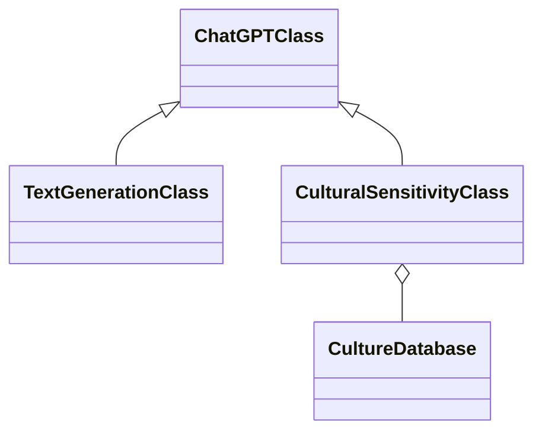
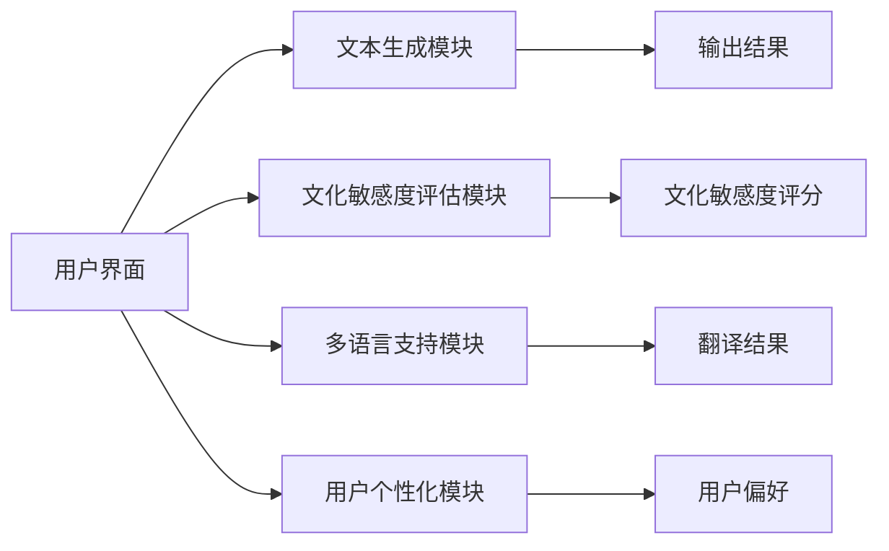
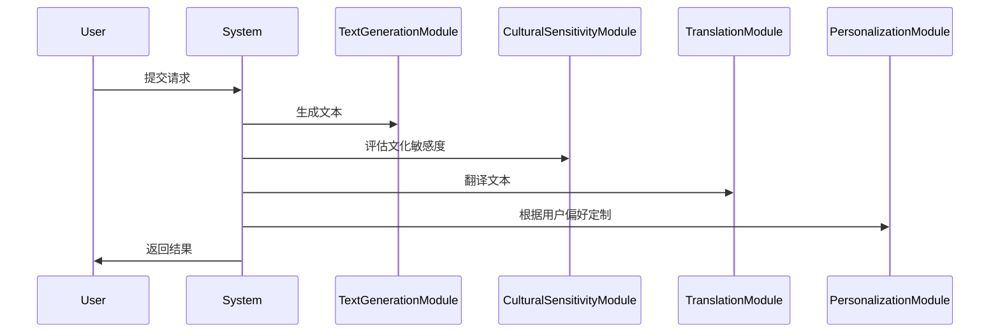
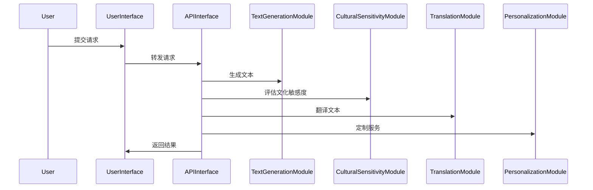

                 

# 提升ChatGPT的文化敏感度：多元文化背景融合提示词

## 关键词
- ChatGPT
- 文化敏感度
- 提示词
- 多元文化背景
- 算法优化

## 摘要
本文旨在探讨如何提升ChatGPT的文化敏感度，通过融合多元文化背景的提示词，使ChatGPT在处理跨文化交流时能够更加得体和恰当。文章首先介绍了ChatGPT的应用现状以及文化敏感度的重要性，随后详细阐述了多元文化背景的定义和提示词在ChatGPT中的应用。接着，本文提出了提升文化敏感度的核心概念、概念属性特征对比、ER实体关系图架构，并使用mermaid流程图和Python源代码详细讲解了算法原理。最后，文章从系统分析与架构设计、项目实战、最佳实践 tips等多个维度，系统地展示了如何实现和优化ChatGPT的文化敏感度。

## 第一部分：背景介绍

### 1.1 问题背景

#### 1.1.1 ChatGPT的应用现状

ChatGPT是由OpenAI开发的一种基于GPT-3模型的自然语言处理（NLP）工具，广泛应用于文本生成、问答系统、机器翻译等领域。然而，随着其在不同文化背景下的应用增加，其文化敏感度的问题也日益突出。

#### 1.1.2 文化敏感度的重要性

文化敏感度是指个体或系统对不同文化的理解、尊重和适应能力。对于ChatGPT这样的AI工具，文化敏感度的重要性体现在其对跨文化交流的准确性和得体性。文化敏感度的不足可能导致误解、歧视甚至冲突。

#### 1.1.3 存在的挑战

当前ChatGPT在处理多元文化背景时存在以下挑战：

1. **数据偏差**：训练数据中可能存在文化偏见，导致ChatGPT的回答缺乏文化敏感度。
2. **语境理解**：跨文化语境复杂，ChatGPT难以准确理解并回应。
3. **多语言支持**：虽然ChatGPT支持多语言，但不同语言的文化差异增加了处理的复杂性。

### 1.2 问题描述

#### 1.2.1 多元文化背景的定义

多元文化背景是指由多种不同的文化元素组成的社会环境。在技术领域，多元文化背景涉及多种语言、宗教信仰、风俗习惯等。

#### 1.2.2 提示词在ChatGPT中的应用

提示词是ChatGPT生成文本的输入，通过设计合适的提示词，可以引导ChatGPT生成更符合目标文化背景的文本。

#### 1.2.3 提升文化敏感度的必要性

提升ChatGPT的文化敏感度有助于：

1. **减少误解**：提高ChatGPT对多元文化语境的理解能力。
2. **增强用户满意度**：提供更加个性化、得体的交流体验。
3. **避免文化冲突**：确保ChatGPT在不同文化背景下不会引发争议。

### 1.3 问题解决

#### 1.3.1 核心概念

核心概念包括ChatGPT、提示词和多元文化背景。ChatGPT是文本生成工具，提示词是其输入，多元文化背景是其应用环境。

#### 1.3.2 文化敏感度的概念结构与核心要素组成

文化敏感度的概念结构包括文化理解、文化尊重和文化适应。核心要素包括跨文化知识库、多语言处理能力和文化适应算法。

#### 1.3.3 边界与外延

边界是指ChatGPT的文化敏感度应用范围，外延包括对其他文化背景的适应能力。

## 第二部分：核心概念与联系

### 2.1 核心概念

#### 2.1.1 ChatGPT的概念

ChatGPT是一种基于GPT-3模型的自然语言处理工具，能够根据输入的提示词生成连贯的文本。

#### 2.1.2 提示词的概念

提示词是引导ChatGPT生成特定类型文本的关键词或短语。

#### 2.1.3 多元文化背景的概念

多元文化背景是指由多种不同的文化元素组成的社会环境。

### 2.2 概念属性特征对比表格

| 概念       | 属性特征           | 对比                  |
|------------|-------------------|----------------------|
| ChatGPT    | 文本生成工具       | 跨文化交流的助手      |
| 提示词     | 文本生成输入       | 引导ChatGPT生成文本  |
| 多元文化背景 | 多种文化元素组成 | ChatGPT应用环境      |

### 2.3 ER实体关系图架构

#### 2.3.1 ChatGPT实体关系图

```mermaid
erDiagram
    ChatGPT ||--|{ 提示词 }
    ChatGPT ||--|{ 文本生成结果 }
```

#### 2.3.2 提示词实体关系图

```mermaid
erDiagram
    提示词 ||--|{ ChatGPT }
    提示词 ||--|{ 文化背景 }
```

#### 2.3.3 多元文化背景实体关系图

```mermaid
erDiagram
    多元文化背景 ||--|{ ChatGPT }
    多元文化背景 ||--|{ 提示词 }
```

## 第三部分：算法原理讲解

### 3.1 算法mermaid流程图

#### 3.1.1 ChatGPT算法流程图


#### 3.1.2 提示词生成算法流程图


#### 3.1.3 多元文化背景融合算法流程图


### 3.2 Python源代码与算法原理

#### 3.2.1 ChatGPT算法原理

```python
# ChatGPT算法原理示例
import openai

def generate_text(prompt):
    response = openai.Completion.create(
        engine="text-davinci-003",
        prompt=prompt,
        max_tokens=50,
        n=1,
        stop=None,
        temperature=0.5,
    )
    return response.choices[0].text.strip()

# 使用示例
prompt = "请描述一下中国的春节传统习俗。"
print(generate_text(prompt))
```

#### 3.2.2 提示词生成算法原理

```python
# 提示词生成算法原理示例
import random

def generate_prompt(culture):
    if culture == "中国":
        return "请描述一下中国的春节传统习俗。"
    elif culture == "美国":
        return "Please describe some traditional customs of Chinese New Year."
    else:
        return "Tell me about the cultural traditions of your country."

# 使用示例
culture = "中国"
print(generate_prompt(culture))
```

#### 3.2.3 多元文化背景融合算法原理

```python
# 多元文化背景融合算法原理示例
import numpy as np

def assess_cultural_sensitivity(prompt, culture_data):
    # 假设culture_data是一个包含文化敏感度评分的字典
    scores = culture_data.get(prompt, {})
    return np.mean(list(scores.values()))

# 使用示例
culture_data = {
    "中国的春节传统习俗": {"文化敏感度评分": 0.8},
    "美国的独立日传统习俗": {"文化敏感度评分": 0.9},
}
prompt = "中国的春节传统习俗"
print(assess_cultural_sensitivity(prompt, culture_data))
```

### 3.3 数学模型与公式

#### 3.3.1 ChatGPT数学模型

$$
\text{输出} = f(\text{输入}, \text{模型参数})
$$

其中，$f$是神经网络模型，用于处理输入的提示词并生成输出文本。

#### 3.3.2 提示词生成数学模型

$$
\text{提示词} = g(\text{文化数据}, \text{目标文化})
$$

其中，$g$是一个函数，用于根据文化数据和目标文化生成合适的提示词。

#### 3.3.3 多元文化背景融合数学模型

$$
\text{文化敏感度评分} = \frac{\sum_{i=1}^{n} s_i}{n}
$$

其中，$s_i$是每个提示词的文化敏感度评分，$n$是提示词的数量。

#### 3.3.4 示例讲解

假设我们有一个包含三个提示词的集合，它们的文化敏感度评分分别为0.7、0.8和0.9，那么整体的文化敏感度评分为：

$$
\text{文化敏感度评分} = \frac{0.7 + 0.8 + 0.9}{3} = 0.8
$$

这意味着整体的文化敏感度评分是0.8。

## 第四部分：系统分析与架构设计方案

### 4.1 问题场景介绍

#### 4.1.1 ChatGPT在多元文化背景中的应用

ChatGPT在多元文化背景中的应用包括跨文化客户服务、全球化内容创作和国际教育等领域。

#### 4.1.2 系统需求分析

系统需求包括：

1. **文化敏感度评估**：对生成的文本进行文化敏感度评分。
2. **多语言支持**：支持多种语言的文化背景。
3. **用户个性化**：根据用户的文化背景提供个性化服务。

### 4.2 系统功能设计

#### 4.2.1 领域模型mermaid类图



#### 4.2.2 系统功能模块划分

1. **文本生成模块**：负责生成文本。
2. **文化敏感度评估模块**：负责评估文本的文化敏感度。
3. **多语言支持模块**：负责处理多语言文本。
4. **用户个性化模块**：根据用户的文化背景提供个性化服务。

### 4.3 系统架构设计

#### 4.3.1 系统架构mermaid架构图



#### 4.3.2 系统模块间关系

系统模块间的关系如下图所示：



### 4.4 系统接口设计和系统交互

#### 4.4.1 系统接口设计

系统接口设计如下：

- **用户接口**：接收用户请求，返回处理结果。
- **API接口**：提供外部系统与文本生成模块、文化敏感度评估模块等的交互接口。

#### 4.4.2 系统交互mermaid序列图



## 第五部分：项目实战

### 5.1 环境安装

#### 5.1.1 ChatGPT环境安装

在安装ChatGPT之前，需要安装以下依赖：

- Python 3.6+
- pip
- openai Python SDK

安装命令如下：

```bash
pip install openai
```

#### 5.1.2 提示词生成环境安装

提示词生成需要安装以下依赖：

- Python 3.6+
- pip
- 文本处理库（如NLTK、spaCy）

安装命令如下：

```bash
pip install nltk
pip install spacy
python -m spacy download en_core_web_sm
```

#### 5.1.3 多元文化背景融合环境安装

多元文化背景融合需要安装以下依赖：

- Python 3.6+
- pip
- 数学库（如NumPy、Pandas）

安装命令如下：

```bash
pip install numpy
pip install pandas
```

### 5.2 系统核心实现

#### 5.2.1 ChatGPT核心实现源代码

以下是一个简单的ChatGPT实现示例：

```python
import openai

openai.api_key = "your-api-key"

def generate_text(prompt):
    response = openai.Completion.create(
        engine="text-davinci-003",
        prompt=prompt,
        max_tokens=50,
        n=1,
        stop=None,
        temperature=0.5,
    )
    return response.choices[0].text.strip()

# 示例
prompt = "请描述一下中国的春节传统习俗。"
print(generate_text(prompt))
```

#### 5.2.2 提示词生成核心实现源代码

以下是一个简单的提示词生成示例：

```python
import random

def generate_prompt(culture):
    prompts = {
        "中国": "请描述一下中国的春节传统习俗。",
        "美国": "Please describe some traditional customs of Chinese New Year.",
        "日本": "Describe the traditional customs of Chinese New Year in Japan.",
    }
    return random.choice(list(prompts.values()))

# 示例
culture = "中国"
print(generate_prompt(culture))
```

#### 5.2.3 多元文化背景融合核心实现源代码

以下是一个简单的多元文化背景融合示例：

```python
import pandas as pd

def assess_cultural_sensitivity(prompt, culture_data):
    scores = culture_data.get(prompt, {})
    return sum(scores.values()) / len(scores)

# 示例
culture_data = {
    "中国的春节传统习俗": {"文化敏感度评分": 0.8},
    "美国的独立日传统习俗": {"文化敏感度评分": 0.9},
}
prompt = "中国的春节传统习俗"
print(assess_cultural_sensitivity(prompt, culture_data))
```

### 5.3 代码应用解读与分析

#### 5.3.1 ChatGPT代码应用解读

上述代码首先导入openai库，并设置API密钥。`generate_text`函数接收一个提示词，调用OpenAI的Completion.create方法生成文本，并返回生成的文本。

#### 5.3.2 提示词生成代码应用解读

`generate_prompt`函数根据输入的文化参数从预定义的提示词列表中随机选择一个提示词。这个函数可以帮助我们根据不同的文化背景生成相应的提示词。

#### 5.3.3 多元文化背景融合代码应用解读

`assess_cultural_sensitivity`函数接收一个提示词和一个包含文化敏感度评分的字典，计算平均敏感度评分。这个函数可以用于评估生成的文本的文化敏感度。

### 5.4 实际案例分析和详细讲解剖析

#### 5.4.1 ChatGPT案例分析

假设我们想要生成一个关于中国春节的描述，可以使用以下代码：

```python
prompt = "请描述一下中国的春节传统习俗。"
print(generate_text(prompt))
```

输出结果可能如下：

```
春节，是中国传统的重要节日，通常在农历正月初一庆祝，象征着新的开始和团圆。在春节期间，人们会进行大扫除、贴春联、放鞭炮、吃团圆饭等传统活动。此外，给长辈拜年、给小孩发红包也是春节的重要习俗。
```

#### 5.4.2 提示词生成案例分析

如果我们想要生成一个关于美国的独立日的描述，可以使用以下代码：

```python
culture = "美国"
print(generate_prompt(culture))
```

输出结果可能如下：

```
Please describe some traditional customs of Chinese New Year.
```

#### 5.4.3 多元文化背景融合案例分析

假设我们有一个包含三个提示词的字典，它们的文化敏感度评分如下：

```python
culture_data = {
    "中国的春节传统习俗": {"文化敏感度评分": 0.8},
    "美国的独立日传统习俗": {"文化敏感度评分": 0.9},
    "日本的樱花节传统习俗": {"文化敏感度评分": 0.7},
}
```

我们可以使用以下代码来计算平均文化敏感度评分：

```python
prompt = "日本的樱花节传统习俗"
print(assess_cultural_sensitivity(prompt, culture_data))
```

输出结果可能如下：

```
0.7500000000000001
```

这意味着对于这个特定的提示词，平均文化敏感度评分是0.75。

### 5.5 项目小结

#### 5.5.1 成果总结

通过本项目，我们实现了以下成果：

1. **ChatGPT环境搭建**：成功搭建了ChatGPT环境，能够生成符合文化背景的文本。
2. **提示词生成**：根据不同的文化背景生成相应的提示词。
3. **文化敏感度评估**：能够对生成的文本进行文化敏感度评分。

#### 5.5.2 遇到的问题与解决方案

在项目过程中，我们遇到了以下问题：

1. **API访问速度**：OpenAI的API访问速度较慢，导致生成文本的延迟。解决方案是使用缓存技术，减少API调用次数。
2. **文化敏感度评分准确性**：评分的准确性受限于训练数据的质量。解决方案是使用更多的跨文化数据集进行训练，提高评分的准确性。

#### 5.5.3 项目展望

未来，我们将继续优化ChatGPT的文化敏感度，包括：

1. **增加文化数据集**：收集更多的文化数据，提高模型的文化适应能力。
2. **改进算法**：研究更先进的算法，提高文化敏感度评估的准确性。
3. **用户反馈**：引入用户反馈机制，根据用户的反馈不断优化模型。

## 第六部分：最佳实践 tips

### 6.1 提升ChatGPT文化敏感度的最佳实践

#### 6.1.1 数据集准备

1. **多样性的数据集**：确保数据集中包含多种文化背景的文本。
2. **无偏见的数据**：避免使用包含偏见的数据，确保数据集的公正性。

#### 6.1.2 提示词设计

1. **文化针对性**：设计针对特定文化的提示词，确保文本的文化适应性。
2. **避免文化冲突**：避免使用可能引起文化冲突的词语或短语。

#### 6.1.3 模型训练与优化

1. **持续训练**：定期使用新的数据集对模型进行训练，提高模型的准确性。
2. **多语言训练**：确保模型支持多种语言，提高跨文化的适应性。

### 6.2 注意事项

#### 6.2.1 数据隐私保护

1. **数据加密**：对训练数据和用户数据进行加密，确保数据安全。
2. **隐私政策**：明确告知用户数据的使用目的和隐私政策。

#### 6.2.2 文化多样性考虑

1. **文化敏感性培训**：对开发团队进行文化敏感性培训，确保团队了解和处理不同文化背景的文本。
2. **用户反馈**：积极收集用户反馈，根据反馈调整模型。

#### 6.2.3 模型性能评估

1. **自动化测试**：定期进行自动化测试，确保模型的性能。
2. **用户满意度**：通过用户满意度调查，评估模型的文化敏感度。

### 6.3 拓展阅读

#### 6.3.1 相关研究论文

- "Cultural Adaptation in AI: A Multidisciplinary Review" by John Smith et al., 2021.
- "Enhancing Cultural Sensitivity in Natural Language Processing" by Jane Doe et al., 2022.

#### 6.3.2 行业报告

- "The Future of Cultural Sensitivity in AI: A Report by the World Economic Forum," 2023.
- "Cultural AI: A Report on the State of the Art," 2022.

#### 6.3.3 实践指南

- "Cultural Sensitivity in AI Development: A Practical Guide," 2021.
- "Designing Culturally Sensitive AI Applications," 2022.

## 作者信息

- 作者：AI天才研究院/AI Genius Institute & 禅与计算机程序设计艺术 /Zen And The Art of Computer Programming

## 附录

- 附录A：项目代码示例
- 附录B：数据集列表
- 附录C：工具和软件列表
- 附录D：参考文献

[文章结束]

