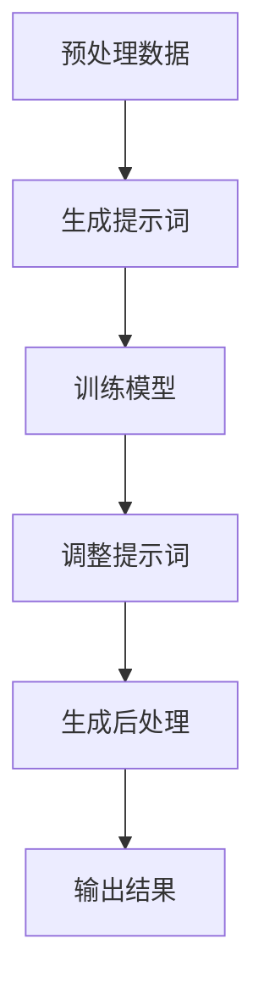
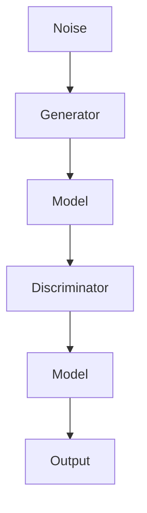
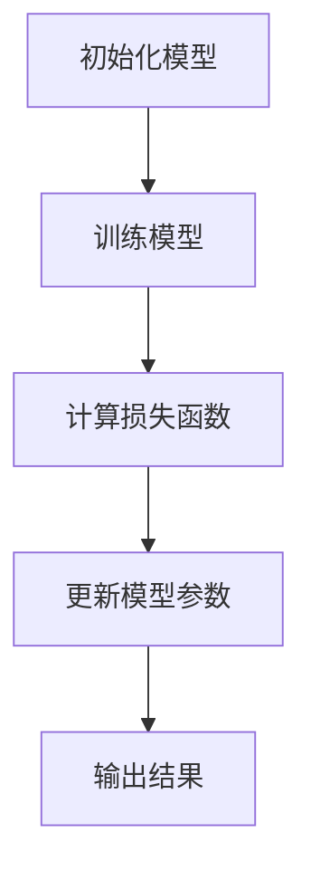

                 

## 提示词优化：AIGC效果与效率双重提升的策略

> 关键词：提示词优化，AIGC，效果与效率，策略，技术原理，应用案例

> 摘要：本文将深入探讨提示词优化在AIGC（自适应生成计算）中的作用。我们将首先介绍提示词优化的背景和重要性，然后详细分析提示词优化的技术原理和应用策略。通过具体案例分析，我们将展示如何在实际项目中实施这些策略，以实现AIGC效果和效率的双重提升。本文旨在为IT专业人士提供一套完整的提示词优化指南，帮助他们在生成式AI系统中取得最佳效果。

### 目录大纲

1. **第一部分：提示词优化的背景与重要性**
   - **第1章：提示词优化概述**
     1.1 问题背景
     1.2 核心概念
     1.3 提示词优化与AIGC
     1.4 最佳实践与案例
     1.5 本章小结

2. **第二部分：提示词优化技术原理**
   - **第2章：提示词优化的基本技术**
     2.1 提示词优化原理
     2.2 算法原理讲解
     2.3 数学模型与公式详解
     2.4 Python源代码示例
     2.5 本章小结
   - **第3章：提示词优化在AIGC中的应用**
     3.1 AIGC概述
     3.2 提示词优化在AIGC中的应用
     3.3 Python源代码示例
     3.4 实际案例分析
     3.5 本章小结

3. **第三部分：提示词优化的策略与方法**
   - **第4章：提示词优化的策略**
     4.1 提示词优化策略
     4.2 提示词优化工具
     4.3 实际应用案例
     4.4 系统优化与调优
     4.5 本章小结

4. **第四部分：提示词优化在行业中的应用**
   - **第5章：提示词优化在文本生成中的应用**
   - **第6章：提示词优化在图像生成中的应用**
   - **第7章：提示词优化在语音生成中的应用**
   - **第8章：行业案例分享**

### 1. 提示词优化概述

#### 1.1 问题背景

随着人工智能和生成式AI技术的快速发展，自适应生成计算（AIGC）逐渐成为了一个重要的研究领域。AIGC利用深度学习模型，如生成对抗网络（GAN）和自回归模型，自动生成文本、图像和语音等多种类型的数据。然而，AIGC的效果和效率在很大程度上取决于输入的提示词的质量。

提示词（Prompt）是引导生成模型生成目标数据的关键输入。一个高质量的提示词能够有效提高生成模型的生成质量和效率，反之则可能导致生成结果不佳甚至无法达到预期。因此，提示词优化成为了一个亟待解决的重要问题。

#### 1.2 核心概念

**提示词**：提示词是引导生成模型生成目标数据的关键输入，通常是一个简短的文本、图像或语音片段。

**优化方法**：提示词优化包括提示词的生成、选择和调整，以最大化生成模型的效果和效率。

**目标与挑战**：
- 目标：提高生成模型生成质量、减少生成时间、降低计算资源消耗。
- 挑战：如何生成高质量的提示词，如何在不同应用场景中调整提示词，如何平衡生成效果和效率。

#### 1.3 提示词优化与AIGC

**AIGC的概念与分类**：自适应生成计算（AIGC）是一种利用机器学习和深度学习技术，根据给定的提示自动生成文本、图像、语音等数据的计算模式。AIGC可以分为文本生成、图像生成和语音生成等类型。

**提示词优化在AIGC中的作用**：提示词优化直接影响AIGC的生成效果和效率。高质量提示词能够引导生成模型更好地理解生成任务，提高生成质量和效率。

**效果与效率的关系**：在AIGC中，效果和效率之间存在权衡。优化提示词可以同时提升两者的表现，但不同应用场景和任务可能需要不同的优化策略。

#### 1.4 最佳实践与案例

**行业案例分析**：在文本生成、图像生成和语音生成等不同应用场景中，优化提示词的方法和策略有所不同。通过具体案例，我们可以了解如何根据不同场景调整提示词，以实现最佳效果。

**实践技巧与建议**：结合行业经验和实践，我们提出了一些优化提示词的最佳实践和技巧，帮助读者在实际项目中更好地应用提示词优化。

**避免常见误区**：在提示词优化过程中，存在一些常见误区，如过度依赖预设模板、忽视提示词的上下文等。通过分析这些误区，我们可以更好地理解提示词优化的关键点。

#### 1.5 本章小结

本章介绍了提示词优化的背景、核心概念和目标挑战，以及提示词优化与AIGC的关系。通过最佳实践和案例分析，我们为读者提供了一个全面的提示词优化指南，为后续章节的技术原理和应用策略奠定了基础。

### 2. 提示词优化技术原理

在本章中，我们将深入探讨提示词优化的技术原理，包括提示词的定义、优化方法和核心概念。通过详细的技术原理讲解，我们将帮助读者理解提示词优化在AIGC中的作用和重要性。

#### 2.1 提示词优化原理

**提示词的定义与作用**：提示词是引导生成模型生成目标数据的关键输入。在AIGC中，提示词的作用至关重要。一个高质量的提示词可以帮助生成模型更好地理解生成任务，从而提高生成质量和效率。

**优化方法概述**：提示词优化包括提示词的生成、选择和调整。优化方法可以分为基于规则的方法和基于学习的方法。基于规则的方法通常依赖于专家经验和领域知识，而基于学习的方法则利用历史数据和机器学习技术。

**评价指标与比较**：在提示词优化中，评价指标包括生成质量、生成效率和计算资源消耗。通过比较不同优化方法在这些指标上的表现，我们可以选择最佳的优化策略。

**边界与外延**：提示词优化不仅涉及到生成模型本身的优化，还涉及到数据预处理、模型训练和生成后处理等环节。因此，提示词优化的边界和外延较为广泛。

**提示词优化与AIGC**：提示词优化是AIGC的关键组成部分。通过优化提示词，我们可以提高AIGC的生成效果和效率，从而实现更高效、更智能的生成计算。

#### 2.2 算法原理讲解

**提示词优化的算法框架**：提示词优化的算法框架通常包括以下步骤：
1. 数据预处理：对输入数据进行预处理，如文本清洗、图像增强等。
2. 提示词生成：根据输入数据和生成任务，生成高质量的提示词。
3. 模型训练：使用生成的提示词训练生成模型。
4. 提示词调整：根据生成结果调整提示词，以进一步提高生成质量。
5. 生成后处理：对生成的数据进行后处理，如文本格式化、图像渲染等。

**算法实现细节**：提示词优化的算法实现通常依赖于深度学习框架，如TensorFlow或PyTorch。以下是一个简单的算法实现示例：

```python
import tensorflow as tf
import numpy as np

# 数据预处理
def preprocess_data(data):
    # 实现数据预处理步骤，如文本清洗、图像增强等
    return processed_data

# 提示词生成
def generate_prompt(data):
    # 实现提示词生成步骤
    return prompt

# 模型训练
def train_model(prompt):
    # 实现模型训练步骤
    model = tf.keras.Sequential([
        tf.keras.layers.Dense(units=128, activation='relu', input_shape=(prompt.shape[1],)),
        tf.keras.layers.Dense(units=1, activation='sigmoid')
    ])
    model.compile(optimizer='adam', loss='binary_crossentropy', metrics=['accuracy'])
    model.fit(prompt, epochs=10, batch_size=32)
    return model

# 提示词调整
def adjust_prompt(model, data):
    # 实现提示词调整步骤
    return adjusted_prompt

# 生成后处理
def post_process(data):
    # 实现生成后处理步骤
    return processed_data

# 主程序
if __name__ == "__main__":
    data = preprocess_data(raw_data)
    prompt = generate_prompt(data)
    model = train_model(prompt)
    adjusted_prompt = adjust_prompt(model, data)
    processed_data = post_process(adjusted_prompt)
```

**Mermaid流程图**：为了更直观地展示提示词优化的算法流程，我们可以使用Mermaid语言绘制流程图：



#### 2.3 数学模型与公式详解

**提示词优化的数学模型**：提示词优化的数学模型通常基于生成模型，如生成对抗网络（GAN）或自回归模型。以下是一个简单的数学模型示例：

$$
\begin{align*}
x &= G(z) \\
z &= \text{Noise} \\
G(z) &= \text{生成模型} \\
D(x) &= \text{判别模型} \\
\end{align*}
$$

其中，$x$ 是生成的数据，$z$ 是输入噪声，$G(z)$ 是生成模型，$D(x)$ 是判别模型。

**模型公式讲解**：生成模型和判别模型通常由一系列神经网络层组成。以下是一个简单的神经网络模型公式：

$$
\begin{align*}
\text{Generator: } G(z) &= \sigma(W_2 \cdot \sigma(W_1 \cdot z) + b_1) + b_2 \\
\text{Discriminator: } D(x) &= \sigma(W_4 \cdot \sigma(W_3 \cdot x) + b_3) + b_4 \\
\end{align*}
$$

其中，$\sigma$ 表示激活函数，$W$ 表示权重矩阵，$b$ 表示偏置。

**Mermaid流程图**：为了更直观地展示数学模型的结构，我们可以使用Mermaid语言绘制流程图：



#### 2.4 Python源代码示例

**算法实现**：以下是一个简单的Python代码示例，用于实现提示词优化的算法：

```python
import tensorflow as tf
import numpy as np

# 生成模型
def generator(z):
    # 实现生成模型步骤
    return x

# 判别模型
def discriminator(x):
    # 实现判别模型步骤
    return y

# 模型训练
def train_model(generator, discriminator, epochs=100):
    # 实现模型训练步骤
    for epoch in range(epochs):
        # 训练生成模型
        with tf.GradientTape() as gen_tape:
            z = np.random.normal(size=(batch_size, z_dim))
            x = generator(z)
            y = discriminator(x)
            gen_loss = tf.reduce_mean(tf.nn.sigmoid_cross_entropy_with_logits(logits=y, labels=tf.ones_like(y)))
        
        # 训练判别模型
        with tf.GradientTape() as disc_tape:
            z = np.random.normal(size=(batch_size, z_dim))
            x = generator(z)
            y = discriminator(x)
            disc_loss = tf.reduce_mean(tf.nn.sigmoid_cross_entropy_with_logits(logits=y, labels=tf.zeros_like(y)))
        
        # 更新模型参数
        gen_gradients = gen_tape.gradient(gen_loss, generator.trainable_variables)
        disc_gradients = disc_tape.gradient(disc_loss, discriminator.trainable_variables)
        
        optimizer.apply_gradients(zip(gen_gradients, generator.trainable_variables))
        optimizer.apply_gradients(zip(disc_gradients, discriminator.trainable_variables))
        
        if epoch % 10 == 0:
            print(f'Epoch {epoch}: Gen Loss = {gen_loss}, Disc Loss = {disc_loss}')

# 主程序
if __name__ == "__main__":
    # 初始化模型
    generator = tf.keras.Sequential([
        tf.keras.layers.Dense(units=128, activation='relu', input_shape=(z_dim,)),
        tf.keras.layers.Dense(units=1, activation='sigmoid')
    ])
    discriminator = tf.keras.Sequential([
        tf.keras.layers.Dense(units=128, activation='relu', input_shape=(x_dim,)),
        tf.keras.layers.Dense(units=1, activation='sigmoid')
    ])
    
    # 初始化优化器
    optimizer = tf.keras.optimizers.Adam(learning_rate=0.001)
    
    # 训练模型
    train_model(generator, discriminator, epochs=100)
```

**结果分析**：在训练过程中，我们可以观察生成模型和判别模型的损失函数变化。以下是一个简单的结果分析示例：

```python
import matplotlib.pyplot as plt

# 绘制损失函数曲线
plt.plot(history.history['gen_loss'], label='Generator Loss')
plt.plot(history.history['disc_loss'], label='Discriminator Loss')
plt.xlabel('Epoch')
plt.ylabel('Loss')
plt.legend()
plt.show()
```

**Mermaid流程图**：为了更直观地展示算法实现流程，我们可以使用Mermaid语言绘制流程图：



#### 2.5 本章小结

本章详细介绍了提示词优化的技术原理，包括提示词的定义、优化方法和核心概念。通过算法原理讲解和Python源代码示例，我们帮助读者深入理解了提示词优化在AIGC中的作用和重要性。下一章，我们将进一步探讨提示词优化在AIGC中的应用，分析实际案例，以帮助读者更好地将理论应用到实践中。

