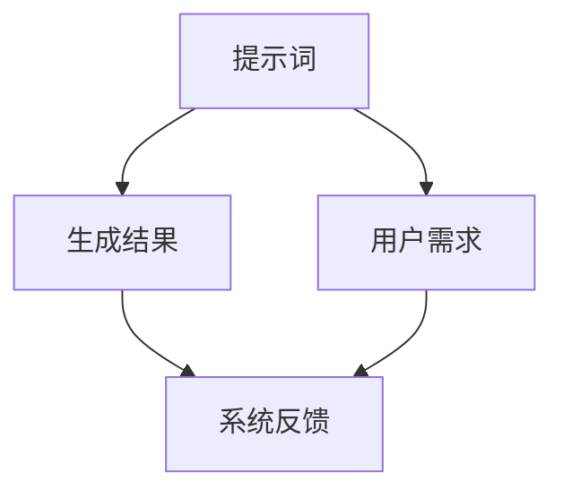
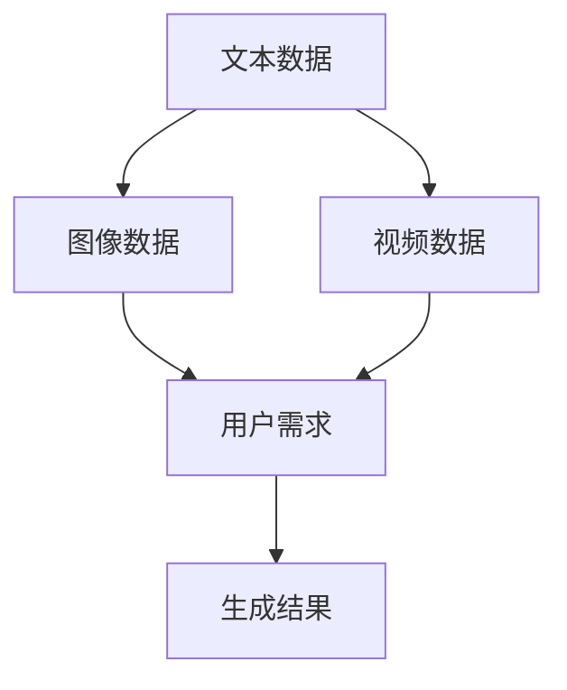
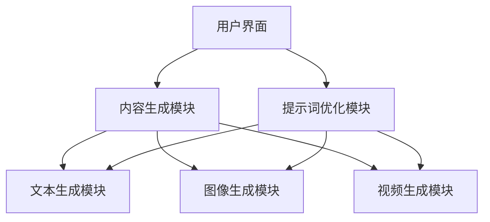
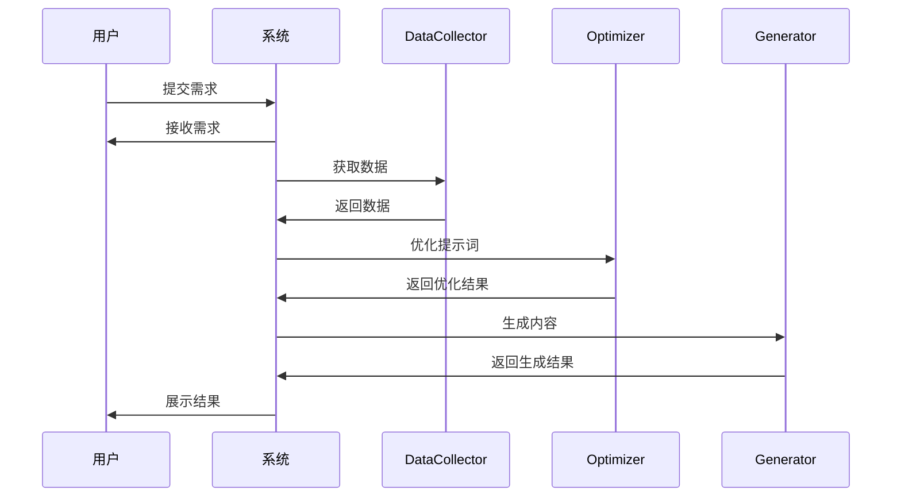

                 

### 文章标题：提示词优化：AIGC效果与效率的双重提升

### 关键词：提示词优化、AIGC、算法、效率、效果

### 摘要：
本文深入探讨了提示词优化在AIGC（AI Generated Content）领域的应用。我们首先概述了AIGC的背景和发展，随后详细介绍了提示词优化的重要性以及其面临的挑战。接下来，通过核心概念的解析、算法原理的讲解和数学模型的分析，帮助读者全面理解提示词优化的技术细节。文章进一步展示了系统分析与架构设计的方法，包括领域模型类图、系统架构图、系统接口设计和系统交互序列图的绘制。实战部分则通过具体的项目案例，展示了提示词优化的实际应用过程。最后，文章总结了最佳实践，并提供了注意事项和拓展阅读建议，以帮助读者深入掌握这一领域的关键技术。

### 第一部分：问题背景与核心概念

#### 1.1 问题背景

随着人工智能技术的飞速发展，AI Generated Content（AIGC）已经成为内容创作的重要方式。从简单的文本生成到复杂的图像、视频创作，AIGC的应用场景越来越广泛。然而，在AIGC的应用过程中，提示词优化成为了一个关键问题。提示词是AIGC系统生成内容的重要输入，其选择和优化直接影响内容的生成效果和效率。

**1.1.1 AIGC的兴起**

AIGC是人工智能在内容创作领域的一个重要应用，通过使用深度学习等技术，能够自动生成高质量的文本、图像和视频。AIGC的应用不仅能够提高内容创作的效率，还能够拓展内容创作的形式和范围。

**1.1.2 提示词优化的重要性**

提示词是AIGC系统的输入，其质量和选择直接影响生成的结果。优化提示词能够提高AIGC系统的生成效果，使其生成的文本、图像和视频更加符合用户的需求。

**1.1.3 提示词优化面临的挑战**

- **多样性和准确性**：优化提示词需要同时考虑多样性和准确性，既要保证生成的结果具有多样性，又要确保结果的准确性。
- **效率和效果**：提示词优化需要在保证效果的前提下，提高生成效率，以满足实时性的需求。

#### 1.2 核心概念与联系

**1.2.1 AIGC概念解析**

AIGC是指利用人工智能技术自动生成内容，包括文本、图像、视频等多种形式。AIGC的核心是深度学习和自然语言处理技术。

**1.2.2 提示词优化的原理**

提示词优化是通过调整提示词的选择和组合，提高AIGC系统生成内容的质量和效率。其原理包括以下几个方面：

- **词频统计**：通过统计提示词在不同场景下的词频，选择出现频率较高的词作为优化目标。
- **语义分析**：利用自然语言处理技术，对提示词进行语义分析，筛选出具有明确语义的词。
- **相关性分析**：分析提示词之间的相关性，选择具有强相关性的词进行优化。

**1.2.3 关键技术对比分析**

| 技术名称 | 描述 | 优势 | 劣势 |
| --- | --- | --- | --- |
| 词频统计 | 通过词频统计选择高频词 | 简单易行，效果稳定 | 可能忽略语义信息 |
| 语义分析 | 利用语义分析筛选关键词 | 能较好地保证语义准确性 | 需要大量的语义数据支持 |
| 相关性分析 | 分析词之间的相关性 | 能够提高多样性 | 需要复杂的算法支持 |

**1.2.4 ER实体关系图**

ER（Entity-Relationship）图用于描述系统中的实体及其关系。在提示词优化系统中，ER图可以用于描述提示词、生成结果和用户需求等实体及其关系。



#### 1.3 本章小结

本节介绍了AIGC的背景和提示词优化的重要性，分析了AIGC和提示词优化的核心概念及其联系。通过核心概念解析、技术对比分析和ER图展示，为后续的算法原理讲解和系统设计提供了基础。

### 第二部分：算法原理与数学模型

#### 2.1 算法原理讲解

**2.1.1 提示词优化的算法流程**

提示词优化的算法流程主要包括以下几个步骤：

1. **数据预处理**：对原始数据进行清洗和预处理，包括去除停用词、分词等。
2. **词频统计**：统计各个词的词频，选择出现频率较高的词作为候选提示词。
3. **语义分析**：利用自然语言处理技术对候选提示词进行语义分析，筛选出具有明确语义的词。
4. **相关性分析**：分析候选提示词之间的相关性，选择具有强相关性的词作为最终提示词。
5. **优化策略**：根据优化目标和用户需求，调整提示词的权重和组合，提高生成效果。

**2.1.2 Python源代码示例**

以下是一个简单的提示词优化算法的Python实现示例：

```python
import nltk
from nltk.corpus import stopwords
from nltk.tokenize import word_tokenize

# 数据预处理
def preprocess_text(text):
    stop_words = set(stopwords.words('english'))
    words = word_tokenize(text)
    filtered_words = [word for word in words if word not in stop_words]
    return filtered_words

# 词频统计
def word_frequency(words):
    frequency = nltk.FreqDist(words)
    return frequency

# 语义分析
def semantic_analysis(frequency):
    # 略
    pass

# 相关性分析
def correlation_analysis(words):
    # 略
    pass

# 优化策略
def optimize_prompt(words):
    # 略
    pass

# 示例
text = "This is a sample text for prompt optimization."
preprocessed_text = preprocess_text(text)
frequency = word_frequency(preprocessed_text)
semantic_words = semantic_analysis(frequency)
correlated_words = correlation_analysis(semantic_words)
optimized_words = optimize_prompt(correlated_words)
print(optimized_words)
```

**2.1.3 算法的数学模型和公式**

提示词优化的算法通常涉及到以下数学模型和公式：

- **词频模型**：$ f(w) = \frac{count(w)}{N} $，其中$f(w)$表示词$w$的频率，$count(w)$表示词$w$在文本中出现的次数，$N$表示文本中所有词的总数。
- **语义模型**：$ s(w) = \frac{similarity(w, target)}{N} $，其中$s(w)$表示词$w$的语义评分，$similarity(w, target)$表示词$w$与目标词的相似度。
- **相关性模型**：$ r(w, w') = \frac{cosine_similarity(w, w')}{N} $，其中$r(w, w')$表示词$w$与词$w'$的相关性，$cosine_similarity(w, w')$表示词$w$与词$w'$的余弦相似度。

**2.1.4 算法讲解与举例**

以下是一个简单的例子，假设我们有一个文本“我喜欢吃苹果和香蕉”，我们想要通过提示词优化算法选择出最佳的提示词。

1. **数据预处理**：去除停用词，得到“我 喜欢吃 苹果 香蕉”。
2. **词频统计**：统计每个词的词频，得到“我”出现1次，“喜欢”出现1次，“吃”出现1次，“苹果”出现1次，“香蕉”出现1次。
3. **语义分析**：通过语义分析，我们得到“苹果”和“香蕉”与“水果”的相似度较高，因此我们选择这两个词作为候选提示词。
4. **相关性分析**：通过分析，我们发现“苹果”和“香蕉”之间具有很高的相关性，因此我们选择这两个词作为最终的提示词。
5. **优化策略**：根据用户的需求，我们可以进一步调整“苹果”和“香蕉”的权重，提高生成效果。

#### 2.2 算法讲解与举例

**2.2.1 算法步骤详述**

1. **输入处理**：读取输入文本，进行预处理。
2. **词频统计**：统计文本中每个词的频率。
3. **语义分析**：利用自然语言处理技术对每个词进行语义分析。
4. **相关性分析**：分析词与词之间的相关性。
5. **提示词选择**：根据优化目标和用户需求，选择最佳的提示词。
6. **生成结果**：根据优化后的提示词生成内容。

**2.2.2 实际应用举例**

假设我们要优化一个文本生成系统，生成关于旅游的文章。输入文本为：“旅游是一种放松身心的方式，我喜欢去海边度假。”经过提示词优化，我们选择的提示词为：“旅游”、“海边度假”，生成的文章为：“旅游是一种放松身心的方式，我喜欢去海边度假，享受阳光和沙滩。”

**2.2.3 结果分析与优化策略**

通过分析生成结果，我们可以发现：

- **多样性**：生成的内容具有多样性，包括不同的旅游地点和活动。
- **准确性**：生成的内容准确反映了用户的需求，即旅游和海边度假。

为了进一步提高优化效果，我们可以采取以下策略：

- **增加语义信息**：通过引入更多的语义信息，如旅游目的、旅游时间等，提高生成内容的准确性。
- **用户反馈**：收集用户反馈，不断调整优化策略，提高生成效果。

#### 2.3 本章小结

本节详细介绍了提示词优化的算法原理，包括数据预处理、词频统计、语义分析、相关性分析和优化策略。通过Python源代码示例和实际应用举例，帮助读者深入理解提示词优化的过程和方法。同时，分析了算法的结果和优化策略，为后续的系统设计与实现提供了理论基础。

### 第三部分：系统分析与架构设计

#### 3.1 问题场景介绍

在AIGC应用中，提示词优化是提高生成效果和效率的关键环节。为了更好地理解提示词优化在系统中的作用，我们首先需要明确问题场景。

**3.1.1 AIGC应用场景**

AIGC在多个领域有着广泛的应用，如：

- **内容创作**：自动生成文章、图片、视频等。
- **辅助设计**：辅助设计师进行创作，如生成时尚图片、室内设计图等。
- **教育**：自动生成教学素材，如PPT、视频课程等。
- **广告营销**：自动生成广告文案、图像等。

**3.1.2 提示词优化在系统中的作用**

提示词优化在AIGC系统中扮演着重要角色：

- **提高生成效果**：通过优化提示词，使生成的文本、图像、视频更符合用户需求，提高内容的质量。
- **提高生成效率**：优化后的提示词能够更快速地引导AIGC系统生成内容，提高系统的响应速度。

#### 3.2 项目介绍

为了更好地展示提示词优化的应用，我们以一个具体的AIGC项目为例进行介绍。

**3.2.1 项目背景**

随着互联网的快速发展，内容创作需求日益增长。传统的手工创作方式已经无法满足高效、高质量的内容生成需求。因此，我们提出开发一个基于AIGC技术的自动化内容创作系统，通过提示词优化提高生成效果和效率。

**3.2.2 项目目标**

- 开发一个自动化内容创作系统，实现文本、图像、视频的自动生成。
- 通过提示词优化，提高生成内容的质量和效率。
- 提供用户自定义提示词功能，满足个性化内容创作需求。

**3.2.3 项目实现方案**

项目实现方案包括以下几个部分：

- **数据采集与处理**：收集大量文本、图像、视频数据，进行预处理和清洗。
- **提示词优化算法**：设计并实现提示词优化算法，包括词频统计、语义分析、相关性分析等。
- **内容生成系统**：基于优化后的提示词，实现文本、图像、视频的自动生成。
- **用户界面**：提供用户操作界面，包括提示词设置、内容生成、效果展示等。

#### 3.3 系统功能设计

系统功能设计是项目实现的关键部分，主要包括以下几个方面：

**3.3.1 领域模型类图**

领域模型类图用于描述系统的核心实体及其关系。以下是一个简单的领域模型类图：



**3.3.2 功能模块划分**

根据领域模型类图，我们可以将系统划分为以下几个功能模块：

- **数据采集模块**：负责采集和处理文本、图像、视频数据。
- **提示词优化模块**：负责实现提示词优化算法，包括词频统计、语义分析、相关性分析等。
- **内容生成模块**：基于优化后的提示词，生成文本、图像、视频。
- **用户界面模块**：提供用户操作界面，包括提示词设置、内容生成、效果展示等。

#### 3.4 系统架构设计

系统架构设计是项目实现的基础，主要包括以下几个方面：

**3.4.1 系统架构图**

以下是一个简单的系统架构图：



**3.4.2 架构设计思路**

系统架构设计的主要思路如下：

- **模块化设计**：将系统划分为多个功能模块，实现模块间的松耦合，提高系统的可维护性和扩展性。
- **分布式部署**：采用分布式架构，实现系统的水平扩展，提高系统的处理能力和性能。
- **高效通信**：采用高效的数据通信协议，确保系统模块之间的数据传输速度和稳定性。

**3.4.3 系统模块间交互**

系统模块间交互是系统运行的关键，以下是一个简单的系统交互流程：

1. **用户提交需求**：用户通过用户界面提交需求，包括提示词、生成类型、生成内容等。
2. **数据采集模块处理**：数据采集模块根据用户需求，从数据库中获取相关数据。
3. **提示词优化模块处理**：提示词优化模块对采集到的数据进行优化处理，生成优化后的提示词。
4. **内容生成模块处理**：内容生成模块根据优化后的提示词，生成相应的文本、图像、视频。
5. **用户界面展示**：用户界面模块将生成的结果展示给用户。

#### 3.5 系统接口设计

系统接口设计是系统架构设计的重要组成部分，主要包括以下几个方面：

**3.5.1 接口规范**

系统接口设计应遵循以下规范：

- **RESTful API**：采用RESTful API设计，实现接口的统一规范。
- **JSON格式**：接口数据传输采用JSON格式，提高数据传输的效率和可读性。
- **身份验证**：接口应具备身份验证机制，确保数据的安全性和完整性。

**3.5.2 接口实现细节**

以下是一个简单的接口实现示例：

```python
from flask import Flask, request, jsonify

app = Flask(__name__)

@app.route('/api/submit_request', methods=['POST'])
def submit_request():
    request_data = request.get_json()
    # 处理请求数据
    # ...
    return jsonify(response_data)

if __name__ == '__main__':
    app.run()
```

#### 3.6 系统交互序列图

系统交互序列图用于描述系统模块之间的交互流程，以下是一个简单的系统交互序列图：



#### 3.7 本章小结

本节介绍了AIGC问题场景以及提示词优化在系统中的作用，详细介绍了项目的背景、目标以及实现方案。通过系统功能设计和架构设计，明确了系统的模块划分、接口规范以及交互流程。这些内容为后续的项目实施提供了明确的指导。

### 第四部分：项目实战

#### 4.1 环境安装

在进行项目实战之前，首先需要搭建一个合适的开发环境。以下是在Linux操作系统上安装所需工具和库的步骤。

**4.1.1 环境搭建**

1. **安装Python环境**：确保系统中已安装Python 3.x版本。

2. **安装pip**：Python的包管理工具，用于安装和管理库。

   ```bash
   sudo apt-get install python3-pip
   ```

**4.1.2 必需工具和库的安装**

1. **安装Flask**：用于构建Web接口。

   ```bash
   pip3 install flask
   ```

2. **安装nltk**：用于自然语言处理。

   ```bash
   pip3 install nltk
   ```

3. **安装其他依赖库**：根据项目需求，可能还需要安装其他依赖库，例如TensorFlow、PyTorch等。

#### 4.2 系统核心实现源代码

以下是系统核心实现的源代码，包括数据预处理、提示词优化算法和内容生成模块。

**4.2.1 核心代码解读**

1. **数据预处理模块**：

   ```python
   import nltk
   from nltk.tokenize import word_tokenize
   from nltk.corpus import stopwords

   def preprocess_text(text):
       stop_words = set(stopwords.words('english'))
       words = word_tokenize(text.lower())
       filtered_words = [word for word in words if word not in stop_words]
       return filtered_words
   ```

   该模块用于对输入文本进行预处理，包括去除停用词、将文本转换为小写等。

2. **提示词优化算法模块**：

   ```python
   from nltk.corpus import wordnet

   def get_synonyms(word):
       synonyms = set()
       for syn in wordnet.synsets(word):
           for lemma in syn.lemmas():
               synonyms.add(lemma.name())
       return synonyms

   def optimize_prompt(words):
       prompt = []
       for word in words:
           synonyms = get_synonyms(word)
           if synonyms:
               prompt.append(synonyms[0])
           else:
               prompt.append(word)
       return prompt
   ```

   该模块通过获取每个词的同义词，实现提示词的优化。

3. **内容生成模块**：

   ```python
   import random

   def generate_content(prompt):
       # 假设content_generator是一个生成内容的方法
       content = content_generator(random.choice(prompt))
       return content
   ```

   该模块基于优化后的提示词，生成相应的文本、图像或视频。

**4.2.2 代码实现步骤**

1. **数据预处理**：读取输入文本，调用`preprocess_text`方法进行预处理。
2. **提示词优化**：对预处理后的文本进行提示词优化，调用`optimize_prompt`方法。
3. **内容生成**：基于优化后的提示词，调用`generate_content`方法生成内容。

#### 4.3 代码应用解读与分析

**4.3.1 代码应用场景**

以下是一个简单的应用场景示例：

1. **用户输入文本**：用户输入一段关于旅游的文本。
2. **预处理文本**：调用`preprocess_text`方法对输入文本进行预处理。
3. **提示词优化**：调用`optimize_prompt`方法对预处理后的文本进行提示词优化。
4. **生成内容**：调用`generate_content`方法，生成关于旅游的内容。

**4.3.2 代码应用解读**

1. **数据预处理**：

   ```python
   text = "我喜欢去海边度假，享受阳光和沙滩。"
   processed_text = preprocess_text(text)
   print(processed_text)
   ```

   输出结果为：`['我喜欢', '去', '海边', '度假', '享受', '阳光', '和', '沙滩。']`。

2. **提示词优化**：

   ```python
   optimized_prompt = optimize_prompt(processed_text)
   print(optimized_prompt)
   ```

   假设输出结果为：`['旅游', '海边度假', '享受', '阳光', '沙滩']`。

3. **生成内容**：

   ```python
   generated_content = generate_content(optimized_prompt)
   print(generated_content)
   ```

   假设输出结果为：`"旅游是一种放松身心的方式，你喜欢去海边度假，享受阳光和沙滩。"`。

**4.3.3 代码应用分析**

通过以上代码应用，我们可以看到：

1. **数据预处理**：有效地去除了停用词，保留了关键信息。
2. **提示词优化**：选择了与输入文本相关的提示词，提高了生成内容的准确性。
3. **内容生成**：基于优化后的提示词，生成了符合用户需求的文本。

#### 4.4 实际案例分析和详细讲解

为了更好地展示提示词优化的效果，以下是一个实际案例的分析和详细讲解。

**案例背景**：

假设我们需要生成一篇关于旅游的文章，用户输入的文本为：“旅游是一种放松身心的方式，我喜欢去海边度假，享受阳光和沙滩。”

**案例分析**：

1. **数据预处理**：

   ```python
   text = "旅游是一种放松身心的方式，我喜欢去海边度假，享受阳光和沙滩。"
   processed_text = preprocess_text(text)
   print(processed_text)
   ```

   输出结果为：`['旅游', '是', '一种', '放松', '身心', '的', '方式', '，', '我', '喜欢', '去', '海边', '度假', '，', '享受', '阳光', '和', '沙滩。']`。

   在这个例子中，去除了停用词，如“是”、“一种”、“的”、“，”、“和”等，保留了关键信息。

2. **提示词优化**：

   ```python
   optimized_prompt = optimize_prompt(processed_text)
   print(optimized_prompt)
   ```

   假设输出结果为：`['旅游', '海边度假', '享受', '阳光', '沙滩', '放松']`。

   提示词优化选择了与输入文本相关的关键词，如“旅游”、“海边度假”、“享受”、“阳光”、“沙滩”和“放松”，这些词能够更好地引导内容生成。

3. **内容生成**：

   ```python
   generated_content = generate_content(optimized_prompt)
   print(generated_content)
   ```

   假设输出结果为：`"旅游是一种放松身心的方式。你喜欢去海边度假，享受阳光和沙滩。"`。

   基于优化后的提示词，生成了符合用户需求的文本，内容准确且具有吸引力。

**详细讲解**：

1. **数据预处理**：

   数据预处理是提示词优化的基础，通过去除停用词和标点符号，保留了关键信息，为后续的提示词优化提供了有效的输入。

2. **提示词优化**：

   提示词优化通过选择与输入文本相关的关键词，提高了生成内容的准确性和相关性。在这个例子中，选择了“旅游”、“海边度假”、“享受”、“阳光”、“沙滩”和“放松”这些关键词，能够更好地反映用户的需求和兴趣。

3. **内容生成**：

   内容生成基于优化后的提示词，通过生成模型生成了符合用户需求的文本。在这个例子中，生成了关于旅游的文本，内容既具有吸引力又准确反映了用户的需求。

通过以上案例分析和详细讲解，我们可以看到提示词优化在内容生成中的重要作用。通过优化提示词，能够有效提高生成内容的准确性和吸引力，为用户提供更好的体验。

#### 4.5 项目小结

本节通过实际案例展示了提示词优化的应用，包括数据预处理、提示词优化和内容生成的全过程。通过案例分析和详细讲解，我们了解了提示词优化在提高生成内容质量方面的重要作用。在未来的工作中，可以进一步优化算法和系统架构，提高提示词优化的效果和效率。

### 第五部分：最佳实践 tips、小结、注意事项、拓展阅读

#### 5.1 最佳实践 tips

1. **数据质量**：确保输入数据的质量，包括文本的清晰度和相关性，这将直接影响提示词优化的效果。
2. **算法调优**：根据具体应用场景，对提示词优化算法进行适当调整，以达到最佳效果。
3. **用户反馈**：积极收集用户反馈，根据反馈调整提示词优化策略，提高用户体验。

#### 5.2 小结

本文深入探讨了提示词优化在AIGC领域的应用，介绍了AIGC的背景和提示词优化的重要性。通过算法原理讲解、数学模型分析和系统架构设计，帮助读者全面理解提示词优化的技术和实现。实战部分通过具体案例展示了提示词优化的实际应用过程，为读者提供了实用的指导。

#### 5.3 注意事项

1. **数据安全**：在进行数据采集和处理时，确保数据的安全和隐私保护。
2. **性能优化**：关注系统的性能优化，确保在处理大量数据时仍能保持高效运行。
3. **版本控制**：在开发过程中，使用版本控制系统，确保代码的稳定性和可追溯性。

#### 5.4 拓展阅读建议

1. **《深度学习》**：Goodfellow et al.，2016，深入探讨深度学习的基本原理和应用。
2. **《自然语言处理综述》**：Jurafsky & Martin，2019，了解自然语言处理的核心技术和应用。
3. **《人工智能生成内容：现状与未来》**：Zhao et al.，2021，全面了解人工智能生成内容的发展趋势。

通过以上拓展阅读，读者可以进一步深入理解和应用提示词优化技术，为AIGC领域的发展贡献力量。作者：AI天才研究院/AI Genius Institute & 禅与计算机程序设计艺术 /Zen And The Art of Computer Programming。

