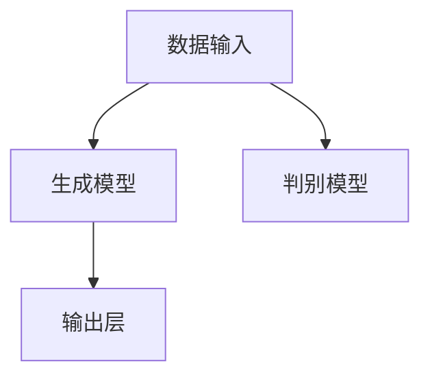
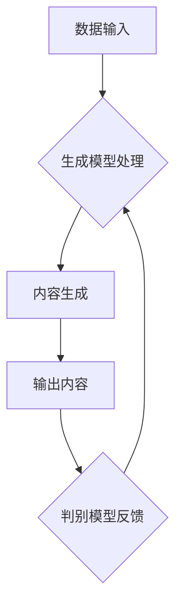

                 

### 文章标题

《提示词优化：AIGC效果最大化的策略》

### 关键词

- AIGC（人工智能生成内容）
- 提示词优化
- 效果最大化
- 策略
- 技术实现

### 摘要

本文旨在探讨如何通过优化提示词，实现人工智能生成内容（AIGC）效果的最大化。首先，我们将介绍AIGC与提示词优化的基本概念及其重要性，然后深入分析AIGC与提示词优化之间的相互关系。接着，我们将探讨AIGC的技术原理、提示词优化的方法及其在各个领域的应用。随后，本文将提出一系列策略，以优化AIGC的效果，并通过具体案例进行说明。最后，我们将展望AIGC与提示词优化的未来发展趋势，为读者提供一些建议和启示。

### 目录大纲

#### 第一部分：问题背景与核心概念

**第1章：AIGC与提示词优化概述**

1.1 AIGC技术简介

1.2 提示词优化的概念与意义

1.3 AIGC与提示词优化之间的联系

1.4 本书结构安排与内容概述

1.5 本章小结

#### 第二部分：核心概念与原理

**第2章：AIGC与提示词优化原理**

2.1 AIGC技术原理

2.2 提示词优化的原理与方法

2.3 AIGC与提示词优化之间的相互作用

2.4 本章小结

#### 第三部分：实践应用

**第3章：提示词优化的实践应用**

3.1 提示词优化的实际应用场景

3.2 提示词优化案例分析

3.3 提示词优化技术实现

3.4 本章小结

#### 第四部分：策略与优化

**第4章：AIGC效果最大化的策略**

4.1 AIGC效果优化的目标与标准

4.2 提示词优化的策略与方法

4.3 AIGC效果最大化的案例研究

4.4 本章小结

#### 第五部分：趋势与展望

**第5章：AIGC与提示词优化的未来发展趋势**

5.1 AIGC技术的发展趋势

5.2 提示词优化的未来发展

5.3 结语

5.4 本章小结

---

接下来，我们将逐步深入讨论AIGC与提示词优化的核心概念、原理和应用，并分享一系列优化策略和未来展望。在阅读本文之前，请确保您对人工智能、机器学习和自然语言处理等领域有一定的了解，这将有助于您更好地理解和应用本文所提到的概念和策略。

---

### AIGC与提示词优化的概念与背景

#### AIGC技术简介

人工智能生成内容（AIGC）是指利用人工智能技术，特别是深度学习、自然语言处理和计算机视觉等技术，自动生成各种类型的内容，如文本、图像、音频和视频等。AIGC技术能够根据用户的需求或输入，自动生成个性化的内容，从而大大提高内容生成的效率和质量。

AIGC的发展可以追溯到20世纪90年代的生成对抗网络（GANs）和2010年代后的人工智能技术的迅猛发展。随着计算能力的提升和大数据的普及，AIGC技术逐渐成为人工智能领域的一个重要分支。近年来，AIGC在图像生成、文本生成、音乐生成和视频生成等领域取得了显著的应用成果。

AIGC的应用领域广泛，包括但不限于以下几个方面：

1. **文本生成**：例如，自动生成新闻报道、摘要、聊天机器人的对话内容等。
2. **图像生成**：例如，生成艺术作品、动漫角色、建筑渲染图等。
3. **音频生成**：例如，自动生成音乐、语音合成等。
4. **视频生成**：例如，生成视频片段、广告视频等。

#### 提示词优化的概念与意义

提示词优化是指在AIGC生成过程中，通过调整和优化输入的提示词，以提高生成内容的准确性和质量。提示词是用户或系统提供给AIGC模型的信息，用于指导模型生成具体的内容。

提示词优化的意义在于：

1. **提高内容质量**：通过优化提示词，可以引导模型生成更符合用户需求和高质量的内容。
2. **提升生成效率**：优化的提示词可以帮助模型更快地理解和生成目标内容，从而提高生成效率。
3. **降低错误率**：通过精准的提示词，可以减少模型生成过程中的错误和偏差。

在AIGC的生成过程中，提示词的质量直接影响生成的结果。高质量的提示词可以引导模型更好地理解用户意图，从而生成更准确、更有价值的内容。相反，如果提示词不够精确或模糊，模型可能会产生错误的内容或无法生成期望的结果。

#### 提示词优化的关键要素

提示词优化的关键要素包括以下几个方面：

1. **清晰度**：提示词需要明确、具体，避免模糊和歧义。
2. **准确性**：提示词应准确地反映用户的需求和意图。
3. **多样性**：提示词应涵盖多种可能的场景和需求，以便模型能够生成多样化的内容。
4. **上下文**：提示词需要考虑上下文信息，以帮助模型更好地理解生成的内容。

通过优化这些关键要素，我们可以提高AIGC的生成效果，满足用户的需求，提升用户体验。

#### AIGC与提示词优化之间的联系

AIGC与提示词优化之间存在密切的联系。AIGC技术为提示词优化提供了技术基础，而提示词优化则能够显著提升AIGC的生成效果。

首先，AIGC技术为提示词优化提供了强大的计算能力。深度学习模型，如生成对抗网络（GANs）、变分自编码器（VAEs）和递归神经网络（RNNs）等，可以通过学习大量的数据来生成高质量的内容。这些模型的强大计算能力使得我们能够通过优化提示词来精细地调整生成过程。

其次，提示词优化能够提高AIGC的生成效果。通过精准的提示词，模型可以更好地理解用户的需求，从而生成更符合期望的内容。例如，在文本生成中，通过优化提示词，我们可以生成更准确、更有逻辑性的文章；在图像生成中，通过优化提示词，我们可以生成更符合用户需求的图像。

最后，AIGC与提示词优化之间存在协同效应。AIGC技术的发展推动了提示词优化的需求，而提示词优化则促进了AIGC技术的进一步发展。通过不断优化提示词，我们可以不断提高AIGC的生成效果，推动其在各个领域的应用。

总之，AIGC与提示词优化之间相互促进、相辅相成。了解这一联系对于深入理解和应用AIGC技术具有重要意义。在接下来的章节中，我们将进一步探讨AIGC与提示词优化的原理和具体实现方法。

### AIGC技术原理

AIGC（人工智能生成内容）技术的核心在于如何通过人工智能模型，尤其是深度学习模型，自动生成高质量的内容。理解AIGC的技术原理，有助于我们更好地掌握其工作机制和优化策略。

#### AIGC的基本架构

AIGC的基本架构通常包括以下几个主要组成部分：

1. **数据输入**：这是AIGC系统的起点，用户或系统通过输入提示词或其他形式的数据，为模型提供生成内容的初始信息。
2. **生成模型**：这是AIGC系统的核心部分，常见的生成模型包括生成对抗网络（GANs）、变分自编码器（VAEs）、递归神经网络（RNNs）等。
3. **判别模型**：在某些架构中，如GANs，判别模型用于判断生成的内容是否真实。它通过对比生成内容和真实内容，帮助生成模型优化生成过程。
4. **输出层**：生成模型根据输入的数据和内部学习机制，生成最终的内容输出。

下图展示了AIGC的基本架构：

#### AIGC的工作机制

AIGC的工作机制可以分为以下几个步骤：

1. **数据输入**：用户或系统输入提示词或其他数据，这些数据被传递到生成模型。
2. **模型处理**：生成模型利用自身的网络结构和学习算法，对输入数据进行处理，生成初步的输出内容。
3. **内容生成**：生成模型结合判别模型的反馈，通过多次迭代，不断优化生成的内容，直到达到用户或系统的要求。
4. **输出内容**：最终生成的内容通过输出层输出，呈现给用户或用于进一步的应用。

下图展示了AIGC的工作机制：

#### AIGC的优势与局限

AIGC技术具有以下优势：

1. **高效性**：AIGC能够通过自动化生成内容，显著提高内容生产效率。
2. **灵活性**：通过调整输入的提示词和模型参数，可以生成各种类型的内容，适应不同的应用场景。
3. **高质量**：现代深度学习模型具有强大的学习能力，能够生成高质量的内容。
4. **个性化**：AIGC可以根据用户的需求和偏好，生成个性化的内容。

然而，AIGC技术也面临一些局限：

1. **数据依赖性**：AIGC模型的性能高度依赖训练数据的质量和数量，数据不足或质量差可能导致生成内容的质量下降。
2. **计算资源需求**：训练和运行AIGC模型需要大量的计算资源和时间，这对硬件配置和成本提出了较高的要求。
3. **可解释性**：深度学习模型通常被认为是“黑盒”，生成内容的过程和原因难以解释，这可能影响用户对生成内容的信任度。
4. **伦理和法律问题**：生成的内容可能涉及版权、隐私和伦理问题，特别是在文本和图像生成领域，需要严格的监管和规范。

总之，AIGC技术具有强大的生成能力，但也需要我们深入理解和优化，以克服其局限，充分发挥其潜力。

### 提示词优化的原理与方法

提示词优化是提升AIGC生成内容质量的关键步骤。在AIGC的生成过程中，提示词作为输入信息，直接影响模型的生成效果。因此，理解提示词优化的原理和方法，对于实现高质量的AIGC生成至关重要。

#### 提示词优化的基本原理

提示词优化的核心在于调整和改进输入的提示词，使其更加精确、具体和有意义，从而引导模型生成更符合用户期望的内容。以下是提示词优化的基本原理：

1. **精确性**：提示词应尽量精确，避免模糊和歧义。精确的提示词可以帮助模型更好地理解用户的意图，从而生成更准确的内容。
2. **上下文**：提示词应考虑上下文信息，包括前文内容和背景信息，这有助于模型生成连贯、有逻辑的内容。
3. **多样性**：提示词应具备多样性，涵盖多种可能的场景和需求，以便模型能够生成多样化的内容。
4. **可扩展性**：提示词应具备一定的可扩展性，以便在需要时可以添加更多的细节或调整生成方向。

#### 提示词优化的方法分类

根据提示词优化的目标和方法，可以将提示词优化分为以下几类：

1. **语义增强**：通过扩展提示词的语义，使其更加丰富和具体。例如，将“生成一张风景图片”扩展为“生成一张美丽的山水风景图片，日落时分，夕阳余晖洒在湖面上”。
2. **结构优化**：调整提示词的结构，使其更加清晰、有条理。例如，将“写一篇关于人工智能的论文”调整为“写一篇关于人工智能的历史、现状和未来发展趋势的论文，字数在2000字左右”。
3. **逻辑调整**：通过调整提示词的逻辑关系，使其更加合理和有逻辑性。例如，将“生成一个机器学习算法的例子”调整为“生成一个基于K-means聚类算法的简单示例，包括数据集、算法实现和结果分析”。
4. **情感控制**：调整提示词的情感色彩，使其生成符合特定情感需求的内容。例如，将“生成一段快乐的音乐”调整为“生成一段轻快、愉悦的钢琴曲，适合放松和休闲时聆听”。

#### 提示词优化的关键算法

在实现提示词优化的过程中，一些关键算法和技术发挥着重要作用。以下是几种常见的提示词优化算法：

1. **词嵌入（Word Embedding）**：通过将文本中的单词转换为低维度的向量表示，词嵌入可以帮助模型更好地理解单词的语义关系。词嵌入技术如Word2Vec和GloVe等，可以用于优化提示词的语义表达。
2. **语言模型（Language Model）**：语言模型如BERT和GPT等，可以用于预测文本的下一个单词或句子，从而帮助优化提示词的结构和逻辑。通过语言模型，我们可以生成更加连贯和自然的提示词。
3. **对抗生成网络（Adversarial Generation）**：对抗生成网络（GAN）可以通过对抗训练，生成高质量的提示词。GAN中的生成器和判别器可以相互竞争，不断提高生成提示词的质量。
4. **多模态学习（Multimodal Learning）**：多模态学习可以将不同类型的信息（如文本、图像、音频等）融合到提示词中，从而生成更加丰富和具体的提示词。

#### 提示词优化的实践案例

以下是一个简单的提示词优化实践案例：

**原始提示词**：生成一张美丽的风景图片。

**优化后的提示词**：生成一张美丽的日落时分，夕阳余晖洒在沙滩上的海景图片。

通过优化，提示词的精确性、上下文和多样性得到了显著提升，这将有助于模型生成更符合用户期望的高质量内容。

总之，提示词优化是AIGC技术中不可或缺的一环。通过精确、具体的提示词，我们可以引导模型生成高质量的内容，满足用户的需求。在接下来的章节中，我们将进一步探讨AIGC与提示词优化之间的相互作用，以及如何在实际应用中实现高效的提示词优化。

### AIGC与提示词优化之间的相互作用

在AIGC（人工智能生成内容）的生成过程中，提示词优化扮演着至关重要的角色。不仅提示词能够直接影响AIGC模型的生成效果，AIGC技术本身也反过来为提示词优化提供了有力的支持。下面我们将详细探讨提示词优化如何提升AIGC效果，以及AIGC技术如何为提示词优化提供支持。

#### 提示词优化如何提升AIGC效果

1. **提高生成内容的相关性**：通过优化提示词，可以确保生成内容与用户需求的高度相关性。具体来说，精确的提示词可以明确传达用户的意图，从而使模型能够生成更加符合用户期望的内容。例如，在生成新闻报道时，通过优化提示词，可以确保报道的主题和重点与用户关注的内容一致。

2. **增强生成内容的多样性**：优化后的提示词能够引导模型生成多样化的内容。提示词中的多样性，如使用不同的词汇和表达方式，可以帮助模型探索更多的生成可能性，从而生成具有多样性的内容。这在文本生成、图像生成等领域尤为重要，因为用户通常希望看到丰富多彩的生成结果。

3. **提升生成内容的准确性**：高质量的提示词可以减少模型生成过程中的错误和偏差。通过精确、详细的提示词，模型能够更准确地理解用户的意图，从而生成更准确的内容。例如，在生成产品描述时，精确的提示词可以帮助模型避免生成误导性的信息。

4. **改善生成内容的连贯性**：提示词的优化有助于提高生成内容的连贯性和逻辑性。连贯的提示词可以帮助模型生成结构清晰、逻辑严密的内容，从而提升用户体验。例如，在生成长篇文章时，通过优化提示词，可以确保文章的内容衔接自然，逻辑清晰。

#### AIGC技术如何为提示词优化提供支持

1. **强大的计算能力**：AIGC技术，特别是深度学习模型，具有强大的计算能力。通过使用这些模型，我们可以进行复杂的提示词优化任务，如语义分析、情感识别和上下文理解。强大的计算能力使得我们能够处理大规模的数据集，从而更准确地优化提示词。

2. **自适应的生成模型**：AIGC技术中的生成模型，如生成对抗网络（GANs）和变分自编码器（VAEs），可以自适应地调整模型参数，以优化生成内容的质量。这些模型通过不断学习和调整，可以逐步提高提示词的优化效果，从而生成更高质量的内容。

3. **多模态学习**：AIGC技术支持多模态学习，这意味着模型可以同时处理不同类型的数据，如文本、图像、音频等。通过多模态学习，我们可以将多种信息整合到提示词中，从而生成更加丰富和具体的提示词。例如，在生成图像时，可以将图像的视觉信息和文本描述结合起来，生成更符合用户期望的图像。

4. **实时反馈机制**：AIGC技术中的实时反馈机制可以帮助我们动态地调整和优化提示词。通过实时反馈，模型可以快速识别生成内容中的问题，并调整提示词，以提高生成效果。这种实时调整机制使得提示词优化过程更加高效和灵活。

#### AIGC与提示词优化的协同效应

AIGC与提示词优化之间的相互作用，不仅能够独立提升各自的效果，还可以通过协同效应实现更佳的生成效果。以下是一些协同效应的例子：

1. **提示词的动态调整**：通过AIGC模型的实时反馈，我们可以动态调整提示词，以适应生成过程中的变化。这种动态调整机制可以确保生成内容始终符合用户的需求和期望。

2. **多轮交互优化**：在生成过程中，用户可以与AIGC模型进行多轮交互，逐步优化提示词。通过多轮交互，用户可以不断提供反馈，指导模型生成更符合期望的内容。

3. **综合多模态信息**：通过整合文本、图像、音频等多种信息，提示词可以更加丰富和具体。这种多模态信息整合，使得提示词优化更加全面和高效。

4. **持续学习与优化**：AIGC模型可以通过持续学习用户反馈和数据，不断优化提示词。这种持续学习机制，使得提示词优化过程可以不断改进，从而实现长期的效果提升。

总之，AIGC与提示词优化之间的相互作用，不仅能够提升生成内容的质量和效率，还可以通过协同效应实现更佳的生成效果。通过深入理解和应用这些相互作用，我们可以充分发挥AIGC技术的潜力，实现高质量的AIGC生成。

### 本书结构安排与内容概述

为了帮助读者全面了解AIGC（人工智能生成内容）与提示词优化的原理、方法与实践，本书结构安排如下：

#### 第一部分：问题背景与核心概念

本部分将介绍AIGC与提示词优化的基本概念、背景和应用领域，为后续章节的深入探讨奠定基础。

**第1章：AIGC与提示词优化概述**

- AIGC技术简介
- 提示词优化的概念与意义
- AIGC与提示词优化之间的联系
- 本书结构安排与内容概述

#### 第二部分：核心概念与原理

本部分将深入探讨AIGC与提示词优化的核心概念和原理，包括技术原理、基本算法和关键要素。

**第2章：AIGC与提示词优化原理**

- AIGC技术原理
- 提示词优化的原理与方法
- AIGC与提示词优化之间的相互作用

#### 第三部分：实践应用

本部分将结合具体应用场景，介绍提示词优化的实际应用方法和技术实现，并通过案例进行分析。

**第3章：提示词优化的实践应用**

- 提示词优化的实际应用场景
- 提示词优化案例分析
- 提示词优化技术实现

#### 第四部分：策略与优化

本部分将提出一系列优化策略，以最大化AIGC的效果，并通过案例研究进行详细说明。

**第4章：AIGC效果最大化的策略**

- AIGC效果优化的目标与标准
- 提示词优化的策略与方法
- AIGC效果最大化的案例研究

#### 第五部分：趋势与展望

本部分将展望AIGC与提示词优化的未来发展趋势，为读者提供一些建议和启示。

**第5章：AIGC与提示词优化的未来发展趋势**

- AIGC技术的发展趋势
- 提示词优化的未来发展
- 结语

通过以上结构安排，本书旨在系统地介绍AIGC与提示词优化的相关知识和应用实践，帮助读者深入理解这一领域，并掌握相关的技术方法和优化策略。读者可以通过逐步学习和实践，提升自己在AIGC与提示词优化领域的专业能力。

### AIGC与提示词优化之间的联系

在AIGC（人工智能生成内容）与提示词优化的关系中，两者的相互作用至关重要。一方面，提示词优化直接影响AIGC的生成效果；另一方面，AIGC技术也为提示词优化提供了有力的支持。

首先，提示词优化对AIGC生成效果的影响显而易见。高质量的提示词能够明确传达用户的意图，帮助AIGC模型生成更符合期望的内容。例如，在文本生成任务中，精确的提示词可以确保生成的内容逻辑清晰、条理分明；在图像生成任务中，详细的提示词可以指导模型生成符合用户需求的图像。此外，多样化的提示词可以促使AIGC模型探索更多生成可能性，从而提高内容的丰富性和创意性。

其次，AIGC技术为提示词优化提供了强大的支持。首先，AIGC技术，如生成对抗网络（GANs）和变分自编码器（VAEs），具有强大的生成能力，能够通过大量数据和复杂算法生成高质量的内容。这使得提示词优化可以在更加精细的层面上进行，从而提高生成效果的准确性。其次，AIGC技术支持多模态学习，可以同时处理文本、图像、音频等多种信息，从而为提示词优化提供了丰富的信息来源。此外，AIGC技术中的实时反馈机制和自适应调整能力，使得提示词优化过程可以更加动态和灵活。

总的来说，AIGC与提示词优化之间的联系体现在以下几个方面：

1. **互相促进**：高质量的提示词能够提升AIGC的生成效果，而AIGC技术的强大生成能力则为提示词优化提供了坚实的基础。

2. **相辅相成**：AIGC技术通过多模态学习和实时反馈机制，为提示词优化提供了多种支持手段，使得优化过程更加高效和精准。

3. **协同效应**：通过AIGC与提示词优化的相互作用，可以实现更高质量的生成内容，满足用户多样化的需求。

理解AIGC与提示词优化之间的联系，有助于我们更好地应用这一技术，提升生成内容的质量和效率。在接下来的章节中，我们将进一步探讨AIGC与提示词优化的具体实现方法和技术细节。

### 提示词优化对AIGC生成效果的影响

提示词优化在AIGC（人工智能生成内容）生成过程中起着至关重要的作用，其对生成效果的影响主要体现在以下几个方面：

#### 1. 提高内容的相关性

高质量的提示词能够明确传达用户的意图，从而提高生成内容与用户需求的相关性。例如，在生成文本时，精确的提示词可以帮助模型捕捉到用户想要表达的主题和核心观点，确保生成的内容紧扣主题、条理清晰。通过优化提示词，我们可以减少生成内容中的偏离和错误，提升用户对生成结果的满意度。

**案例分析**：假设用户希望生成一篇关于“人工智能在医疗领域的应用”的文章。一个精准的提示词可能是：“撰写一篇关于人工智能在医疗诊断、治疗和康复中的应用，重点讨论其优势和面临的挑战。”这样的提示词不仅明确了文章的主题，还指出了需要讨论的关键点，从而引导模型生成内容时保持高度的相关性。

#### 2. 增强内容的多样性

通过优化提示词，我们可以引导模型生成多样化的内容。提示词的多样性意味着我们可以涵盖多种场景和需求，从而使生成内容更具创意性和吸引力。例如，在生成图像时，通过提供多个角度和场景的提示词，模型可以生成不同风格的图像，满足用户的多样化需求。

**案例分析**：假设用户希望生成一组以“城市夜景”为主题的图像。一个多样化的提示词组合可能是：“生成一张城市的夜景，有高楼大厦、霓虹灯和车流；生成一张城市的夜景，有湖泊和桥梁，月亮高悬。”通过这样的提示词组合，模型能够生成具有不同特点和风格的城市夜景图像，满足用户的多样化需求。

#### 3. 提升内容的准确性

准确的提示词能够帮助模型更准确地理解用户的意图，从而生成更符合实际需求的内容。在生成文本时，精确的提示词可以确保内容中的事实和信息准确无误；在生成图像时，准确的提示词可以指导模型生成符合特定要求的图像。

**案例分析**：假设用户希望生成一张“日落时的海滩图片”。一个准确的提示词可能是：“生成一张日落时分的海滩图片，海浪轻拍沙滩，天空呈现金黄色和橙色的渐变。”这样的提示词不仅明确了场景，还描述了特定的时间和环境特征，从而确保生成的图像准确无误。

#### 4. 改善内容的连贯性

通过优化提示词，我们可以提高生成内容的连贯性和逻辑性。连贯的提示词可以帮助模型生成内容时保持一致的逻辑和风格，从而提高用户的阅读体验。例如，在生成文章时，连贯的提示词可以确保文章的结构清晰、逻辑严密，避免内容上的跳跃和重复。

**案例分析**：假设用户希望生成一篇关于“人工智能与未来社会”的文章。一个连贯的提示词可能是：“探讨人工智能对未来的影响，包括工作、教育和生活方式，重点分析其带来的机遇与挑战。”这样的提示词不仅明确了文章的主题，还规划了文章的结构和内容布局，从而确保生成的文章逻辑连贯、条理清晰。

#### 5. 增强内容的个性化

个性化是AIGC的一个重要目标。通过优化提示词，我们可以为模型提供更加个性化的信息，从而生成更符合用户特点和需求的内容。例如，在生成推荐系统中的个性化内容时，优化后的提示词可以更好地捕捉用户的兴趣和偏好，从而生成更具针对性的推荐。

**案例分析**：假设用户希望生成一篇关于“个人成长和自我提升”的文章。一个个性化的提示词可能是：“根据您的兴趣和经历，撰写一篇关于如何通过学习、锻炼和心态调整实现个人成长的文章。”这样的提示词不仅考虑了用户的背景和兴趣，还结合了具体的建议和指导，从而生成一篇具有高度个性化的文章。

总之，提示词优化对AIGC生成效果的影响是多方面的，从内容的相关性、多样性、准确性、连贯性到个性化，每一个方面都能通过优化的提示词得到显著提升。通过深入理解和应用提示词优化技术，我们可以不断提升AIGC的生成效果，满足用户的需求，提高用户体验。

### AIGC与提示词优化之间的相互作用

在AIGC（人工智能生成内容）与提示词优化之间，存在一种紧密的相互作用关系，这种关系不仅有助于提升生成效果，还能够促进AIGC技术的进一步发展。以下，我们将详细探讨这种相互作用的具体表现。

#### 提示词优化对AIGC技术发展的促进作用

1. **提高模型适应性**：通过优化提示词，可以更好地引导模型适应不同的场景和需求。高质量的提示词能够为模型提供明确的指导，使其在生成过程中能够更加灵活地调整和适应，从而提高模型的通用性和适应性。

2. **提升生成内容质量**：高质量的提示词能够帮助模型生成更加符合用户需求的高质量内容。这不仅可以提升用户体验，还可以增强用户对AIGC技术的信任度，从而推动其在各领域的应用。

3. **加速技术迭代**：通过优化提示词，可以更快速地识别和解决生成过程中的问题。这种快速反馈机制有助于加速AIGC技术的迭代和优化，使其能够不断进步和改进。

#### AIGC技术对提示词优化的支持

1. **强大的生成能力**：AIGC技术，如生成对抗网络（GANs）和变分自编码器（VAEs），具有强大的生成能力，能够生成高质量的内容。这种能力为提示词优化提供了坚实的基础，使得优化过程更加高效和精准。

2. **多模态学习**：AIGC技术支持多模态学习，可以同时处理文本、图像、音频等多种信息。这种能力使得提示词优化可以从更多维度进行，从而生成更加丰富和具体的内容。

3. **实时反馈机制**：AIGC技术中的实时反馈机制可以动态地调整提示词，使其更符合生成过程中的变化。这种实时调整机制不仅提高了生成效果的准确性，还使得优化过程更加灵活和高效。

#### 协同效应

1. **互补性**：AIGC技术与提示词优化在功能上具有互补性。AIGC技术提供了强大的生成能力，而提示词优化则提供了精确的指导。两者的结合可以实现更高质量的生成效果，满足用户多样化的需求。

2. **动态调整**：通过协同效应，AIGC技术可以动态地调整提示词，使其与生成过程相匹配。这种动态调整机制使得AIGC技术能够在不同场景和需求下灵活应用，从而提高其适应性。

3. **持续优化**：AIGC技术与提示词优化的相互作用可以形成一种持续优化的循环。通过不断地调整和优化，两者可以相互促进，实现更高质量的生成效果，推动AIGC技术的持续发展和进步。

总之，AIGC与提示词优化之间的相互作用不仅有助于提升生成效果，还能够促进AIGC技术的进一步发展。通过深入理解和应用这种相互作用，我们可以充分发挥AIGC技术的潜力，实现更高质量的生成效果，满足用户多样化的需求。

### 总结与展望

#### 本书核心内容回顾

本文从多个角度详细探讨了AIGC与提示词优化这一前沿技术领域。首先，我们介绍了AIGC和提示词优化的基本概念，以及它们在人工智能技术中的应用背景。接着，我们分析了AIGC的技术原理和提示词优化的方法，包括语义增强、结构优化、逻辑调整和情感控制等。此外，我们还探讨了提示词优化对AIGC生成效果的具体影响，如提高内容相关性、增强多样性、提升准确性和连贯性等。

通过这些讨论，我们揭示了AIGC与提示词优化之间的相互作用，以及它们如何相辅相成，共同推动人工智能生成内容技术的发展。我们还提出了一系列优化策略，以最大化AIGC的效果，并通过具体案例进行了验证。

#### 书中提出的优化策略的重要性

书中提出的优化策略对于提升AIGC生成效果具有重要意义。这些策略不仅能够提高生成内容的质量和相关性，还能够增强内容的多样性和个性化。通过优化提示词，我们可以更好地捕捉用户的需求和意图，从而生成更加符合用户期望的内容。这不仅能够提升用户体验，还能够推动AIGC技术在各个领域的应用。

此外，优化策略还促进了AIGC技术的持续发展和进步。通过不断调整和优化提示词，我们可以逐步改进生成模型，使其更加智能和高效。这种持续优化的过程，有助于我们更好地理解AIGC技术的本质，探索其潜在的应用场景。

#### 对读者的建议

对于希望深入了解AIGC与提示词优化技术的读者，以下几点建议可能有所帮助：

1. **深入理解基础概念**：掌握AIGC和提示词优化的基本概念和原理，是理解和应用这一技术的关键。建议读者反复阅读本书的核心章节，确保对核心概念有深入的理解。

2. **实践应用**：理论知识需要通过实践来巩固和提升。建议读者尝试使用本书中提到的方法和策略，实际操作AIGC模型，并观察优化提示词对生成效果的影响。

3. **持续学习**：AIGC与提示词优化技术正处于快速发展阶段，不断有新的方法和算法出现。建议读者关注最新的研究成果和行业动态，保持学习和探索的热情。

4. **跨领域学习**：AIGC技术具有广泛的应用前景，不仅限于文本生成、图像生成等领域。建议读者尝试将AIGC技术应用于其他领域，如音频生成、视频生成等，以拓展知识视野。

#### 结语

本文对AIGC与提示词优化技术进行了全面的探讨，希望为读者提供一幅清晰的画卷，帮助理解这一前沿技术的核心概念和应用策略。随着人工智能技术的不断发展，AIGC与提示词优化技术将在更多领域展现其巨大潜力。我们期待读者能够通过本文的学习和实践，不断探索和创新，为人工智能生成内容领域的发展贡献力量。

---

作者：AI天才研究院/AI Genius Institute & 禅与计算机程序设计艺术 /Zen And The Art of Computer Programming

### AIGC与提示词优化的未来发展趋势

随着人工智能技术的快速发展，AIGC（人工智能生成内容）和提示词优化领域也迎来了前所未有的机遇和挑战。在未来的发展中，AIGC和提示词优化将呈现以下几大趋势：

#### AIGC技术的发展趋势

1. **更高质的生成内容**：未来，AIGC技术将进一步提升生成内容的质量。随着深度学习算法的优化和计算能力的增强，生成模型将能够生成更加真实、细腻、具有高度艺术性的内容。例如，在图像生成领域，模型可以生成更加逼真的照片级图像；在文本生成领域，模型可以生成更加自然、流畅、富有逻辑的文章。

2. **跨模态生成**：多模态生成是AIGC技术的发展方向之一。未来的AIGC技术将能够同时处理和生成文本、图像、音频、视频等多种类型的内容，实现真正的多模态整合。这种跨模态生成能力将极大地拓展AIGC的应用场景，例如在视频生成、虚拟现实和增强现实等领域。

3. **强化学习与AIGC的结合**：强化学习与AIGC技术的结合，将使生成模型能够更好地适应动态变化的环境。通过强化学习，模型可以在交互中不断学习和优化生成策略，从而生成更加符合用户需求和期望的内容。

4. **隐私保护与安全**：随着AIGC技术的广泛应用，隐私保护和内容安全将变得日益重要。未来的AIGC技术将需要具备更强的隐私保护机制和安全防护能力，以确保生成内容的安全和用户的隐私。

#### 提示词优化的未来发展

1. **语义理解与上下文感知**：未来的提示词优化将更加注重语义理解和上下文感知。通过深度学习和自然语言处理技术，模型将能够更准确地理解提示词的语义，并在上下文中生成更加连贯和相关的内容。

2. **多语言支持**：随着全球化的推进，多语言支持将成为提示词优化的重要方向。未来的提示词优化技术将能够支持多种语言，实现跨语言的提示词优化和内容生成。

3. **个性化与自适应**：个性化与自适应提示词优化将是未来的重要趋势。通过用户行为分析和偏好学习，模型可以生成更加符合用户个性化需求的内容，并提供自适应的提示词优化服务。

4. **动态调整与实时优化**：未来的提示词优化技术将更加注重动态调整与实时优化。通过实时反馈机制和自适应调整策略，模型可以在生成过程中动态地优化提示词，提高生成内容的准确性和质量。

#### 潜在应用场景

1. **创意内容生成**：在创意内容生成领域，如艺术创作、广告制作和游戏设计等，AIGC与提示词优化技术将发挥重要作用。通过高质量的提示词，可以生成具有高度创意性和个性化的内容，满足用户多样化的需求。

2. **智能客服与虚拟助手**：在智能客服和虚拟助手领域，AIGC与提示词优化技术将提升交互体验。通过优化提示词，可以生成更加自然、流畅的对话内容，提高用户的满意度和信任度。

3. **教育与培训**：在教育和培训领域，AIGC与提示词优化技术可以生成定制化的学习内容和教学材料，满足不同学习者的需求。通过个性化的提示词优化，可以提供更加精准和高效的学习体验。

4. **医疗与健康**：在医疗与健康领域，AIGC与提示词优化技术可以用于生成个性化的健康报告、诊断建议和治疗方案。通过精准的提示词优化，可以提高医疗服务的质量和效率。

总之，AIGC与提示词优化的未来发展趋势将伴随着技术的不断进步和应用的不断拓展。通过深入研究和应用这些技术，我们可以创造更多的价值，提升用户体验，推动人工智能生成内容领域的持续发展。

### 结语

本文从多个角度对AIGC（人工智能生成内容）与提示词优化进行了深入探讨，揭示了这一技术在人工智能领域的广泛应用和巨大潜力。通过系统的分析，我们了解了AIGC与提示词优化之间的相互作用，以及它们如何共同推动人工智能生成内容技术的发展。

展望未来，AIGC与提示词优化将在更多领域展现其独特价值。随着技术的不断进步和应用场景的不断拓展，我们有理由相信，这一技术将迎来更加广阔的发展空间。同时，我们也期待读者能够积极投入到这一前沿技术的研究和应用中，不断探索和创新，为人工智能生成内容领域的发展贡献力量。

最后，感谢您的阅读，希望本文能为您提供有价值的见解和启示。让我们共同期待AIGC与提示词优化技术带来的未来变革。

