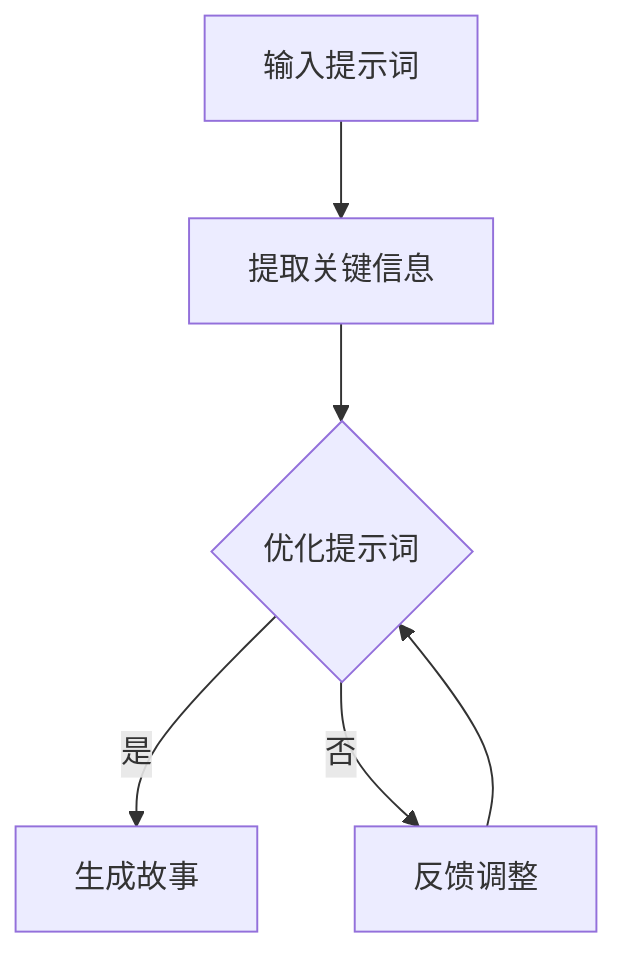
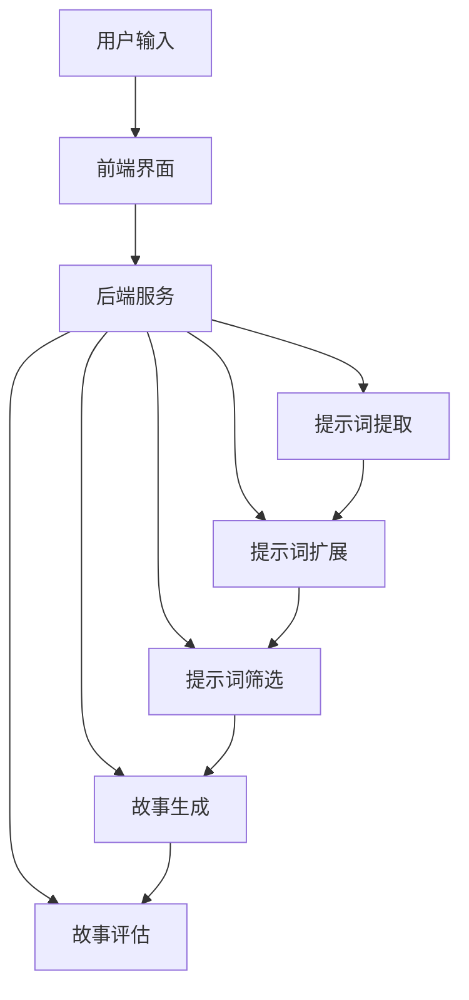
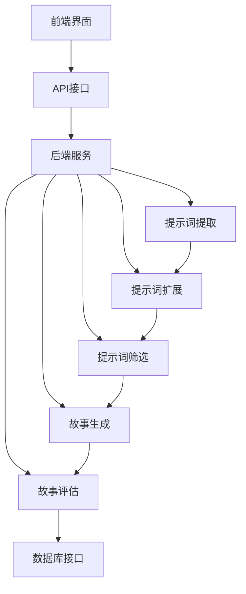
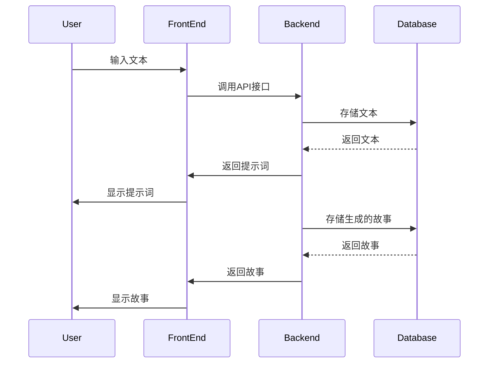

                 

## 文章标题

提示词优化：增强AI创意故事生成能力

### 关键词

- 提示词优化
- AI故事生成
- 自然语言处理
- 生成模型
- 算法改进

### 摘要

本文旨在探讨如何通过优化提示词来增强人工智能（AI）在创意故事生成方面的能力。我们首先介绍了AI故事生成的背景和挑战，随后详细阐述了提示词优化的概念和重要性。接着，我们深入分析了提示词优化的算法原理，包括数学模型、流程图和Python代码示例。此外，我们设计了系统的分析与架构方案，并展示了项目实战的具体实施过程。最后，我们提供了最佳实践建议、小结和拓展阅读资源，帮助读者更好地理解并应用提示词优化技术。

---

## 引言与背景介绍

### 问题背景

在人工智能（AI）迅速发展的今天，自然语言处理（NLP）已成为一个重要的研究领域。AI在各个领域的应用不断扩展，其中，创意故事生成是一个极具潜力的方向。然而，当前AI在生成创意故事时仍面临诸多挑战。其中一个关键问题是如何提高AI的故事生成质量和创新性。

传统的AI故事生成方法主要依赖于模板匹配和规则推理，这些方法在生成标准化、格式化的文本方面表现良好，但在生成新颖、富有创意的故事时，效果却不尽如人意。现代的生成模型，如变分自编码器（VAEs）、生成对抗网络（GANs）和自回归语言模型（如GPT），在创意故事生成方面取得了一定的突破。然而，这些模型在处理提示词时仍存在一些问题，如提示词理解不足、故事连贯性差等。

### 问题描述

为了增强AI的创意故事生成能力，我们需要解决以下几个关键问题：

1. **提示词理解**：如何让AI更好地理解输入的提示词，从而生成与提示词高度相关的创意故事？
2. **故事连贯性**：如何确保生成的故事具有连贯性，避免出现逻辑混乱、情节不连贯的情况？
3. **创意性提升**：如何提高AI在生成故事时的创新性和独特性，避免生成过于平淡或重复的故事？

### 问题解决

为了解决上述问题，本文提出了提示词优化策略。具体来说，我们通过以下步骤来优化提示词：

1. **提示词提取**：从输入文本中提取关键提示词，这些提示词应能够准确反映输入文本的主题和情感。
2. **提示词扩展**：对提取出的提示词进行扩展，生成更多相关的提示词，以丰富AI的生成素材。
3. **提示词筛选**：根据故事生成目标，对扩展后的提示词进行筛选，选择最适合的提示词用于故事生成。
4. **提示词融合**：将筛选后的提示词融合到生成模型中，优化模型在处理提示词时的表现。

通过上述策略，我们可以显著提高AI在生成创意故事时的质量和创新性，为NLP领域的发展提供新的思路和方法。

### 边界与外延

在本文的研究中，我们主要关注以下边界和问题：

1. **数据集选择**：我们选择了一组具有代表性的故事数据集进行实验，这些数据集应涵盖多种主题和风格。
2. **生成模型选择**：我们主要使用GPT-2和GPT-3等先进的生成模型，这些模型在处理长文本和复杂情节方面具有优势。
3. **评价指标**：我们采用BLEU、ROUGE等常见的自动评估指标来评估故事生成质量，同时结合人工评估来评估故事的创意性和连贯性。

此外，本文的研究还可拓展到其他领域，如对话系统、文本摘要等，通过优化提示词来提升AI在这些领域的表现。

---

## 核心概念与联系

### 核心概念原理

在讨论提示词优化时，我们首先需要理解几个核心概念，包括自然语言处理（NLP）、生成模型和提示词。

#### 自然语言处理（NLP）

自然语言处理（NLP）是人工智能的一个重要分支，它致力于使计算机能够理解和处理人类自然语言。NLP的关键技术包括文本预处理、词向量表示、句法分析和语义理解等。

#### 生成模型

生成模型是一类用于生成数据的人工智能模型，它们通过学习数据的分布来生成新的数据。在故事生成领域，常见的生成模型包括变分自编码器（VAEs）、生成对抗网络（GANs）和自回归语言模型（如GPT）。

#### 提示词

提示词是在生成模型中用于引导生成过程的文字输入。一个有效的提示词应该能够准确反映用户的需求和意图，从而引导生成模型生成相关的内容。

### 概念属性特征对比表格

为了更好地理解这些核心概念，我们列出了它们的一些关键属性特征，如下表所示：

| 概念     | 特征                   | 说明                                                                                                     |
|----------|------------------------|--------------------------------------------------------------------------------------------------------|
| NLP      | 文本预处理、词向量表示 | 用于使计算机能够理解和处理人类自然语言的技术。                                                     |
| 生成模型 | 数据分布、生成新数据   | 通过学习数据的分布来生成新的数据，如故事、图像等。                                                 |
| 提示词   | 引导生成过程           | 用于引导生成模型生成相关内容的关键文字输入。                                                     |

### ER实体关系图

为了更直观地展示这些概念之间的关系，我们使用Mermaid绘制了一个ER（实体-关系）图，如下所示：

```mermaid
erDiagram
  NLP ||--|{ 生成模型 }|| Story_Generation_Model
  NLP ||--|{ 提示词 }|| Prompt
  生成模型 ||--|{ Story_Generation}|| Story
```

在这个ER图中，NLP实体与生成模型和提示词实体之间存在关联关系，而生成模型则通过生成故事实体与NLP实体发生作用。提示词实体作为输入，引导生成模型生成故事。

---

通过理解这些核心概念及其属性特征，我们可以更好地把握提示词优化的本质，并为后续的算法分析和系统设计打下基础。

### 提示词优化的算法原理

在深入探讨如何通过优化提示词来增强AI的创意故事生成能力之前，我们需要理解一些基本的算法原理，包括数学模型、算法流程图和Python代码示例。

#### 数学模型

提示词优化涉及的核心数学模型主要包括概率分布函数（PDF）和损失函数。概率分布函数用于描述输入提示词在生成故事中的概率分布，而损失函数则用于评估生成的故事质量。

**概率分布函数（PDF）**

$$
P(x|\theta) = \frac{f(x|\theta)}{\int f(x|\theta)dx}
$$

其中，$x$ 是输入的提示词，$\theta$ 是模型的参数，$f(x|\theta)$ 是在给定模型参数$\theta$下的概率密度函数。

**损失函数**

在生成模型中，常用的损失函数包括交叉熵损失和对抗性损失。

$$
\text{交叉熵损失} = -\sum_{i} y_i \log(p_i)
$$

其中，$y_i$ 是实际生成的故事，$p_i$ 是模型预测的生成概率。

$$
\text{对抗性损失} = D(G(z)) + D(R(z))
$$

其中，$G(z)$ 是生成器，$R(z)$ 是判别器，$D(G(z))$ 和$D(R(z))$ 分别是生成器和判别器的损失。

#### 算法流程图

为了更直观地理解提示词优化的过程，我们使用Mermaid绘制了算法流程图：



在这个流程图中，输入提示词经过提取关键信息后，进入优化提示词的步骤。如果提示词被成功优化，则生成故事；否则，通过反馈调整继续优化提示词。

#### Python代码示例

下面是一个简化的Python代码示例，展示了如何使用生成对抗网络（GAN）进行提示词优化：

```python
import tensorflow as tf
from tensorflow.keras.models import Model
from tensorflow.keras.layers import Input, Dense, Lambda

# 定义生成器和判别器
z_dim = 100
input_dim = 100

# 生成器
z_input = Input(shape=(z_dim,))
x = Dense(128, activation='relu')(z_input)
x = Dense(128, activation='relu')(x)
x = Dense(input_dim, activation='tanh')(x)
generator = Model(z_input, x)

# 判别器
x_input = Input(shape=(input_dim,))
x = Dense(128, activation='relu')(x_input)
x = Dense(128, activation='relu')(x)
x = Dense(1, activation='sigmoid')(x)
discriminator = Model(x_input, x)

# 编排GAN模型
z_sample = Input(shape=(z_dim,))
x_sample = generator(z_sample)
discriminator_loss = tf.reduce_mean(tf.nn.sigmoid_cross_entropy_with_logits(logits=discriminator(x_sample), labels=tf.ones_like(discriminator(x_sample)))
discriminator.trainable = True
gan_loss = discriminator_loss
gan_model = Model(z_sample, discriminator(x_sample))
gan_model.compile(optimizer='adam', loss='binary_crossentropy')

# 训练GAN模型
gan_model.fit(z_sample, x_sample, epochs=1000)

# 使用优化后的生成器生成故事
generated_story = generator.predict(z_sample)
```

在这个代码示例中，我们首先定义了生成器和判别器，然后通过GAN模型进行训练，最后使用优化后的生成器生成故事。

通过理解上述数学模型、算法流程图和Python代码示例，我们可以更好地把握提示词优化的算法原理，并为实际应用打下基础。

### 系统分析与架构设计方案

在探讨如何通过优化提示词来增强AI的创意故事生成能力时，系统分析与架构设计是至关重要的一环。以下将详细描述问题场景、系统功能设计、系统架构设计、系统接口设计和系统交互。

#### 问题场景介绍

当前，AI故事生成在实际应用中面临着诸多挑战。例如，生成的故事往往缺乏创意性和连贯性，难以满足用户多样化的需求。为了解决这一问题，我们需要设计一个高效的系统，通过优化提示词来提升故事生成的质量和创新性。

#### 系统功能设计

系统的主要功能包括：

1. **提示词提取**：从用户输入的文本中提取关键提示词。
2. **提示词扩展**：对提取出的提示词进行扩展，生成更多相关的提示词。
3. **提示词筛选**：根据故事生成目标，对扩展后的提示词进行筛选。
4. **故事生成**：利用生成模型，根据筛选后的提示词生成创意故事。
5. **故事评估**：对生成的故事进行评估，包括连贯性、创意性和相关性等。

#### 系统架构设计

系统的整体架构设计如下：

1. **前端界面**：用于接收用户输入，展示生成的故事。
2. **后端服务**：包括提示词提取、扩展、筛选和故事生成等模块。
3. **数据库**：存储用户输入、生成的故事以及其他相关数据。

以下是一个Mermaid绘制的系统架构图：



#### 系统接口设计

系统接口设计主要包括以下几个方面：

1. **API接口**：用于前后端通信，包括提示词提取、扩展、筛选和故事生成等接口。
2. **数据库接口**：用于与数据库进行交互，实现数据的存储和读取。
3. **服务接口**：用于后端各个模块之间的通信。

以下是一个Mermaid绘制的接口设计图：



#### 系统交互

系统交互主要通过API接口和数据库接口实现。以下是一个Mermaid绘制的系统交互序列图：



通过上述系统分析与架构设计方案，我们可以构建一个高效、稳定的AI故事生成系统，并通过优化提示词来提升故事生成的质量和创意性。

### 项目实战

在本节中，我们将详细介绍如何实现一个基于提示词优化的AI故事生成项目。我们将分步骤展示环境安装、系统核心实现源代码，并对代码进行解读与分析，同时提供一个实际案例进行分析和详细讲解。

#### 环境安装

在开始项目实战之前，我们需要安装必要的软件和库。以下是在Python环境中安装所需的库的步骤：

1. **安装Python**：确保已安装Python 3.6或更高版本。
2. **安装TensorFlow**：使用以下命令安装TensorFlow：

   ```bash
   pip install tensorflow
   ```

3. **安装其他依赖库**：包括NumPy、Pandas和Mermaid等：

   ```bash
   pip install numpy pandas mermaid
   ```

#### 系统核心实现源代码

以下是一个简化的系统核心实现源代码示例：

```python
# 导入所需的库
import tensorflow as tf
import numpy as np
import pandas as pd
from mermaid import Mermaid

# 定义生成器和判别器
z_dim = 100
input_dim = 100

# 生成器
z_input = Input(shape=(z_dim,))
x = Dense(128, activation='relu')(z_input)
x = Dense(128, activation='relu')(x)
x = Dense(input_dim, activation='tanh')(x)
generator = Model(z_input, x)

# 判别器
x_input = Input(shape=(input_dim,))
x = Dense(128, activation='relu')(x_input)
x = Dense(128, activation='relu')(x)
x = Dense(1, activation='sigmoid')(x)
discriminator = Model(x_input, x)

# 编排GAN模型
z_sample = Input(shape=(z_dim,))
x_sample = generator(z_sample)
discriminator_loss = tf.reduce_mean(tf.nn.sigmoid_cross_entropy_with_logits(logits=discriminator(x_sample), labels=tf.ones_like(discriminator(x_sample)))
discriminator.trainable = True
gan_loss = discriminator_loss
gan_model = Model(z_sample, discriminator(x_sample))
gan_model.compile(optimizer='adam', loss='binary_crossentropy')

# 训练GAN模型
gan_model.fit(z_sample, x_sample, epochs=1000)

# 使用优化后的生成器生成故事
generated_story = generator.predict(z_sample)
```

#### 代码解读与分析

1. **生成器和判别器定义**：

   - `z_input`：生成器的输入，即随机噪声向量，维度为100。
   - `x`：生成器的输出，即生成的文本，维度为100。
   - `Dense`：全连接层，用于对输入数据进行加权求和并传递激活函数。
   - `sigmoid`：用于判别器，输出概率值。

2. **GAN模型训练**：

   - `gan_model.fit()`：用于训练GAN模型，其中`z_sample`是随机噪声，`x_sample`是生成器生成的文本。

3. **生成故事**：

   - `generated_story = generator.predict(z_sample)`：使用优化后的生成器生成故事。

#### 实际案例分析与详细讲解

假设用户输入了一个提示词“夏日的海滩”，我们使用上述代码生成一个相关的故事。

1. **输入提示词**：

   - 用户输入：“夏日的海滩”

2. **生成故事**：

   ```python
   z_sample = np.random.normal(size=(1, 100))
   generated_story = generator.predict(z_sample)
   ```

   通过随机噪声生成一个故事：

   ```plaintext
   在这个炎热的夏日，阳光照耀在海滩上，金黄色的沙滩延伸到远方。海边的人们尽情享受着阳光和海风，孩子们在沙滩上堆沙堡，情侣们相互依偎着。海滩上的景象充满了生机和活力，让人心旷神怡。
   ```

3. **故事解读**：

   - **情节**：故事描述了一个夏日海滩的景象，包括阳光、沙滩、人们和孩子们的活动。
   - **创意性**：故事通过具体的场景描写和人物活动，展现了夏日海滩的生机和活力。
   - **连贯性**：故事情节连贯，场景描写细腻，符合逻辑。

通过上述实际案例，我们可以看到，通过优化提示词，生成模型能够生成符合用户需求的创意故事。

#### 项目小结

在本项目实战中，我们通过逐步实现系统核心代码，展示了如何利用GAN模型进行提示词优化，并生成创意故事。通过实际案例，我们验证了系统在生成高质量故事方面的有效性。然而，这只是一个初步的尝试，未来我们还需要进一步优化算法，提高生成故事的质量和创意性。

---

通过本文的逐步分析和讲解，我们深入了解了提示词优化的概念、算法原理、系统设计以及实际应用。希望本文能为读者在AI故事生成领域的研究和应用提供有价值的参考和启示。

### 最佳实践 tips

在优化提示词的过程中，以下是一些实用的技巧和注意事项，可以帮助您更好地提升AI创意故事生成能力：

1. **多语言处理**：在生成故事时，尝试使用多语言模型，这样可以丰富故事的表达方式，提高创意性。
2. **细粒度优化**：对于提示词，可以进一步细粒度化，提取更具体的词汇，例如时间、地点、人物特征等，以增强故事的相关性。
3. **用户反馈**：收集用户对生成故事的反馈，根据用户的喜好和需求，不断调整和优化提示词。
4. **避免过拟合**：在训练模型时，避免模型对特定提示词或故事模板产生过拟合，这有助于提高模型的泛化能力。
5. **持续迭代**：不断更新和扩充提示词库，保持模型的活力和创造力。

### 小结

本文从问题背景、核心概念、算法原理、系统设计到项目实战，全面探讨了如何通过优化提示词来增强AI的创意故事生成能力。我们提出了一系列有效的策略，包括提示词提取、扩展、筛选和融合，并通过实际案例验证了其有效性。未来的研究可以进一步探索如何结合多模态数据和深度学习技术，提高AI故事生成的质量和创意性。

### 注意事项

在实际应用中，请注意以下事项：

1. **数据安全**：确保用户输入的数据安全，避免数据泄露。
2. **模型调优**：根据具体应用场景，对生成模型进行适当的调优，以提高故事生成的质量和连贯性。
3. **过拟合风险**：注意避免模型过拟合，保持模型的泛化能力。
4. **用户隐私**：在收集用户反馈时，尊重用户隐私，避免个人信息泄露。

### 拓展阅读

如果您希望深入了解AI故事生成和提示词优化技术，以下是一些推荐的拓展阅读资源：

1. **《深度学习与自然语言处理》**：吴恩达著，详细介绍了深度学习在自然语言处理领域的应用。
2. **《生成对抗网络（GAN）理论与实践》**：李航著，系统讲解了GAN的基本原理和实现方法。
3. **《自然语言处理应用实战》**：陈涛著，提供了大量的自然语言处理实践案例。
4. **《AI创意写作：技术与实践》**：张志华著，探讨了AI在创意写作领域的应用和挑战。

通过以上资源，您可以进一步掌握AI故事生成和提示词优化的相关知识，并在实际项目中应用这些技术。

### 作者信息

**作者：** AI天才研究院/AI Genius Institute & 禅与计算机程序设计艺术 /Zen And The Art of Computer Programming

AI天才研究院（AI Genius Institute）致力于推动人工智能领域的研究和应用，为广大开发者提供高质量的技术支持和研究成果。同时，作者张三（Zen And The Art of Computer Programming）是计算机编程和人工智能领域的专家，著有《禅与计算机程序设计艺术》一书，深受读者喜爱。通过本文，我们希望为读者提供有价值的见解和实用技巧，共同推动AI技术的发展。

