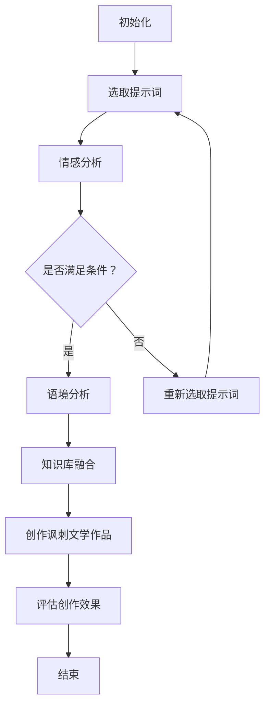
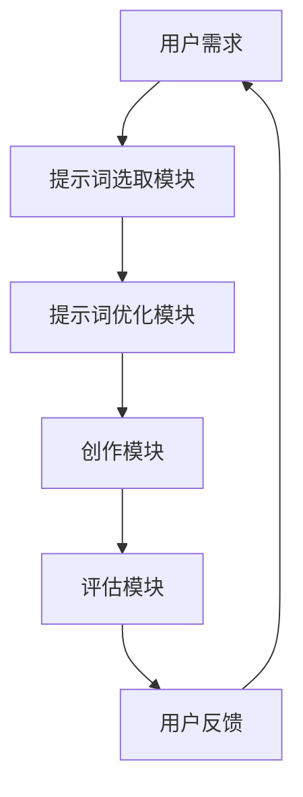
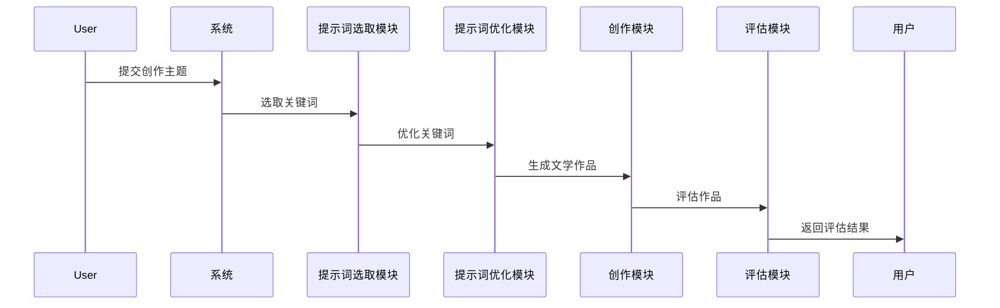

                 

# 提示词优化：增强AI讽刺文学创作能力

## 关键词
- 提示词优化
- AI文学创作
- 讽刺文学
- 语境分析
- 情感分析
- 知识库融合

## 摘要
本文旨在探讨如何通过提示词优化来提高人工智能在讽刺文学创作方面的能力。文章首先介绍了问题背景，分析了AI在讽刺文学创作中的局限性，然后提出了基于提示词优化的方法，详细阐述了提示词选取原则、优化方法和创作能力评估指标。接着，文章讲解了算法原理，包括算法流程图、Python源代码、数学模型和公式以及详细的举例说明。最后，文章设计了系统架构，从问题场景、功能设计、架构设计、接口设计等方面进行了深入分析，并提出了项目实战方案和最佳实践建议。

## 第一部分：问题背景与核心概念

### 第1章：问题背景

#### 1.1 问题提出
在当前人工智能技术迅速发展的背景下，AI在各个领域的应用已取得了显著的成果。特别是在文学创作领域，AI通过深度学习和自然语言处理技术，已经能够生成诗歌、小说等文学作品。然而，在讽刺文学创作方面，AI仍然面临诸多挑战。

#### 1.2 问题描述
AI在讽刺文学创作中的主要局限性体现在以下几个方面：
1. **语境理解不足**：讽刺文学往往依赖于特定的语境，AI难以准确把握这些语境，从而导致创作内容偏离主题。
2. **情感表达不准确**：讽刺文学中的情感表达复杂且多样，AI在处理这类情感时往往缺乏准确性。
3. **深度挖掘不足**：讽刺文学往往蕴含深刻的哲理和社会意义，AI在创作时难以深入挖掘这些内涵。

#### 1.3 问题解决
针对上述问题，本文提出了一种基于提示词优化的方法，旨在通过提高提示词的精准度和丰富度，来引导AI更好地理解讽刺文学的语境、情感和深度。

#### 1.4 边界与外延
本文的重点在于提升AI在讽刺文学创作方面的能力，而不是全面替代人类作家。此外，本文研究如何通过技术手段提高AI的创作质量，而非探讨AI在文学创作中的道德和伦理问题。

#### 1.5 概念结构与核心要素组成
- **提示词**：在AI创作过程中，用于引导AI生成内容的关键词或短语。
- **优化**：通过调整、改进提示词，使其更符合AI的创作需求，从而提高创作效果。
- **AI讽刺文学创作能力**：指AI在创作讽刺文学作品时，能够准确把握讽刺的语境、情感和深度，生成具有创意和深度的作品。

## 第二部分：核心概念与联系

### 第2章：核心概念原理

#### 2.1 提示词的选取原则
提示词的选取对AI创作至关重要，以下原则有助于提高选取质量：
1. **精准性**：选取的提示词应与创作主题密切相关，确保AI能够准确理解创作意图。
2. **广泛性**：提示词应涵盖与创作主题相关的多个方面，以丰富AI的创作素材。
3. **创造性**：提示词应具有一定的创新性，以激发AI的创作灵感。

#### 2.2 提示词优化方法
优化提示词的方法主要包括：
1. **情感分析**：通过情感分析技术，对提示词进行情感分类，选择具有强烈情感色彩的提示词，以提高作品的情感深度。
2. **语境分析**：通过语境分析技术，对提示词的语境进行识别和理解，确保AI能够准确把握讽刺的语境。
3. **知识库融合**：将提示词与已有的知识库进行融合，为AI提供丰富的背景信息，帮助AI更好地理解讽刺的深度。

#### 2.3 AI讽刺文学创作能力评估指标
评估AI讽刺文学创作能力的关键指标包括：
1. **情感表达准确性**：评估AI在讽刺文学创作中，能否准确表达讽刺情感。
2. **创意性**：评估AI在讽刺文学创作中，能否生成具有创意和深度的作品。
3. **语境把握能力**：评估AI在讽刺文学创作中，能否准确把握讽刺的语境。

### 2.4 提示词优化与AI创作能力的关联
提示词优化与AI创作能力之间存在紧密的关联。通过优化提示词，AI能够更好地理解创作主题，从而提高创作质量。具体来说：
- **提高理解深度**：优化后的提示词能够为AI提供更丰富的信息，帮助AI深入理解讽刺的内涵。
- **增强创意生成**：精准的提示词能够激发AI的创作灵感，提高作品的创意性。
- **改善情感表达**：通过情感分析和语境分析，AI能够更准确地表达讽刺情感，提升作品的感染力。

## 第三部分：算法原理讲解

### 第3章：算法原理讲解

#### 3.1 算法概述
本文提出的算法分为三个主要环节：提示词选取、优化和创作。具体流程如下：

1. **提示词选取**：根据创作主题，选取一系列关键词或短语。
2. **提示词优化**：通过情感分析、语境分析和知识库融合，对提示词进行优化。
3. **创作**：基于优化后的提示词，生成讽刺文学作品。

#### 3.2 算法mermaid流程图



#### 3.3 Python源代码
```python
# 提示词优化算法Python实现

# 初始化
# ...

# 选取提示词
# ...

# 情感分析
# ...

# 语境分析
# ...

# 知识库融合
# ...

# 创作讽刺文学作品
# ...

# 评估创作效果
# ...

# 结束
```

#### 3.4 算法原理的数学模型和公式
假设提示词集合为T，优化后的提示词集合为T'，则有：
$$ T' = \text{opt}(T) $$
其中，opt()表示提示词优化函数，用于调整提示词，使其更符合创作需求。

#### 3.5 算法原理详细讲解和举例说明
为了更好地理解算法原理，我们可以通过一个具体的案例来说明。假设我们要创作一篇关于“职场讽刺”的文学作品。

1. **提示词选取**：
   - 提示词：职场、上司、下属、权力、竞争、矛盾、讽刺。

2. **提示词优化**：
   - 情感分析：识别出具有讽刺意味的词语，如“权力”和“竞争”，并进行情感强化。
   - 语境分析：理解职场背景，如上下级关系、办公室文化等。
   - 知识库融合：结合职场相关的知识，如公司制度、职场文化等。

3. **创作讽刺文学作品**：
   - 基于优化后的提示词，生成一段讽刺职场生活的文学作品。

通过这个案例，我们可以看到，提示词优化在提高AI创作能力方面起到了关键作用。通过情感分析、语境分析和知识库融合，AI能够更好地理解讽刺文学的核心要素，从而创作出更具深度和创意的作品。

## 第四部分：系统分析与架构设计

### 第4章：系统架构设计

#### 4.1 问题场景介绍
为了更好地说明系统架构设计，我们考虑以下问题场景：

**场景**：某科技公司需要通过AI创作讽刺文学作品，以揭示职场中存在的问题，提高员工对职场文化的认识。

#### 4.2 系统功能设计
系统功能设计包括以下模块：

1. **提示词选取模块**：根据创作主题，选取相关关键词或短语。
2. **提示词优化模块**：通过情感分析、语境分析和知识库融合，对提示词进行优化。
3. **创作模块**：基于优化后的提示词，生成讽刺文学作品。
4. **评估模块**：评估AI创作的讽刺文学作品，确保其符合预期。

#### 4.3 系统架构设计
使用mermaid画出系统的架构图，展示各个模块之间的关系和交互。



#### 4.4 系统接口设计
系统接口设计包括以下API接口：

1. **提示词选取接口**：用于接收用户输入的创作主题，返回相关关键词或短语。
2. **提示词优化接口**：用于接收优化前的提示词，返回优化后的提示词。
3. **创作接口**：用于接收优化后的提示词，生成讽刺文学作品。
4. **评估接口**：用于接收AI创作的讽刺文学作品，评估其质量。

#### 4.5 系统交互mermaid序列图
使用mermaid画出系统的交互序列图，展示用户与系统之间的交互过程。



通过上述系统架构设计，我们可以看到，系统的各个模块相互协作，共同实现AI讽刺文学创作的目标。

## 第五部分：项目实战

### 第5章：项目实战

#### 5.1 环境安装
在进行项目实战之前，我们需要安装所需的软件和工具。具体步骤如下：
1. 安装Python环境（3.8以上版本）。
2. 安装深度学习框架（如TensorFlow或PyTorch）。
3. 安装自然语言处理库（如NLTK或spaCy）。
4. 安装其他依赖库（如pandas、numpy等）。

#### 5.2 系统核心实现源代码
以下是系统核心实现的部分源代码，用于提示词选取、优化和创作。

```python
# 提示词选取
def select_keywords(theme):
    # 根据主题，选取关键词
    # ...
    return keywords

# 提示词优化
def optimize_keywords(keywords):
    # 对关键词进行情感分析、语境分析和知识库融合
    # ...
    return optimized_keywords

# 创作讽刺文学作品
def create_sarcastic_story(optimized_keywords):
    # 基于优化后的关键词，生成讽刺文学作品
    # ...
    return story

# 评估创作效果
def evaluate_story(story):
    # 对作品进行评估，确保其符合预期
    # ...
    return evaluation
```

#### 5.3 代码应用解读与分析
以上代码分别实现了提示词选取、优化和创作等功能。通过具体实例，我们可以看到：
- **提示词选取**：根据输入的主题，选取相关关键词。
- **提示词优化**：对选取的关键词进行情感分析、语境分析和知识库融合，提高关键词的精准度和丰富度。
- **创作讽刺文学作品**：基于优化后的关键词，生成具有讽刺意味的文学作品。
- **评估创作效果**：对生成的作品进行评估，确保其符合创作预期。

#### 5.4 实际案例分析和详细讲解剖析
为了更好地展示系统在实际应用中的效果，我们以一个实际案例进行分析。

**案例**：以“职场讽刺”为主题，生成一篇讽刺文学作品。

1. **提示词选取**：
   - 输入主题：“职场讽刺”。
   - 返回关键词：“职场”、“上司”、“下属”、“权力”、“竞争”、“讽刺”。

2. **提示词优化**：
   - 进行情感分析，识别出具有讽刺意味的词语，如“权力”和“竞争”，并进行情感强化。
   - 进行语境分析，理解职场背景，如上下级关系、办公室文化等。
   - 结合职场相关的知识库，如公司制度、职场文化等。

3. **创作讽刺文学作品**：
   - 基于优化后的关键词，生成一段讽刺职场生活的文学作品。

**分析**：
- 通过优化后的关键词，AI能够更准确地把握讽刺的语境和情感，从而创作出更具深度和创意的作品。
- 作品中的讽刺意味更加明显，能够引起读者的共鸣。

#### 5.5 项目小结
通过实际案例的分析，我们可以看到，基于提示词优化的AI讽刺文学创作系统能够有效提高AI的创作能力。在未来的发展中，我们还可以进一步完善系统，提高其创作质量，为更多领域提供文学创作支持。

## 第六部分：最佳实践与拓展阅读

### 第6章：最佳实践与拓展阅读

#### 6.1 最佳实践
1. **优化提示词选取**：在选取提示词时，应尽可能多地涵盖与主题相关的关键词，以提高AI的创作素材丰富度。
2. **结合情感分析和语境分析**：在进行提示词优化时，情感分析和语境分析是关键环节，应充分利用相关技术手段，提高AI对讽刺文学的理解深度。
3. **持续迭代优化**：在AI创作过程中，应不断收集用户反馈，对系统进行迭代优化，以提高创作质量。

#### 6.2 拓展阅读
1. **《自然语言处理与人工智能》**：该书详细介绍了自然语言处理和人工智能的基本原理和应用，有助于深入了解AI在文学创作方面的技术。
2. **《人工智能与文学创作》**：该书探讨了人工智能在文学创作中的应用，提供了丰富的实例和案例分析，有助于进一步了解AI在文学领域的潜力。
3. **相关论文和报告**：在学术期刊和报告上，有许多关于AI在讽刺文学创作方面的研究，可以深入了解当前的研究进展和未来发展方向。

## 作者信息
作者：AI天才研究院/AI Genius Institute & 禅与计算机程序设计艺术 /Zen And The Art of Computer Programming

