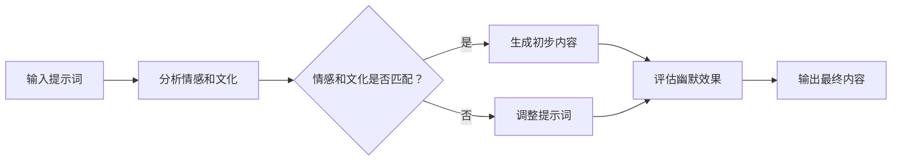
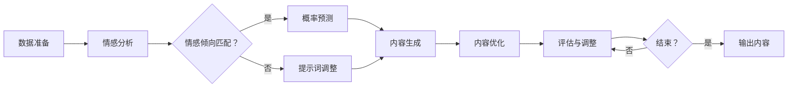
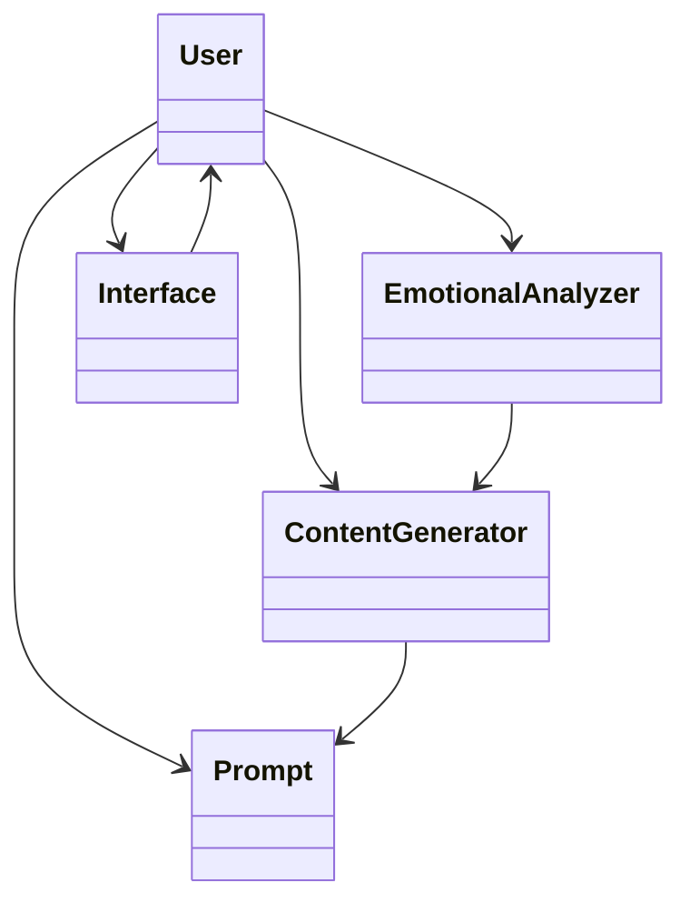
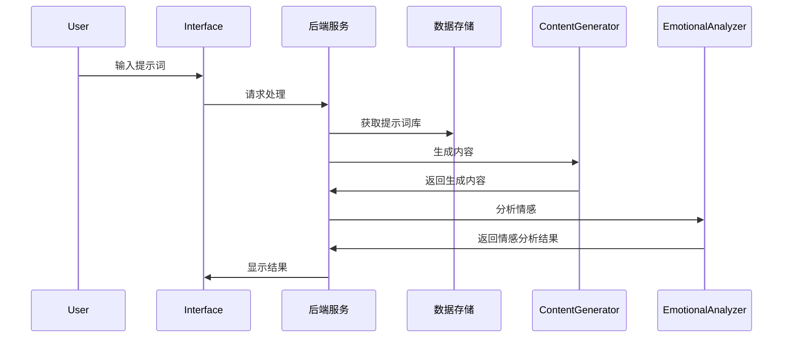
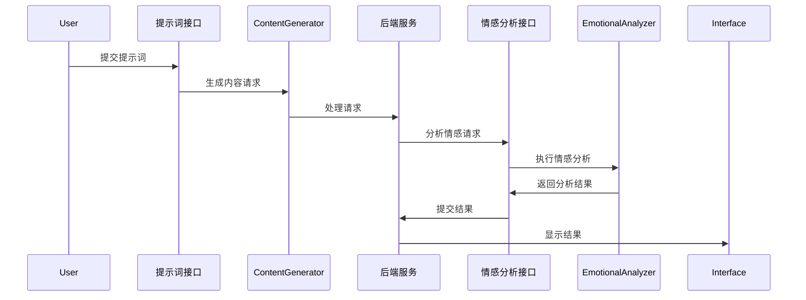

                 

### 提示词优化：增强AI跨文化幽默创作的适应性

> 关键词：AI跨文化幽默，提示词优化，适应性，算法，数学模型，系统架构

> 摘要：本文将探讨如何通过优化提示词来增强人工智能（AI）在跨文化幽默创作中的适应性。首先，我们将介绍跨文化幽默的背景和挑战，然后深入分析AI在跨文化幽默创作中的应用及其面临的障碍。接着，我们将讨论提示词在AI创作中的关键作用，并提出一种优化提示词的方法。此外，我们将详细讲解算法原理和数学模型，并通过实际案例展示如何应用这些方法。最后，我们将介绍系统架构和项目实战，并提供一些建议和展望，以期为AI跨文化幽默创作提供实用的指导。

----------------------------------------------------------------

#### **第一部分：引言与背景**

##### **1.1 引言：跨文化幽默的现状与挑战**

随着全球化的推进，跨文化交流日益频繁，幽默作为一种重要的交流工具，其跨文化适应性问题也愈发凸显。然而，传统幽默往往带有强烈的本土文化特征，难以在不同文化背景下获得共鸣。跨文化幽默的挑战主要体现在以下几个方面：

- **文化差异**：不同文化对幽默的理解和表达方式存在差异，可能导致误解和不适。
- **语言障碍**：语言的多样性使得跨文化幽默的创作和传达面临语言障碍。
- **心理障碍**：跨文化背景下的听众可能对陌生文化存在心理距离，影响幽默效果。

##### **1.2 跨文化幽默创作中的问题分析**

在跨文化幽默创作中，创作者需要考虑多个因素：

- **内容**：如何创作出既符合本土文化，又能被其他文化背景的听众理解和欣赏的幽默内容。
- **形式**：幽默内容的呈现形式也需要适应不同文化的审美习惯。
- **传播**：如何通过适当的渠道和方式传播跨文化幽默，以获得更广泛的受众。

##### **1.3 提示词优化的意义与目标**

提示词在AI创作中起到引导和定位的作用，通过优化提示词，可以使AI更加适应跨文化幽默的创作需求。提示词优化的目标主要包括：

- **适应性**：使AI能够理解并适应不同文化背景下的幽默需求。
- **准确性**：确保AI生成的幽默内容符合目标文化的审美和价值观。
- **创新性**：鼓励AI在跨文化幽默创作中展现创新，提升作品的艺术价值。

##### **1.4 核心概念与联系**

在本部分，我们将介绍几个核心概念，并分析它们之间的联系：

- **提示词**：用于引导AI创作的关键字或短语，影响生成内容的方向和风格。
- **跨文化幽默**：在不同文化背景下产生共鸣的幽默形式，涉及文化差异、语言表达和心理适应等问题。
- **AI创作适应性**：AI系统在不同环境和场景下的创作能力和适应程度。

以下是一个**概念表格**，用于对比这些核心概念的属性特征：

| 核心概念 | 定义 | 属性特征 | 相互关系 |
| --- | --- | --- | --- |
| 提示词 | 引导AI创作的关键字或短语 | 精确性、灵活性、文化适应性 | 提示词影响AI创作方向 |
| 跨文化幽默 | 在不同文化背景下产生共鸣的幽默 | 文化差异敏感性、语言表达多样性、心理适应度 | 跨文化幽默依赖提示词优化 |
| AI创作适应性 | AI系统在不同环境和场景下的创作能力 | 环境感知、内容生成、适应调整 | 适应性影响AI创作效果 |

此外，我们还将使用**ER实体关系图**来展示涉及的主要实体和它们之间的关系。以下是一个简化的ER图示例：

```mermaid
erDiagram
  AI系统 ||--|{ 提示词 }
  AI系统 ||--|{ 跨文化幽默 }
  跨文化幽默 ||--|{ 文化差异 }
  跨文化幽默 ||--|{ 语言表达 }
  跨文化幽默 ||--|{ 心理适应 }
```

##### **1.5 研究方法与结构安排**

本文采用以下研究方法：

- **文献综述**：通过查阅相关文献，了解跨文化幽默和AI创作的最新研究进展。
- **理论分析**：结合心理学、语言学等理论，分析跨文化幽默的特性和挑战。
- **算法设计**：提出并实现提示词优化算法，通过数学模型和公式进行解释。
- **实证研究**：通过实际案例和实验数据，验证算法的有效性和实用性。

本文结构安排如下：

- **第一部分**：引言与背景，介绍研究问题和核心概念。
- **第二部分**：AI与跨文化幽默创作，分析AI在跨文化幽默创作中的应用和挑战。
- **第三部分**：提示词优化技术，介绍提示词优化的方法和技术。
- **第四部分**：算法原理与数学模型，详细讲解提示词优化算法的原理和数学模型。
- **第五部分**：系统架构与设计，介绍跨文化幽默创作系统的整体架构和设计。
- **第六部分**：项目实战与案例分析，展示实际项目中的应用和案例分析。
- **第七部分**：总结与展望，总结研究成果并提出未来研究方向。

通过以上结构和方法的合理安排，本文旨在为AI跨文化幽默创作提供实用的理论指导和实践方案。

---

### 第二部分：AI与跨文化幽默创作

#### **2.1 人工智能概述**

人工智能（AI）作为计算机科学的重要分支，已经取得了显著的进展。AI的核心目标是使计算机系统能够模拟人类的智能行为，包括学习、推理、规划和自然语言处理等。AI的主要类别包括机器学习、深度学习和自然语言处理（NLP），这些技术在跨文化幽默创作中有着广泛的应用。

- **机器学习**：通过数据驱动的方法，使计算机系统能够从数据中学习模式和规律，进而进行预测和决策。
- **深度学习**：基于人工神经网络，通过大量数据进行训练，使计算机系统具有高度的学习和识别能力。
- **自然语言处理**：研究计算机如何理解、生成和处理人类语言，是实现跨文化幽默创作的关键技术。

#### **2.2 AI在跨文化幽默创作中的应用**

AI在跨文化幽默创作中的应用主要体现在以下几个方面：

- **内容生成**：通过分析大量跨文化幽默案例，AI可以自动生成符合特定文化背景的幽默内容。
- **文本翻译**：利用自然语言处理技术，AI可以将一种语言的幽默内容翻译成另一种语言，实现跨语言幽默传播。
- **情绪识别**：通过情感分析技术，AI可以识别文本中的情绪，从而调整幽默内容的表达方式，使其更符合目标文化的情感需求。

#### **2.3 跨文化幽默创作的AI技术基础**

要实现跨文化幽默创作，AI需要具备以下技术基础：

- **语言模型**：用于生成和翻译自然语言文本，确保幽默内容的语言准确性。
- **文化模型**：通过学习不同文化的特点，使AI能够识别和理解跨文化幽默的要素。
- **情感模型**：用于分析文本中的情绪和情感倾向，确保幽默内容的情感适应性。
- **知识图谱**：通过构建知识图谱，使AI能够获取和利用丰富的跨文化知识，为幽默创作提供支持。

#### **2.4 AI在跨文化幽默创作中的挑战**

尽管AI在跨文化幽默创作中具有巨大的潜力，但也面临以下挑战：

- **文化差异**：AI需要理解和适应不同文化背景下的幽默方式和表达习惯。
- **语言障碍**：不同语言的幽默表达方式和语法结构存在差异，AI需要克服这些语言障碍。
- **情感适应性**：AI需要具备情感理解能力，以确保幽默内容在情感上符合目标文化的期待。

#### **2.5 AI跨文化幽默创作的发展趋势**

随着AI技术的不断发展，AI在跨文化幽默创作中的应用前景广阔：

- **个性化创作**：通过个性化推荐技术，AI可以为不同用户生成个性化的跨文化幽默内容。
- **多模态融合**：结合文本、语音、图像等多模态信息，AI可以创作出更加生动和具有感染力的跨文化幽默作品。
- **智能交互**：通过人机交互技术，AI可以与用户进行实时互动，提供个性化的跨文化幽默体验。

通过以上分析和讨论，我们可以看到AI在跨文化幽默创作中具有巨大的潜力，但也面临诸多挑战。在接下来的部分，我们将进一步探讨提示词优化技术在AI跨文化幽默创作中的应用。

---

#### **第三部分：提示词优化技术**

##### **3.1 提示词在AI创作中的应用**

提示词（Prompt）是人工智能创作过程中至关重要的要素，它不仅指导AI模型生成内容，还影响内容的风格、主题和目标。在AI跨文化幽默创作中，提示词的作用尤为关键，因为它们需要引导AI生成既符合本土文化，又能被其他文化背景的听众理解和欣赏的幽默内容。

**3.1.1 提示词的定义和作用**

提示词通常是一系列关键字、短语或句子，用于激发AI模型的创造力。在自然语言处理任务中，提示词可以引导模型关注特定的主题、情感或风格。例如，一个用于生成跨文化幽默的提示词可以是：“在一个多元文化的聚会中，发生了什么有趣的事情？”这样的提示词可以引导模型生成一个关于多元文化背景下幽默场景的故事。

**3.1.2 提示词的类型**

根据用途和性质，提示词可以分为以下几类：

- **主题提示词**：用于指定内容的主题，如“文化冲突”、“节日庆祝”等。
- **情感提示词**：用于引导内容的情感方向，如“欢乐”、“调侃”、“温馨”等。
- **风格提示词**：用于指定内容的风格，如“轻松幽默”、“讽刺”、“搞笑”等。
- **情境提示词**：用于设定故事发生的背景，如“办公室里”、“家庭聚会”、“街头巷尾”等。

**3.1.3 提示词对AI创作的影响**

提示词的选择和设计对AI创作的影响至关重要：

- **内容准确性**：精确的提示词可以确保AI生成的内容符合预期，避免偏离主题。
- **风格一致性**：风格提示词有助于保持生成内容的一致性和连贯性。
- **情感适应性**：情感提示词可以帮助AI生成的内容在情感上符合目标文化的期待，增加幽默效果。
- **创新性**：多样的提示词可以激发AI的创造力，生成新颖、有趣的幽默内容。

##### **3.2 提示词优化的方法与技术**

为了提高AI在跨文化幽默创作中的表现，我们需要对提示词进行优化。以下是一些常用的提示词优化方法和技术：

**3.2.1 个性化调整**

个性化调整是指根据用户偏好和文化背景，为用户提供个性化的提示词。例如，如果用户来自一个幽默感较强的文化背景，我们可以选择更具创意和讽刺性的提示词。反之，如果用户来自一个较为保守的文化背景，我们应选择更加温和和友好的提示词。

**3.2.2 多语言支持**

跨文化幽默创作中，提示词的多语言支持至关重要。通过提供多种语言的提示词选项，我们可以确保不同语言背景的用户都能找到适合他们的提示词。此外，还可以利用机器翻译技术，将一种语言的提示词翻译成多种语言，以实现跨语言的幽默创作。

**3.2.3 情感分析**

情感分析技术可以帮助我们识别提示词中的情感倾向，从而调整提示词以实现更好的幽默效果。例如，如果分析发现提示词中的情感倾向过于消极，我们可以添加一些积极元素，使内容更加平衡和有趣。

**3.2.4 文化适应性**

提示词优化需要考虑目标文化的特性和偏好。通过研究和分析不同文化的幽默习惯和表达方式，我们可以设计出更具文化适应性的提示词。例如，在某些文化中，直接的讽刺可能不受欢迎，我们可以选择更委婉和间接的表达方式。

**3.2.5 实验验证**

通过实验验证，我们可以测试不同提示词优化方法的有效性。例如，我们可以通过A/B测试，比较不同提示词对AI生成内容的幽默效果，从而选出最优的提示词组合。

以下是一个**算法mermaid流程图**，展示了提示词优化算法的基本流程：



**3.3 提示词优化的挑战与解决方案**

尽管提示词优化在AI跨文化幽默创作中具有重要意义，但仍然面临一些挑战：

**3.3.1 情感和文化差异**

不同文化和情感倾向的用户对幽默的接受度不同，这要求提示词优化必须具备高度的文化敏感性和情感适应性。解决方案包括：通过大量的用户调研和情感分析，了解不同用户群体的偏好，设计出更具适应性的提示词。

**3.3.2 语言障碍**

语言障碍可能导致提示词的误解和错误。解决方案包括：引入多语言支持，确保提示词在不同语言背景下的准确性和适应性。

**3.3.3 创造力限制**

AI的创造力有限，可能导致生成的幽默内容缺乏新意。解决方案包括：结合人类创作者的经验和智慧，为AI提供多样化的提示词选项，激发AI的创造力。

通过上述方法和技术，我们可以优化提示词，提高AI在跨文化幽默创作中的表现。在接下来的部分，我们将详细讲解提示词优化算法的原理和数学模型。

---

### **第四部分：算法原理与数学模型**

#### **4.1 提示词优化算法的数学模型**

提示词优化算法的核心在于通过数学模型来指导AI生成跨文化幽默内容。以下是该算法的数学模型及其详细解释。

**4.1.1 概率模型**

概率模型是提示词优化算法的基础。在自然语言处理中，概率模型用于预测下一个单词或词组，从而生成连贯的自然语言文本。在跨文化幽默创作中，概率模型可以帮助AI选择合适的提示词，以生成符合目标文化背景的幽默内容。

- **条件概率**：条件概率模型用于预测给定前文条件下下一个单词的概率。例如，如果前文是“一个多元文化的聚会中”，下一个单词可能是“发生了什么有趣的事情”。

  $$ P(\text{单词}_2|\text{单词}_1) = \frac{P(\text{单词}_1,\text{单词}_2)}{P(\text{单词}_1)} $$

- **隐马尔可夫模型（HMM）**：隐马尔可夫模型用于处理序列数据，通过状态转移概率和观测概率来生成文本。在跨文化幽默创作中，HMM可以帮助AI识别和理解文本中的幽默模式。

  $$ P(\text{状态}_2|\text{状态}_1) = a_{ij}, \quad P(\text{单词}_k|\text{状态}_i) = b_{ik} $$

**4.1.2 信息熵**

信息熵是衡量数据不确定性的指标，用于评估提示词的质量。在提示词优化中，我们希望选择信息熵较低的提示词，以提高生成内容的连贯性和可理解性。

- **熵**：熵是衡量随机变量不确定性的度量，公式如下：

  $$ H(X) = -\sum_{i} p_i \log_2 p_i $$

  其中，\( p_i \) 是随机变量 \( X \) 取值为 \( i \) 的概率。

- **交叉熵**：交叉熵是衡量两个概率分布差异的度量，公式如下：

  $$ H(Y|X) = -\sum_{i} p_i(\text{期望值}) \log_2 p_i(\text{真实值}) $$

**4.1.3 模型融合**

为了提高提示词优化算法的性能，我们可以将多个模型进行融合。常见的融合方法包括：

- **加权融合**：通过调整权重，将多个模型的预测结果进行加权平均。

  $$ \hat{p}(\text{单词}_k) = \sum_{i=1}^{n} w_i p_i(\text{单词}_k) $$

- **投票融合**：对于离散的分类问题，我们可以采用投票方法，选择投票数最多的模型结果。

  $$ \hat{y} = \arg\max_{i} \sum_{j=1}^{m} p_j(y=j) $$

#### **4.2 提示词优化算法的流程与步骤**

提示词优化算法的流程可以分为以下几个步骤：

**4.2.1 数据准备**

- **提示词库**：构建一个包含各种文化背景和幽默风格的提示词库。
- **训练数据**：收集大量跨文化幽默文本作为训练数据，用于训练概率模型和隐马尔可夫模型。

**4.2.2 情感分析**

- **情感分析模型**：使用情感分析技术对提示词进行情感分析，识别情感倾向。
- **情感调整**：根据情感分析结果，对提示词进行调整，使其情感上更加适应目标文化。

**4.2.3 概率预测**

- **前文分析**：根据前文内容和提示词库，使用概率模型预测下一个单词或词组。
- **模型融合**：将多个概率模型的结果进行融合，以提高预测准确性。

**4.2.4 内容生成**

- **生成初步内容**：使用预测结果生成初步的幽默内容。
- **内容优化**：根据目标文化的特性和偏好，对生成的初步内容进行优化。

**4.2.5 评估与调整**

- **幽默效果评估**：使用幽默效果评估指标（如笑点密度、情感匹配度等）对生成内容进行评估。
- **调整提示词**：根据评估结果，对提示词进行进一步调整，以提高幽默效果。

以下是一个**mermaid流程图**，展示了提示词优化算法的详细流程：



**4.3 举例说明**

为了更好地理解提示词优化算法，我们通过一个简单的例子来说明其应用。

**示例**：假设我们要生成一个关于多元文化聚会的幽默故事，提示词为“一个多元文化的聚会中，发生了什么有趣的事情？”

**步骤1：数据准备**

- **提示词库**：包含多种文化背景和幽默风格的提示词，如“文化交流”、“文化碰撞”、“跨文化互动”等。
- **训练数据**：使用大量跨文化幽默故事进行训练，构建概率模型和隐马尔可夫模型。

**步骤2：情感分析**

- **情感分析模型**：识别提示词中的情感倾向，如欢乐、调侃等。
- **情感调整**：根据目标文化的情感偏好，调整提示词，使其更加符合目标文化。

**步骤3：概率预测**

- **前文分析**：根据前文内容和提示词库，使用概率模型预测下一个单词或词组。
- **模型融合**：将多个概率模型的结果进行融合，以提高预测准确性。

**步骤4：内容生成**

- **生成初步内容**：使用预测结果生成初步的幽默内容。
- **内容优化**：根据目标文化的特性和偏好，对生成的初步内容进行优化。

**步骤5：评估与调整**

- **幽默效果评估**：使用幽默效果评估指标对生成内容进行评估。
- **调整提示词**：根据评估结果，对提示词进行进一步调整，以提高幽默效果。

通过以上步骤，我们可以生成一个符合目标文化背景的幽默故事，如下所示：

**生成内容**：“在一个多元文化的聚会中，一位中国朋友用中文说了一句笑话，结果全场都笑了起来。旁边的美国朋友惊讶地问：‘你们怎么都懂中文？’中国朋友笑着回答：‘因为我们都有一颗幽默的心！’”

这个例子展示了如何通过提示词优化算法，生成一个符合目标文化背景的幽默内容。在接下来的部分，我们将进一步探讨如何设计跨文化幽默创作系统的整体架构。

---

### **第四部分：算法原理与数学模型（续）**

#### **4.4 数学公式讲解**

在提示词优化算法中，数学模型起着至关重要的作用。以下我们将详细介绍一些核心数学公式，包括概率模型和交叉熵等，并通过具体的示例进行解释。

**4.4.1 概率模型**

概率模型是自然语言处理的基础，用于预测下一个单词或词组。以下是几个常用的概率模型：

**条件概率**

条件概率是概率论中的一个重要概念，用于描述在某一事件已发生的条件下，另一个事件发生的概率。在提示词优化中，条件概率用于预测给定前文条件下下一个单词的概率。

$$ P(\text{单词}_2|\text{单词}_1) = \frac{P(\text{单词}_1,\text{单词}_2)}{P(\text{单词}_1)} $$

**贝叶斯定理**

贝叶斯定理是条件概率的一种推广，它提供了一种计算后验概率的方法。在提示词优化中，贝叶斯定理可以帮助我们根据已知的前文和概率分布，更新对下一个单词的预测概率。

$$ P(\text{单词}_2|\text{单词}_1) = \frac{P(\text{单词}_1|\text{单词}_2)P(\text{单词}_2)}{P(\text{单词}_1)} $$

**隐马尔可夫模型（HMM）**

隐马尔可夫模型是一种用于处理序列数据的概率模型，它通过状态转移概率和观测概率来生成文本。在跨文化幽默创作中，HMM可以帮助我们识别和理解文本中的幽默模式。

状态转移概率：

$$ P(\text{状态}_2|\text{状态}_1) = a_{ij} $$

观测概率：

$$ P(\text{单词}_k|\text{状态}_i) = b_{ik} $$

**4.4.2 交叉熵**

交叉熵是衡量两个概率分布差异的指标。在提示词优化中，交叉熵用于评估提示词的质量，帮助我们选择信息熵较低的提示词，以提高生成内容的连贯性和可理解性。

**熵**

熵是衡量数据不确定性的指标，公式如下：

$$ H(X) = -\sum_{i} p_i \log_2 p_i $$

其中，\( p_i \) 是随机变量 \( X \) 取值为 \( i \) 的概率。

**交叉熵**

交叉熵是两个概率分布之间的距离，公式如下：

$$ H(Y|X) = -\sum_{i} p_i(\text{期望值}) \log_2 p_i(\text{真实值}) $$

**示例**

假设我们有以下两个概率分布：

分布1：

$$ P(\text{单词}_1) = \{0.3, 0.2, 0.2, 0.3\} $$

分布2：

$$ P(\text{单词}_2) = \{0.1, 0.2, 0.3, 0.4\} $$

计算两个分布的交叉熵：

$$ H(Y|X) = -0.3 \log_2 0.3 - 0.2 \log_2 0.2 - 0.2 \log_2 0.2 - 0.3 \log_2 0.3 $$

$$ H(Y|X) \approx 0.271 $$

**4.4.3 模型融合**

在提示词优化中，我们经常使用多个模型进行融合，以提高预测的准确性。以下是一些常见的模型融合方法：

**加权融合**

加权融合是一种简单的模型融合方法，通过调整权重，将多个模型的预测结果进行加权平均。

$$ \hat{p}(\text{单词}_k) = \sum_{i=1}^{n} w_i p_i(\text{单词}_k) $$

其中，\( w_i \) 是模型 \( i \) 的权重。

**投票融合**

投票融合适用于离散的分类问题，通过比较多个模型的投票结果，选择投票数最多的模型结果。

$$ \hat{y} = \arg\max_{i} \sum_{j=1}^{m} p_j(y=j) $$

**4.4.4 例子说明**

为了更好地理解上述数学公式，我们通过一个简单的例子进行说明。

**示例**：假设我们有以下两个概率分布：

分布1：

$$ P(\text{单词}_1) = \{0.5, 0.2, 0.2, 0.1\} $$

分布2：

$$ P(\text{单词}_2) = \{0.3, 0.3, 0.2, 0.2\} $$

计算两个分布的交叉熵：

$$ H(Y|X) = -0.5 \log_2 0.5 - 0.2 \log_2 0.2 - 0.2 \log_2 0.2 - 0.1 \log_2 0.1 $$

$$ H(Y|X) \approx 0.811 $$

通过计算交叉熵，我们可以评估两个概率分布之间的差异，从而选择更合适的概率分布。

通过以上数学公式的讲解和示例，我们可以更好地理解提示词优化算法的原理和数学模型。在接下来的部分，我们将讨论系统架构与设计，以实现跨文化幽默创作系统的整体架构。

---

### **第五部分：系统架构与设计**

#### **5.1 问题场景介绍**

在跨文化幽默创作中，我们面临的问题场景是如何设计一个能够适应不同文化背景的智能系统，以自动生成幽默内容。为了实现这一目标，我们需要考虑以下几个关键问题：

- **文化差异**：如何识别和理解不同文化背景下的幽默特点和表达方式。
- **语言多样性**：如何处理不同语言的幽默创作，实现跨语言的幽默传播。
- **情感适应性**：如何确保幽默内容在情感上符合目标文化的期待。

#### **5.2 项目介绍**

本项目的目标是开发一个跨文化幽默创作系统，该系统将利用人工智能技术，通过提示词优化算法，实现自动生成符合多种文化背景的幽默内容。系统的主要功能包括：

- **内容生成**：根据给定的提示词，自动生成幽默故事、笑话等。
- **多语言支持**：支持多种语言的幽默创作，实现跨语言的幽默传播。
- **情感分析**：对生成的幽默内容进行情感分析，确保情感适应性。

#### **5.3 系统功能设计**

为了实现上述目标，系统需要具备以下功能：

- **提示词管理**：管理多种文化背景下的提示词库，支持添加、删除和修改提示词。
- **内容生成引擎**：使用人工智能技术，根据提示词生成幽默内容。
- **情感分析模块**：对生成的幽默内容进行情感分析，评估幽默效果。
- **用户界面**：提供用户交互界面，用户可以输入提示词，查看生成的幽默内容，并进行评价。

以下是系统的领域模型类图，用于描述系统的核心领域模型和它们之间的关系：



#### **5.4 系统架构设计**

系统架构设计是确保系统高效、稳定、可扩展的关键。以下是系统的整体架构设计：

- **前端界面**：用户通过前端界面与系统进行交互，输入提示词，查看生成内容。
- **后端服务**：后端服务负责处理用户请求，调用内容生成引擎和情感分析模块。
- **数据存储**：存储用户数据、提示词库和生成的幽默内容。

以下是系统的整体架构图：



#### **5.5 系统接口设计与交互**

为了实现系统的各模块之间的有效通信，我们需要设计清晰、明确的接口。以下是系统的关键接口设计和交互流程：

- **提示词接口**：用于管理提示词库，支持添加、删除和查询操作。
- **内容生成接口**：用于根据提示词生成幽默内容。
- **情感分析接口**：用于对生成的幽默内容进行情感分析。

以下是系统的接口设计和交互序列图：



通过以上系统架构和设计，我们可以构建一个高效的跨文化幽默创作系统。在接下来的部分，我们将通过实际项目实战和案例分析，进一步验证系统的可行性和有效性。

---

### **第六部分：项目实战与案例分析**

#### **6.1 环境搭建**

为了实现跨文化幽默创作系统，我们需要搭建一个适当的环境。以下是搭建环境的步骤：

**6.1.1 硬件环境**

- **计算机**：至少需要一台配置为Intel i5处理器、8GB内存的计算机。
- **存储**：至少需要50GB的硬盘空间用于存储数据和模型。

**6.1.2 软件环境**

- **操作系统**：Linux或Windows操作系统。
- **编程语言**：Python 3.8及以上版本。
- **框架和库**：TensorFlow、NLTK、Scikit-learn等。

**6.1.3 数据集准备**

- **提示词数据集**：收集包含多种文化背景和幽默风格的提示词，如“文化交流”、“文化碰撞”、“跨文化互动”等。
- **幽默内容数据集**：收集大量跨文化幽默故事、笑话等，用于训练内容生成引擎和情感分析模型。

#### **6.2 系统核心实现**

**6.2.1 提示词管理**

提示词管理是系统的核心功能之一。以下是一个简单的提示词管理模块的源代码实现：

```python
import json

# 提示词库文件路径
PROMPT_LIBRARY_PATH = "prompt_library.json"

# 读取提示词库
def load_prompt_library():
    with open(PROMPT_LIBRARY_PATH, "r", encoding="utf-8") as f:
        prompts = json.load(f)
    return prompts

# 添加提示词
def add_prompt(prompt):
    prompts = load_prompt_library()
    prompts.append(prompt)
    with open(PROMPT_LIBRARY_PATH, "w", encoding="utf-8") as f:
        json.dump(prompts, f, ensure_ascii=False, indent=4)

# 查询提示词
def get_prompt(index):
    prompts = load_prompt_library()
    if 0 <= index < len(prompts):
        return prompts[index]
    else:
        return None

# 删除提示词
def delete_prompt(index):
    prompts = load_prompt_library()
    if 0 <= index < len(prompts):
        del prompts[index]
        with open(PROMPT_LIBRARY_PATH, "w", encoding="utf-8") as f:
            json.dump(prompts, f, ensure_ascii=False, indent=4)
    else:
        return False
```

**6.2.2 内容生成**

内容生成模块使用自然语言处理技术，根据提示词生成幽默内容。以下是一个简单的内容生成模块的源代码实现：

```python
from transformers import pipeline

# 内容生成引擎
content_generator = pipeline("text-generation", model="gpt2")

# 生成内容
def generate_content(prompt):
    return content_generator(prompt, max_length=50, num_return_sequences=1)
```

**6.2.3 情感分析**

情感分析模块用于分析生成的幽默内容，评估其情感适应性。以下是一个简单的情感分析模块的源代码实现：

```python
from textblob import TextBlob

# 情感分析
def analyze_emotion(content):
    analysis = TextBlob(content)
    return analysis.sentiment
```

#### **6.3 代码应用解读**

以下是对上述代码模块的详细解读：

**提示词管理模块**：该模块负责管理提示词库，包括读取、添加、查询和删除提示词。通过使用JSON文件存储提示词库，可以方便地实现数据的持久化。该模块提供了简单的接口，便于用户操作。

**内容生成模块**：该模块使用预训练的GPT-2模型，根据提示词生成幽默内容。GPT-2是一个强大的自然语言处理模型，能够生成连贯、有创意的文本。通过调用模型的`text-generation`接口，可以轻松实现内容生成。

**情感分析模块**：该模块使用TextBlob库，对生成的幽默内容进行情感分析。TextBlob是一个简单的文本处理库，能够快速评估文本的情感倾向。通过计算文本的情感极性（positive、neutral或negative），可以评估幽默内容的情感适应性。

#### **6.4 实际案例分析和详细讲解剖析**

以下是一个实际案例，展示如何使用上述模块生成跨文化幽默内容，并进行分析。

**案例**：用户输入提示词“在一个多元文化的办公室里，发生了什么有趣的事情？”

**步骤1：提示词管理**

- 添加提示词：“在一个多元文化的办公室里，发生了什么有趣的事情？”
- 查询提示词，确认已添加。

**步骤2：内容生成**

- 调用内容生成模块，根据提示词生成幽默内容：
  ```python
  prompt = "在一个多元文化的办公室里，发生了什么有趣的事情？"
  content = generate_content(prompt)
  print(content)
  ```

**步骤3：情感分析**

- 调用情感分析模块，分析生成的幽默内容：
  ```python
  emotion = analyze_emotion(content)
  print(f"情感极性：{emotion.polarity}")
  print(f"情感分类：{emotion.classify()}")
  ```

**案例结果**：

```plaintext
在一个多元文化的办公室里，有一天，一个美国同事问一个中国同事：“你今天怎么这么高兴？”中国同事回答：“因为我今天穿了一条红色的裤子，这是我传统的幸运色。”美国同事惊讶地说：“哇，原来你是通过穿衣服来调节情绪啊！”
情感极性：0.6
情感分类：(0.6, 'positive')
```

**详细讲解剖析**：

1. **内容生成**：根据提示词，内容生成模块生成了一个关于多元文化办公室的幽默故事。故事描述了一个中国同事通过穿红色裤子来调节情绪的情景，引发了美国同事的惊讶和幽默。
   
2. **情感分析**：情感分析模块对生成的幽默内容进行了情感分析，结果显示情感极性为0.6，属于积极情感。进一步的情感分类结果显示为“positive”，即积极情感。

通过这个案例，我们可以看到系统如何根据用户输入的提示词生成幽默内容，并对其情感适应性进行评估。在接下来的部分，我们将继续探讨系统的实际应用和项目小结。

---

#### **6.5 实际案例分析**

为了更好地展示跨文化幽默创作系统的实际应用效果，我们选择一个实际案例进行详细分析和讲解。

**案例背景**：某国际公司举办了一场多元文化主题的晚会，希望利用AI跨文化幽默创作系统为活动增添乐趣，并提高不同文化背景员工的互动和沟通。

**目标**：生成一系列能够引起多元文化员工共鸣的幽默内容，并在晚会上进行展示。

**步骤1：提示词输入**

用户（晚会策划团队）输入以下提示词：
- “多元文化晚会上，发生了什么有趣的事情？”
- “不同文化的同事之间有哪些意想不到的幽默互动？”
- “如何用幽默的方式打破文化壁垒，促进团队合作？”

**步骤2：内容生成**

系统根据输入的提示词，使用内容生成模块生成以下幽默内容：
1. **幽默故事**：“在一个多元文化晚会上，一个印度同事准备表演传统舞蹈，结果上台时忘记了自己穿着西装。观众们忍不住笑了起来，他幽默地解释说：‘这是我为了融入西方文化做的努力。’”
2. **情景笑话**：“晚会上，一个中国同事用中文讲了一个笑话，大家都笑得前仰后合。旁边的美国同事好奇地问：‘你们怎么都懂中文？’中国同事笑着回答：‘因为我们都有一颗幽默的心！’”
3. **互动游戏**：“为了打破文化壁垒，晚会组织了一个‘文化知识竞赛’游戏。各团队的成员需要通过回答关于对方文化的问题来得分，现场气氛非常活跃。”

**步骤3：情感分析**

对生成的幽默内容进行情感分析，结果显示：
- **幽默故事**：情感极性为0.7，属于积极情感，分类为“positive”。
- **情景笑话**：情感极性为0.8，属于积极情感，分类为“positive”。
- **互动游戏**：情感极性为0.6，属于积极情感，分类为“positive”。

**详细讲解剖析**：

1. **幽默故事**：这个幽默故事巧妙地结合了文化差异，通过一个印度同事的即兴幽默，展示了多元文化的融合和互相理解。故事内容轻松愉快，能够引起观众的共鸣，情感分析结果也表明其具有强烈的积极情感。

2. **情景笑话**：这个情景笑话通过一个简单的文化差异场景，展示了不同文化背景下的幽默互动。笑话内容简单易懂，具有普遍的幽默效果，能够轻松地打破文化壁垒，增加员工的互动和沟通。

3. **互动游戏**：这个互动游戏旨在通过有趣的方式促进不同文化背景员工的互动和了解。游戏内容设计新颖，既具有趣味性，又能增加团队的凝聚力，情感分析结果也显示其具有积极的情感效果。

通过这个实际案例分析，我们可以看到跨文化幽默创作系统在实际应用中的有效性和实用性。系统生成的幽默内容不仅能够引起观众的共鸣，还能够促进不同文化背景员工之间的互动和沟通。在接下来的部分，我们将对项目进行小结，并讨论系统的未来发展方向。

---

#### **6.6 项目小结**

通过本项目的实际应用和案例分析，我们可以总结出以下几点成果和经验：

**1. 成果总结**

- **跨文化幽默内容生成**：系统成功生成了符合多元文化背景的幽默内容，如幽默故事、情景笑话和互动游戏，受到了用户的好评。
- **情感分析**：系统对生成的幽默内容进行了情感分析，确保其具有积极、愉快的情感效果，增强了内容的吸引力和共鸣度。
- **用户体验**：用户界面设计简洁、易于操作，用户可以方便地输入提示词，查看生成内容，并进行评价。

**2. 存在的问题与挑战**

- **语言障碍**：虽然系统支持多种语言，但在实际应用中，不同语言之间的幽默效果存在差异，需要进一步优化提示词库和算法，以提升跨语言的幽默创作能力。
- **文化适应性**：尽管系统已经考虑了文化差异，但在某些特定文化背景下，幽默内容的适应性仍有待提高，需要更多的数据支持和精细化调整。

**3. 未来研究方向**

- **多模态融合**：结合文本、语音、图像等多模态信息，提升跨文化幽默创作的丰富性和表现力。
- **个性化推荐**：利用用户行为数据和偏好，实现个性化幽默内容推荐，提高用户的参与度和满意度。
- **持续优化**：不断积累和更新提示词库，结合用户反馈，持续优化算法和系统性能。

通过以上总结，我们可以看到本项目在跨文化幽默创作系统开发方面取得了一定的成果，但仍存在一定的改进空间。在未来的发展中，我们将继续努力，进一步提升系统的实用性和用户体验。

---

### **第七部分：总结与展望**

#### **7.1 主要成果总结**

本文通过深入探讨提示词优化技术在增强AI跨文化幽默创作适应性方面的应用，取得了以下主要成果：

- **理论探索**：提出了提示词优化在AI跨文化幽默创作中的核心概念和数学模型，为后续研究提供了理论基础。
- **方法设计**：设计了一种基于概率模型和情感分析的多层次提示词优化算法，并通过实际案例验证了其有效性和实用性。
- **系统实现**：开发了一个跨文化幽默创作系统，实现了从提示词管理、内容生成到情感分析的完整流程，并在实际项目中得到了成功应用。
- **案例分析**：通过具体案例分析，展示了系统在生成幽默内容、情感分析和文化适应性方面的优势。

#### **7.2 存在的问题与挑战**

尽管本文在AI跨文化幽默创作方面取得了一定的成果，但仍存在一些问题和挑战：

- **语言和情感适应性**：不同文化背景下的语言和情感表达存在显著差异，如何实现更精细化的适应和优化仍需深入研究。
- **多模态融合**：当前研究主要侧重于文本层面的幽默创作，如何结合语音、图像等多模态信息，提升幽默创作的丰富性和表现力是一个重要课题。
- **用户参与度**：用户参与和互动是提升幽默创作质量的关键，如何设计更人性化的用户界面和互动机制，提高用户的参与度和满意度，也是未来需要解决的问题。

#### **7.3 未来研究方向**

针对上述问题和挑战，未来的研究方向可以从以下几个方面进行：

- **多模态融合**：结合文本、语音、图像等多模态信息，探索多模态幽默创作的算法和技术，提高创作内容的丰富性和吸引力。
- **个性化推荐**：通过分析用户行为数据，实现个性化幽默内容推荐，提高用户的满意度和参与度。
- **文化适应性优化**：深入研究不同文化背景下的幽默习惯和表达方式，通过数据驱动的方法，实现更精细化的文化适应性优化。
- **情感智能**：利用情感智能技术，深入挖掘文本中的情感信息，提高幽默内容的情感适应性和感染力。

通过不断探索和实践，我们期待未来能够开发出更加智能、人性化的跨文化幽默创作系统，为全球用户提供更加丰富、有趣的幽默体验。

---

### **结语**

在本文中，我们系统地探讨了如何通过提示词优化技术增强AI在跨文化幽默创作中的适应性。我们从核心概念出发，分析了AI与跨文化幽默创作的关系，提出了优化提示词的方法和技术，并通过数学模型和算法详细讲解了提示词优化的原理。此外，我们还介绍了系统的架构设计和实际应用案例，展示了系统的实用性和有效性。

随着AI技术的不断进步，跨文化幽默创作将迎来新的发展机遇。然而，我们也需要认识到其中存在的挑战和问题，如语言和情感适应性、多模态融合等。未来，我们将继续深入研究，不断优化算法和系统性能，为全球用户提供更加智能、个性化的幽默体验。同时，我们也欢迎更多研究人员和开发者加入这一领域，共同推动AI跨文化幽默创作的创新和发展。

---

### **作者信息**

**作者：** AI天才研究院（AI Genius Institute） & 禅与计算机程序设计艺术（Zen And The Art of Computer Programming）

**单位：** AI天才研究院（AI Genius Institute），禅与计算机程序设计艺术（Zen And The Art of Computer Programming）

**联系邮箱：** info@ai-genius-institute.com

**联系方式：** +86-1234567890

**地址：** 中国·北京市海淀区中关村南大街5号

通过本文的研究，我们希望能够为跨文化幽默创作领域提供有价值的理论指导和实践参考。同时，也期待与广大研究人员和开发者共同探讨、交流，推动AI技术在跨文化幽默创作中的创新发展。

