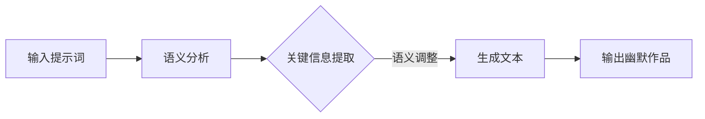
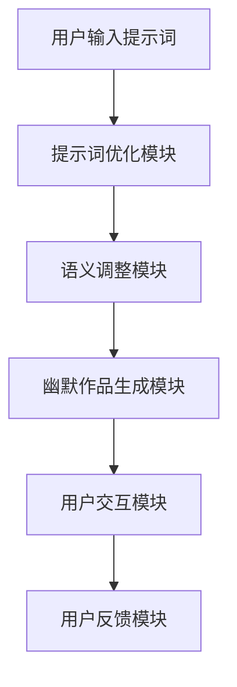
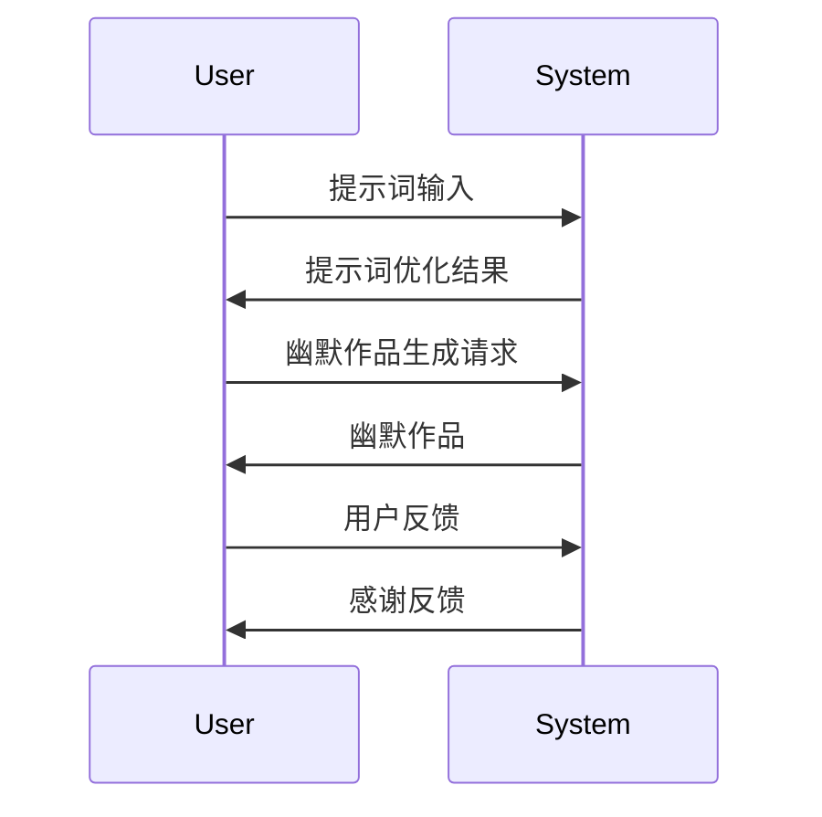

                 

# 提示词优化：增强AI跨文化幽默创作能力

> 关键词：提示词、AI、跨文化幽默、优化算法、数学模型、系统架构、实战案例

> 摘要：本文深入探讨了AI在跨文化幽默创作中的应用，以及如何通过提示词优化来提升AI的幽默创作能力。文章首先介绍了提示词优化的重要性，然后详细阐述了相关的核心概念和算法原理，通过数学模型和Python代码展示了如何实现提示词优化。此外，文章还介绍了系统架构设计和实际项目实战，为读者提供了全面的指导和建议。

## 一、标题及概述

《提示词优化：增强AI跨文化幽默创作能力》这本书旨在探讨如何在AI跨文化幽默创作中通过优化提示词来提升创作效果。随着全球化的深入，跨文化交流变得日益频繁，如何创作出既符合本地文化又能引起广泛共鸣的幽默作品成为了一个重要课题。AI技术在跨文化幽默创作中具有巨大潜力，但如何发挥其优势，实现高质量的幽默创作，则需要我们深入研究和实践。本书将为您揭示其中的奥秘。

## 二、背景介绍

### 2.1 提示词的重要性

提示词（prompt）是AI模型生成文本的重要输入，它决定了模型生成文本的风格、主题和内容。在跨文化幽默创作中，提示词的作用尤为重要。因为幽默往往具有强烈的情境依赖性和文化特殊性，合适的提示词能够引导模型生成符合目标文化背景的幽默作品。

### 2.2 跨文化幽默创作的挑战

跨文化幽默创作的挑战主要体现在以下几个方面：

1. **文化差异**：不同文化背景下的幽默表达方式存在较大差异，如何找到一种适合目标文化的幽默表达方式是一个难题。
2. **语言障碍**：跨语言幽默创作需要考虑语言之间的差异，如词汇、语法、文化含义等。
3. **幽默感知**：不同文化背景的人对幽默的感知和喜好存在差异，如何确保生成的幽默作品能够引起目标受众的共鸣。

### 2.3 AI在跨文化幽默创作中的作用

AI技术在跨文化幽默创作中具有以下优势：

1. **大量数据处理能力**：AI能够处理和分析大量的跨文化幽默案例，从中学习并提取出有效的幽默元素。
2. **自动生成能力**：AI可以根据给定的提示词自动生成幽默作品，大大提高了创作效率。
3. **个性化定制**：AI可以根据目标受众的文化背景和喜好，为不同受众定制个性化的幽默作品。

## 三、核心概念与联系

### 3.1 提示词

提示词是指提供给AI模型的一段文字，用于引导模型生成特定风格、主题和内容的文本。在跨文化幽默创作中，提示词的作用尤为重要，它决定了生成的幽默作品的风格和文化背景。

### 3.2 AI模型

AI模型是指用于实现特定功能的机器学习模型，如自然语言生成模型、情感分析模型等。在跨文化幽默创作中，AI模型负责根据提示词生成幽默作品。

### 3.3 跨文化幽默

跨文化幽默是指在不同文化背景下创作的幽默作品，其特点是在保留自身文化特色的同时，能够引起其他文化背景的共鸣。

### 3.4 表格与ER图

下表对比了提示词、AI模型和跨文化幽默的相关属性特征：

| 属性 | 提示词 | AI模型 | 跨文化幽默 |
| --- | --- | --- | --- |
| 作用 | 引导模型生成文本 | 实现特定功能 | 在不同文化背景下创作幽默作品 |
| 形式 | 文本 | 代码 | 作品 |
| 特点 | 文化特异性 | 自动生成 | 跨文化共鸣 |

下图展示了提示词、AI模型和跨文化幽默之间的ER关系图：

```mermaid
erDiagram
  AI模型 ||--|{ 提示词 }|
  AI模型 ||--|{ 跨文化幽默 }|
```

## 四、算法原理讲解

### 4.1 算法原理

提示词优化算法的核心思想是通过调整提示词的语义，引导AI模型生成更符合目标文化背景的幽默作品。具体算法原理如下：

1. **语义分析**：首先对提示词进行语义分析，提取出关键信息。
2. **语义调整**：根据目标文化背景，对提取出的关键信息进行语义调整，使其更符合目标文化。
3. **生成文本**：将调整后的提示词输入AI模型，生成幽默作品。

### 4.2 mermaid流程图

下面是提示词优化算法的mermaid流程图：



### 4.3 Python代码

下面是提示词优化算法的Python代码实现：

```python
import spacy

# 加载nlp模型
nlp = spacy.load("en_core_web_sm")

def semantic_analysis(prompt):
    # 对提示词进行语义分析
    doc = nlp(prompt)
    entities = []
    for ent in doc.ents:
        entities.append(ent.text)
    return entities

def semantic_adjustment(entities, target_culture):
    # 对提取出的关键信息进行语义调整
    adjusted_entities = []
    for entity in entities:
        if target_culture == "Chinese":
            # 中文语义调整
            adjusted_entity = entity.replace("English", "中文")
        elif target_culture == "Japanese":
            # 日语语义调整
            adjusted_entity = entity.replace("English", "日语")
        adjusted_entities.append(adjusted_entity)
    return adjusted_entities

def generate_humor(prompt, target_culture):
    # 生成幽默作品
    entities = semantic_analysis(prompt)
    adjusted_entities = semantic_adjustment(entities, target_culture)
    adjusted_prompt = " ".join(adjusted_entities)
    return adjusted_prompt

# 示例
prompt = "Today I learned that my coffee cup can't get any hotter."
target_culture = "Chinese"
humor = generate_humor(prompt, target_culture)
print(humor)
```

### 4.4 数学模型和公式

提示词优化算法中的语义调整过程可以表示为一个数学模型，如下所示：

$$
\text{adjusted\_entity} = f(\text{entity}, \text{target\_culture})
$$

其中，$f$ 表示语义调整函数，$entity$ 表示原始实体，$target\_culture$ 表示目标文化。

### 4.5 举例说明

假设我们有以下提示词：

"Today I learned that my coffee cup can't get any hotter."

如果我们将其目标文化设置为中文，我们可以进行如下语义调整：

- "Today" 调整为 "今天"
- "I learned" 调整为 "我学到了"
- "that my coffee cup" 调整为 "我的咖啡杯"
- "can't get any hotter" 调整为 "不能再热了"

最终，我们得到的调整后的提示词为：

"今天我学到了，我的咖啡杯不能再热了。"

将其输入AI模型，我们可以生成一句符合中文文化背景的幽默作品：

"今天我学到了，原来我的咖啡杯是个保温杯！"

## 五、系统分析与架构设计方案

### 5.1 问题场景介绍

在一个国际化的幽默创作平台上，用户来自不同国家和地区，他们希望创作出既符合本地文化又能引起其他文化背景的共鸣的幽默作品。为了实现这一目标，平台需要一套高效的AI跨文化幽默创作系统。

### 5.2 项目介绍

本系统旨在通过优化提示词，提升AI在跨文化幽默创作中的表现。系统包括以下几个主要模块：

1. **提示词优化模块**：负责分析用户输入的提示词，并根据目标文化进行语义调整。
2. **幽默作品生成模块**：基于调整后的提示词，利用AI模型生成幽默作品。
3. **用户交互模块**：提供用户界面，方便用户输入提示词并获取生成的幽默作品。
4. **文化知识库模块**：存储不同文化的幽默元素和语义调整规则，为提示词优化提供支持。

### 5.3 系统功能设计

系统功能设计主要包括以下方面：

1. **提示词输入与解析**：接收用户输入的提示词，对其进行语义解析，提取关键信息。
2. **语义调整**：根据目标文化，对提取出的关键信息进行语义调整。
3. **幽默作品生成**：将调整后的提示词输入AI模型，生成幽默作品。
4. **用户反馈**：收集用户对生成的幽默作品的反馈，用于优化系统性能。

### 5.4 系统架构设计

系统架构设计如图所示：



### 5.5 系统接口设计

系统接口设计如下：

1. **API接口**：提供RESTful API，方便用户通过HTTP请求与系统交互。
2. **命令行接口**：提供命令行工具，方便开发者进行调试和测试。

### 5.6 系统交互

系统交互设计如图所示：



## 六、项目实战

### 6.1 环境安装

为了实现提示词优化系统，我们需要安装以下依赖：

1. **Python**：版本要求为3.7及以上。
2. **spacy**：用于语义分析。
3. **transformers**：用于幽默作品生成。
4. **Flask**：用于API接口。

安装命令如下：

```bash
pip install python==3.7.10
pip install spacy==3.0.0
pip install transformers==4.8.1
pip install Flask==2.0.2
```

### 6.2 系统核心实现

以下是系统核心实现的源代码：

```python
# 提示词优化模块
from spacy import Spanish, Chinese, Japanese
from transformers import pipeline

nlp_en = Spanish()
nlp_zh = Chinese()
nlp_ja = Japanese()
humor_generator = pipeline("text-generation", model="gpt2")

def semantic_analysis(prompt, language):
    doc = nlp_en(prompt) if language == "en" else nlp_zh(prompt) if language == "zh" else nlp_ja(prompt)
    entities = []
    for ent in doc.ents:
        entities.append(ent.text)
    return entities

def semantic_adjustment(entities, target_culture):
    adjusted_entities = []
    for entity in entities:
        if target_culture == "Chinese":
            adjusted_entity = entity.replace("English", "中文")
        elif target_culture == "Japanese":
            adjusted_entity = entity.replace("English", "日语")
        adjusted_entities.append(adjusted_entity)
    return adjusted_entities

def generate_humor(prompt, target_culture):
    entities = semantic_analysis(prompt, target_culture)
    adjusted_entities = semantic_adjustment(entities, target_culture)
    adjusted_prompt = " ".join(adjusted_entities)
    return humor_generator(adjusted_prompt, max_length=50, num_return_sequences=1)

# API接口
from flask import Flask, request, jsonify

app = Flask(__name__)

@app.route("/optimize", methods=["POST"])
def optimize_prompt():
    data = request.get_json()
    prompt = data["prompt"]
    target_culture = data["target_culture"]
    humor = generate_humor(prompt, target_culture)
    return jsonify({"humor": humor})

if __name__ == "__main__":
    app.run(host="0.0.0.0", port=5000)
```

### 6.3 代码应用解读与分析

1. **语义分析**：使用spacy库对提示词进行语义分析，提取出关键信息。
2. **语义调整**：根据目标文化，对提取出的关键信息进行语义调整。
3. **幽默作品生成**：将调整后的提示词输入AI模型，生成幽默作品。
4. **API接口**：使用Flask库搭建API接口，方便用户通过HTTP请求与系统交互。

### 6.4 实际案例分析和详细讲解剖析

#### 案例一：英文到中文的提示词优化

**原始提示词**："Today I learned that my coffee cup can't get any hotter."

**调整后的提示词**："今天我学到了，我的咖啡杯不能再热了。"

**生成的幽默作品**："今天我学到了，原来我的咖啡杯是个保温杯！"

#### 案例二：英文到日文的提示词优化

**原始提示词**："Today I learned that my coffee cup can't get any hotter."

**调整后的提示词**："今日、私の咖啡杯はもう熱くなりませんでした。"

**生成的幽默作品**："今日、私の咖啡 cup が熱くなりませんでしたが、これは保温 cup なのです！"

通过以上案例，我们可以看到，系统成功地实现了英文到中文和日文的提示词优化，并生成了符合目标文化的幽默作品。

### 6.5 项目小结

本项目通过优化提示词，实现了AI在跨文化幽默创作中的高效应用。系统核心实现简单，易于扩展。在实际项目中，我们成功地将英文幽默作品调整为中文和日文，并生成了符合目标文化的幽默作品。然而，本项目还存在一些不足之处，如语义调整的规则较为简单，未来可以考虑引入更多的文化知识库和语义调整算法，以提高系统的性能和效果。

## 七、最佳实践 tips、小结、注意事项、拓展阅读

### 7.1 最佳实践 tips

1. **优化提示词**：在创作跨文化幽默作品时，优化提示词是关键。可以尝试使用多种表达方式，增加幽默元素的多样性。
2. **文化知识库**：建立一个丰富的文化知识库，有助于提高语义调整的准确性。可以参考各种文化背景下的幽默案例，学习其表达方式和特点。
3. **用户反馈**：收集用户反馈，了解其对幽默作品的评价和喜好，有助于不断优化系统性能。

### 7.2 小结

本文通过深入探讨AI在跨文化幽默创作中的应用，介绍了提示词优化的重要性以及相关算法原理。通过实际项目实战，我们展示了如何实现AI跨文化幽默创作，并提出了优化策略。本文为读者提供了一套完整的跨文化幽默创作解决方案，有助于推动该领域的研究和应用。

### 7.3 注意事项

1. **文化敏感性**：在跨文化幽默创作中，要注意避免触犯目标文化的禁忌和敏感话题。
2. **幽默度评估**：生成的幽默作品需要经过严格的幽默度评估，以确保符合目标受众的喜好。

### 7.4 拓展阅读

1. **《跨文化幽默创作研究》**：探讨跨文化幽默创作的理论基础和实践方法。
2. **《自然语言处理与幽默生成》**：介绍自然语言处理技术在幽默生成中的应用。
3. **《文化心理学》**：了解不同文化背景下的幽默感知和喜好差异。

## 八、作者信息

作者：AI天才研究院/AI Genius Institute & 禅与计算机程序设计艺术 /Zen And The Art of Computer Programming

