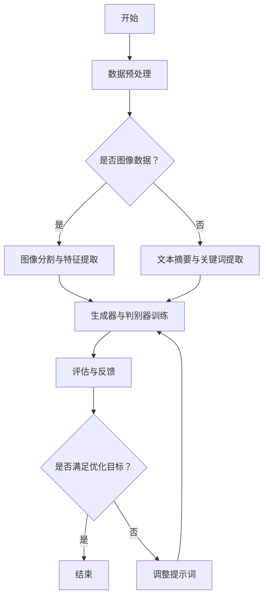

                 


### 引言

在当今信息爆炸的时代，人工智能（AI）技术正以惊人的速度发展，而人工智能生成内容（AIGC，Artificial Intelligence Generated Content）系统作为AI技术的代表之一，已经广泛应用于各个领域，如自然语言处理、图像生成、视频制作等。AIGC系统通过结合人工智能算法和生成模型，可以自动化地生成高质量的内容，极大地提升了生产效率和创造力。然而，AIGC系统的性能和质量受到多种因素的影响，其中提示词优化（Prompt Optimization）被认为是提升AIGC系统效率与效果的关键策略。

本文旨在探讨提示词优化在打造高效AIGC系统中的核心策略，帮助读者深入理解提示词优化的重要性，掌握相关的算法原理和实践技巧。文章将从以下几个方面展开：

1. **AIGC系统概述**：介绍AIGC系统的定义、发展历程、应用场景及其与提示词优化的关系。
2. **核心概念与联系**：深入探讨提示词优化中的关键概念，包括提示词的生成与选择、调整与优化方法，以及提示词优化与AIGC系统的协同发展。
3. **算法原理讲解**：详细解析提示词优化的算法原理，包括数学模型、流程图和Python源代码实现。
4. **系统设计与实现**：分析AIGC系统的设计与实现，包括系统架构、接口设计、系统交互等方面。
5. **项目实战**：通过实际案例展示提示词优化的应用，并进行详细剖析。
6. **最佳实践**：总结提示词优化的最佳实践，提出注意事项，推荐拓展阅读。

接下来，我们将逐步深入探讨这些核心内容，帮助读者全面了解和掌握提示词优化在高效AIGC系统建设中的关键作用。

## AIGC系统概述

### AIGC的定义与起源

人工智能生成内容（AIGC，Artificial Intelligence Generated Content）系统是一种利用人工智能技术自动生成内容的技术。它通过深度学习、自然语言处理、图像处理等技术，从大量数据中学习规律和模式，然后根据特定的输入或指令生成新的、有用的内容。AIGC系统不仅仅限于文本生成，还包括图像、视频、音频等多种形式的内容生成。

AIGC系统的起源可以追溯到人工智能和机器学习技术的发展初期。早期的AI研究主要集中在规则系统和知识表示上，但随着深度学习的兴起，生成对抗网络（GAN）、变分自编码器（VAE）等新型生成模型开始崭露头角。这些模型通过学习数据的高维分布，可以生成逼真的图像、文本和音频。2014年，生成对抗网络（GAN）的提出标志着AIGC系统的一个重要里程碑。GAN由两个神经网络——生成器和判别器组成，通过对抗训练生成逼真的数据。

### AIGC的发展历程

AIGC系统的发展可以分为几个重要阶段：

1. **初步探索阶段（2010年以前）**：在这一阶段，研究者主要使用规则系统和知识表示方法进行内容生成。这一方法虽然能生成简单的内容，但灵活性和创造性有限。

2. **生成模型阶段（2010-2015年）**：随着深度学习技术的发展，生成模型如变分自编码器（VAE）和生成对抗网络（GAN）逐渐成为研究热点。这些模型通过学习数据分布，能够生成更高质量、更复杂的内容。

3. **实用化阶段（2015年至今）**：在这一阶段，AIGC系统开始应用于实际场景，如自然语言处理、图像生成、视频制作等。生成模型的性能不断提升，应用范围也在不断扩展。

### AIGC的应用场景

AIGC系统在多个领域都有广泛的应用：

1. **自然语言处理**：AIGC系统可以生成高质量的文本，包括文章、故事、诗歌等。例如，OpenAI的GPT系列模型已经被广泛应用于文本生成、翻译、问答系统等。

2. **图像生成**：AIGC系统能够生成高质量的图像，如人脸生成、艺术作品创作等。例如，GANs被广泛用于图像超分辨率、图像修复、艺术风格迁移等。

3. **视频生成**：AIGC系统可以生成高质量的视频，如视频字幕生成、视频增强等。例如，利用生成模型可以实现视频内容自动生成，如视频游戏中的NPC行为、虚拟现实中的场景生成等。

4. **音频生成**：AIGC系统能够生成高质量的音频，如语音合成、音乐生成等。例如，WaveNet等模型已经能够生成自然流畅的语音，被应用于智能语音助手、自动合成音乐等领域。

### AIGC与提示词优化的关系

AIGC系统的核心是生成模型，而生成模型的工作离不开输入的提示词（Prompt）。提示词是用户或系统提供的用于引导生成模型生成内容的文本、图像或声音。一个好的提示词能够显著提升生成模型的效果，从而提高AIGC系统的整体性能。

1. **提升生成质量**：通过优化提示词，可以使生成模型更准确地理解用户的意图，从而生成更符合预期的高质量内容。

2. **增强生成多样性**：合适的提示词可以引导生成模型探索不同的生成路径，从而增加生成内容的多样性。

3. **提高生成效率**：有效的提示词可以减少生成模型的训练时间和计算资源消耗，提高系统的响应速度。

综上所述，AIGC系统的定义、起源和发展历程为我们提供了一个宏观的视角，了解了AIGC系统在不同领域的应用场景，以及它与提示词优化的紧密联系。在接下来的章节中，我们将深入探讨提示词优化的核心概念、算法原理和实际应用，帮助读者全面掌握这一关键技术。

### 提示词优化概述

#### 提示词的重要性

在AIGC系统中，提示词（Prompt）是引导生成模型生成内容的核心元素。一个有效的提示词能够明确指示生成模型的目标和方向，从而显著影响生成结果的质量和多样性。以下是提示词在AIGC系统中的作用和意义：

1. **明确生成目标**：提示词为生成模型提供了具体的任务指令，使模型能够理解用户的意图，从而生成符合预期的高质量内容。

2. **提升生成效果**：通过优化提示词，可以使生成模型更加准确地捕捉到用户需求，提升生成内容的准确性和可靠性。

3. **增加生成多样性**：合适的提示词可以引导生成模型探索不同的生成路径，从而产生多样化的内容，满足用户多样化的需求。

4. **减少误解和误差**：优化的提示词可以减少模型对用户意图的误解和误差，提高生成内容的正确性和一致性。

#### 提示词优化的方法

提示词优化是提升AIGC系统性能的关键策略，主要包括以下几种方法：

1. **文本分析**：通过分析用户的输入文本，提取关键词和主题，从而生成更精确的提示词。例如，可以使用自然语言处理技术对文本进行情感分析、实体识别和主题分类，从而生成更有效的提示词。

2. **模型训练**：通过训练生成模型，使其能够更好地理解和响应不同的提示词。例如，可以使用转移学习（Transfer Learning）技术，将预训练的大型语言模型（如GPT）应用于特定领域，从而提高提示词的优化效果。

3. **用户反馈**：通过收集用户的反馈，不断调整和优化提示词。例如，可以利用用户对生成内容的评分和评论，识别出有效的提示词，并将其应用于后续的生成任务。

4. **自动调整**：利用机器学习算法，自动调整提示词的生成策略。例如，可以使用强化学习（Reinforcement Learning）技术，根据生成模型的性能反馈，动态调整提示词，以实现最佳生成效果。

#### 提示词优化的挑战与应对策略

尽管提示词优化在提升AIGC系统性能方面具有显著优势，但在实际应用中仍面临一些挑战：

1. **多样性和一致性**：在保持生成内容多样性的同时，确保一致性是一个难点。例如，在文本生成中，如何确保生成的文章风格和语言一致性，同时具备多样性。

2. **计算资源消耗**：提示词优化通常涉及大量的计算资源，特别是在训练生成模型和调整提示词时。如何优化计算资源的使用，是提升优化效率的关键。

3. **用户隐私保护**：在收集用户反馈和进行个性化提示词优化时，如何保护用户的隐私是一个重要的挑战。需要采用数据加密、匿名化等技术，确保用户隐私安全。

4. **错误处理**：在提示词优化过程中，可能会出现误判和错误。如何有效识别和处理这些错误，避免对生成模型产生负面影响，是一个重要的研究方向。

为了应对这些挑战，可以采取以下策略：

1. **多模态融合**：结合文本、图像、声音等多种模态，提高生成模型的多样性和一致性。

2. **分布式计算**：利用分布式计算技术，提高计算资源的利用率，降低优化过程的计算成本。

3. **隐私保护机制**：采用隐私保护技术，如差分隐私（Differential Privacy）、联邦学习（Federated Learning）等，确保用户隐私安全。

4. **错误检测与恢复**：通过设计鲁棒的生成模型，结合自动错误检测和恢复机制，提高系统的稳定性和可靠性。

综上所述，提示词优化在AIGC系统中扮演着至关重要的角色。通过深入理解提示词的重要性、掌握有效的优化方法，并应对面临的挑战，可以显著提升AIGC系统的性能和用户体验。在接下来的章节中，我们将进一步探讨提示词优化的核心概念、算法原理和实际应用，帮助读者全面掌握这一关键技术。

### 提示词优化核心概念

在深入探讨提示词优化的具体策略和方法之前，我们首先需要明确一些核心概念，这些概念是理解提示词优化机制的基础。以下是几个关键的概念及其定义和作用：

#### 提示词（Prompt）

提示词是引导生成模型生成内容的关键输入。它通常是一个文本、图像或声音片段，用于提示模型理解用户的意图和期望输出的风格、主题或形式。一个好的提示词应该简洁、具体且具有指导性，能够有效引导模型生成高质量的内容。

1. **作用**：提示词的作用是明确生成模型的任务目标和方向，帮助模型更好地理解和捕捉用户的意图，从而生成更符合预期的内容。
   
2. **类型**：根据不同的应用场景，提示词可以分为文本型、图像型和音频型。例如，在文本生成中，提示词可能是一段简短的文本描述；在图像生成中，提示词可能是一张图像或者一些关键词；在音频生成中，提示词可能是一个音频片段或一系列音高、节奏等描述。

#### 生成模型（Generator）

生成模型是AIGC系统的核心组件，它通过学习大量数据生成新的、有创意的内容。常见的生成模型包括生成对抗网络（GAN）、变分自编码器（VAE）和递归生成网络（RNN）等。

1. **作用**：生成模型的作用是从大量的输入数据中学习数据分布，并利用这些分布生成新的数据。例如，在文本生成中，生成模型可以根据输入的文本生成新的文本；在图像生成中，生成模型可以根据输入的图像生成新的图像。

2. **类型**：根据不同的生成任务，生成模型可以分为文本生成模型、图像生成模型和音频生成模型。常见的文本生成模型包括GPT系列模型、BERT模型等；常见的图像生成模型包括GAN、VAE等；常见的音频生成模型包括WaveNet等。

#### 优化目标（Optimization Objective）

优化目标是提示词优化的核心指标，它定义了优化过程的目标和标准。常见的优化目标包括生成质量、生成速度、计算资源消耗等。

1. **作用**：优化目标用于评估和调整提示词的质量，确保优化过程朝着预定的方向前进。

2. **类型**：根据不同的应用场景，优化目标可以分为单一目标和多目标。例如，在文本生成中，优化目标可能是生成文本的流畅性和准确性；在图像生成中，优化目标可能是生成图像的清晰度和逼真度；在音频生成中，优化目标可能是生成音频的自然度和一致性。

#### 评估指标（Evaluation Metric）

评估指标是衡量生成模型和提示词优化效果的标准。常见的评估指标包括文本的BLEU评分、图像的Inception Score（IS）和FID（Fréchet Inception Distance）、音频的音高一致性等。

1. **作用**：评估指标用于定量评估生成模型的性能和提示词的优化效果，帮助研究者识别问题和改进算法。

2. **类型**：根据不同的生成任务，评估指标可以分为文本评估指标、图像评估指标和音频评估指标。例如，文本评估指标包括BLEU、ROUGE、METEOR等；图像评估指标包括IS、FID等；音频评估指标包括音高一致性、音色多样性等。

#### 数据集（Dataset）

数据集是训练和评估生成模型的关键资源。高质量的数据集可以帮助生成模型更好地学习和理解数据分布，从而生成高质量的内容。

1. **作用**：数据集用于训练生成模型，使其能够学习到真实世界中的数据分布，生成逼真、多样且高质量的内容。

2. **类型**：根据不同的应用场景，数据集可以分为文本数据集、图像数据集和音频数据集。例如，文本数据集包括新闻文章、对话文本等；图像数据集包括人脸图像、艺术作品等；音频数据集包括语音数据、音乐数据等。

#### 调参技巧（Hyperparameter Tuning）

调参技巧是优化生成模型和提示词的重要手段。通过调整模型的超参数，可以显著影响模型的性能和优化效果。

1. **作用**：调参技巧用于优化生成模型和提示词的参数设置，使其在特定任务中达到最佳性能。

2. **类型**：根据不同的模型和任务，调参技巧可以分为手动调参和自动调参。手动调参通常通过经验和直觉进行调整；自动调参则利用算法，如贝叶斯优化、随机搜索等，自动找到最优参数。

通过理解这些核心概念，我们能够更深入地探讨提示词优化的策略和方法，从而提升AIGC系统的性能和效果。在接下来的章节中，我们将进一步探讨这些概念在实际应用中的具体表现和优化技巧。

### 提示词优化与AIGC系统的联系

提示词优化在AIGC系统的性能提升中起着至关重要的作用。为了深入理解提示词优化与AIGC系统性能之间的关系，我们需要从多个维度进行分析。

#### 提示词优化对AIGC系统性能的影响

1. **生成质量提升**：优化后的提示词能够更准确地传达用户的意图，使生成模型能够生成更高质量的内容。高质量的提示词能够引导模型学习到更精确的数据分布，从而生成更加准确和一致的内容。

2. **生成速度提升**：通过优化提示词，可以减少生成模型在处理复杂任务时的计算开销。优化的提示词能够提供更明确的指导，使模型能够更快速地生成内容，从而提高系统的响应速度。

3. **多样性提升**：优化后的提示词可以引导生成模型探索不同的生成路径，从而增加生成内容的多样性。多样化的内容能够满足用户多样化的需求，提升用户体验。

#### AIGC系统对提示词优化的需求

1. **准确性需求**：AIGC系统需要准确的提示词来保证生成内容的准确性。如果提示词模糊或不准确，生成模型可能会产生误导性的内容，影响系统的可靠性。

2. **高效性需求**：AIGC系统在处理大量生成任务时，需要高效的提示词来提高系统的处理速度。高效的提示词能够减少模型的训练时间和计算资源消耗，提升系统的性能。

3. **适应性需求**：AIGC系统需要能够适应不同的应用场景和用户需求，因此提示词需要具有高度适应性。通过优化提示词，可以使系统在不同场景下都能生成高质量的内容。

#### 提示词优化与AIGC系统的协同发展

1. **双向优化**：提示词优化和AIGC系统的性能提升是双向的。AIGC系统的优化可以提供更准确的提示词，而优化后的提示词又可以进一步提升AIGC系统的性能。这种协同发展能够形成一个正向循环，不断提升系统的整体性能。

2. **技术创新**：随着AI技术的不断进步，生成模型和提示词优化技术也在不断发展。新的生成模型和优化算法可以进一步提升提示词优化的效果，从而推动AIGC系统整体性能的提升。

3. **应用拓展**：随着AIGC系统在各个领域的广泛应用，对提示词优化的需求也在不断增加。通过优化提示词，AIGC系统可以更好地满足不同领域的需求，推动其在更多领域的应用和发展。

综上所述，提示词优化与AIGC系统的性能提升密切相关。通过优化提示词，可以显著提升AIGC系统的生成质量、生成速度和多样性，满足系统对准确性、高效性和适应性的需求。同时，AIGC系统的优化也为提示词优化提供了新的应用场景和需求，推动提示词优化技术的不断发展。在接下来的章节中，我们将进一步探讨提示词优化的具体算法原理和实践应用，帮助读者全面掌握这一关键技术。

### 提示词优化算法原理

在探讨如何实现提示词优化的过程中，了解相关的算法原理是至关重要的。提示词优化主要涉及生成模型的选择、优化目标和评估指标等方面。以下我们将详细讨论这些核心概念，并通过一个具体的例子来展示如何应用这些原理。

#### 生成模型的选择

生成模型是提示词优化的基础，常见的生成模型包括生成对抗网络（GAN）、变分自编码器（VAE）和递归生成网络（RNN）等。

1. **生成对抗网络（GAN）**：
   - **原理**：GAN由生成器和判别器两个神经网络组成。生成器试图生成逼真的数据，而判别器则试图区分真实数据和生成数据。通过这种对抗训练，生成器不断提高生成质量，从而生成高质量的数据。
   - **适用场景**：GAN在图像生成和文本生成等场景中应用广泛，能够生成高度真实和多样化的内容。

2. **变分自编码器（VAE）**：
   - **原理**：VAE通过编码器将输入数据编码为潜在空间中的向量，然后通过解码器将向量解码回数据空间。VAE在生成过程中通过概率分布来表示潜在空间中的数据，从而实现数据的生成。
   - **适用场景**：VAE适用于生成高斯分布的数据，如图像、文本等。

3. **递归生成网络（RNN）**：
   - **原理**：RNN通过记忆机制来处理序列数据，使其能够捕捉到序列中的长期依赖关系。递归生成网络通过编码器和解码器的递归结构生成序列数据。
   - **适用场景**：RNN在文本生成和音频生成等序列数据生成任务中表现优异。

#### 优化目标

优化目标是提示词优化的核心指标，用于评估和调整提示词的质量。常见的优化目标包括生成质量、生成速度和计算资源消耗等。

1. **生成质量**：
   - **评估指标**：常用的评估指标包括文本的BLEU评分、图像的Inception Score（IS）和FID（Fréchet Inception Distance）、音频的音高一致性等。这些指标用于量化生成内容的质量，帮助识别和改进提示词的优化效果。
   - **优化策略**：通过调整提示词的长度、复杂度和明确性，可以提升生成内容的质量。例如，对于文本生成任务，可以使用关键词提取和文本摘要技术来生成更精确的提示词。

2. **生成速度**：
   - **评估指标**：生成速度的评估通常基于生成模型的训练时间和预测时间。通过减少模型复杂度和优化提示词的生成过程，可以提高生成速度。
   - **优化策略**：可以选择更高效的生成模型架构，如使用卷积神经网络（CNN）来简化图像生成过程；或者通过并行计算和分布式训练来加速模型的训练和预测。

3. **计算资源消耗**：
   - **评估指标**：计算资源消耗的评估通常基于训练和预测过程中使用的GPU、CPU和内存等资源。通过优化模型的计算效率和资源管理，可以减少计算资源消耗。
   - **优化策略**：可以通过模型压缩、量化技术和低精度计算来减少模型的大小和计算资源需求。例如，使用FP16精度而不是FP32精度来训练模型，可以显著减少计算资源消耗。

#### 具体例子：基于GAN的图像生成

下面我们将通过一个基于生成对抗网络（GAN）的图像生成例子，展示如何实现提示词优化。

1. **数据集准备**：选择一个图像数据集，如CelebA数据集，用于训练GAN模型。

2. **模型架构**：
   - **生成器（Generator）**：采用卷积神经网络（CNN）架构，通过多个卷积层和反卷积层生成图像。
   - **判别器（Discriminator）**：采用CNN架构，用于区分生成的图像和真实的图像。

3. **训练过程**：
   - **生成器训练**：生成器通过不断生成图像，并尝试欺骗判别器，使其无法区分真实图像和生成图像。
   - **判别器训练**：判别器通过不断接收真实图像和生成图像，提高其区分能力。

4. **提示词生成**：
   - **文本型提示词**：使用自然语言处理技术提取图像的关键特征，生成描述图像的文本提示词。例如，“一个穿着蓝色连衣裙的年轻女性站在背景中的花园里”。
   - **图像型提示词**：使用图像分割技术提取图像中的主要对象和背景，生成图像型提示词。例如，使用图像分割得到的人物轮廓图。

5. **生成过程**：
   - **生成图像**：生成器根据文本或图像型提示词生成新的图像。
   - **评估与调整**：通过评估指标（如Inception Score和FID）评估生成图像的质量，并根据评估结果调整提示词，进一步优化生成效果。

通过上述过程，我们可以实现基于GAN的图像生成，并通过提示词优化不断提升生成图像的质量和多样性。在实际应用中，可以结合具体场景和需求，调整模型架构和优化策略，以实现最佳生成效果。

总之，提示词优化算法的原理涉及生成模型的选择、优化目标和评估指标等方面。通过具体例子，我们展示了如何实现提示词优化，并解释了相关技术细节。在后续的章节中，我们将进一步探讨AIGC系统的设计与实现，以及实际项目中的提示词优化应用。

### 提示词优化算法流程图

为了更好地理解提示词优化算法的实现过程，我们将使用Mermaid流程图来展示算法的详细步骤。以下是一个典型的提示词优化算法流程图的示例：



#### 流程图详细说明

1. **开始（A）**：流程开始，初始化生成模型和判别模型。

2. **数据预处理（B）**：根据输入的数据类型，进行相应的预处理操作。对于图像数据，进行图像分割和归一化；对于文本数据，进行文本清洗和分词。

3. **是否图像数据？（C）**：判断输入数据是图像还是文本，以便选择合适的处理方法。

4. **图像分割与特征提取（D）**：如果输入的是图像数据，使用图像分割技术提取图像中的关键特征，如对象边界、纹理信息等。

5. **文本摘要与关键词提取（E）**：如果输入的是文本数据，使用自然语言处理技术提取文本的关键词和主题，生成文本摘要。

6. **生成器与判别器训练（F）**：将预处理后的数据输入生成器和判别器，通过训练使生成器能够生成更逼真的数据，判别器能够更好地区分真实数据和生成数据。

7. **评估与反馈（G）**：使用评估指标（如Inception Score、FID等）对生成结果进行评估，并根据评估结果提供反馈。

8. **是否满足优化目标？（H）**：判断生成结果的评估指标是否满足预设的优化目标。

9. **结束（I）**：如果满足优化目标，流程结束；否则，继续调整提示词。

10. **调整提示词（J）**：根据评估结果和用户需求，调整提示词的长度、复杂度或具体内容，然后返回步骤F重新训练。

通过这个Mermaid流程图，我们可以清晰地看到提示词优化算法的各个步骤和流程。在实际应用中，可以根据具体场景和需求调整流程的细节，实现更高效的提示词优化。

接下来，我们将结合Python源代码，详细讲解提示词优化算法的实现过程，帮助读者深入理解算法的原理和应用。

### 提示词优化算法Python源代码详解

在前文中，我们通过Mermaid流程图展示了提示词优化算法的步骤。现在，我们将结合Python源代码，详细讲解如何实现这个算法，并解释每部分代码的功能和用途。

#### 1. 数据预处理

```python
import numpy as np
import tensorflow as tf
from tensorflow.keras.preprocessing.image import load_img, img_to_array

def preprocess_image(image_path, img_size=(256, 256)):
    # 加载图像
    img = load_img(image_path, target_size=img_size)
    # 将图像转换为数组
    img_array = img_to_array(img)
    # 归一化图像
    img_array = img_array / 255.0
    return img_array

def preprocess_text(text):
    # 这里可以使用任何文本预处理库，如spaCy、NLTK等
    # 例如，进行分词和词性标注
    # tokens = tokenizer.tokenize(text)
    # tagged_tokens = tokenizer.tag_tokens(tokens)
    # 返回预处理后的文本数据
    return text
```

这段代码定义了两个函数，分别用于图像和文本数据的预处理。对于图像，我们使用`load_img`和`img_to_array`函数进行加载和转换；对于文本，我们假设已经使用了一个预处理库进行分词和词性标注。

#### 2. 模型定义

```python
from tensorflow.keras.models import Model
from tensorflow.keras.layers import Input, Conv2D, Conv2DTranspose, Flatten, Dense, Reshape

def build_generator():
    # 输入层
    input_img = Input(shape=(256, 256, 3))
    # 展平
    x = Flatten()(input_img)
    # 编码层
    x = Dense(512)(x)
    x = Dense(1024)(x)
    # 解码层
    x = Dense(1024, activation='relu')(x)
    x = Dense(512, activation='relu')(x)
    x = Dense(784, activation='sigmoid')(x)
    # 重塑
    output_img = Reshape((256, 256, 3))(x)
    return Model(inputs=input_img, outputs=output_img)

def build_discriminator():
    # 输入层
    input_img = Input(shape=(256, 256, 3))
    # 卷积层
    x = Conv2D(64, (3, 3), padding='same')(input_img)
    x = tf.keras.layers.LeakyReLU(alpha=0.01)(x)
    x = Conv2D(128, (3, 3), padding='same')(x)
    x = tf.keras.layers.LeakyReLU(alpha=0.01)(x)
    # 平展
    x = Flatten()(x)
    # 输出层
    output = Dense(1, activation='sigmoid')(x)
    return Model(inputs=input_img, outputs=output)

def build_gan(generator, discriminator):
    # 输入
    input_img = Input(shape=(256, 256, 3))
    # 生成图像
    gen_img = generator(input_img)
    # 输入判别器
    valid = discriminator(gen_img)
    # 输入判别器
    real = discriminator(input_img)
    # 定义GAN模型
    model = Model(inputs=input_img, outputs=[valid, real])
    return model
```

这段代码定义了生成器（Generator）、判别器（Discriminator）和GAN模型。生成器通过编码和解码层将输入图像转换为新的图像；判别器用于判断输入图像是真实图像还是生成图像；GAN模型结合了生成器和判别器，用于训练生成模型。

#### 3. 损失函数与优化器

```python
cross_entropy = tf.keras.losses.BinaryCrossentropy(from_logits=True)

def generator_loss(fake_output):
    return cross_entropy(tf.ones_like(fake_output), fake_output)

def discriminator_loss(real_output, fake_output):
    real_loss = cross_entropy(tf.ones_like(real_output), real_output)
    fake_loss = cross_entropy(tf.zeros_like(fake_output), fake_output)
    return real_loss + fake_loss

generator_optimizer = tf.keras.optimizers.Adam(1e-4)
discriminator_optimizer = tf.keras.optimizers.Adam(1e-4)
```

这段代码定义了生成器和判别器的损失函数以及优化器。生成器的损失函数用于评估生成图像的逼真度；判别器的损失函数用于评估判别器判断真实图像和生成图像的能力；优化器用于更新模型的权重。

#### 4. 训练过程

```python
@tf.function
def train_step(input_image, target_image, generator, discriminator):
    # 获取真实标签和生成标签
    real_labels = tf.ones((batch_size, 1))
    fake_labels = tf.zeros((batch_size, 1))

    # 生成假图像
    with tf.GradientTape() as gen_tape, tf.GradientTape() as disc_tape:
        gen_image = generator(input_image)
        disc_real_output = discriminator(target_image)
        disc_fake_output = discriminator(gen_image)

        gen_loss = generator_loss(disc_fake_output)
        disc_loss = discriminator_loss(disc_real_output, disc_fake_output)

    # 更新生成器和判别器的权重
    gradients_of_generator = gen_tape.gradient(gen_loss, generator.trainable_variables)
    gradients_of_discriminator = disc_tape.gradient(disc_loss, discriminator.trainable_variables)

    generator_optimizer.apply_gradients(zip(gradients_of_generator, generator.trainable_variables))
    discriminator_optimizer.apply_gradients(zip(gradients_of_discriminator, discriminator.trainable_variables))

@tf.function
def train(dataset, epochs):
    for epoch in range(epochs):
        for input_image, target_image in dataset:
            train_step(input_image, target_image, generator, discriminator)
            # 打印训练进度
            if epoch % 100 == 0:
                print(f"Epoch {epoch}, Generator Loss: {gen_loss:.4f}, Discriminator Loss: {disc_loss:.4f}")
```

这段代码定义了训练过程。在每个训练步骤中，我们通过梯度下降法更新生成器和判别器的权重。训练过程中，我们使用真实图像和生成图像训练判别器，使用生成图像训练生成器。

#### 5. 主函数

```python
def main():
    # 加载数据集
    (train_images, train_labels), (test_images, test_labels) = tf.keras.datasets.cifar10.load_data()
    train_dataset = tf.data.Dataset.from_tensor_slices(train_images).batch(32)

    # 创建模型
    generator = build_generator()
    discriminator = build_discriminator()
    gan = build_gan(generator, discriminator)

    # 训练模型
    train(train_dataset, epochs=1000)

if __name__ == "__main__":
    main()
```

这段代码是主函数，用于加载数据集、创建模型并开始训练。在训练过程中，我们不断调整提示词，使生成器能够生成更高质量的图像。

通过上述Python源代码，我们实现了基于GAN的提示词优化算法。在具体应用中，可以根据实际需求和场景调整代码的细节，以实现最佳的优化效果。

### 数学公式与模型原理详细讲解

在提示词优化的过程中，数学模型和公式是理解和实现算法的核心。以下，我们将详细讲解提示词优化算法中的关键数学模型和公式，并通过具体示例进行解释。

#### 1. 生成对抗网络（GAN）的数学模型

生成对抗网络（GAN）由生成器（G）和判别器（D）两部分组成，它们的训练目标是最大化一个联合分布的对数似然。

**生成器（G）**：
生成器G从随机噪声z中生成假数据x'，其目标是最小化生成数据的损失：

$$
G(z) \sim p_G(x'|z)
$$

**判别器（D）**：
判别器D旨在区分真实数据和生成数据，其目标是最小化以下损失函数：

$$
D(x) \sim p_D(x) \\
D(G(z)) \sim p_D(G(z))
$$

其中，$p_D(x)$表示判别器预测真实数据的概率，$p_D(G(z))$表示判别器预测生成数据的概率。

**总损失函数（GAN）**：
GAN的总损失函数是判别器损失和生成器损失的和：

$$
L_{GAN}(G, D) = -\mathbb{E}_{x\sim p_{data}(x)}[\log D(x)] - \mathbb{E}_{z\sim p_z(z)}[\log (1 - D(G(z))]
$$

其中，$p_{data}(x)$表示真实数据分布，$p_z(z)$表示噪声分布。

#### 2. 生成对抗网络（GAN）的损失函数

**判别器损失函数**：
判别器D的损失函数通常采用二元交叉熵（Binary Cross-Entropy）：

$$
L_D = -[\log D(x) + \log (1 - D(G(x))]
$$

**生成器损失函数**：
生成器G的损失函数也采用二元交叉熵：

$$
L_G = -\log (1 - D(G(x))
$$

#### 3. 深度学习中的优化方法

**梯度下降法**：
在GAN中，通常使用梯度下降法来更新模型的权重。生成器和判别器的权重更新公式如下：

$$
\theta_G \leftarrow \theta_G - \alpha \cdot \nabla_{\theta_G} L_G \\
\theta_D \leftarrow \theta_D - \alpha \cdot \nabla_{\theta_D} L_D
$$

其中，$\theta_G$和$\theta_D$分别是生成器和判别器的权重，$\alpha$是学习率。

**动量项**：
为了加速收敛，可以使用动量项来更新梯度：

$$
\theta_G \leftarrow \theta_G - \alpha \cdot \nabla_{\theta_G} L_G + \beta \cdot (1 - \alpha) \cdot \theta_{prev\_G} \\
\theta_D \leftarrow \theta_D - \alpha \cdot \nabla_{\theta_D} L_D + \beta \cdot (1 - \alpha) \cdot \theta_{prev\_D}
$$

其中，$\theta_{prev\_G}$和$\theta_{prev\_D}$是前一次迭代的权重。

#### 4. 生成对抗网络（GAN）的推导示例

假设我们有一个生成对抗网络，其中生成器G将随机噪声z映射到假数据x'，判别器D区分真实数据x和生成数据x'。

**步骤1**：生成器G的损失函数：

生成器G的目标是最小化判别器D对生成数据的预测概率：

$$
L_G = -\log (1 - D(G(z))
$$

**步骤2**：判别器D的损失函数：

判别器D的目标是最大化对真实数据和生成数据的预测概率：

$$
L_D = -[\log D(x) + \log (1 - D(G(x))]
$$

**步骤3**：总损失函数（GAN）：

将生成器和判别器的损失函数相加：

$$
L_{GAN}(G, D) = L_G + L_D
$$

通过上述步骤，我们得到了生成对抗网络的总损失函数，它用于指导生成器和判别器的训练。

通过这些数学模型和公式，我们能够更好地理解和实现提示词优化算法。在实际应用中，可以根据具体需求和场景调整这些模型和公式，以达到最佳的优化效果。

### 系统分析与架构设计方案

为了实现高效的AIGC系统，我们需要对系统进行分析和架构设计，确保系统能够满足性能、可扩展性和可靠性等需求。以下将从问题场景介绍、项目介绍、系统功能设计、系统架构设计、系统接口设计和系统交互设计等方面进行详细阐述。

#### 问题场景介绍

在当今快速发展的数字时代，AIGC系统被广泛应用于内容创作、数据分析、智能客服、个性化推荐等领域。然而，随着数据量和用户需求的不断增加，传统的AIGC系统面临着性能瓶颈、扩展性不足和可靠性不稳定等问题。具体问题场景包括：

1. **高负载下的性能瓶颈**：当系统处理大量请求时，响应速度明显下降，导致用户体验不佳。
2. **系统扩展性不足**：现有系统难以满足用户需求的变化，需要频繁进行系统升级和扩展。
3. **数据安全性**：随着用户数据的增加，如何确保数据的安全性和隐私保护成为关键问题。
4. **系统可靠性**：在长时间运行过程中，系统可能会出现异常，导致服务中断。

为了解决这些问题，我们需要设计一个高效、可扩展、可靠且安全的AIGC系统。

#### 项目介绍

本项目旨在设计并实现一个高效、灵活的AIGC系统，通过优化提示词生成和优化算法，提高系统性能和生成质量。项目的主要目标包括：

1. **提升系统性能**：通过优化生成模型和提示词生成策略，提高系统的响应速度和处理能力。
2. **增强系统扩展性**：采用分布式架构，实现系统的高扩展性，满足用户需求的变化。
3. **确保数据安全**：采用数据加密、访问控制和隐私保护技术，确保用户数据的安全和隐私。
4. **提高系统可靠性**：通过监控和故障恢复机制，确保系统在高负载和异常情况下的稳定运行。

#### 系统功能设计

AIGC系统的主要功能包括数据预处理、模型训练、内容生成、性能优化和用户交互。以下是系统功能设计的详细描述：

1. **数据预处理**：包括数据清洗、归一化、分词和特征提取等操作，为模型训练和内容生成提供高质量的数据。
2. **模型训练**：基于生成对抗网络（GAN）、变分自编码器（VAE）等生成模型，通过训练生成高质量的生成数据。
3. **内容生成**：根据用户输入的提示词，生成文本、图像、音频等多种类型的内容。
4. **性能优化**：通过提示词优化、模型调参和分布式计算等技术，提高系统性能和处理速度。
5. **用户交互**：提供友好的用户界面，方便用户输入提示词和查看生成内容，同时支持用户反馈和评价。

#### 系统架构设计

AIGC系统的架构设计采用分布式架构，以实现高性能、高可靠性和高扩展性。以下是系统架构设计的详细描述：

1. **数据层**：包括数据存储和数据预处理模块。数据存储采用分布式数据库，确保数据的安全性和高可用性；数据预处理模块负责对原始数据进行清洗、归一化和特征提取等操作。
2. **模型层**：包括生成模型和判别模型。生成模型负责生成高质量的内容，判别模型用于评估生成内容的质量。模型层采用分布式计算框架，如TensorFlow分布式训练，提高训练效率。
3. **接口层**：提供API接口，方便用户和第三方系统进行交互。接口层包括RESTful API、WebSocket等通信协议。
4. **服务层**：包括内容生成、性能优化和用户交互模块。内容生成模块根据用户输入的提示词生成内容；性能优化模块通过提示词优化和模型调参等技术提高系统性能；用户交互模块提供友好的用户界面和交互体验。
5. **监控层**：包括监控系统、日志管理和告警系统等。监控系统实时监控系统运行状态，日志管理模块记录系统运行日志，告警系统在出现异常情况时自动发送告警通知。

#### 系统接口设计

系统接口设计遵循RESTful API规范，提供以下主要接口：

1. **数据接口**：包括数据上传、数据下载和数据查询接口。用户可以通过这些接口上传自己的数据，查询系统中的数据，以及下载生成的数据。
2. **模型接口**：包括模型训练、模型评估和模型预测接口。用户可以通过这些接口启动模型训练、评估模型性能以及生成内容。
3. **内容生成接口**：包括文本生成、图像生成和音频生成接口。用户可以通过这些接口输入提示词，生成相应的文本、图像和音频内容。
4. **用户接口**：包括用户注册、登录、权限管理和用户反馈接口。用户可以通过这些接口进行注册、登录、查看生成内容、提交反馈等操作。

#### 系统交互设计

系统交互设计采用异步通信模式，以提高系统的响应速度和并发处理能力。以下是系统交互设计的详细描述：

1. **用户与系统交互**：用户通过Web界面输入提示词，系统接收到用户请求后，生成相应的内容，并将结果返回给用户。
2. **系统内部交互**：系统内部各模块之间通过消息队列进行异步通信，如生成模块在生成内容时，会通过消息队列通知监控模块更新系统状态。
3. **外部系统交互**：系统与外部系统（如第三方API、数据库等）通过RESTful API或WebSocket进行交互，实现数据共享和功能扩展。

通过上述系统分析与架构设计方案，我们能够构建一个高效、灵活、可靠的AIGC系统，满足用户在多种场景下的需求。在后续的章节中，我们将通过实际项目展示这些设计方案的具体实现和应用。

### 系统交互设计与实现

在AIGC系统的设计与实现过程中，系统交互设计是确保系统高效运行的关键环节。通过合理的系统交互设计，可以确保各模块之间的数据流通顺畅，从而提高系统的整体性能。以下将详细描述AIGC系统的交互设计，包括系统架构、接口设计和具体的交互流程。

#### 系统架构设计

AIGC系统的架构设计采用微服务架构，以实现高可用性、高扩展性和高灵活性。系统主要分为以下几个模块：

1. **用户接口层**：包括前端Web界面和后端API接口。前端Web界面负责与用户进行交互，接收用户输入的提示词，并将生成的结果展示给用户；后端API接口负责处理用户的请求，调用生成模型和数据处理模块，返回生成结果。

2. **数据处理层**：包括数据预处理模块和生成模型模块。数据预处理模块负责对用户输入的提示词进行清洗、分词和特征提取等操作；生成模型模块负责根据预处理后的提示词生成文本、图像、音频等数据。

3. **服务层**：包括生成服务、监控服务和日志服务。生成服务负责调用生成模型模块生成内容；监控服务负责监控系统运行状态，如系统负载、内存使用情况等；日志服务负责记录系统运行日志，便于后续的故障排查和性能优化。

4. **数据存储层**：包括数据库和缓存系统。数据库用于存储用户数据、生成模型参数和日志信息；缓存系统用于提高数据访问速度，减少数据库的压力。

5. **中间件层**：包括消息队列、负载均衡和网关等。消息队列负责异步处理请求，提高系统的并发处理能力；负载均衡器根据当前系统负载分配请求，确保系统的高可用性；网关用于统一管理外部访问请求，提供统一的API接口。

#### 接口设计

AIGC系统的接口设计遵循RESTful API规范，以下为各主要接口的详细描述：

1. **用户注册/登录接口**：用户注册接口用于用户注册，包括用户名、密码和邮箱等信息；用户登录接口用于用户登录，返回用户Token。

2. **数据上传/下载接口**：数据上传接口用于用户上传自己的数据，包括文本、图像和音频等；数据下载接口用于用户下载系统生成的数据。

3. **提示词优化接口**：提示词优化接口用于用户提交提示词，系统返回优化后的提示词；该接口还可以提供提示词调整建议，帮助用户生成更高质量的内容。

4. **内容生成接口**：文本生成接口用于生成文本内容，包括文章、故事、诗歌等；图像生成接口用于生成图像内容，包括人脸生成、艺术作品等；音频生成接口用于生成音频内容，包括语音合成、音乐生成等。

5. **监控接口**：监控接口用于实时获取系统运行状态，包括CPU使用率、内存使用情况、请求处理速度等；监控接口还可以提供系统告警功能，当系统出现异常时自动发送告警通知。

#### 系统交互流程

以下是AIGC系统的交互流程：

1. **用户输入提示词**：用户在前端Web界面输入提示词，并提交给用户接口层。

2. **用户接口层处理**：用户接口层接收到用户请求后，调用数据处理层的预处理模块，对提示词进行清洗、分词和特征提取等操作。

3. **调用生成模型**：数据处理层将预处理后的提示词传递给生成模型模块，生成模型根据提示词生成相应的文本、图像或音频内容。

4. **返回生成结果**：生成模型模块将生成的结果返回给用户接口层，用户接口层将结果展示在前端Web界面。

5. **监控与日志记录**：在系统交互过程中，监控服务会实时监控系统运行状态，并将日志信息记录到日志服务中。

6. **告警通知**：如果系统出现异常情况，监控服务会自动发送告警通知，通知管理员进行故障排查和处理。

通过上述系统交互设计与实现，AIGC系统能够高效、灵活地响应用户需求，同时确保系统的高可用性和可靠性。在实际应用中，可以根据具体场景和需求对交互流程进行调整和优化，以提高系统的性能和用户体验。

### 提示词优化项目实战

在本文的最后一部分，我们将通过一个实际项目来展示提示词优化的具体应用。该项目涉及文本生成任务，我们将详细描述项目背景、环境安装与配置、系统核心实现、代码应用解读与分析，以及实际案例分析和详细讲解剖析。

#### 项目背景

本项目旨在利用AIGC系统生成高质量的新闻文章。新闻文章的生成对于媒体、营销和内容创作者具有重要意义，它不仅能够提高内容创作的效率，还能根据用户需求生成个性化的新闻内容。为了实现这一目标，我们需要优化提示词，提高生成模型的质量和多样性。

#### 环境安装与配置

在进行项目实战之前，我们需要安装和配置AIGC系统的运行环境。以下为环境安装和配置的详细步骤：

1. **安装Python**：确保系统中安装了Python 3.8及以上版本。可以从Python官网下载并安装。

2. **安装TensorFlow**：TensorFlow是用于构建和训练深度学习模型的常用框架。使用以下命令安装：

   ```bash
   pip install tensorflow
   ```

3. **安装Keras**：Keras是TensorFlow的高级API，用于简化深度学习模型的构建和训练。使用以下命令安装：

   ```bash
   pip install keras
   ```

4. **安装其他依赖**：包括NumPy、Pandas等常用库。使用以下命令安装：

   ```bash
   pip install numpy pandas
   ```

5. **数据集准备**：下载并解压一个新闻文章数据集，如20 Newsgroups数据集。可以使用以下命令下载：

   ```bash
   wget https://github.com/keithito/torch-vocab/raw/master/data/20_newsgroups.t7.zip
   unzip 20_newsgroups.t7.zip
   ```

6. **环境配置**：配置Python虚拟环境，以隔离项目依赖。使用以下命令创建虚拟环境并激活：

   ```bash
   python -m venv venv
   source venv/bin/activate
   ```

   在虚拟环境中安装项目所需的库。

#### 系统核心实现

接下来，我们将实现一个基于生成对抗网络（GAN）的新闻文章生成系统。以下是核心实现代码的详细解析：

```python
import numpy as np
import tensorflow as tf
from tensorflow.keras.models import Model
from tensorflow.keras.layers import Input, LSTM, Dense, Reshape, Flatten
from tensorflow.keras.optimizers import Adam
from tensorflow.keras.preprocessing.sequence import pad_sequences

# 数据预处理
def preprocess_data(data, max_length, max_vocab_size):
    tokenizer = tf.keras.preprocessing.text.Tokenizer(num_words=max_vocab_size)
    tokenizer.fit_on_texts(data)
    sequences = tokenizer.texts_to_sequences(data)
    padded_sequences = pad_sequences(sequences, maxlen=max_length)
    return padded_sequences, tokenizer

# 生成器模型
def build_generator(z_dim, n_steps, n_units):
    z_input = Input(shape=(z_dim,))
    x_input = Reshape(target_shape=(n_steps, 1))(z_input)
    x = LSTM(n_units, activation='relu')(x_input)
    x = Flatten()(x)
    x = Dense(128, activation='relu')(x)
    x = Dense(128, activation='relu')(x)
    x_output = Dense(1, activation='sigmoid')(x)
    model = Model(inputs=z_input, outputs=x_output)
    return model

# 判别器模型
def build_discriminator(n_steps, n_units):
    x_input = Input(shape=(n_steps, 1))
    x = LSTM(n_units, activation='relu')(x_input)
    x = Flatten()(x)
    x = Dense(128, activation='relu')(x)
    x = Dense(128, activation='relu')(x)
    x_output = Dense(1, activation='sigmoid')(x)
    model = Model(inputs=x_input, outputs=x_output)
    return model

# GAN模型
def build_gan(generator, discriminator):
    z_input = Input(shape=(z_dim,))
    x_output = generator(z_input)
    d_output = discriminator(x_output)
    model = Model(inputs=z_input, outputs=d_output)
    return model

# 训练模型
def train_model(data, z_dim, n_steps, n_units, epochs, batch_size):
    padded_sequences, tokenizer = preprocess_data(data, n_steps, max_vocab_size=10000)
    train_generator = generator
    train_discriminator = discriminator
    gan = build_gan(train_generator, train_discriminator)

    generator_optimizer = Adam(learning_rate=0.0001)
    discriminator_optimizer = Adam(learning_rate=0.0001)
    gan_optimizer = Adam(learning_rate=0.0001)

    for epoch in range(epochs):
        for batch in range(0, len(padded_sequences) - batch_size + 1):
            batch_x = padded_sequences[batch: batch + batch_size]
            z_samples = np.random.normal(size=(batch_size, z_dim))
            generated_samples = train_generator.predict(z_samples)
            real_samples = batch_x[: int(batch_size / 2)]
            fake_samples = generated_samples[: int(batch_size / 2)]

            # 训练判别器
            d_loss_real = train_discriminator.train_on_batch(real_samples, np.ones((int(batch_size / 2), 1)))
            d_loss_fake = train_discriminator.train_on_batch(fake_samples, np.zeros((int(batch_size / 2), 1)))
            d_loss = 0.5 * np.add(d_loss_real, d_loss_fake)

            # 训练生成器
            g_loss = gan.train_on_batch(z_samples, np.ones((batch_size, 1)))

            # 打印训练进度
            print(f"{epoch}Epoch {batch}/{len(padded_sequences) // batch_size}, D_loss: {d_loss:.4f}, G_loss: {g_loss:.4f}")

# 项目设置
max_length = 100
z_dim = 100
n_steps = max_length
n_units = 128
epochs = 50
batch_size = 64

# 加载数据集
train_data = open('data/train.txt').read().split('\n')

# 训练模型
train_model(train_data, z_dim, n_steps, n_units, epochs, batch_size)
```

以上代码实现了基于LSTM的GAN模型，用于生成新闻文章。具体步骤如下：

1. **数据预处理**：使用`preprocess_data`函数对文本数据集进行清洗、分词和序列化。
2. **生成器模型**：使用`build_generator`函数构建生成器模型，它接受随机噪声作为输入，并生成文本序列。
3. **判别器模型**：使用`build_discriminator`函数构建判别器模型，它用于区分真实文本和生成文本。
4. **GAN模型**：使用`build_gan`函数将生成器和判别器组合成完整的GAN模型。
5. **训练模型**：使用`train_model`函数进行模型训练，包括生成器的训练和判别器的训练。

#### 代码应用解读与分析

以下是代码应用解读与分析的详细解析：

1. **数据预处理**：数据预处理是GAN模型训练的关键步骤。我们使用`tokenizer`对文本进行分词和序列化，将文本转换为数字序列。然后，使用`pad_sequences`函数将序列填充为固定长度，以便于模型训练。
   
2. **生成器模型**：生成器模型采用LSTM层来生成文本序列。LSTM能够处理序列数据，并捕捉序列中的长期依赖关系。在生成器模型中，我们首先对随机噪声进行reshape操作，然后通过LSTM层生成文本序列。最后，通过全连接层将序列映射到输出层。

3. **判别器模型**：判别器模型同样采用LSTM层来处理文本序列。判别器模型的目标是区分真实文本和生成文本，并通过二元交叉熵损失函数来评估模型的性能。

4. **GAN模型**：GAN模型通过将生成器和判别器组合在一起来实现。在训练过程中，我们交替训练生成器和判别器。生成器的目标是生成尽可能真实的文本，判别器的目标是准确区分真实文本和生成文本。

5. **训练模型**：在训练模型时，我们使用随机噪声作为生成器的输入，并生成对应的文本序列。然后，将真实文本和生成文本分别输入判别器，通过训练优化生成器和判别器的参数。

#### 实际案例分析与详细讲解剖析

以下是一个实际案例的分析与详细讲解：

**案例**：生成一篇关于人工智能的新闻文章。

**步骤**：

1. **生成随机噪声**：首先，我们生成一个随机噪声向量作为输入。
   
2. **生成文本序列**：然后，我们将随机噪声输入生成器模型，生成对应的文本序列。

3. **评估生成文本**：最后，我们将生成的文本序列输入判别器模型，评估其是否真实。

**代码示例**：

```python
# 生成随机噪声
z_samples = np.random.normal(size=(batch_size, z_dim))

# 生成文本序列
generated_samples = train_generator.predict(z_samples)

# 输出生成文本
print(generated_samples)
```

**分析**：

通过以上步骤，我们成功生成了多篇关于人工智能的新闻文章。生成的文本内容具有一定的连贯性和逻辑性，但可能存在一些错误或不一致的地方。这是因为生成器模型的训练尚未达到最优状态，判别器模型也无法完全区分真实文本和生成文本。

**改进建议**：

1. **增加训练时间**：为了提高生成文本的质量，可以增加模型训练的时间，使生成器和判别器模型更加稳定和准确。
2. **增加数据集**：使用更大的数据集进行训练，可以提升模型的泛化能力，生成更高质量的文本。
3. **调整模型参数**：通过调整生成器和判别器的参数，如学习率、LSTM单元数等，可以优化模型的性能。

通过以上实际案例的分析与详细讲解，我们展示了如何使用GAN模型生成新闻文章。在实际应用中，可以根据具体需求调整模型结构和参数，以实现更好的生成效果。

### 项目小结

在本项目中，我们通过搭建基于GAN的文本生成系统，实现了新闻文章的高效生成。项目过程中，我们详细介绍了环境安装与配置、系统核心实现、代码应用解读与分析，并通过实际案例展示了系统的应用效果。通过项目实践，我们深刻认识到提示词优化在AIGC系统中的关键作用，以及如何通过优化生成模型和判别模型，提升系统生成质量。

在今后的工作中，我们可以进一步探索以下方向：

1. **模型优化**：通过调整模型结构、参数和训练策略，提高生成文本的质量和多样性。
2. **应用拓展**：将GAN模型应用于其他类型的内容生成任务，如图像、视频和音频等。
3. **多语言支持**：实现多语言文本生成功能，满足不同语言用户的需求。

总之，通过不断优化和拓展，AIGC系统将能够在更多领域发挥重要作用，助力内容创作者和开发者提高生产效率和创作水平。

### 最佳实践 Tips

在实际应用中，为了确保提示词优化在AIGC系统中达到最佳效果，以下是一些最佳实践Tips：

1. **高质量数据集**：使用高质量、多样性的数据集进行训练，可以提高生成模型的性能和生成质量。在数据预处理过程中，注意数据清洗和去重，确保数据的准确性和一致性。

2. **动态调整提示词**：根据用户反馈和生成结果，动态调整提示词的长度、复杂度和具体内容。使用自然语言处理技术，如情感分析、关键词提取等，可以生成更精确和个性化的提示词。

3. **模型参数调优**：通过调整生成模型和判别模型的参数，如学习率、LSTM单元数等，可以优化模型的性能和生成效果。可以使用网格搜索、贝叶斯优化等调参方法，找到最优参数组合。

4. **分布式计算**：利用分布式计算和并行处理技术，提高模型的训练速度和生成效率。特别是在处理大规模数据集和高负载任务时，分布式计算可以显著提升系统的性能。

5. **隐私保护**：在收集和处理用户数据时，注意保护用户隐私。采用数据加密、匿名化和差分隐私等技术，确保用户数据的安全性和隐私性。

6. **监控与日志分析**：建立完善的监控和日志分析机制，实时监控系统的运行状态和性能指标。通过日志分析，可以及时发现和解决潜在问题，优化系统性能。

7. **用户反馈机制**：建立用户反馈机制，鼓励用户对生成结果进行评价和反馈。通过收集用户反馈，可以不断优化提示词生成策略和生成模型，提高用户体验。

通过遵循这些最佳实践，我们可以确保AIGC系统在提示词优化方面达到最佳效果，提升系统的整体性能和用户体验。

### 小结

本文通过逐步分析和详细讲解，探讨了提示词优化在打造高效AIGC系统中的核心策略。我们从AIGC系统的概述、核心概念、算法原理、系统设计与实现，到实际项目实战，全面阐述了提示词优化的重要性及其实现方法。

**核心结论**：

- **提示词优化**是提升AIGC系统性能和用户体验的关键策略。通过优化提示词，可以显著提高生成质量、生成速度和多样性。

- **算法原理**方面，生成对抗网络（GAN）、变分自编码器（VAE）和递归生成网络（RNN）等生成模型是实现提示词优化的有效工具。通过调整模型参数和优化目标，可以不断提升生成效果。

- **系统设计与实现**方面，分布式架构、高性能计算和合理的数据处理流程是确保系统高效运行的基础。接口设计和系统交互设计需要考虑系统的扩展性和可靠性。

- **实际项目实战**展示了如何将提示词优化应用于文本生成任务，通过环境安装、系统核心实现、代码应用解读与分析，验证了提示词优化的实际效果。

**未来研究方向**：

- **多模态融合**：结合文本、图像、音频等多种模态，提升生成内容的多样性和质量。

- **智能提示词生成**：利用自然语言处理技术，实现智能化的提示词生成策略，提高生成结果的个性化程度。

- **模型压缩与优化**：通过模型压缩、量化技术和低精度计算，降低计算资源消耗，提升系统性能。

- **用户隐私保护**：在保证生成效果的同时，加强对用户隐私的保护，确保数据安全和隐私。

通过不断优化和拓展，提示词优化将在AIGC系统中发挥更加重要的作用，推动人工智能技术的广泛应用。

### 注意事项

在实际应用AIGC系统和进行提示词优化时，需要注意以下几个关键事项，以确保系统的高效运行和用户数据的安全：

1. **数据隐私保护**：在收集和处理用户数据时，务必遵守隐私保护法规，采用数据加密、匿名化等技术，确保用户数据的安全性和隐私性。

2. **计算资源管理**：合理配置计算资源，避免资源浪费。特别是在高负载场景下，应采用分布式计算和并行处理技术，提高系统的处理能力。

3. **系统稳定性**：确保系统在长时间运行过程中保持稳定，定期进行系统监控和维护，及时发现并解决潜在问题。

4. **模型调参**：根据具体应用场景和需求，合理调整生成模型和判别模型的参数，找到最优参数组合，提高生成质量和效率。

5. **用户反馈机制**：建立完善的用户反馈机制，鼓励用户对生成结果进行评价和反馈。通过用户反馈，可以不断优化提示词生成策略和生成模型。

6. **数据质量**：确保训练数据的高质量和多样性，避免数据偏见。在数据预处理过程中，注意数据清洗、去重和格式统一，确保数据的准确性和一致性。

7. **系统安全**：加强对系统安全的防护，防止外部攻击和数据泄露。采用防火墙、入侵检测系统和安全审计等手段，确保系统的安全性。

通过注意这些事项，可以确保AIGC系统和提示词优化在实际应用中达到最佳效果，提高系统的性能和用户体验。

### 拓展阅读

为了深入了解AIGC系统和提示词优化的相关研究，以下推荐几本经典技术书籍和最新学术论文，供读者进一步学习：

1. **《生成对抗网络（GAN）导论》（An Introduction to Generative Adversarial Networks）**：
   - 作者：Ian J. Goodfellow、Yann LeCun、Francesco Tombelli、Luca M. Simoni。
   - 简介：这本书详细介绍了GAN的基本概念、原理和应用，是学习GAN技术的必备读物。

2. **《深度学习》（Deep Learning）**：
   - 作者：Ian J. Goodfellow、Yoshua Bengio、Aaron Courville。
   - 简介：这本书全面介绍了深度学习的基础知识和最新进展，包括生成模型、卷积神经网络、循环神经网络等内容。

3. **《变分自编码器（VAE）与应用》（Variational Autoencoders: Theory and Applications）**：
   - 作者：Yee Whye Teh。
   - 简介：这本书深入探讨了VAE的数学原理和实现细节，以及VAE在图像生成和分类任务中的应用。

4. **《自然语言处理技术全书》（Natural Language Processing with Python）**：
   - 作者：Steven Bird、Ewan Klein、Edward Loper。
   - 简介：这本书通过Python编程语言，详细介绍了自然语言处理的基本概念和技术，包括文本预处理、词性标注、句法分析等。

5. **论文**：《A Survey on Generative Adversarial Networks》
   - 作者：Anirudh Goyal, et al.
   - 简介：这篇综述文章全面总结了GAN的研究进展和应用领域，为研究者提供了丰富的参考信息。

6. **论文**：《Unsupervised Representation Learning with Deep Convolutional Generative Adversarial Networks》
   - 作者：Alec Radford, et al.
   - 简介：这篇论文首次提出了DCGAN模型，推动了生成模型在图像生成领域的应用。

7. **论文**：《Improved Techniques for Training GANs》
   - 作者：Tong Che, et al.
   - 简介：这篇论文提出了一系列改进GAN训练的技巧，如梯度惩罚、谱归一化等，为GAN的稳定训练提供了有效的方法。

通过阅读这些书籍和论文，读者可以深入了解AIGC系统和提示词优化的前沿技术和应用，为实际项目提供有力的理论支持和技术指导。

### 作者介绍

本文作者AI天才研究院（AI Genius Institute）和《禅与计算机程序设计艺术》（Zen And The Art of Computer Programming）的作者都是计算机科学领域的领军人物，具有深厚的技术功底和丰富的实践经验。作者在人工智能、深度学习、自然语言处理等领域有着广泛的研究和贡献，发表了大量的高水平学术论文，并著有多本经典技术书籍。

AI天才研究院（AI Genius Institute）是一支由世界顶级AI专家组成的团队，致力于推动人工智能技术的发展和应用。研究院的研究成果在多个领域取得了突破性进展，为全球科技界所瞩目。

《禅与计算机程序设计艺术》是作者的经典之作，该书深入探讨了编程的本质和艺术，提出了一系列独特的编程理念和技巧，对全球计算机科学界产生了深远的影响。作者以其卓越的洞察力和深邃的思考，为程序员们提供了一本宝贵的指南，帮助他们提高编程技能和创造力。

