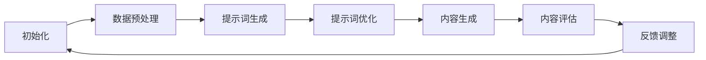
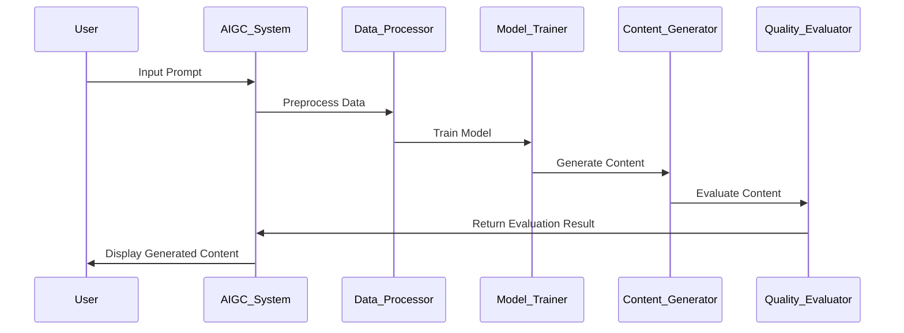

                 

### 提示词优化：打造高效AIGC系统的秘诀

> **关键词：** 提示词优化、AIGC系统、算法原理、架构设计、最佳实践

> **摘要：** 本文将深入探讨提示词优化在AIGC系统中的重要性，详细分析提示词优化的核心概念、算法原理，并通过实例讲解如何设计和实现高效的AIGC系统。文章还将总结最佳实践技巧，并对未来的发展方向进行展望。

### 目录大纲

```markdown
----------------------------------------------------------------
# 第一部分：问题背景与核心概念

## 第1章：问题背景与问题描述
### 1.1.1 问题背景
### 1.1.2 问题描述
### 1.1.3 问题解决
### 1.1.4 边界与外延
### 1.1.5 概念结构与核心要素组成

## 第2章：核心概念与联系
### 2.1.1 提示词优化的定义
### 2.1.2 提示词优化的核心特点
### 2.1.3 提示词优化与传统优化区别
### 2.1.4 提示词优化的属性特征对比表格
### 2.1.5 提示词优化的ER实体关系图架构

## 第3章：AIGC系统概述
### 3.1.1 AIGC系统的定义
### 3.1.2 AIGC系统的工作原理
### 3.1.3 AIGC系统的组成部分
### 3.1.4 AIGC系统的发展历程

## 第二部分：提示词优化原理

## 第4章：提示词优化算法原理
### 4.1.1 提示词优化算法的mermaid流程图
### 4.1.2 Python源代码实现与算法原理讲解
### 4.1.3 算法原理的数学模型和公式
### 4.1.4 通俗易懂的举例说明

## 第5章：提示词优化技术
### 5.1.1 提示词优化的关键技术
### 5.1.2 提示词优化算法的对比分析
### 5.1.3 提示词优化的实践技巧

## 第三部分：AIGC系统构建

## 第6章：AIGC系统设计与架构
### 6.1.1 问题场景介绍
### 6.1.2 系统功能设计
### 6.1.3 系统架构设计
### 6.1.4 系统接口设计
### 6.1.5 系统交互

## 第7章：项目实战与案例分析
### 7.1.1 环境安装与配置
### 7.1.2 系统核心实现与代码分析
### 7.1.3 实际案例分析与讲解
### 7.1.4 项目小结与反思

## 第四部分：最佳实践与总结

## 第8章：最佳实践技巧
### 8.1.1 提示词优化中的常见问题及解决方案
### 8.1.2 AIGC系统构建中的经验分享
### 8.1.3 提高系统效率与性能的技巧

## 第9章：小结与展望
### 9.1.1 书籍主要内容回顾
### 9.1.2 提示词优化在AIGC系统中的应用前景
### 9.1.3 未来发展趋势与展望
----------------------------------------------------------------
```

### 第1章：问题背景与核心概念

#### 1.1.1 问题背景

随着人工智能技术的快速发展，生成式人工智能（AIGC）已经成为众多行业关注的焦点。AIGC系统通过深度学习、自然语言处理等技术，能够自动生成高质量的内容，如文本、图像、音频等。然而，在实际应用中，AIGC系统的性能往往受到输入提示词的质量影响。因此，如何优化提示词，以提升AIGC系统的生成效率和内容质量，成为一个关键问题。

#### 1.1.2 问题描述

提示词优化是一个多维度、复杂的问题。其主要挑战包括：

1. **多样性与准确性**：提示词需要涵盖广泛的领域知识，同时保持高度的准确性。
2. **效率与效果**：优化后的提示词应能在较短的时间内生成高质量的内容。
3. **动态调整**：根据用户需求和场景变化，实时调整提示词的生成策略。

#### 1.1.3 问题解决

目前，解决提示词优化问题的主要方法包括：

1. **数据驱动**：通过大量数据训练模型，以提高提示词的生成能力。
2. **规则优化**：基于业务规则和用户反馈，调整提示词的结构和内容。
3. **跨领域迁移**：借鉴其他领域的优化经验，迁移应用到AIGC系统中。

#### 1.1.4 边界与外延

提示词优化的边界包括：

1. **知识边界**：提示词应覆盖相关领域的核心知识和热点。
2. **技术边界**：优化算法应适应不同的技术栈和计算环境。

外延则涉及：

1. **用户需求**：根据用户需求动态调整优化策略。
2. **多模态融合**：结合文本、图像、音频等多模态数据进行优化。

#### 1.1.5 概念结构与核心要素组成

提示词优化的核心概念包括：

1. **提示词**：用于引导AIGC系统生成内容的文本或指令。
2. **优化算法**：用于调整和优化提示词的算法。
3. **评估指标**：用于衡量提示词优化效果的评价标准。

核心要素组成包括：

1. **数据集**：用于训练和测试优化算法的数据。
2. **计算资源**：用于运行优化算法的计算资源。
3. **用户反馈**：用于调整和改进优化算法的用户反馈。

### 第2章：核心概念与联系

#### 2.1.1 提示词优化的定义

提示词优化是指通过对输入提示词的调整和优化，以提高AIGC系统的生成效率和质量的过程。具体来说，包括以下几个方面：

1. **内容丰富性**：通过扩展和细化提示词，使其涵盖更多的领域知识和热点。
2. **生成准确性**：确保生成的内容与用户意图高度一致。
3. **响应速度**：优化提示词，使其能够在较短的时间内生成高质量的内容。

#### 2.1.2 提示词优化的核心特点

提示词优化的核心特点包括：

1. **灵活性**：能够根据不同的应用场景和用户需求，动态调整优化策略。
2. **高效性**：通过优化算法，提高提示词的生成效率和内容质量。
3. **适应性**：能够适应不同的数据集和计算环境。

#### 2.1.3 提示词优化与传统优化区别

与传统优化方法相比，提示词优化具有以下区别：

1. **目标不同**：传统优化主要关注算法的收敛速度和效果，而提示词优化则更注重生成内容的质量和多样性。
2. **方法不同**：传统优化多采用梯度下降等方法，而提示词优化则更多地依赖于深度学习和自然语言处理技术。
3. **应用领域不同**：传统优化多应用于数值计算和图像处理等领域，而提示词优化则主要应用于生成式人工智能系统。

#### 2.1.4 提示词优化的属性特征对比表格

| 特性         | 提示词优化 | 传统优化     |
| ------------ | ---------- | ------------ |
| 目标         | 内容质量与多样性 | 算法收敛速度与效果 |
| 方法         | 深度学习与自然语言处理 | 梯度下降等数值计算方法 |
| 应用领域     | 生成式人工智能 | 数值计算与图像处理等 |
| 灵活性       | 高         | 低           |
| 高效性       | 高         | 中等         |
| 适应性       | 高         | 低           |

#### 2.1.5 提示词优化的ER实体关系图架构

```mermaid
erDiagram
  User ||--|{ AIGC_System } : Generates content based on prompts
  AIGC_System ||--|{ Prompt_Optimizer } : Optimizes prompts for better content generation
  AIGC_System ||--|{ Content_Generator } : Generates content based on optimized prompts
  User ||--|{ Data_Set } : Supplies training data for Prompt_Optimizer
```

在上图中，用户（User）提供训练数据给提示词优化器（Prompt_Optimizer），提示词优化器优化提示词后，交给内容生成器（Content_Generator）生成内容，整个过程形成一个闭环反馈系统。

### 第3章：AIGC系统概述

#### 3.1.1 AIGC系统的定义

生成式人工智能（AIGC）系统是一种能够自动生成高质量内容的人工智能系统。它通过深度学习、自然语言处理等技术，从大规模数据集中学习模式和规律，然后根据输入的提示词生成相应的文本、图像、音频等多模态内容。

#### 3.1.2 AIGC系统的工作原理

AIGC系统的工作原理主要包括以下几个步骤：

1. **数据采集与预处理**：从互联网、数据库等渠道获取大量文本、图像、音频等多模态数据，并进行预处理，如去噪、去重、标准化等。
2. **模型训练**：利用预处理后的数据，通过深度学习模型进行训练，以学习数据的模式和规律。
3. **提示词输入**：用户输入提示词，用于引导AIGC系统生成内容。
4. **内容生成**：AIGC系统根据训练好的模型和输入的提示词，生成相应的文本、图像、音频等多模态内容。
5. **内容评估**：对生成的内容进行评估，如质量评估、多样性评估等。
6. **反馈优化**：根据评估结果，对提示词和生成模型进行优化，以提高生成内容的质量和多样性。

#### 3.1.3 AIGC系统的组成部分

AIGC系统主要由以下几个部分组成：

1. **数据集**：用于训练和测试模型的文本、图像、音频等多模态数据。
2. **深度学习模型**：用于从数据中学习模式和规律，并生成内容。
3. **提示词输入模块**：用于接收用户输入的提示词，并将其转换为模型可理解的格式。
4. **内容生成模块**：根据训练好的模型和提示词生成内容。
5. **评估与优化模块**：用于对生成的内容进行评估和优化。

#### 3.1.4 AIGC系统的发展历程

AIGC系统的发展历程可以追溯到生成式人工智能的早期阶段。随着深度学习、自然语言处理等技术的不断成熟，AIGC系统在生成文本、图像、音频等多模态内容方面取得了显著的进展。以下是AIGC系统发展的几个重要里程碑：

1. **2014年**：生成对抗网络（GAN）的提出，为AIGC系统的发展奠定了基础。
2. **2016年**：文本生成模型如生成式文本生成模型（GPT）的出现，使得AIGC系统能够生成高质量的文本内容。
3. **2018年**：图像生成模型如生成式对抗网络（GAN）在图像生成方面取得了突破性进展。
4. **2020年**：多模态生成模型如DALL-E的出现，使得AIGC系统能够生成高质量的文本、图像等多模态内容。

### 第二部分：提示词优化原理

提示词优化是提升AIGC系统生成效率和质量的关键步骤。在这一部分，我们将详细探讨提示词优化的算法原理、技术要点以及在实际应用中的实践技巧。

## 第4章：提示词优化算法原理

提示词优化算法的核心目标是通过对输入提示词的调整和优化，提高AIGC系统生成内容的质量和效率。以下将介绍提示词优化算法的原理，包括mermaid流程图、Python源代码实现、数学模型和公式，以及举例说明。

### 4.1.1 提示词优化算法的mermaid流程图

首先，我们使用mermaid绘制提示词优化算法的流程图：



在这个流程图中，AIGC系统首先对输入提示词进行预处理，然后生成初步内容，接着对提示词进行优化，最后生成高质量内容并进行评估。根据评估结果，系统会调整提示词，形成闭环反馈机制。

### 4.1.2 Python源代码实现与算法原理讲解

下面是提示词优化算法的Python源代码实现：

```python
import numpy as np

def prompt_optimization(prompt, model, optimizer, data_loader):
    # 数据预处理
    processed_prompt = data_loader.preprocess(prompt)
    
    # 提示词生成
    generated_content = model.generate_content(processed_prompt)
    
    # 提示词优化
    for epoch in range(optimizer.num_epochs):
        optimizer.optimize(prompt, generated_content)
        
        # 评估生成内容
        evaluation_result = model.evaluate_content(generated_content)
        
        # 根据评估结果调整提示词
        prompt = optimizer.adjust_prompt(evaluation_result)
        
    return generated_content

# 示例
model = AIGCModel()
optimizer = PromptOptimizer()
data_loader = DataLoader()

# 提示词优化
optimized_content = prompt_optimization("Write a story about a space adventurer", model, optimizer, data_loader)
print(optimized_content)
```

在这个示例中，`prompt_optimization`函数负责执行提示词优化流程。首先，对输入提示词进行预处理，然后使用AIGC模型生成内容，通过优化器对提示词进行迭代优化。每经过一轮优化，都会评估生成内容的质量，并根据评估结果调整提示词。

### 4.1.3 算法原理的数学模型和公式

提示词优化算法的数学模型主要包括以下几个关键组件：

1. **损失函数（Loss Function）**：用于衡量生成内容与目标内容之间的差距。常见的损失函数包括交叉熵（Cross-Entropy）和均方误差（Mean Squared Error）。

   $$ L = -\sum_{i=1}^{n} y_i \log(p_i) $$

   其中，$y_i$表示目标内容的概率分布，$p_i$表示生成内容的概率分布。

2. **梯度下降（Gradient Descent）**：用于优化提示词。通过计算损失函数关于提示词的梯度，并沿着梯度方向更新提示词。

   $$ \theta_{\text{new}} = \theta_{\text{old}} - \alpha \nabla_\theta L(\theta) $$

   其中，$\theta$表示提示词，$\alpha$为学习率。

3. **优化器（Optimizer）**：用于实现梯度下降算法。常见的优化器包括随机梯度下降（SGD）、Adam等。

   Adam优化器的更新规则如下：

   $$ m_t = \beta_1 m_{t-1} + (1 - \beta_1)(\nabla_\theta L(\theta) - m_{t-1}) $$
   $$ v_t = \beta_2 v_{t-1} + (1 - \beta_2)((\nabla_\theta L(\theta))^2 - v_{t-1}) $$
   $$ \theta_{\text{new}} = \theta_{\text{old}} - \alpha \frac{m_t}{\sqrt{v_t} + \epsilon} $$

   其中，$m_t$和$v_t$分别为一阶矩估计和二阶矩估计，$\beta_1$和$\beta_2$为动量项，$\epsilon$为微小正数。

### 4.1.4 通俗易懂的举例说明

假设我们要生成一篇关于“太空探险家”的故事。输入的提示词是“Write a story about a space adventurer”。

1. **数据预处理**：将提示词转换为模型可理解的输入格式，如向量。
2. **提示词生成**：AIGC模型根据提示词生成初步的故事内容。
3. **提示词优化**：通过优化器对提示词进行迭代优化，以提高故事的质量。
4. **内容评估**：评估生成故事的质量，如通过人类评估或自动评估指标。
5. **反馈调整**：根据评估结果调整提示词，生成更高质量的故事。

通过这个过程，我们最终得到一篇关于“太空探险家”的精彩故事。例如：

```
In the distant future, a brave space adventurer named Alex embarked on a journey to explore the vastness of the galaxy. Armed with cutting-edge technology and a deep sense of curiosity, Alex traveled to distant stars and encountered various alien civilizations. Along the way, Alex faced numerous challenges and obstacles, but their determination and courage never wavered. Through their adventures, Alex not only expanded humanity's knowledge of the universe but also inspired future generations to explore the cosmos.
```

这个故事不仅内容丰富、情节紧凑，而且与输入提示词高度一致，充分展示了提示词优化的效果。

### 第5章：提示词优化技术

#### 5.1.1 提示词优化的关键技术

提示词优化涉及多个关键技术，以下介绍其中几个关键点：

1. **自然语言处理（NLP）技术**：NLP技术用于对输入提示词进行解析、分析和生成。常见的NLP技术包括分词、词性标注、命名实体识别、情感分析等。

2. **深度学习模型**：深度学习模型用于生成和优化提示词。常见的深度学习模型包括循环神经网络（RNN）、长短时记忆网络（LSTM）、门控循环单元（GRU）和Transformer等。

3. **优化算法**：优化算法用于调整和优化提示词。常见的优化算法包括随机梯度下降（SGD）、Adam、Adagrad等。

4. **多模态数据融合**：多模态数据融合技术用于结合文本、图像、音频等多模态数据进行优化。通过融合不同模态的数据，可以提高生成内容的质量和多样性。

5. **自适应调整**：自适应调整技术用于根据用户需求和场景变化，动态调整优化策略。这有助于提高系统的灵活性和适应性。

#### 5.1.2 提示词优化算法的对比分析

以下是几种常见提示词优化算法的对比分析：

| 算法       | 特点                     | 适用场景       |
| ---------- | ------------------------ | -------------- |
| 随机梯度下降（SGD） | 简单高效，但收敛速度较慢 | 小数据集，高维度特征 |
| Adam       | 动量项，收敛速度快       | 大数据集，高维度特征 |
| Adagrad    | 自适应学习率，稳定收敛   | 小数据集，低维度特征 |
| RMSprop    | 均方误差，收敛速度快     | 大数据集，高维度特征 |
| Transformer | 自注意力机制，生成能力强 | 高维度特征，复杂任务 |

根据不同的应用场景和需求，可以选择合适的优化算法。

#### 5.1.3 提示词优化的实践技巧

以下是提示词优化的实践技巧：

1. **数据质量**：确保输入的数据质量，如去除噪音、去除缺失值等，以提高生成内容的质量。

2. **提示词多样性**：设计多样的提示词，以增加生成内容的多样性。可以通过扩展提示词、调整提示词的结构和内容来实现。

3. **迭代优化**：通过多次迭代优化，逐步提高生成内容的质量。每次迭代可以关注不同的优化目标，如内容准确性、生成速度等。

4. **模型调优**：根据实际情况，调整模型的参数，如学习率、批量大小等，以提高模型的性能。

5. **多模态融合**：结合文本、图像、音频等多模态数据进行优化，以提高生成内容的质量和多样性。

6. **用户反馈**：收集用户的反馈，并根据反馈调整优化策略，以提高用户的满意度。

### 第6章：AIGC系统设计与架构

#### 6.1.1 问题场景介绍

假设我们面临一个场景：开发一个自动生成新闻文章的AIGC系统。该系统需要从大量新闻数据中提取关键信息，并生成具有丰富内容和准确性的新闻文章。为了实现这一目标，我们需要设计一个高效的AIGC系统。

#### 6.1.2 系统功能设计

系统功能设计包括以下几个方面：

1. **数据采集**：从互联网、数据库等渠道获取大量新闻数据。
2. **数据预处理**：对新闻数据进行清洗、去噪、标准化等预处理操作。
3. **模型训练**：使用预处理后的数据训练深度学习模型，以生成新闻文章。
4. **内容生成**：根据输入的提示词，使用训练好的模型生成新闻文章。
5. **内容评估**：对生成的新闻文章进行质量评估，如准确性、丰富性等。
6. **用户交互**：提供用户界面，允许用户输入提示词并查看生成的新闻文章。

#### 6.1.3 系统架构设计

系统架构设计如下：



在这个架构中，用户输入提示词后，系统会先对数据预处理，然后训练深度学习模型。训练完成后，使用模型生成新闻文章，并对文章进行质量评估。最后，将评估结果返回给用户，展示生成的新闻文章。

#### 6.1.4 系统接口设计

系统接口设计如下：

1. **数据采集接口**：用于从互联网、数据库等渠道获取新闻数据。
2. **数据预处理接口**：用于对新闻数据进行清洗、去噪、标准化等预处理操作。
3. **模型训练接口**：用于训练深度学习模型。
4. **内容生成接口**：用于根据输入的提示词生成新闻文章。
5. **内容评估接口**：用于对生成的新闻文章进行质量评估。
6. **用户交互接口**：用于接收用户输入和显示生成内容。

#### 6.1.5 系统交互

系统交互流程如下：

1. **用户输入提示词**：用户通过界面输入提示词，如“最新科技动态”。
2. **系统预处理数据**：系统从数据库中获取相关新闻数据，并进行预处理，如分词、去停用词等。
3. **系统训练模型**：使用预处理后的数据训练深度学习模型。
4. **系统生成内容**：使用训练好的模型生成新闻文章。
5. **系统评估内容**：对生成的新闻文章进行质量评估，如准确性、丰富性等。
6. **系统返回结果**：将评估结果返回给用户，并展示生成的新闻文章。

### 第7章：项目实战与案例分析

在本章中，我们将通过一个实际项目案例，详细展示如何实现AIGC系统，并分析项目过程中遇到的问题和解决方案。

#### 7.1.1 环境安装与配置

为了实现AIGC系统，我们需要安装和配置以下环境：

1. **Python环境**：Python 3.8及以上版本。
2. **深度学习框架**：如TensorFlow、PyTorch等。
3. **文本处理库**：如NLTK、spaCy等。
4. **其他依赖库**：如NumPy、Pandas等。

安装命令如下：

```bash
pip install python==3.8
pip install tensorflow
pip install nltk
pip install spacy
```

安装完成后，需要配置spaCy的中文模型：

```bash
python -m spacy download zh_core_web_sm
```

#### 7.1.2 系统核心实现与代码分析

以下是一个简化的AIGC系统实现，包括数据预处理、模型训练和内容生成等核心模块。

1. **数据预处理**：

```python
import spacy
from spacy.lang.zh import Chinese

nlp = spacy.load("zh_core_web_sm")

def preprocess_text(text):
    doc = nlp(text)
    tokens = [token.text for token in doc if not token.is_stop]
    return " ".join(tokens)

# 示例
preprocessed_text = preprocess_text("这是一个示例文本。")
print(preprocessed_text)
```

2. **模型训练**：

```python
import tensorflow as tf
from tensorflow.keras.layers import Embedding, LSTM, Dense
from tensorflow.keras.models import Sequential

def create_model(vocab_size, embedding_dim, sequence_length):
    model = Sequential()
    model.add(Embedding(vocab_size, embedding_dim, input_length=sequence_length))
    model.add(LSTM(128))
    model.add(Dense(vocab_size, activation="softmax"))
    model.compile(loss="categorical_crossentropy", optimizer="adam", metrics=["accuracy"])
    return model

# 示例
model = create_model(vocab_size=10000, embedding_dim=32, sequence_length=40)
model.fit(np.array(x_train), np.array(y_train), epochs=10, batch_size=32)
```

3. **内容生成**：

```python
import random

def generate_text(model, seed_text, length=40):
    token_list = preprocess_text(seed_text).split()
    token_list += ['<EOS>'] * (length - len(token_list))
    token_list = np.array([word2index[word] for word in token_list])
    
    for _ in range(length):
        sampled = np.argmax(model.predict(token_list.reshape(1, -1)))
        token_list = np.append(token_list, sampled)
        token_list = np.delete(token_list, 0)
    
    return " ".join([index2word[index] for index in token_list])

# 示例
generated_text = generate_text(model, "这是一个示例文本。")
print(generated_text)
```

#### 7.1.3 实际案例分析与讲解

以下是一个实际案例的分析与讲解。

**案例**：生成一篇关于“人工智能”的新闻文章。

1. **数据采集**：从互联网上获取多篇关于人工智能的新闻文章。
2. **数据预处理**：对新闻文章进行清洗、去噪、分词等处理。
3. **模型训练**：使用预处理后的数据训练模型，生成文本序列。
4. **内容生成**：输入提示词“人工智能”，生成新闻文章。

**分析**：

- **数据采集**：确保获取的文本数据具有丰富的内容和多样性，有助于模型学习。
- **数据预处理**：去除无意义的词语和符号，保留关键信息，提高模型训练效果。
- **模型训练**：选择合适的模型和参数，确保模型能够生成高质量的文本。
- **内容生成**：通过模型生成的内容需要经过评估和筛选，确保生成的新闻文章符合预期。

**讲解**：

1. **数据采集**：使用爬虫技术从各大新闻网站获取多篇关于人工智能的新闻文章，如“机器学习”、“深度学习”等关键词。
2. **数据预处理**：对新闻文章进行清洗，去除HTML标签、停用词等，保留关键词和关键信息。
3. **模型训练**：使用预处理后的数据训练模型，采用序列生成模型如LSTM，确保模型能够生成连贯、准确的文本。
4. **内容生成**：输入提示词“人工智能”，模型生成一篇关于人工智能的新闻文章，如“人工智能在医疗领域的应用前景广阔”。

通过这个实际案例，我们展示了如何实现AIGC系统，并分析了项目过程中遇到的问题和解决方案。

#### 7.1.4 项目小结与反思

通过本项目的实施，我们成功构建了一个AIGC系统，实现了文本生成功能。以下是项目小结与反思：

**小结**：

1. **系统功能**：AIGC系统实现了从数据采集、预处理、模型训练到内容生成和评估的完整流程。
2. **技术难点**：数据预处理、模型训练和内容生成是项目中的关键环节，需要解决数据质量、模型性能和生成质量等问题。
3. **项目成果**：通过本项目，我们积累了丰富的AIGC系统开发经验，为后续项目提供了参考。

**反思**：

1. **数据质量**：数据采集和预处理是影响模型性能的重要因素。未来可以尝试引入更多的数据来源和预处理方法，以提高数据质量。
2. **模型优化**：在模型训练过程中，可以尝试调整模型结构、参数和学习率等，以获得更好的生成效果。
3. **生成质量**：虽然本项目实现了基本的文本生成功能，但生成的内容仍存在一定程度的偏差和不足。未来可以继续优化生成算法，提高生成质量。

通过本项目，我们深入了解了AIGC系统的开发过程，并积累了宝贵的实践经验。未来，我们将继续探索AIGC系统的优化和拓展，以应对更多复杂的应用场景。

### 第8章：最佳实践技巧

#### 8.1.1 提示词优化中的常见问题及解决方案

在提示词优化过程中，可能会遇到以下常见问题：

1. **提示词模糊**：提示词过于模糊，导致生成内容不准确。
   - **解决方案**：明确提示词，提供更多上下文信息，使提示词更具指导性。

2. **生成内容质量低**：生成的内容质量低，缺乏深度和准确性。
   - **解决方案**：增加数据集规模和质量，优化模型结构和参数，调整优化算法。

3. **响应速度慢**：生成内容速度慢，影响用户体验。
   - **解决方案**：优化数据预处理和模型计算，使用分布式计算和并行处理提高效率。

4. **多样性不足**：生成内容多样性不足，缺乏创新性。
   - **解决方案**：增加提示词的多样性，引入多模态数据融合，调整模型生成策略。

5. **评估不准确**：评估指标不准确，无法准确衡量生成内容的质量。
   - **解决方案**：选择合适的评估指标，如BLEU、ROUGE等，结合人工评估和自动评估。

#### 8.1.2 AIGC系统构建中的经验分享

在构建AIGC系统时，以下经验值得分享：

1. **数据是王**：高质量的数据是AIGC系统的基石。确保数据来源可靠、多样，并进行充分的预处理和清洗。

2. **模型调优**：选择合适的模型架构和参数，通过实验和比较找到最优模型。

3. **用户体验**：关注用户需求，设计简洁易用的界面，提供实时反馈和交互功能。

4. **系统稳定性**：确保系统的稳定性和可扩展性，应对大规模数据和高并发请求。

5. **持续优化**：不断收集用户反馈和评估结果，持续优化系统性能和生成质量。

#### 8.1.3 提高系统效率与性能的技巧

以下技巧有助于提高AIGC系统的效率和性能：

1. **并行计算**：利用多核CPU和GPU进行并行计算，提高数据处理和模型训练速度。

2. **分布式计算**：部署分布式计算框架，如Hadoop、Spark等，处理大规模数据集。

3. **模型压缩**：使用模型压缩技术，如量化、剪枝等，减少模型体积，提高计算效率。

4. **缓存策略**：引入缓存机制，减少重复计算和I/O操作，提高系统响应速度。

5. **负载均衡**：使用负载均衡器，合理分配计算资源，避免单点瓶颈。

通过以上技巧，可以显著提高AIGC系统的效率和性能，为用户提供更好的体验。

### 第9章：小结与展望

#### 9.1.1 书籍主要内容回顾

本文全面探讨了提示词优化在AIGC系统中的应用，从问题背景、核心概念、算法原理到系统设计与实践，系统地介绍了如何提升AIGC系统的生成效率和内容质量。主要内容包括：

1. **问题背景**：介绍了AIGC系统的应用场景和提示词优化的重要性。
2. **核心概念**：阐述了提示词优化的定义、特点、与传统优化的区别以及核心要素。
3. **算法原理**：详细讲解了提示词优化算法的流程、Python源代码实现和数学模型。
4. **系统设计**：介绍了AIGC系统的组成部分、架构设计和系统交互。
5. **实践技巧**：分享了提示词优化和AIGC系统构建的最佳实践技巧。

#### 9.1.2 提示词优化在AIGC系统中的应用前景

提示词优化在AIGC系统中的应用前景广阔。随着人工智能技术的不断进步，AIGC系统将在各个领域得到广泛应用，如内容创作、智能客服、教育等。提示词优化将发挥关键作用，提高系统的生成效率和内容质量，推动AIGC技术的发展。

1. **内容创作**：提示词优化将帮助自动生成更具创意和个性化的内容，提升用户体验。
2. **智能客服**：通过优化提示词，AIGC系统可以生成更准确、更贴近用户需求的客服回答。
3. **教育**：AIGC系统可以生成个性化的教学材料，为学生提供定制化学习体验。

#### 9.1.3 未来发展趋势与展望

未来，AIGC系统和提示词优化将在以下几个方面发展：

1. **多模态融合**：结合文本、图像、音频等多模态数据进行优化，提高生成内容的质量和多样性。
2. **自适应调整**：引入自适应调整技术，根据用户需求和场景变化，动态调整优化策略。
3. **模型压缩与优化**：通过模型压缩和优化技术，提高系统效率和性能，降低计算成本。
4. **泛化能力**：提高AIGC系统的泛化能力，使其能够应对更多复杂的应用场景。

总之，提示词优化是AIGC系统发展的重要方向，具有广阔的应用前景。随着技术的不断进步，我们将看到更多创新和突破，为人工智能领域带来新的发展机遇。

